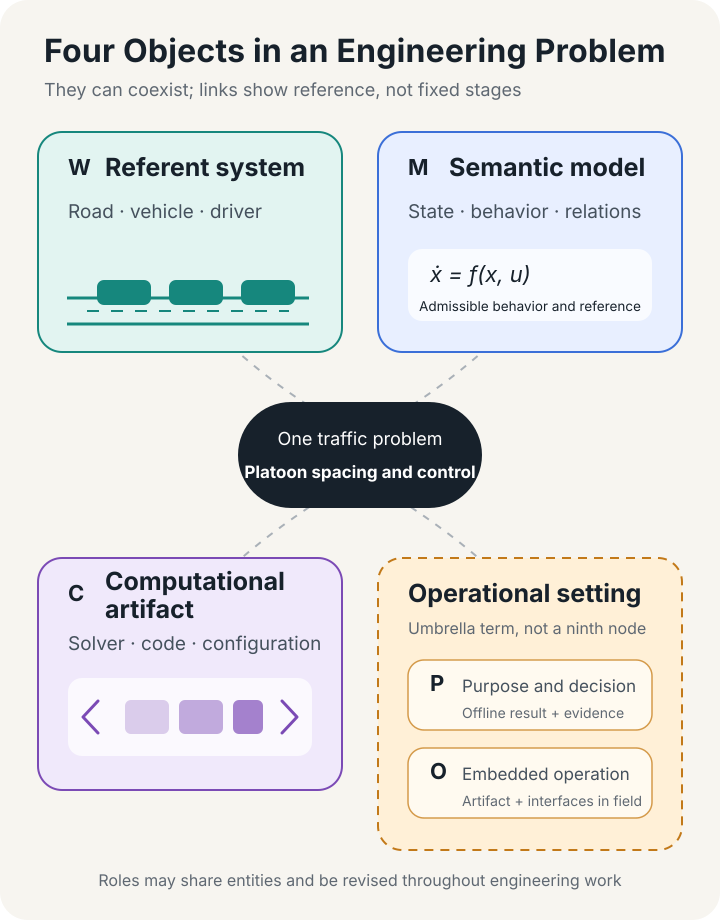
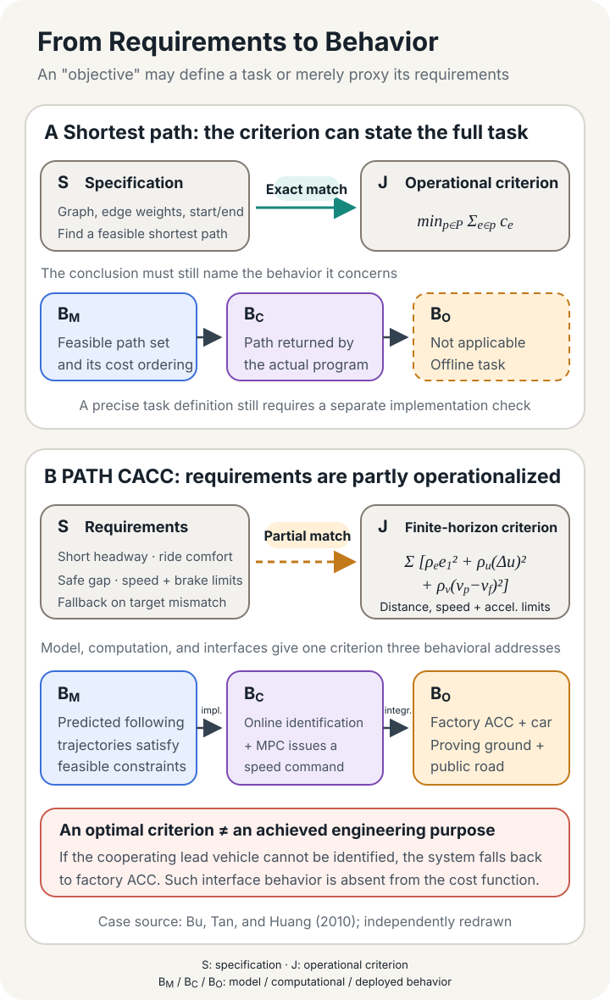
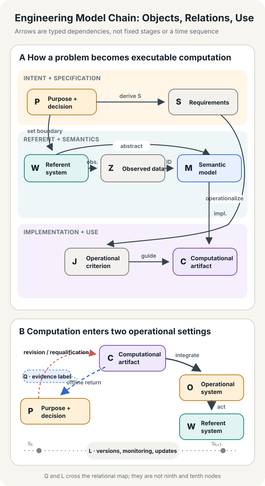
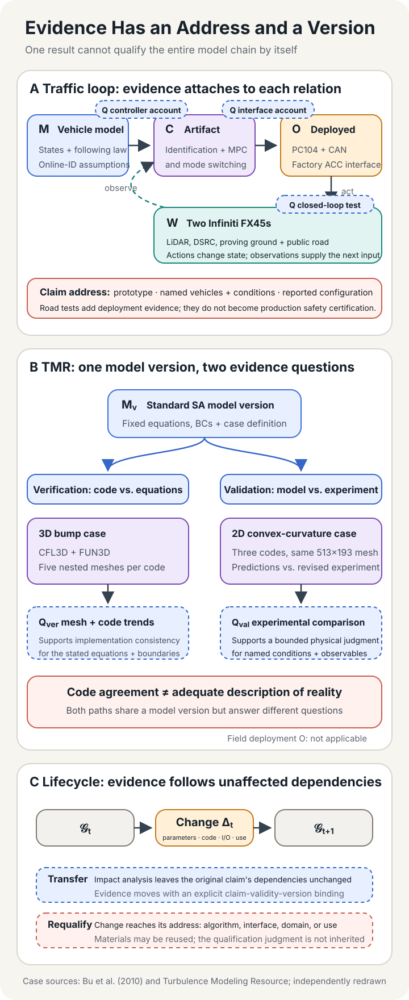

## Three Objects in One Platoon-Control Task

In 2010, researchers at California PATH installed a cooperative adaptive cruise control system on two Infiniti FX45s. The lead vehicle broadcast its speed, throttle, braking, and gear position over DSRC. A PC104 computer in the following vehicle read those messages alongside its own CAN bus and the relative distance measured by LiDAR. Instead of rewriting the engine and brake controllers, the researchers had the new controller generate "virtual" relative-distance and relative-speed signals for the factory ACC system to execute. When the vehicle detected by LiDAR was not the one transmitting the messages, a state machine reconnected the real LiDAR readings to the factory system.[^bu-cacc]

In the paper, the system's "model" appears as a set of longitudinal vehicle equations. Relative distance $x_r$, lead-vehicle speed $v_p$, and following-vehicle speed $v_f$ form the state. The controller identifies unknown traction, drag, and disturbance parameters online from driving data. Once the continuous equations have been discretized, a model predictive controller forecasts future behavior at each time step, constrains following distance, commanded speed, and acceleration, then selects the next speed command.

Engineers who open the running program may also call its matrices, sampling period, parameter bounds, weights, solution procedure, and state machine the "model." On the vehicle, the same word may refer to the operational system formed by clocks, messages, sensors, factory ACC, braking capacity, and the headway selected by the driver. The state-space model in the paper cannot identify the lead vehicle or detect a late DSRC message. An optimal solution in code cannot turn itself into brake force. A following response observed on the road cannot be attributed to one equation alone.

The paper, program, and vehicle use one word for different objects. That shorthand changes the address of an engineering judgment. If a researcher says "the model is stable," the reader needs to know whether stability belongs to the continuous equations, the discrete control law, or the closed-loop vehicle with communication and actuators. If a developer says "the model has been validated," we still need to ask whether the formula, the code, or a set of road conditions was validated. Once the object becomes ambiguous, correctness can move between addresses without notice.

This mismatch gives us the question that runs through the essay: **How is an engineering problem abstracted from a referent system into a semantic model, realized through computation, and brought into a decision or deployment? What does each transformation preserve, and what does it change?**

## One Name, Four Referents

Consider a common piece of engineering shorthand: "We deployed the model from the paper." The sentence crosses at least four familiar referents. A typical runtime path is

$$
\mathcal M_{\Theta}
\longrightarrow
\mathcal M_{\hat\theta}
\longrightarrow
\mathcal C_v
\longrightarrow
\mathcal O_{v,d}.
$$

This is not a pipeline that every model must traverse. A learning system also contains a training artifact $C_{\mathrm{train}}(\mathcal M_\Theta,Z,J)$ that produces $\mathcal M_{\hat\theta}$; the $C_v$ that later performs inference may use different code and hardware. A purely theoretical model may stop at the first term. The arrows denote engineering relations of production and implementation. They do not claim that the four terms are successive life stages of one entity.

The first term, $\mathcal M_{\Theta}$, is a **model family**. It specifies the admissible variables, functions, relations, and parameters. A linear vehicle model, a neural-network architecture, or a family of probability distributions usually first appears in this form. The family determines which interpretations enter the candidate set but does not yet select one concrete computation.

The second term, $\mathcal M_{\hat\theta}$, is a **fixed-parameter model instance**. Its parameters may come from theory, system identification, statistical estimation, calibration, or training. The PATH controller estimates the lead vehicle's dynamic parameters online and passes them into its predictive model; each parameter update leaves a new instance within the same model family. Trained neural-network weights, a point estimate from a Bayesian analysis, and a drag coefficient calibrated against experiments belong here as well. A full posterior is first a distribution over parameter instances. It becomes a concrete probabilistic model instance once it is fixed as a posterior predictive rule.

The third term, $\mathcal C_v$, is a **computational artifact**. The subscript $v$ reminds us that it has a version of its own. Its behavior depends on how data structures represent state, how continuous equations are discretized, which solver handles the optimization problem, where the stopping tolerance is set, whether the computation uses single or double precision, and how libraries and hardware execute the code. Two programs can implement the same equations yet produce meaningful differences because they use different meshes, tolerances, or floating-point paths.

The fourth term, $\mathcal O_{v,d}$, is a **deployed instance with a particular installation and governed configuration $d$**. Once the PATH artifact enters a vehicle, it forms an open system with LiDAR, DSRC, CAN, the PC104 computer, factory ACC, the driver, and the road. Interfaces, units, clocks, message topology, fallback behavior, and actuator limits all begin to affect the result. Sensor aging, network congestion, vehicle load, and other road users usually enter first as the operating context encountered by the same deployed instance. A new $\mathcal O$ arises only when a sensor, protocol, or configuration crosses the declared identity boundary.

Ordinary conversation may keep calling all four objects a "model," provided that the subject of each inference remains clear. A useful diagnostic is: **What single change would change the object under discussion?**

- Changing one runtime input usually produces another execution of the same instance.
- Changing fixed parameters or weights creates another instance in the same model family. Changing the probability family, signature, behavioral semantics, or interpretation usually creates a new semantic model and may create a new family.
- Changing the discretization, solver, tolerance, code, or hardware execution path creates a new computational artifact.
- Changing a sensor, protocol, topology, or governed configuration beyond its identity boundary creates a new deployed instance. Ordinary changes in conditions and time belong to the operating context of the same instance.

Boundary conditions deserve particular care. A model may accept one as an explicit input, fix it as a parameter, or leave it only in deployment configuration. The question "Is it still the same model after the boundary condition changes?" has no general answer outside a declared signature. The object's identity depends on the role that quantity plays in the relation at hand.

*Figure 1. The main text retains four principal objects. The operational setting divides into two paths: a result returns to an offline decision, or a computational artifact enters an operational system and acts on the referent system. Click or double-click to enlarge.*

The figure includes one object that precedes the four referents: the **referent system**. This may be the vehicles, road, flow field, organizational process, or a purely formal object domain that the model claims to address. The semantic model selects relations from it. The computational artifact implements those relations. The operational setting carries output into judgment or action. Figure 1 collapses the two model referents into $M$, adds the earlier referent system $W$, and groups offline and deployed use under the operational setting; the four-item identity chain above continues to refine $M$, $C$, and $O$. The eight roles introduced later are responsibility slots, and one entity may occupy several of them at once.

This distinction also shows why a property sheet for a model often falls short. We can ask what it studies, which relations it uses, what objective it pursues, what architecture it has, and which algorithm it runs. Those five questions are useful, but they do not form five independent coordinates. An objective may come from an engineering requirement or may be only a training loss. Architecture may mean a function family, a software graph, or a communication topology. An algorithm belongs to solution and implementation, which need not belong to the semantic model. Even "dynamics" excludes static relations, probability kernels, and constraint systems. A property sheet flattens the transformations whenever one word crosses several objects.

We will therefore reserve "model" in the narrow sense for a mathematically defined $\mathcal M$. The full chain running through purpose, referent, data, requirements, use, evidence, and version is an **engineering model system**. The name keeps one fact visible: a sequence of transformations carries an engineering claim.

Once the four referents are distinct, the earliest transformation remains hidden inside a black box. A road contains countless vehicles, actions, rules, and contingencies, while an equation retains only a few variables. The way we make that reduction determines what every later computation is about.

## How the World Enters a Model

The PATH prototype did not begin with an abstract notion of "vehicle following." The project was designed to let drivers experience short headways of 0.6 to 1.1 seconds in real traffic and to observe their interaction with cooperative cruise control. That purpose brought two modified FX45s, short headways, vehicle-to-vehicle communication, driver experience, and the constraints of the factory ACC system inside the problem boundary. A study of highway capacity might instead extend the boundary to a long platoon, ramps, and traffic flow. A road-safety certification task would give emergency braking, failure modes, cut-ins, and regulatory conditions greater weight.

Let $P$ denote the purpose and decision context, and let $W$ denote the referent system being studied, designed, or formalized. The arrow

$$
P\xrightarrow{\text{boundary setting}}W
$$

records how the problem selects the system boundary, scale, agents, inputs, outputs, and disturbances. There is no purpose-free "real world" waiting for a model to reproduce it in full. The same stretch of road can support a study of driver experience, controller design, traffic-flow prediction, or crash reconstruction. Each inquiry touches the same physical place and constructs a different referent system.

### Observation Does Not Leave a Copy of the Road

Data enters the engineering chain next. LiDAR on the following vehicle measures relative distance and speed. Its CAN bus supplies vehicle speed, engine state, and brake state, while DSRC messages carry the lead vehicle's state. The PATH team also observed that, under their test conditions, LiDAR-relative speed lagged the speed derived from vehicle communication by about 0.5 seconds. They used that feature to help determine whether the LiDAR target was the communicating lead vehicle.[^bu-cacc]

Every record passes through sensing, sampling, synchronization, selection, and estimation. The relation between data $Z$ and referent system $W$ should remain explicit:

$$
W\xrightarrow{K_{\mathrm{obs},P}}Z.
$$

$K_{\mathrm{obs},P}$ may denote a deterministic measurement procedure or a probabilistic observation kernel. The subscript $P$ records the influence of purpose on observation. Data collected to control headway will not automatically contain everything needed for crash reconstruction, emissions assessment, or a study of driver attention.

Data is not a reduced photograph of $W$. A LiDAR "relative distance" already depends on target detection and coordinate interpretation. A CAN signal depends on an internal vehicle protocol, and a communication message depends on how another vehicle encodes its own state. Missingness, delay, noise, and selection mechanisms belong to the way we encounter the system. Keeping data separate as $Z$ preserves those conditions for later calibration, training, and validation.

### A Model Must Specify Behavior and Interpretation

The move from $W$ to a mathematical model is another transformation. The modeler chooses states, parameters, and relations, specifies admissible behavior, then states what the symbols refer to in the referent system. A semantic model in the narrow sense can be written as

$$
\mathcal M=
(\operatorname{Sig}_{\mathcal M},
 \operatorname{Beh}_{\mathcal M},
 \operatorname{Int}_{\mathcal M}).
$$

$\operatorname{Sig}_{\mathcal M}$ is a typed signature: variables, parameters, inputs, outputs, and state interfaces. Units can also be encoded in the types. In the PATH equations, $x_r$ means relative distance between the vehicles, while $v_p$ and $v_f$ denote lead- and following-vehicle speed. The interpretation relation tells us which onboard signal supplies each quantity and how its coordinates correspond to the road.

$\operatorname{Beh}_{\mathcal M}$ is a typed semantic object. It may be a static relation, a set of trajectories, a probability kernel, a distribution, or an operator. It specifies the responses the model permits. It need not be time-evolving "dynamics." Ohm's law permits a static relation among voltage, current, and resistance. A PDE with initial and boundary conditions may define a solution set or an operator. A statistical model may assign an output distribution to every input. An automaton permits a set of states and transition traces. Calling all of these objects dynamics forces static, probabilistic, and formal models to claim a structure they do not have.

$\operatorname{Int}_{\mathcal M}$ is the interpretation map that sends mathematical symbols back to the referent system. Without it, $\dot x=f(x,u)$ is a formal system that has yet to refer to this engineering object. Once $x$ is identified with vehicle state and $u$ with a speed command, the formal system becomes a model of this engineering problem. Assumptions, validity domains, and qualification records specify the speeds, gears, and operating conditions under which its parameters hold. Two teams may write the same equations yet model different objects because they use different variable interpretations, boundaries, or scales.

This definition deliberately leaves solvers, training scripts, and evaluation programs outside the model. They act on the model and shape the results we see, but "which behaviors are admissible" and "how one behavior is computed" carry different responsibilities. Formal semantics and open-system theory supply languages for separating signatures, behaviors, ports, and composition.[^institutions-open-systems] A discretization or solver may change the resulting parameter instance or even the effective equations when it participates in training, is jointly optimized, or becomes a learned object itself. That feedback must then be recorded against both $C_v$ and $M_{\hat\theta}$.[^solver-training]

### The Same $\mu$ Can Play Four Different Roles

Probability notation makes layer confusion easy to see. A distribution $\mu$ can occupy at least four roles:

1. In a probabilistic model, $\mu$ specifies the probability law of a random variable and belongs to $\operatorname{Beh}_{\mathcal M}$.
2. During training, $\mu_{\mathrm{train}}$ describes how samples enter empirical risk and belongs to the data regime and operational criterion.
3. During qualification, $\mu_{\mathrm{val}}$, or a set of test conditions, records the coverage of the available evidence.
4. During operation, $\mu_{\mathrm{deploy}}$ describes the input regime encountered by the artifact, which may have departed from the training and validation conditions.

Neural-operator studies often express operator-learning error as an expectation over a distribution of functions. This does not make the distribution an intrinsic component of the learned operator in every case. A change in sampling distribution may change training and evaluation without changing the mathematical definition of the target operator.[^neural-operator] In a generative model, by contrast, the conditional distribution is itself the behavior that the model expresses. The role of $\mu$ depends on whether it defines admissible behavior, produces observations, or bounds evidence.

Observation leaves a record of contact with the referent system. A model states the behavior admitted under a chosen abstraction. Identification, calibration, or training can connect the two without making them interchangeable. Engineering must still turn admissible behavior into desired behavior.

## How Equations Become One Actual Computation

The objective of the PATH following controller sounds straightforward: maintain the headway selected by the driver, respond promptly when the lead vehicle changes speed, and provide a ride at least as comfortable as manual driving. The physical system adds further limits. The controller has restricted access to the factory brakes, speed commands have a bounded range, following distance must remain above a safety threshold, and control actions must not saturate the actuator.

A computer still cannot act on these sentences. Let $S$ denote system-level specifications and requirements, and let $J$ denote the criterion that the algorithm computes, estimates, or constrains. The arrow from $S$ to $J$ is **operationalization**:

$$
S\xrightarrow{\mathrm{operationalize}}J.
$$

This arrow is usually a context-dependent, many-to-many relation that may cover only part of the requirements, rather than a function. When needed, write it as $R_{SJ}\subseteq S\times J$. A safe distance and actuator range may become hard constraints. Acceleration, jerk, or control variation may stand in for comfort. Mean squared error may represent predictive accuracy. A preference score may encode whether a foundation model is "helpful." The algorithm works directly on the right-hand side, while engineers remain responsible for the left.

### A Goal That Exactly Matches the Task

Start with a clean case. Given a directed graph $G=(V,E)$ with nonnegative edge weights $c_e\ge 0$, define the task as finding a feasible path from $s$ to $t$ with minimum total edge weight. The specification itself is

$$
p^*\in
\operatorname*{argmin}_{p\in\mathcal P(s,t)}
\sum_{e\in p}c_e.
$$

Here the operational criterion $J(p)=\sum_{e\in p}c_e$ expresses the task exactly. Dijkstra's algorithm and A* with an admissible heuristic are different computational methods for obtaining the same object. As long as the edge weights, graph, and definition of optimality remain fixed, solving $J$ fulfills $S$.

If "shortest path" is meant to describe a route that is safe, punctual, smooth, low-carbon, and acceptable to travelers, the same edge-weight sum becomes a proxy that compresses several values. The way risk preference, travel-time reliability, and road restrictions enter $c_e$ determines which part of the larger task it covers.

Operationalization therefore has at least four common forms: exact correspondence, conservative approximation, empirical proxy, and heuristic substitute. A conservative approximation may sacrifice performance to secure a requirement. An empirical proxy relies on a correlation observed in data, while a heuristic measure supplies direction only. A mature engineering argument identifies which form it uses instead of asking one symbol to stand for value, specification, loss, and evidence at once.

### What an MPC Cost Function Represents

Return to the PATH controller. Let $x_r$ be relative distance, $v_f$ the following vehicle's speed, and $t_{hw}$ the headway selected by the driver. The spacing error is

$$
e_1=x_r-v_f t_{hw}.
$$

The discrete model predicts $N$ steps ahead. Its quadratic cost can be summarized as

$$
J_k=
\sum_{n=1}^{N}
\left(
\rho_e e_1(k+n)^2
+\rho_u\Delta u(k+n)^2
+\rho_v\Delta v(k+n)^2
\right),
$$

where $\Delta u$ penalizes abrupt changes in the speed command and $\Delta v$ penalizes the speed difference between the two vehicles. Positive weights $\rho_e,\rho_u,\rho_v$ trade headway tracking against control smoothness and response speed. The prediction is also subject to a lower bound on distance, limits on the speed command, and upper and lower acceleration bounds.[^bu-cacc]

The expression does not combine safety, comfort, throughput, and driver acceptance into a natural common unit. Its job is more specific. Within a predictive model and a finite horizon, it uses a distance threshold for part of the safety boundary, acceleration and control variation as partial proxies for comfort, then weights those terms to choose a control sequence. Driver experience still requires road tests. Identifying the cooperating lead vehicle still requires a state machine and fallback. Risks beyond the prediction horizon still need other evidence.

The distinction resolves a common misunderstanding. A hard constraint in an MPC problem holds if the problem is feasible and solved under the stated model; it does not automatically become a hard guarantee for the physical vehicle in every environment. An error in state estimation, a braking response outside the model, or a late message can separate the actual trajectory from the predicted one. "The optimization problem satisfies its constraints" and "the vehicle satisfies its field requirements" are two claims that need a connecting argument.

*Figure 2. In the shortest-path example, the specification and objective can coincide exactly. In platoon control, the objective and constraints operationalize only part of the engineering requirements, while computation and field integration continue to alter behavior.*

### A Solver Operates on a Different Object

The predictive controller does not solve the continuous equations directly at every time step. The PATH team first discretized the continuous state model as

$$
x_{k+1}=F_T(x_k,u_k;\hat\theta_k),
$$

where $T$ is the sampling period and $\hat\theta_k$ contains parameters identified online. The controller uses this discrete model to generate a future trajectory, solves a constrained optimization problem, applies only the first element of the control sequence, then reads new observations, updates its parameters, and solves again. The MPC "model" therefore spans at least the model family, the current parameter instance, a discrete representation, and one online optimization.

Call the representation, algorithm, code, and runtime configuration that produce output the computational artifact $C$. Its behavior is

$$
B_C=\llbracket C\rrbracket,
$$

the output, timing, and resource traces produced under given inputs, resources, and configuration. The abstract behavior of the semantic model is

$$
B_M:=\operatorname{Beh}_M.
$$

An implementation relation asks how far $B_C$ preserves $B_M$. For a numerical model, the answer may be an error bound. A compiled controller brings discretization, tolerance, and finite precision into the relation. A formal system may require a refinement relation. The phrase "the algorithm implements the model" skips the arrow where some of the most consequential failures occur.

A separate multilayer platoon-control experiment gives a closer view of that arrow. Ibrahim and colleagues split each following vehicle's controller into two layers. The upper distributed MPC received lead-vehicle messages and solved a receding-horizon quadratic program at 10 Hz; the lower state-feedback layer executed desired acceleration on a 2 ms cycle. The researchers used the Fast Gradient Method, fixed matrices that could be computed offline, generated C code automatically from MATLAB, and ran it on four Cohda MK5 units. Packet loss, noise, delay, and short stalls in a non-real-time operating system all left traces in the results.[^ibrahim-dmpc]

Ibrahim's study describes a separate system. It shows how the same MPC idea takes a concrete shape in another artifact. The optimization problem in the paper specifies the object to be solved. Matrix precomputation, the iterative method, code generation, processors, and deadlines determine whether this computation finishes in time. Simulation on four embedded devices supports real-time implementation feasibility. Vehicle dynamics and road deployment still require separate evidence.

### Probabilistic Programs, PDEs, and PINNs Pass Through the Same Gate

This layer is not peculiar to control. In Stan, a program can specify parameters, observations, and a target log density, usually unnormalized, conditional on the data. Independent Bernoulli observations given $\theta$, for example, define the probability kernel

$$
K(\theta,\{y\})=
\prod_{n=1}^{N}
\theta^{y_n}(1-\theta)^{1-y_n}.
$$

Here $\theta\in[0,1]$ and $y\in\mathcal Y=\{0,1\}^N$. For any event $A\subseteq\mathcal Y$, $K(\theta,A)=\sum_{y\in A}K(\theta,\{y\})$. "Kernel" here means a mapping from a condition to a probability measure, not a similarity function from kernel methods. It belongs to the model's probabilistic semantics. The Stan statement `y ~ bernoulli(theta)` increments the target log density; one can then sample with HMC, usually using NUTS, or optimize instead. Changing the inference algorithm does not by itself change the probabilistic semantics, although the output samples and approximation error can change with algorithm, initialization, and computational budget.[^stan]

A PDE passes through the same distinction. Once function spaces and initial and boundary conditions are specified, the continuous problem

$$
\mathcal L_a u=f,
\qquad
u|_{\partial\Omega}=g
$$

first defines a solution set. It defines a corresponding single-valued solution operator only when the problem is well posed and $a$, $f$, or $g$ is designated as input. A weak solution of a conservation law may also require an entropy condition or another solution-selection rule. A program chooses a mesh $h$, discretization scheme, linearization method, and stopping tolerance. A linear discrete problem can be written as

$$
A_h u_h=f_h.
$$

A more general nonlinear problem may be written $R_h(u_h)=0$, while a time-dependent system produces a time-stepping map. Mesh convergence, residuals, and code comparison provide complementary evidence. No one of them alone shows that a numerical result approaches the selected continuous solution.

A PINN compresses relations from several layers into one training process. PDE residuals, boundary conditions, and observations are often combined as

$$
J_{\mathrm{PINN}}
=\lambda_r J_{\mathrm{res}}
+\lambda_b J_{\mathrm{bc}}
+\lambda_d J_{\mathrm{data}}.
$$

The equation may define the semantics of the target solution, while a boundary condition may be a hard requirement. Once weighted, all three terms become a training criterion. Gradient imbalance or optimization difficulty can leave the expected solution unlearned even as aggregate loss falls. Failure analyses have traced some cases to an ill-conditioned optimization landscape created by the composite loss rather than to a change in the solution semantics of the target equation.[^pinn-failure] $J_{\mathrm{res}}$ and $J_{\mathrm{bc}}$ are also usually empirical quantities evaluated at finitely many collocation points. A low empirical loss does not bound the continuous residual everywhere or directly establish error against the true solution. Saying that "physics is in the loss" describes an implementation arrangement. The physical law, training criterion, and optimization algorithm still need separate traces.

We have now moved from behavior admitted by the semantic model to output produced by the computational artifact. The next step determines where that output ends: on an engineer's screen, or inside a closed loop that changes the referent system.

## How Computation Returns to the World

Not every engineering use ends in deployment. A CFD program may calculate the flow around an airfoil so that an engineer can compare designs. A statistical model may estimate risk so that an analyst can decide whether to run another experiment. On this offline path, computational behavior and its evidence return to the original decision context:

$$
(B_C,Q)\xrightarrow{\mathrm{inform/justify}}P.
$$

For now, read $Q$ as the basis and conditions of use attached to the result. It will soon become a qualification record. An offline use has no actuator, but its output still needs an interpretation, an account of error, and an identified decision-maker.

A controller takes another path. The computational artifact is first integrated with sensors, communication, actuators, and runtime software to form an operational system $O$. Its actions then change the referent system:

$$
C\xrightarrow{\mathrm{integrate}}O
\xrightarrow{\mathrm{act}}W.
$$

Along this path, interfaces become part of the engineering claim rather than an implementation detail.

### How a Speed Command Reaches the Wheels

The PATH MPC outputs a speed command $u=v_c$, not a throttle opening or brake pressure. The following vehicle also contains a fast inner speed-servo loop. Its factory Nissan ACC accepts virtual LiDAR-relative distance and speed, then drives the engine and brakes. The team accepted this longer actuation chain because it reduced modifications to the original ECU. In return, the new controller had to include a factory controller it knew only partially in the closed loop and accept the roughly $0.3g$ braking limit available through that interface.[^bu-cacc]

Message identity matters too. The system enters CACC mode only after confirming that the LiDAR target is the same lead vehicle sending DSRC data. If the targets do not match, the state machine passes real LiDAR data back to the factory ACC. This state machine carries responsibility for mode semantics, interface routing, and fallback. Copying only the MPC formula would remove the part of the engineering design closest to its failure boundary.

The same FX45 can appear in both $W$ and $O$. As part of $W$, it is the vehicle we seek to describe and control, with mass, drag, actuation delay, and a driver. As part of $O$, it is the operational system into which the computational artifact is embedded, supplying CAN, sensing, communication, and braking interfaces. The framework distinguishes responsibilities; it does not require a separate physical object for each role.

Field feedback also changes the next round of information. A speed command changes vehicle motion. Motion changes LiDAR and CAN readings. New observations feed the next online identification and optimization. The sequence $W\to Z\to M\to C\to O\to W$ therefore forms a closed loop. Once the computational artifact enters a deployed system, the semantic model continues to describe the world while actions from the closed loop change what the next observation encounters.

### Naming the Eight Roles in the Closed Loop

All eight roles in the engineering model chain have now appeared:

| Role | Question in the PATH case |
|---|---|
| $P$: purpose and decision context | Why study shorter headways, and whose decision should the result support? |
| $W$: referent system | Which vehicles, roads, drivers, communication links, and disturbances belong to the problem? |
| $Z$: information and data | How are LiDAR, CAN, DSRC, and test records produced, and what delays or missing data do they contain? |
| $M$: semantic model | Which states, parameters, dynamics, and mode transitions are permitted? |
| $S$: specification and requirements | Which conditions govern spacing, comfort, actuation range, fallback, and acceptance? |
| $J$: operational criterion | Which quantities does the MPC calculate, optimize, or constrain? |
| $C$: computational artifact | How are the problem and its state discretized, identified, solved, terminated, encoded, and executed under resource limits? |
| $O$: operational system | How does the artifact connect to the vehicle, protocols, clocks, driver, and field environment? |

These are not eight independent dimensions or stages that can only proceed forward. A computational budget may force engineers to shorten the prediction horizon or rewrite the objective. Interface tests may uncover an error in state interpretation. Road results may reopen the purpose and system boundary. The structure is better read as a typed responsibility graph: each node holds a kind of object, while each arrow records a transformation and its conditions.

*Figure 3. The complete relational map of the engineering model chain. Qualification $Q$ attaches to specific claims and relations, while lifecycle trace $L$ runs along a version track, so neither appears as a ninth peer node.*

### "Correct" Needs an Object

The complete map lets us separate several kinds of correctness that often borrow one another's names. Define

$$
B_M:=\operatorname{Beh}_M,
\qquad
B_C=\llbracket C\rrbracket,
\qquad
B_O(\xi)=\operatorname{Beh}_{\mathrm{obs}}(O,\xi),
$$

as the behavior object of the semantic model, the execution behavior of the computational artifact, and the set of observable behaviors that a deployed instance may exhibit in a complete operating context $\xi$. Specifications can be separated by the object that carries them:

$$
S=(S_M,S_C,S_O,S_R).
$$

$S_M$ constrains mathematical behavior, such as conservation, stability, or a logical invariant. $S_C$ constrains the artifact's resource use, determinism, and failure behavior. $S_O$ constrains field safety, performance, and reliability. $S_R$ constrains correspondence, error, refinement, and interfaces between model and implementation and between implementation and system.

Before comparing computational and abstract behavior, we also need a shared interface, observables, and time base. Let $B_C\in\mathcal B_C$ and $B_M\in\mathcal B_M$, and let $\alpha_{CM}:\mathcal B_C\to\mathcal B_M$ project artifact behavior back into model behavior. A core behavioral argument may include

$$
B_M\models S_M,
\qquad
\alpha_{CM}(B_C)\;R^{\tau}_{\varepsilon}\;B_M,
\qquad
B_C\models S_C,
\qquad
\forall\xi\in\Xi_Q,\;\forall b\in B_O(\xi),\;b\models S_O.
$$

A mathematical proof may support the first expression. The second instantiates a model-to-implementation relation in $S_R$. Tests and real-time measurements may support the third. The fourth is a robust statement over the qualified context domain $\Xi_Q$. The problem type $\tau$ determines $R^{\tau}_{\varepsilon}$: numerical work may use a norm bound, robust control a disturbance envelope, and formal methods a refinement relation. A probabilistic field claim instead requires $Q$ to supply a joint measure $\nu_Q$ over contexts and behavioral outcomes, together with a declared risk bound $\Pr_{(\xi,b)\sim\nu_Q}[b\models S_O]\ge 1-\delta$ and evidence for its estimate. If the evidence contains one road observation, the conclusion can address only that observation. Not every case needs all eight roles, but every relation carrying the present claim needs evidence.

Mathematical proof, software testing, and road experiments now form a traceable chain without collapsing into one score. A three-vehicle PATH test can observe responses in a finite platoon; it cannot prove a statement quantified over arbitrary platoon length. Conversely, an abstract proof of string stability cannot speak for fielded vehicles on its own if it omits target identification, braking limits, and communication implementation.

Each layer now has claims of its own. The engineering question becomes more precise than "Is the model correct?": How can local evidence support a judgment adequate to the present use?

## Trust Has an Address and a Time

"This model has been validated" sounds complete, but it lacks an object and conditions. Which claim was validated, for what use, with which version, and over what domain? Accuracy on a held-out test set, mesh convergence in a fluid solver, a stability proof for a control law, and one public-road test can all be strong evidence. They support different claims.

Represent one claim and its basis as a qualification record $q_k$:

$$
q_k=(
\mathrm{claim},
\mathrm{intended\ use},
\mathrm{assumptions},
\mathrm{evidence},
\mathrm{uncertainty},
\mathrm{validity\ domain},
\mathrm{residual\ risk},
\mathrm{status},
\mathrm{version}).
$$

The records form a qualification package $Q=\{q_k\}$. It does not award the model a permanent badge of "trustworthiness." It gives each engineering judgment an address: the object or relation on which the claim falls, the source of evidence, and the operational setting that the evidence can support.

The PATH paper can support a claim of this form: in the reported proving-ground scenarios and one public-road test, the prototype tracked selected headways between 0.6 and 1.1 seconds; a three-vehicle test also observed an improved following response under CACC compared with the factory ACC. The paper records the two-vehicle architecture, the roughly $0.3g$ braking limit, the purpose of studying short headways, and the test scenarios. Rewriting the claim as "any CACC platoon is safe on public roads" changes its subject, quantifier, and use beyond the evidence.

NASA's standard for models and simulations incorporates this relation into engineering procedure. NASA-STD-7009B defines permissible use through intended use, assumptions and abstractions, model limitations, and the verification and validation domains. When a proposed use arises, engineers must compare it again with the permissible use and record both the actual use and the specific version.[^nasa-7009] The qualified object is therefore not a set of equations detached from context. It is the ability of a particular version to produce a class of results for a specified use and validity domain.

### Two Evidence Paths Should Not Become a Ladder

The Turbulence Modeling Resource (TMR) makes evidence addresses unusually clear. It fixes a turbulence-model version, equations, boundary conditions, meshes, and reference results so that different CFD implementations can be compared around the same problem. The pages for the standard Spalart-Allmaras (SA) model expose two distinct evidence paths.[^tmr]

In the three-dimensional bump-in-channel verification case, CFL3D and FUN3D each compute solutions on five nested mesh levels. Engineers inspect trends under mesh refinement and compare how different codes implement the same equations and boundary conditions. Where quantities from both codes converge along a common trend, agreement strengthens the case that the programs consistently solve the declared mathematical problem. The TMR page keeps this question separate from whether the model matches experiments well.

In the two-dimensional convex-curvature validation case, results from three codes on the same $513\times193$ mesh nearly coincide and are then compared with revised experimental data. Code agreement makes a code defect a less likely explanation for any discrepancy. The remaining gap between computation and experiment must still be interpreted among model form, discretization error, boundary conditions, and experimental uncertainty. The page also states that it contains no full grid study, so the results are representative comparisons rather than "truth."

The two paths are often drawn as a staircase from "low confidence" to "high confidence." They work better as evidence lines aimed at different relations:

- **Code and solution verification** addresses the implementation relation between $C$ and $M$: whether the computational artifact faithfully implements the specified mathematical model, and with how much numerical error.
- **Model validation** addresses $M\leftrightarrow W$: how well the model reproduces the experimental referent for a given use, condition, and quantity of interest.
- **Uncertainty quantification** traces how inputs, parameters, numerical error, and model discrepancy enter results and claims.

Code verification and experimental comparison narrow different uncertainties, so industrial VVUQ practice records them separately.[^nist-vvuq]

*Figure 4. Evidence has an object address and a version address. Code agreement, physical validation, and field performance accumulate along different relations. When an object changes, engineers must check which old claims can still carry their evidence.*

Once evidence has an object address, the next question is whether it survives a change to that object.

### A Version Number Only Indexes Change

Represent all objects and relations in the current case as a graph

$$
\mathcal G_t=(V_t,E_t;Q_t,L_t).
$$

When data, parameters, formulas, code, interfaces, purpose, or environment change, the system moves to

$$
\mathcal G_t\xrightarrow{\Delta_t}\mathcal G_{t+1}.
$$

The value of $\Delta_t$ lies in identifying what the change touched, not in recording that an "upgrade" occurred. One replacement may leave the semantic model intact while invalidating prior evidence. A parameter update may create a new model instance while preserving some solver tests.

| Change | Where the new identity usually lies | Relation to recheck first |
|---|---|---|
| Online identification produces new fixed parameters | $M_{\hat\theta}$ | Parameter validity domain, prediction error, and control qualification |
| Discretization, solver, or precision changes | $C_v$; if it participates in training, it may also produce a new $M_{\hat\theta}$ | $\alpha_{CM}$, numerical error, real-time performance, and the effective trained model |
| Sensor, protocol, or message topology changes | $O_{v,d}$ | Observation, interface, closed-loop behavior, and fallback |
| The same result is used for a new decision | $P$ and $Q$ | Proposed use against existing permissible use |
| Training data or objective changes and the system is retrained | $Z,J$; after retraining, a new $M_{\hat\theta}$ | Data lineage, proxy relation, and downstream behavior |

Old evidence can migrate only when the objects and assumptions on which it depends remain unaffected. A version number points to the change. Impact analysis and requalification close the chain of reasoning again.

Adaptive systems bring this question into runtime. Suppose an update rule $U$, new data $D_t$, and governance policy $R_t$ jointly produce

$$
\mathcal G_{t+1}=U(\mathcal G_t,D_t,R_t).
$$

A change in parameters, structure, objective, or interface places at least one new object or relation in $\mathcal G_{t+1}$. Its identity lies in $M$, $J$, $C$, or $O$ according to where the change occurs. These objects may remain within one governed system lineage only if the update range, triggers, acceptance criteria, monitoring, and fallback have been defined. The US Food and Drug Administration's 2025 final guidance on predetermined change control plans for AI-enabled medical-device software applies this structure to automatic continuous learning. Predetermined modifications, verification and acceptance criteria in the modification protocol, impact assessment, and ongoing post-update monitoring jointly bound acceptable change. The guidance recommends that a modification which fails its preset acceptance criteria and cannot be corrected should be recorded as a failure and not implemented.[^fda-pccp]

The example comes from medical-device regulation but exposes a general engineering responsibility. The qualified object in online learning includes the update rule, guardrails, observations, and fallback, in addition to the current weights. Once a change leaves the established envelope, the system needs a new fitness-for-use judgment. "Continuous learning" cannot become an alias for automatic inheritance of evidence.

### Guarantees Change Shape When Components Are Connected

Versioning tracks change over time; composition tracks structural connection. Reusing an engineering component requires more than saving its code. A composable primitive record $\pi$ should expose its ports $\partial\pi$, behavioral semantics $\llbracket\pi\rrbracket$, assume-guarantee contract $K_\pi=(A_\pi,G_\pi)$, qualification evidence $Q_\pi$, and version $v_\pi$:

$$
\pi=(\partial\pi,\llbracket\pi\rrbracket,K_\pi,Q_\pi,v_\pi).
$$

A wiring or composition operation $\omega(\pi_1,\ldots,\pi_m)$ first matches ports, then checks whether one component's guarantees discharge another's assumptions, and finally establishes compatibility between the composed behavior and the component semantics. $Q_\pi$ records the basis for these claims. It cannot make a system-level qualification package equal the sum of local evidence.

Platoon control supplies a concrete primitive. The unit should include more than a controller $K_i$; it must package the controller, vehicle dynamics, constant-time-headway policy, and communication boundary as a single "controlled-vehicle" component. We now switch to a different CACC system developed by Ploeg and colleagues. Following their notation, $u_i$ is the desired acceleration of vehicle $i$, not the PATH prototype's speed command $u=v_c$. In their continuous-time linear model with one-vehicle look-ahead, the propagation channel between adjacent vehicles is

$$
\Gamma_i(s)=\frac{u_i(s)}{u_{i-1}(s)}.
$$

Under homogeneous continuous-time LTI dynamics, unidirectional coupling, identical controllers and headways, the same fixed communication delay, and the conditions in the paper's Assumption 1, controller synthesis gives

$$
\|\Gamma_i\|_{\mathcal H_\infty}\le 1.
$$

For an input-output analysis with equilibrium initial conditions, homogeneity gives $\Gamma_i=\Gamma$. If ports and assumptions close along the entire string, then for every platoon length $m$ and $2\le i\le m$,

$$
u_i(s)=\Gamma(s)^{\,i-1}u_1(s),
\qquad
\|u_i\|_{L_2}
\le
\|\Gamma\|_{\mathcal H_\infty}^{\,i-1}\|u_1\|_{L_2}
\le
\|u_1\|_{L_2}.
$$

This expression gives the propagation condition for strict $L_2$ string stability. Definition 1 in the paper also requires, for general initial conditions, a bound on the initial-condition response that does not diverge with platoon length. The system-level result comes from composing propagation channels and quantifying over arbitrary platoon length, not from taking the union of several vehicles labeled "locally correct."[^ploeg]

A change in topology changes the form of the guarantee. With two-vehicle look-ahead, each vehicle receives two upstream signals that share causes, so the system can no longer be decomposed into the same single-input adjacent propagation units. Ploeg and colleagues instead use the leader-to-vehicle-$i$ channel

$$
\Theta_i(s)=\frac{u_i(s)}{u_1(s)},
$$

and analyze semi-strict $L_2$ string stability accordingly. Adding one communication link changes both the decomposition and the contract that can be stated. Compatible ports, units, and message formats show that the system can be connected. Assumption closure, error propagation, common-cause failures, and emergent behavior still require system-level evidence.

The example also shows why evidence cannot be added mechanically. Non-amplification of an $L_2$ disturbance is a property of string response, not a guarantee that safe distance holds at every instant. The theoretical model excludes nonlinear limits such as emergency braking. A finite experiment with two or three vehicles cannot exhaust a statement about arbitrary platoon length. Local models, composition theorems, and finite experiments each have a clear address. Together they support one bounded engineering judgment.

The engineering model chain can now follow a controller through purpose, road, data, equations, solution, vehicle, evidence, and version. We can test the view by removing familiar pieces. Does it still work without dynamics, training data, field deployment, or a use that can be enumerated in advance?

## Keep the View, Change the Model

We can now alter the most familiar internal structures of a model and see which relations continue to carry work and which roles should fall silent.

### Remove "Dynamics": Static Relations Still Pass Through the Engineering Chain

The macroscopic traffic-flow theory of Lighthill and Whitham begins with a static relation: flow $q$ depends on vehicle concentration $k$,

$$
q=f(k).
$$

This relation has no temporal state. Combining it with vehicle conservation yields what is now called the kinematic-wave equation,

$$
\partial_t k+\partial_x f(k)=0.
$$

The extended semantic model therefore contains both a static flow-concentration relation and a differential operator constraining the full space-time field. The original paper situates its continuum approximation among many vehicles on long, congested roads and describes the empirical support available at the time as qualitative agreement. That boundary belongs to the model's interpretation along with the equation.[^lwr]

If an engineer uses only $q=f(k)$ for one capacity calculation, the computational artifact may shrink to a lookup table or a manual calculation procedure. Field deployment $O$ can be marked not applicable. Purpose $P$, referent $W$, semantic model $M$, computation $C$, and qualification $Q$ remain. With no data, $Z$ need not be invented. With no optimization task, $J$ can also be absent. A missing role limits the claims that can be made but does not damage the remaining relations.

Formal models carry this reduction further. A hybrid automaton can represent a thermostat as a combination of discrete modes and continuous temperature. Temperature decays in the off mode and rises in the on mode. Guards permit switching, while invariants restrict the states permitted within each mode. Its behavioral semantics is a set of execution traces alternating continuous flows and discrete jumps, not the single curve drawn by one simulation.[^hybrid-automata]

In model checking, the referent domain may be the formal system under analysis, the specification $S$ a temporal-logic sentence, the semantic model $M$ the set of admissible traces, and the computational artifact $C$ a state-space search or certificate generator. The satisfaction relation

$$
M\models S
$$

means that every admissible trace of $M$ satisfies $S$. This relation keeps specification distinct from model. It may involve no sensor data, training loss, or physical deployment. If every "goal" were forced into a functional to be minimized, a logical property would have to change its name. In the relational map it retains its own mathematical type.

Pure mathematical objects show the boundary of applicability. A group, topological space, or differential equation may still have a formal referent domain $W$. It remains outside the engineering model chain when there is no engineering purpose $P$, path of use, or qualification claim $Q$. The missing roles need not be filled. The engineering model chain studies how mathematical objects participate in engineering judgment or become engineering modules; it does not absorb mathematics itself.

### Let One Formula Occupy Several Roles

The second test retains the parts but lets them overlap. The PINN already lets one PDE define solution semantics and contribute to a training loss. A neural-network architecture can define the function family $M_\Theta$ while appearing in the artifact $C_v$ as a computational graph and tensor operators. One stretch of code may occupy several roles, but the implementation relations among those roles must remain visible.

Neural operators provide another angle. A target operator

$$
\mathcal G^\dagger:\mathcal A\to\mathcal U
$$

maps input functions to solution functions. The training distribution $\mu_{\mathrm{train}}$ determines which inputs are encountered more often, while the discrete mesh determines how functions are represented during training and execution. Changing the training distribution usually leaves the target operator $\mathcal G^\dagger$ unchanged but alters aggregate risk, the resulting $M_{\hat\theta}$, and the evidence envelope. For a neural operator that has genuine discretization invariance and fixed parameters, a change of mesh mainly affects $C$. With a fixed-grid architecture or retraining, it may also affect $M_\Theta$ or $M_{\hat\theta}$.

Foundation models push this overlap into large-scale reuse. A pretrained artifact $b$ can accumulate capability tests, training-data documentation, and general risk analysis without yet facing each downstream purpose, interface, and consequence. A more suitable unit of qualification is

$$
Q_{b,u,d}=Q(
\text{base artifact }b,
\text{use case }u,
\text{deployment }d).
$$

The same foundation model may summarize traffic reports, forecast travel demand, recommend signal timing, or participate in safety-related control. The outputs may look similar while error costs and field feedback differ. Base evidence can be reused; permitted use cannot be inherited in bulk.

Underspecification in machine learning shows that several instances can perform similarly on standard tests while behaving very differently under stress or in deployment. Research on goal misgeneralization shows another possibility: a system acquires the required capability on the training distribution but pursues the wrong objective in a new context.[^underspecification-goal] Repeating the same average $J_{\mathrm{eval}}$ score cannot resolve either problem. We need to know which $M_{\hat\theta}$ training produced, which $O$ received it, which environments the evaluation evidence covered, and whether the relation between $J$ and the real specification $S$ still holds.

Causal models change the type of query again. The same variables and structure can answer observational, interventional, or counterfactual questions, each under its own identification assumptions. The same data distribution does not imply the same answer to all three. Here the engineering model chain adds relation subtypes rather than a universal numerical dimension called "causality."

### Let the Referent System and Model Move Together

The third test allows the boundary to change over time. A digital twin is often reduced to a live 3D image next to a physical object, but its persistent relation to a particular entity is the distinguishing feature. The United Kingdom's Defence Science and Technology Laboratory issued an official definition in 2025 that binds a digital twin to a specific entity, requires the capability for explicit bidirectional data flow, records an assumption set and validation envelope, and maintains synchronization on a timescale fit for the current decision. It also distinguishes connected, semi-connected, and disconnected states.[^dstl-twin]

That definition assigns concrete responsibilities: what is bound to what, which way data flows, how stale a state may be while still supporting the current decision, and how the physical system continues safely during disconnection. Its manufacturing example permits updates within a 24-hour window. An aircraft engine must catch up after landing and before its next state update, while control may demand millisecond timing. Purpose determines synchronization; the word "real-time" cannot settle it by itself.

In a connected state, $W\to Z\to M\to C$ repeats at the synchronization rate. A change in physical state refreshes the digital artifact through observation; simulation or optimization results may return as maintenance, scheduling, or control decisions. When a synchronization rule, model parameter, or interface changes, lifecycle trace $L$ must record the new identity and the effect on qualification. A polished 3D interface without binding, synchronization semantics, validity domain, or disconnected behavior provides visualization but does not complete the engineering relation.

A sociotechnical system extends feedback further. Once deployed, a prediction may change people's choices, resource allocation, and the next data set. Perdomo and colleagues use a distribution map $D(\theta)$ to represent the effect of model parameters $\theta$ on the future data-generating process, then study stability under repeated training in performative prediction.[^performative] The path $O\to W\to Z$ can therefore describe a controller changing physical state or a score, recommendation, or governing rule changing participants' behavior.

This is best used as a mechanism check. If deployment helps produce the next data distribution, treating drift only as an external environmental change misses the causal loop. The referent system, data regime, and model instance must be recorded on the same timeline.

### Generality Lies in the Relations

These stress tests leave a small common structure, which is why it is useful. Static relations have no temporal dynamics. Formal models have no training loss. Offline CFD has no deployment loop. Foundation models usually face many downstream uses, while digital twins continuously change state and version. Their internal structures cannot be compressed into one set of orthogonal coordinates.

The framework is general because it identifies recurring engineering functions. Within a declared purpose, we can still trace purpose to referent, semantics to computation, and use to evidence. A model's internal mathematics cannot discharge those engineering responsibilities on its own.

Data, objective functions, field deployment, and online feedback are conditional roles. Their presence depends on the work assigned to the model. A role that does not apply should be marked as such. If the role is necessary to the claim under review, its absence is an evidence gap. The resulting generality belongs to the **observation and organization of relations**; it does not require every model to share one ontology.

Structurally, this view contains three responsibility layers, eight candidate roles, two cross-cutting mechanisms, two paths of use, and four common referents. The intent-specification layer holds $P,S$; the referent-semantics layer holds $W,Z,M$; and the implementation-use layer holds $J,C,O$. Qualification $Q$ and lifecycle trace $L$ cross the whole graph. Offline results return to a decision context, while embedded artifacts enter an operational system. Model family, fixed-parameter instance, computational artifact, and deployed instance retain distinct identities. These counts describe different aspects of the view, not dimensions that can be added together.

The precise name for this structure is the **layered-relational-qualification framework for engineering model systems**. The main text calls it the **engineering model chain**. "Chain" here means a chain of reasons. It can be followed from purpose to result, or backward from an anomaly through versions, interfaces, and assumptions.

## Three Views of Engineering Models

This essay follows the engineering relation chain, tracing how a model relates to reality, requirements, computation, deployment, evidence, and versions. [*What Is Inside a Model?*](/en/posts/inside-the-model/) opens the semantic model and examines its signature, formal presentation, semantics, and observations. [*How a Model Becomes a Component*](/en/posts/model-as-open-component/) fixes several open boundaries and studies ports, behavior, contracts, wiring, and replacement.

These views are three ways of changing scale around the same object, not levels or mutually exclusive axes. They can overlap and recur as a boundary moves. Behavioral equivalence under a declared observation does not by itself establish contextual substitutability: new wiring, environmental assumptions, or feedback can expose distinctions that the observation discarded.

## Five Questions to Ask About Your Model

Return to the two Infinitis. An engineering discussion may use "model" for the vehicle equations in the paper, the parameters obtained through online identification, the control program running on the PC104, and the vehicle-following system on public roads. We can now see the transformations hidden by that name. Purpose sets a boundary around the road. Sensors produce delayed data. Equations define admissible behavior. Objectives and constraints operationalize engineering requirements. Discretization and a solver produce actual output. Interfaces deliver that output to the factory ACC, and tests provide evidence for a particular version under specified conditions.

You do not need to draw the full eight-node graph before discussing your own model. Begin with the most important engineering claim on your desk and ask five questions in sequence:

1. **Which object am I talking about?** A model family, a calibrated or trained instance, an executable artifact, or a deployed instance with a specified installation and configuration?
2. **What does it refer to?** Which referent system did the present purpose select? What did we observe as $Z$, and what did we posit as $M$?
3. **How does mathematics become computation?** How does the real specification $S$ enter operational criterion $J$, and how do discretization, solution, training, and hardware form $C$?
4. **Where does the output go?** Does it return one offline judgment, or enter $O$ and change $W$ through interfaces, clocks, and actuators?
5. **How far can the evidence accompany the claim?** Which assumptions, validity domain, and versions support the claim, and which changes would trigger requalification?

These questions do not choose an equation, controller, network architecture, or validation standard for the engineer. They keep each kind of knowledge within the position it can support and expose the losses introduced by transformation. Engineering reality resides in those transformations. By naming objects, relations, and evidence, engineers can construct a chain of reasons that remains open to inquiry, composition, and verification.

---

[^bu-cacc]: Fanping Bu, Han-Shue Tan, and Jihua Huang, "Design and Field Testing of a Cooperative Adaptive Cruise Control System," *Proceedings of the 2010 American Control Conference*, pp. 4616-4621, [DOI: 10.1109/ACC.2010.5531155](https://doi.org/10.1109/ACC.2010.5531155). See Sections II-III.A for the system architecture and fallback, Section III.C for the model, online identification, MPC cost, and constraints, and Section IV for the finite-vehicle and road tests.

[^institutions-open-systems]: Joseph Goguen and Rod Burstall, "Institutions: Abstract Model Theory for Specification and Programming," *Journal of the ACM* 39(1), 1992, [DOI: 10.1145/147508.147524](https://doi.org/10.1145/147508.147524); Dmitry Vagner, David Spivak, and Eugene Lerman, "Algebras of Open Dynamical Systems on the Operad of Wiring Diagrams," *Theory and Applications of Categories* 30, 2015, [open preprint](https://arxiv.org/abs/1408.1598). The first separates signature, model, sentence, and satisfaction; the second separates typed ports, wiring, and system semantics.

[^neural-operator]: Nikola Kovachki et al., "Neural Operator: Learning Maps Between Function Spaces with Applications to PDEs," *Journal of Machine Learning Research* 24, 2023, [article and open full text](https://www.jmlr.org/papers/v24/21-1524.html).

[^ibrahim-dmpc]: Amr M. E. Ibrahim et al., "Multi-layer Multi-rate Model Predictive Control for Vehicle Platooning under IEEE 802.11p," *Transportation Research Part C* 124, 2021, article 102905, [DOI: 10.1016/j.trc.2020.102905](https://doi.org/10.1016/j.trc.2020.102905), [open full text](https://publications.tno.nl/publication/34637756/t9G0Ez/ibrahim-2021-multi-layer.pdf). See Sections 3 and 8 for the control architecture, and Section 10 for the embedded implementation and experimental scope.

[^stan]: Bob Carpenter et al., "Stan: A Probabilistic Programming Language," *Journal of Statistical Software* 76(1), 2017, [DOI: 10.18637/jss.v076.i01](https://doi.org/10.18637/jss.v076.i01). See the Abstract and Sections 2.1, 2.4, 2.6, 5.1, and 6 for the Bernoulli example, HMC with NUTS, optimization, and the semantics of Stan sampling statements as increments to the log density.

[^pinn-failure]: Aditi S. Krishnapriyan et al., "Characterizing Possible Failure Modes in Physics-Informed Neural Networks," *NeurIPS 2021*, [article page](https://proceedings.neurips.cc/paper_files/paper/2021/hash/df438e5206f31600e6ae4af72f2725f1-Abstract.html).

[^solver-training]: Aiqing Zhu et al., "On Numerical Integration in Neural Ordinary Differential Equations," *ICML 2022*, [open full text](https://proceedings.mlr.press/v162/zhu22f.html). The paper uses inverse modified equations to analyze how a solver participates in the dynamics obtained through training.

[^nasa-7009]: NASA, *NASA-STD-7009B: Standard for Models and Simulations*, 2024, [standard page](https://standards.nasa.gov/standard/nasa/nasa-std-7009), [PDF](https://standards.nasa.gov/sites/default/files/standards/NASA/B/1/NASA-STD-7009B-Final-3-5-2024.pdf). See Sections 4.2.1.7 and 4.3.1, and Appendix F.

[^tmr]: Turbulence Modeling Resource, [TMR home page](https://tmbwg.github.io/turbmodels/), [standard-SA 3D bump verification](https://tmbwg.github.io/turbmodels/bump3d_sa.html), and [standard-SA convex-curvature validation](https://tmbwg.github.io/turbmodels/smitscurve_val_sa.html). The resource is now guided by the Turbulence Model Benchmarking Working Group of the AIAA Fluid Dynamics Technical Committee.

[^nist-vvuq]: DongHun Yeo, *A Summary of Industrial Verification, Validation, and Uncertainty Quantification Procedures in Computational Fluid Dynamics*, NISTIR 8298, 2020, [DOI: 10.6028/NIST.IR.8298](https://doi.org/10.6028/NIST.IR.8298), [NIST page](https://www.nist.gov/publications/summary-industrial-verification-validation-and-uncertainty-quantification-procedures).

[^fda-pccp]: US Food and Drug Administration, *Marketing Submission Recommendations for a Predetermined Change Control Plan for Artificial Intelligence-Enabled Device Software Functions*, final guidance, August 2025, [official page and PDF](https://www.fda.gov/regulatory-information/search-fda-guidance-documents/marketing-submission-recommendations-predetermined-change-control-plan-artificial-intelligence). See Sections III and V-VIII.

[^ploeg]: Jeroen Ploeg et al., "Controller Synthesis for String Stability of Vehicle Platoons," *IEEE Transactions on Intelligent Transportation Systems* 15(2), 2014, pp. 854-865, [DOI: 10.1109/TITS.2013.2291493](https://doi.org/10.1109/TITS.2013.2291493), [open full text](https://pure.tue.nl/ws/portalfiles/portal/3791057/585148363277120.pdf). See Sections II-V for ports, propagation channels, and synthesis by topology; Definition 1 and Conditions 1-3 for the $L_2$ definition over arbitrary platoon length; and Section VI for the finite-vehicle experiment.

[^lwr]: M. J. Lighthill and G. B. Whitham, "On Kinematic Waves II. A Theory of Traffic Flow on Long Crowded Roads," *Proceedings of the Royal Society A* 229, 1955, [DOI: 10.1098/rspa.1955.0089](https://doi.org/10.1098/rspa.1955.0089), [open reprint](https://onlinepubs.trb.org/Onlinepubs/sr/sr79/79-002.pdf). See Sections 1-2 for the static flow-concentration assumption and the conservation derivation.

[^hybrid-automata]: Thomas A. Henzinger, "The Theory of Hybrid Automata," *LICS 1996*, [DOI: 10.1109/LICS.1996.561342](https://doi.org/10.1109/LICS.1996.561342), [open technical report](https://www2.eecs.berkeley.edu/Pubs/TechRpts/1996/3019.html). See Sections 1.1-1.2 for the thermostat example and transition semantics.

[^underspecification-goal]: Alexander D'Amour et al., "Underspecification Presents Challenges for Credibility in Modern Machine Learning," *Journal of Machine Learning Research* 23, 2022, [open full text](https://www.jmlr.org/papers/v23/20-1335.html); Lauro Langosco Di Langosco et al., "Goal Misgeneralization in Deep Reinforcement Learning," *ICML 2022*, [open full text](https://proceedings.mlr.press/v162/langosco22a.html).

[^dstl-twin]: UK Defence Science and Technology Laboratory, "Digital Twin (official)," 2025, [official UK government definition](https://www.gov.uk/government/publications/digital-twin-definition/digital-twin-official).

[^performative]: Juan C. Perdomo et al., "Performative Prediction," *ICML 2020*, [open full text](https://proceedings.mlr.press/v119/perdomo20a.html).
