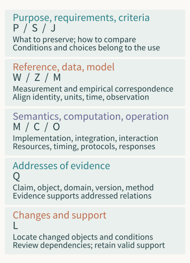
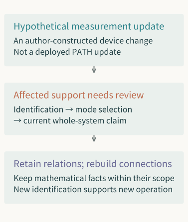

A predictor has lower error, a solver runs faster, and a control law responds better inside a model. The preceding essays showed that each judgment has its own object and conditions. The next decision goes further: use a candidate for a task, let a calculation inform a choice, or connect it to a continuing operational system. How do those correct results become grounds for this decision? Which intermediate relations remain to be established?

The 2010 PATH cooperative adaptive cruise control prototype gives the question an identifiable object. Bu, Tan, and Huang added communication and control to two FX45s with factory ACC. Virtual range and range-rate signals connected new control to that system, rather than providing full direct throttle and brake authority.[^path] Equation inputs, program outputs, and vehicle effects therefore need actual interfaces to connect. A local result begins to acquire operational meaning through them.

This essay develops such integration while retaining purposes without a real-time device. Offline computation can compare designs, learned models can recommend actions, and stateful tools can execute operations. Their required relations differ. Purpose, reference object, data, model, requirements, criterion, computation, operation, evidence, and change acquire content where they work, supporting a judgment that can be used and revised through feedback.

## How a Decision Raises the Complete Question

Place “usable” within a decision. A researcher may compare designs, a developer replace an online service, or an operator allow a controller in specified conditions. Comparison, substitution, and permission to execute have different consequences. Answers may be rankings, error bounds, admissible domains, or qualification for an operation under conditions. A single approval label cannot express these distinctions.

Call purpose or decision $P$. It specifies why a calculation is performed, who receives its result, which operation it enters, and which consequences must be borne. Purpose also selects horizons, populations, and tolerances. Offline screening may accept a longer calculation; a controller updating each step must finish before the result can act. The same equations can serve different engineering questions.

Requirements develop from purpose but need further expression. “Good performance” may divide into bounded peak deviation, lower average error, timely response, smooth control, and recovery after failure. Each must identify what is evaluated, in which domain, and over which runs and times. Requirements can compete: a larger input domain can increase computational load, lower error can cost a deadline, and additional retries can increase effect risk.

A model cannot settle these conflicts for the participants. Mathematics can determine feasibility at a tolerance and show what relaxing time or narrowing inputs permits. Accepting a tradeoff remains part of the practice. If a judgment includes human or organizational responsibility, those arrangements enter the purpose. Writing one preference as a loss does not make other consequences disappear.

A broad question can thus acquire a workable form: which candidates meet what must be preserved in the declared objects and settings, how should the remaining candidates be compared, and how far do existing grounds support the answer? Exploration can continue within this form. Unknown parameters do not prevent studying necessary relations first. When a conclusion informs an actual choice, unclosed conditions need definite addresses.

Essay I examined how mathematics forms problems. Engineering purpose continues that work here, letting relevant consequences enter objects, relations, and checkable judgments rather than identifying an everyday wish immediately with an optimization objective. New calculations can also change the question by revealing a requirement previously overlooked.

## How a Responsibility Graph Separates Objects and Relations

Retain a few symbols to follow the responsibilities. $W$ is the current reference object or real-world scope, $Z$ the observations, data, and provenance, and $M$ a model with definite semantics. Essay II establishes empirical relations among $W,Z,M$; essays III and IV examine the interior and transformations of $M$. What a model refers to, how data arise, and how parameters are chosen have different endpoints.

$S$ records requirements or specifications, while $J$ records the objective, loss, or decision criterion actually used. $C$ is a computational artifact, including discretization, algorithms, code, numerical behavior, and resources. $O$ is an operated or integrated system. Essay V gave its interconnection, timing, protocols, and substitution mathematical content. These objects connect, but calling them all “the model” does not discharge their correspondence obligations.

$Q$ denotes qualification grounds with addresses, and $L$ change and its impact on those grounds. Evidence is not a final score produced by a pipeline: it consists of material and methods supporting a claim. An update need not attach one new version number to every node. It changes particular objects and triggers checks of which support relations remain. Purpose $P$ gives direction to this work.

The symbols form a responsibility graph, not ten compulsory stations. Raw data can select a model or check a calculated result; requirements can precede experiments or be revised afterward. An operating whole can be reopened to investigate states and channels. Offline use may lack automatic execution, and pure mathematical reasoning may lack an empirical target. Retaining the absence of a role is more useful than inventing a node.

Arrows need verbs. $W$ to $Z$ may mean measurement, sampling, or recording; model to computation may mean discretization, solving, or a decoding correspondence; computation to operation may mean integration, scheduling, or execution. A model explaining data need not relate to reality through a one-way function. Kernels, relations, constraints, and allowed behaviors are chosen for their objects.

Reading the graph should let us move backward from a conclusion to its premises. A proof establishes a model property, a check supports program implementation, and field material supports empirical correspondence under specified observations. If these do not connect, a substantive relation is missing. Renaming the objects a “digital twin,” “world model,” or “intelligent system” does not supply it.

The distinctions also permit simplification. For an already defined shortest-path computation, requirement and criterion can coincide exactly. Without unknown quantities to identify, no training stage is needed. Simplification follows the question; completeness means that the important responsibilities have owners. More nodes do not make a judgment more complete.

## Separating Requirements from Average Metrics

Begin with a calculable counterexample. Compare two candidates on one hundred equally weighted cases, with nonnegative error. The baseline has error $1$ in every case. The candidate has zero error in ninety-nine cases and error $5$ in the remaining case. Mean squared errors are $1$ and $25/100=0.25$. The candidate improves the average considerably. Under a requirement that error never exceed $2$ in an allowed case, the baseline qualifies and the candidate does not.

There is no estimation error or extrapolation here. Even if the one hundred cases are the entire allowed domain, average and maximum remain different operations. An average incorporates frequency; a maximum retains the largest deviation. Treating average reduction as improvement of every requirement assumes an implication absent from those quantities. More samples can change an empirical average without changing the counterexample's logic.

Randomly sampled cases add another layer. The empirical average is a statistic, population expectation depends on sampling distribution, and maximum error or per-instance constraints need their own domain and quantifiers. Different training, validation, and runtime populations also require a relation across distributions. Identifying each quantity's address tells us whether to add statistical evidence, worst-case analysis, or a revised requirement.

Represent a requirement by an allowed trajectory set $S\subseteq\mathcal T$ and an objective by $J:\mathcal T\to\mathbb R$. $S$ determines acceptability; $J$ provides numerical comparison. If a decision $u$ produces trajectory $T_M(u)$ through the model, a design problem can be

$$
\min_{u\in\mathcal U}J(T_M(u))
\quad\text{subject to}\quad T_M(u)\in S.
$$

The domain $\mathcal U$ specifies available operations and $T_M$ their modeled consequences. Constraints establish feasibility before the objective selects among feasible designs. If every $u$ is infeasible, an optimizer cannot create a lawful candidate. Return to the question and change candidates, conditions, or requirements. A numerical minimum alone does not establish feasibility.

Some purposes care only about cumulative loss, making an average or integral a requirement in its own right. Then $J\le\tau$ can express it directly. There is no need to force requirements and objectives apart, but we must explain why the threshold suffices and what other constraints remain. The distinction identifies where they coincide and where they do not, rather than declaring them permanently different.

Essay V's gains return here too. Faster synchronous absolute decay is a comparison; convergence with fixed delay is a requirement. If both contexts are allowed, establish each judgment. Putting speed, feasibility, and domain in their places lets the two correct calculations jointly guide selection.

## How Weights Change Choices Without Replacing Hard Conditions

Objectives can be combined as $J=\alpha J_1+\beta J_2$, with weights specifying exchanges between costs. If $J_1$ is measured in meters and $J_2$ in seconds, weights also carry units and scales. Changing a unit while retaining numerical weights can change the selected design. Weights have mathematical roles while preserving a purpose's tradeoff; “normalization” does not turn them into neutral facts.

Teams sometimes put hard-constraint violations into a loss and expect optimization to avoid them. Take a real decision $u$, requirement $u\le1$, and objective $(u-2)^2$. The constrained optimum is $u=1$. With a finite penalty weight $\lambda>0$, use instead

$$
J_\lambda(u)=(u-2)^2+\lambda\max(0,u-1)^2.
$$

For $u>1$, the derivative is $2(u-2)+2\lambda(u-1)$, whose zero is $u_\lambda=(2+\lambda)/(1+\lambda)=1+1/(1+\lambda)$. Global strict convexity makes this the unique optimum, yet it violates the original hard constraint for every finite $\lambda$. A larger penalty shrinks the violation without removing it.

This derivation identifies what the penalty does. If the purpose permits violation at most $\epsilon$, choose a weight satisfying $1/(1+\lambda)\le\epsilon$. If exact nonviolation is required, retain the constraint or adopt another method with suitable conditions. The original requirement, solution procedure, and implementation tolerance determine the choice.

More general optimization can involve nonsmoothness, local minima, infeasible iterates, or termination error. A fully written criterion does not establish what an algorithm finds. Theoretical optima, returned values, and their actual consequences have further relations. Requirements must retain their relevant content at each point rather than disappear once the objective is written.

The engineering choice becomes concrete: preserve the mandatory domain and compare costs within it. If a constraint really changes, record its tolerance and consequences in the purpose, then establish satisfaction for the computed result. Mathematics exposes the difference between finite penalties and strict constraints, giving the choice an actual ground.

## How Reference Objects Enter Judgment Through Observation

A model does not move all of reality into equations. It selects an object and relations and represents what is asked through states, quantities, rules, or laws. $W$ therefore needs a scope: a device, a family of operating conditions, a data population, or a mechanism. A changed purpose can require different observations of the same object, and new observations can require a larger model.

Essay II developed measurement and empirical relations separately. Their roles continue here: measurement produces records from real histories, model observation produces comparable quantities, and their relation is studied in declared conditions. Different units, origins, times, or referents prevent a numerical difference from having its claimed meaning. Correspondence precedes an addressed error.

Names such as “target ahead,” “input temperature,” and “current state” include identification work. A quantity's name cannot maintain an entity's identity; a timestamp cannot make data belong to that instant. An output can accurately predict the wrong object, and a controller can accurately use an old value. Correct field-based program calculation and correct empirical reference need separate grounds.

Calling a reference relation $\rho$ does not require a total function from real state to model state. It may apply only in an operational domain, use conditional measurement distributions, or match selected observations. Omitted details can admit several internal correspondences if irrelevant to the purpose. What matters is which structure the reasoning uses and how far the material supports it.

A parameter can have different empirical meanings. It may be an independently measured physical coefficient, an effective parameter fitted for a domain, or a free value improving output. All can enter computation, but they cannot share an extrapolation argument automatically. Numerical similarity between a fitted parameter and a physical quantity does not establish common variation in new conditions.

Engineering judgment therefore retains the domain of reference and observation. Experiments can enlarge it and counterexamples revise it. It is not a permanent disclaimer attached to a model. A substantive domain statement identifies which changes remain covered and which need new measurement, state, or empirical research.

## How Data Acquire Different Roles in Different Operations

Data $Z$ first have a method of acquisition. Sources, sampling, unit conversion, missing values, filtering, and annotation change what records support. A readable file establishes artifact availability; representation of the current object depends on those operations. Essay II's results on adaptive sampling and identification keep their conditions here.

The same values can serve different responsibilities. Training data select parameters or structure, validation data assess a selected object, runtime inputs serve current calculations, and field records compare actual performance. Independence, versions, and operational order differ across these uses. Repeated candidate selection through a validation set makes that set part of selection; it cannot still be reported as an entirely untouched check.

Names do not settle this change. A folder called “test” does not erase the selection path. Retain which decisions saw which data and the conditions of later conclusions. New independent samples or analysis suitable for adaptive selection can supply appropriate grounds. If material supports exploratory comparison, judge it according to that actual role.

Data can also update current state without retraining. A fixed model reading new measurements each step can retain its semantic rules. Online identification sends records to parameter updates, changing the next model instance. A generation service appends history while parameters remain fixed and state changes. Record the operations as runtime state, model instance, or training artifact changes. Calling all of them “model updates” makes evidence impact hard to locate.

Repeated records do not automatically add the same number of independent observations. Millisecond sensor errors can be highly correlated; consecutively generated text can share conditioning and random state. An independent-sample bound needs its dependence premise. Essay V calculated how equal marginal failure rates with different shared switches change risk. Data count likewise cannot replace a joint relation.

A provenance change may or may not change content. Moving identical bytes to another store can retain values and semantics while changing traceability. A new annotation rule can retain a similar file structure while changing label reference. Identify the operation that changed and check its dependent claims, avoiding the demand to redo everything after every change.

## Separating Learned Families, Instances, Training, and Operation

Large neural networks make “model” carry especially many referents. Architecture and parameter domain define a family $\{M_\theta:\theta\in\Theta\}$; a parameter record selects an instance. Training rules produce parameters from data, initialization, and optimizer state. Programs decode them into executable functions. Services add precision, caches, sampling, resources, and permissions. Each item has a relation to its neighbors.

Essay III showed that parameter-to-function maps need not be injective. Different records can implement the same forward function without preserving gradients, representations, or subsequent training. Essay IV further showed that coordinates, parameterization, and scale change training geometry and limits. A forward-error purpose can use function observation; continued training reopens previously hidden structure.

Training is itself an operational object. Let algorithm $\mathcal A$, data and configuration $D,\gamma$, and random or initial state $\xi$ produce $\theta=\mathcal A(D,\gamma,\xi)$. The notation records a generation relation without promising convergence, population error, or optimality. Each desired result needs conditions on algorithm, distribution, family, and error object.

Write a running program as $C_{v,\gamma}$, with artifact version $v$ and execution configuration $\gamma$. An unchanged parameter file with different precision, truncation length, or sampling policy can change outputs and timing. Configurations selecting algorithmic branches belong in computational semantics. One weight-file checksum does not record the complete runtime object.

Parameter records and semantic instances can also be retained separately. Retraining produces a new record while the observed function may remain approximately unchanged; representations and call probabilities can still change. The identity inherited depends on the question. Keeping both in a maintenance lineage does not license unchecked substitution for every engineering purpose.

These distinctions add entry points for revision. A decoding error returns to $C$; failure on a new population prompts data and empirical investigation; a finite network missing its scale approximation returns to essay IV; tool calls changing state return to essay V's open behavior. Revision addresses the failure while retaining correct relations.

## How Semantic Models Become Computations

A continuous dynamical model specifies trajectories, discretization selects a finite-step approximation, a solver obtains values within finite resources, and a program executes with actual arithmetic. Together they form computation, but each changes content. Calling all of them a “running model” makes it hard to distinguish empirical model error, approximation error, and code implementation error.

Take the author-constructed $\dot x=-x$, $x(0)=1$, observed over $0\le t\le T$. The exact solution is $x(t)=e^{-t}$. Explicit Euler with step $h$ gives $x_{k+1}=(1-h)x_k$. For $0<h<1$, positive initial values stay positive. For $1<h<2$, the sequence decays while alternating sign. Discrete stability alone has not preserved the continuous trajectory's positivity.

The distinction gives solution requirements content. A fixed endpoint error can be checked with an appropriate step size. Required nonnegativity at every step must enter the method or step-size conditions. Consistency under refinement does not give every finite step every property needed by its purpose. Essay IV's examination of finite networks and limits retains this responsibility in numerical computation.

Optimization has computational obligations too. For an unconstrained differentiable strongly convex $f:\mathbb R^d\to\mathbb R$, use the Euclidean norm, strong-convexity constant $\mu>0$, and an existing optimum $u^*$. Adding the strong-convexity inequalities with the points exchanged gives strong monotonicity of the gradient. Since $\nabla f(u^*)=0$, a returned $\widehat u$ with residual $\|\nabla f(\widehat u)\|\le r$, $r\ge0$, satisfies

$$
\mu\|\widehat u-u^*\|^2
\le\langle\nabla f(\widehat u),\widehat u-u^*\rangle
\le r\|\widehat u-u^*\|,
\qquad
\|\widehat u-u^*\|\le r/\mu.
$$

Equal points satisfy the conclusion directly; otherwise divide by their distance. This carries a checkable residual to decision error, which a Lipschitz readout can carry further to the target observation. Weak curvature makes the same residual correspond to greater distance, so termination thresholds also need $\mu$. A small residual acquires meaning through its relation to the model.

The bound addresses an unconstrained strongly convex object. A boundary optimum can have nonzero gradient; a nonconvex zero gradient can be another stationary point. Constraint residuals, feasibility, or a provable local relation must replace the test as appropriate. A “converged” return must specify its criterion and how numerical calculation obtains it. The name supplies no premises.

Artifact $C$ therefore retains decoding, method, precision, and termination rules. Model discrepancy, discretization, solution, and implementation errors can be estimated separately and composed through maps, or bounded more coarsely for the whole computation. A sufficient coarse bound needs no artificial decomposition. Retaining error sources helps target improvements when needed rather than always retraining or adding compute.

## How Programs Implement Allowed Model Behavior

Program and model endpoints first need comparable objects. Decoding maps arrays, integers, and events to model inputs, states, or observations, while computational clocks align with model time. A control command cannot be subtracted directly from modeled gap error. Only placing the command in an appropriate environment and obtaining a closed-loop observation yields that comparison.

Let qualified computational behaviors be $\mathcal B_C$ and model behaviors $\mathcal B_M$. For decoded observations $o_C,o_M$ and distance $d$, one relation is

$$
\forall b_C\in\mathcal B_C\ \exists b_M\in\mathcal B_M,
\qquad d(o_C(b_C),o_M(b_M))\le\epsilon_C.
$$

Every computational behavior has supporting model behavior. With $\epsilon_C=0$, properties of all allowed model observations transfer to computational observations. Approximate correspondence needs a suitable property margin. For real-valued observations with absolute-value distance, a model observation at most $\tau-\epsilon_C$ gives a computational observation at most $\tau$. The selected observation determines what the distance controls.

The existential quantifier does not require the program to realize every model behavior. A deterministic algorithm can select one among many model solutions, sufficient if every result need only be lawful. A response for every allowed input additionally needs input coverage and progress. Empty $\mathcal B_C$ satisfies the formula without supplying a runnable artifact. Essay V's distinction between inclusion and response returns at implementation.

Probability responsibility also exceeds this unweighted relation. A program can produce only support-allowed results while badly distorting probabilities. Properties relating multiple runs need their joint structure retained; separate witnesses for individual runs need not give a common correspondence on the same internal object. Select comparison by the property. The formula carries only what it can transfer.

Implementation checks can use proofs, known solutions, constructed inputs, numerical refinement, or other methods suited to the claim. A benchmark shows behavior on particular inputs; a formal correspondence may cover all declared program behaviors. Moving from finite tests to a larger conclusion needs coverage or extrapolation grounds. A Boolean “passed” cannot hide that change.

The implementation relation lets code enter interconnection. Essay V established how wiring and environment change local conclusions. Now program behavior, resources, and timing must also fill that slot. Relations between model, algorithm, and program remain, giving new integration conditions a clear starting point.

## How Computation Acts Through Real Interfaces

Return to PATH. Its PC104 receives DSRC and CAN information and sends virtual range/range-rate to factory ACC. Unconfirmed target identity restores the actual LiDAR path; indirect adaptive MPC uses online parameter identification.[^path] These facts identify one system in which to locate the boundary of computational action.

Virtual quantities serve a control interface rather than new physical measurements. The factory controller remains in the path from input to vehicle action. New program output semantics must follow that path: a field named “range” does not make its virtual value physical separation. The recipient's rules and subsequent effects give it control meaning.

Integration makes boundary selection concrete. Comparing only the new controller puts factory control, channels, and vehicle in the context. Studying the complete response can combine them into a larger object. Both can be researched, with proof assumptions addressed to their owners. A local calculation borrowing downstream responsiveness needs operational review of that capability in the present system.

Target confirmation belongs to empirical reference too. An equation may use a “preceding vehicle” state, while the device must continually determine whether information refers to that object. Failed identity conditions change control mode. Retain provenance, confirmation state, and recovery paths. Performance in a fixed mode does not alone cover these paths.

Essay V supplies formal content: interfaces specify exposed quantities and capabilities, wiring specifies common histories, and changed modes require their composition to be studied. Real integration adds empirical correspondence and resources. Mathematical and operational loops therefore connect through calculable relations and relations needing field support.

The path makes missing work specific. How the program generates virtual quantities, how the recipient responds, how failed confirmation continues, and when a result takes effect can each be investigated. Finer objects obtain grounds and then form the whole used for the decision.

## How Online Operation and Offline Use Close Their Own Paths

An online path goes from real observation through program output and execution back to a changed world. Write $W\to Z\to C\to O\to W$ for this exchange. Arrows mean measurement, data-based calculation, integration/execution, and physical effect, respectively, rather than four functions of a common type. Each operation retains time, state, and conditions.

Model $M$ supplies semantics and methods without necessarily being rebuilt each step. A fixed control law repeatedly processes new inputs while its model instance remains. Online identification adds a separate data-to-parameter or model-instance update. Operational and identification loops can coexist; the operational arrows alone do not show continuous learning.

Offline use can close where a result informs a decision. Computation compares designs, evidence supports accuracy and domain, and participants select, reject, or request more research. Without an automatic action loop, the relation between result and decision still needs grounds. Building a device later is another operation with its own realization and use relations. An unexecuted decision is not deployment.

The paths have different timing requirements. Offline conclusions may wait for refinement; online control may need a usable result before the next step. Permitted timeout fallback brings timeout events and fallback behavior into $O$'s semantics. Low average computation time does not establish a deadline on every legal history, and successful returns alone can hide late or unfinished calculations.

Resources enter behavior accordingly. Memory, computation, concurrency, and congestion change response time and may determine whether a response exists. A model relation on an ideal machine still needs resource grounds for its actual configuration. Probabilistic deadlines need their risks and conditions; deterministic deadlines need that quantifier established.

Separating the paths prevents two gaps. Offline results need no imitation of a field loop to be valuable, while online integration cannot obtain qualified responses from offline accuracy alone. Each closes through its actual purpose and identifies its missing relations.

## Addressing Evidence to Claims, Objects, and Conditions

Record a piece of evidence as $q=(\varphi,X,P,D,v,m)$: claim $\varphi$, assessed object $X$, purpose $P$, condition domain $D$, version/configuration $v$, and method $m$. This organizes records without requiring one universal evidence data structure. We must be able to say what is supported, about which object, under what conditions, and by which establishing method.

A model proof can address semantic behavior, a code check implementation correspondence, and a test current device performance. Each contributes without naturally summing to “trust.” A proof's universal quantifier, tested scenarios, an inference population, and confidence level remain when the evidence supports a later conclusion.

Methods determine support ceilings. Simulation produces histories under semantics and configuration to inspect algorithms and compositions. Hardware involvement adds device resources and interfaces; field testing adds real-condition observations. Each can add content, specified by what was actually tested rather than by arranging method names in an automatic hierarchy.

For example, hardware tests using simulated sensor inputs do not directly test continuing real-target identification. Field performance without fallback does not establish every failure path. These distinctions target the next investigation. The positive support for tested objects and conditions remains, without becoming invalid merely because it does not establish everything.

Evidence-to-argument connections have obligations: premises must be supported, methods must apply to their objects, and conclusions must suffice for the claim. Several sources retain separate system identities. Another platform's real-time solution can inform implementation choices without becoming runtime data from PATH.

*Original responsibility diagram. Each panel retains relations to establish, with inward investigation and outward composition available. Roles are not compulsory stages; the prose specifies arrow operations and evidence obligations.*

Addresses enable reuse. A new purpose inside the old domain, with unchanged objects and properties, may use the old result. A changed element triggers correspondence and dependency checks rather than copying an approval label. $Q$ connects to $L$: version records identify changes and evidence review assesses their effect on the present claim.

## Composing Error Bounds in a Common Observation

Use a conditional derivation to show evidence working together. Choose a consistently defined error observation $e$. A model loop gives $e_M$, a program coupled with a formal environment gives $e_C$, and actual operation gives $e_W$. All occupy one observation space with distance $d$. For time sequences, distance can be a peak norm over a specified interval; a terminal quantity instead needs a fixed endpoint and units.

Declare a corresponding-run family $\Xi$ aligning initial conditions, external inputs, object identity, and time. For every $\xi\in\Xi$, observations are obtained at the required times with nonnegative bounds

$$
d(e_M(\xi),0)\le\epsilon_M,\qquad
d(e_C(\xi),e_M(\xi))\le\epsilon_C,\qquad
d(e_W(\xi),e_C(\xi))\le\epsilon_W.
$$

Zero is the target in the error space. Model analysis supports the first term, computational/compositional correspondence the second, and empirical relation, integration, and measurement uncertainty the third. If observation is only an uncertain record, bound its difference from the real quantity or explicitly include that content in $\epsilon_W$. An instrument record does not become a true value without that relation.

The triangle inequality gives

$$
d(e_W(\xi),0)
\le\epsilon_W+\epsilon_C+\epsilon_M,
\qquad\forall\xi\in\Xi.
$$

If the requirement is distance at most $\tau$ and the three bounds sum to at most $\tau$, the requirement follows throughout the family. This is a positive composition judgment. No unestablished numbers are assigned to PATH, and field plots are not used as uniform bounds for every run.

Alignment conditions are easy to miss. A second bound for one initial state cannot simply join a first bound for another family. A speed comparison in the third term cannot join gap-error comparisons in the others. Different clocks, inputs, or model instances need connections first. Individually correct numbers do not automatically form a proof.

Observation determines requirement coverage too. Bounded gap error alone does not qualify acceleration, saturation, or target identity; add observations or independent properties when required. Conversely, an endpoint comparison need not demand a full-state all-time distance. Composition follows the property, and accuracy budgets are allocated where they act.

The organization guides design. Divide tolerance among model discrepancy, computation, and operational correspondence, identify the limiting term, improve it, and recalculate the whole. An unsupported term needs investigation before other terms are compressed further. Numerical optimization can improve a computation bound without establishing an unmeasured empirical relation.

## Distinguishing Deterministic Bounds, Risk, and Confidence

Real observations can be random. On a common probability space with corresponding runs, let three error events satisfy $\Pr(E_i)\le\alpha_i$, where $E_i$ means that term exceeds its budget. When none occurs, the triangle inequality still holds. Therefore

$$
\Pr\{d(e_W,0)>\epsilon_M+\epsilon_C+\epsilon_W\}
\le\Pr(E_M\cup E_C\cup E_W)
\le\alpha_M+\alpha_C+\alpha_W.
$$

The union bound needs no independence. Products or improved joint bounds need dependence structure. These probabilities concern one defined run or random object; three probabilities from different populations cannot be joined directly. Addressed common premises give the composed risk its object.

Risk estimation from finite data adds probability concerning evidence itself. For independent identically distributed binary failure trials with true rate $p$, zero failures in $n$ trials occur with probability $(1-p)^n$. Given $0<\alpha<1$, let $p_*=1-\alpha^{1/n}$. If $p>p_*$, zero failures occur with probability less than $\alpha$. Zero failures thus permit a one-sided upper bound $p_*$ under this sampling model.

This is frequentist test inversion: across repeated data generation, a true rate above the bound rarely produces a zero-failure record. It does not assign probability $1-\alpha$ to the present unknown $p$ being below the bound. A posterior parameter probability needs a prior and a different statistical model. Each probability semantics has a purpose and must retain it within “risk is below.”

IID sampling remains a premise. If every trial shares one failure switch, all successes can have probability only $1-p$, regardless of trial count, instead of $(1-p)^n$. Different test and future populations also need a relation. Zero observed failures establish neither independence nor extrapolation.

Multiple tests, candidate selection, and continuing monitoring change evidence use further. A confidence result for a fixed candidate needs selection effects checked when used to choose among many. New independent data or a selection-aware method can supply the grounds. The requirement remains; the evidence model becomes more specific.

Engineering judgment can retain both event risk and statistical grounds for its bound. A tolerance $r$ is compared with the operational risk bound; a required confidence level separately constrains the evidence. Distinguishing them gives data quantity, operational margins, and research different roles.

## How Computational Verification and Empirical Validation Support Use Together

Scientific computing has established distinctions at these addresses. Yeo's NISTIR8298 separates code verification, solution verification, and model validation. The first two concern numerical implementation and the error of a current calculation; validation concerns simulation's relation to reality and whether accuracy suffices for intended use.[^vvuq] We adopt the distinction of responsibilities, while objects and methods remain specific to the task.

A known solution makes verification concrete. Choose $x_*(t)=\sin t$ and construct $\dot x=-x+\sin t+\cos t$, $x(0)=0$. The chosen $x_*$ solves it exactly. Programs at different step sizes can be compared with that trajectory to inspect algorithm and implementation error and refinement. This deliberately manufactured problem supplies a computable reference.

The construction does not establish $\sin t+\cos t$ as a device's actual force. Agreement with the known solution supports implementation on that object; the device's reference to the equation needs measurement and empirical grounds. Transferring the method to more complex equations also requires checking coverage of the relevant computational structure. One passed benchmark is not a proof of every code behavior.

Solution verification addresses the particular calculation. The same code under different meshes, steps, initial conditions, and termination tolerances can yield different errors. A checked algorithm does not make every configuration sufficiently fine. Essay IV's local-error accumulation explains why small local and terminal errors still need a stability relation. Correct algorithms, adequate current solutions, and empirical applicability are three connected judgments.

Validation brings the third relation into observation. Align relevant real and simulated quantities, account for measurement, parameter, computational, and known uncertainties, and investigate whether differences fit the purpose's tolerance. Ranking may need less than highly accurate states; peak risk may need more than average agreement. Purpose selects accuracy observation and the method must retain it.

“Fits experiment” also has different content. Parameters adjusted on a record support a fitting result. New records unused in selection provide other grounds. Continued performance through an explained domain change adds extrapolation support. Distinguishing these operations avoids both overstatement and treating every numerical agreement as meaningless.

Code verification, solution verification, and validation thus enter the responsibility graph together. They can close a judgment for actual objects and tolerances without guaranteeing every future use. Adequate refinement with persistent empirical discrepancy points to modeling or observation; failure on known solutions first points to computation. Revision follows the missing content.

## How Finite Field Results Support a Definite Scope

PATH's Figure7 records proving-ground regulation after a time-gap setting changes from 1.1s to 0.9s; Figure12 separately reports public-highway operation.[^path] These materials observe integrated responses in real objects and positively support the reported cases. Enlarging the operating family requires additional grounds.

Separate the quantifiers. One record shows what occurred under its input, initial state, and environment. A domain-wide guarantee covers every allowed input and state. Finite trajectories can check themselves directly, support population conclusions through a sampling model, or investigate a mechanism's premises. The enlargement route depends on acquisition and property.

Field results include configuration: vehicles, channels, parameters, observations, and mode selection form the run. Later program or device changes cannot inherit performance merely by citing the title. Version and input records locate correspondence; incomplete configurations identify what subsequent reuse still needs.

Negative results are specific too. One peak-constraint violation refutes a universal guarantee claimed to cover that run. One nonviolation does not establish it. An out-of-domain counterexample may prompt broader use or demonstrate the value of a restriction. Check scope and facts before changing the object, guarantee, or operating conditions.

Field material can change models as well. Persistent discrepancy may expose omitted state; switching may challenge a fixed structure; physical effect time may differ from logical time. Treating experiment only as final confirmation misses its developmental role. Observation in essay II, transformation in IV, and interconnection in V can all be reopened through it.

A fuller field judgment therefore bears a conclusion about an explicit object and scope: which materials support which requirements, which conditions allow that support to inform this decision, and which feedback reveals changes outside the domain. It retains positive findings and entries for expansion. Evidence and reasons determine strength, rather than confident wording.

## How Offline Decisions Work Without Automatic Execution

Construct an offline purpose. A team chooses a design from finite candidates $\mathcal A$. Let $R_W(a)$ be a real-use cost or load, with model and computation giving $R_M(a)$ and $R_C(a)$. The real quantity can be a target correspondence still to establish rather than an observed result. Declare error conditions first and examine which choices they support.

Suppose every candidate under a common condition definition satisfies $|R_M(a)-R_W(a)|\le\eta_M$ and $|R_C(a)-R_M(a)|\le\eta_C$. With $\eta=\eta_M+\eta_C$, $|R_C(a)-R_W(a)|\le\eta$. These are author-constructed uniform conditions. Actual designs need grounds for each; computed results alone cannot supply model discrepancy.

Let computation choose $\widehat a\in\arg\min_{a\in\mathcal A}R_C(a)$ and the real optimum be $a^*\in\arg\min_{a\in\mathcal A}R_W(a)$. Finite nonempty candidates ensure minima exist. The uniform bound yields

$$
R_W(\widehat a)
\le R_C(\widehat a)+\eta
\le R_C(a^*)+\eta
\le R_W(a^*)+2\eta.
$$

This bounds real cost regret by $2\eta$ within the candidate set, without promising exact optimality or comparing designs outside it. Computation informs a choice through error relations and has definite value. A permitted regret may make accuracy sufficient; strict ordering instead requires a margin.

For two candidates, $R_C(a_2)-R_C(a_1)>2\eta$ implies $R_W(a_1)<R_W(a_2)$. A difference at or below the threshold does not guarantee strict order. Computed 100 and 103 with $\eta=2$ give overlapping real intervals; 100 and 105 separate them. These constructed values show how a decision determines needed precision.

A hard requirement can coexist. If $R_W(a)\le104$ is needed, computed 100 and error at most 2 give upper bound 102, sufficient to support it. Computed 105 gives upper bound 107, insufficient for proof. This does not prove a value above 104: the lower endpoint is 103. Inability to certify, actual refutation, and establishment are three outcomes.

The reasoning can serve offline scientific design comparisons, without claiming that NIST supplies the two bounds for these candidates. The report distinguishes verification and validation responsibilities; this section derives conditions for using them in a decision. Without real-time $O$, evidence still connects results to $P$. Unneeded nodes shrink while important relations remain.

## How Learned Advice Becomes an Engineering Effect Through Tools

Construct another purpose. A network reads data, recommends an update, and a caller checks conditions before tool execution. Limit the advice to a bounded decision, such as a parameter change for a declared object, rather than letting “agent” stand in for every permission and effect. Feasible parameters, adequate advice, and effects confined to the intended object enter requirements separately.

A fixed forward comparison can establish a relation between advice function $f_\theta$ and a reference. Essay IV's bounded readouts and margins preserve discrete choices under suitable continuous differences. Essay V's conditional-kernel bounds support finite-interaction risk budgets. Each retains its conditions. Choose a relation according to deterministic advice, probabilistic output, or continuing state-dependent response.

Training loss is not directly that operational relation. It records a value on training data and objectives; the advice function responds in a runtime domain, and protocols and permissions interpret its calls. Average loss can remain good when harmful errors concentrate on rare inputs. Persistent tools can share single-call types while changing future effects. The requirements counterexample and essay V's retry construction exposed these gaps separately.

The tool can establish a state guarantee independently. Essay V's atomic identifier/receipt rule permits at most one counter increment per identifier within its declared scope. The learned model decides when to request, the caller maintains identifiers for the same action, the channel carries possible receipt loss, and the tool owns atomic commit. Closing those responsibilities establishes the property; correct advice cannot prove tool atomicity.

A changed request policy needs the old guarantee's coverage checked. One identifier for one recommendation differs from a fresh identifier for every repeated recommendation. Expanded permissions change reachable operations, and changed timeout rules change retries. Preserving weights or fields does not preserve contexts. The engineering boundary expands with actual effects.

A narrower purpose can expose less. Advice for human review leaves some execution responsibility with later participants. Automatic updates bring execution and continuation after failure into the present judgment. Each has a complete path; grounds for one cannot cover the other's consequences automatically.

Learned-system research can also develop backward from these relations. Different feedback costs for equal local error can motivate new losses and data. Rare mistakes with persistent effects can motivate kernels, state constraints, and risk control. Scale approximations failing to preserve finite-network margins return to transformation and readout. Engineering relations give mathematical questions new content.

## How Updates Change Evidence Through Dependencies

Change $L$ first locates the object. New sources, retrained parameters, a solver replacement, changed clocks, expanded interfaces, and new purposes are different events. An event may affect several objects without synchronizing every identity. Checksums record bytes, semantic comparisons record behavior, configurations record integration, and governance records lineage. They can coexist without replacing one another.

Use a dependency graph of claims and premises to follow impact. Let $\operatorname{dep}(q)$ be the versions, conditions, and intermediate conclusions actually used by evidence $q$. Find changed dependencies first, then inspect downstream support. Propagation identifies review candidates without declaring them all false. Continued use depends on relations after the change.

A solver-only replacement may retain semantics and empirical reference while checking implementation error, termination, and deadlines. Sufficient new bounds within the old deadline can reclose the system argument with new local grounds. Faster execution losing feasibility does not satisfy all requirements. Restoring a relation lets downstream claims receive support again.

Data changes propagate at different addresses. Semantically identical, verifiable new files may require provenance updates alone. New annotation can change the target and reopen training and evaluation. A new runtime population can leave the empirical domain. Parameters still inside a proved family may retain family results; results for a fixed old instance need the new instance's conditions checked.

PATH used a roughly 0.5s lag of LiDAR relative-speed information against DSRC vehicle-speed information to assist identification.[^path] Suppose a device replacement changes that feature—an author-constructed update. Unchanged motion equations would not preserve the identification grounds, so mode selection and operational observations need review. A locally improved delay can alter a distinction another operation relies on.

*Original update-impact diagram. The device change is hypothetical, not a deployed PATH update. Arrows identify support to re-establish; “affected” is not represented as “already failed.”*

Repair can preserve old prototype facts: old-device records still concern that object. The new object needs identification rebuilt or another confirmation method selected, followed by mode and loop checks. Impact review prevents unsupported inheritance while retaining correct older findings. Changes identify where new work begins.

## How Runtime Feedback Returns to Models and Questions

Review sometimes reveals that a model omitted a consequential relation rather than merely losing a version correspondence. Use an author-constructed revision. The proposed description is $x_{k+1}=ax_k+bu_k$, while another reference construction follows $x_{k+1}=ax_k+bu_{k-1}$. Quantities and coefficients agree; action delay differs.

Correct code for the first equation can pass verification. Reference discrepancy associated with input-change times instead prompts channel investigation. Refitting $b$ may improve average error under slowly changing inputs without preserving transition relations. Essay II's identification discussion calls for inputs able to distinguish the candidates.

Take $b\ne0$, common $x_0$, and $u_{-1}=0$, with $u_0=1$ and zero thereafter. No delay gives $x_1=ax_0+b$; delay gives $x_1=ax_0$. The first step already distinguishes them. A time-aligned experiment able to resolve that difference gives grounds to retain delay. This is theoretical discriminating design; an actual experiment also needs measurement precision and effect correspondence.

Augment state to $s_k=(x_k,u_{k-1})$ while retaining input $u_k$. The update is

$$
s_{k+1}
=\begin{pmatrix}a&b\\0&0\end{pmatrix}s_k
+\begin{pmatrix}0\\1\end{pmatrix}u_k.
$$

The previous one-dimensional state could not determine the next step. Retaining the previous input closes it. Essay III supplies state semantics, IV the augmentation relation, and V timed interconnection for control effects. Revision develops a better object within the same question, without needing a louder framework name.

Change may concern observation rather than dynamics. A delayed measurement path can preserve real-state dynamics while changing observation and wiring. Incorrect clock calibration first needs repaired time correspondence. Distinguish effect, observation, and calculation-completion times to separate these explanations. Feedback provides clues; discriminating research justifies revision.

Deeper feedback can return to purpose. If deadlines and resources are incompatible, options include another algorithm, additional resources, or a revised domain. Participants may need recoverability rather than failure-free behavior, changing requirements. Mathematics exposes costs while practice owns purpose revision. Old results retain their role in the old question; the new question selects its relations again.

## Completing an Engineering Judgment—and Continuing It

A positive judgment can now be formed. Specify the decision and domain, distinguish mandatory requirements from comparison criteria, and establish the needed correspondences among reality, data, semantics, computation, and use. Address local proofs, checks, and field material to the argument. Compose errors or risks under aligned conditions and compare the result with the purpose's tolerance. A closed argument qualifies current use to the extent supported by those grounds.

A judgment can also fail clearly. Lower mean error violating a hard requirement calls for a changed candidate or accepted tolerance. Finite penalties missing strict constraints call for actual feasibility conditions. Missing responses, deadlines, or unique effects call for behavioral repair. Unsupported empirical terms call for research instead of concealment behind small computational error. Each outcome has its own revision entry.

Offline selection obtains a $2\eta$ regret bound from uniform error, stable ordering from sufficient margins, and requirement support from conservative upper bounds. Feedback substitution preserves well-posedness and properties through admissible contexts. Learned tools close advice, protocols, commits, and receipts separately. These are usable different judgments, unified by addressed objects, conditions, and grounds for important relations.

Strict internal results retain value: invariants, stability domains, scales, limits, and structures previously missed by a language. They act in engineering through actual correspondence. Empirical material does more than approve a final step: it can revise observation, state, parameters, scale, model kind, and the question itself. These relations let both develop together.

The six essays can now be reread. I forms objects for reasoning; II establishes empirical reference; III develops presentation, semantics, observation, and identity; IV studies transformations, high-dimensional learning, and scale; V constructs and proves interconnection and substitution; VI returns those results to purpose, implementation, evidence, and change. Each performs a complete task and adjacent essays provide re-entry points.

This understanding requires neither every mathematical language in one engineering activity nor every node in one judgment. It requires important relations to hold: a suitable object, understood observation, connected computation and action, and evidence supporting the committed scope. Smaller questions can close along shorter routes; new questions reopen needed boundaries.

A completed judgment can therefore be definite and revisable. It bears a conclusion for explicit purpose, object, and conditions. When they change, dependencies and feedback locate what must be rebuilt. Placing findings in these relations lets models support further choices, calculations, and designs while practice continues developing mathematical questions.

[^path]: Fanping Bu, Han-Shue Tan, and Jihua Huang, *Design and Field Testing of a Cooperative Adaptive Cruise Control System*, ACC2010, 4616–4621; [publication record](https://doi.org/10.1109/ACC.2010.5531155), [author-uploaded text](https://www.researchgate.net/publication/224162351_Design_and_field_testing_of_a_Cooperative_Adaptive_Cruise_Control_system). §II: integration; §III-A: identification and restoration; §III-C: control; §IV: tests. Error budgets, offline candidates, and device updates are separate author constructions.

[^vvuq]: DongHun Yeo, *A Summary of Industrial Verification, Validation, and Uncertainty Quantification Procedures in Computational Fluid Dynamics*, NISTIR8298(2020), §3, printed pages 5–8; [institutional report](https://doi.org/10.6028/NIST.IR.8298). The responsibility distinction is adopted here; CFD procedures are not reported as PATH's workflow.

---

**The six essays in “Models and Engineering”:** [How Mathematics Forms Problems](/en/posts/mathematical-language-and-problems/) · [How Models Refer to the World](/en/posts/from-observation-to-model/) · [What Is Inside a Model](/en/posts/inside-the-model/) · [How Models Change](/en/posts/model-transformations/) · [How Models Enter a Whole](/en/posts/model-as-open-component/) · **From Models to Engineering Judgment**.
