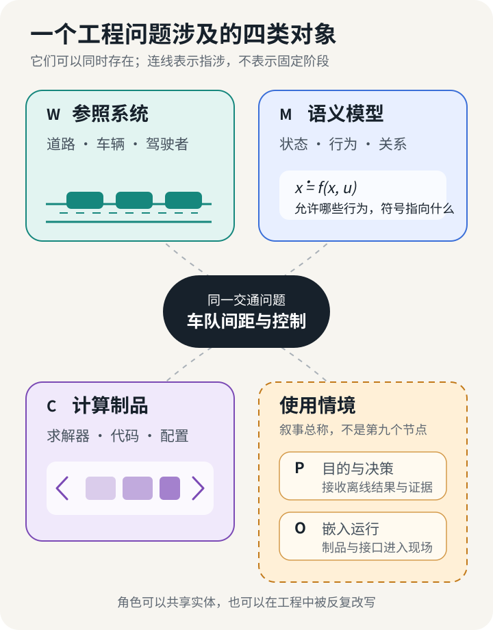
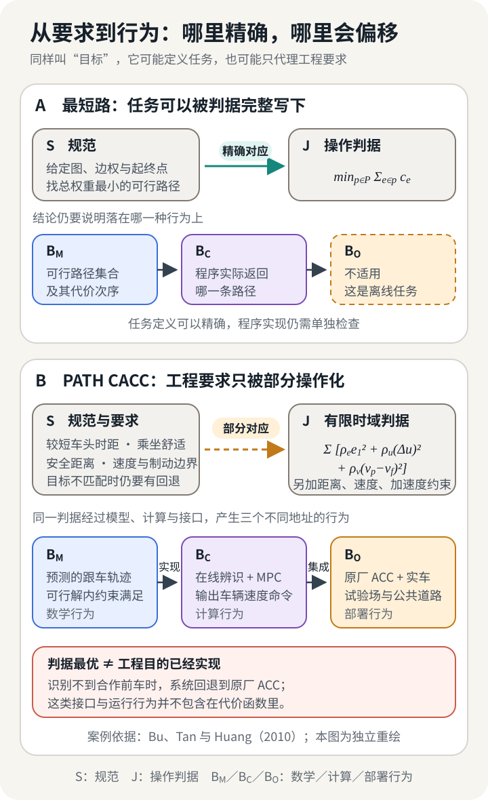
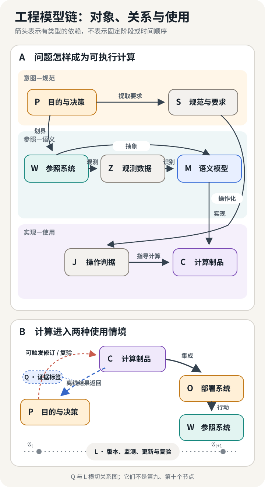
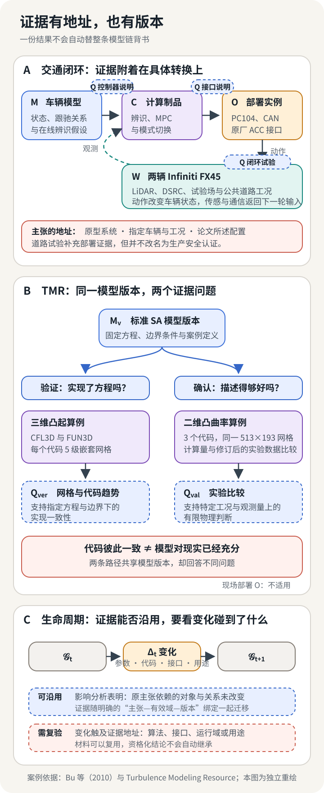

## 一项车队控制任务里的三类对象

2010 年，California PATH 的研究人员把一套协同自适应巡航控制系统装上两辆 Infiniti FX45。前车通过 DSRC 广播车速、油门、制动和挡位，后车的 PC104 计算机同时读取这些消息、本车 CAN 总线和激光雷达测得的相对距离。研究人员没有直接改写发动机和制动控制，而是让新增控制器生成一组“虚拟”的相对距离与相对速度，再交给原厂 ACC 执行。前车不是通信中的那辆车时，状态机把真实的激光雷达读数重新接回原厂系统。[^bu-cacc]

如果在论文里寻找这套系统的“模型”，我们会找到一组车辆纵向运动方程。前后车距离 $x_r$、前车速度 $v_p$、后车速度 $v_f$ 组成状态，未知的牵引、阻力和扰动参数由行驶数据在线辨识。连续方程被离散以后，模型预测控制器在每个时刻预测未来，约束车距、速度指令和加速度，再选出下一条速度指令。

如果打开运行程序，工程师常把其中的矩阵、采样周期、参数上下界、权重、求解步骤和状态机也叫作“模型”。到了车上，这个词又可能指向由时钟、消息、传感器、原厂 ACC、制动能力和驾驶者选择的时距共同构成的运行系统。论文中的状态空间模型不会自行辨认前车，也不知道一条 DSRC 消息是否迟到；代码中的最优解不会自行变成制动力；车辆上的一次跟驰表现也不能只归因于某个方程。

论文、程序和车辆现场使用同一个词指称不同对象，这种省略会直接改变工程判断的地址。研究者若说“模型是稳定的”，读者需要知道稳定性属于连续方程、离散控制律，还是带通信与执行器的闭环车辆；开发者若说“模型已经验证”，还要追问验证了公式、代码，还是某种道路工况。对象不明，正确性便会顺着同一个词悄悄换地址。

这处错位引出全文的问题：**一项工程问题怎样从参照系统被抽象为语义模型，再经计算实现进入决策或部署？每次转换保留了什么，又改变了什么？**

## 同一个名字，落在四类指称上

先看一句工程讨论里最常见的省略：“我们部署了论文中的模型。”这句话至少跨过四类常见指称。一条典型的运行时路径是：

$$
\mathcal M_{\Theta}
\longrightarrow
\mathcal M_{\hat\theta}
\longrightarrow
\mathcal C_v
\longrightarrow
\mathcal O_{v,d}.
$$

这不是每个模型都要经过的流水线。学习系统还会出现训练制品 $C_{\mathrm{train}}(\mathcal M_\Theta,Z,J)$，它产生 $\mathcal M_{\hat\theta}$；随后承载推断的 $C_v$ 可能是另一套代码和硬件。纯理论模型则可以停在第一项。箭头表达工程上的产生与实现关系，不声称四项是同一实体的四个生命阶段。

第一项 $\mathcal M_{\Theta}$ 是**模型族**。它规定允许采用哪些变量、函数、关系和参数。线性车辆模型、某种神经网络架构、一族概率分布，通常都先以这种形式出现。模型族说的是哪些解释有资格进入候选集合，还没有选定一次具体计算。

第二项 $\mathcal M_{\hat\theta}$ 是**已定参数的模型实例**。参数可能来自理论推导、系统辨识、统计估计、校准或训练。PATH 的控制器在线估计前车动力学参数，再把估计值送入预测模型；一次参数更新会留下同一模型族中的新实例。神经网络训练得到的权重、贝叶斯分析得到的后验点估计、用实验数据标定的阻力系数，也位于这一层。完整后验首先是参数实例上的分布；固定为一套后验预测规则后，才构成一个具体的概率模型实例。

第三项 $\mathcal C_v$ 是**计算制品**。下标 $v$ 提醒我们，它有自己的版本。数据结构怎样表示状态，连续方程怎样离散，优化问题交给哪个求解器，停止容差是多少，使用单精度还是双精度，依赖库和硬件怎样执行，这些内容共同决定程序实际产生的行为。两个程序可以实现同一组方程，也可以因网格、容差或浮点路径不同而给出有意义的差异。

第四项 $\mathcal O_{v,d}$ 是**具有特定安装与受治理配置 $d$ 的部署实例**。PATH 的制品进入车辆以后，与激光雷达、DSRC、CAN、PC104、原厂 ACC、驾驶者和道路组成一个开放系统。接口、单位、时钟、消息拓扑、回退方式和执行器范围都开始参与结果。传感器老化、通信拥塞、车辆载荷和交通参与者的变化，通常先作为同一部署实例面对的运行上下文；只有传感器、协议或配置越过声明的身份边界，才产生新的 $\mathcal O$。

日常语言继续把四者统称为“模型”没有问题，只要推理时知道主语落在哪里。最方便的辨认办法，是问：**现在改变一件什么东西，正在谈论的对象会跟着改变？**

- 改变一次运行输入，通常只是同一实例的一次执行；
- 固定参数或权重变化，会产生同一模型族中的新实例；概率族、签名、行为语义或解释变化，通常产生新的语义模型，甚至新的模型族；
- 离散化、求解器、容差、代码或硬件执行路径变化，会得到新的计算制品；
- 传感器、协议、拓扑或受治理配置越过身份边界，会得到新的部署实例；普通工况和时刻变化只是同一实例的运行上下文。

边界条件尤其值得警惕。它可以是模型公开接收的输入，也可以被固化为模型参数，还可以只存在于部署配置。离开签名谈“改了边界条件是否仍是同一个模型”，没有统一答案。对象的身份取决于这项量在当前关系中承担什么角色。

*图 1　正文先保留四个主要对象。使用情境分成两条路：结果返回一次离线判断，或计算制品进入运行系统并作用于参照系统。可点击或双击放大。*

图中还有一个更早出现的对象：**参照系统**。它是模型声称指向的车辆、道路、流场、组织过程，或一个纯形式对象域。语义模型从中选择关系，计算制品实现这些关系，使用情境让输出进入判断或行动。图 1 将两种模型指称合并为 $M$，把更早的参照系统 $W$ 纳入画面，并把离线判断与嵌入运行收在使用情境之下；上面的四类身份链继续细分 $M$、$C$ 与 $O$。后文的八类角色是责任槽位；同一个实体可以同时占据多个角色。

这也解释了为什么给模型列一张属性表往往不够。我们当然会问它研究什么对象、采用什么关系、追求什么目标、拥有怎样的架构、运行什么算法。这样的五问很有用，却很难成为五条独立坐标。目标可能来自工程要求，也可能只是训练损失；架构可能指函数族、软件图或通信拓扑；算法属于求解与实现，未必属于语义模型；所谓“动力学”甚至无法容纳静态关系、概率核和约束系统。一个词跨过数个对象时，属性表会把转换压平。

因此，我们把狭义的“模型”留给有明确数学含义的 $\mathcal M$，把从用途、参照、数据、要求一直到使用、证据和版本的整条关系链称作**工程模型系统**。这个名字提醒我们：工程结论由一串转换共同承担。

四类指称分清以后，最早的转换仍然藏在黑箱里。道路上有无数车辆、动作、规则与偶然事件，方程只留下很少几个变量。这一次删减怎样发生，决定了后续所有计算究竟在谈什么。

## 世界怎样进入模型

PATH 原型研究的起点并非抽象的“车辆跟驰”。项目要让驾驶者在真实交通中体验 0.6 到 1.1 秒的较短时距，观察人与协同巡航的互动。这个用途使两辆改装 FX45、短时距、前后车通信、驾驶者体验和原厂 ACC 的限制进入问题。若任务改成研究高速公路通行能力，系统边界可能扩展为长车队、匝道和交通流；若任务改成道路安全认证，紧急制动、故障模式、相邻车辆切入和法规条件又会取得更高地位。

我们把用途与决策情境记作 $P$，把被研究、待设计或被形式化的参照系统记作 $W$。箭头

$$
P\xrightarrow{\text{划界}}W
$$

表示问题怎样选定系统边界、尺度、主体、输入、输出与扰动。这里没有一个脱离用途、自动等待模型完整复刻的“真实世界”。同一段道路可以支持驾驶者体验研究、控制器设计、交通流预测和事故调查；它们接触同一物理场所，却建立了不同的参照系统。

### 观测留下的不是道路副本

随后进入工程链的是数据。后车的激光雷达测量相对距离和相对速度，CAN 总线提供本车速度、发动机和制动状态，DSRC 消息带来前车状态。PATH 团队还观察到，测试条件下激光雷达给出的相对速度比通信车速约迟 0.5 秒，于是利用这一特征辅助确认雷达目标是否正是通信中的前车。[^bu-cacc]

每一条记录都经过传感、采样、同步、筛选和估计。数据 $Z$ 与参照系统 $W$ 之间应当保留一条观测关系：

$$
W\xrightarrow{K_{\mathrm{obs},P}}Z.
$$

符号 $K_{\mathrm{obs},P}$ 可以是一套确定性的测量过程，也可以是概率性的观测核。下标 $P$ 表示观测同样受用途支配：为了控制时距而采集的数据，不会自动包含事故重建、排放评估或驾驶者注意力研究需要的一切。

数据不是 $W$ 的缩小照片。激光雷达的“相对距离”已经依赖目标检测和坐标解释，CAN 信号依赖车辆内部协议，通信消息依赖另一辆车怎样编码自己的状态。缺失、延迟、噪声和选择机制属于我们接触系统的方式。把数据单独写成 $Z$，是为了让这些条件在后续校准、训练和验证时仍可追踪。

### 一个模型至少要给符号以行为和解释

从 $W$ 到数学模型发生的是另一种转换。建模者选择状态、参数和关系，规定哪些行为被允许，再说明这些符号在参照系统中指什么。可以把狭义语义模型写成：

$$
\mathcal M=
(\operatorname{Sig}_{\mathcal M},
 \operatorname{Beh}_{\mathcal M},
 \operatorname{Int}_{\mathcal M}).
$$

其中，$\operatorname{Sig}_{\mathcal M}$ 是有类型的签名：变量、参数、输入、输出和状态接口；单位也可以编码进类型。PATH 方程里的 $x_r$ 被解释为前后车相对距离，$v_p$ 与 $v_f$ 分别指前车和后车速度。它们由哪路车载信号取得、坐标怎样对应道路，则由解释关系说明。

$\operatorname{Beh}_{\mathcal M}$ 是一个带类型的语义对象：它可以是静态关系、轨迹集合、概率核、分布或算子，规定模型允许怎样响应。它未必是随时间演化的“动力学”。欧姆定律允许的是电压、电流与电阻之间的静态关系；偏微分方程连同初边值条件可以定义解集合或算子；统计模型可以给每个输入分配一个输出概率分布；自动机则允许一组状态与转移轨迹。把这些对象一律称为动力学，会迫使静态、概率和形式模型伪装成自己并不拥有的结构。

$\operatorname{Int}_{\mathcal M}$ 是解释映射。它把数学符号送回参照系统。没有这一步，$\dot x=f(x,u)$ 只是一个尚未指向该工程对象的形式系统；说明 $x$ 指车辆状态、$u$ 指速度指令，它才成为这个工程问题的模型。参数在哪些速度、挡位和工况下成立，则进入假设、有效域与资格化记录。两个团队可以写出相同形式的方程，却因变量解释、边界和尺度不同而研究不同对象。

这一定义有意把求解器、训练脚本和评价程序留在模型之外。它们会作用于模型，也会决定我们看到什么结果，但“允许哪些行为”与“怎样算出一次行为”承担不同责任。形式语义与开放系统理论为这里提供了分开签名、行为、端口和组合关系的语言。[^institutions-open-systems] 若离散格式或求解器参与训练、被联合优化，或者本身就是学习对象，它还会反过来改变所得参数实例乃至有效方程；这条反馈要同时记在 $C_v$ 与 $M_{\hat\theta}$ 上。[^solver-training]

### 同一个 $\mu$，可能在四个位置工作

概率符号尤其容易暴露混层。设 $\mu$ 是一个分布，它可能承担至少四种不同角色：

1. 在概率模型中，$\mu$ 本身规定随机变量的概率律，属于 $\operatorname{Beh}_{\mathcal M}$；
2. 在训练过程中，$\mu_{\mathrm{train}}$ 描述样本怎样进入经验风险，属于数据制度和操作判据；
3. 在资格化中，$\mu_{\mathrm{val}}$ 或一组工况说明现有证据覆盖了哪里；
4. 在运行中，$\mu_{\mathrm{deploy}}$ 描述制品实际遇到的输入制度，它可能已经偏离训练和验证条件。

神经算子研究常把算子学习误差写成对函数分布的期望；这不意味着该分布永远是被学习算子的本体成分。换一组采样分布可能改变训练与评估，却不一定改变目标算子的数学定义。[^neural-operator] 相反，在生成模型里，条件分布本身就是模型要表达的行为。判断 $\mu$ 属于哪里，要看它此刻定义了允许行为、产生了观测，还是限定了证据。

观测留下接触参照系统的记录，模型规定选定抽象下的允许行为；二者可以经辨识、校准或训练相连，仍不能互相代替。工程随后还要把允许发生的行为转成希望发生的行为。

## 方程怎样变成一次真实计算

PATH 团队为跟驰控制器写下的目标很容易理解：车辆要保持驾驶者选择的时距，前车变速时要及时响应，乘坐感受至少应与人工驾驶相当。真实系统还带来一批边界：可调用的原厂制动能力有限，速度指令有范围，跟车距离不能越过安全阈值，控制动作不能让执行器饱和。

这些话仍然不能直接交给计算机。我们把系统层的规范与要求记作 $S$，把算法实际计算、估计或约束的判据记作 $J$。从 $S$ 到 $J$ 的箭头叫作**操作化**：

$$
S\xrightarrow{\mathrm{operationalize}}J.
$$

这条箭头通常是一种受情境约束、可以多对多且只覆盖部分要求的关系，而非函数；必要时可以写成 $R_{SJ}\subseteq S\times J$。安全距离和执行器范围可以成为硬约束；舒适性可能由加速度、加加速度或控制变化率代理；预测准确性可能由均方误差衡量；基础模型的“有帮助”可能被写成偏好得分。算法直接处理的是右边，工程师最终关心的仍在左边。

### 一个恰好重合的目标

先看最干净的情况。给定有向图 $G=(V,E)$、非负边权 $c_e\ge 0$，任务被定义为“寻找从 $s$ 到 $t$ 的总边权最小路径”。规范本身就是：

$$
p^*\in
\operatorname*{argmin}_{p\in\mathcal P(s,t)}
\sum_{e\in p}c_e.
$$

这里的操作判据 $J(p)=\sum_{e\in p}c_e$ 精确表达了任务。Dijkstra 算法或采用可采纳启发函数的 A*，只是求取这个对象的不同计算方法。只要边权、图和最优性定义没有变化，求解 $J$ 就是在完成 $S$。

若一句“最短路”实际想表达安全、准时、平稳、低碳且能被旅客接受的路线，同一个边权和便成了压缩多项价值的代理。风险偏好、时间可靠性和道路限制怎样进入 $c_e$，决定它覆盖这个更大任务的哪一部分。

因此，操作化至少有四种常见形状：精确对应、保守近似、经验代理和启发式替代。保守近似可能牺牲部分性能来保证要求；经验代理依赖数据中观察到的相关性；启发式指标则只提供方向。一个成熟的工程论证会说清采用了哪一种，而不会让同一个符号同时扮演价值、规范、损失和证据。

### MPC 的加权和承载了什么

回到 PATH 控制器。设相对距离为 $x_r$，后车速度为 $v_f$，驾驶者选择的时距为 $t_{hw}$，其间距误差写成

$$
e_1=x_r-v_f t_{hw}.
$$

离散模型预测未来 $N$ 步，控制器采用的二次代价可以概括为

$$
J_k=
\sum_{n=1}^{N}
\left(
\rho_e e_1(k+n)^2
+\rho_u\Delta u(k+n)^2
+\rho_v\Delta v(k+n)^2
\right),
$$

其中 $\Delta u$ 惩罚速度指令的突变，$\Delta v$ 惩罚前后车速度差。正权重 $\rho_e,\rho_u,\rho_v$ 调节时距跟踪、控制平滑和响应速度之间的折中。预测还受到车距下界、速度指令范围和加速度上下界的约束。[^bu-cacc]

这个式子没有把“安全、舒适、通行效率、驾驶者接受度”合成为一种天然单位。它做的是更具体的事：在一个预测模型和有限时域中，用距离阈值表达一部分安全边界，用加速度与控制变化代理一部分舒适感，再按权重选择一条控制序列。驾驶者体验仍需道路试验，合作前车的身份确认仍需状态机与回退，预测域之外的风险仍需其他证据。

这一区分还能解释一个常见误会。MPC 优化问题中的硬约束以问题可行并按所建模型求解为前提；它们不会自动成为物理车辆在所有环境下的硬保证。若状态估计有误、制动响应偏离模型、消息到达过晚，实际轨迹可能不再对应预测轨迹。于是“优化问题满足约束”与“车辆满足现场要求”成为两个需要连接的主张。

*图 2　最短路示例中，规范可以与目标精确重合；车队控制中，目标和约束只操作化了部分工程要求，计算与现场还会继续改写行为。*

### 求解器执行的是另一个对象

预测控制器不会在每个时刻直接求解连续方程。PATH 团队先把连续状态模型离散成

$$
x_{k+1}=F_T(x_k,u_k;\hat\theta_k),
$$

其中 $T$ 是采样周期，$\hat\theta_k$ 是在线辨识得到的参数。控制器以这个离散模型生成未来轨迹，求解受约束优化，只施加控制序列的第一项，然后读取新观测、更新参数并再次求解。MPC 的“模型”因此至少横跨模型族、当前参数实例、离散表示和一次在线优化。

我们把真正产生输出的表示、算法、代码与运行配置合在一起，称作计算制品 $C$。它的行为记为

$$
B_C=\llbracket C\rrbracket,
$$

即在给定输入、资源和配置下，由输出、时序与资源轨迹形成的执行行为。语义模型的抽象行为则记作

$$
B_M:=\operatorname{Beh}_M.
$$

实现关系要回答 $B_C$ 在多大程度上保持了 $B_M$。对数值模型，这可能是一项误差界；对编译后的控制器，可能涉及离散化、容差和有限精度；对形式系统，则可能是一项精化关系。只写“算法实现了模型”，等于跳过整条最容易出错的箭头。

另一个多层车队控制实验给出了这条箭头的近景。Ibrahim 等人把每辆跟车的控制分成上、下两层：上层分布式 MPC 以 10 Hz 接收前车消息并求解递推时域二次规划，下层状态反馈以 2 ms 周期执行期望加速度。研究者用 Fast Gradient Method 求解，把可离线计算的矩阵提前固化，再从 MATLAB 自动生成 C 代码，运行在四台 Cohda MK5 上。消息丢失、噪声、延迟和非实时操作系统的短暂卡顿都能在结果中留下痕迹。[^ibrahim-dmpc]

Ibrahim 的研究是一套独立系统，提供了“同一种 MPC 思路”在另一种制品中取得具体形状的近景。论文里的优化问题只说明待求对象；矩阵预计算、迭代方法、代码生成、处理器和截止时间决定这次计算能否及时结束。四台嵌入式设备上的仿真支持实时实现可行性，实车动力学和道路部署仍需另外取证。

### 概率程序、PDE 和 PINN 都经过同一扇门

这一层并非控制系统独有。在 Stan 中，程序可以规定参数、观测，以及给定数据后通常未归一化的目标对数密度。例如独立 Bernoulli 观测在给定 $\theta$ 时定义概率核

$$
K(\theta,\{y\})=
\prod_{n=1}^{N}
\theta^{y_n}(1-\theta)^{1-y_n}.
$$

这里 $\theta\in[0,1]$，$y\in\mathcal Y=\{0,1\}^N$；对任意事件 $A\subseteq\mathcal Y$，有 $K(\theta,A)=\sum_{y\in A}K(\theta,\{y\})$。这里的“核”是从条件到概率测度的映射，不是核方法中的相似度函数。这属于模型的概率语义。Stan 语句 `y ~ bernoulli(theta)` 的作用是向目标对数密度累加一项；随后可以用 HMC（通常采用 NUTS）采样，也可以做优化。概率模型没有因为更换推断算法而自动变成另一种概率语义，输出样本和近似误差却会随算法、初始化和计算预算改变。[^stan]

偏微分方程也一样。连续问题

$$
\mathcal L_a u=f,
\qquad
u|_{\partial\Omega}=g
$$

在函数空间与边初值条件明确后，它首先规定一个解集合；问题适定、并把 $a$、$f$ 或 $g$ 指定为输入时，才定义相应的单值解算子。守恒律的弱解还可能需要熵条件或其他解选择规则。实际程序选择网格 $h$、离散格式、线性化方式和停止容差。线性离散问题例如可以写成

$$
A_h u_h=f_h.
$$

更一般的非线性问题可写成 $R_h(u_h)=0$，含时间的系统则形成时间步进映射。网格收敛、残差与代码比较提供互补证据；任一项单独出现，都不足以说明数值结果正在逼近所选的连续解。

PINN 则把几条原本分属不同层的关系压进同一个训练过程。PDE 残差、边界条件和观测数据常被写成

$$
J_{\mathrm{PINN}}
=\lambda_r J_{\mathrm{res}}
+\lambda_b J_{\mathrm{bc}}
+\lambda_d J_{\mathrm{data}}.
$$

方程可以定义目标解的语义，边界条件可以是硬要求，三项加权后又成为训练判据。梯度失衡或优化困难会使网络在总损失下降时仍没有学到期望解。相关失败分析表明，问题有时来自复合损失形成的病态优化地形，而非目标方程的解语义发生了变化。[^pinn-failure] $J_{\mathrm{res}}$ 与 $J_{\mathrm{bc}}$ 通常还是有限配点上的经验量；低经验损失并不约束所有点上的连续残差，也不直接给出真实解误差。“物理进入了损失”只描述一种实现安排；物理规律、训练判据和优化算法仍需分别追踪。

现在，我们已经从语义模型允许的行为走到了计算制品实际产生的输出。下一步决定这次输出会在哪里结束：停在工程师的屏幕上，还是进入一个会反过来改变参照系统的闭环。

## 计算怎样返回世界

并非每项工程使用都会走向部署。CFD 程序可以计算一个翼型周围的流场，工程师据此比较设计方案；统计模型可以给出一项风险估计，分析者据此决定是否追加试验。在这条离线路径上，计算行为连同证据返回原来的决策情境：

$$
(B_C,Q)\xrightarrow{\mathrm{inform/justify}}P.
$$

这里的 $Q$ 暂时可读作“这项结果附带的依据和使用条件”。它稍后会成为资格化记录。离线使用没有执行器，仍要交代输出指什么、误差来自哪里、谁会据此作出什么决定。

控制器走另一条路。计算制品先与传感器、通信、执行器和运行程序集成为部署系统 $O$，再以动作改变参照系统：

$$
C\xrightarrow{\mathrm{integrate}}O
\xrightarrow{\mathrm{act}}W.
$$

这条路径使接口从软件细节变成工程主张的一部分。

### 速度指令怎样到达车轮

PATH 的 MPC 输出速度指令 $u=v_c$，并不直接输出油门开度或制动压力。后车上还有一个快速的内速度伺服环；原厂 Nissan ACC 接收虚拟的激光雷达相对距离与速度，再负责驱动发动机和制动器。研究团队接受这条较长的执行链，是因为它减少了对原车 ECU 的改动。代价是新增控制器必须把一个了解有限的原厂控制器纳入闭环，并接受其约 $0.3g$ 的可调用制动上限。[^bu-cacc]

消息的身份同样重要。系统要先确认激光雷达看到的目标正是发送 DSRC 信息的前车，才进入 CACC 模式；目标不匹配时，真实雷达数据直接交还原厂 ACC。这个状态机承担模式语义、接口路由和回退责任。若只复制 MPC 公式，整项工程设计中最接近失效边界的部分会消失。

同一辆 FX45 在图中可以同时出现在 $W$ 和 $O$。作为 $W$ 的一部分，它是我们试图描述和控制的车辆，拥有质量、阻力、执行滞后和驾驶者；作为 $O$ 的一部分，它是计算制品实际嵌入的运行系统，提供 CAN、传感、通信和制动接口。框架区分的是责任，不要求为每个角色准备一件独立的物体。

现场反馈还会改写下一轮信息。控制器发出的速度指令改变车辆运动，车辆运动改变激光雷达和 CAN 读数，新观测再进入在线辨识与下一次优化。于是 $W\to Z\to M\to C\to O\to W$ 形成闭环。计算制品进入部署系统后，语义模型继续描述世界，闭环系统的行动则会改变下一轮观测面对的世界。

### 八个角色在闭环中获得名字

走到这里，完整工程模型链中的八类角色都已经出现：

| 角色 | 在 PATH 场景中的问题 |
|---|---|
| $P$：目的与决策情境 | 为什么研究较短时距，结果支持谁的哪项判断？ |
| $W$：参照系统 | 哪些车辆、道路、驾驶者、通信和扰动属于当前问题？ |
| $Z$：信息与数据 | LiDAR、CAN、DSRC 与试验记录怎样形成，带来哪些延迟和缺失？ |
| $M$：语义模型 | 哪些状态、参数、动力学和模式转换被允许？ |
| $S$：规范与要求 | 间距、舒适、执行范围、回退和验收需要满足什么条件？ |
| $J$：操作判据 | MPC 实际计算、优化或约束哪些量？ |
| $C$：计算制品 | 如何离散、辨识、求解、终止、编码并在资源限制下执行？ |
| $O$：部署系统 | 制品怎样接上车辆、协议、时钟、驾驶者与现场？ |

这八项不是八个彼此独立的维度，也不构成一次只能向前的开发流程。计算预算可能迫使工程师缩短预测域或重写目标，接口测试可能暴露状态解释错误，道路结果也会重新打开用途与系统边界。它们更像一张有类型的责任图：每个节点保存一种对象，箭头保存一次转换及其条件。

*图 3　工程模型链的完整关系图。资格化 $Q$ 附着在具体主张和关系上，生命周期 $L$ 沿版本轨展开，因此都不画成第九个并列节点。*

### “正确”要带着对象说

完整地图的价值，在于它允许我们把几种经常相互冒名的正确性分开。令

$$
B_M:=\operatorname{Beh}_M,
\qquad
B_C=\llbracket C\rrbracket,
\qquad
B_O(\xi)=\operatorname{Beh}_{\mathrm{obs}}(O,\xi),
$$

分别表示语义模型的行为对象、计算制品的执行行为，以及部署实例在完整运行情境 $\xi$ 中可能出现的可观察行为集合。规范也按承载对象分层：

$$
S=(S_M,S_C,S_O,S_R).
$$

$S_M$ 约束数学行为，例如守恒、稳定性或逻辑不变量；$S_C$ 约束制品自身的资源、确定性和故障行为；$S_O$ 约束现场安全、性能和可靠性；$S_R$ 约束模型到实现、实现到系统之间的对应、误差、精化与接口。

比较计算行为与抽象行为以前，还要有一个共享接口、观测量和时间基。设 $B_C\in\mathcal B_C$、$B_M\in\mathcal B_M$，用 $\alpha_{CM}:\mathcal B_C\to\mathcal B_M$ 表示把制品行为投影回模型行为的抽象映射。一段核心行为论证可以包含：

$$
B_M\models S_M,
\qquad
\alpha_{CM}(B_C)\;R^{\tau}_{\varepsilon}\;B_M,
\qquad
B_C\models S_C,
\qquad
\forall\xi\in\Xi_Q,\;\forall b\in B_O(\xi),\;b\models S_O.
$$

第一式可以由数学证明支撑；第二式是 $S_R$ 中模型—实现关系的一项实例；第三式可以由测试和实时测量支撑；第四式是在资格化情境域 $\Xi_Q$ 上的鲁棒声明。$R^{\tau}_{\varepsilon}$ 按问题类型 $\tau$ 选择：数值计算可用范数误差，鲁棒控制可用扰动包络，形式方法可用精化关系。概率性现场主张则要让 $Q$ 给出覆盖情境与行为结果的联合测度 $\nu_Q$，并声明风险界 $\Pr_{(\xi,b)\sim\nu_Q}[b\models S_O]\ge 1-\delta$ 及其估计证据。若手里只有一次道路观测，结论也只能落在那次观测。八类角色未必每次都出现，但任何承载当前主张的关系都要有证据。

数学证明、软件测试和道路实验由此排成一条可追踪的关系链，却不被压成一个总分。PATH 的三车测试可以观察有限车队中的响应；它不能替任意队列长度完成量词证明。反过来，一项抽象串列稳定性证明若忽略目标识别、制动极限和通信实现，也不能独自替车辆现场发言。

现在每层都拥有自己的主张。工程师面对的新问题不再是“模型对不对”，而是：这些局部证据怎样汇成一项足以支持当前用途的判断？

## 信任有地址，也有时间

“这个模型已经验证过”听起来像一句完整判断，实际缺少宾语和状语。验证的是哪项主张，面向什么用途，采用哪个版本，覆盖哪些条件？一个分类器在独立测试集上的准确率、一个流体程序的网格收敛、一个控制律的稳定性证明、一次公共道路试验，都可以成为强证据；它们支持的主张并不相同。

我们把一项主张及其依据写成资格化记录 $q_k$：

$$
q_k=(
\mathrm{claim},
\mathrm{intended\ use},
\mathrm{assumptions},
\mathrm{evidence},
\mathrm{uncertainty},
\mathrm{validity\ domain},
\mathrm{residual\ risk},
\mathrm{status},
\mathrm{version}).
$$

整组记录构成资格化包 $Q=\{q_k\}$。它没有给模型颁发一枚永久的“可信”徽章，而是为每项工程判断写明地址：主张落在哪个对象或关系上，证据从哪里来，能够进入哪种使用情境。

PATH 论文可以支持这样的主张：所报告原型在试验场的若干场景和一次公共道路测试中，能够跟踪 0.6 至 1.1 秒的设定时距；三车测试还观察到 CACC 跟车响应相较原厂 ACC 的改善。它同时记录了两辆改装车的结构、约 $0.3g$ 的制动限制、短时距研究用途和测试场景。若把主张改写成“任意 CACC 车队在公共道路上安全”，主语、量词和用途都已经离开这些证据。

NASA 的模型与仿真标准把这一点写进工程程序。NASA-STD-7009B 要求用预期用途、假设与抽象、模型限制、验证域和确认域共同界定 permissible use；一次 proposed use 到来时，还要重新与许可用途比较，并记录实际使用及具体版本。[^nasa-7009] 被资格化的对象因而不是脱离语境的一套方程，而是某个版本在某项用途和适用域中产生某类结果的能力。

### 两条证据路径不应合成一座阶梯

Turbulence Modeling Resource（TMR）让证据地址变得非常直观。它固定湍流模型的具体版本、方程、边界条件、网格和参考结果，使不同 CFD 实现可以围绕同一问题比较。以标准 Spalart–Allmaras（SA）模型为例，公开页面提供了两条不同的证据路径。[^tmr]

在三维 bump-in-channel 验证算例中，CFL3D 与 FUN3D 分别在五级嵌套网格上计算。工程师观察网格细化趋势，比较不同代码对同一方程与边界条件的实现。对随网格细化呈现共同趋势的量，跨代码接近会增强“程序是否一致求解了所声明数学问题”的证据。TMR 页面特意把这个问题与模型对实验的好坏分开。

在二维凸曲率确认算例中，三个代码在同一张 $513\times193$ 网格上的结果几乎重合，再与修订后的实验数据比较。代码一致降低了把差异归因于代码实现的可能性；计算与实验之间的距离仍需在模型形式、离散误差、边界条件和实验不确定性之间解释。该页也明确说未做完整网格研究，因此这些结果是代表性比较而非“真值”。

这两条路径经常被画成从“低可信”走向“高可信”的阶梯，实际更像两条指向不同关系的证据线：

- **代码与解验证**关心 $C$ 与 $M$ 的实现关系：计算制品是否忠实实现了指定数学模型，数值误差多大；
- **模型确认**关心 $M\leftrightarrow W$：模型在给定用途、工况和关注量上怎样复现实验参照；
- **不确定性量化**追踪输入、参数、数值和模型缺陷怎样进入结果与主张。

代码验证与实验比较分别收窄实现误差和模型适用性的未知范围；工业 VVUQ 实践因此把二者分开记录。[^nist-vvuq]

*图 4　证据有对象地址，也有版本地址。代码一致、物理确认和现场表现沿不同关系积累；任一对象发生变化，都要检查旧证据还能跟随哪些主张。*

证据有了对象地址，下一问便是对象变化后它还能否沿用。

### 版本号只是变化的索引

把当前案例的全部对象与关系记作一张图

$$
\mathcal G_t=(V_t,E_t;Q_t,L_t).
$$

当数据、参数、公式、代码、接口、用途或环境发生变化时，系统来到

$$
\mathcal G_t\xrightarrow{\Delta_t}\mathcal G_{t+1}.
$$

符号 $\Delta_t$ 的价值不在于记录“升级过”，而在于指出变化击中了哪里。一次更换可以不改变语义模型，却使原有证据失效；另一次参数更新会产生新模型实例，却允许部分求解器测试继续沿用。

| 变化 | 新身份通常落在哪里 | 首先要重查的关系 |
|---|---|---|
| 在线辨识得到新的固定参数 | $M_{\hat\theta}$ | 参数有效域、预测误差、控制资格 |
| 更换离散格式、求解器或精度 | $C_v$；若参与训练，也可能产生新的 $M_{\hat\theta}$ | $\alpha_{CM}$、数值误差、实时性及训练后的有效模型 |
| 更换传感器、协议或消息拓扑 | $O_{v,d}$ | 观测、接口、闭环行为和回退 |
| 把同一结果用于新的决策 | $P$ 与 $Q$ | proposed use 与既有 permissible use |
| 修改训练数据或训练目标并重新训练 | $Z,J$；重训后为新的 $M_{\hat\theta}$ | 数据谱系、代理关系、下游行为 |

旧证据是否能迁移，取决于它依赖的对象和假设是否受到影响。版本号只负责指向变化；影响分析与复验才负责重新闭合理由链。

自适应系统把这个问题推到运行时。设一次更新由规则 $U$、新数据 $D_t$ 和治理策略 $R_t$ 共同产生：

$$
\mathcal G_{t+1}=U(\mathcal G_t,D_t,R_t).
$$

参数、结构、目标或接口变化，会使 $\mathcal G_{t+1}$ 至少包含一个新对象或新关系；新身份具体落在 $M$、$J$、$C$ 还是 $O$，取决于变化位置。它们仍可属于同一受治理的系统谱系，条件是更新范围、触发器、验收准则、监测和回退已经获得定义。美国 FDA 在 2025 年针对 AI 医疗器械软件的 PCCP 最终指南中，把自动连续学习也放进这种结构：预定变更、修改协议中的验证与验收准则、影响分析，以及更新后的持续监测共同限定可接受变化。指南建议，未通过预设验收准则且问题无法解决的修改应记录失败并不予实施。[^fda-pccp]

这个例子来自医疗器械监管，却揭示了一项普遍的工程责任。在线学习的资格对象不只是一组当前权重，还包括更新规则、护栏、观测和回退。只要变化超出原先包络，系统便需要新的资格化判断，不能让“持续学习”成为证据自动继承的别名。

### 局部组件连起来，保证也会变形

版本变化以时间为轴，系统组合则以结构为轴。若要复用一个工程组件，只保存其代码远远不够。一份可组合的基元记录 $\pi$ 应当暴露端口 $\partial\pi$、行为语义 $\llbracket\pi\rrbracket$、假设—保证契约 $K_\pi=(A_\pi,G_\pi)$、资格化证据 $Q_\pi$ 和版本 $v_\pi$：

$$
\pi=(\partial\pi,\llbracket\pi\rrbracket,K_\pi,Q_\pi,v_\pi).
$$

布线或组合运算 $\omega(\pi_1,\ldots,\pi_m)$ 先匹配端口，再检查一个组件的保证能否闭合另一个组件的假设，最后证明组合行为与组件语义相容。$Q_\pi$ 记录这些主张的依据，却不会让系统级资格化包由局部证据自动相加出来。

车队控制给出了一种具体基元。它不应只截取控制器 $K_i$，而要把控制器、车辆动力学、恒定时距策略与通信边界闭合成一辆“受控车辆”。这里换到 Ploeg 等人的另一套 CACC 系统；$u_i$ 沿用该文记号，指第 $i$ 辆车的期望加速度，不是 PATH 原型中的速度命令 $u=v_c$。在其连续时间线性、一车前视模型中，相邻车辆之间的传播通道写成

$$
\Gamma_i(s)=\frac{u_i(s)}{u_{i-1}(s)}.
$$

在齐次连续时间 LTI、单向串接、相同控制器与时距、相同固定通信时延，并满足论文 Assumption 1 的条件下，控制器综合使

$$
\|\Gamma_i\|_{\mathcal H_\infty}\le 1.
$$

在平衡初值的输入—输出分析中，齐次性使 $\Gamma_i=\Gamma$。若端口和假设沿整个串列闭合，对任意队列长度 $m$ 和 $2\le i\le m$，可得到

$$
u_i(s)=\Gamma(s)^{\,i-1}u_1(s),
\qquad
\|u_i\|_{L_2}
\le
\|\Gamma\|_{\mathcal H_\infty}^{\,i-1}\|u_1\|_{L_2}
\le
\|u_1\|_{L_2}.
$$

上式展示严格 $L_2$ 串稳定的传播条件；论文的 Definition 1 对一般初值还要求一个不随队列长度发散的初值响应界。系统级结论来自传播通道的组合和对任意队列长度的量词，并非若干辆车各自贴上“局部正确”标签后的并集。[^ploeg]

拓扑一变，保证的表达也会改变。两车前视让每辆车同时接收两个上游信号，这些信号共享原因，无法继续拆成同样的单输入相邻传播单元。Ploeg 等人因而改用领导车到第 $i$ 辆车的通道

$$
\Theta_i(s)=\frac{u_i(s)}{u_1(s)},
$$

并相应讨论 semi-strict $L_2$ 串稳定。增加一根通信线改变了可分解方式，也改变了能够声明的契约。端口、单位和消息格式兼容只保证系统接得起来；假设闭合、误差传播、公共失效与涌现行为还需要系统级证据。

这个例子也说明证据为何不能简单相加。$L_2$ 扰动不放大描述一种串列响应性质，不等同于每个时刻都保持安全距离；理论模型排除了紧急制动等非线性极限，有限的两车或三车实验也不能遍历“任意队列长度”。局部模型、组合定理和有限实验各自有清楚地址，合在一起才形成一项有边界的工程判断。

至此，工程模型链已经能跟随一个控制器穿过目的、道路、数据、方程、求解、车辆、证据与版本。接下来要做的是把熟悉部件逐一拿走：没有动态、没有训练数据、没有现场部署，或者同一个模型要面对无法预先穷举的用途时，这套视角还能留下什么？

## 换一种模型，保留这双眼睛

接下来改变模型内部最熟悉的结构，检验哪些关系仍有工作，哪些角色应当安静地退场。

### 拿走“动力学”：静态关系依然有工程经历

Lighthill 与 Whitham 的宏观交通流理论从一条静态关系开始：道路上的流量 $q$ 依赖车辆浓度 $k$，即

$$
q=f(k).
$$

这条关系没有时间状态。把这条构成关系与车辆守恒律结合，才得到今天常写的运动波方程

$$
\partial_t k+\partial_x f(k)=0.
$$

于是扩展后的语义模型里既可辨认静态流量—浓度关系，也可辨认约束整片时空场的微分算子。原论文把连续流近似放在大量车辆、长距离和拥挤道路的语境中，并把当时的经验支持限定为定性一致；这条边界同方程一起构成模型的解释。[^lwr]

若工程师只使用 $q=f(k)$ 做一次容量换算，计算制品可能退化成一张表或人工计算规程，现场部署 $O$ 可以标记为不适用。目的 $P$、参照 $W$、语义 $M$、计算 $C$ 与资格化 $Q$ 仍然存在。缺少数据时，$Z$ 不必虚构；没有优化任务时，$J$ 也可以退场。角色的缺席会限制可提出的主张，却不会破坏其余关系。

形式模型把这种退化推得更远。一个混合自动机可以把恒温器写成离散模式与连续温度的组合：关闭模式中温度衰减，开启模式中温度上升，守卫条件允许开关，不变量限制每个模式允许停留的范围。它的行为语义是一组由连续流和离散跳转交替形成的执行轨迹，而非某次仿真画出的单条曲线。[^hybrid-automata]

在模型检查中，参照域可以是待分析的形式系统，规范 $S$ 是时序逻辑陈述，语义模型 $M$ 给出允许轨迹，计算制品 $C$ 搜索状态空间或构造证书。满足关系

$$
M\models S
$$

也就是 $M$ 的所有允许轨迹都满足 $S$。这项关系把规范与模型分开。这里未必有传感数据、训练损失和物理部署。若把所有“目标”都塞进一个待最小化泛函，逻辑性质只能被迫改名；在关系图中，它保持自己原有的数学类型。

纯数学对象还提供了适用范围的边界。一组群、拓扑空间或微分方程仍可拥有形式参照域 $W$；它不进入工程模型链，是因为尚无工程目的 $P$、使用路径和资格化主张 $Q$。此时没有必要把其余角色一一补齐。工程模型链研究的是数学对象怎样参与工程判断或成为工程模块，不需要吞并数学本身。

### 让同一公式承担不同角色

第二次测试不拿走部件，而让它们重叠。前面的 PINN 已经让同一条 PDE 同时规定解语义并进入训练损失；神经网络架构也会同时定义函数族 $M_\Theta$，并以计算图和张量算子进入制品 $C_v$。同一段代码可以承担多个角色，角色之间的实现关系仍需保留。

神经算子提供了另一个角度。目标算子

$$
\mathcal G^\dagger:\mathcal A\to\mathcal U
$$

把输入函数映射到解函数；训练分布 $\mu_{\mathrm{train}}$ 决定哪些输入更常被看到，离散网格决定训练和执行时怎样表示函数。改变训练分布通常不改写目标算子 $\mathcal G^\dagger$，却会改变总体风险、所得 $M_{\hat\theta}$ 和证据包络。只有对真正满足离散化不变性且参数固定的神经算子，换网格才主要击中 $C$；固定网格架构或重新训练时，它也可能击中 $M_\Theta$ 或 $M_{\hat\theta}$。

基础模型把这种角色重叠推到大规模复用。预训练制品 $b$ 可以积累能力测试、训练数据说明和一般风险分析，但它还没有面对每个下游用途、接口和后果。更合适的资格化单位是

$$
Q_{b,u,d}=Q(
\text{base artifact }b,
\text{use case }u,
\text{deployment }d).
$$

同一个基础模型用于交通报告摘要、出行需求预测、信号配时建议或安全相关控制时，输出形式相似，错误成本与现场反馈完全不同。基础证据可以复用，许可用途不能打包继承。

机器学习中的欠设定现象说明，即使多个实例在标准测试上表现近似，它们在压力测试和部署环境中的行为也可能显著不同；目标错泛化研究则展示了系统在训练分布上掌握能力、进入新情境后却追求错误目标的可能性。[^underspecification-goal] 这两类问题都无法靠继续报告 $J_{\mathrm{eval}}$ 的同一个平均分数解决。我们需要知道训练产生了哪个 $M_{\hat\theta}$，部署把它接进哪个 $O$，评价证据覆盖了哪些环境，以及 $J$ 与真实规范 $S$ 的关系是否仍然成立。

因果模型会再次改变查询类型。同一组变量和结构可以回答观察、干预或反事实问题，每种查询都需要相应的可识别性假设。数据分布相同不意味着三类问题拥有同一答案。工程模型链在这里增加的是关系的子型，不是一个名为“因果性”的通用数值维度。

### 让参照系统和模型一起移动

第三次测试让边界随时间变化。数字孪生常被简化成物理对象旁边的一张实时三维图，区分它的关键却在持续关系。英国 Dstl 在 2025 年发布的官方定义把数字孪生与一个具体实体绑定，要求具备明确的双向数据流能力，记录假设集合和 validation envelope，并在“适合当前决策的时间尺度”上保持同步；连接状态还区分 connected、semi-connected 与 disconnected。[^dstl-twin]

这一定义让模型链多出几项具体责任：谁与谁绑定，数据从哪一侧流向哪一侧，状态多旧仍可支持当前决策，断联时物理系统如何继续安全运行。其制造示例允许在 24 小时窗口内更新，飞机发动机则需在落地后、下一次状态更新前追平；控制用途可能要求毫秒级状态。同步的含义由用途决定，不能用“实时”两个字一次解决。

在 connected 状态下，$W\to Z\to M\to C$ 按同步节奏反复发生。物理对象状态改变，观测刷新数字制品；仿真或优化结果又可能返回维护、调度或控制决策。若同步规则、模型参数或接口更新，生命周期 $L$ 便要记录新的身份与资格化影响。一个漂亮的三维界面若没有绑定、同步语义、有效域和断联行为，只完成了可视化，尚未完成这条工程关系。

社会技术系统会把反馈推进一步。预测一经部署，可能改变人们的选择、资源分配和下一批数据。Perdomo 等人用分布映射 $D(\theta)$ 表示模型参数 $\theta$ 对未来数据生成过程的影响，并研究在这种 performative prediction 下反复训练的稳定性。[^performative] 于是 $O\to W\to Z$ 不再只是控制器改变物理状态，也可以是评分、推荐或治理规则改变参与者行为。

它最适合作为一项机制检查：若部署参与制造下一轮数据，把漂移只当作外部环境变化便会漏掉因果回路。参照系统、数据制度和模型实例需要在同一时间轴上联动记录。

### 普适性落在关系上

这些压力测试留下的共同结构很有限，也因此有用。静态关系没有时间动力学，形式模型没有训练损失，离线 CFD 没有部署闭环，基础模型通常面对多种下游用途，数字孪生则持续移动状态与版本。它们的内部组成无法压成同一组正交坐标。

共同点出现在工程功能上。在一项已经声明的用途内，目的与参照、语义与计算、使用与证据仍可沿关系追踪；模型内部采用哪种数学结构，不会替这些工程责任作答。

数据、目标函数、现场部署和在线反馈都是条件角色。它们是否出现，取决于模型承担什么工作；不适用项应明确标记，若它是当前主张成立的必要条件，缺席便是证据缺口。由此得到的普适性落在**观察和组织关系**上，而不要求所有模型共享相同本体。

从结构上看，这套视角包含三个责任层、八类候选责任角色、两个横切机制、两条使用路径和四类常见指称。意图—规范层保存 $P,S$，参照—语义层保存 $W,Z,M$，实现—使用层保存 $J,C,O$；资格化 $Q$ 与生命周期 $L$ 横切全图；离线结果回到决策情境，嵌入式制品进入部署系统；模型族、已定参数实例、计算制品与部署实例保持身份区分。这些数字描述的是不同侧面，不是可以相加的维数。

“工程模型系统的分层—关系—资格化框架”是这套结构的精确名称；正文称它为**工程模型链**。这里的链是一条理由链：它可以从用途追到结果，也可以从一次异常沿版本、接口和假设逆向追踪。

## 工程模型的三个视角

本文沿工程关系链移动，追踪模型怎样同现实、要求、计算、部署、证据和版本发生关系。[《模型内部有什么》](/posts/inside-the-model/)打开其中的语义模型，分析签名、形式呈现、语义和观察；[《模型怎样成为组件》](/posts/model-as-open-component/)固定若干开放边界，研究端口、行为、契约、布线与替换。

三种视角是围绕同一对象改变尺度的三种动作，不构成层级或互斥坐标。它们可以重叠，也可以随着边界移动而递归使用。两个模型在既定观察下行为等价，仍需另证上下文可替换；新的布线、环境假设或反馈可能暴露原观察没有保留的差异。

## 把五个问题带回自己的模型

回到开篇的两辆 Infiniti。工程讨论可能用“模型”统称论文中的车辆方程、在线辨识后的参数、PC104 上运行的控制程序和公共道路上的跟驰系统。现在我们也能看见这个名字遮住的转换：道路被用途切出边界，传感器留下带延迟的数据，方程规定允许行为，目标与约束操作化工程要求，离散化和求解器产生实际输出，接口把输出送到原厂 ACC，试验则为一个特定版本和工况提供证据。

面对自己的模型，不必先画完整的八节点图。先停在手头那句最重要的工程判断上，连续问五个问题：

1. **我现在说的是哪个对象？** 是模型族、已校准或训练的实例、可执行制品，还是具有明确安装与配置的部署实例？
2. **它指向什么？** 当前用途选中了怎样的参照系统，我们实际观察到的 $Z$ 与假定的 $M$ 分别是什么？
3. **数学怎样成为计算？** 真实规范 $S$ 如何进入操作判据 $J$，离散化、求解、训练和硬件又怎样形成 $C$？
4. **输出去哪里？** 它返回一次离线判断，还是进入 $O$ 并通过接口、时钟和执行器改变 $W$？
5. **证据能陪结论走多远？** 当前主张依赖哪些假设、有效域和版本，哪项变化会触发复验？

这五问不会替工程师选择方程、控制器、网络架构或验证标准。它们让每一种知识留在自己能够负责的位置，也让转换中的损失重新可见。工程现实发生在这些转换里。工程师标明对象、关系和证据，才可能得到一条可追问、可组合、可验证的工程理由链。

---

[^bu-cacc]: Fanping Bu, Han-Shue Tan and Jihua Huang, “Design and Field Testing of a Cooperative Adaptive Cruise Control System,” *Proceedings of the 2010 American Control Conference*, pp. 4616–4621, [DOI: 10.1109/ACC.2010.5531155](https://doi.org/10.1109/ACC.2010.5531155)。系统结构与回退见 Sections II–III.A；模型、在线辨识、MPC 代价和约束见 Section III.C；有限车辆和道路测试见 Section IV。

[^institutions-open-systems]: Joseph Goguen and Rod Burstall, “Institutions: Abstract Model Theory for Specification and Programming,” *Journal of the ACM* 39(1), 1992, [DOI: 10.1145/147508.147524](https://doi.org/10.1145/147508.147524)；Dmitry Vagner, David Spivak and Eugene Lerman, “Algebras of Open Dynamical Systems on the Operad of Wiring Diagrams,” *Theory and Applications of Categories* 30, 2015, [开放预印本](https://arxiv.org/abs/1408.1598)。前者区分 signature、model、sentence 与 satisfaction，后者把类型化端口、接线和系统语义分开。

[^neural-operator]: Nikola Kovachki et al., “Neural Operator: Learning Maps Between Function Spaces with Applications to PDEs,” *Journal of Machine Learning Research* 24, 2023, [论文与开放全文](https://www.jmlr.org/papers/v24/21-1524.html)。

[^ibrahim-dmpc]: Amr M. E. Ibrahim et al., “Multi-layer Multi-rate Model Predictive Control for Vehicle Platooning under IEEE 802.11p,” *Transportation Research Part C* 124, 2021, article 102905, [DOI: 10.1016/j.trc.2020.102905](https://doi.org/10.1016/j.trc.2020.102905)，[开放全文](https://publications.tno.nl/publication/34637756/t9G0Ez/ibrahim-2021-multi-layer.pdf)。控制架构见 Sections 3、8，嵌入实现与实验范围见 Section 10。

[^stan]: Bob Carpenter et al., “Stan: A Probabilistic Programming Language,” *Journal of Statistical Software* 76(1), 2017, [DOI: 10.18637/jss.v076.i01](https://doi.org/10.18637/jss.v076.i01)。Bernoulli 示例、HMC 与 NUTS、优化，以及 Stan 采样语句作为对数密度增量的语义，分别见 Abstract、Sections 2.1、2.4、2.6、5.1 与 6。

[^pinn-failure]: Aditi S. Krishnapriyan et al., “Characterizing Possible Failure Modes in Physics-Informed Neural Networks,” *NeurIPS 2021*, [论文页面](https://proceedings.neurips.cc/paper_files/paper/2021/hash/df438e5206f31600e6ae4af72f2725f1-Abstract.html)。

[^solver-training]: Aiqing Zhu et al., “On Numerical Integration in Neural Ordinary Differential Equations,” *ICML 2022*, [开放全文](https://proceedings.mlr.press/v162/zhu22f.html)。该文从逆修正方程角度分析求解器怎样参与训练所得动力学。

[^nasa-7009]: NASA, *NASA-STD-7009B: Standard for Models and Simulations*, 2024, [标准入口](https://standards.nasa.gov/standard/nasa/nasa-std-7009)，[PDF](https://standards.nasa.gov/sites/default/files/standards/NASA/B/1/NASA-STD-7009B-Final-3-5-2024.pdf)。参见 Sections 4.2.1.7、4.3.1 与 Appendix F。

[^tmr]: Turbulence Modeling Resource, [TMR 首页](https://tmbwg.github.io/turbmodels/)、[standard-SA 3D bump verification](https://tmbwg.github.io/turbmodels/bump3d_sa.html) 与 [standard-SA convex-curvature validation](https://tmbwg.github.io/turbmodels/smitscurve_val_sa.html)。该资源现由 AIAA Fluid Dynamics Technical Committee 的 Turbulence Model Benchmarking Working Group 指导。

[^nist-vvuq]: DongHun Yeo, *A Summary of Industrial Verification, Validation, and Uncertainty Quantification Procedures in Computational Fluid Dynamics*, NISTIR 8298, 2020, [DOI: 10.6028/NIST.IR.8298](https://doi.org/10.6028/NIST.IR.8298)，[NIST 页面](https://www.nist.gov/publications/summary-industrial-verification-validation-and-uncertainty-quantification-procedures)。

[^fda-pccp]: U.S. Food and Drug Administration, *Marketing Submission Recommendations for a Predetermined Change Control Plan for Artificial Intelligence-Enabled Device Software Functions*, final guidance, August 2025, [官方页面与 PDF](https://www.fda.gov/regulatory-information/search-fda-guidance-documents/marketing-submission-recommendations-predetermined-change-control-plan-artificial-intelligence)。参见 Sections III、V–VIII。

[^ploeg]: Jeroen Ploeg et al., “Controller Synthesis for String Stability of Vehicle Platoons,” *IEEE Transactions on Intelligent Transportation Systems* 15(2), 2014, pp. 854–865, [DOI: 10.1109/TITS.2013.2291493](https://doi.org/10.1109/TITS.2013.2291493)，[开放全文](https://pure.tue.nl/ws/portalfiles/portal/3791057/585148363277120.pdf)。端口、传播通道与拓扑综合见 Sections II–V，任意队列长度的 $L_2$ 定义见 Definition 1 与 Conditions 1–3，有限车辆实验见 Section VI。

[^lwr]: M. J. Lighthill and G. B. Whitham, “On Kinematic Waves II. A Theory of Traffic Flow on Long Crowded Roads,” *Proceedings of the Royal Society A* 229, 1955, [DOI: 10.1098/rspa.1955.0089](https://doi.org/10.1098/rspa.1955.0089)，[开放重印本](https://onlinepubs.trb.org/Onlinepubs/sr/sr79/79-002.pdf)。静态流量—浓度假设与守恒推导见 Sections 1–2。

[^hybrid-automata]: Thomas A. Henzinger, “The Theory of Hybrid Automata,” *LICS 1996*, [DOI: 10.1109/LICS.1996.561342](https://doi.org/10.1109/LICS.1996.561342)，[开放技术报告](https://www2.eecs.berkeley.edu/Pubs/TechRpts/1996/3019.html)。恒温器例与转移语义见 Sections 1.1–1.2。

[^underspecification-goal]: Alexander D’Amour et al., “Underspecification Presents Challenges for Credibility in Modern Machine Learning,” *Journal of Machine Learning Research* 23, 2022, [开放全文](https://www.jmlr.org/papers/v23/20-1335.html)；Lauro Langosco Di Langosco et al., “Goal Misgeneralization in Deep Reinforcement Learning,” *ICML 2022*, [开放全文](https://proceedings.mlr.press/v162/langosco22a.html)。

[^dstl-twin]: UK Defence Science and Technology Laboratory, “Digital Twin (official),” 2025, [英国政府官方定义](https://www.gov.uk/government/publications/digital-twin-definition/digital-twin-official)。

[^performative]: Juan C. Perdomo et al., “Performative Prediction,” *ICML 2020*, [开放全文](https://proceedings.mlr.press/v119/perdomo20a.html)。
