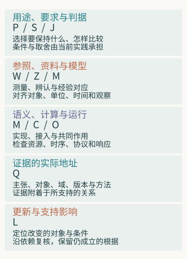
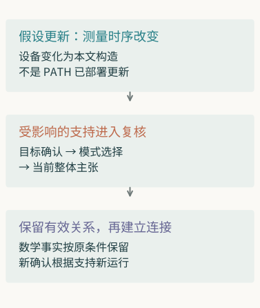

一个预测器误差更低，一个求解器运行更快，一个控制律在模型内有更好的响应。前五篇已经说明，这些判断各有自己的对象和条件。现在要作的决定更进一步：把候选用于某项任务，让计算参与选择，或者让它接入持续运行的系统。原来的正确结果怎样成为这个决定的根据？中间还有哪些关系需要建立？

2010年的 PATH 合作式自适应巡航原型，可以把这项工作放到可辨认的对象上。Bu、Tan和Huang在两辆已有原厂自适应巡航系统的FX45上增加通信和控制；新控制通过虚拟距离与相对速度接入原系统，而不是直接取得油门与制动的完整控制权。[^path] 因而方程中的输入、程序的输出和车辆上的作用，要经过实际接口才能相接。一个局部计算结果到这里，才开始取得运行含义。

本篇沿着这种接入展开，却也保留没有实时装置的用途。离线计算可以帮助比较方案，学习模型可以产生建议，有状态工具可以执行操作。所需关系随它们改变。用途、参照对象、资料、模型、要求、判据、计算、运行、证据和更新，将在各自发生作用的位置取得内容，合成一项可以继续使用、也能根据反馈修订的工程判断。

## 一项决定怎样提出完整问题

先把“可以使用”放回一项决定。研究者可能要比较两种设计，开发者可能要替换一个在线服务，运行者可能要允许某个控制器在指定工况中执行。比较、替换与允许执行，各有不同后果。所需答案可以是排序、误差界、允许域，或某项操作在条件下取得资格；一张统一的合格标签不足以表达这些区别。

把用途或决定记作 $P$。它说明为什么计算、结果将交给谁、会进入什么操作，以及哪些后果需要承担。用途还会选择时间范围、对象总体和容限。一次离线方案筛选可以接受稍长计算；一个每拍更新的控制器则须在结果能作用的时刻以前完成。两者使用相同方程，仍可能面对不同工程问题。

要求由用途形成，却需要进一步说明。所谓“性能好”，可以分成最大偏差不越界、平均误差降低、响应及时、控制平顺、失败后能够恢复。每一项都要指出评价什么、在什么域中、对哪些运行和时刻成立。要求也可能互相竞争：扩大允许输入会增加计算负担，降低误差可能牺牲响应时限，增加重试可能扩大作用风险。

这些竞争不能由模型替参与者决定。数学可以算出某个容限下可行的方案，显示放宽时间或缩小输入域会得到什么；选择哪种代价仍属于当前实践。若所需判断包含人与组织的责任，相关约定就应进入用途说明。把其中一项偏好写成损失函数，未使其他后果自动消失。

一个起初宽泛的问题，因此可以逐渐取得可工作的形状：在声明的对象和情境中，哪项候选满足必须保持的要求，剩余方案怎样比较，已有根据能支持到哪里？这项形状容许探索继续展开。此时尚未知道所有参数，仍可以先研究必要关系；等到要把结论用于实际选择，未闭合的条件就必须有明确地址。

第一篇讨论了数学怎样形成问题。工程用途在这里接续那项工作：不把日常愿望直接等同于一个优化目标，而是让所关心的后果进入对象、关系和可检查判断。新的计算有时还会改变原问题，使某项此前被忽略的要求显出来。

## 责任图怎样区别对象与关系

为跟踪这些责任，先留下几个记号。$W$ 是当前参照对象或现实范围，$Z$ 是取得的观察、资料及其来源，$M$ 是有确定语义的模型。第二篇建立 $W,Z,M$ 之间的经验关系，第三、四篇展开 $M$ 内部及其变换。模型所指什么、资料怎样得到、参数怎样选择，各有不同端点。

$S$ 记录要求或规范，$J$ 记录实际采用的目标、损失或决策判据。$C$ 是计算制品，包括离散化、算法、代码、数值与资源行为；$O$ 是实际运行或接入的系统。第五篇已经使 $O$ 中的互联、时序、协议和替换具有可研究的内容。这几个对象相接，却不能用同一个“模型”指称以后便免去对应关系。

$Q$ 表示有地址的资格化根据，$L$ 表示变化以及变化对根据的影响。它们也有不同作用。证据不是流水线最后生成的一份总分，而是支持某项主张的材料与方法；更新也不只是给所有节点同时添一个版本号，而是改变其中一些对象，继而检查哪些支持关系还成立。用途 $P$ 则选择这些工作的方向。

这些字母组成责任图，不组成十站固定流程。原始资料可以用于选模型，也可以用来核验计算结果；要求可以先提出，也可以在实验后修订；已经组成的运行系统还可以重新打开，调查其中的状态与通路。离线用途未必有自动执行装置；一个纯数学推导未必有经验对象。没有这项角色时，保留它的空缺，比虚构一个节点更有用。

图上的箭头需要动词。由 $W$ 到 $Z$，可以是测量、抽样或记录；由模型到计算，可以是离散化、求解或解码对应；由计算到运行，可以是接入、调度或执行。若一个模型仅帮助解释资料，它与现实也未必是一条单向函数。概率核、关系、约束和可接受行为，各按当前对象选择。

读这张图，应能从一个结论退回它的前提。某项证明建立模型内性质，另一项核验支持程序对模型的实现，一组现场材料支持指定观察下的现实对应。它们若接不上，缺少的是一条有内容的关系。把对象重新命名为“数字孪生”“世界模型”或“智能系统”，并未填上该关系。

这项区分也容许简化。若用途只是计算一个已经定义的最短路，要求与操作判据可以精确重合；若不用资料辨认未知量，便无须加上训练环节。简化来自所问对象，体系的完整性则来自重要责任都有承担者。节点越多，不等于判断越完整。

## 要求怎样与平均指标分开

先看一个可以算清的反例。用一百个等权情形比较两项候选，评价量为非负误差。旧方案在每个情形误差都是 $1$；候选在九十九个情形误差为零，在剩余情形为 $5$。平方误差的平均分别为 $1$ 与 $25/100=0.25$，候选平均指标明显改善。若要求每个允许情形误差不超过 $2$，旧方案满足，候选却不满足。

这里没有估计误差，也没有样本外推。即使这一百个情形就是整个允许域，平均与最大仍是不同操作。平均使频率进入评价，最大保留最坏偏离；将平均下降称作全部要求改善，错在两个量之间没有那项蕴涵。新增样本可以改变经验平均，不能改变这个构造的逻辑关系。

若情形是随机抽取，区别还会多一层。经验平均是一项资料统计量，总体期望依赖抽样分布；最大误差或逐次约束又需要自己的域和量词。训练、验证和运行总体不同，统计关系还须穿过分布变化。先辨认每项量的地址，才知道该补充统计证据、最坏情形分析，还是修订要求。

把要求写成允许轨迹集合 $S\subseteq\mathcal T$，目标写成 $J:\mathcal T\to\mathbb R$，即可组织这种区别。$S$ 决定哪些轨迹可接受，$J$ 在候选轨迹之间给出数值比较。若变量是决策 $u$，经模型产生轨迹 $T_M(u)$，一项设计问题可以写成

$$
\min_{u\in\mathcal U}J(T_M(u))
\quad\text{subject to}\quad T_M(u)\in S.
$$

域 $\mathcal U$ 规定可选操作，映射 $T_M$ 规定当前模型中的后果。可行性先由约束决定，目标再选择可行方案。若每个 $u$ 都不可行，优化器没有义务创造一个合法方案；需要返回问题，改变候选、条件或当前要求。一个数值最小值本身没有说明是否取得可行性。

有的用途只在乎累计损失，那么平均或积分本来可以成为要求。此时可以直接写 $J\le\tau$，不必人为把要求与目标分成互不相干的两层。仍需说明这个阈值对当前用途为何足够，以及另有何种约束。区分的用处在于看清重合在哪里、未重合在哪里，而不是规定它们永远不同。

第五篇的增益也可回到这里。同步下较快的绝对衰减是一项比较，固定延迟下趋零是一项要求；若两种上下文都被允许，就分别建立相应判断。把快慢、可行和允许域放回各自位置，原来的两项正确计算便能共同指导选择。

## 目标权重怎样改变选择，却未替代硬条件

不同目标可以组合成 $J=\alpha J_1+\beta J_2$，权重说明当前怎样交换两项代价。若 $J_1$ 用米计、$J_2$ 用秒计，权重还承担单位和尺度。换一个计量单位却保留同样数值权重，可能改变所选方案。因此权重既有数学作用，也保留用途中的取舍，不能仅凭“归一化”一词把它变成中性事实。

有时团队把硬约束违反也写进损失，期望优化器自行避开。取实数决策 $u$，原要求 $u\le1$，原目标 $(u-2)^2$。受约束的最优解为 $u=1$。若改用有限罚权重 $\lambda>0$，目标成为

$$
J_\lambda(u)=(u-2)^2+\lambda\max(0,u-1)^2.
$$

在 $u>1$ 的区间，导数为 $2(u-2)+2\lambda(u-1)$，零点 $u_\lambda=(2+\lambda)/(1+\lambda)=1+1/(1+\lambda)$。目标全局严格凸，这个零点就是唯一最优解，却对任何有限 $\lambda$ 都违反原硬约束。加大罚权重使越界缩小，未使它消失。

这次推导不否定罚方法。它使当前罚函数的后果明确：若用途容许至多 $\epsilon$ 的越界，可由 $1/(1+\lambda)\le\epsilon$ 选择权重；若用途要求精确不越界，就保留约束，或采用具有相应条件的其他方法。哪一种适合，要由原要求、求解方式和实现容限共同决定。

更一般的优化还可能出现不光滑、局部极小、不可行迭代或终止误差。把一个指标写得很完整，并未建立算法找到什么。理论最优解、算法输出和输出的实际后果，接下来又有不同关系。要求在每一处都应保留它关心的内容，不能在目标写下以后便丢掉。

工程取舍因而可以更具体：保留必须满足的域，在其中比较代价；若确实改变约束，把改变的容限和后果写入用途；再为求解结果建立满足关系。数学显示了有限罚权重与严格约束之间的差，选择也因此多了一个真实根据。

## 参照对象怎样通过观察进入判断

模型并不把现实整体搬进方程。它选择某个对象及其关系，用状态、量、规则或概率律表征其中所问的部分。$W$ 因而需要说明当前范围：是一项装置、一组工况、一个资料总体，还是某种机制。用途改变后，同一现实对象可能需要不同观察；新的观察也可能迫使模型扩大。

第二篇把测量与经验关系分别展开。此处沿用它们的职责：现实历史经测量取得记录，模型历史经观察得到可比较量，再在声明的工况中研究两者关系。若现实观察与模型观察的单位、起点、时刻或所指对象不同，一项数值差便没有当前声称的意义。对应先成立，误差才有地址。

所谓“前方目标”“输入温度”“当前状态”，都包含指认工作。量的名字不能代替实体持续被辨认；时间标签不能代替数据真的属于那个时刻。一个输出可以准确预测错了身份的对象，一个控制器也可以准确使用过期量。程序按字段计算正确与现实关系正确，分别需要根据。

把参照关系记作 $\rho$，并不要求它一定是现实状态到模型状态的一项全函数。有时只在给定操作域内对应，有时由测量核给出条件分布，有时只匹配某些观察。若模型省略了不影响用途的细节，这些细节可以有多个内部对应。重要的是当前推理实际使用了哪项结构，以及已有材料支持它到哪里。

同一参数也可能有不同经验含义。它可以是独立测得的物理系数，也可以是为了当前域拟合的有效参数，或只是使输出合适的自由量。三者都能进入计算，却不能采用相同的外推理由。一个拟合参数与某物理量数值接近，并未由此证明它们在新工况中具有同样变化规律。

工程判断因此须保留表征与观察的有效域。这个域可以随实验增长，也可以被反例修订；它不是永远贴在模型上的免责声明。真正有内容的域说明，应该告诉我们什么变化仍由原关系覆盖，什么变化需要新的测量、状态或经验研究。

## 资料怎样在不同操作中取得不同职责

资料 $Z$ 先有取得方式。来源、采样策略、单位转换、缺失、过滤和标注，会改变记录支持的内容。一个文件能够读取，只说明制品可用；记录能否代表当前对象，须通过这些操作说明。第二篇关于自适应抽样与辨认的结果，进入这里以后仍保留它们的条件。

同一批数值可以承担不同职责。训练资料用于选择参数或结构，验证资料用于评估某项已选对象，运行输入用于当前计算，现场记录用于比较实际表现。职责不同，所需独立性、版本与操作顺序也不同。若通过验证集反复选择候选，它已经参与选择；最终报告便不能继续把它当作完全未参与的新检验。

这项变化与名称无关。把文件夹命名为“test”不会消除选择路径。应保留哪些决定看过哪些资料，以及后来的结论在什么条件下成立。有时可以保留新的独立样本，有时采用适合自适应选择的分析；若现有材料只支持探索性比较，就按它实际的作用形成判断。

资料还可能更新当前状态，而未重新训练模型。固定模型每步读取新测量，语义规则不必改变；在线辨识将记录送入参数更新，下一步模型实例则随之变化；生成服务追加历史，参数虽固定，状态却改变。三种操作需要分别记到运行状态、模型实例或训练制品上。统称“模型更新”会让证据影响难以定位。

重复记录也不自动增加相同数量的独立信息。一个传感器每毫秒采样，连续误差可能高度相关；一项模型连续生成的文本也可能共享条件与随机状态。若结论使用独立样本的概率界，相关结构就属于前提。第五篇已经算出相同边缘失败率、不同共同开关如何改变风险，这里的资料量同样不能替代联合关系。

来源变化有时只改变谱系，有时改变内容。把相同字节迁到新存储位置，可能保留原数值和语义，却改变取得记录的可追踪路径；换一种标注规则，字节结构可能类似，标签所指已经不同。追踪时先问哪项操作真的改变，再检查依赖它的主张，便能避免把一切变化都要求整套重做。

## 学习系统怎样分成家族、实例、训练与运行

大型神经网络尤其容易让“模型”承担太多指称。架构与参数域定义一族 $\{M_\theta:\theta\in\Theta\}$，一个参数记录选择其中实例；训练规则在资料、初值和优化器状态下产生参数，实际程序又把参数解码成可执行函数。运行服务还加入精度、缓存、采样、资源与权限。每一项都有与邻项相接的关系。

第三篇已经说明，参数到函数可以不是单射。不同参数记录可能实现同一前向函数，同一函数却未必保持梯度、表示或后续训练。第四篇进一步说明，坐标、参数化和尺度会改变训练几何与极限。于是在当前用途只比较前向误差时可以采用函数观察；一旦用途包含继续训练，原来隐藏的结构便应重新留下。

训练过程自身是操作对象。设训练算法为 $\mathcal A$，资料与配置为 $D,\gamma$，随机或初始状态为 $\xi$，它产生 $\theta=\mathcal A(D,\gamma,\xi)$。这项写法记录生成关系，未承诺训练收敛、总体误差或最优性。若要建立其中任一结论，就对算法、资料分布、模型家族和误差对象给出实际条件。

运行程序记作 $C_{v,\gamma}$，其中 $v$ 是制品版本，$\gamma$ 是影响执行的配置。即使参数文件不变，不同精度、截断长度或采样策略也可能改变输出与时序。配置若选择不同算法分支，计算语义就应包含它。只记录一个权重文件校验和，未完整记录此次运行对象。

还可以把参数记录与语义实例分别保留。一次重新训练取得新记录后，当前观察下的函数可能近似不变；表示和调用概率仍可能变。哪种身份继续沿用，由所问关系决定。治理或维护中把两者归入同一谱系，也不等于在每个工程用途上都可以不经检查地替换。

这番拆分增加的不是名目，而是修改入口。若程序解码错误，回到 $C$；若预测在新总体失效，调查资料和经验关系；若有限网络不符合采用的尺度近似，回到第四篇的连接；若工具调用改变实际状态，回到第五篇的开放行为。修订可以指向失败发生之处，已有正确关系因而仍能保留。

## 语义模型怎样成为一项计算

一个连续动力模型规定允许轨迹，离散化选择有限步的近似，求解器在有限资源中取得数值，程序再用实际算术执行。这几项可以合成计算，却各自改变内容。若把它们都叫作“运行模型”，便难以说明误差来自方程的现实对应、近似步骤，还是代码对算法的实现。

取作者构造 $\dot x=-x$、$x(0)=1$，观察 $0\le t\le T$，精确解为 $x(t)=e^{-t}$。显式 Euler 在步长 $h$ 下产生 $x_{k+1}=(1-h)x_k$。当 $0<h<1$ 时，它从正初值保持正值；当 $1<h<2$ 时，数列仍衰减，却交替变号。原连续轨迹的正性没有由离散稳定性单独保存。

这项区别使求解要求具体了。若用途只需固定终点附近的误差，可以选择并检验相应步长；若每一步状态必须非负，则要把正性纳入方法或步长条件。一个方法在细化时一致，并不使每个有限步都取得用途中的全部性质。第四篇对有限网络和极限关系的审查，在数值计算中同样保持这个职责。

优化算法也有自己的计算义务。对无约束可微强凸函数 $f:\mathbb R^d\to\mathbb R$，采用欧氏范数，设强凸常数为 $\mu>0$，最优点 $u^*$ 存在。强凸不等式交换两点后相加，给出梯度强单调；利用 $\nabla f(u^*)=0$，若返回点 $\widehat u$ 满足残差 $\|\nabla f(\widehat u)\|\le r$，$r\ge0$，则

$$
\mu\|\widehat u-u^*\|^2
\le\langle\nabla f(\widehat u),\widehat u-u^*\rangle
\le r\|\widehat u-u^*\|,
\qquad
\|\widehat u-u^*\|\le r/\mu.
$$

两点相同已满足结论，不同时除以距离即可。这项计算把可检查残差传到决策差，读出若有 Lipschitz 常数，还可继续传到目标观察。弱曲率使同样残差对应更大距离，选择终止阈值也因此需要 $\mu$。残差小的意义，来自它与当前模型之间的关系。

这次界限针对无约束强凸对象。边界最优点的梯度可以不为零，非凸对象的零梯度也可以是其他驻点；应改查约束残差、可行性或当前能够证明的局部关系。一个算法返回“converged”，也要说明它采用什么判据、数值计算怎样取得该判据。名字不能替求解性质承担前提。

计算制品 $C$ 因而须留下解码、方法、精度和终止规则。模型偏差、离散误差、求解误差与实现误差可以分别估计，再沿映射合成；也可以直接对整个计算取得较粗的界。较粗估计若已足够，无须强分每项。需要改进时，保留来源便使修正有方向，而不是一律再训练或加算力。

## 程序怎样实现模型中的允许行为

把程序输出与模型相接，要先使两端成为可比较对象。代码里的数组、整数和事件，经解码映到模型输入、状态或观察；计算时钟与模型时间也须对齐。一个控制命令不能直接拿来与模型中的间距误差作差，只有把命令放进相应环境、取得闭环观察以后，才有那个比较。

记合格计算行为为 $\mathcal B_C$，模型行为为 $\mathcal B_M$。给定当前解码观察 $o_C,o_M$ 与距离 $d$，可以要求

$$
\forall b_C\in\mathcal B_C\ \exists b_M\in\mathcal B_M,
\qquad d(o_C(b_C),o_M(b_M))\le\epsilon_C.
$$

这项有方向的对应说，每个计算行为都有模型行为支持。$\epsilon_C=0$ 时，若模型全部允许观察都满足某项性质，计算也满足同一观察性质。近似对应则需性质有相应裕度。若观察为实数、距离取绝对值，模型观察至多 $\tau-\epsilon_C$，便可推出计算观察至多 $\tau$。一项距离对什么起作用，由所选观察决定。

存在量词没有要求程序实现模型全部行为。一个确定算法可以在许多模型解中选择一种；若用途只要求每次输出合法，这样的单向关系可以足够。若用途要求每个允许输入有响应，还要检查输入覆盖与进展。空的 $\mathcal B_C$ 会使对应式成立，仍不能充任运行制品。第五篇的包含与响应区别因此回到实现端。

概率职责也不能只用这项无权重关系。程序可能只输出支撑内合法结果，概率却严重偏离目标律。性质若涉及多条运行之间的关系，也须保留相应联合结构；给每条运行独立寻找一个见证，未必取得同一内部对象上的共同对应。比较方法随性质选择，当前式子只承担它能够传递的职责。

实现核验可以用证明、已知解、构造输入、数值细化或其他与主张相配的方法。各方法留下的根据不同：一个基准展示特定输入上的行为，一项形式对应可以覆盖所声明的全部程序行为。若采用有限测试再作范围更大的结论，仍需要覆盖或外推理由。测试通过的布尔值不能隐藏这项变化。

这样取得的实现关系使代码可以继续进入互联。第五篇说明接线和环境怎样改变局部结论；如今还要检查程序的行为、资源和时序是否填得上该槽口。模型、算法与程序之间的关系保留，接入时增加的条件也有了清楚起点。

## 计算怎样沿真实接口取得作用

回到 PATH 原型。论文§II的接入路径是PC104接收DSRC与车载总线信息，把虚拟相对距离和速度交给原厂ACC；§III-A在目标未被确认时恢复真实LiDAR路径；§III-C采用在线参数辨识与间接自适应MPC。[^path] 这些事实指定了一个具体系统，便于检查计算在哪个边界发生作用。

虚拟量在此承担控制接口，而非新的真实测量。原厂控制器继续参与从这项输入到车辆动作的关系。因此新程序的输出语义，应按这条通路定义；不能看到字段叫“距离”，就把虚拟值当作实际间距。它在控制上的用途，经过接收者的规则和后续作用才取得内容。

这项接入还使保留边界成为实际选择。若只比较新控制器，原厂控制器、通路和车辆属于上下文；若考察完整响应，则可将它们合成较大对象。两种选择都能研究，但证明所用假设应落在对应承担者上。若一项局部计算借用了下游的响应能力，运行审查就要检查那个能力是否在当前系统中取得支持。

目标确认也属于模型与现实之间的关系。方程可以采用一个“前车”状态，装置须持续判断当前信息是否来自该对象；身份条件不满足时，控制模式随之改变。这里的切换需要保留信息来源、确认状态和恢复路径。一次固定模式中的性能计算不能独自覆盖这些路径。

第五篇已为这项工作提供形式内容：接口规定可开放的量与能力，接线规定共同历史，模式改变则研究相应组合。真实接入进一步增加现实对应与资源条件。数学闭环和运行闭环之间，因而既有可以计算的关系，也有要由现场材料支持的关系。

这条路径不把一次工程判断化成单一方程，却使每项所缺变得具体。程序怎样生成虚拟量，接收者怎样回应，确认失败怎样继续，结果何时生效，都可以成为分别研究的对象。较细对象取得了足够根据，再组成用于当前决定的整体。

## 在线运行与离线使用怎样分别闭合

在线作用有一条运行路线：现实产生观察，观察经程序形成输出，输出由运行系统执行，执行再改变现实。可以用 $W\to Z\to C\to O\to W$ 记录这项往返。箭头分别表示测量、读取计算、接入执行和实际作用，不是四个同类型函数。时间、状态与条件必须跟着各项操作保留。

模型 $M$ 为计算提供语义与方法，未必在每拍被重新构建。固定控制律反复处理新输入，模型实例可以保持；在线辨识则另有资料到参数或模型实例的更新关系。一个运行回路与一个辨识回路可以并存，却不能仅凭运行箭头推断模型一直在学习。

离线用途可以在结果到达决定处闭合。计算比较方案，证据支持结果的精度与适用域，参与者据此选择、拒绝或追加研究。没有自动作用回路，也仍有结果怎样支持决定的职责。若后来按选择建造装置，那是另一项操作，需要它的实现和使用关系；不应提前把未执行的决定写成已经部署。

两条路线会采用不同的时间要求。离线计算可以在结论形成前等待细化，在线控制可能要在下一拍以前取得可用结果。若允许超时回退，超时事件与回退行为就应进入 $O$ 的语义。仅有平均计算耗时低，没有建立每个合法历史上的截止保证；只看成功返回，也可能隐藏没有及时完成的情形。

资源因此成为行为的一部分。内存、计算、并发和通路拥塞可以改变响应时刻，乃至决定有没有响应。一个程序在理想机上取得模型关系，仍需要当前运行配置下的资源根据。若实际目的允许概率时限，就采用相应风险与条件；若要求确定截止，则应建立那个量词。

把两条路线分开，能避免两种空缺。离线结果不必伪装成现场闭环才有价值；在线接入也不能凭离线准确率便称其响应已经合格。每条路线沿实际用途闭合，缺少的关系便由它自身指出。

## 证据怎样取得主张、对象与条件的地址

一项证据可以记作 $q=(\varphi,X,P,D,v,m)$：主张 $\varphi$，被评对象 $X$，用途 $P$，条件域 $D$，版本或配置 $v$，以及方法 $m$。这是组织记录的写法，不要求所有证据都化成同一数据结构。关键是能够回答它支持什么，关于谁，在何种条件下，采用了怎样的建立办法。

一份模型证明的对象可以是语义行为，一次代码核验的对象可以是实现对应，一组试验的对象可以是当前装置的指定表现。它们彼此贡献，却没有自然相加成一个“可信度”。证明中的全称量词、试验所见情形、统计推断的总体和置信水平，需要在送入后续结论时继续留下。

方法也决定支持上限。仿真在给定语义和配置中产生历史，可以检查算法和组合表现；硬件参与会增加实际设备的资源与接口表现；现场试验进一步取得现实条件中的观察。每一步都可以提供新内容。所增加的内容需由实际试验说明，不能只按名称排列成自动越来越强的等级。

例如硬件试验若仍由模拟传感器提供输入，它没有直接检验真实目标的持续辨认。现场表现若没有出现回退，则也没有验证所有失败路径。指出这些区别，是为了让下一项研究对准缺少的关系。已有试验对所见对象和工况的正面支持仍然成立，不必因为没有包办一切而被说成无效。

证据与论证的连接还可以有明确义务：前提得到支持，方法对前提中的对象有效，方法所得结论足以支持当前主张。若使用两个来源，便分别保留它们的系统身份。另一个平台的实时求解结果，可以启发当前实现选择，不能直接改写成 PATH 原型已经取得的运行数据。

*原创责任图。各面板保留一组需要建立的关系，整体可向内调查、向外组合。图中没有将所有角色排成固定阶段；正文给出箭头的操作和证据义务。*

证据地址因此使复用可行。若新用途仍在原条件域内、对象与所用性质未变，原结果可以成为当前根据；若其中一项改变，检查对应关系和依赖，而非直接复制合格标签。$Q$ 从此与 $L$ 接上：版本记录保存变化，证据审查判断该变化是否影响当前主张。

## 不同误差界怎样在同一观察中合成

用一项条件推导说明证据如何共同作用。取同一定义的误差观察 $e$，模型闭环给出 $e_M$，程序与形式环境组成的闭环给出 $e_C$，现实运行给出 $e_W$。三者同属一个有距离 $d$ 的观察空间。若观察是时间序列，距离可以是指定区间的峰值范数；若是终点量，就固定终点和单位。

声明一个对应运行族 $\Xi$，规定初值、外部输入、对象身份和时间的对齐。对每个 $\xi\in\Xi$，三个观察在所需时刻取得，并有非负界

$$
d(e_M(\xi),0)\le\epsilon_M,\qquad
d(e_C(\xi),e_M(\xi))\le\epsilon_C,\qquad
d(e_W(\xi),e_C(\xi))\le\epsilon_W.
$$

零表示当前误差空间中的目标观察。第一项由模型内分析支持，第二项由计算及组合对应支持，第三项由经验关系、接入与测量不确定性支持。若直接观察只有带误差记录，还要为它与现实量的差建立界，或将这项内容明确计入 $\epsilon_W$。不能把仪器记录未经处理便称作真实值。

三角不等式给出

$$
d(e_W(\xi),0)
\le\epsilon_W+\epsilon_C+\epsilon_M,
\qquad\forall\xi\in\Xi.
$$

若工程要求是观察距离至多 $\tau$，而三项和不超过 $\tau$，该族中的要求就由这些前提推出。这是一项正面的合成判断。本文没有为 PATH 系统填写这三个未经建立的数，也没有把其现场图当成所有运行的统一界。

合成有容易被遗漏的对齐条件。第二项若只在一个初值成立，第一项却覆盖另一组初值，便不能共同支持原全称式；第三项若比较的是速度，前两项却比较间距，也不能直接相加。不同时间基、不同输入或不同模型实例，都需要先建立连接。单独看来各自正确的数，没有自动形成一条证明。

观察还决定要求的覆盖。间距误差有界不独自说明加速度、控制饱和和目标身份合格；若这些也属要求，就增加相应观察或独立性质。反过来，若当前用途只需一个终点比较，无须强求完整状态的全时域距离。合成沿所求性质工作，精度预算也在它真正发生作用的位置分配。

这项组织可以指导设计。把容限分给模型偏差、计算与运行对应，寻找最限制当前判断的项；改进该项后再重算总界。若某项根本没有根据，先调查它，而不是把其他项继续压小。一次数值优化能够改进计算界，却不能由自身建立尚未测量的现实关系。

## 确定界、风险界与置信度怎样分别承担结论

现实观察也可能带随机内容。设同一概率空间和共同运行对应上，三个误差事件分别满足 $\Pr(E_i)\le\alpha_i$，其中 $E_i$ 表示第 $i$ 项超过当前预算。所有事件都不发生时，上一节的三角不等式仍成立。于是

$$
\Pr\{d(e_W,0)>\epsilon_M+\epsilon_C+\epsilon_W\}
\le\Pr(E_M\cup E_C\cup E_W)
\le\alpha_M+\alpha_C+\alpha_W.
$$

并集界无需独立。若声称乘积概率或更好的联合界，就须另给依赖结构。这次概率来自同一个实际定义的运行或随机对象，不能把不同总体上的三个概率直接合成。风险前提共同有了地址，合成风险才有相应对象。

有限资料估计风险，还会增加关于证据自身的概率。取独立同分布的二元失败试验，真实失败率为 $p$。$n$ 次均未见失败的概率是 $(1-p)^n$。给定置信参数 $0<\alpha<1$，令 $p_*=1-\alpha^{1/n}$；若真实 $p>p_*$，看到零失败的概率便小于 $\alpha$。因而零失败可以按这项抽样模型报告单侧上界 $p_*$。

这是一项频率学的检验反演：在重复资料生成下，超过该上界的真实率产生零失败记录的概率受控。它没有说眼前这一个未知 $p$ 自身以概率 $1-\alpha$ 小于上界。若要给参数后验概率，就需另一套先验与统计模型。两种概率语义可以各有用途，不能混在同一句“风险小于”中。

独立同分布仍是当前推导的前提。若全部试验共享同一个失败开关，试验次数再多，全部成功的概率也可能只为 $1-p$，不再是 $(1-p)^n$。若测试总体与未来运行总体不同，还要说明两者的关系。零失败的记录本身不能建立独立，也不能建立外推。

多次检验、筛选候选和持续监测还会改变证据使用方式。一个预先固定候选的置信结论，若被用来从大量候选中挑最好者，应检查选择带来的影响。可以重新取得独立资料，也可以采用与选择相配的方法。要求并未因此消失，所需证据模型变得更具体了。

工程判断可以同时留下两层不确定性：模型或运行中事件的风险，和取得该风险界的统计根据。若用途容许风险至多 $r$，便比较实际风险上界；若还要求对该上界的证据达到某置信水平，就把证据条件另列。把两者分开后，数据量、运行裕度和研究下一步都有了不同作用。

## 计算核验与经验验证怎样共同支持用途

这些地址在科学计算中有成熟区分。Yeo的NISTIR8298报告把代码核验、解核验和模型验证分开：前两者研究数值算法的实现以及当前计算的误差，后者研究模拟与现实的联系，并从预定用途评价精度是否足够。[^vvuq] 这里采用它对职责的说明，实际工程对象和所需方法仍按当前任务建立。

已知解可以使代码核验具体。人为选择 $x_*(t)=\sin t$，构造方程 $\dot x=-x+\sin t+\cos t$、$x(0)=0$，则 $x_*$ 精确满足该方程。程序按不同步长求解，可以与已知轨迹比较，检查当前算法与实现的误差和细化表现。这是一项人为构造的核验问题，有意取得可计算参照。

该构造没有把 $\sin t+\cos t$ 证明为某装置的真实外力。代码吻合已知解，支持它在该对象上的实现关系；装置是否由这条方程表征，仍需自己的测量与经验根据。若将同一方法迁到更复杂方程，还要检查它所用结构是否覆盖新的计算，不应把一个基准通过写成全部代码行为已经证明。

解核验进一步面对当前计算。相同代码可能在不同网格、步长、初始条件与终止容差下取得不同误差；一个已核算法并不使每个配置都足够精细。第四篇给出的局部误差累积，就能说明为何局部小与终点小之间还需稳定关系。算法正确、当前解精度足够与模型对现实适用，因而是能够相接的三项判断。

经验验证使第三项关系进入观察。将所关心的现实量与模拟观察对齐，计入测量、参数、计算及所知不确定性，再研究差异是否在用途容限内。若只需排序，未必需要每个状态极准确；若关心峰值风险，平均吻合未必足够。验证所问的精度由用途选择，方法应保持该观察。

“符合实验”也可以有不同内容。参数先按同一记录调到吻合，支持一种拟合结果；用未参与选择的新记录评估，可以提供不同的根据；在可说明的域变化中继续成立，又增加一种外推支持。区分这些操作，能使证据既不过度提升，也不被一律降低成没有意义的数值相合。

于是代码核验、解核验和经验验证共同进入责任图。它们不保证一切未来用途，却能在实际对象和容限下闭合一项判断。若数值细化已经足够而现实偏差仍大，下一步应调查经验模型或观察；若已知解都未能正确取得，先修计算关系。修正顺序来自所缺内容。

## 有限现场结果怎样支持一个明确范围

PATH论文§IV图7记录试验场中时距设定从1.1s改为0.9s的调节，图12另报告公共道路运行。[^path] 两类材料把接入后的响应放到了实际对象上。它们提供所报情形的正面表现，能够与模型和计算的关系一起使用；从这些情形到更大的运行族，还需进一步理由。

先区别两种量词。一次记录表明在该次输入、初始状态和环境中发生了什么；一项全域保证则要求所有允许输入与状态都满足性质。有限条轨迹可以直接检验其中的轨迹，也可以据抽样模型支持总体结论，或帮助检验一项机制的前提。由哪种路线扩大，取决于材料怎样取得和所求性质是什么。

道路表现的对象也包含配置。车辆、通路、控制参数、观测和模式选择共同形成该次运行。若后来的程序与设备改变，不能继续只引用论文题名便宣称当前对象也取得相同表现。保留版本与输入记录，使这项支持可以找到对应处；没有完整配置的地方，则明确下一项复用还需取得什么。

负面结果也可以具体。一次违反峰值要求，足以否定声称覆盖该次运行的全称保证；一次不违反，却不足以单独建立那个保证。若反例发生在允许域之外，它可能促使扩大用途，也可能说明当前限制确有作用。判断先检查域与事实，再决定是修改对象、保证还是使用条件。

现场材料还能改变模型。持续偏差可以暴露未留状态，模式切换可能显示原固定结构不足，作用时刻可能与逻辑时刻错开。此时把试验仅当作“最后验证”会遗漏它的发展作用。第二篇的观察、第四篇的变换和第五篇的互联，都可以由这些材料重新进入。

较完整的现场判断，因此是对一个明确对象和范围承担结论：哪些要求已由何种材料支持，什么条件使这份支持可用于当前决定，域外变化由什么反馈发现。它既留下正面所得，也留下继续扩大的入口。结论的强度由证据和理由决定，不由报告写得多肯定决定。

## 没有自动执行装置时，离线决定怎样成立

现在构造一项离线用途。团队要在有限方案集 $\mathcal A$ 中选择一个设计，评价量 $R_W(a)$ 是当前现实用途关心的代价或载荷；模型与计算分别给出 $R_M(a)$、$R_C(a)$。这里的现实量可以是尚待建立的目标对应，而非已经观测到的结果。先声明误差条件，再看它足以支持什么选择。

若每个候选在同一工况定义下都满足 $|R_M(a)-R_W(a)|\le\eta_M$ 与 $|R_C(a)-R_M(a)|\le\eta_C$，令 $\eta=\eta_M+\eta_C$，便有 $|R_C(a)-R_W(a)|\le\eta$。这些是作者构造的统一条件；具体设计若采用它们，须为各项取得独立支持，不能从计算结果本身读出模型偏差。

设计算选择 $\widehat a\in\arg\min_{a\in\mathcal A}R_C(a)$，现实最优候选为 $a^*\in\arg\min_{a\in\mathcal A}R_W(a)$。有限非空候选集保证最小值存在。由统一界，

$$
R_W(\widehat a)
\le R_C(\widehat a)+\eta
\le R_C(a^*)+\eta
\le R_W(a^*)+2\eta.
$$

这项结果保留的是现实候选集内的代价遗憾至多 $2\eta$，未承诺绝对最优，也未比较候选集之外的设计。计算输出沿误差关系进入决定，已经可以有明确价值。若容许这项遗憾，现有精度可以足够；若必须辨出严格排序，就要取得相应裕度。

两候选尤其容易判断。若 $R_C(a_2)-R_C(a_1)>2\eta$，则 $R_W(a_1)<R_W(a_2)$；差距小于或等于这项阈值时，统一误差界本身未保证严格顺序。例如计算为100与103、$\eta=2$，真实允许区间相交；若计算为100与105，区间已经分开。数值均为本文构造，用于说明决定对精度的需要。

硬要求可以同时进入。若需 $R_W(a)\le104$，计算100且误差至多2便给出真实上界102，足以支持该要求；计算105给出的上界107则不足以证明它。后者不等于已证明真实值超过104，因为区间下界仍为103。不能认证、已经反驳与已经建立，是三种不同结果。

这套推理同样可以用于离线科学计算的方案比较，却不声称NIST报告已经为本文候选提供了那两个误差界。报告提供核验与验证的职责，本节建立判断如何使用这些职责的条件关系。没有实时 $O$，结果仍经证据进入 $P$；所缺节点可以收缩，重要关系没有消失。

## 学习建议怎样经过工具成为工程作用

再构造一个学习工具用途。网络读取资料，建议某项更新，调用者检查条件后让工具执行。可以把建议限定为一个有边界的决策，比如给已声明对象调整一个参数，而不是让“智能体”一词替所有权限和作用承担说明。候选参数是否可行、建议是否足够好、执行是否只作用于指定对象，分别进入要求。

固定前向比较可以先建立建议函数 $f_\theta$ 与参考函数的关系。第四篇的有界读出和margin，使连续差在合适条件下保持离散选择；第五篇的条件核界，使有限交互风险有对应预算。两种结果各有条件。用哪个关系，要看建议是确定选择、概率输出，还是依赖持续状态的响应。

训练损失不直接等于这项运行关系。它在训练资料与目标上取得数值，建议函数在运行域上给出输出，实际调用又由协议和权限解释。若错误后果集中在罕见输入，平均损失仍可能很好；若工具含持续状态，单次输出类型一致也未保留未来作用。前面的要求反例和第五篇的重试构造，已分别展示这些缺口。

工具侧可以独立建立一项状态保证。采用第五篇保存标识与回执的原子规则，同一标识在其声明范围内至多增加一次计数。学习模型决定何时发请求，调用者负责同一操作的标识一致，通路负责可能丢失回执的历史，工具负责原子提交。各项责任闭合以后，运行性质才有根据；网络建议正确不能替工具证明原子性。

若候选网络改变了请求策略，也须检查原保证是否仍覆盖它。一次建议产生一个标识与重复建议每次产生新标识，会形成不同作用；权限扩大则改变可达操作；超时规则改变重试历史。保留权重文件或接口字段，未保留这些上下文。工程边界应跟着实际作用扩展。

对于较窄用途，可以减少开放内容。网络仅返回供人审阅的建议，工具未自动执行，某些执行责任便留在后续参与者；如果目的就是自动更新，则须将执行与失败后的继续操作纳入当前判断。两种用途都有自己的完整路径，不能用一种用途下取得的根据覆盖另一种后果。

学习系统的研究也可以从这里反向发展。若同样局部误差在不同反馈中产生不同代价，可重新设计损失和资料；若低概率失误产生持续作用，可研究条件核、状态约束和风险控制；若尺度近似没有保存有限网络的判断margin，回到变换与读出。工程关系使数学问题获得新的内容。

## 一项更新怎样沿依赖改变证据

变化 $L$ 先定位对象。换资料来源、重训参数、换求解器、改时钟、扩接口和改用途，是不同事件。某个事件可以影响多个对象，却不要求所有身份同时变化。文件校验和记录字节，语义比较记录行为，运行配置记录接入，治理谱系记录维护关系。它们能够并列使用，不能互相代替。

为追踪影响，取一个由主张和前提组成的依赖图。记 $\operatorname{dep}(q)$ 为证据 $q$ 实际使用的对象版本、条件和中间结论；变化首先找到与这些依赖相交的项，再沿依赖向后检查。这个传播给出复核候选集，未直接判定其中每项都已经为假。是否还能使用，取决于变化后的关系。

一个只替换求解器的事件，可以保留语义问题和经验表征，再查实现误差、终止与截止。若新求解器具有足够界，并符合原时限，系统证据有机会据新的局部根据重新闭合。若只是运行更快却丢失可行性，原截止结果未能包办要求。恢复一条关系以后，后续主张才可以继续取得支持。

资料变化也可以在不同位置传播。新文件若语义相同、来源可核，可以只更新谱系；新标注规则可能改变目标含义，需重查训练与评价；新运行总体可能让经验域不再覆盖用途。参数变化若仍在原证明覆盖的参数族中，族上的结果可以继续用；原固定实例的结果则要检查新的实例是否满足条件。

PATH原型曾用LiDAR相对速度较DSRC车辆速度信息约迟0.5s的观测特征辅助目标确认。[^path] 现在设想换设备改变了这项特征，这是本文假设的更新。原运动方程未改，旧目标辨认根据却需复核，继而检查模式选择和运行观察。改善延迟的一项局部指标，可能改变另一项操作依赖的区别。

*原创更新影响图。设备变化是本文假设，不是 PATH 的已部署更新；箭头标出待重新建立的支持，未把“受影响”画成“已经失败”。*

修正可以保留旧原型的事实：旧设备和工况下的记录仍关于那个对象。新对象要重新建立辨认关系，或者选择另一种确认办法，再检查实际模式与闭环。证据影响审查因此既防止无根据继承，也避免把正确旧结果抹去。变化告诉我们新的工作从哪里开始。

## 运行反馈怎样返回模型与问题

复核以后有时发现，原来的困难并非一项版本对应失效，而是模型没有留下影响结果的关系。用作者构造说明返修。原先拟用 $x_{k+1}=ax_k+bu_k$ 描述一个系统，作为参照的另一构造却是 $x_{k+1}=ax_k+bu_{k-1}$。两式采用相同量和系数，差别在作用延迟。

若程序按前式计算完全正确，核验可以通过；若输入变化时，参考记录的偏差总与动作时刻相接，就应调查通路。只把 $b$ 重新拟合，或许能在缓慢输入上改善平均误差，却未必保留变化时的关系。第二篇关于辨认的讨论说明，实验还需要能够区分这两个候选的输入。

取 $b\ne0$，给定相同 $x_0$、$u_{-1}=0$，输入 $u_0=1$、其后为零。无延迟式给出 $x_1=ax_0+b$，延迟式给出 $x_1=ax_0$，差在第一拍便可见。实验若足以分辨这项差，又把测量时刻对齐，就有理由选择保留延迟的候选。这个算例是理论辨别设计，真实实验还须建立测量精度和作用对应。

新的模型可以扩充状态 $s_k=(x_k,u_{k-1})$，输入仍为 $u_k$。更新成为

$$
s_{k+1}
=\begin{pmatrix}a&b\\0&0\end{pmatrix}s_k
+\begin{pmatrix}0\\1\end{pmatrix}u_k.
$$

先前保留的一维当前状态不足以决定下一步，现在把上一输入留下，便取得闭合。第三篇的内部语义提供状态规则，第四篇的扩充提供变换关系，第五篇的时序互联再检查控制后果。返修沿同一个问题取得了更适合的对象，没有必要先换一个更响亮的体系名称。

变化也可能落在观察而非动力规则。若测量通路延迟，真实状态模型可保留，改写的是观察与接线；若时钟校准有误，先修时间对应。为了分开这些解释，应检查动作生效、观测取得和计算完成的不同时间。反馈先提供线索，区分性的研究再使修订有理由。

更深的反馈会回到用途。例如发现所求截止与现有资源无法同时取得，可改算法、增加资源或重新选择允许域；若参与者实际需要可恢复而非从不失败，要求也可能重写。数学能显示这些方案的代价，目的修订仍要由所关心的实践承担。原结果在旧问题中的作用保留，新问题重新选择需要的关系。

## 一项有根据的工程判断怎样完成，又怎样继续

到这里，可以正面形成一项判断。先明确要作的决定和允许范围，让必须满足的要求与比较判据取得各自内容；再为现实、资料、语义、计算和使用建立所需对应。局部证明、核验和现场材料按地址进入论证，误差或风险在对齐条件下合成，结果与用途容限比较。能够闭合时，当前使用便取得这些根据所支持的资格。

判断也可以明确地不通过。候选低平均误差却违反硬要求，先改变候选或用途中的容限；罚权重未实现严格约束，保留真正的可行条件；程序无响应、超过截止或作用重复，就修对应行为。尚未支持的经验项则进入研究，而不是用已经很小的计算误差掩盖。每种结果都带着自己的修正入口。

对离线方案，统一误差使选择具有 $2\eta$ 遗憾界，足够的排序裕度使顺序保持，保守上界使硬要求取得支持。对反馈组件，局部关系经允许上下文保持良定与性质。对学习工具，建议、协议、提交和回执分别闭合责任。这些是可以继续使用的不同判断，统一之处在于重要关系都有对象、条件和根据。

模型内严格结果仍有自己的价值。它可以建立不变量，计算稳定域，研究尺度与极限，找到原语言未能辨出的结构；进入工程以后，这些所得沿实际对应发挥作用。经验材料也不仅给最后一步盖章，它可以改变观测、状态、参数、尺度、模型种类，甚至所求问题。两边由这些关系共同发展。

六篇的推进因此可以回读。第一篇使问题形成可推理的对象；第二篇建立模型怎样指向经验；第三篇展开呈现、语义、观察和身份；第四篇研究变换、高维学习与尺度；第五篇使开放互联和替换具有构造及证明；本篇将它们送回用途、实现、证据与变化。每篇承担一项完整工作，邻篇提供再进入的地方。

这套理解不要求一次工程活动遍历所有数学语言，也不要求每个判断拥有所有节点。它要求当前重要关系实际成立：选择一个合适对象，知道观察保存什么，说明计算和作用怎样相接，使证据支持到所承诺的范围。较小问题可以沿较短路线闭合；新的问题出现，再打开真正需要的边界。

完成的判断因而既确定又可修订。确定在于它对明定用途、对象和条件承担结论；可修订在于这些内容一旦变化，依赖和反馈能指出哪里需重新建立。把一次所得放到这样的关系中，模型便能够帮助继续选择、计算与设计，而新的实践也能够继续发展数学问题。

[^path]: Fanping Bu、Han-Shue Tan、Jihua Huang，*Design and Field Testing of a Cooperative Adaptive Cruise Control System*，2010 American Control Conference，4616—4621，[出版记录](https://doi.org/10.1109/ACC.2010.5531155)、[作者上传全文](https://www.researchgate.net/publication/224162351_Design_and_field_testing_of_a_Cooperative_Adaptive_Cruise_Control_system)。接入见§II，身份和恢复见§III-A，控制见§III-C，试验见§IV。本文保留这一原型身份；误差预算、离线方案和设备更新另属作者构造。

[^vvuq]: DongHun Yeo，*A Summary of Industrial Verification, Validation, and Uncertainty Quantification Procedures in Computational Fluid Dynamics*，NISTIR8298，2020，§3，印刷5—8，[机构报告](https://doi.org/10.6028/NIST.IR.8298)。这里采用核验、验证和用途精度的职责说明；本文未将CFD程序写成 PATH 所用流程。

---

**「模型与工程」六篇：** [数学怎样形成问题](/posts/mathematical-language-and-problems/) · [模型怎样指向世界](/posts/from-observation-to-model/) · [模型内部是什么](/posts/inside-the-model/) · [模型怎样改变](/posts/model-transformations/) · [模型怎样进入整体](/posts/model-as-open-component/) · **从模型到工程判断**。
