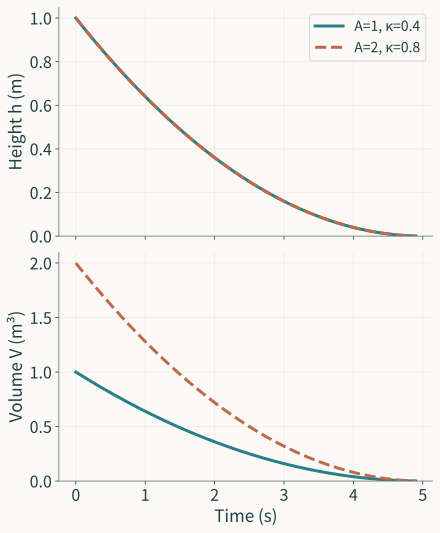

Open the outlet and the water level falls. Record the curve, and we can ask how fast it falls, how wide the tank is, or how large its outlet is. If we also want to plan the inflow, another question enters: will the description still work after we change the operation? The same record can enter all these questions, but it provides different grounds for their answers. Similarity between curves is one result; identifying the apparatus from a curve and using the identified apparatus to predict a new operation are two further tasks.

The preceding essay examined how mathematics forms objects and questions. Placing a real apparatus before those objects adds another relation. The level in an equation has a reference height and units; the level in a record has a sensor, a calibration, and sampling times. The equation lets us specify arbitrary inputs, while experiments have implemented only certain operations. The connection between model and world is established through these particular relations. It can also break at a particular point: the flow law may not cover low levels, calibration may convert the readings incorrectly, data may fail to distinguish parameter pairs, or a predictor valid for drainage may be used to decide an inflow.

We will follow a tank through these relations and then carry the results into learned prediction. The tank is simple enough to distinguish conservation, measurement, identification, and intervention, and rich enough that “a very good fit” cannot settle every judgment. The numerical examples and proposed changes to experiments below are constructions developed here. Findings from actual research are attributed separately.

## The boundary of the apparatus comes before the level equation

Take a rigid, open tank with a constant cross-sectional area $A>0$. Measure its water level $h(t)$ from the reference height of the outlet. Above this reference, the stored volume is $V(t)=Ah(t)$. Any constant residual volume below it does not enter the change in volume considered here. Assume constant liquid density. Write the volumetric inflow and outflow as $q_{\mathrm{in}}(t)$ and $q_{\mathrm{out}}(t)$. Leakage through the wall, evaporation, and other branches have been excluded by the conditions we selected. Over a time interval, we then have

$$
V(t_2)-V(t_1)=\int_{t_1}^{t_2}\bigl(q_{\mathrm{in}}(t)-q_{\mathrm{out}}(t)\bigr)\,dt.
$$

This relation first accounts for where stored water goes. Provided that every inflow and outflow has been included, it neither requires an orifice outlet nor specifies how outflow changes with level. On an interval where the quantities are sufficiently smooth, differentiation and substitution of $V=Ah$ give $A\dot h=q_{\mathrm{in}}-q_{\mathrm{out}}$. Constant area and density make the storage term this simple. A flexible wall, varying cross section, or changing liquid density requires a different storage expression, while the balance itself remains a subject of study. Tom Co's teaching example likewise starts with a mass balance and develops the level equation under constant-density and constant-area assumptions.[^balance]

The equation is not yet closed. Current level and inflow still do not determine the rate of change of level, because outflow has not been specified. Fix the orifice and its opening. On a positive-level interval where the ideal orifice approximation applies, combine the orifice area, gravity, and fixed discharge coefficient into $\kappa>0$, obtaining

$$
q_{\mathrm{out}}=\kappa\sqrt h,\qquad
A\dot h=q_{\mathrm{in}}-\kappa\sqrt h.
$$

With length in meters and time in seconds, $A$ has units of square meters, $q$ of cubic meters per second, and $\kappa$ of $\mathrm{m}^{5/2}/\mathrm{s}$. Both sides express a rate of volume change. The square-root relation supplies an outflow closure: it relates the unspecified flow to the level. Conservation accounts for accumulation; closure describes how water leaves under the current conditions. Together they make the trajectory a solvable question once initial level, input, and parameters are given.

This connection also shows what the conditions do. Increasing area changes the level response to the same net flow; changing the outlet changes the outflow at the same level. If the surface moves rapidly, we must reconsider whether one height adequately represents the head. If the outlet opening is controlled, $\kappa$ cannot remain a fixed constant. The storage and flow retained inside the boundary, and the inputs and environmental conditions supplied outside it, have already entered the model's content. Explaining these choices together with the name “tank model” lets a reader assess the resulting trajectory under the stated conditions.

Actual apparatus also helps locate a simplification. Fabusola and Simon study a tank with a varying cross section and an outlet above the bottom; it may also contain a solid that displaces water. They establish water volume, outflow, and conservation separately before obtaining the height equation.[^tank-study] Here we use a different, constant-area tank to develop the relations individually. Comparing predictions for the two setups would require trajectories based on their respective geometry and measurement. Borrowing a modeling method and reproducing an experiment each concern specific objects.

## What happens between the water surface and the record?

The level changes, but an instrument commonly senses an electrical signal first. Acquisition and calibration turn that signal into a reading expressed as a length. The reading is then saved with a timestamp, operating conditions, and a validity flag. Each step can change what we can subsequently ask. A raw integer may be an acquisition code, a calibrated number may represent centimeters, and a curve with out-of-range times removed already retains only part of the original history.

Fabusola and Simon explicitly describe this relation. Their level sensor provides integers from $0$ to $1023$, which they map to centimeters using a smooth one-dimensional spline calibration curve whose calibration resolution they report as one centimeter.[^sensor] That resolution concerns the construction of the calibration curve; measurement error still requires its own assessment. This practice suggests keeping the measurement model alongside the level equation, rather than keeping only the converted column name.

Construct a simple measurement expression. Let $t_i$ be the recording times, $Y_i$ the calibrated readings, $b$ an unremoved fixed bias, and $\varepsilon_i$ the recording disturbances. Then

$$
Y_i=h(t_i)+b+\varepsilon_i.
$$

The distribution and dependence of disturbances remain to be determined by the measurement setting. Fixed bias and individual disturbances already play different roles: one shifts the records together, while the other moves individual records away from their centers. We could also include residual gain error, writing $Y_i=a\,h(t_i)+b+\varepsilon_i$. The reading scale is then another quantity to identify. Setting $a$ to one and fitting only tank parameters may make physical parameters absorb calibration error.

Timestamps participate in measurement too. A window-averaging instrument observes average level over that window. With a delay, the value saved at $t_i$ may correspond to an earlier surface. Ignoring these relations and subtracting a record from an instantaneous model output mixes different objects in the residual. During slow drainage the mismatch may have little effect; after a change to pulse inflow, or when estimating a rate of change, it may dominate the error. Temporal resolution acquires meaning only in relation to the changing object and the measurement operation.

We can send predictions through the same measurement chain. Given parameters $\theta$, input $u$, and measurement scheme $\eta$, the model first produces a trajectory $h_{\theta,u}$. An observation operator $H_\eta$ then produces the predicted record $H_\eta(h_{\theta,u})$. The operator can include sampling, averaging, delay, and calibration. Both sides of the comparison now have the same address: record against record, or level against level. If the intended evaluation concerns true level while only noisy readings are available, we must explain how reading error supports an inference about level error. Common units are necessary; a common object makes the subtraction meaningful.

Missingness and filtering belong to this chain as well. Let $R_i=1$ mean that record $i$ is retained. If high levels are always recorded but the instrument often fails at low levels, saved data favor a particular level interval. Small errors at points with $R_i=1$ directly support performance at visible points. Extending the judgment to the entire history requires a missingness mechanism, additional measurements, or a narrower evaluation object. An empty entry may itself contain information about operating conditions. Removing it as a formatting problem can also remove part of the question's boundary.

## What does one drainage curve identify?

Close the inlet. Where $h>0$ and the square-root outflow law is valid, the model becomes $\dot h=-(\kappa/A)\sqrt h$. Set $y=\sqrt h$ and apply the chain rule along a positive-level trajectory:

$$
\dot y=\frac{\dot h}{2\sqrt h}=-\frac{\kappa}{2A},\qquad
\sqrt{h(t)}=\sqrt{h_0}-\frac{\kappa}{2A}t.
$$

Accurate, calibrated records with a known time scale therefore identify $\beta=\kappa/A$ from the slope of square-root level. The result is a parameter combination. The rate of linear decline tells us about outflow capacity relative to storage area, without separately determining area and discharge coefficient.

For any $c>0$, replace $(A,\kappa)$ by $(cA,c\kappa)$. The ratio $\beta$ stays fixed. Starting from the same $h_0$, the entire no-inflow level trajectory stays fixed too. Distinct physical parameter pairs consequently leave exactly the same information under the current observation:

$$
h(t;A,\kappa,h_0)=h(t;cA,c\kappa,h_0).
$$

This proves structural nonidentifiability. For this parameter family, input, and observation, the parameter-to-data map is not injective. Even a complete noiseless curve leaves a family of indistinguishable parameters. More records of the same kind can stabilize an estimate of the ratio but cannot break this symmetry. The difficulty lies in the map's structure; instrument precision and sampling density cannot fix it on their own.

*Original theoretical curves. Here $h_0=1\,\mathrm m$, $A$ is $1$ or $2\,\mathrm m^2$, and $\kappa$ is $0.4$ or $0.8\,\mathrm{m}^{5/2}/\mathrm s$, respectively. Both pairs have the same $\kappa/A$. Only positive levels are shown; no measured data are used.*

The two volumes $V=Ah$ differ beneath the same level curve. If the purpose is to predict level during this drainage, every pair in the family gives the same answer. If the purpose is to determine how much water the tank holds, the observation cannot settle it. The query makes the consequence of nonidentifiability visible. An unidentified parameter need not invalidate every prediction, and an identified combination need not support every purpose.

We can state the distinction generally. Fix an experiment $e$ and let $G_e(\theta)$ represent ideal data, or their probability law under random measurement. If $G_e(\theta)=G_e(\theta')$ always implies $\theta=\theta'$, parameters are structurally identifiable on the specified domain. If only a query $q(\theta)$ matters, the requirement can be weaker: identical data must imply an identical query. The tank's $\beta$ meets the latter condition; $A$ alone does not. “The model has been identified” thus becomes two assessable questions: from which data, and identifying what?

An unknown reference level changes the question again. If accurate records actually satisfy $Y(t)=h(t)+b$, an unknown $b$ cannot simply be omitted. Taking the square root of positive readings gives $\sqrt{h+b}$, whose derivative is $-\beta\sqrt h/(2\sqrt{h+b})$, generally not a constant slope. Attributing all that curvature to outflow may repair a measurement error by changing the physical relation. We must include $b$ among the quantities to identify, or determine it by independent calibration before applying the original slope argument unchanged.

## How new experiments break the original symmetry

An indistinguishable parameter family gives direction to experiment design. New information must vary within that family. If we still observe the same no-inflow drainage curve, renaming the experiment adds no identification relation. Consider volume measurement first. Block the outlet, add a known volume $\Delta V$, wait for the surface to settle, and measure a calibrated level increase $\Delta h>0$. Constant cross section gives

$$
A=\frac{\Delta V}{\Delta h}.
$$

If the outlet remains open, the outflow during this interval must be measured; other volume changes must also be included. Conservation and geometry jointly supply the new relation. Once area has independent support, the drainage ratio gives $\kappa=A\beta$. The original scaling symmetry no longer preserves both kinds of data, because the volume-to-height relation changes with $A$.

Another proposed experiment supplies a known constant inflow $q_*>0$. Once the apparatus has actually reached a positive steady state, with unchanged outlet conditions, measure the level $h_*>0$. Since $\dot h=0$,

$$
q_*=\kappa\sqrt{h_*},\qquad
\kappa=\frac{q_*}{\sqrt{h_*}}.
$$

This identifies $\kappa$ independently; combining it with the drainage ratio identifies $A$. The steady reading does not directly contain $A$. The other, dynamic experiment supplies the area information. The two data sources have different duties, which the phrase “collect more data” does not adequately explain. Reaching steady state is also a condition. Fluctuating inflow, or a slowly moving surface that has not yet stopped, introduces bias when substituted into the steady equation.

A dynamic experiment with known inflow can also break the scaling. Start two parameter pairs with the same $\beta$ from the same $h_0$, under the same nonzero $q_*$. Their initial rates are $q_*/A-\beta\sqrt{h_0}$ and $q_*/(cA)-\beta\sqrt{h_0}$, which differ whenever $c\ne1$. An absolute volumetric scale now enters the level dynamics, making the area previously hidden inside a ratio observable through its consequences.

We can also organize a dynamic experiment as $\dot h=\alpha q_{\mathrm{in}}-\beta\sqrt h$, where $\alpha=1/A$. With ideal data, two times whose coefficient rows $(q_{\mathrm{in}},-\sqrt h)$ are linearly independent provide two equations that determine $\alpha$ and $\beta$. With no inflow, the first column is zero throughout. At steady state, input and level may also maintain a fixed proportion that supplies insufficient independent information. Experiment design therefore concerns making the response distinguish parameter directions, as well as extending the record.

The linear-algebra condition establishes a structural possibility. Practical estimation must still confront differentiation error and changing parameters. Nearly proportional rows can make small data perturbations produce large estimation changes. We need to ask both whether the answer is unique and how it changes with the data. Identification addresses the first question; stability and finite-data analysis address the second. An experiment may improve both, but neither result answers the other question by itself.

## Noise, finite information, and fitting criteria

Structural identifiability does not make estimation easy. Suppose calibration and the time scale are known, but drainage is recorded only over a short positive-level interval. Curves with slightly different ratios can be very close there, with instrument disturbances larger than their difference. Extending the valid observation interval, changing initial level, or obtaining repeated records may enlarge that difference. Distinct answers exist in principle; the difficulty is distinguishing them stably from finite, disturbed data.

Least squares is itself a choice made under an error structure. Fitting a line to square-root levels $y_i$ measures deviations after that transformation. Fitting a trajectory to heights $h_i$ measures deviations in length. The criteria weight different level intervals differently. For a small height disturbance $\delta h$ at a positive level, $\delta y\approx\delta h/(2\sqrt h)$. The same height error is amplified more at a lower level by the square-root transformation. Easier linear fitting therefore brings a question about transformed error with it.

A finite deterministic bound is also available. Take just two times $t_1<t_2$. Suppose the transformed observations satisfy $|y_i-\sqrt{h(t_i)}|\le\epsilon$, and define

$$
\widehat\beta=\frac{2(y_1-y_2)}{t_2-t_1}.
$$

The ideal straight-line relation gives $|\widehat\beta-\beta|\le4\epsilon/(t_2-t_1)$. The bound decreases as the time separation increases, provided both times stay within the same valid outflow interval and parameter conditions. Moving the second time toward actual flow cessation may improve this formal noise bound while adding model discrepancy that the bound does not include. The benefit of a longer interval must be assessed together with its validity domain.

A statistical formulation must explain where randomness enters. Measurement disturbance concerns how a given history is recorded. Process disturbance changes the history itself. Parameter uncertainty may express incomplete knowledge about a fixed apparatus, or variation across a population of apparatuses. All three can enter a model while retaining different addresses. A parameter distribution can describe knowledge or variation among devices; these uses do not have the same sampling unit.

Independent, zero-mean, equal-variance Gaussian measurement errors allow the conditional record density to be written as a product over times, with squared residuals forming the likelihood. The product requires independence. An unknown reference bias shared by all readings, or temporal dependence in the sensor, prevents dense records from automatically becoming equally many independent pieces of evidence. A different error model can change estimates and confidence intervals. A physical differential equation does not uniquely determine a statistical inference procedure.

Priors and regularization can also select one answer from a nonidentifiable family. A procedure favoring smaller areas might return an apparently definite $(A,\kappa)$, but that selection comes from the preference together with the data. When the data depend only on $\beta$, the likelihood has no additional discrimination along the scaling direction with fixed $\beta$. Reporting a unique number requires explaining how it was selected; otherwise computational uniqueness can be mistaken for empirical identification. Regularization can make a problem tractable and incorporate supported prior information. These roles deserve to be stated rather than hidden behind “the data speak for themselves.”

## How the model produces a probability law for records

Moving from deterministic trajectories to an error model has already formed another mathematical object: the joint probability law of all records under given experimental conditions. It includes both how a history occurs and how it is observed. Error bars placed beside a trajectory can blur these relations again. A joint law can also answer questions about consecutive anomalies, missingness patterns, and dependence among records.

Let possible real histories form a space $\mathcal X$ and records a space $\mathcal Z$. Under parameters $\theta$ and experiment $e$, the history law is $P_{\theta,e}$. Given history $x$, a conditional probability kernel $K_\eta(dz\mid x)$ describes the recording mechanism, with $\eta$ storing the instrument and measurement scheme. The record law is then

$$
L_{\theta,e,\eta}(B)=\int_{\mathcal X}K_\eta(B\mid x)\,P_{\theta,e}(dx),
\qquad B\subseteq\mathcal Z.
$$

The sets must belong to the measurable collections specified on these spaces. For a deterministic history, $P_{\theta,e}$ concentrates on one trajectory. With deterministic observation too, $K_\eta(B\mid x)$ indicates whether $H_\eta(x)$ belongs to $B$, and the record law is the pushforward along the observation map. Process and measurement randomness can thus enter one calculation while retaining their respective sources. Data comparison concerns $L$; explanation of the process concerns $P$ and the structure producing it. The connection between these objects is explicit.

The formulation also broadens the identification problem. Unknown quantities may include apparatus parameters $\theta$ and measurement parameters $\eta$. An identical record law need not imply that each is identical. Construct a binary measurement example: the true state $U$ equals one with probability $r$. The instrument reports one with probability $f$ when $U=0$ and probability $s$ when $U=1$. The probability of a recorded one is $f(1-r)+sr$. Knowing this number generally does not determine $r,f,s$ separately.

In a first case, the true states occur equally often and measurement is perfect: $(r,f,s)=(1/2,0,1)$. In a second, the true state is always one but the instrument reports one half the time: $(1,0,1/2)$. Both produce equal frequencies of ones and zeros. Infinitely many independent objects, each read once, could determine the record frequency precisely without revealing whether the true population is equally split. Object and error laws act together in observation. This nonidentifiability has a structure resembling the tank's area and discharge coefficient jointly determining a ratio.

A new experiment can retain a relation previously lost. In the same two cases, hold one object fixed and read it twice, explicitly assuming conditional independence of the measurements given $U$. In the first case the readings always agree, and the probability of two ones is one half. In the second it is one quarter. Paired data distinguish the formerly identical single-reading distributions. This does not establish that two readings identify every unknown instrument. It identifies a particular kind of experimental information: repeated measurements of the same object can expose dependence averaged away by a single-reading marginal.

For continuous levels, repeated readings of a fixed, stationary level help examine measurement disturbance. Repeating a drainage experiment combines variations in initial conditions, process, and instrument. Separating these kinds of repetition gives us a chance to locate uncertainty. If the level is not stationary, or the instrument has shared drift, the first analysis also changes. Probability kernels place these conditions at the observation relation and suggest corresponding experiments to test them.

We can then compare predicted record distributions with new data distributions, rather than comparing means alone. Two models may both predict an average level of one meter. One concentrates records at one meter; the other puts half its probability at half a meter and half at one and a half meters. Their answers about exceeding a threshold differ. Compressing a distribution to its mean has already selected an observation. A risk-related purpose requires retaining weights and tail queries. The third essay will develop the semantic difference between probability laws and unweighted supports; here we establish how histories and measurement jointly generate those laws.

## Can the current reading serve as a state?

The level equation provides a deterministic, closed state description: with fixed parameters, known input, and a valid domain, current $h$ determines $\dot h$. This property belongs to the equation we constructed. Whether measurement supplies that $h$, and whether the apparatus retains other variables affecting outflow, require further checks. A one-state equation does not imply that apparatus and instrument need only one reading.

Construct a sensor-lag example. Let $z$ be a calibrated signal with dynamic lag, and assume $\tau\dot z=h-z$ with $\tau>0$. The state can now be $(h,z)$. A current reading $z=1$ could arise from $h=1,z=1$ or from $h=2,z=1$. The corresponding signal derivatives are zero and $1/\tau$. A shared reading does not have a shared successor; $z$ alone cannot provide a closed state under these conditions.

This brings the first essay's three-state construction into measurement. Given internal evolution $T$ and observation $\pi$, an evolution on the observation image satisfying $\pi\circ T=g\circ\pi$ exists exactly when every internal representative of a reading has the same next reading. The first essay proved this criterion. The continuous-time lag example exposes the same gap: projection loses a component determining the change of the observation. Reducing the state too far prevents an originally deterministic description from closing at the reading level.

History can sometimes recover some information. With an ideal continuous record, known $\tau$, and differentiable $z$, we have $h=z+\tau\dot z$. Current reading and local rate can reconstruct this level component. Differentiating discrete, noisy records amplifies disturbances, making estimation of $h$ another problem. Supplying a neural network with the last ten readings likewise attempts to recover state information from history. Whether the window is sufficient, the records support that recovery, and the necessary changes have appeared depends on structure and testing; window length alone provides no guarantee.

In other cases we should retain a conditional distribution. Recall the first essay's finite system: $a$ moves to $c$, while $b$ and $c$ stay fixed; $a,b$ display zero and $c$ displays one. Given an initial zero observation and conditional probability $p$ that the internal state is $a$, the probability of a one at the next step is $p$. The number zero does not determine this probability, but zero together with belief $p$ provides a prediction. If the next observation is still zero, the noiseless construction implies that the internal state is $b$, and the belief updates to zero.

For general finite states and noiseless observation, write the update directly. Let $b_t(x)$ be the state distribution conditional on the current history and $P(x'\mid x,u_t)$ the transition probability. First compute the predictive distribution $b^-_{t+1}(x')=\sum_xP(x'\mid x,u_t)b_t(x)$. After observing the next reading $y$, provided the event has positive probability, retain states satisfying $\pi(x')=y$ and normalize:

$$
b_{t+1}(x')=
\frac{\mathbf1_{\{\pi(x')=y\}}\,b^-_{t+1}(x')}
{\sum_{\xi:\pi(\xi)=y}b^-_{t+1}(\xi)}.
$$

This is a finite conditional-probability calculation. A zero denominator prevents this update and exposes a record the current model cannot produce. The closed belief update depends on the specified transition and observation relations. Unknown relations must themselves become objects of estimation. Adding a distribution retains uncertain information needed for prediction; it does not determine an unknown mechanism without evidence. State, history, and belief are choices whose retained information can be studied individually.

## From one curve to a population

For one drainage curve, time indexes the records. Across many experiments, distributions of initial level, outlet opening, inflow, apparatus, and environment enter too. Collecting all records in a table does not establish a unique population. We may want to predict the next drainage of the same apparatus or a batch of tanks manufactured under different conditions; we may care about normal operation or extreme inputs. Their sampling units and frequencies differ.

Let $x$ denote input conditions, $y$ the prediction target, $f$ a learned predictor, and $\ell(f(x),y)$ the loss. A joint distribution $P$ specifies the target population, whose risk is $R_P(f)=\mathbb E_P[\ell(f(X),Y)]$. Average training loss is determined by the retained samples. Connecting the two requires knowing their source population, acquisition procedure, and dependence among records from the same history. A score on a fixed test table is first a fact about that table; a population judgment additionally requires its sampling relation.

Construct just two operating regimes. A predictor's loss is fixed at one in the first and nine in the second. If target use assigns half its frequency to each, the target average is five. An experiment placing ninety percent of records in the first regime and ten percent in the second has an unweighted average with expectation 1.8. It computes the average under experimental frequencies correctly, but not under target-use frequencies. More records can stabilize an average with the wrong address.

Comparing predictors is affected too. Let predictor A have losses zero and ten, and predictor B four and four. Under the experiment's nine-to-one frequencies, A averages one and beats B's four. Under the target's equal frequencies, A averages five and B four: their order reverses. Both calculations can be accurate. The choice changes because the population changes. These theoretical numbers demonstrate that population weights can change the answer to a comparison.

For finitely many regimes, let target probabilities be $p_j$ and sampling probabilities $q_j$, with $q_j>0$ whenever $p_j>0$. On a sampled regime $J$, use weight $p_J/q_J$. For a fixed loss $L_j$ within each regime,

$$
\mathbb E_{J\sim q}\!\left[\frac{p_J}{q_J}L_J\right]
=\sum_{j:q_j>0}q_j\frac{p_j}{q_j}L_j
=\sum_jp_jL_j.
$$

If the target within a regime is random, its conditional distribution must also agree between sampling and use, or require another weighting relation. Correcting input frequencies does not also eliminate unobserved changes within regimes. Support coverage has a concrete role: a regime present in target use but never sampled provides no data to multiply by a weight. Assuming its loss is small adds a model judgment beyond the weighted average.

Weights come at a cost. For the losses one and nine, equal target frequencies and nine-to-one sampling make the weighted loss forty-five whenever the second regime is sampled. Rare, large values contribute to target risk. Sampling that regime more often can reduce instability. Correcting the formula without improving coverage may give the right expectation but substantial finite-sample fluctuation. Truncating large weights can improve stability while introducing bias; this tradeoff needs to remain visible in the report.

## Adaptive sampling and the choices left in data

Experiments often adjust the next operation using earlier records. Poor predictions in a particular level interval may lead to denser measurements there. Prompts causing language-model errors may be sampled more frequently. Such data can diagnose gaps or train more efficiently, but their frequencies have been changed by past results. Treating their proportions as natural-use proportions turns the investigator's choice into the world's frequency.

The finite-regime weighting argument extends under an explicit adaptive condition. Before trial $t$, use the available history $\mathcal F_{t-1}$ to select probabilities $q_t(j)$, then sample $J_t$ from them. For a fixed predictor and fixed losses $L_j$, assume $q_t(j)$ remains positive on target support. Then

$$
\mathbb E\!\left[
\left.\frac{p_{J_t}}{q_t(J_t)}L_{J_t}\right|\mathcal F_{t-1}
\right]=\sum_jp_jL_j.
$$

The reason is still summation over the current conditional probabilities. The past may affect sampling; weights must use the probabilities actually implemented and determined before that draw. This establishes an expectation relation, not an independent-sample concentration bound. Weights may be large and results dependent. If a predictor is refitted after seeing the current answer and its current loss is then substituted, $L_j$ is no longer fixed in advance under these conditions. The equality cannot be invoked unchanged.

Dense records within one history also raise a unit question. One hundred independent drainages and one hundred times during one drainage can both occupy one hundred rows. The former provide information across trials; the latter describe one history more finely. Shared initial error or apparatus bias within a trial can be shared by training and test sets after a random row split. For predicting the next new experiment, splitting by complete experiments corresponds more directly to the intended use. Reconstructing a missing part of the same history is a different question. The split should follow the query to be answered.

Selection can also change conditional targets. If only successfully predicted times are retained, or labels appear only under easy-to-confirm conditions, the visible distribution of $Y$ given $X$ may differ even when input distributions look similar. Weighting only by $p_X/q_X$ is generally insufficient. We need to explain retention conditions, obtain information from omitted cases, or restrict the judgment to the visible subpopulation. “Data bias” then separates into frequency, conditional targets, missingness, leakage, and dependence, each requiring a different correction.

This also explains why a training objective cannot alone define the model's purpose. Seeing more difficult examples during training may improve a capability; release evaluation may separately report normal-use frequencies and rare failures. The tasks can support one another, but their probability relation still needs establishing. Learning inherits measurement and sampling relations into its losses, features, and parameter updates.

## What prediction, explanation, and intervention each require

Two parameter pairs produce the same level without inflow but different rates under known nonzero inflow. This already-calculated example establishes a substantive distance between observational agreement and agreement under intervention. Drainage records identify the ratio. Once the absolute volumetric scale of inflow enters, area affects the answer. Success under the original input therefore requires an additional relation before supporting prediction under a changed input.

We can construct two outflow closures as well. Suppose all original experiments stay at $h\ge h_c>0$. The first uses $q_1(h)=\kappa\sqrt h$. The second agrees throughout that interval but uses $q_2(h)=\kappa h/\sqrt{h_c}$ for $0\le h<h_c$. They give identical high-level trajectories, then square-root and linear decay at low levels. With no inflow, the second low-level equation is $\dot h=-\beta h/\sqrt{h_c}$: from a positive height it decays exponentially and remains positive at every finite time.

Extrapolating the first ideal expression to zero gives the finite emptying time $2\sqrt{h_0}/\beta$ from its straight square-root trajectory. High-level data cannot distinguish the closures, but their answers about reaching zero differ. The second closure is an author construction, not a claim that an actual outlet follows a linear law. It makes an extrapolation gap calculable: candidate mechanisms identical on the observed domain can disagree about a query outside it. Low levels require additional information or a supported choice of closure.

Actual research reports a boundary in this domain too. Fabusola and Simon note that surface tension may stop flow through a small orifice at a low head, invalidating their square-root forward model in that regime.[^tank-study] Extending a numerical computation cannot give a coefficient fitted in a valid interval an additional low-level mechanism. A purpose confined to predicting higher levels can retain that domain in its judgment. Planning complete drainage requires addressing the new mechanism and the height that “empty” is meant to denote.

A learned predictor can also represent patterns in the original experiments well. Suppose it predicts the next reading from recent readings, inflow records, and current conditions. It may accomplish same-condition prediction without separately recovering $A$ and $\kappa$. That purpose should be assessed against next readings and their population. Recommending an inflow operation never tried before additionally concerns state, flow, and measurement relations under that operation. Including an input variable in a network does not ensure that training data identified the consequences of changing it.

Explanation asks why a particular change works. Here conservation and independent area measurement clarify storage, outflow experiments clarify the outlet relation, and these grounds support prediction after changing inflow. Each part supports a relation. The third essay will use a more general construction with identical observational distributions and different intervention answers to examine what internal semantics must retain. This essay already identifies the empirical next step: design and implement an operation that produces different records under competing mechanisms, within its valid conditions, rather than merely tightening the fit to old records.

## Give empirical validity a specific judgment to support

“Valid” can now have an explicit address. Specify the reference apparatus or population, input and environmental conditions, query, time range, comparison, and tolerance, then ask whether the model-data relation is sufficient. A level trajectory can be assessed by maximum deviation or accumulated error. Emptying time concerns when a threshold is reached. Parameter explanation concerns distinction among parameters and estimation uncertainty. These quantities have different units and consequences; one universal score cannot replace all of them.

Write an empirical representation relation as $\rho_{e,q,d,\epsilon}(M,W)$: model $M$ faces reference object $W$ under experimental or use conditions $e$, and its query $q$ meets tolerance $\epsilon$ under comparison $d$. This notation is adopted here to organize judgments. The indices can also retain population, time, and measurement scheme. When prose has already specified them, the full string need not recur in every sentence. Its purpose is to turn “this model is good” into a relation with clear objects and a clear support scope.

For example, a deterministic judgment about a positive-level drainage trajectory could require staying in an assessed validity domain throughout $[0,T]$ and satisfying $\sup_{0\le t\le T}|\widehat h(t)-h(t)|\le\epsilon$. Actual $h$ may not be directly available. If only $Y_i$ is recorded, measurement bounds or a statistical model must connect records to this judgment. Checks at discrete points also do not unconditionally control the maximum error over a continuous interval. Between-point changes require additional regularity bounds, denser measurement, or a weaker evaluation query.

Once comparison conditions are explicit, empirical relations can pass along domain inclusion. A conditionwise error bound established on a regime set $E$ remains valid on a subset $E_0$; extending from the subset to a larger set requires support for the additional conditions. Average risk adds weights. A changed population can change the average even when every regime remains inside the original set. The earlier ranking reversal happens exactly here. Domain, weights, and query must therefore be retained separately. Agreement in one does not settle the other two.

Failure also needs an address. A new reading whose error exceeds the tolerance rejects that deterministic bound under the current conditions. A rare result under a random model can still be compatible with its record law. Assessing the latter requires event probabilities and a testing procedure, rather than calling every individually unpredicted record a refutation of the mechanism. A counterexample's force depends on the original claim, so revision can target the relation that actually failed.

Recorded error and latent-state error can be separated under specified conditions. Suppose a fresh observation satisfies $Y=h+\varepsilon$. Conditional on true $h$ and prediction $\widehat h$, let $\varepsilon$ have zero mean and variance $\sigma^2$. Expanding the square and taking conditional expectation gives

$$
\mathbb E\bigl[(\widehat h-Y)^2\mid h,\widehat h\bigr]
=(\widehat h-h)^2+\sigma^2.
$$

The cross term vanishes by conditional zero mean. Under this measurement model, reading mean-square error includes level error and measurement variance. Fitting and reevaluating on the same noisy record, or having measurement bias related to the prediction, can invalidate the conditional zero-mean assumption. We cannot then simply subtract $\sigma^2$. The decomposition clarifies an ambiguity: reducing residuals may improve level prediction, or merely follow recording noise, and the two require different checks.

Success in finite testing also carries sampling uncertainty. Construct the simplest case: fix the model and use population, then run $N$ independent, identically distributed tests, each exceeding tolerance with probability $p$. The probability of zero exceedances is $(1-p)^N$. Using that outcome to exclude large $p$ gives the one-sided upper bound $1-\alpha^{1/N}$ at confidence level $1-\alpha$, for positive integer $N$ and $0<\alpha<1$. This is a finite-sample inference rule under those conditions; zero observed failures has not proved zero risk. Dense times within one experiment change the independence condition. A changed population after release changes the address of the fixed $p$.

Small model error also need not suffice to decide an operation. When two actions have nearly equal benefits, error may reverse their order; the same error bound can support a choice when the actions are separated enough. Connecting state prediction to decision requires explaining how error affects that choice. The sixth essay will fully develop the responsibilities among purpose, requirements, criteria, and evidence. Here we establish the empirical part: how information is obtained, what the comparison concerns, and how support changes with the query.

## From level errors to times and choices

An established comparison must still connect to its purpose. For a positive threshold $a<h_0$, the ideal no-inflow model gives the first time at which that level is reached:

$$
T_a=\frac{2(\sqrt{h_0}-\sqrt a)}{\beta}.
$$

This query needs $h_0$ and $\beta$, without separately identifying $A$ and $\kappa$. Adding a known volume, or predicting threshold time under an inflow operation, requires other parameter relations again. A purpose can have a definite answer within a nonidentifiable family, or make a previously unnecessary direction essential. Rejecting all prediction because parameters have not been fully recovered loses the first possibility. Declaring all parameters recovered because one threshold prediction succeeded crosses the second distinction.

Near positive parameters and initial height, differentiation gives $\partial T_a/\partial h_0=1/(\beta\sqrt{h_0})$ and $\partial T_a/\partial\beta=-T_a/\beta$. These are local sensitivities of the queried time to initial height and drainage ratio. Derivatives describe sufficiently small changes; larger uncertainty intervals can be inserted into the original expression. For example, if $h_0\in[h_-,h_+]$, $\beta\in[\beta_-,\beta_+]$, $h_->a$, and $\beta_->0$, monotonicity yields

$$
\frac{2(\sqrt{h_-}-\sqrt a)}{\beta_+}
\le T_a\le
\frac{2(\sqrt{h_+}-\sqrt a)}{\beta_-}.
$$

This propagates conditional intervals. Correlation between the uncertain quantities may make a rectangle unnecessarily wide, but the bound remains valid under the stated containment conditions. If the original intervals lack empirical support, substitution cannot create it. Mathematics derives results from given conditions; measurement and inference connect those conditions to the apparatus. The tasks meet in the same purpose.

Trajectory error can also bound threshold time directly. Suppose true $h$ decreases strictly near the threshold with $-\dot h\ge v>0$. Suppose the predicted trajectory also has a unique threshold crossing, both crossings lie in that interval, and $|\widehat h-h|\le\epsilon$ throughout it. At the predicted crossing $\widehat T_a$, true height differs from $a$ by at most $\epsilon$. The true curve crosses at speed at least $v$, so integrating its rate gives $|\widehat T_a-T_a|\le\epsilon/v$. The lower speed bound converts height error to time error, and its role is visible at each step of the proof.

If the curve almost follows the threshold, $v$ is small and the same height error may correspond to a large time difference. If the observation interval excludes the crossing, or the predicted curve crosses repeatedly, the argument does not apply directly. The ideal square-root trajectory slows to zero at its zero-height endpoint, so a positive speed bound over the entire interval cannot handle that endpoint. Assessing level and assessing arrival time require different conditions, and their units have changed from meters to seconds.

Computation may add its own error. Let $h_\theta$ be the exact model trajectory under selected parameters, $h_{\theta_*}$ the trajectory under reference parameters, $\widehat h_{\mathrm{num}}$ the numerical result, and $h_W$ the actual level. When all objects share a height and time comparison domain, the triangle inequality adds three bounds: numerical error, parameter effects, and model discrepancy. Measurement error in the data helps estimate these terms or obtain $h_W$. It should not be included in parameter intervals and then added a second time without distinction.

Adding these bounds can be conservative. Supported analysis of dependence or cancellation may give tighter bounds, but cancellation cannot simply be assumed. Conversely, total residuals on a prediction plot do not identify each contribution. Numerical convergence addresses one relation. Halving the time step cannot repair a low-level closure or identify an area absent from the data. The fourth essay will continue examining transmission of conclusions through model and computational transformations.

Finally, carry error into a simple choice. Let two actions have true losses $J_1,J_2$ and predicted losses $\widehat J_1,\widehat J_2$, with each prediction error at most $\delta$. If $\widehat J_2-\widehat J_1>2\delta$, then $J_2-J_1\ge\widehat J_2-\widehat J_1-2\delta>0$, giving a definite ordering in favor of action one. With a smaller gap, the bound permits reversal. We can obtain more information, change the criterion, or retain multiple candidates. A small average prediction error need not provide this per-action bound. The choice's actual consequences determine what evidence is needed.

This calculation also explains different strengths of empirical validity. Describing old records, predicting a population average, bounding a trajectory, guaranteeing a threshold time, and supporting an action ranking are connected but distinct judgments. They can share a model and information while requiring their own reasoning. Fully establishing one already has substantive content. Adding the remaining relations according to purpose lets the model gradually take on a larger role.

## How discrepancies revise understanding

Suppose readings in a new experiment no longer agree with predictions. Examine the conditions under which residuals appear before immediately replacing the model with a larger one. A common level shift may suggest a reference bias; errors increasing with height may concern gain or geometry; failure after changed inflow may concern input measurement, parameter directions, or omitted dynamics. These are candidate explanations to distinguish, not causes uniquely proved by residual shapes. New information based on their different consequences lets diagnosis advance.

The first essay's four scopes of revision now have concrete content. If fixed-outlet conditions still hold but apparatus changes alter the discharge coefficient, update the parameter instance. A changed instrument calibration or sampling window calls for revising the observation relation. Sensor lag dominating short-term response calls for adding its state to the object. If one deterministic parameter per trial no longer organizes device variation or measurement uncertainty, a probability family and new inference relations may help. The revisions change different subsequent tasks while preserving earlier results under their own conditions.

A replicate experiment in actual research provides a clear empirical progression. After calibrating their forward and measurement models, Fabusola and Simon test predictions against another drainage experiment without a solid.[^replicate] The new information was not used in that parameter calibration and therefore adds a check of prediction for similar trials. It still concerns the specified apparatus, measurement, and drainage conditions. Changing to a constant-area tank, changing the outlet, or introducing inflow requires explaining which relations remain valid. Replication adds evidence for same-condition prediction; the volume and inflow experiments constructed here still need implementation on their respective apparatuses.

If we later implement volume-to-height measurement, we can give $A$ independent support. Known-inflow experiments can then check predictions previously constrained only by no-inflow data. Each result has an explicit address: parameter family, observation, state, population, closure, or purpose. These returns progressively add empirical content to the model. Formal solution has not completed every relation in advance; actual records become grounds for a judgment through those relations.

The falling curve at the beginning now supports more specific conclusions. Under fixed apparatus and measurement conditions it describes a part of a history; in the ideal no-inflow family it identifies $\kappa/A$. Independent volume or known-inflow information can further identify parameters. History and measurement state affect prediction of the next reading. Sampling populations determine average performance. New operations and low-level questions require new assessment. Models refer to the world through these established connections. The next essay opens the model itself to ask how presentations acquire semantics, and what identical data, identical functions, and identical structure each mean.

[^balance]: Tom Co, Michigan Technological University, [CM3310 Lecture 8: Modeling and Simulation](https://pages.mtu.edu/~tbco/cm416/lecture_08_2020.pdf), PDF page 2 (slides 3–4), mass balance and constant-density and constant-area assumptions; PDF page 4 (slides 7–8), parameters and valve opening. Here the orifice and opening are fixed and their fixed quantities combined into $\kappa$. The subsequent identification arguments and proposed experiments are developed in this essay.

[^tank-study]: Gbenga Fabusola and Cory M. Simon, [Inferring the shape of a solid inside a draining tank from its liquid level dynamics](https://arxiv.org/html/2408.14503v1), arXiv:2408.14503v1, 2024, §3.1, equations (2)–(6) and “A regime of model invalidity.” The study retains its own variable-area apparatus, outlet location, and displaced volume. This essay's constant-area tank and two low-level closures are separate theoretical constructions.

[^sensor]: The same study, §2, “The liquid level sensor”: raw integer readings, smooth spline calibration, and a reported calibration resolution of one centimeter. That resolution is not used here as a measurement error or accuracy.

[^replicate]: The same study, §5.1.5, “Testing the calibrated model with a replicate experiment,” for the use of a separate drainage experiment to check predictions after calibration.

---

**The six essays in “Models and Engineering”:** [How Mathematics Forms Problems](/en/posts/mathematical-language-and-problems/) · **How Models Refer to the World** · [Inside the Model](/en/posts/inside-the-model/) · [How Models Pass Through Transformations](/en/posts/model-transformations/) · [Models as Open Components](/en/posts/model-as-open-component/) · [From Models to Engineering Judgment](/en/posts/engineering-model-chain/). Later installments are being expanded sequentially; these links lead to their currently published versions.
