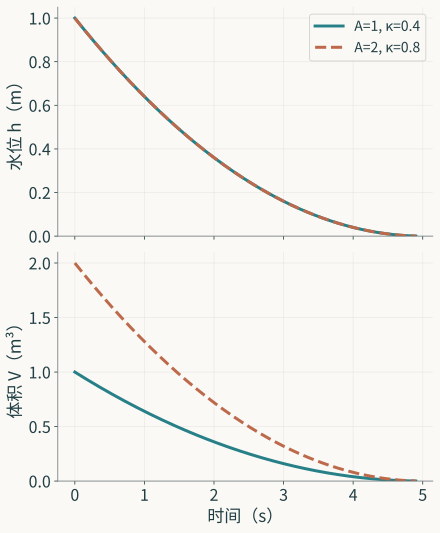

打开排水口，水位逐渐下降。记下这条曲线，可以问它降得多快，也可以问水箱有多宽、排水口有多大。若还想据此安排进水，问题又添了一项：在我们改变操作以后，原来的描述是否仍然管用？同一条记录能进入这些问题，给出的根据却各不相同。曲线相似是一种所得；从曲线辨认装置，再用所辨认的装置推测新操作，是另外两项工作。

上一篇讨论数学怎样形成对象和问题。现在把一只实际装置放到这些对象面前，事情便多了一层。式子里的水位有零点和单位，记录里的水位有传感器、标定和采样时刻；式子允许我们给定任意输入，试验却只实施过某些操作。模型与世界的联系，正是在这些具体关系中建立。它也可能在其中某一处断开：流动规律未能覆盖低水位，标定把读数换错了单位，数据没有区分两组参数，或者一个对排水有效的预测器被拿去决定进水。

下面沿水箱把这些关系展开，再把所得带到学习型预测器。水箱足够简单，守恒、测量、辨认和干预能分别看清；它也足够丰富，一个“拟合得很好”容纳不了全部判断。文中的算例和试验修改由本文构造，实际研究报告另作明确归属。

## 装置的边界，先于水位方程

先取一只刚性、常截面的开口水箱。水位 $h(t)$ 从排水孔口的基准高度起算，截面积为 $A>0$。在这一基准以上，储水体积为 $V(t)=Ah(t)$；基准以下若有一块不变的残余体积，它不参加此处的体积变化。液体密度固定，进水与出水都以体积流量计，分别记为 $q_{\mathrm{in}}(t)$、$q_{\mathrm{out}}(t)$。箱壁的渗漏、蒸发及其他支路，暂已由所选条件排除。于是任何一段时间内都有

$$
V(t_2)-V(t_1)=\int_{t_1}^{t_2}\bigl(q_{\mathrm{in}}(t)-q_{\mathrm{out}}(t)\bigr)\,dt.
$$

这条关系先说明储存量的去向。只要进出项已经记全，它并不要求水从孔口流出，也没有规定出流随水位怎样改变。在量足够平滑的区间，对时间求导并代入 $V=Ah$，才得到 $A\dot h=q_{\mathrm{in}}-q_{\mathrm{out}}$。常面积和常密度使这里的储存项如此简单；换成柔性箱壁、变截面或有密度变化的液体，守恒关系仍可研究，储存项却须重写。Tom Co 的水箱教学材料也是先写质量平衡，再在常密度、常面积条件下形成水位方程。[^balance]

方程还没有闭合。知道当前水位和进水流量，仍不能从这条平衡式算出水位变化率，因为出水流量尚未给定。固定孔口与开度，在适用的正水位区间，采用理想孔口流动的平方根表达，把孔口面积、重力和固定出流系数合并为 $\kappa>0$，得到

$$
q_{\mathrm{out}}=\kappa\sqrt h,\qquad
A\dot h=q_{\mathrm{in}}-\kappa\sqrt h.
$$

若长度用米、时间用秒，$A$ 的单位为平方米，$q$ 为立方米每秒，$\kappa$ 为米的二分之五次方每秒，即 $\mathrm{m}^{5/2}/\mathrm{s}$。两边都表示体积变化率。平方根关系承担的是出流闭合：它把还未确定的流量接到水位上。守恒管住积累，闭合说明在当前条件下怎样流出。两项理由相接，才使给定初始水位、输入和参数后的轨迹成为可求的问题。

这个接法也指出了条件的实际分量。增大截面，会改变同一净流量造成的水位变化；改变孔口，会改变同一水位下的出流。若水面快速晃动，单个高度是否足以表示压头便要重问；若孔口开度受控制，$\kappa$ 也不能继续作为固定常数。边界以内留下哪些储存与流动，边界以外提供什么输入和环境条件，都已进入模型内容。说明“水箱模型”时，把这些选择一并说清，读者才能接着判断给定条件下的轨迹。

实际装置还帮助我们看见简化的地址。Fabusola 与 Simon 的排水研究使用变截面水箱，孔口高于箱底，还可在箱内放置一个占据体积的固体。他们分别建立水体积、出流和守恒关系，再形成高度方程。[^tank-study] 下面另取常面积水箱把关系逐项推清。若要比较两套装置的预测，须按各自几何和测量建立轨迹；借用一种建模办法与重现一项实验，各有具体对象。

## 从液面到记录，中间发生了什么

水位在变化，仪器通常先感受一种电信号。信号经过采集和标定，才变成以长度表示的读数；读数又同时间戳、工况和有效性标记一起保存为记录。每一步都可能改变随后可问的内容。一个原始整数可以是采集器的编码，一个标定后的数才可能是厘米，而一条删掉超量程时刻的曲线，已经只保留了原历程的一部分。

Fabusola 与 Simon 把这层关系写得很清楚：液位传感器给出 $0$ 至 $1023$ 的整数，研究者用平滑的一维样条标定曲线把它们映成厘米；文中将标定曲线的分辨间隔记为一厘米。[^sensor] 这项标定分辨间隔属于曲线的构建，测量误差还要另行检验。这项实际做法提示我们，在水位方程之外保存测量模型，不能只留下换算后的列名。

先构造一个简单测量表达。设记录时刻为 $t_i$，已标定读数为 $Y_i$，尚未消除的固定偏差为 $b$，记录扰动为 $\varepsilon_i$，则

$$
Y_i=h(t_i)+b+\varepsilon_i.
$$

扰动的分布与相关性留待具体测量确定。固定偏差和逐次扰动已经做了不同的事：前者使所有记录共同偏移，后者使各次记录偏离其中心。还可以把残余增益误差写进去，成为 $Y_i=a\,h(t_i)+b+\varepsilon_i$。这时读数尺度也待辨认；把 $a$ 当作一而只拟合水箱参数，可能让物理参数代替标定承担误差。

时间戳同样参加测量。若仪器在一个窗口内取平均，它对应的对象是窗口平均水位；若有延迟，则时刻 $t_i$ 的保存值可能对应较早的液面。忽略这些关系，拿瞬时模型输出直接减去记录，所算的残差便混合了不同对象。对于缓慢排水，这种错位有时不显著；当我们改为脉冲进水或要估计变化率，它可能支配整个误差。时间分辨率只有连着对象变化和测量操作，才取得判断意义。

可以把预测也送过同一测量链。给定参数 $\theta$、输入 $u$ 和测量方案 $\eta$，模型先产生轨迹 $h_{\theta,u}$，再由观察算子 $H_\eta$ 得到预测记录 $H_\eta(h_{\theta,u})$。$H_\eta$ 可以包括取样、窗口平均、延迟和标定。比较双方便有共同地址：记录对记录，水位对水位。若要评价真实水位预测，而手中只有带噪读数，就还需说明由读数误差到水位误差怎样推断。共同单位虽是必要的一步，共同对象才使减法有意义。

缺失和筛选也要留在这条链中。设 $R_i=1$ 表示第 $i$ 次记录被保留。若高水位时总能记录，而低水位时仪器容易失效，保存下来的数据已经偏向某一水位区间。只在 $R_i=1$ 的点上得到小误差，直接支持的是可见点上的表现。想把判断移到整段历程，必须补充缺失机制、另取测量或收窄评价对象。空白本身可能带着工况信息；把它作为格式问题删去，往往连问题的边界也删去了。

## 一条排水曲线，究竟辨认了什么

现在关闭进水，在 $h>0$ 且平方根出流律有效的区间，模型成为 $\dot h=-(\kappa/A)\sqrt h$。令 $y=\sqrt h$，沿正水位轨迹使用链式法则，有

$$
\dot y=\frac{\dot h}{2\sqrt h}=-\frac{\kappa}{2A},\qquad
\sqrt{h(t)}=\sqrt{h_0}-\frac{\kappa}{2A}t.
$$

因而，从准确、已标定且时间尺度已知的记录中，可以由平方根水位的斜率辨认 $\beta=\kappa/A$。这里得到的是一个参数组合。沿直线下降的快慢告诉我们出流能力相对于储存截面的大小，还没有分别告诉我们截面和出流系数。

把任意 $c>0$ 作用到参数对上，令 $(A,\kappa)$ 变为 $(cA,c\kappa)$。比值 $\beta$ 保持不变，给定同一 $h_0$ 后，整条无进水的水位轨迹也保持不变。于是两组不同的物理参数通过当前观察留下完全相同的资料：

$$
h(t;A,\kappa,h_0)=h(t;cA,c\kappa,h_0).
$$

这就构成了结构不可辨认的证明。在这个参数家族、这个输入和这个观察下，参数到资料的映射不是单射；即使给出整条无噪声曲线，仍有一族参数无法区分。增加同样的记录，能使比值估计更稳，却不会破除这项对称。困难发生在映射的结构里，仪器的精度和采样密度不能单独修复它。

*原创理论曲线。取 $h_0=1\,\mathrm m$，$A$ 分别为 $1$、$2\,\mathrm m^2$，$\kappa$ 分别为 $0.4$、$0.8\,\mathrm{m}^{5/2}/\mathrm s$；两组 $\kappa/A$ 相同。只画正水位段，未使用实测数据。*

同一水位曲线下，两组体积 $V=Ah$ 却不同。若用途只问这一次排水的水位，参数族中的每一对都给出同样答案；若用途问箱中存了多少水，原观察无法决定答案。不可辨认的后果由查询显出来。一个未被辨认的参数并不必然使所有预测失效，能辨认的组合也不必然足够支持所有用途。

可以把这项判断写成一般形式。固定实验 $e$，令 $G_e(\theta)$ 表示理想资料，或在随机测量下表示资料的概率律。若 $G_e(\theta)=G_e(\theta')$ 总能推出 $\theta=\theta'$，参数在该域上具有结构可辨认性。若只需辨认某个查询 $q(\theta)$，要求可以减为：资料相同必有查询相同。水箱的 $\beta$ 满足后一条件，$A$ 本身不满足。这种区别把“模型已识别”的笼统说法变成两个可检验的问题：什么资料，辨认什么。

零点未知还会改变这个问题。若准确记录实际为 $Y(t)=h(t)+b$，未知 $b$ 不能随意略去。对正读数作平方根，得到的是 $\sqrt{h+b}$，其导数为 $-\beta\sqrt h/(2\sqrt{h+b})$，通常不再是固定斜率。把这条曲线的弯曲全归给出流规律，便可能在物理关系上修补测量误差。我们须把 $b$ 纳入待辨认的对象，或先用独立标定确定它；此前的斜率结论随后才可原样使用。

## 新的试验怎样打破原来的对称

找到了无法区分的参数族，就能更有方向地设计试验。新的资料必须在族内发生变化；若仍只观察同一无进水排水曲线，试验换了名称也没有增加辨认关系。这里先考虑体积测量。堵住出水口，加入已知体积 $\Delta V$，等待液面稳定，并用已标定的仪器测得水位增量 $\Delta h>0$。常截面关系给出

$$
A=\frac{\Delta V}{\Delta h}.
$$

出流若没有堵住，就要计量这段时间的出流；其他体积变化也须计入。公式的作用来自守恒和几何共同提供的新关系。面积有了独立根据，再用排水资料中辨认的 $\beta$ 得到 $\kappa=A\beta$。原来的缩放对称不再同时保持两类资料，因为体积—高度关系随 $A$ 改变。

另一项构造试验是给定已知恒定进水 $q_*>0$，在装置确已达到正稳态、孔口条件保持不变时，测量水位 $h_*>0$。此时 $\dot h=0$，所以

$$
q_*=\kappa\sqrt{h_*},\qquad
\kappa=\frac{q_*}{\sqrt{h_*}}.
$$

它单独辨认 $\kappa$，再结合原来的排水比值辨认 $A$。稳态读数没有直接包含 $A$；面积信息由另一项动态试验提供。两项资料有不同职责，不能把它们都称作“多采一些数据”便算解释充分。达到稳态也是一项条件：若进水仍在波动，或者液面虽缓慢变化却尚未停止，代入稳态等式会引入新的偏差。

已知进水的动态试验也能破除缩放。两组原来具有相同 $\beta$ 的参数，从相同 $h_0$ 出发，给定同一非零 $q_*$，初始水位变化率分别为 $q_*/A-\beta\sqrt{h_0}$ 和 $q_*/(cA)-\beta\sqrt{h_0}$。只要 $c\ne1$，两者不同。进水的绝对体积尺度进入了水位演化，原来被比值遮住的面积于是留下可见后果。

还可以把动态试验组织为 $\dot h=\alpha q_{\mathrm{in}}-\beta\sqrt h$，其中 $\alpha=1/A$。理想资料下，若两个时刻的系数行 $(q_{\mathrm{in}},-\sqrt h)$ 线性无关，两条等式就能解出 $\alpha$、$\beta$。无进水时第一列全为零，当然做不到；稳态且输入与水位保持固定比例时，两列也可能不给足独立信息。试验设计因此涉及使响应带出不同参数方向，而不只是延长记录。

这项线性代数条件说明了结构上的可能，实际估计还要面对求导误差和参数变化。若两行几乎成比例，数据的微小扰动可能让估计大幅改变。我们既要问有没有唯一答案，也要问答案随资料怎样变化。前者是辨认问题，后者是稳定性与有限资料问题；一次试验可以同时改善二者，不能由其中一项成立替另一项作答。

## 噪声、有限资料与拟合准则

结构可辨认以后，仍可能难以估计。假设标定和时间尺度已知，只在一个较短的正水位区间记录排水。比值略有不同的两条曲线在该区间可以很接近；仪器的扰动可能比差异还大。延长有效观察区间、改变初始水位或取得重复记录，可能把差异放大。这里原理上已有不同答案，困难在于我们能否从有限、扰动过的资料中稳定辨出它们。

最小二乘也是在指定误差结构下的一种选择。若在平方根水位 $y_i$ 上拟合直线，算的是这一变换后的偏离；若在原水位 $h_i$ 上拟合轨迹，算的是长度方向的偏离。两种准则给不同水位区间不同权重。对于小扰动 $\delta h$，正水位处有 $\delta y\approx\delta h/(2\sqrt h)$；同样大小的高度误差，在较低水位会被平方根变换放大。因此“线性以后容易拟合”同时提出了误差如何变换的问题。

还可以给出一个有限的确定误差界。只取两个时刻 $t_1<t_2$，设变换后的观测满足 $|y_i-\sqrt{h(t_i)}|\le\epsilon$，令

$$
\widehat\beta=\frac{2(y_1-y_2)}{t_2-t_1}.
$$

理想直线关系给出 $|\widehat\beta-\beta|\le4\epsilon/(t_2-t_1)$。界随时距增大而减小，但只有两个时刻仍处于同一出流有效区间、同一参数条件时才能使用。盲目把第二个时刻拖到临近停流的地方，可能减小这个形式上的噪声界，却引入该界没有包含的模型偏差。延长时间的收益要连着有效域一起判断。

统计表达则需要说明随机性从何而来。测量扰动是同一历程被记录时的变化；过程扰动改变实际历程；参数的不确定性表示我们对固定装置尚未取得足够信息，或把不同装置作为一个总体研究。三者可以共同出现在模型里，各自仍有不同地址。参数服从某个分布，可能是关于知识的表达，也可能描述装置间的变异，二者的抽样单位并不相同。

若采用独立、零均值、同方差高斯测量误差，就能把给定轨迹的记录密度写成各时刻密度的乘积，并由残差平方建立似然。这个乘积需要其独立条件。若所有读数共同带有未知零点偏差，或者传感器存在时间相关，更多密集读数不能自动当成更多独立证据。换一种误差模型，置信区间和参数估计也可能改变；相同的物理微分方程，并没有唯一指定统计推断办法。

先验和正则化还可以在原来不可辨认的族内选出某个答案。假如程序偏好较小面积，它可能返回一组看似确定的 $(A,\kappa)$；选择来自这项偏好与资料共同作用。数据只依赖 $\beta$ 时，沿固定 $\beta$ 的缩放方向，似然没有新的区分能力。报告一个唯一数值应交代选取根据，否则计算上的唯一会被误读为经验上的辨认。正则化能使问题可算，也能引入有根据的先验；这些作用值得说明，无须借“数据自己说话”把它们遮住。

## 模型怎样给出记录的概率

前面从确定轨迹走到误差模型，已经形成了一个新的数学对象：给定试验条件后，全部记录的联合概率律。它既包含历程怎样发生，也包含历程怎样被观察。若只把各时刻的误差条画在轨迹旁边，两项关系容易再次混在一起；联合律还能回答连续几次异常、缺失模式和记录之间的依赖。

设可能的真实历程组成空间 $\mathcal X$，记录组成空间 $\mathcal Z$。在参数 $\theta$ 和试验 $e$ 下，历程的律为 $P_{\theta,e}$；给定历程 $x$，记录机制由条件概率核 $K_\eta(dz\mid x)$ 表示，$\eta$ 保存仪器和测量方案。于是记录律为

$$
L_{\theta,e,\eta}(B)=\int_{\mathcal X}K_\eta(B\mid x)\,P_{\theta,e}(dx),
\qquad B\subseteq\mathcal Z.
$$

这里的集合须属于各空间已经指定的可测集合。若历程确定，$P_{\theta,e}$ 就集中于一条轨迹；若观察也确定，$K_\eta(B\mid x)$ 便是 $H_\eta(x)$ 是否落在 $B$ 中的指示量，记录律成为沿观察映射的推前。过程随机与测量随机由此可以在同一计算中合用，又仍保持各自的来源。比较资料时面对的是 $L$，需要解释过程时面对的是 $P$ 和产生它的结构，两个对象有清楚的联系。

这个表达也扩大了辨认问题的对象。未知参数可能既包括装置的 $\theta$，也包括测量的 $\eta$。记录律相同，未必说明两项各自相同。作一个二值测量构造：真实状态 $U$ 以概率 $r$ 为一；仪器在 $U=0$ 时以概率 $f$ 报一，在 $U=1$ 时以概率 $s$ 报一。记录为一的概率是 $f(1-r)+sr$。只知道这个数字，通常无法分别恢复 $r,f,s$。

例如，第一种情形中真实状态各半、仪器完全准确，即 $(r,f,s)=(1/2,0,1)$；第二种情形中真实状态恒为一、仪器以一半概率报一，即 $(1,0,1/2)$。两种情形都有一半的一、一半的零。无限多次独立抽取对象并各读一次，可以把记录频率估得很准，却仍不能从这一边际分布判断真实总体是否各半。误差规律与对象规律在观察中共同起作用，这个不可辨认性与水箱中面积和出流共同决定比值具有相似的结构。

新的试验可以保存原来未保存的关系。仍用上述两种情形，每次先固定一个待测对象，再连续读取两次，并明确假设两次测量在给定 $U$ 后独立。第一种情形的两次读数总相同，两个一的概率为一半；第二种情形的两个一概率为四分之一。成对资料区分了原来相同的单次分布。这个构造没有证明所有未知仪器都可由两次读数辨认；它指出一种具体的试验信息：同一对象上的重复测量，能暴露被单次边际平均掉的依赖。

在连续水位中，固定一个静止水位做重复读取，有助于研究测量扰动；重复一场排水，则同时包含初始条件、过程和仪器的变化。把这两种重复分开，才有机会定位不确定性。若水位并未静止，或者仪器误差含共同漂移，前一种分析也要修改。概率核把这些条件安放在观察的地址上，提醒我们用相应试验检查它们。

随后可以比较预测的记录分布与新资料的分布，而不只比较均值。两个模型都预测平均水位一米，一个认为记录集中于一米，另一个把一半概率放在半米、一半放在一点五米，它们对超出某个阈值的答案便不同。把分布压成均值，已经选定了一种观察；若用途涉及风险，须把权重和尾部查询保留下来。第三篇将进一步讨论概率律与无权支撑的语义区别，此处先说明它们怎样由历程和测量共同生成。

## 当前读数能不能成为状态

水位方程给出了一个确定闭合的状态表达：在固定参数、已知输入和有效域内，当前 $h$ 足以决定 $\dot h$。这项性质属于所建方程。实际测量是否已提供这个 $h$，装置是否还保留会影响出流的其他变量，都要再检查。我们不能从方程只有一个状态，反推装置和仪器只需一个读数。

先构造一个传感器滞后的例子。把已标定但有动态滞后的信号记为 $z$，假设它与水位满足 $\tau\dot z=h-z$，其中 $\tau>0$。系统的状态此时可取 $(h,z)$。若只观察当前 $z=1$，一种内部状态可以是 $h=1,z=1$，另一种可以是 $h=2,z=1$；其信号变化率分别为零和 $1/\tau$。共同读数没有共同后继，单个 $z$ 就不能在这些条件下承担闭合状态。

这个例子把第一篇的三状态构造带到测量关系里。设内部演化为 $T$，观察为 $\pi$，在观察像集上存在满足 $\pi\circ T=g\circ\pi$ 的确定演化，当且仅当同一读数的所有内部代表都有相同的下一读数。第一篇已给出证明。水箱的滞后表达在连续时间指出同一缺口：投影遗失了决定观察变化的分量。把状态写小了，会使原来确定的描述在当前读数层面不再闭合。

有时历史能补回一部分信息。在理想连续记录、$\tau$ 已知且 $z$ 可微时，$h=z+\tau\dot z$。当前读数加上局部变化率，能够重建这个水位分量。实际离散、有噪资料中求导却会放大扰动，估计 $h$ 仍是新的问题。把过去十个读数送给神经网络，也是在尝试以历史补足状态；窗口是否足够、记录是否支持、所需变化是否已经出现，须由结构和检验作答，窗口长度本身没有保证。

另一些情况下，我们保存的应是条件分布。回到第一篇的有限系统：$a$ 下一步到 $c$，$b$ 保持 $b$，$c$ 保持 $c$；$a,b$ 都显示零，$c$ 显示一。若初始观察为零，并给定内部状态为 $a$ 的条件概率 $p$，下一步显示一的概率就是 $p$。当前数字零不能决定这个概率，当前数字连着信念 $p$ 才给出预测。若下一步仍见零，则在这个无噪构造中内部状态必为 $b$，信念更新为零。

一般有限状态与无噪观察下，也可以直接写出这种更新。已知当前历史后的状态分布为 $b_t(x)$，转移概率为 $P(x'\mid x,u_t)$，先算预测分布 $b^-_{t+1}(x')=\sum_xP(x'\mid x,u_t)b_t(x)$。见到下一读数 $y$ 后，在该事件概率为正时，保留满足 $\pi(x')=y$ 的状态并归一化：

$$
b_{t+1}(x')=
\frac{\mathbf1_{\{\pi(x')=y\}}\,b^-_{t+1}(x')}
{\sum_{\xi:\pi(\xi)=y}b^-_{t+1}(\xi)}.
$$

这是有限条件概率的计算，分母为零的记录不能照式更新，它会暴露当前模型无法产生这条资料。信念的闭合更新依赖已给定的转移和观察关系；若这些关系也未知，它们须进入待估计对象。新增分布保存了预测所需的不确定信息，却没有把未知机制凭空确定下来。状态、历史和信念各保存什么，因而成为可以逐项研究的选择。

## 从一条曲线到一个总体

研究一条排水曲线时，时刻是记录的索引。研究很多次试验时，还会出现初始水位、孔口开度、进水方式、装置和环境的分布。把所有记录放进一张表，并不就有了一个唯一总体。我们可能要预测同一装置的下一次排水，也可能要预测一批制造条件不同的水箱；可能关注正常运行，也可能关注极端输入。它们的抽样单位和频率各不相同。

设输入条件为 $x$，预测目标为 $y$，学习所得预测器为 $f$，损失为 $\ell(f(x),y)$。要评价的总体由联合分布 $P$ 指定，其风险为 $R_P(f)=\mathbb E_P[\ell(f(X),Y)]$。训练表中的平均损失则由所保留的样本决定。把二者联系起来，需要知道记录从哪个总体取得、怎样取得，以及同一历程内的记录怎样相关。固定测试表上的得分首先是这张表的事实；总体判断还需其取样关系。

作一个只有两类工况的构造。某个预测器在两类中的损失固定为一和九，目标使用频率各为一半，目标平均损失便是五。若试验把九成记录放在第一类、一成放在第二类，未经加权的平均在该抽样制度下以一点八为期望。它算对了试验频率下的平均，却没有算到目标使用频率。记录很多，能使这个错误地址的平均更加稳定。

比较两个预测器也会受到同一影响。另取预测器甲在两类中的损失为零和十，乙为四和四。在九比一的试验频率下，甲的平均为一，优于乙的四；在目标的一比一频率下，甲为五，乙为四，次序反转。两份计算都可以准确，选择改变来自总体改变。这些数字是理论构造，所证明的是总体权重有能力改变比较答案。

对一个有限工况集合，若目标概率为 $p_j$、抽样概率为 $q_j$，且每项 $p_j>0$ 都有 $q_j>0$，可以在被抽到的工况 $J$ 上使用权重 $p_J/q_J$。对于工况内固定损失 $L_j$，

$$
\mathbb E_{J\sim q}\!\left[\frac{p_J}{q_J}L_J\right]
=\sum_{j:q_j>0}q_j\frac{p_j}{q_j}L_j
=\sum_jp_jL_j.
$$

若工况内目标也随机，还需其条件分布在抽样和使用中相同，或再对该部分建立权重关系。输入频率可以修正，工况内未观测到的变化不能靠输入权重一并消除。支撑覆盖也在式子里发挥实际作用：目标会遇到的一类若从未抽到，权重没有资料可乘。假设该类损失很小，是另加模型判断，已经不是由加权平均得到。

权重还有代价。对于刚才一和九的损失，目标各半而抽样为九比一，第二类一旦被抽到，加权损失为四十五。它以低频的大值贡献目标风险。增加这类工况的采样有助于降低不稳定性；只修正公式而不改善覆盖，可能给出期望正确、有限样本却波动很大的估计。若截断大权重，稳定性可以改善，同时引入偏差，报告时须让这个取舍可见。

## 自适应采样与数据留下的选择

试验常按已有记录调整下一次操作。例如，当某个水位区间预测较差，就在该区间加密测量；当某种提示让语言模型容易出错，就更多抽取这类提示。这样的资料适合诊断缺口，也可能更高效地训练，但它们的频率已由过去的结果改变。拿新表中的比例当作自然使用比例，会把研究者的选择写成世界的频率。

有限工况的加权计算可以扩展到一个明确的自适应条件。设第 $t$ 次试验前，依据已出现的历史 $\mathcal F_{t-1}$ 选定概率 $q_t(j)$，随后按该概率抽取 $J_t$。对固定预测器和固定 $L_j$，假设目标支撑上的 $q_t(j)$ 始终为正，则

$$
\mathbb E\!\left[
\left.\frac{p_{J_t}}{q_t(J_t)}L_{J_t}\right|\mathcal F_{t-1}
\right]=\sum_jp_jL_j.
$$

理由仍是对当次条件概率逐项求和。过去可以影响抽样概率，权重须使用当次真正实施、在抽样前确定的概率。这给出期望关系，还没有给出独立样本的集中界；权重可能很大，各次结果也可能相关。若预测器在观察当次答案以后才重新拟合，再拿其当次损失套入上式，$L_j$ 已不再是这个条件下预先固定的量，等式不能原样调用。

同一历程内的密集记录还涉及单位问题。一百次独立排水与一次排水中的一百个时刻，都可以占一百行；前者带来跨试验的信息，后者主要描细这一次历程。若同次试验有共同的初始误差或装置偏差，按行随机分割训练和测试，会让双方分享这些信息。对“下一次新试验”的预测，按完整试验分组更直接地对应这个用途；对“同一历程缺失片段”的重建，问题则另有意义。分割办法要跟着将要回答的查询。

筛选也能改动条件目标。若只保留预测成功的时刻，或者标签只在容易确认的条件下出现，即使输入分布看起来相近，$Y$ 在给定 $X$ 下的可见分布仍可能不同。此时只用 $p_X/q_X$ 调整输入频率通常不足。我们需要说明被保留的条件，取得遗漏处的资料，或者把判断明确限定于可见子总体。所谓“数据偏差”由此分解为频率、条件目标、缺失、泄漏和相关，各有不同修正。

这也解释了为何一个训练目标不能独自定义模型用途。训练时多看难例，可能使特定能力增长；发布时评价正常频率与罕见失败，又可能要分别报告。两者可以相互服务，所依靠的概率关系仍须建立。学习不是脱离测量和取样的另一个世界，它把这些关系继承进损失、特征和参数更新。

## 预测、解释和干预，各留下什么义务

两组参数在无进水时产生相同水位，却在已知非零进水时产生不同变化率。这个已经算出的例子足以说明，观察一致与干预一致之间存在实质距离。排水记录支持比值的辨认；进水的绝对体积尺度一加入，面积开始影响答案。沿原输入取得的预测成功，因而需要经过新的关系，才能支持改变输入后的预测。

我们还可以构造两种出流闭合。设原来的全部试验都处于 $h\ge h_c>0$，第一种采用 $q_1(h)=\kappa\sqrt h$；第二种在该区间完全相同，在 $0\le h<h_c$ 改用 $q_2(h)=\kappa h/\sqrt{h_c}$。两者在高水位给相同轨迹，低水位却分别给平方根与线性的衰减。无进水时，第二种低水位方程为 $\dot h=-\beta h/\sqrt{h_c}$，从正高度出发指数下降，任何有限时刻仍为正。

第一种理想表达若外推到零，则由平方根直线得到有限排空时间 $2\sqrt{h_0}/\beta$。因此，高水位资料无法区分两个闭合，关于到零时间的答案却不同。这里第二种只是作者构造，并非宣称真实孔口遵从线性关系。它的作用是把外推缺口算出来：当前观察域上相同的机制候选，对域外查询可以分歧。低水位必须另取资料或另作有根据的闭合选择。

实际研究也报告了这个域的边界：Fabusola 与 Simon 指出，小孔口在低压头时可能因表面张力停流，平方根前向模型在该区间失效。[^tank-study] 一个由有效区间拟合出的 $\kappa$，不能通过延长数值计算自动取得低水位机制。若用途只预测较高水位段，可以把此域保留在判断中；若要安排完全排空，就必须处理新机制和“排空”究竟意味着达到哪个高度。

学习型预测器也可以很好地表达原试验中的规律。假设用过去若干读数、进水记录和当前工况预测下一读数，它可能无需分别恢复 $A$ 与 $\kappa$，便能完成同类条件下的预测。这个用途应按下一读数和相应总体检验。若改为建议一个从未尝试过的进水操作，模型输出的好坏还涉及该操作下的状态、流动与测量关系。输入变量出现在网络里，并不保证训练资料已经辨出了改变它的后果。

解释问题还会追问为什么某种改变有效。这里可用守恒和独立面积测量推清储存项，用出流试验推清孔口关系，再预测改变进水的后果。每段根据支持一个关系。第三篇将用相同观察分布、不同干预答案的更一般构造，讨论内部语义应保存什么；本篇已能指出经验上的下一步：设计一种在候选机制之间产生不同记录的操作，并在其有效条件下实施，而不是只要求原记录拟合得更紧。

## 把经验有效性落到一个具体判断

现在可以给“有效”一个明确地址。先指定参照装置或总体、输入与环境条件、查询、时间范围、比较办法和容限，再问模型与资料的关系是否足够。对于一段水位轨迹，可以评价区间上的最大偏离，也可以评价累积误差；对排空时间，评价的是达到阈值的时刻；对参数解释，评价的是是否区分参数及估计的不确定性。这些量各有单位和后果，不能由一个统一分数把它们全部代替。

用 $\rho$ 记经验表征关系，便可以把一次判断写为 $\rho_{e,q,d,\epsilon}(M,W)$：模型 $M$ 面对参照对象 $W$，在实验或使用条件 $e$ 下，对查询 $q$ 按比较办法 $d$ 达到容限 $\epsilon$。这是本文为组织判断采用的记号。下标中也可以保存总体、时间和测量方案；具体文章若已用文字说明，就无需每句重复全串符号。记号的所得，是使“这个模型很好”分解为双方对象和支持范围清楚的关系。

比如，关于正水位排水轨迹的一个确定判断可以要求，在 $[0,T]$ 内始终处于已核有效域，并有 $\sup_{0\le t\le T}|\widehat h(t)-h(t)|\le\epsilon$。实际 $h$ 未必可直接得到；若手中只是 $Y_i$，需要测量误差界或统计模型把记录联系到该判断。对离散点检验，也不能无条件推出连续区间最大误差已经受控。点间的变化可由额外正则性界、加密测量或更弱的评价查询处理。

比较条件清楚以后，经验关系也能沿域的包含传递。若一个逐条件误差界已在工况集合 $E$ 上成立，限制到子集 $E_0$，同一界仍成立；从子集返回更大的集合，则要补充新条件的根据。平均风险还多一层权重：总体改变以后，即使全部工况仍在原集合内，平均也可能变化。前面的次序反转正发生在这里。域、权重和查询因此须分别保存，三者中的一个相同，尚不足以说明另外两个。

一个失败也应落在相应关系上。新读数使确定模型的误差超过容限，就否定了当前条件下那项界；在随机模型中见到一次罕见结果，可能仍与已有记录律相容。要判断后者，须连着事件概率和检验办法，而不是把所有未预测到的单次记录都叫作机制已被推翻。反例的力度随原主张而定，修订才会指向实际失效的位置。

记录误差和潜在状态误差可以在指定条件下分开。设一次新观测满足 $Y=h+\varepsilon$，给定真实 $h$ 及预测 $\widehat h$ 后，$\varepsilon$ 的条件均值为零、条件方差为 $\sigma^2$。展开平方并取条件期望，便有

$$
\mathbb E\bigl[(\widehat h-Y)^2\mid h,\widehat h\bigr]
=(\widehat h-h)^2+\sigma^2.
$$

交叉项由条件零均值消失。式子说明在这个测量模型下，读数均方误差包含水位误差和测量方差。若预测器用同一条噪声记录拟合并回评，或者测量有与预测相关的偏差，条件零均值未必成立，不能直接扣除 $\sigma^2$。这个分解把一个常见含混说清：减少预测残差可能改善水位预测，也可能只追随了记录噪声，两者需要不同检验。

有限测试中的成功还带着取样的不确定性。作一个最简单的构造：固定模型和使用总体，独立同分布地测试 $N$ 次，每次以概率 $p$ 超过容限。零次超限的概率为 $(1-p)^N$。若用零次超限这一结果排除较大的 $p$，置信水平 $1-\alpha$ 对应的一侧上界是 $1-\alpha^{1/N}$，其中 $N$ 为正整数、$0<\alpha<1$。这是在这些条件下的有限样本推断规则，零失败没有把风险证明为零。若测试都是同一试验的密集时刻，独立条件变了；若发布后总体变了，固定 $p$ 的地址也变了。

一个误差小的模型也未必足以决定操作。在某些控制选择中，两个候选动作的收益差异很小，模型误差可能改变它们的排序；在另一些选择中，虽有同样误差界，动作之间却有足够间隔。将状态预测接到决策，需要把误差如何影响选择说出来。第六篇将完整展开用途、要求、判据与证据的责任关系。此处先建立其中的经验部分：资料如何取得，比较指向什么，以及支持如何随查询改变。

## 从水位误差走到时刻与选择

一个比较关系已经成立，还须看它怎样接到当前用途。对于正水位阈值 $a<h_0$，理想无进水模型给出首次降至该阈值的时刻

$$
T_a=\frac{2(\sqrt{h_0}-\sqrt a)}{\beta}.
$$

这个查询只需要 $h_0$ 和 $\beta$，不需分别辨认 $A$ 与 $\kappa$。但是加入已知体积，或者预测某个进水操作下的阈值时刻，就重新需要其他参数关系。用途能让一个不可辨认家族中的答案仍然确定，也能让此前无需辨认的方向成为关键。若仅因参数未全部恢复而拒绝一切预测，便丢掉了第一种可能；若因某次阈值预测成功而宣称参数都已恢复，则越过了第二种区别。

在正参数和正初始高度附近，直接求导得到 $\partial T_a/\partial h_0=1/(\beta\sqrt{h_0})$、$\partial T_a/\partial\beta=-T_a/\beta$。这给出局部敏感性：初始高度和排水比值的误差怎样影响所问时刻。导数只描述足够小的变化，较大不确定区间可以把上下界代入原式。比如已知 $h_0\in[h_-,h_+]$、$\beta\in[\beta_-,\beta_+]$，且 $h_->a$、$\beta_->0$，由单调性可得

$$
\frac{2(\sqrt{h_-}-\sqrt a)}{\beta_+}
\le T_a\le
\frac{2(\sqrt{h_+}-\sqrt a)}{\beta_-}.
$$

这是条件区间的传播。若两项不确定性实际上相关，矩形区间可能过宽，却仍可在这些包含条件下提供界；若条件区间本身没有经验根据，代入运算也不能创造根据。数学负责从给定条件推出结果，测量和推断负责使给定条件与装置相接，两项工作在同一用途上汇合。

轨迹误差也可以直接约束阈值时刻。设真实 $h$ 在阈值附近严格下降，并满足 $-\dot h\ge v>0$；预测轨迹同样有唯一阈值交点，两个交点都在上述区间，且区间内 $|\widehat h-h|\le\epsilon$。在预测交点 $\widehat T_a$ 处，真实高度与 $a$ 相差至多 $\epsilon$。真实曲线以至少 $v$ 的速度穿过阈值，所以积分变化率可得 $|\widehat T_a-T_a|\le\epsilon/v$。速度下界使高度误差转成时间误差，作用可以在这个证明中逐步看见。

若曲线几乎贴着阈值走，$v$ 很小，同样的高度误差可能对应很大的时间差。若观测区间未包含交点，或者预测曲线多次穿越，刚才的论证不能直接使用。到零高度的理想平方根轨迹又在终点减慢到零，不能拿一个全程正的速度下界处理。评价水位和评价到达时刻，因而需要不同的条件；二者的单位也已从米变成秒。

计算还可能添入自己的误差。设 $h_\theta$ 是已选参数下的精确模型轨迹，$h_{\theta_*}$ 是参照参数下的轨迹，$\widehat h_{\mathrm{num}}$ 是数值计算结果，$h_W$ 表示实际水位。在双方同属一个高度和时间比较域时，三角不等式给出数值误差、参数影响与模型偏差三项上界的相加。资料中的测量误差则用于估计这些项或取得 $h_W$，不应一边已包含在参数区间里，一边又无区别地加一次。

三项上界可以很保守，若误差有关联、会抵消，进一步分析也许能给更紧的界；但不能没有依据地假定抵消。反过来，一张预测图上的总残差并不直接告诉我们各项各有多大。数值计算收敛，只处理其中一个地址；把时间步长再减半，不会修复低水位闭合，也不会补出没有辨认的面积。第四篇讨论模型与计算的变换时，将继续检查结论在这些关系中怎样传递。

最后把误差送到一个简单选择。设两种动作的真实损失为 $J_1,J_2$，预测为 $\widehat J_1,\widehat J_2$，并且每项预测误差至多 $\delta$。若 $\widehat J_2-\widehat J_1>2\delta$，则 $J_2-J_1\ge\widehat J_2-\widehat J_1-2\delta>0$，选择动作一有明确的排序根据。差距不够大时，误差界本身允许次序反转，可以追加资料、改变选择准则或保留多项候选。小平均预测误差未必提供这一逐动作的界；需要哪种证据，由选择的实际后果决定。

这项推导也说明经验有效性为何可以有多种强度。描述过去的记录、预测指定总体的平均、约束一段轨迹、保证一个阈值时刻、支持两个动作的排序，是互相接续又不完全相同的判断。它们可以共享模型和资料，各自仍须经过相应推理。把其中一次成功写足，已经有实质内容；按用途补上其余联系，才使模型逐渐承担更大的作用。

## 偏差出现以后，怎样修订理解

假设新试验的读数与预测不再贴合。我们可以先检查残差在哪种条件下出现，而不是立刻换一个更大模型。所有水位共同偏移，可能指向零点；误差随高度扩大，可能指向增益或几何；进水改变后失效，可能指向输入计量、参数方向或遗漏动态。它们是需要区分的候选解释，残差形状本身不唯一证明某个原因。根据候选之间的不同后果再取资料，才使诊断往前走。

这时第一篇的四种修订有了具体内容。固定孔口的条件仍成立，而出流系数因装置变化而不同，可以更新参数实例。仪器换了标定或取样窗口，就应修订观察关系。发现传感器滞后支配短时响应，须把它的状态加入对象。若每次试验只求一个确定参数已不足以组织装置间变异或测量不确定性，就可以建立概率家族与新的推断关系。各项修订改变不同的后续工作，也保留此前在其条件下成立的结果。

实际研究中的重复试验提供了一种清楚的经验推进。Fabusola 与 Simon 在校准前向和测量模型以后，用另一场不含固体的排水试验检查预测。[^replicate] 新资料没有被用于那次参数校准，因此多提供了对同类试验预测的检验。它仍属于指定装置、测量和排水条件；换成常面积水箱、改变孔口或加入进水，需要说明哪些关系继续成立。重复试验增加的是同类条件下的新预测证据；本文构造的体积与进水试验，则还需在各自装置上实施。

若我们将来实施体积—水位测量，便能为 $A$ 增添独立根据；若再做已知进水试验，就能检查此前只由无进水资料约束的预测。每次反馈都可落到已写清的地址：参数族、观察、状态、总体、闭合或用途。模型的经验内容就在这些往返中逐渐增加。形式上的求解没有替它预先完成全部工作，实际记录也只有通过这些关系，才成为某项判断的根据。

回看开头的一条下降曲线，现在可以作出更具体的判断。它在固定装置与测量条件下支持某段历程的描述，在理想无进水家族中辨认出 $\kappa/A$；独立体积或已知进水资料可以进一步辨认参数；历史和测量状态决定怎样预测下一读数；取样总体决定平均表现；新的操作和低水位问题则要求新的检验。一个模型指向世界，靠的是这些已经建立的联系。下一篇将打开模型内部，继续问呈现怎样取得语义，以及资料相同、函数相同、结构相同各意味着什么。

[^balance]: Tom Co，Michigan Technological University，[CM3310 Lecture 8: Modeling and Simulation](https://pages.mtu.edu/~tbco/cm416/lecture_08_2020.pdf)，PDF第2页（幻灯片3—4）的质量平衡、常密度与常面积假设；PDF第4页（幻灯片7—8）区分参数与阀开度。本文固定孔口和开度，以 $\kappa$ 合并相应固定量，后续辨认与试验算例为本文推导。

[^tank-study]: Gbenga Fabusola、Cory M. Simon，[Inferring the shape of a solid inside a draining tank from its liquid level dynamics](https://arxiv.org/html/2408.14503v1)，arXiv:2408.14503v1，2024，§3.1式(2)—(6)及其后“A regime of model invalidity”。该研究的变截面、孔口位置与固体占据体积均保留其自身装置身份；本文的常面积水箱和两种低水位闭合是另外的理论构造。

[^sensor]: 同一研究，§2 “The liquid level sensor”，原始整数读数、平滑样条标定及标定曲线的一厘米分辨间隔；此间隔未被用作本文的测量误差或精度。

[^replicate]: 同一研究，§5.1.5 “Testing the calibrated model with a replicate experiment”。这里采用独立重复排水用于检查校准后预测的事实。

---

**「模型与工程」六篇：** [数学怎样形成问题](/posts/mathematical-language-and-problems/) · **模型怎样指向世界** · [模型内部是什么](/posts/inside-the-model/) · [模型怎样改变](/posts/model-transformations/) · [模型怎样进入整体](/posts/model-as-open-component/) · [从模型到工程判断](/posts/engineering-model-chain/)。
