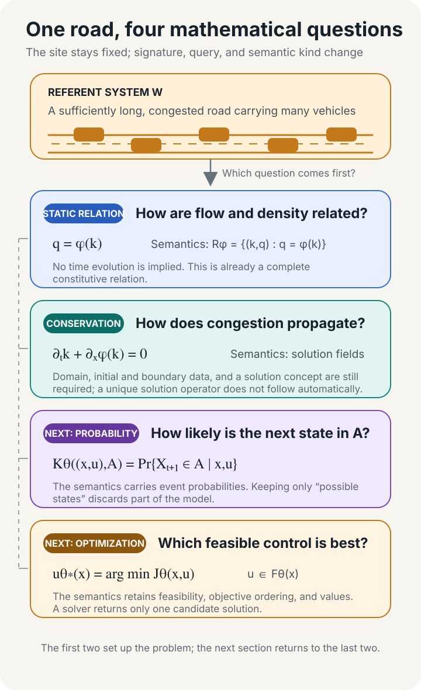
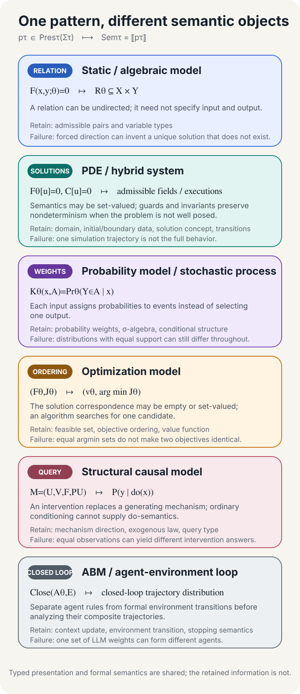

## One Road, Four Mathematical Objects

A congested road can be compressed into a flow-density diagram. The horizontal axis $k$ records vehicles per unit length, and the vertical axis $q$ records vehicles passing a cross section per unit time. Lighthill and Whitham summarized the relation between them with a constitutive equation:

$$
q=\phi(k).
$$

If $k$ is measured in vehicles per kilometer and $q$ in vehicles per hour, $\phi$ maps a density domain into a flow domain. Once a particular $\phi$ has been chosen, the equation determines the relation

$$
R_\phi=\{(k,q):q=\phi(k)\}.
$$

$R_\phi$ collects the admissible density-flow pairs. It describes neither the movement of congestion along the road nor a future state. An engineer may calculate $q$ from $k$, infer possible values of $k$ from $q$, or test whether an observed pair lies on the curve. The relation does not prescribe one direction of computation. [From Model to Engineering System](/en/posts/engineering-model-chain/) used this example to show how a static relation can enter an engineering model chain. Here we ask which mathematical inferences the relation permits.[^traffic-wave]

Congestion moves. Let $x$ denote position, $t$ time, and $k=k(x,t)$ local density. On a short road segment, the change in vehicle count equals inflow minus outflow. Let the segment length tend to zero while flow continues to satisfy $q=\phi(k)$, and the result is

$$
\partial_t k+\partial_x\phi(k)=0.
$$

$\phi$ is still the flow-density function, now acting as a flux. The equation constrains a space-time field $k(x,t)$. The road domain, initial density, boundary inflows, and solution concept jointly determine the admissible evolutions. Without those conditions, one partial differential equation may admit several candidate solutions.[^traffic-wave]

The two presentations share $\phi$ but preserve different mathematical information. The constitutive relation preserves a static correspondence between density and flow. The conservation model preserves evolution through space and time. A different question about the same road can instead produce a probabilistic state-transition kernel or a control problem with a feasible set and objective.

*Figure 1. Four modeling objects for the same road preserve a static relation, space-time evolution, state-transition probabilities, and a control choice. Click the image to enlarge it.*

The road remains in place, and the two presentations even share the same $\phi$, yet they preserve different objects and answer different queries. Model identity also depends on symbol types, the mathematical semantics acquired by a presentation, and what a comparison is set up to observe.

## A Water Tank Reveals the Layers

A tank with constant cross-sectional area admits two natural sets of equations. Let $A>0$ be the area, with inflow $q_{\mathrm{in}}$ and outflow $q_{\mathrm{out}}$. One presentation uses liquid level $h$ as the state; the other records volume $V$. A dot denotes differentiation with respect to time, and $y$ is the exposed output:

$$
\dot h=\frac{q_{\mathrm{in}}-q_{\mathrm{out}}}{A},
\qquad y=h,
$$

$$
\dot V=q_{\mathrm{in}}-q_{\mathrm{out}},
\qquad y=\frac{V}{A}.
$$

Reading these equations already relies on rules that the page does not print. $h$ is a length, $V$ a volume, $q_{\mathrm{in}}$ and $q_{\mathrm{out}}$ volume flow rates, $t$ time, and $y$ an exposed output. Their objects, value domains, units, and roles form a typed signature, denoted by $\Sigma$. The signature determines which expressions are well formed and forces unit conversions and port adapters into view.

The equations are a formal presentation $p$. A presentation may consist of equations, a graph, constraints, or program-like rules. Interpretation turns that presentation into a relation, a family of solution trajectories, a probability measure, an ordering, or a system of executions. Let $\tau$ denote the kind of mathematical object. A specification and its semantics can then be recorded as

$$
\mathsf{Spec}=(\Sigma,p),
\qquad
\mathsf{Sem}=\llbracket p\rrbracket_{\tau,\Sigma},
\qquad
\mathcal M=(\mathsf{Spec},\mathsf{Sem}).
$$

For the tank, $\tau$ is continuous-time trace semantics, and $\mathsf{Sem}$ is the family of trajectories satisfying the equations, initial conditions, and input convention. For the static road model, $\tau$ may be a relation; for a probabilistic program, a probability kernel; for an optimization problem, an object that preserves feasibility, ordering, and value. Here $\mathcal M$ denotes an interpreted specification package that retains the source presentation, while $M:=\mathsf{Sem}$ denotes the narrow semantic object that enters realization, deployment, and empirical-representation relations. For a chosen modeling language, $\llbracket-\rrbracket_{\tau,\Sigma}$ is a meta-level interpretation notation that assigns semantics of the appropriate kind to well-formed presentations.

Model theory resolves the same layer more finely. A formal structure $\mathbf A$ assigns mathematical objects to symbols in the signature, and a valuation $g$ assigns values to free variables. The expression $\mathbf A,g\models_\Sigma\varphi$ says that $\varphi$ holds in that structure under that valuation. A theory $T$ may admit several non-isomorphic structures, with semantics $\operatorname{Mod}_\Sigma(T)=\{\mathbf A:\mathbf A\models_\Sigma T\}$. Institution theory separates signatures, sentences, models, and satisfaction, and requires satisfaction to commute with translation when signatures change. This essay adopts that layering discipline; road equations, probability kernels, and neural networks remain interpreted in their own semantic domains.[^institution]

Parameters organize individual instances into a model family. Let $\Theta$ be the parameter space. If $\theta\in\Theta$ indexes tank area, traffic parameters, or network weights, write

$$
\mathsf{Spec}_\theta=(\Sigma,p(\theta)),
\qquad
\mathsf{Sem}_\theta=
\llbracket p(\theta)\rrbracket_{\tau,\Sigma},
\qquad
\mathcal M_\theta=(\mathsf{Spec}_\theta,\mathsf{Sem}_\theta).
$$

Fixing $\theta$ selects an instance. In the notation above, where $\Sigma$ and $\tau$ are fixed, a parameter change remains within one family. A parameter that changes the state space, variable types, or port set also changes the signature. $\Sigma$, $p$, $\tau$, and $\theta$ answer different questions; they are not independent metadata columns.

*Figure 2. A typed formal presentation is interpreted as a semantic object, and an observation map extracts the behavior needed for comparison. Modeling rules occupy the meta-level; an external relation connects a model to reality.*

The first essay treats $M$ as a narrow semantic object in an engineering relation chain and follows its realization, deployment, and qualification. Raising the resolution here traces how a signature, presentation, and semantic kind produce $M$, while $\mathcal M$ retains that formal origin. The relation between its symbols and a real road remains outside the model boundary for now.[^formal-empirical]

## What an Observation Preserves

Return to the tank. If $V_0=Ah_0$ and both formulations receive the same flow signals, they generate the same liquid-level curve. The invertible transformation

$$
\Psi:h\longmapsto Ah=V
$$

maps every solution trajectory of the first formulation to one of the second, while $\Psi^{-1}(V)=V/A$ maps it back. Both satisfy $A\dot y=q_{\mathrm{in}}-q_{\mathrm{out}}$ over their external variables. This correspondence covers the admissible initial conditions and inputs, so it says much more than the agreement of two simulations at a few sampled points.

Engineers often compare behavior only at specified ports. An observation specification $v$ must first declare the exposed variables, units, time scale, admissible inputs and initial conditions, and intended queries. $\operatorname{Sem}_{\tau_i}(\Sigma_i)$ denotes the class of complete semantic objects over signature $\Sigma_i$ and semantic kind $\tau_i$; $\Omega_{v,i}$ maps one such object into an observation-object space $\operatorname{Obs}_v$, typically a set of exposed trajectories for a dynamic system. When two models use different signatures or coordinates, each needs its own map into that common observation space:

$$
\Omega_{v,i}:
\operatorname{Sem}_{\tau_i}(\Sigma_i)
\longrightarrow\operatorname{Obs}_v,
\qquad i\in\{1,2\}.
$$

Behavioral equivalence relative to $v$ is

$$
\mathcal M_1\equiv_v\mathcal M_2
\quad\Longleftrightarrow\quad
\Omega_{v,1}(\mathsf{Sem}_1)
=
\Omega_{v,2}(\mathsf{Sem}_2).
$$

For the tank, $v$ treats $(q_{\mathrm{in}},q_{\mathrm{out}})$ as inputs and liquid level $y$ as the output. The two observation images are the same set of admissible $(q_{\mathrm{in}},q_{\mathrm{out}},y)$ trajectories, so the models are behaviorally equivalent. The behavioral approach studies open dynamic systems through such exposed trajectories while allowing different internal state realizations.[^behavior]

*Figure 3. The liquid-level and volume presentations yield the same boundary behavior under their observation maps. The identity criteria below the example answer different questions.*

"The same model" can refer to several preservation relations:

| Objects compared | Content declared invariant |
|---|---|
| File or formal presentation | Bytes, parsed equations, graphs, or rules |
| Formal semantics | A relation, measure, ordering, or execution system in one semantic domain |
| Formal structure | Isomorphism under renaming or a declared invertible transformation |
| Theory class | Membership in the class permitted by the same axioms or underspecified specification |
| External behavior | Equal images under their respective observation maps in a common space |
| Approximate models | Proximity over a stated domain, observable set, and error bound |
| Application task | Substitutability for a specified decision and threshold |
| Representation case | The user, real-world target, purpose, and empirical bridge remain fixed |

A team can hide a discrepancy by shrinking the input domain or deleting outputs after it has seen the result. The observation specification must precede the comparison. Agreement on a finite test set covers the samples that were run; behavioral equivalence covers the whole declared observation image.

Approximation claims also need a metric, tolerance, and task threshold. If each of two adjacent substitutions adds at most $\varepsilon$ error, their composition may add $2\varepsilon$, and the surrounding context may amplify or suppress it. [How a Model Becomes a Component](/en/posts/model-as-open-component/) quantifies admissible wiring, environmental assumptions, and feedback when it studies contextual substitutability. The relation $\equiv_v$ here compares model behavior at a fixed observation boundary.

Tank area $A$ offers another boundary test. Changing the $A$ fixed in the equations changes the admissible liquid-level trajectories, so it changes the model instance. Measurements used to estimate $A$ belong to the construction evidence. An inflow curve supplied for one run is an interface input that selects a trajectory from the family. The words parameter, data, and input cannot settle these roles by themselves.

## Three Irreversible Compressions

An observation map performs a purposeful compression and retains the information needed by the current query. Recovering the original semantic object also requires the discarded probability weights, ordering of alternatives, or generative structure. Probability, optimization, and causal models provide three direct examples. Let $\mathcal Y$ be a finite discrete outcome space and $\mathcal X$ a decision space; in an optimization problem, $\mathcal F\subseteq\mathcal X$ is the feasible set and $J$ the objective. Let $\mathcal X_{\mathcal V}$ be the joint value space of the endogenous variable set $\mathcal V$, and restrict the causal domain to well-defined models that induce a unique observational distribution. Then

$$
\begin{aligned}
\operatorname{forget}_{\mathrm{prob}}&:
\operatorname{Prob}(\mathcal Y)\to2^{\mathcal Y},
&\mu&\longmapsto\operatorname{supp}(\mu),\\
\operatorname{forget}_{\mathrm{opt}}&:
\operatorname{Opt}(\mathcal X)\to2^{\mathcal X},
&(\mathcal F,J)&\longmapsto
\operatorname*{argmin}_{x\in\mathcal F}J(x),\\
\operatorname{forget}_{\mathrm{causal}}&:
\operatorname{SCM}(\mathcal V)\to
\operatorname{Prob}(\mathcal X_{\mathcal V}),
&M&\longmapsto P_M^{\mathrm{obs}}.
\end{aligned}
$$

These maps are generally non-injective: distinct semantic objects can produce the same compressed result.

Consider a Bernoulli model for $N$ independent binary observations, with outcome space $\mathcal Y=\{0,1\}^N$. At $\theta_1=0.2$ and $\theta_2=0.8$, both supports equal all of $\mathcal Y$, because every finite binary sequence has positive probability. The probabilities of $N$ consecutive successes are $0.2^N$ and $0.8^N$. As $N$ grows, equal sets of possible outcomes can therefore assign weights separated by multiple orders of magnitude to the same event.[^bernoulli]

An optimization problem loses its ordering when we retain only an optimizer. Let the feasible alternatives be $a,b,c$. Two objectives make $a$ the unique optimum while satisfying

$$
J_1(a)=J_2(a)=0,
\qquad
0<J_1(b)<J_1(c),
\qquad
0<J_2(c)<J_2(b).
$$

If a road closure or a new constraint removes $a$ from the feasible set, the first objective selects $b$ and the second selects $c$. A shared $\operatorname*{argmin}$ has discarded the ordering among the remaining alternatives. Queries about near-optimality, sensitivity, or changed constraints also need objective values and the feasible set.[^optimization]

For a causal model, the hidden difference appears under intervention. Let the exogenous variables $\epsilon_X$ and $\epsilon_Y$ be independent $\mathcal N(0,1)$ variables, and let $\eta_Y\sim\mathcal N(0,2)$ and $\eta_X\sim\mathcal N(0,\tfrac12)$ be independent. Consider

$$
\begin{aligned}
M_{\rightarrow}:&\quad X=\epsilon_X,\qquad Y=X+\epsilon_Y,\\
M_{\leftarrow}:&\quad Y=\eta_Y,\qquad X=\tfrac12Y+\eta_X.
\end{aligned}
$$

These two pairs of exogenous variables make both models induce the same zero-mean joint Gaussian observational distribution with covariance $\left(\begin{smallmatrix}1&1\\1&2\end{smallmatrix}\right)$. For every $x_0\in\mathbb R$, intervention $\operatorname{do}(X=x_0)$ gives

$$
\mathbb E_{M_{\rightarrow}}[Y\mid\operatorname{do}(X=x_0)]=x_0,
\qquad
\mathbb E_{M_{\leftarrow}}[Y\mid\operatorname{do}(X=x_0)]=0.
$$

Even if the shared observational distribution were known with arbitrary precision, the models would remain indistinguishable without interventions, temporal information, or structural assumptions. Algebraic rearrangement cannot reverse which mechanism an intervention replaces.[^scm]

*Figure 4. Each semantic kind has native structure: probability models preserve weights, optimization models preserve feasibility and ordering, causal models preserve intervention queries, and dynamic or open systems preserve executions and closed-loop behavior.*

These examples locate the common structure at a typed presentation-to-semantics relation. Once a computational realization receives a semantic object, it must preserve the results exposed at the chosen observation boundary.

## When Grids, Solvers, and Environments Change the Model

Neural ODEs bring the realization boundary into training. Let $z(t)$ be the continuous state and $f_\theta$ a parameterized vector field. An algorithm $\Phi$ with step size $h$ and solver configuration $r$ computes the next approximation from $\hat z_n$ at time $t_n$:

$$
\dot z(t)=f_\theta(z(t),t),
\qquad
\hat z_{n+1}=\Phi_{h,r}(t_n,\hat z_n;f_\theta),
$$

where $h$ is the step size and $r$ records the algorithm and tolerances. After fixing $f_{\hat\theta}$, smaller steps or tighter tolerances may make several valid algorithms converge to the same continuous solution; the integrator's discrepancy then belongs to realization error. During training, however, the network parameters can compensate for truncation error. Zhu and colleagues analyze this coupling through inverse modified differential equations: a solver used in training can alter the learned vector field.[^neural-ode-solver]

Suppose a refinement path $r_m$ produces computational artifacts $C_{r_m}$, for example with step sizes $h_m\to0$ and tightening tolerances. $\llbracket C_{r_m}\rrbracket_{\mathrm{run}}$ denotes an artifact's runtime semantics, such as a set of executable traces; $\Omega_{v,r_m}$ and $\Omega_{v,\mathcal M}$ map runtime and model semantics into the same observation space. When that space carries a numerical distance $d_v$, a typical realization claim is

$$
d_v\!\left(
\Omega_{v,r_m}(\llbracket C_{r_m}\rrbracket_{\mathrm{run}}),
\Omega_{v,\mathcal M}(\mathsf{Sem})
\right)\longrightarrow0,
\qquad m\to\infty.
$$

$v$ declares the input domain, exposed variables, and time base; evidence must also state whether the limit holds pointwise over admissible inputs and initial conditions or uniformly on the declared domain. Relational temporal semantics does not use a distance-to-zero claim. For trace sets, define $X\preceq_v Y$ to mean that every observed behavior in $X$ is permitted by $Y$, so the left side refines the right. One can then require

$$
\Omega_{v,r}(\llbracket C_r\rrbracket_{\mathrm{run}})
\preceq_v
\Omega_{v,\mathcal M}(\mathsf{Sem}).
$$

When every admissible refinement path approaches the same observed semantics, grids and algorithms can remain inside the computational artifact. If a specification deliberately permits multiple trajectories, an implementation that selects one can constitute a refinement. A selection rule belongs in the model presentation when the purpose requires a unique output or interchangeability among implementations.

A neural operator places its target at the map $\mathcal G^\dagger:\mathcal A\to\mathcal U$ from an input function space $\mathcal A$ to an output function space $\mathcal U$, while a program reads functions through a grid or basis coefficients. After fixing the parameters, declaring a refinement path, and controlling reconstruction error, changing the grid primarily changes the computational artifact. The training distribution still determines which inputs receive evidential coverage. Discretization invariance must be established by an architecture and approximation relation; the name cannot provide it.[^neural-operator]

A PINN brings the target PDE, finite collocation loss, and trained function close together. Whether the target PDE and boundary conditions belong to the formal presentation depends on what the specification declares. A function construction can enforce a declared boundary condition exactly; a finite collocation penalty is a computational criterion, and low training loss covers only the selected points and weights. Continuous-domain error and distance from a target solution still require error estimates or a convergence argument.[^pinn]

The same test applies to runtime feedback. In Conway's Game of Life, synchronous submission of local updates induces a global transition $F_{\mathrm{sync}}$. Updating cells sequentially will generally produce another transition. Scheduling belongs to the model semantics when it changes the admissible space-time trajectories.[^abm-schedule]

A ReAct-style agent also receives observations, updates context, invokes tools, and decides when to stop. Let $\theta$ denote the base policy parameters and $\gamma$ the runtime protocol comprising memory updates, tool rules, error handling, and stopping conditions; together they define $A_{\theta,\gamma}$. Let $E$ denote a formal environment transition. Their closed-loop object is

$$
\operatorname{Close}(A_{\theta,\gamma},E).
$$

The same base weights attached to different tool protocols or stopping conditions define different agents. One agent attached to different formal environments defines different closed loops. A live API or physical site is not identical to $E$; an engineer abstracts a transition relation from the running world before formal analysis. A tool response is a runtime observation. Caching, timeouts, and concurrent scheduling enter the closed-loop specification when they change the admissible trajectories.[^react]

Grids and solvers belong to the computational artifact when a declared refinement path preserves observed semantics. Scheduling, tool protocols, or environment transitions that change admissible trajectories produce a different model or closed loop. [The third essay](/en/posts/model-as-open-component/) will fix interfaces and contexts. Once the formal closed loop is fixed, one question remains: how does it refer to a real road or API?

## How Mathematical Structure Refers to Reality

Density $k$ on a road requires measurement and aggregation. Researchers must decide whether to count one lane or the full road segment, choose a spatial window, align timestamps, and handle missed detections. Flow $q$ also depends on a counting interval and a unit. Sensing, filtering, and aggregation turn raw traffic processes into records; a research team then constructs data objects that can be compared with model outputs.

Formal semantics can operate only on the symbols and structures already supplied. $\mathbf A\models_\Sigma T$ says that structure $\mathbf A$ satisfies theory $T$. It identifies neither the motorway represented by $\mathbf A$ nor an error criterion for accepting an empirical claim. Tarski's account of formal satisfaction and Suppes's distinction among theories, structures, and data models draw this boundary.[^formal-empirical]

Hughes separates denotation, demonstration within a model, and empirical interpretation. Giere adds the model user and purpose to the representation relation. Let $a$ be the research community or operating organization that uses the model, $M$ the narrow semantic object, $W$ the referent system, $P$ the purpose, and $\rho$ the empirical bridge package. An empirical representation case can be recorded as

$$
\operatorname{Rep}(a,M,W,P;\rho).
$$

If the parameterized interpreted specification package is $\mathcal M_\theta=(\mathsf{Spec}_\theta,\mathsf{Sem}_\theta)$, then $M=\mathsf{Sem}_\theta$ here. The bridge package $\rho$ records three jobs: which real objects the model symbols denote, how measurement and aggregation produce comparable quantities, and how results obtained inside the model are interpreted as claims about $W$. This trilogy uses $\rho$ as its highest-resolution account of empirical reference. The model node $M$ in the first essay no longer absorbs these bridges.[^ddi][^representation]

If a model produces a prediction object $\widehat Z$ while sensing and processing produce a data object $Z$, $\rho$ must place both at the same observational scale before selecting an error, coverage, or refinement relation. Probabilistic predictions require distributional comparisons. Set-valued models require coverage checks. If a causal query is interventional, $Z$ must come from the corresponding intervention design, or $\rho$ must record the identification assumptions that connect observational data to the intervention target.

*Figure 5. Formal interpretation gives symbols mathematical meaning inside the model. Outside it, $\rho$ supplies denotation, operational definitions, and empirical interpretation so model results and observations can meet at a common scale.*

Lighthill and Whitham's constitutive relation concerns long, crowded roads with many vehicles.[^traffic-wave] When researchers use it to analyze macroscopic congestion waves, $\rho$ specifies density, flow, road extent, and time scale before the conservation model derives wave propagation. A task that asks whether one car can brake safely under communication delay requires individual vehicle states, actuators, and communication processes absent from the original signature. That safety claim has no bridge from the current model to the world.

The next claim that "the model did not change" should name the two objects being compared, the semantics to be preserved, the observation domain and purpose, and the $\rho$ that connects each model to reality. Those qualifications locate the answer in a specific equation, program, component boundary, or engineering relation.

---

[^traffic-wave]: M. J. Lighthill and G. B. Whitham, "[On Kinematic Waves II: A Theory of Traffic Flow on Long Crowded Roads](https://doi.org/10.1098/rspa.1955.0089)," *Proceedings of the Royal Society A* 229, 1955, Abstract, Sections 1-2, eqs. (1)-(7); P. I. Richards, "[Shock Waves on the Highway](https://doi.org/10.1287/opre.4.1.42)," *Operations Research* 4(1), 1956, pp. 43-44, eqs. (4)-(6). The former gives the flow-density hypothesis, its intended scale, and the paper's qualitative empirical comparison; the latter states the traffic conservation PDE directly.

[^institution]: Joseph Goguen and Rod Burstall, "[Institutions: Abstract Model Theory for Specification and Programming](https://doi.org/10.1145/147508.147524)," *Journal of the ACM* 39(1), 1992, pp. 101-103, Definitions 1-2; pp. 112-113.

[^formal-empirical]: Alfred Tarski, "[The Semantic Conception of Truth and the Foundations of Semantics](https://doi.org/10.2307/2102968)," 1944, p. 345 and pp. 361-362; Patrick Suppes, "[A Comparison of the Meaning and Uses of Models in Mathematics and the Empirical Sciences](https://web.stanford.edu/group/csli-suppes/techreports/IMSSS_33.pdf)," 1960, pp. 289-291 and 297-300.

[^behavior]: Jan C. Willems, "[The Behavioral Approach to Open and Interconnected Systems](https://doi.org/10.1109/MCS.2007.906923)," *IEEE Control Systems Magazine* 27(6), 2007, pp. 51-53, 63-64, and 70-72.

[^bernoulli]: Bob Carpenter et al., "[Stan: A Probabilistic Programming Language](https://www.jstatsoft.org/article/view/v076i01)," *Journal of Statistical Software* 76(1), 2017, Section 2.1, pp. 2-3.

[^optimization]: Stephen Boyd and Lieven Vandenberghe, *[Convex Optimization](https://web.stanford.edu/~boyd/cvxbook/)*, 2004, Section 4.1, eq. (4.1), pp. 127-129; the distinction between an optimization problem and a solution method appears in Section 1.1.2, pp. 4-5.

[^scm]: Judea Pearl, "[Causal Inference in Statistics: An Overview](https://doi.org/10.1214/09-SS057)," *Statistics Surveys* 3, 2009, Section 2.2, pp. 98-101; Sections 3.1-3.2.1, pp. 103-108, eqs. (1)-(7); Definition 2, p. 109.

[^neural-ode-solver]: Aiqing Zhu et al., "[On Numerical Integration in Neural Ordinary Differential Equations](https://proceedings.mlr.press/v162/zhu22f.html)," *ICML 2022*, Abstract, Section 2.1 and Sections 3.1-3.3, especially Theorems 3.1-3.2.

[^neural-operator]: Nikola Kovachki et al., "[Neural Operator: Learning Maps Between Function Spaces with Applications to PDEs](https://www.jmlr.org/papers/v24/21-1524.html)," *Journal of Machine Learning Research* 24, 2023, Sections 2.1-2.3, especially Definition 4; the error decomposition appears in Section 3, pp. 11-12.

[^pinn]: Maziar Raissi, Paris Perdikaris, and George Karniadakis, "[Physics-informed neural networks: A deep learning framework for solving forward and inverse problems involving nonlinear partial differential equations](https://doi.org/10.1016/j.jcp.2018.10.045)," *Journal of Computational Physics* 378, 2019, Sections 2.1-2.2; Aditi Krishnapriyan et al., "[Characterizing Possible Failure Modes in Physics-Informed Neural Networks](https://proceedings.neurips.cc/paper_files/paper/2021/hash/df438e5206f31600e6ae4af72f2725f1-Abstract.html)," *NeurIPS 2021*, Sections 3-4.1.

[^abm-schedule]: Volker Grimm et al., "[A Standard Protocol for Describing Individual-Based and Agent-Based Models](https://doi.org/10.1016/j.ecolmodel.2006.04.023)," *Ecological Modelling* 198, 2006, Sections 2.1-2.7, especially Section 2.3, pp. 118-119; Uri Wilensky, "[NetLogo Life model](https://ccl.northwestern.edu/netlogo/models/Life)," 1998, HOW IT WORKS.

[^react]: Shunyu Yao et al., "[ReAct: Synergizing Reasoning and Acting in Language Models](https://openreview.net/forum?id=WE_vluYUL-X)," *ICLR 2023*, Section 2, p. 3; Sections 3.1-3.2, pp. 4-5.

[^ddi]: R. I. G. Hughes, "[Models and Representation](https://doi.org/10.1086/392611)," *Philosophy of Science* 64, 1997, pp. S329, S333, and S335.

[^representation]: Ronald Giere, "[How Models Are Used to Represent Reality](https://doi.org/10.1086/425063)," *Philosophy of Science* 71, 2004, p. 743 and pp. 747-750.
