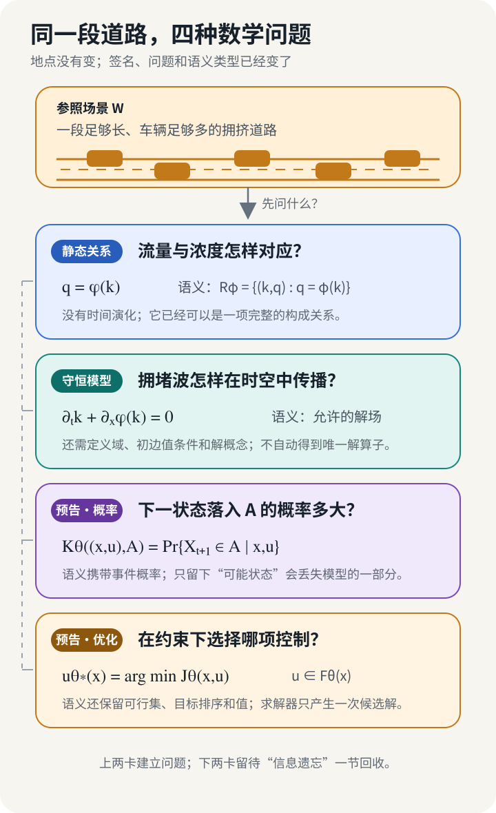
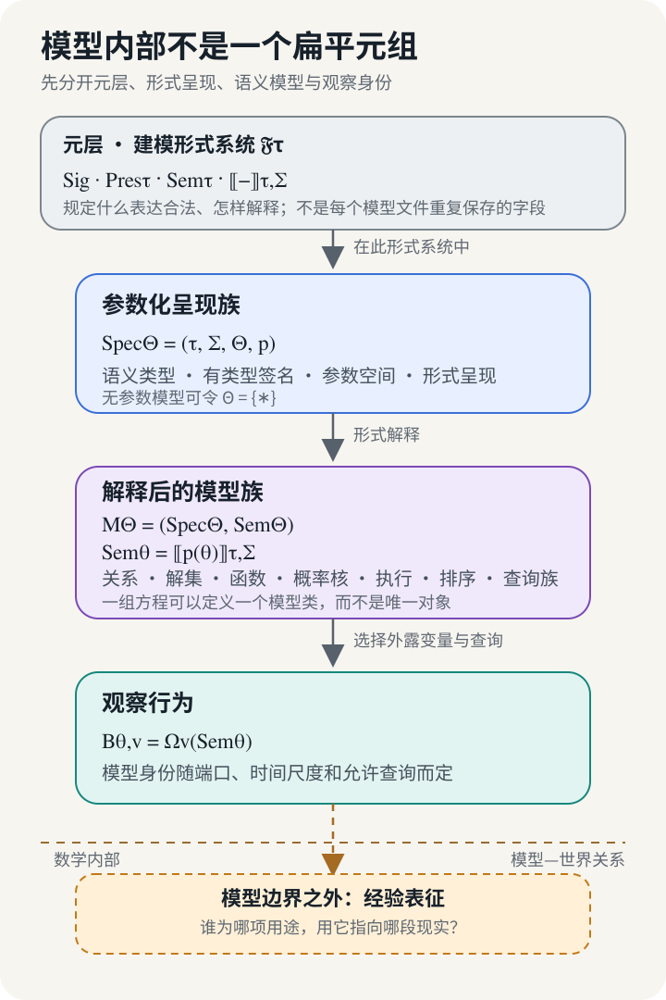
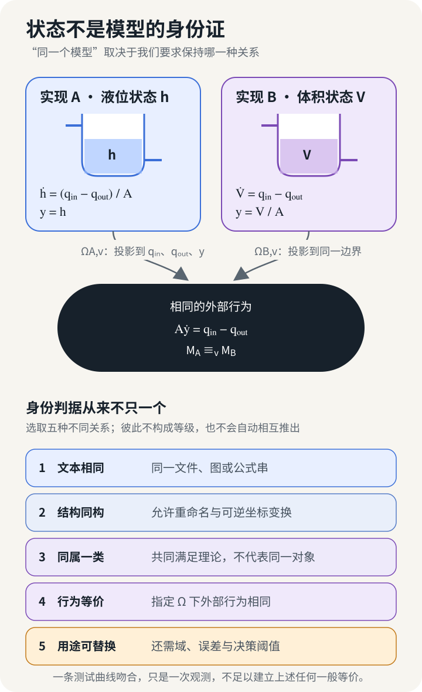
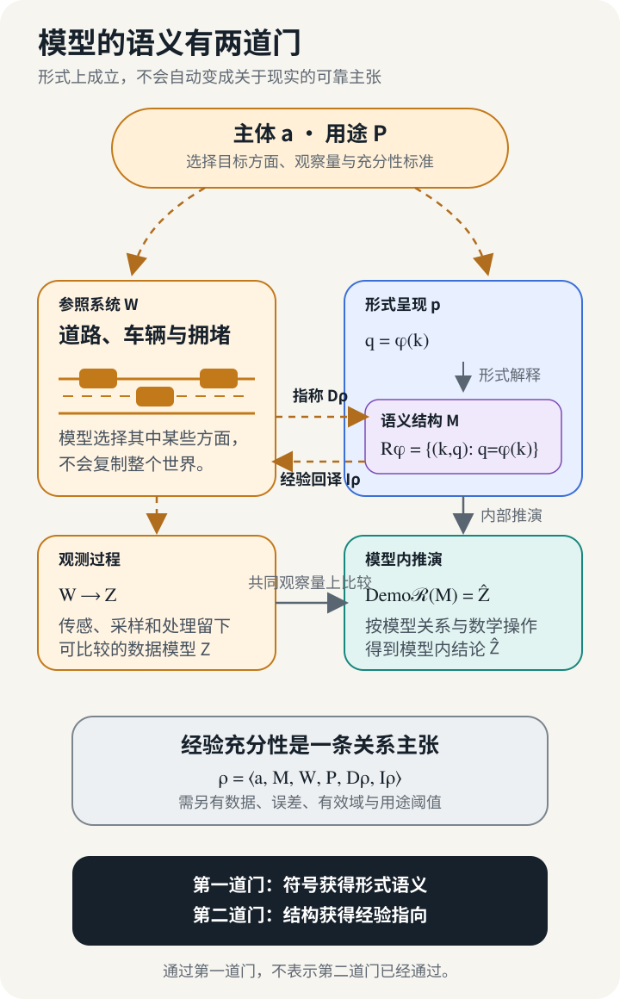

## 一条曲线怎样成为模型

一段拥挤道路可以被压缩成一张流量—浓度图。横轴 $k$ 表示单位道路长度上的车辆数，纵轴 $q$ 表示单位时间内通过某个断面的车辆数。Lighthill 和 Whitham 在宏观交通流理论中，用一条构成关系概括两者的联系：

$$
q=\phi(k).
$$

这条式子把研究对象从一辆车的跟驰动作移向大量车辆形成的连续交通流。[上一篇文章](/posts/engineering-model-chain/)借它说明静态关系也能进入工程模型链；本文从它的数学身份继续。[^traffic-wave]

孤立地读，$q=\phi(k)$ 只是一串字符。读者还需要知道 $q$ 和 $k$ 的值域、单位，以及 $\phi$ 属于哪一类函数。若 $k$ 取车辆每公里，$q$ 取车辆每小时，那么 $\phi$ 至少要把一个浓度域映到一个流量域。补齐这些信息，并把 $\phi$ 解释成一个具体函数以后，式子才规定关系

$$
R_\phi=\{(k,q):q=\phi(k)\}.
$$

$R_\phi$ 收集这条构成关系允许的浓度—流量对。此时没有空间传播，也没有未来状态。给定 $k$ 计算 $q$ 是一种常见用法，却不是关系强制规定的方向。工程师也可以给定流量反求可能的浓度，检查一个观测对是否落在关系上，或者研究曲线的极值。表达式支持哪些操作，取决于它被解释成了什么数学对象。

道路上的拥堵会移动。取一小段道路，区间内车辆数的变化等于入口流量减去出口流量。让区间长度趋于零，并令流量继续服从 $q=\phi(k)$，得到守恒方程

$$
\partial_t k+\partial_x\phi(k)=0.
$$

$\phi$ 仍然是流量—浓度函数，在新方程中承担通量函数的角色。方程约束的对象已经变成时空场 $k(x,t)$。前一个模型允许平面上的浓度—流量对，这个模型允许浓度随位置和时间变化的一族解。[^traffic-wave]

仅有一行偏微分方程仍选不出一次确定演化。道路区间、初始浓度和边界流入需要给定；出现多个候选解时，还要声明解概念与选择规则。问题适定并且输入角色明确以后，工程师才能进一步把它视为从初值、边界条件到解场的单值算子。

构成关系和守恒模型共享同一个 $\phi$，数学承诺却不同：允许推理的对象已经从点对变成时空演化。同样的字符放进不同类型、单位和解释规则，也会获得不同含义。

把问题沿同一段道路继续推开，还会出现概率和优化。若研究者关心随机需求或未建模扰动，他会询问下一状态落入事件 $A$ 的概率；若任务变成选择匝道流量或速度建议，还要给出可行控制与目标排序。

*图 1　同一段道路上的四种建模对象，依次保存静态关系、时空演化、状态转移概率和控制选择。图片可点击放大。*

形式呈现只有在类型和解释规则中才划定数学对象；用途也可能让建模者选择另一套变量与查询。第一篇为了追踪工程关系，把这些差异收进语义模型 $M$。本文进一步分清哪些规则属于建模语言，哪些内容由一个具体模型给出。

## 给模型拆出层次

用 $\Sigma$ 记一套有类型的签名。它声明对象种类、常量或参数、函数与关系符号，并为呈现中的变量规定类型；工程扩展还可以记录单位、时间基与端口角色。静态交通关系的简化签名包含浓度域 $\mathcal K$、流量域 $\mathcal Q$，以及函数符号

$$
\phi:\mathcal K\longrightarrow\mathcal Q.
$$

表达式 $q=\phi(k)$ 在这套签名下才成为合法呈现。守恒模型还要加入空间、时间和场的类型，例如 $k:D\times[0,T]\to\mathcal K$。签名先回答一句话能否被写下，也阻止单位不合、时间尺度不同或接口角色冲突的量被直接接在一起。

签名仍没有把符号解释成具体数学对象。给定 $\Sigma$，一个形式结构 $\mathbf A\in\operatorname{Mod}(\Sigma)$ 为各个载体、函数符号和关系符号提供数学解释；变量赋值 $g$ 再为自由变量取值。对公式 $\varphi$，模型论写作

$$
\mathbf A,g\models_\Sigma\varphi.
$$

结构中的 $\phi^{\mathbf A}$ 选定具体函数以后，满足 $q=\phi(k)$ 的赋值构成关系

$$
R_{q=\phi(k)}^{\mathbf A}
=
\left\{
(\kappa,\upsilon)\in
\mathcal K^{\mathbf A}\times\mathcal Q^{\mathbf A}
:
\upsilon=\phi^{\mathbf A}(\kappa)
\right\}.
$$

形式解释给符号数学含义，满足关系判断一个公式在结构和赋值中是否成立。若 $T$ 是一组句子，它允许的结构类写成

$$
\operatorname{Mod}_\Sigma(T)
=
\{\mathbf A:\mathbf A\models_\Sigma T\}.
$$

一份规格因此可能对应多个互不同构的结构。[^institution] 这里的“满足”仍完全发生在数学内部，不表示某段真实道路已经满足这个理论。[^formal-empirical]

交通关系、概率程序、优化问题和自动机并不共享同一种结果容器。本文用 $\tau$ 标记语义类型：关系或解集合、概率核、带可行域与排序的优化问题，以及允许执行系统都落在不同语义域，后续推理也要保留不同内容。

对固定的 $\Sigma$ 与 $\tau$，$\operatorname{Pres}_\tau(\Sigma)$ 是合法呈现集，$\operatorname{Sem}_\tau(\Sigma)$ 是相应语义域，解释映射为

$$
\llbracket-\rrbracket_{\tau,\Sigma}:
\operatorname{Pres}_\tau(\Sigma)
\longrightarrow
\operatorname{Sem}_\tau(\Sigma).
$$

相对于已经选定的建模规则，一个具体形式规格写成

$$
\mathsf{Spec}=(\Sigma,p),
\qquad
p\in\operatorname{Pres}_\tau(\Sigma).
$$

$p$ 是模型被写下的方式，可以是一组方程、一张图、若干约束或一段概率程序。解释结果写成

$$
\mathsf{Sem}
=
\llbracket p\rrbracket_{\tau,\Sigma},
\qquad
\mathcal M=(\mathsf{Spec},\mathsf{Sem}).
$$

本文把 $(\Sigma,p)$ 称为形式规格或形式呈现，把绑定了相应 $\mathsf{Sem}$ 的记录称为解释后的模型。若 $p=T$ 是一组模型论句子，$\mathsf{Sem}$ 可以是 $\operatorname{Mod}_\Sigma(T)$；对其他语义类型，它也可以是概率核、优化序或执行系统。方括号 $\llbracket p\rrbracket$ 是总括记号，模型论的满足类只是其中一种实例。

这里的 $\mathsf{Spec}$ 不是上一篇中的工程要求 $S$。前者记录模型的形式表达，后者记录系统希望满足的规范。提高符号分辨率的目的正是防止同一个字母或日常词语越过对象边界。

签名、合法呈现、语义域和解释映射的共享规则属于建模形式系统，而不是单个模型的字段。Institution theory 更一般地分开签名、句子、模型与满足关系，并要求换签名时满足关系与翻译相容。本文借用这项分层纪律，不把所有工程模型宣称为同一个完备 institution。[^institution]

许多工程模型以族的形式出现。交通流函数 $\phi_\theta$ 可以带容量或自由流速度参数，神经网络用权重索引具体函数，随机模型以参数索引一族测度。令 $\Theta$ 表示索引空间：

$$
p:\Theta\longrightarrow\operatorname{Pres}_\tau(\Sigma),
$$

$$
\mathsf{Spec}_\Theta=(\tau,\Sigma,\Theta,p),
\qquad
\mathsf{Sem}_\Theta:\Theta\longrightarrow
\operatorname{Sem}_\tau(\Sigma),
\qquad
\theta\longmapsto
\llbracket p(\theta)\rrbracket_{\tau,\Sigma},
\qquad
\mathcal M_\Theta=(\mathsf{Spec}_\Theta,\mathsf{Sem}_\Theta),
$$

而一个固定实例为

$$
\mathsf{Spec}_\theta=(\Sigma,p(\theta)),
\qquad
\mathsf{Sem}_\theta=
\mathsf{Sem}_\Theta(\theta)=
\llbracket p(\theta)\rrbracket_{\tau,\Sigma},
\qquad
\mathcal M_\theta=
(\mathsf{Spec}_\theta,\mathsf{Sem}_\theta).
$$

固定 $\theta$ 得到一个模型实例。改变参数通常仍留在同一族中，前提是签名和语义类型保持不变。若某个索引改变了状态空间、变量类型或端口集合，固定签名的写法便不再准确；此时需要写成 $\Sigma_\theta$，或者把若干签名组织在更高一层。内部连边有时可以留在 $p(\theta)$ 中，节点类型与接口集合的变化则往往会触及签名。

比较模型时还要选择观察规格 $v$ 与观察映射 $\Omega_v$。本文把保留下来的行为简写为

$$
B_{\theta,v}=\Omega_v(\mathsf{Sem}_\theta).
$$

元层规定合法表达，呈现族经解释形成语义模型；观察规格位于比较层，决定当前保留什么。

*图 2　模型内部包含有类型的形式呈现与语义实例；比较层的观察映射从中提取所需行为，建模规则属于元层，模型对现实的指向属于外部表征关系。*

图底部的赭色区域此时只划出边界。形式解释说明符号怎样获得数学含义，模型为什么能够指向一条真实道路则是另一项关系。眼下更近的问题是身份：坐标、状态名和方程都变了以后，两份模型仍可能表达同一件事吗？

## 状态不是模型的身份证

一只横截面积恒定的水箱可以写出两套同样自然的方程。设横截面积 $A>0$，流入和流出分别为 $q_{\mathrm{in}}$ 与 $q_{\mathrm{out}}$。第一套方程把液位 $h$ 当作状态：

$$
\dot h
=
\frac{q_{\mathrm{in}}-q_{\mathrm{out}}}{A},
\qquad
y=h.
$$

第二套方程记录水的体积 $V$：

$$
\dot V
=
q_{\mathrm{in}}-q_{\mathrm{out}},
\qquad
y=\frac{V}{A}.
$$

纸面上的变量和微分方程并不相同。第一套状态的单位是长度，第二套是体积，代码中的变量名和数值也不会逐项相等。只要初值满足 $V_0=Ah_0$，两套方程接收相同的流量信号，就会产生同一条液位曲线。映射

$$
\Psi:h\longmapsto Ah=V
$$

把第一套方程的每条解轨迹送到第二套方程，逆映射 $\Psi^{-1}(V)=V/A$ 又把它送回来。两边在共同的外部变量上满足

$$
A\dot y=q_{\mathrm{in}}-q_{\mathrm{out}}.
$$

这项对应覆盖允许的初值与输入轨迹，并保留时间演化和输出关系，因而比“一次仿真结果恰好相同”强得多。液位与体积是同一个动态关系的两套坐标。状态变量对建模和计算很重要，却不是模型天然携带的唯一身份证。

许多工程系统没有这样显眼的可逆状态变换。使用者只要求两个对象在指定端口上产生相同轨迹，内部状态无需逐项配对。此时要先声明观察规格 $v$：哪些量是输入和输出，采用什么单位和时间尺度，允许哪些初值与输入，又准备提出什么查询。水箱案例中的 $v$ 把 $(q_{\mathrm{in}},q_{\mathrm{out}})$ 作为输入，把液位 $y$ 作为输出。

如果两个模型位于不同签名或坐标系统中，就分别为它们定义通往同一观察空间的映射：

$$
\Omega_{v,1}:
\operatorname{Sem}_{\tau_1}(\Sigma_1)
\longrightarrow
\operatorname{Obs}_v,
\qquad
\Omega_{v,2}:
\operatorname{Sem}_{\tau_2}(\Sigma_2)
\longrightarrow
\operatorname{Obs}_v.
$$

相对于 $v$ 的行为等价写成

$$
\mathcal M_1\equiv_v\mathcal M_2
\quad\Longleftrightarrow\quad
\Omega_{v,1}(\mathsf{Sem}_1)
=
\Omega_{v,2}(\mathsf{Sem}_2).
$$

水箱的两个观察像都是允许的 $(q_{\mathrm{in}},q_{\mathrm{out}},y)$ 轨迹集合，因此满足这条等式。行为方法正是从这种外露轨迹出发研究动态系统：状态可以保留在内部，比较和互联的边界则由外露变量上的行为划定。[^behavior]

*图 3　液位与体积两种状态呈现经观察映射得到同一边界行为；下方列出五种常见身份判据，更多判据见正文。*

“同一个模型”在实际讨论中可能指向几种互不等价的判断：

| 比较对象 | 所谓“相同”实际保留什么 |
|---|---|
| 文件或表达 | 字节、解析后的方程、图或规则相同 |
| 形式结构 | 只差重命名或声明的可逆结构变换 |
| 理论类 | 两个结构都满足同一组公理或 loose specification |
| 精确语义 | 在声明的语义域中得到同一个关系、测度、排序或执行系统 |
| 外部行为 | 经各自观察映射进入共同空间后相同 |
| 近似模型 | 在声明的域、观察量和误差界内足够接近 |
| 表征案例 | 主体、所用模型、现实目标、用途与指称／回译关系保持不变 |
| 应用任务 | 对某项决策和阈值给出可互换的结论 |
| 计算制品 | 离散化、代码、依赖、精度与运行配置相同 |
| 治理谱系 | 多个版本被记录为同一条演化链 |

这些关系不构成一条统一的强弱阶梯，缺少附加条件时也不能互相替代：共享理论类可与结构不同构并存，外部行为一致可与隐藏状态差异并存，用途可替换性则随任务重新判断。团队说“模型没变”以前，需要先把比较对象与保持关系说完整。

观察规格还必须先于比较确定。若比较完成后再缩小输入域，或者删去不一致的输出，任何两套模型都可能被制造成“等价”。两段程序在有限测试集上输出一致，只能建立关于这些样本的事实；行为等价要求整个声明域上的观察像相同。

近似模型要再给出距离和容差。例如，

$$
d_v\!\left(
\Omega_{v,1}(\mathsf{Sem}_1),
\Omega_{v,2}(\mathsf{Sem}_2)
\right)
\leq\varepsilon.
$$

这项关系很有工程价值，却通常不是数学等价关系。第一个模型与第二个相差不超过 $\varepsilon$，第二个与第三个也相差不超过 $\varepsilon$，三角不等式往往只能给出第一与第三相差不超过 $2\varepsilon$。有效域、误差量和用途阈值必须随“可替换”一起保留。

水箱面积 $A$ 的位置也能用同一思路辨认。固定在方程中的 $A$ 改变后，允许的液位轨迹会变化，它属于这个模型实例；用于估计 $A$ 的尺子读数和实验记录属于构造过程；某次运行给定的流入曲线则是接口输入，只从全部允许轨迹中选出一条。参数、数据和输入无法按名词永久分进模型内外，它们承担的逻辑职责才是判断依据。

## 语义类型决定不能丢失什么

观察映射保留当前问题关心的结果，也主动丢掉其余结构。由此可以提出一个诱人的统一方案：把所有模型都压缩成输入到输出的函数，或者一组可能发生的行为。概率模型首先暴露它的缺口。可能结果集合只记录事件能否发生，概率模型还规定每个结果获得多大权重。优化问题的最优解集合只留下获胜者，原目标函数对其他方案的排序已经消失。结构因果模型的观察分布记录变量怎样共同变化，却没有保存干预时应当替换哪条生成机制。

这三种压缩可以写成三个遗忘映射。以下取有限离散的 $\mathcal Y$，并把 $\operatorname{SCM}(\mathcal V)$ 限定为能够唯一诱导观察分布的良定模型：

$$
\begin{aligned}
\operatorname{forget}_{\mathrm{prob}} &:
\operatorname{Prob}(\mathcal Y)\to2^{\mathcal Y},
&\mu&\longmapsto\operatorname{supp}(\mu),\\
\operatorname{forget}_{\mathrm{opt}} &:
\operatorname{Opt}(\mathcal X)\to2^{\mathcal X},
&(\mathcal F,J)&\longmapsto
\operatorname*{argmin}_{x\in\mathcal F}J(x),\\
\operatorname{forget}_{\mathrm{causal}} &:
\operatorname{SCM}(\mathcal V)\to
\operatorname{Prob}(\mathcal X_{\mathcal V}),
&M&\longmapsto P_M^{\mathrm{obs}},
\end{aligned}
$$

其中 $\mathcal X_{\mathcal V}$ 是全部内生变量的联合值空间。三张映射通常都不是单射：原生语义不同的两个对象，可以在遗忘以后得到同一个结果。

先看 Bernoulli 模型。对 $N$ 次独立同分布的二元观测，结果空间为 $\mathcal Y=\{0,1\}^N$。取 $\theta_1=0.2$ 与 $\theta_2=0.8$，两者的支持集都是整个 $\mathcal Y$，每一种有限二元序列都具有正概率；“连续 $N$ 次成功”的概率却分别是 $0.2^N$ 与 $0.8^N$。支持集完全相同，风险判断可以相差许多数量级。轨迹支持也只能告诉我们哪些路径可能出现，随机过程律还要规定概率质量怎样分布在这些路径上。[^bernoulli]

优化模型沿另一条路径到达同一问题。设可行方案只有 $a,b,c$，两个目标都把 $a$ 作为唯一最优解，但对其余方案给出相反排序：

$$
J_1(a)=J_2(a)=0,
\qquad
0<J_1(b)<J_1(c),
\qquad
0<J_2(c)<J_2(b).
$$

于是

$$
\operatorname*{argmin}_{x\in\{a,b,c\}}J_1(x)
=
\operatorname*{argmin}_{x\in\{a,b,c\}}J_2(x)
=
\{a\}.
$$

一旦 $a$ 因道路封闭、执行器饱和或新约束而退出可行集，第一个目标选择 $b$，第二个选择 $c$。一次 `argmin` 因而不足以定义仍能回答此类查询的优化模型；至少要保留可行域与当前查询需要的排序，涉及目标差或近优性时还要保留数值结构。[^optimization]

这里的 $J$ 是优化模型内部的目标函数；只有工程师用它代理一项工程要求时，它才同时承担上一篇工程模型链中的操作判据角色。

因果模型的遗忘更难从普通预测误差中发现。考虑两个线性高斯结构模型：

$$
\begin{aligned}
M_{\rightarrow}:&
\quad X=\epsilon_X,\qquad
Y=X+\epsilon_Y,\\
M_{\leftarrow}:&
\quad Y=\eta_Y,\qquad
X=\tfrac12Y+\eta_X.
\end{aligned}
$$

在第一个模型中，$\epsilon_X,\epsilon_Y$ 相互独立且都服从 $\mathcal N(0,1)$；在第二个模型中，$\eta_Y\sim\mathcal N(0,2)$、$\eta_X\sim\mathcal N(0,\tfrac12)$，二者也相互独立。两个模型都使 $(X,Y)$ 服从零均值联合高斯分布，协方差矩阵同为

$$
\begin{pmatrix}
1&1\\
1&2
\end{pmatrix}.
$$

无限增加观察样本，只会把这个联合分布估计得更精确；它仍没有记录哪条结构方程应在干预时被替换。在 $M_{\rightarrow}$ 中执行 $\operatorname{do}(X=x_0)$，有

$$
\mathbb E_{M_{\rightarrow}}[Y\mid \operatorname{do}(X=x_0)]=x_0.
$$

在 $M_{\leftarrow}$ 中，$Y$ 由自己的外生变量生成，替换 $X$ 的方程不会改变 $Y$，所以

$$
\mathbb E_{M_{\leftarrow}}[Y\mid \operatorname{do}(X=x_0)]=0.
$$

两者具有同一观察分布，却回答出不同的干预结果。结构方程的生成方向规定机制，代数移项不会反转这项语义。[^scm]

三个例子说明，投影结果无法恢复原生语义。跨时间系统还需保存执行结构：混合系统的连续流、守卫、不变量和重置共同生成允许执行，一条仿真曲线只是其中一个选择。[^hybrid]

*图 4　六类语义对象并列显示各自不可丢失的结构：概率权重、优化排序、因果查询、跨时间执行与 agent—环境闭环行为。*

统一发生在有类型的呈现—语义映射层。辨认模型的原生语义以后，下一步才是判断网格、损失和求解器在近似它还是改写它。

## 求解器何时进入模型

Neural ODE 把实现边界推到训练过程内部。模型把隐状态的连续演化写成

$$
\dot z(t)=f_\theta(z(t),t),
\qquad
z(t_0)=z_0.
$$

训练程序通常不能直接得到这个方程的精确流映射，实践中以数值积分器近似。令 $h$ 表示步长，$r$ 表示算法与容差配置，一次离散推进可写为

$$
\hat z_{n+1}
=
\Phi_{h,r}(t_n,\hat z_n;f_\theta).
$$

损失比较求解器生成的有限精度轨迹 $\hat z_n$ 与观测值。

固定 $f_{\hat\theta}$ 以后，减小步长或收紧容差，若不同合格算法都收敛到同一个连续解，求解器造成的偏差可以归入实现误差。训练却增加了一条反馈：网络能够改变向量场，用参数误差补偿积分器的截断误差，使某个求解器在训练时刻给出更贴近数据的轨迹。Zhu 等人用逆修正微分方程（inverse modified differential equation）分析这一现象。在论文给定的数值方法与正则条件下，训练所得动力学可能逼近与求解器配套的逆修正微分方程；离散轨迹拟合良好，并不要求学到的向量场就是目标连续动力学。[^neural-ode-solver]

更换训练求解器可能产生新的参数记录 $\hat\theta'$，从而改变参数个体与构造谱系；网络的函数身份则由 $\mathsf{Sem}_{\hat\theta'}$ 和 $\mathsf{Sem}_{\hat\theta}$ 的比较决定。训练结束后，固定向量场可以独立于训练求解器；若部署对象定义为网络与积分器共同产生的离散轨迹，$r$ 就属于这个较大模型的形式呈现。

第一篇把这段责任压缩为语义模型到计算制品的实现关系：

$$
\mathcal M
\xrightarrow{\mathrm{realize/refine}}
C.
$$

设实现选择 $r$ 产生计算制品 $C_r$，并用 $\llbracket C_r\rrbracket_{\mathrm{run}}$ 表示它的执行语义。模型行为与程序输出通常不在同一个空间里，连续轨迹、浮点数组和带时间戳的结果要先经过各自的观察映射。若 $d_v$ 是共同观察空间上的度量或伪度量，对一列逐渐精化的实现 $r_n$，可以要求

$$
d_v\!\left(
\Omega_{v,r_n}\bigl(\llbracket C_{r_n}\rrbracket_{\mathrm{run}}\bigr),
\Omega_{v,M}(\mathsf{Sem})
\right)
\longrightarrow0.
$$

观察规格 $v$ 要声明输入域、外露变量和时间基，$d_v$ 则要适合当前语义：函数可以用范数，概率模型需要分布距离。若采用精化而非度量，关系应另写为 $\Omega_{v,r}(\llbracket C_r\rrbracket_{\mathrm{run}})\preceq_v\Omega_{v,M}(\mathsf{Sem})$。这些条件共同给出“代码实现了模型”的比较对象。

删除测试给出一项实用判断。先固定语义类型 $\tau$、签名 $\Sigma$、解概念和观察规格，再替换求解器、网格或实现配置。各条合格精化路径若都趋向 $\Omega_{v,M}(\mathsf{Sem})$，变化留在计算实现 $C_r$ 中；超时、不收敛或写错的程序属于不合格实现。

若形式规格没有声明足够的解或事件选择规则，不同实现就可能补上不同选择，得到不同轨迹。此时需要先把缺失规则写回 $p$，再讨论哪个实现保持了语义。项目若直接把固定步长的离散推进 $\Phi_{h,r}$ 当作待部署对象，那么离散映射本来就是模型呈现，连续向量场只提供它的构造来源。

神经算子把同一检查移到函数表示上。目标算子写成

$$
\mathcal G^\dagger:\mathcal A\longrightarrow\mathcal U,
$$

输入和输出都是函数。固定权重后的学习算子记作 $\mathcal G_{\hat\theta}:\mathcal A\to\mathcal U$。实际程序只能读取有限网格、点云或基函数系数，因而需要

$$
P_h:\mathcal A\to\mathcal A_h,
\qquad
C_h:\mathcal A_h\to\mathcal U_h,
\qquad
I_h:\mathcal U_h\to\mathcal U.
$$

$P_h$ 把输入函数投影到离散表示，$C_h$ 在该表示上计算，$I_h$ 再把结果重构回输出函数空间。令 $d_v$ 表示 $\mathcal U$ 或其观察像上的距离；若采用逐点收敛，网格主要属于实现层的一项可检验条件是

$$
\forall a\in\mathcal A:\qquad
d_v\!\left(
I_hC_hP_h a,
\mathcal G_{\hat\theta}(a)
\right)
\longrightarrow0,
\qquad h\to0
$$

更强的主张还可以要求在输入域上一致收敛，或相对于某个输入分布收敛；采用哪一种必须写明。参数保持固定，离散误差也受到控制时，换网格改变的是计算制品。Kovachki 等人把离散化不变性（discretization invariance）放在函数空间中定义；这项性质需要由架构与逼近关系建立，不能从“神经算子”这个名称直接取得。[^neural-operator]

这里有两条不同的误差关系。$C_h$ 是否保持 $\mathcal G_{\hat\theta}$，属于模型到制品的实现问题；$\mathcal G_{\hat\theta}$ 是否逼近目标算子 $\mathcal G^\dagger$，依赖训练分布、有限数据和泛化证据。网格收敛可以支持前者，不能顺带完成后者。固定网格网络若把权重形状、位置编码或邻接结构绑定到具体离散点，换网格还可能改变呈现 $p$ 或整个模型族。

PINN 让目标语义、训练判据和实现靠得更近。设目标问题为

$$
\mathcal L u=f\quad\text{in }D,
\qquad
u\big|_{\partial D}=g.
$$

函数空间、定义域和解概念补齐以后，这组条件规定一个解集合。训练程序选择网络 $u_\theta$，再在有限配点上计算

$$
\begin{aligned}
J_{\mathrm{PINN}}(\theta)
=&
\lambda_{\mathrm{res}}\frac{1}{N_{\mathrm{res}}}
\sum_{i=1}^{N_{\mathrm{res}}}
\left|
\mathcal L u_\theta(x_i)-f(x_i)
\right|^2\\
&+
\lambda_{\mathrm{bd}}\frac{1}{N_{\mathrm{bd}}}
\sum_{j=1}^{N_{\mathrm{bd}}}
\left|
u_\theta(\tilde x_j)-g(\tilde x_j)
\right|^2.
\end{aligned}
$$

其中 $\lambda_{\mathrm{res}},\lambda_{\mathrm{bd}}>0$，$x_i$ 是域内配点，$\tilde x_j$ 是边界配点。

低 $J_{\mathrm{PINN}}$ 说明网络在所选有限点和加权方式下取得较小经验残差。连续域残差、配点之间的行为以及与目标解的距离仍需单独建立。Krishnapriyan 等人的实验展示了复合损失的病态优化如何使训练停在误差较大的位置；目标方程的解语义并没有因此改变。[^pinn]

边界条件也会因写法落在不同位置。对这类 Dirichlet 条件，可先把边界函数 $g$ 延拓为域内函数 $\tilde g$，再令 $u_\theta=\tilde g+d\,n_\theta$，其中 $d|_{\partial D}=0$；这样边界结构进入模型呈现。若程序只在有限边界点加入惩罚，它首先属于训练判据。训练完成以后，固定函数 $u_{\hat\theta}$ 的前向计算不再读取那批配点，配点属于构造数据；用户交给网络的新坐标则是运行输入。

“PINN 解了 PDE”压缩了至少两项主张：优化过程产生了函数 $u_{\hat\theta}$，这个函数又在选定范数与有效域中逼近 PDE 的解。训练损失参与第一项，误差估计或收敛论证连接第二项。

Neural ODE、神经算子和 PINN 最终把判断推回同一处：先声明模型承诺的语义，再检查算法、网格和训练过程是否在指定观察下保持它。训练反馈、未声明的解选择或离散绑定可能改变所得语义实例；即使观察语义恰好保持，计算制品与构造谱系也已经变化。

agent 会在运行中选择动作、接收环境返回并更新上下文；允许行为因而由固定权重、调度、工具协议与停止规则共同规定。

## 一个 agent 在哪里结束

Game of Life 给出一个不依赖语言模型的闭环例子。在一个有限格点窗口 $\Lambda$ 中，每个格点 $i\in\Lambda$ 保存二元状态 $x_i(t)\in\{0,1\}$，$N_i\subseteq\Lambda$ 是它的邻域：

$$
n_i(t)=\sum_{j\in N_i}x_j(t)
$$

表示活邻居数量。局部规则可以写成

$$
x_i(t+1)=1
\iff
n_i(t)=3
\ \lor\
\bigl(x_i(t)=1\land n_i(t)=2\bigr).
$$

这行式子只说明一个格点怎样更新。完整模型还规定所有格点从同一时刻 $t$ 读取邻居状态，并在计算结束后同时提交 $t+1$ 的状态。局部规则由此诱导同步全局转移

$$
F_{\mathrm{sync}}:
\{0,1\}^{\Lambda}
\longrightarrow
\{0,1\}^{\Lambda}.
$$

程序若按 $\Lambda$ 的一个排列 $\sigma=(i_1,\ldots,i_{|\Lambda|})$ 逐格更新，后面的格点会读到本轮已经改写的状态，一般会得到

$$
F_\sigma\neq F_{\mathrm{sync}}.
$$

同一局部规则在不同调度下可以产生不同的时空图样，调度因此进入全局转移语义。ODD 描述协议也把“过程总览与调度”（process overview and scheduling）单列出来，因为代理规则的执行时机和次序会改变整体模型。[^abm-schedule]

调度的位置随观察规格 $v$ 而变：固定点查询可能容许外置，周期、传播或完整轨迹查询则把顺序纳入语义。

ReAct 把相同问题带到开放环境。它用历史条件策略在扩展动作空间中选择下一项动作：语言动作更新上下文，环境动作触发新的观察；论文中的 `search[...]`、`lookup[...]` 是工具动作，`finish[...]` 是终止／任务动作。[^react]

为了分析更一般的 agent，本文在这套操作范式上补出上下文更新、环境核和停止语义。把环境交互决策点之前的原始历史写成

$$
h_t=(o_1,a_1,o_2,a_2,\ldots,o_t),
$$

协议参数 $\gamma$ 把原始历史整理为模型实际接收的上下文，策略再给出动作：

$$
c_t=U_\gamma(h_t),
\qquad
a_t\sim\pi_\theta(\,\cdot\mid c_t).
$$

形式环境写成 $E=(\nu_E,K_E)$：$\nu_E$ 是初始观察或状态的分布，随后由转移核返回

$$
o_{t+1}\sim K_E(\,\cdot\mid h_t,a_t).
$$

公式记录环境交互决策点：Thought token 由 $U_\gamma$ 写入上下文，$E$ 处理环境动作。完整 agent $A_{\theta,\gamma}$ 还规定记忆更新、动作语法、错误处理与停止条件，$\gamma$ 打包这些协议职责。

同一套基础模型权重接上不同的 prompt、记忆更新或工具协议，会形成不同的 $A_{\theta,\gamma}$。具体客户端属于计算与集成层，用户输入与单次工具返回则是运行输入；缓存、超时或异常分支若改变动作与终止语义，也会进入 agent 规格。

解码规则同样取决于研究对象。如果 $\pi_\theta$ 表示完整动作概率核，温度以及 top-k、top-p 等截断会改变概率质量，因而进入核的定义；随机数发生器和从既定核取样的算法通常属于实现。若对象被定义为确定性解码函数，解码规则本身进入呈现。训练数据经训练进入权重及其构造谱系，闭环运行读取已经形成的策略。

研究 agent 本身时，环境 $E$ 位于外部；研究 agent 与环境组成的闭环时，二者共同定义复合对象

$$
\operatorname{Close}(A_{\theta,\gamma},E).
$$

它的语义是历史依赖的轨迹集合或轨迹分布。改变 $E$ 会改变闭环行为，却没有把环境变成 agent 的内部器官。被命名的对象扩大了，边界随之移动。并发工具调用的调度、环境响应延迟和停止竞争如果会改变允许轨迹，就要在闭环规格中获得位置。

这里的 $E$ 是形式环境模型，可以是有限状态机、概率核、模拟器接口的抽象，或者为分析规定的工具返回规则。它不是第一篇中的参照世界 $W$。真实 API、在线用户和道路现场属于运行系统或参照世界；工程师要先抽取其中的转移关系，才得到能够写进 $E$ 的形式对象。实时服务的行为还会变化，把它直接冒充固定转移核会抹掉时间和版本条件。

闭环规定给定 $A_{\theta,\gamma}$ 与 $E$ 时允许的轨迹；把这些轨迹用于仓库、道路或人群，则由参照世界 $W$、用途 $P$ 与经验桥接关系建立。

## 数学结构怎样指向世界

在 $q=\phi(k)$ 中，签名可以规定 $k$ 取非负实数，结构可以解释 $\phi$，满足关系可以判断某组数值是否落在 $R_\phi$ 上。这些工作为数学变量指定形式值；具体高速公路、时段和检测器由经验桥接关系指定。

道路上的 $k$ 还需要测量与聚合。研究者必须说明按单车道还是整段道路计数，空间窗口多长，时间戳如何对齐，检测器漏检怎样处理。$q$ 也需要计数区间与单位。原始交通过程经过传感、筛选和聚合形成记录，再由研究者构造成可以与理论对象比较的数据模型。实验记录、数据模型与理论模型是不同对象；形式满足也不提供接受一项经验断言的理由。[^formal-empirical]

形式判断写作

$$
\mathbf A\models_\Sigma T
$$

它说明结构 $\mathbf A$ 满足理论 $T$。道路适用性还包含现实目标、操作定义、用途与误差标准。一个数值程序可以准确实现方程，而方程采用的连续尺度仍不适合单车安全问题。形式错误、实现误差和经验失配需要沿不同关系定位。

Hughes 用 denotation、demonstration、interpretation 区分模型表征中的三个动作：建模者让模型对象指向现实目标的某些方面，在模型内部完成数学推演，再把结果译回关于目标的陈述。[^ddi] 这里的 denotation 与 $\llbracket p\rrbracket$ 的形式语义值分属两层。本文把 DDI 用作诊断语法；实际建模会反复修改变量、测量与方程。

当用途包含经验检验时，可以把模型内推演得到的预测对象记作 $\widehat Z$，把传感、采样和处理产生的数据对象记作 $Z$。二者经同一经验桥接关系（下文记作 $\rho$）映入共同观察空间以后，比较才有明确含义。数值预测可以采用误差度量，集合值模型需要覆盖或精化关系，因果模型还要保证双方回答同一种观察或干预查询。“结果接近”总是相对于观察量、尺度与用途。

Giere 在模型与世界之外加上了主体和用途，原式是“$S$ uses $X$ to represent $W$ for purposes $P$”。本文把主体记作 $a$，并增补桥接包 $\rho$，写成

$$
\operatorname{Rep}(a,\mathcal M,W,P;\rho),
$$

其中 $\rho$ 是本文增加的记录，保存指称、操作定义和经验回译。主体可以是研究团队或运行机构；用途可以是解释拥堵波、估计旅行时间，也可以是支持匝道控制。改变用途未必改变形式模型，却会改变应保留的观察量和充分性标准，因此形成新的表征案例。[^representation]

$\rho$ 无法由变量名自动生成。把 $k$ 叫作“密度”，没有说明道路与时间窗口；把 $q$ 叫作“流量”，也没有给出计数制度。模型中的连续场经过这些操作定义，才与传感记录形成可比较对象。

同一个中文词“解释”由此跨过两道门。形式结构 $\mathbf A$ 给签名符号数学解释，满足关系或语义映射再给呈现 $p$ 确定数学内容；$\rho$ 则让主体为用途把模型接到参照系统，并把模型内结论回译出来。

*图 5　左侧由指称和经验回译把模型接到参照系统，并在共同观察量上比较数据与预测；右侧由形式结构解释符号、由语义映射给呈现确定数学内容，并在模型内完成推演。*

经验表征还要接受数据质量、误差范围、有效域和用途阈值的检验。主体、用途或操作定义变化以后，即使模型文件与参数保持不动，$\operatorname{Rep}$ 关系也已经改变。

Lighthill 与 Whitham 的构成关系面向大量车辆和足够长的拥挤道路。[^traffic-wave] 研究者用它讨论宏观拥堵波时，密度、流量和时空尺度可以通过 $\rho$ 接到观测系统；加入守恒律以后，模型内推演给出波的传播结论。若用途改成判断一辆车在通信延迟下能否安全制动，原签名缺少单车状态、执行器和通信过程。形式模型可以保持自洽，经验主张却已经超出当前表征关系。

反方向的变化同样存在。研究者可以为同一段道路建立概率转移核，交通控制团队也可以在道路演化模型之上加入可行集与目标函数。它们共享参照场景，却通过不同的 $\rho$ 选择道路的不同方面。这些问题实际采用了不同签名和语义类型，因此得到不同的形式模型；即使形式模型保持不动，用途变化也会形成新的表征案例。

上一篇文章沿工程链追踪模型怎样进入数据、代码、部署和资格化；本文把其中的 $M$ 打开。两个方向在实现关系与表征关系处重新接合：计算制品需要保持声明的形式语义，应用主张需要说明模型如何指向现实，证据随后才附着到具体关系与版本上。

## 工程模型的三个视角

本文打开一个模型，分析它的签名、形式呈现、语义结构、观察映射和身份判据。[《从模型到工程系统》](/posts/engineering-model-chain/)沿工程关系链追踪模型怎样进入计算、部署与证据；[《模型怎样成为组件》](/posts/model-as-open-component/)固定开放边界，研究多个模型化组件怎样布线、用契约分配责任并被替换。

三种视角可以叠加，也可以在模型内部、系统组件之间和部署模块之间递归出现，不构成层级或互斥坐标。本文的行为等价是在声明的观察映射下比较两个模型。即使两个模型在有限域内近似行为一致，并满足某项用途阈值，也还不足以推出上下文可替换；还需声明允许的上下文，并证明误差传播落在决策裕量内、所用保持关系在组合中继续成立。

### “同一个模型”需要补全什么

以后再说“同一个模型”，应补全比较对象、保持关系，以及关系成立的观察边界和用途。它们共同构成一条可检验的模型身份主张。

---

[^traffic-wave]: M. J. Lighthill and G. B. Whitham, “[On Kinematic Waves II: A Theory of Traffic Flow on Long Crowded Roads](https://doi.org/10.1098/rspa.1955.0089),” *Proceedings of the Royal Society A* 229, 1955，Abstract、Sections 1–2、eqs. (1)–(7)；P. I. Richards, “[Shock Waves on the Highway](https://doi.org/10.1287/opre.4.1.42),” *Operations Research* 4(1), 1956, pp. 43–44, eqs. (4)–(6)。前者给出流量—浓度假设、适用尺度及当时定性的经验比较，后者直接写出交通守恒 PDE。

[^institution]: Joseph Goguen and Rod Burstall, “[Institutions: Abstract Model Theory for Specification and Programming](https://doi.org/10.1145/147508.147524),” *Journal of the ACM* 39(1), 1992, pp. 101–103, Definitions 1–2；pp. 112–113。

[^formal-empirical]: Alfred Tarski, “[The Semantic Conception of Truth and the Foundations of Semantics](https://doi.org/10.2307/2102968),” 1944, p. 345、pp. 361–362；Patrick Suppes, “[A Comparison of the Meaning and Uses of Models in Mathematics and the Empirical Sciences](https://web.stanford.edu/group/csli-suppes/techreports/IMSSS_33.pdf),” 1960, pp. 289–291、297–300。

[^behavior]: Jan C. Willems, “[The Behavioral Approach to Open and Interconnected Systems](https://doi.org/10.1109/MCS.2007.906923),” *IEEE Control Systems Magazine* 27(6), 2007, pp. 51–53、63–64、70–72。

[^bernoulli]: Bob Carpenter et al., “[Stan: A Probabilistic Programming Language](https://www.jstatsoft.org/article/view/v076i01),” *Journal of Statistical Software* 76(1), 2017, Section 2.1, pp. 2–3。

[^optimization]: Stephen Boyd and Lieven Vandenberghe, *[Convex Optimization](https://web.stanford.edu/~boyd/cvxbook/)*, 2004, Section 4.1, eq. (4.1), pp. 127–129；问题与求解方法的区分见 Section 1.1.2, pp. 4–5。

[^scm]: Judea Pearl, “[Causal Inference in Statistics: An Overview](https://doi.org/10.1214/09-SS057),” *Statistics Surveys* 3, 2009, Section 2.2, pp. 98–101；Sections 3.1–3.2.1, pp. 103–108, eqs. (1)–(7)；Definition 2, p. 109。

[^hybrid]: Thomas A. Henzinger, “[The Theory of Hybrid Automata](https://www2.eecs.berkeley.edu/Pubs/TechRpts/1996/3019.html),” 1996, Section 1.1, Definition 1.1 and Example 1.1；Section 1.2, Definitions 1.2–1.3；Section 1.3, Definitions 1.4–1.5。

[^neural-ode-solver]: Aiqing Zhu et al., “[On Numerical Integration in Neural Ordinary Differential Equations](https://proceedings.mlr.press/v162/zhu22f.html),” *ICML 2022*, Abstract, Section 2.1 and Sections 3.1–3.3, especially Theorems 3.1–3.2。

[^neural-operator]: Nikola Kovachki et al., “[Neural Operator: Learning Maps Between Function Spaces with Applications to PDEs](https://www.jmlr.org/papers/v24/21-1524.html),” *Journal of Machine Learning Research* 24, 2023, Sections 2.1–2.3, especially Definition 4；误差分解见 Section 3, pp. 11–12。

[^pinn]: Maziar Raissi, Paris Perdikaris and George Karniadakis, “[Physics-informed neural networks: A deep learning framework for solving forward and inverse problems involving nonlinear partial differential equations](https://doi.org/10.1016/j.jcp.2018.10.045),” *Journal of Computational Physics* 378, 2019, Sections 2.1–2.2；Aditi Krishnapriyan et al., “[Characterizing Possible Failure Modes in Physics-Informed Neural Networks](https://proceedings.neurips.cc/paper_files/paper/2021/hash/df438e5206f31600e6ae4af72f2725f1-Abstract.html),” *NeurIPS 2021*, Sections 3–4.1。

[^abm-schedule]: Volker Grimm et al., “[A Standard Protocol for Describing Individual-Based and Agent-Based Models](https://doi.org/10.1016/j.ecolmodel.2006.04.023),” *Ecological Modelling* 198, 2006, Sections 2.1–2.7, especially Section 2.3, pp. 118–119；Uri Wilensky, “[NetLogo Life model](https://ccl.northwestern.edu/netlogo/models/Life),” 1998, HOW IT WORKS。

[^react]: Shunyu Yao et al., “[ReAct: Synergizing Reasoning and Acting in Language Models](https://openreview.net/forum?id=WE_vluYUL-X),” *ICLR 2023*, Section 2, p. 3；Sections 3.1–3.2, pp. 4–5。

[^ddi]: R. I. G. Hughes, “[Models and Representation](https://doi.org/10.1086/392611),” *Philosophy of Science* 64, 1997, pp. S329、S333、S335。

[^representation]: Ronald Giere, “[How Models Are Used to Represent Reality](https://doi.org/10.1086/425063),” *Philosophy of Science* 71, 2004, p. 743、pp. 747–750。
