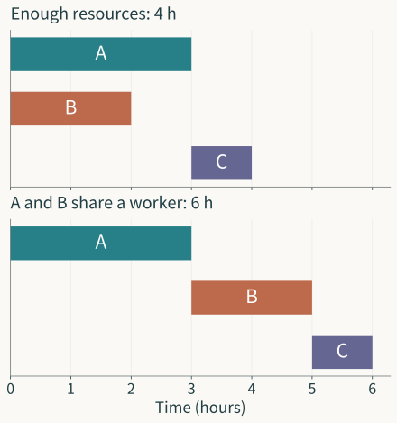

Asking whether a model gives accurate results often comes quite late. Earlier decisions concern what to treat as an object, which relations to retain, which changes to regard as equivalent, and what to read from the results. Some decisions appear explicitly in definitions; others hide in familiar phrases. “Total task duration” sets aside parallelism and precedence. “Current state” carries an expectation that present quantities can account for the effects of the past. “The model is stable” still requires us to identify what is perturbed, in which space it is compared, and what degree of stability matters.

Mathematical understanding begins here. It gives intertwined relations forms in which they can be distinguished, connected, and reasoned about. An arrow in a graph, an “or” in a constraint, a weight in a probability law, and the maps admitted by a space all participate in forming the problem. The same numbers in different relations can produce different answers; different observations of the same phenomenon can also pose different questions. Understanding how these changes arise lets us assess where a formulation has power and where it needs development.

Formalization therefore works in two directions. We discern relations in a situation and construct mathematical objects. Once those constructions acquire content, they can expose limitations in the original question. A proof that fails may reveal a missing condition. A quantity that unexpectedly remains unchanged by reordering may have discarded the difference we wanted to study. Further questions can emerge from such difficulties or successes. Mathematical constructions can also generate worthwhile questions internally, and connect with science or engineering afterward.

This essay begins with a small scheduling problem and develops the relations among objects, observation, information, and language. Graphs, constraints, histories, probability, quotients, and lifting will each enter with something to do. Along these constructions, we will establish three views between which we can repeatedly move: opening a model to examine its contents; selecting a boundary to study how it joins a larger whole; and returning to its use to trace the grounds of an engineering judgment. This is the entry into the *Models and Engineering* series.

## One Schedule, Two Answers

Consider three tasks, A, B, and C, lasting three hours, two hours, and one hour. A and B are preparation tasks; C can begin only after both finish. Durations are fixed, tasks cannot be interrupted after they start, and scheduling begins at time zero. The resources required for C are available once preparation is complete. To make the relations clear, we temporarily set aside extra time for transport, missing materials, and tool changes. The numbers and conditions form a mathematical construction.

If two workers can perform A and B separately, let both start at once. B finishes at hour two, A at hour three, and C follows, finishing at hour four. If A and B require the same worker, they must run in sequence: preparation takes five hours and C another hour, so completion cannot occur before hour six. Total task duration remains six hours, while minimum project completion time changes with the resource relation.

Total duration retains the amount of work. Completion time also depends on how tasks follow one another and which can overlap. Both quantities can be useful. If one worker performs all the work, the workload supplies one time bound; with ample resources, parallel work requires that bound to be reconsidered. We first need to make clear the relation each quantity records.

*Original schedule chart. A and B run in parallel above and share a worker below; C starts after both finish.*

Represent the tasks by three vertices, with arrows A→C and B→C. An arrow means that its source must finish before its target starts. Precedence now has a graph form: C has two prerequisites, while A and B have no precedence relation. We can check which tasks must wait, which lack that constraint, and trace longer dependencies along the arrows.

Yet the absence of precedence permits many schedules. A and B may run together, or sequentially because they compete for a resource. The graph retains prerequisites without recording every execution condition. This choice is useful for the ample-resource question; the one-worker question needs resource relations to enter the object too. Assessment of a formulation begins with whether it supports the intended reasoning.

Write a candidate schedule as start times $s=(s_A,s_B,s_C)$, with durations $p_A=3,p_B=2,p_C=1$. Times are measured in hours and $s_i\geq0$. Precedence requires

$$
s_C\geq s_A+3,\qquad s_C\geq s_B+2.
$$

Substituting a schedule checks whether it respects those dependencies. $(0,0,3)$ is admissible; $(0,0,2)$ starts C before A finishes. The question of how work can be arranged now has a definite candidate object and a checking relation. Project completion is the latest task finish:

$$
F_p(s)=\max_{i\in\{A,B,C\}}(s_i+p_i).
$$

For the fixed durations, we minimize $F_p(s)$ over admissible schedules. The choice object, feasibility conditions, and comparison rule are connected. A dependency graph alone does not determine the objective; an objective alone does not say which schedules enter the comparison. The optimization problem acquires its content when these relations meet.

When A and B share a worker, their occupied time intervals must not overlap. Use half-open intervals $[s_i,s_i+p_i)$ so that one task can start immediately when another ends. The additional condition is

$$
s_A+3\leq s_B
\quad\text{or}\quad
s_B+2\leq s_A.
$$

The “or” retains a choice. A before B and B before A are both permitted. Adding the arrow A→B would select an order on the scheduler’s behalf, shrinking the feasible set. It can describe a particular plan but no longer represents every permitted plan.

Because the preparation tasks cannot overlap, completing both takes at least five hours. C then requires another hour, so every admissible schedule takes at least six. $(0,3,5)$ attains this bound, as does $(2,0,5)$. Unavoidable restrictions supply a lower bound and a construction an upper bound; their agreement establishes optimality.

The two schedules still have different processes. B finishes at hour five in the first and hour two in the second. That difference matters if preparation item B can be delivered separately; if we care only about total project completion, both schedules are optimal for that objective. Further comparison needs an appropriate observation or preference. An optimal numerical result does not retain what never entered that number.

## From an Example to a Family of Objects

The three-task answer is easy to calculate, but formalization offers more than these three numbers. Once dependencies have a graph representation, we can ask which class of graphs has its minimum completion time determined by the longest dependency chain. The question moves from an instance to a family: under what conditions does a relation hold generally?

Let the task set $V$ be finite and nonempty, with dependencies forming a directed acyclic graph $G=(V,E)$. Each task has fixed duration $p_i\geq0$ and start time $s_i\geq0$. If $(j,i)\in E$, require $s_i\geq s_j+p_j$. Tasks execute without interruption; resources are sufficient for every task to begin as soon as its prerequisites are satisfied.

Acyclicity has a specific job. It allows tasks to be processed in topological order, with every prerequisite processed before its dependent task. A finite acyclic graph has a vertex with no incoming edge: otherwise, repeatedly following predecessors from any vertex would revisit a vertex in the finite graph, producing a directed cycle. Remove that vertex and repeat to obtain the required order. This also explains why the recursion below can start and finish.

Take any dependency path $P=(i_1,\ldots,i_k)$. Its tasks must finish in sequence. Since starts are nonnegative, project duration is at least their summed durations. Count a single vertex as a path too. Thus

$$
L(G,p)=\max_{\text{directed paths }P}\sum_{i\in P}p_i
$$

is a lower bound for every admissible schedule. A finite acyclic graph has finitely many paths, so the maximum exists. Strictly positive durations are unnecessary; zero-duration tasks are included.

Next construct a schedule attaining the bound. In topological order, calculate task finish times:

$$
f_i=p_i+\max_{j:(j,i)\in E}f_j,
\qquad
s_i=f_i-p_i.
$$

For a task without predecessors, take the maximum as zero. Each task starts after all its prerequisites finish; ample resources make these starts jointly achievable. The candidate schedule is therefore admissible.

We must still show that it attains $L$. Induct along the topological order. With no predecessor, the only path ending at $i$ is that vertex, with duration $p_i=f_i$. With predecessors, every longer path ending at $i$ consists of a path ending at a predecessor followed by $i$. Taking the largest predecessor finish and adding $p_i$ gives precisely the longest path duration ending at $i$. The maximum finish across all tasks is therefore $L$.

We have proved that, under these conditions, minimum completion time equals the longest dependency-path duration. The proof’s halves do different work. Path constraints hold for every admissible schedule and supply a lower bound; recursion constructs an admissible schedule and proves attainability. Once a recursion is written, we still need to explain why it is admissible, what it calculates, and why it reaches the bound. The algorithm’s form and the grounds of optimality are thereby connected.

Return to the three-task example with a shared worker. The longest path remains four hours and remains a lower bound, because resource sharing removes no dependencies. But the recursion attaining four starts A and B together, violating the new resource constraint. What changed is the construction’s feasibility. The lower-bound half survives; the attainability half loses a condition.

This distinction is useful. When something fails, we can preserve a valid conclusion and revise the affected step. Discarding the whole result loses a useful lower bound. Merely changing the final number without changing the construction’s conditions leaves the new answer unsupported. The proof itself helps locate where the formulation must change.

Different task interpretations can also change the graph’s content. If two tasks each require the other to finish before starting and either has positive duration, they cannot finish under these rules. If all durations on a cycle are zero, simultaneous completion constraints may have a solution. A directed cycle and impossibility under every condition are therefore distinct. Acyclicity establishes a uniform recursion and optimality result for the stated family; changing execution semantics calls for studying the corresponding object again.

## How Feasible Sets Generate New Questions

With resource restrictions added, we can set some aside and solve an easier problem. Let $\mathcal F_{\mathrm{res}}$ be the feasible set with shared resources and $\mathcal F_{\mathrm{dep}}$ the set retaining only dependencies. Every resource-feasible schedule respects dependencies, so

$$
\mathcal F_{\mathrm{res}}\subseteq\mathcal F_{\mathrm{dep}}.
$$

Expanding the candidate set under the same objective $F_p$ cannot raise its infimum:

$$
\inf_{s\in\mathcal F_{\mathrm{dep}}}F_p(s)
\leq
\inf_{s\in\mathcal F_{\mathrm{res}}}F_p(s).
$$

An infimum accommodates cases where attainment has not yet been proved. In our finite-task constructions, schedules attaining the optimum have been supplied, so we can write a minimum. The notation also retains how far the reasoning has reached.

For the three-task example, the relaxed value is four and the resource-constrained value six. The shared worker’s five hours of preparation supplies a stronger six-hour lower bound after including C, matching a feasible schedule. In a larger problem, a bound need not meet the best schedule found. Their gap becomes a further object of inquiry.

Suppose a feasible ten-hour schedule has been found and every schedule has been proved to require at least eight hours. The current schedule is then at most two hours from optimal. This follows directly from the bounds without knowing the true optimum. Finding a nine-hour schedule or raising the lower bound to nine produces definite progress: the former improves feasibility, the latter strengthens necessity. These routes can work independently and eventually meet.

We can now ask which resource constraints leave the optimum unchanged when removed, how to tell whether a new constraint restricts the objective, or how resource counts affect duration for the same graph. These questions arise from relations among the objects and go beyond the original three tasks. Mathematical construction has given them inferential content.

Adding a condition and changing the problem also need distinction. Adding resource constraints in the same schedule space shrinks the feasible set, usually preserving old lower bounds through inclusion. Changing interruption rules, completion-time definitions, or objective ordering at the same time may remove that inclusion relation. Confirming the objects before comparing them lets the order relation support the conclusion.

A new formulation may leave computation no faster while opening another direction of inquiry. Bounds, symmetry, boundaries, feasible changes, and sensitivity of the optimum are possible directions. Once the problem takes mathematical form, mathematical constructions themselves participate in posing questions. The original use can return to assess which directions deserve further work.

## Before Comparing, Specify the Observation

A relation can retain much content even when we read only one quantity from it. The two six-hour schedules have the same project completion time but different delivery times for B. They agree under one observation and differ under another. “Does it have an effect?” therefore needs completion: an effect on which observation?

Write the schedule space as $\mathcal S$ and an observation as a map $q:\mathcal S\to\mathcal Y$. For example, $q(s)=F_p(s)$ records project duration, while $q_B(s)=s_B+p_B$ records B’s completion. For schedules $s,s'$, we can ask whether $q(s)=q(s')$ or, in a numerical codomain, compare differences, ratios, or order. A difference acquires definite meaning when the observation space and comparison rule are specified.

An observation may instead be several quantities, a trajectory, or a probability law. Simultaneous worker occupancy requires a function of time; delay risk across repeated executions requires an event and its probability. Compressing these into mean completion time prevents some questions from being answered. Compression can serve the present judgment, but the information retained must support that judgment.

A simple transmission construction makes this clear. Consider a scalar cascade under fixed conditions, where the input is successively multiplied by $H_1,\ldots,H_n$. The cumulative response factor at stage $j$ is

$$
T_j=H_jH_{j-1}\cdots H_1.
$$

If we observe only $T_n$, reordering the scalar factors leaves it unchanged, by commutativity. The two-stage sequences $(2,\tfrac12)$ and $(\tfrac12,2)$ both have terminal factor one. If we observe the largest cumulative amplification along the cascade, $\max_{1\leq j\leq n}|T_j|$, the values are two and one. The first observation retains the total product; the second also follows its prefixes.

The question of whether order matters can therefore have two definite answers: it does not affect the terminal factor in this construction, and it affects maximum amplification along the way. The original invariance deserves preservation. If the scientific concern was the terminal response, switching to prefixes changes the question; if it was intermediate loading, the terminal quantity may omit needed content. Reasoning distinguishes these cases and prevents a silent change of comparison merely to produce a desired difference.

For matrices or operators, multiplication may also be noncommutative. Input and output spaces, operation domains, and norms must then be specified before assessing order effects. A proof for scalars cannot be extended to every linear system by keeping the letter $H$. A change of object kind requires checking the structure the proof uses.

Such checks make research questions more specific. A parameter’s “effect on the system” can mean a local change under the same conditions, an average across a population of conditions, or a worst-case boundary. Fixed conditions, the population and its weights, allowed variations, and observations define different questions. Derivatives, probability, optimization, and operators enter to handle these distinguished relations.

## From a Current Reading to State and History

In scheduling, durations are given parameters and start times are choices. During execution, completed tasks and occupied resources form a changing state. They can appear in one table while doing different jobs. Parameters select an instance of the family; inputs bring external change; actions are chosen by a policy; state organizes subsequent evolution. Distinguishing these roles clarifies what changing a quantity actually changes.

State and observation particularly need examination. Being readable does not automatically qualify a quantity to organize future evolution. Consider a finite deterministic system with internal states $X=\{a,b,c\}$ and one-step evolution $T:X\to X$:

$$
T(a)=c,\qquad T(b)=b,\qquad T(c)=c.
$$

A display shows zero or one through $\pi:X\to Y=\{0,1\}$, with $\pi(a)=\pi(b)=0,\ \pi(c)=1$. A current zero can mean internal state a or b. From a, the next reading is one; from b, it remains zero. The same present observation permits different futures.

To define a deterministic evolution $g:Y\to Y$ directly on readings, we require

$$
\pi\circ T=g\circ\pi.
$$

The left side evolves the internal state and then observes it. The right side observes first and then evolves the observation. Their agreement lets the observation carry this deterministic dynamics. Our construction cannot satisfy it: a requires $g(0)=1$, while b requires $g(0)=0$.

The failure also supplies a general criterion. For any set X, deterministic evolution T, and observation map onto its image $Y=\pi(X)$, such a g exists if and only if

$$
\pi(x)=\pi(x')
\ \Longrightarrow\
\pi(Tx)=\pi(Tx')
\qquad\text{for all }x,x'\in X.
$$

Necessity follows by applying the same g to the common observation. For sufficiency, construct it: for a given y, take any internal state with $\pi(x)=y$ and define $g(y)=\pi(Tx)$. The condition ensures that another representative gives the same value. This proves both directions.

The small counterexample yields a reusable insight. An operation descends to a compressed object only if objects identified by the compression remain identified after the operation. That is a different test from whether a reading looks sufficiently detailed. The difficulty concerns compatibility between operation and observation.

We could instead give zero two allowed successors, replacing the function by the relation $R=\{(0,0),(0,1),(1,1)\}$. This records one-step possibilities, but repeated composition creates another problem. The relation permits $0\to0\to1$, whereas the internal system admits no such observation trace: starting from a reaches one immediately, and starting from b remains zero forever. Connecting separate possibilities has lost the internal identity that rules out some histories.

Replacing a function by a relation therefore also needs an account of preserved content. It may overapproximate external behavior and help establish properties that remain true for the enlarged behavior. Exact preservation of full histories needs further structure. The language adds expressive capability along with proof obligations.

How to supply that structure depends on the question. We can retain the distinction between a and b, include relevant observation history in the state, or, when probability assumptions are available, maintain a conditional distribution over hidden states. Here, two consecutive zero readings identify b. An initial zero followed by another zero contains information absent from a single current zero. History has a definite inferential benefit.

The allowed initial domain also matters. If only b and c are allowed, the reading is sufficient: $g(0)=0,g(1)=1$ closes the dynamics. Whether an observation can serve as state thus depends on the study domain. Adding a removes a condition of the earlier result; without that expansion, the simpler state remains usable.

Moving from state to history, function to relation, or a point to a conditional distribution changes the mathematical object kind. We need not preserve every detail of the past or introduce probability at every difficulty. What matters is retaining the relations subsequent reasoning uses. Construction and proof determine which compression is sufficient.

## Unknown Durations and the Time of Decision

Uncertainty can change the object too. When durations are unknown before work starts, are start times fixed numbers announced beforehand, or decisions made during execution from completion observations? Both fit the everyday word “schedule,” with different mathematical content.

Again let preparation tasks A and B share one worker, with C taking one hour after both finish and its resources then available. Durations now have two possibilities:

$$
\mathcal P=\{(p_A,p_B,p_C)=(1,3,1),(3,1,1)\}.
$$

Both have total duration five hours. Starts remain nonnegative, execution uninterrupted, shared-resource intervals nonoverlapping, and dependencies enforced. We compare guaranteed completion over the same possibilities.

First announce fixed start times valid for both. If A precedes B, B must wait for A’s longest duration, giving $s_B\geq s_A+3$. In the other case, where A takes one hour and B three, the announced start for B remains unchanged. B finishes no earlier than hour six and C requires another hour. Worst-case completion is therefore at least seven. The argument is symmetric if B precedes A. $(s_A,s_B,s_C)=(0,3,6)$ is valid in both cases and finishes at hour seven, so the best fixed schedule guarantees seven hours.

Now allow completion observations. Execute A, start B as soon as A finishes, and start C as soon as B finishes. The resulting starts are $s_A=0,\ s_B=p_A,\ s_C=p_A+p_B=4$. Writing the result using durations does not mean execution knows them in advance: it waits for events that have already occurred. Starting B requires no advance knowledge of how long B will take. This is a history-dependent policy.

It finishes at hour five in both cases. The shared worker must execute four hours of preparation and C then needs another hour, so five is also a lower bound. Allowing action to respond to available information improves the worst-case guarantee from seven to five. The difference comes from the admitted decision object and its information conditions.

Let $\Phi(s,p)$ mean that schedule s is admissible for durations p and finishes by deadline D. The fixed-schedule commitment is

$$
\exists s\ \forall p\in\mathcal P:\ \Phi(s,p).
$$

If all durations are revealed before scheduling, the commitment becomes

$$
\forall p\in\mathcal P\ \exists s:\ \Phi(s,p).
$$

The first implies the second. In the reverse direction, different durations may use different schedules, supplying no common fixed schedule. With $D=5$, the second holds and the first fails. Calculation has now established a strict distinction and grounded the quantifier order in concrete tasks.

An online policy has another information condition. Let $h_t$ be the observations and actions available up to time t, from which the policy chooses its next action. Nonanticipation requires two possible situations with the same available history up to t to produce the same decision at that time. It makes the restriction to currently available information checkable.

“A good plan exists in every case” does not imply this condition can be met. Construct a one-shot choice: at time zero, select device L or R, with a one-hour deadline. There are two environments, in which only L or only R respectively can finish on time. Before selection, the information is identical, and no switching or retry is possible. Every environment has a successful choice, but a nonanticipating policy must choose the same device on the shared initial history. It cannot guarantee success in both.

This construction complements the completion-event policy. In the earlier example, information arrives before subsequent choices and suffices to adjust start times. Here, the choice must be made first and the needed distinction arrives too late. What feedback-based scheduling can accomplish depends on its content, arrival time, and the actions still available.

Randomization permits another commitment. The environment is fixed before the choice, and the draw is independent of it. Without an environment probability, choose L with probability q and R with $1-q$. Success probabilities in the two environments are q and $1-q$. Worst-case success is $\min(q,1-q)$, at most one half, attained by equal probabilities. Randomization establishes a risk-based result without establishing certain success in every environment.

Uncertainty thus introduces several relations: which situations are possible, whether they have probability weights, when they are observed, whether action can change, and whether comparison concerns worst outcome, mean outcome, or success probability. Mean durations answer the scheduling question for those numbers; a policy incorporates the succession of information and action. Mathematical language lets these commitments be stated separately and their implications established individually.

## How Mathematical Languages Organize the Relations

The mathematics so far goes beyond assigning values to letters. Graphs supply vertices, edges, paths, and recursion; constraints supply admissible schedules and set inclusion; observation supplies maps and comparisons; histories and policies bring the order of information into action. Each language provides objects, constructions, and reasoning grounded in its structures.

“Mathematical language” has two connected uses here. A formal language can specify symbols, types, and interpretation, including which operations act on which objects and which expressions are propositions. A broader theoretical language includes graphs, spaces, measures, operators, dynamics, and variation as ways of organizing inquiry. Choosing one still requires specifying the objects and operations it introduces and what it enables us to prove.

A directed edge and an inequality can express the same precedence relation while offering different structures for work. A graph allows tracing paths, distinguishing cycles, and topological recursion. Inequalities can join time windows and resource conditions in a common schedule space. An interpretable correspondence allows switching when useful. We must identify what survives the conversion and why the new operations are valid.

The shared-worker “or” also yields a geometric understanding. Fixing A before B combines nonnegative starts, dependencies, and $s_A+3\leq s_B$ into a region defined by linear inequalities. Fixing B before A yields another. Within each region, convex combinations of admissible schedules remain admissible because linear inequalities are preserved. The feasible set allowing both orders is their union.

The union need not share that property. The optimal schedules $s=(0,3,5)$ and $s'=(2,0,5)$ are admissible, but their average $(1,1.5,5)$ overlaps A and B. Averaging plans has not produced an executable compromise. Geometry identifies a particular difficulty: continuous variation within a region and changes between orders need different treatment.

Start-time differences show the separation directly. For admissibility, $\delta=s_B-s_A$ must satisfy $\delta\geq3$ or $\delta\leq-2$. A continuous change from an A-first to a B-first schedule must pass through excluded intermediate differences. Under the current execution rules, that transition cannot remain feasible.

We can therefore choose a discrete order first and schedule continuous time within its region. The division follows from the problem structure. Allowing interruption or adding a worker may change the regions and their connections, forming another class of objects. Geometry clarifies feasible changes and barriers.

Probability handles another relation. The two durations were allowed situations, each subject to a deadline guarantee. Supplying their probabilities permits mean completion, quantiles, or exceedance probabilities. The allowed set records which situations can occur; weights determine how they are aggregated. The same possibilities under different laws can produce different average judgments.

For example, let losses in two cases be zero and ten. With probabilities 0.9 and 0.1, mean loss is one; with equal probabilities it is five. Both models allow the same loss values but assign different weights. Using trial frequencies as weights also requires checking how samples were obtained and which population they represent. The next essay develops that empirical relation; the calculation already shows that a mean needs its probability law.

Operators let transmission of change become an object of study. The scalar cascade retains multiplication at each stage. Vector or function spaces can additionally expose directions, norms, domains, and cumulative effects. Local perturbations, terminal responses, and intermediate responses can be defined separately. A space that organizes scattered effects into a comparable map adds inferential capability.

These languages can work together. A policy acts on history; history obeys dynamics; state may carry a probability law; performance receives a value through observation or an objective. Real dependencies determine the needed structure. We need not begin with identical symbols for every problem: form an object that supports the present operation, then let reasoning reveal what needs addition.

Conversely, fixing a language too early also makes choices for the problem. Writing every relation as a directed function expects a unique output for each input. Writing every object as a feasible set sets aside weights. Measuring every change by Euclidean distance expects coordinate differences to be aggregated that way. The choices may fit or need revision. Their consequences guide judgment: which useful inference becomes possible and which important relation loses expression?

## Symmetry, Quotients, and Structure That Must Survive

Degrees of freedom also depend on identity criteria. Tasks may have different names while their resource and dependency structures are symmetric. If that symmetry does not affect the observation of interest, we can study fewer representatives or their equivalence classes.

Take a new three-task problem with $p_A=p_B=2,p_C=1$, the same dependencies A→C and B→C, and a shared worker for A and B. Swapping A and B preserves durations, dependencies, and resource requirements. The schedules $(0,2,4)$ and $(2,0,4)$ correspond under this swap and both finish in five hours.

Let $\sigma$ be a permutation of tasks preserving durations, dependencies, and resource relations. Its action transfers each task’s start to the corresponding task: $(\sigma\cdot s)_{\sigma(i)}=s_i$. Substitution in the constraints shows that admissible schedules map to admissible schedules. Because durations are also preserved, finish times are merely permuted and their maximum is unchanged. The symmetry preserves both feasibility and the objective.

We can identify schedules connected by these structure-preserving permutations and study the quotient of the schedule space. The discarded distinction is one of names that the present structure and observation cannot distinguish. If A actually requires a different qualification, or we also observe its separate delivery time, the swap can lose its conditions. The new comparison must retain that difference.

Renaming and an admissible symmetry transformation are therefore not always the same. Renaming symbols while transferring their entire meaning usually changes presentation alone. Once an interpretation is fixed, moving only some objects requires checking structure preservation. This grounds the quotient and gives “redundancy” a precise address.

The observation-closure criterion applies here. An operation on equivalence classes must give the same class when a different representative is chosen. Preserving an objective lets that objective descend to the quotient; descending evolution, training, or composition requires checking each operation. An equivalence that compresses evaluation need not compress all dynamics.

Relations between “large” and “small” objects thus involve more than variable counts. The smaller object may preserve the required reasoning or discard structure needed later. Two parameter points realizing one function provide an important entry into learning systems. Function behavior, representation formation, and continued training may require different content. Essay III opens these identity relations; Essay IV studies their changes under training and scale.

## How a Construction Forces a Language to Develop

Quotients compress objects, while lifting may add levels. Both can have sound mathematical grounds. When a comparison regards paths as close but the desired operation still separates them substantially, we must examine which information that comparison has set aside.

Consider smooth planar paths on $t\in[0,2\pi]$, with positive integer n:

$$
x_n(t)=\frac{1}{\sqrt n}
\bigl(\cos(nt)-1,\ \sin(nt)\bigr).
$$

Each starts and ends at the origin, circling n times with radius $1/\sqrt n$. Its uniform norm relative to the zero path satisfies

$$
\sup_{t\in[0,2\pi]}|x_n(t)|\leq\frac{2}{\sqrt n}\longrightarrow0.
$$

Under maximum position difference, the paths approach rest at the origin. Yet the integral between their coordinates is

$$
\begin{aligned}
I(x_n)
&=\int_0^{2\pi}x_n^1(t)\,dx_n^2(t)\\
&=\int_0^{2\pi}(\cos nt-1)\cos nt\,dt
=\pi.
\end{aligned}
$$

Here $dx_n^2(t)=\sqrt n\cos(nt)\,dt$. Integer n gives complete cosine periods: the cosine integral is zero and the squared-cosine integral $\pi$. The zero path has integral zero. Uniform convergence has not preserved this operation.

Small position changes and accumulated interaction have different scales. The circle shrinks as rotation and repetition increase. Speed has magnitude $\sqrt n$ and total variation $2\pi\sqrt n$: total movement does not shrink with position amplitude. Position comparison retains the visible smallness; the integral also uses how the path was traversed.

The construction establishes an impossibility: no functional on all continuous planar paths can be continuous in the uniform norm and agree with this integral on every smooth path. Such an extension would require the integrals of smooth $x_n$ converging uniformly to zero to converge to zero, contradicting their constant value $\pi$. A particular curve has led to a question about compatibility between an operation and a topology.

Improving position approximation alone cannot resolve the difficulty. We can restrict allowed path variation, strengthen comparison, or include the interaction level the integral needs. These choices generate different questions: on which path class is the operation continuous, which stronger distance suffices, and which structural relations must an added level satisfy?

For a smooth path, first define an interval interaction:

$$
A_{s,t}(x)
=\int_s^t\bigl(x^1(r)-x^1(s)\bigr)\,dx^2(r).
$$

Split at $s<u<t$, separating the second interval’s $x^1(r)-x^1(s)$ into $x^1(r)-x^1(u)$ and $x^1(u)-x^1(s)$. This gives

$$
A_{s,t}
=A_{s,u}+A_{u,t}
+\bigl(x^1(u)-x^1(s)\bigr)
 \bigl(x^2(t)-x^2(u)\bigr).
$$

The added interaction has a provable concatenation relation. It is connected to the original path’s increments and constrains how intervals compose. Lifting thereby acquires content: the object retains position increments and a second-order interaction, with admissibility constrained by their relation.

Rough path theory systematically develops this idea, using paths and iterated increments to form enhanced objects with algebraic relations, regularity, and comparison scales.[^rough] Smooth curves and ordinary integration have already exposed the missing relation in our example. Studying stability of more general integrals or driven equations calls for appropriate conditions and proofs on the enhanced objects.

Here, construction actively changes the question. We began by asking whether nearby paths have nearby integrals. A counterexample revealed the limits of uniform comparison, leading to continuous extension, regularity, enhancement, and composition questions. These have mathematical content of their own and can also matter for systems driven by rapidly oscillating signals. Returning to an application requires checking whether the actual objects and observations retain this mechanism.

## Different Scopes of Revision

“Revising a model” now involves several kinds of work. Changed durations, changed observations, added states, and language development can all revise our understanding. Locating the scope helps preserve valid results and recheck the relations actually affected.

One scope concerns instances and assumptions. With ample resources, changing a duration from three to four hours leaves the tasks and dependencies in place; the longest-path recursion still applies, while its value changes. Moving from ample to constrained resources changes a theorem condition: the path bound remains and the attaining construction must be rebuilt. Parameters, conditions, and initial situations need identification so subsequent conclusions have an address.

Another scope concerns representation and observation. Observe B’s delivery instead of project completion, maximum prefix amplification instead of the terminal factor, or a reading that distinguishes a and b. These changes can supply needed information while changing criteria of agreement. A new comparison needs its own definition; its success cannot retroactively establish success under the old comparison.

Representation changes can also be invertible. Converting start times from hours to minutes, together with durations, deadlines, and all related quantities, provides a correspondence preserving order and feasibility. Multiplying one number by sixty while leaving other units untouched changes the conditions. Even familiar conversion requires preserving the relations in use.

A third scope changes object kind or construction. Moving from fixed starts to policies, readings to histories, or ordinary paths to paths with an interaction level adds content the old object could not carry. Admitted operations, equality criteria, and proof methods may then change. Affected definitions and inferences need checking, with an explanation of how the old object becomes a special case, projection, or restricted part of the new one.

Policies illustrate this change. They do more than enlarge a list of duration parameters: they make choosing after observation into an object. A fixed schedule is a special policy that ignores history; a choice with complete advance knowledge need not be nonanticipating. The relations are explicit, and the seven-hour and five-hour results retain their respective positions.

A fourth scope concerns language and theoretical organization. Where functions inadequately organize compatibility, behaviors and constraints make joint satisfaction, no solutions, multiple solutions, and hidden variables objects of inquiry. Where uniform path comparison fails to preserve integration, enhanced objects and new comparison structures enter. The change involves object classes, operations, and routes for transferring conclusions as well as parameters.

These scopes have no prescribed ranking. An empirical discrepancy may require parameter estimation or reveal missing state. A mathematical counterexample may motivate changing topology or support an impossibility result. A more general theory can organize relations economically or add burdens the present question does not need. Revision earns its grounds through substantive benefit.

That benefit can be made specific: an operation previously undefined becomes well defined; failed reasoning succeeds under clear conditions; a compressed distinction re-enters observation; or a commitment is proved unattainable with available information. Each leaves something that research, sampling, implementation, or judgment can use next.

## Open the Model, Select a Boundary, Trace Its Use

These constructions suggest a fuller organization. An object can be studied through its interior, boundary, and use, with movement between these views as scale changes. Relations need to remain traceable while particular semantics are retained for each object kind.

The **internal view** asks what is inside the model. The dependency graph, nonoverlap formulas, and objective are presentations; admissible schedules and their comparison rules give the mathematical content under a selected interpretation. Types and domains determine what symbols can do, interpretation determines the relations they express, and observation determines what is read from those contents. A family, a fixed instance, and a single result each have a place.

This also distinguishes uses of “model.” A model of a formal theory is a structure satisfying its language and axioms. A dynamical system can organize its mathematical content through evolution or allowed histories. An empirical model additionally needs a representation relation to its actual reference. Existence of a solution, satisfaction of axioms, and adequacy for an empirical phenomenon answer different questions.

Internal comparison has several entries. Different notation may preserve full semantics; compressing admissible schedules to an optimum preserves a particular observation. Moving from possible outcomes to a probability law adds weights, and from an output function to a stateful program adds interaction and effects. Comparison first identifies objects and identity criteria, then examines preserved structure. Essay III develops these relations fully.

The **open-component view** selects a boundary for a use. A scheduling tool’s boundary may include task and resource data, an output schedule, update times, and error returns. A dynamic device may also expose measurements, actions, clocks, protocols, and required capabilities. How the internal mathematical object produces behavior at these ports becomes the starting point for interconnection.

With a boundary selected, wiring adds shared constraints to local objects. The local scalar relations $y=u$ and $u=y+r$ can each be evaluated in one direction. Connecting them requires $r=0$. For $r\neq0$ there is no solution; for $r=0$ infinitely many pairs $(u,y)$ exist. Correct local evaluation has not determined existence or uniqueness of a global result.

Organizing interconnection through joint satisfaction makes compatibility, hidden variables, and external observations explicit questions. Temporal objects additionally require history, causality, and feedback well-posedness. Probabilistic components retain laws or kernels; sets of possible values cannot replace comparisons of risk and dependence.

Components can also carry conditional commitments: which environmental assumptions enable which guarantees, and who discharges those assumptions after wiring. In replacement, matching port types is a beginning; timing, protocols, effects, and admissible contexts can all affect global properties. Essay V develops wiring, hiding, contract closure, and contextual substitution.

The **engineering-relation view** asks how these objects and results support a use or decision. It connects purpose and decision $P$, reference object $W$, observations and provenance $Z$, semantic model $M$, requirements $S$, operational criterion $J$, computational artifact $C$, operated system $O$, addressed evidence $Q$, and changes with their impacts $L$.

Using a schedule model to support an actual delivery first requires task boundaries, resource conditions, duration provenance, admissible schedules, deadlines, and other requirements. Minimizing project duration is an operational criterion. Safety or qualification requirements can separately constrain feasibility. Purpose, requirements, and criteria each express part of the decision.

An algorithm, code, and computational resources then realize the model. The result may inform a person’s offline decision or enter a real-time system. Producing a mathematically feasible schedule, producing it on time, and achieving delivery in actual execution require different relations. If computational delay makes the schedule obsolete before release, a correct optimum cannot directly support the operational commitment.

Evidence consequently has an address: which claim, object, use, domain, and version does which method support? The scheduling theorem establishes optimality in the ample-resource family; code tests support specified computational behavior; duration measurements and execution records support empirical and operational relations. Combining evidence requires matching objects and conditions. “The model was validated” cannot discharge all these relations.

Version changes make the distinction clearer. New duration data may change an instance; a new solver may change a computational artifact; an update-time change may change an operational object; a new use may change requirements and observations. They need not change together. Essay VI develops this responsibility map, offline and online paths, evidence, and updates.

The three views can recurse. Studying a composite system’s use adopts the engineering view. Opening a component to explain failure returns to its interior. Replacing it requires its open boundary and contexts. At each scale, objects of comparison must be identified and proofs and evidence must follow that boundary.

| Relation to identify | Useful entry | Starting point established here |
|---|---|---|
| Contents and criteria of identity | Internal semantics | Graphs, constraints, observations, states, enhanced paths |
| How local objects form a whole | Open components | Wiring compatibility, time, conditional commitments |
| How results support actual decisions | Engineering relations | Use, data, requirements, computation, operation, evidence |

The table supplies directions of entry. A mathematical construction can develop internally; offline analysis can return to a decision through results and evidence; operational feedback can reopen state and observation. Selecting the roles needed by the actual relations keeps the understanding economical and sufficient.

## Returning Mathematical Understanding to Practice

Mathematical progress can occur in different places. The longest-path proof gives a family of schedules an exact answer. Observation closure reveals missing state information. The seven-hour versus five-hour result puts information into commitments. The integral counterexample motivates different objects and comparisons. Each changes what can be known, proved, or designed.

Returning to an actual situation also requires giving those changes empirical content. Duration provenance, uninterrupted execution under current conditions, worker capabilities, and whether measurement and logs retain the decision-relevant times all affect whether the model supports its use. Construction has shown why the relations matter; their actual validity needs corresponding grounds.

Practice can also change the question. A shortest-duration goal may reveal new burdens from concentrating tasks on one worker. Mean delay may cease to be the central concern after a serious overrun, bringing worst-case risk forward. Mathematics can show how requirements change feasible sets and outcomes; relevant participants must still form judgments about purpose and costs. As a new purpose enters the model, reasoning and evidence need reconnecting.

Mature mathematical understanding therefore allows problems to develop. It can explain where the old formulation achieved something, where it encountered difficulty, what capability new structure adds, and which results survive. Successful calculations and substantive counterexamples both contribute. Formalization gives changes explicit objects and grounds for subsequent revision.

We have moved from three tasks to graphs, feasible sets, observations, histories, policies, quotients, and enhanced paths. Every new object has a particular relation to carry. Next we trace how those mathematical objects connect with actual observation, equipment, and data: how a formal relation earns grounds for representing an empirical object, and how feedback changes it. Essay II enters this work through a tank.

[^rough]: Peter K. Friz and Martin Hairer, *A Course on Rough Paths: With an Introduction to Regularity Structures*, second edition, 2020. The author version updated on March 3, 2024, was reread at §2.1, printed pp. 16–18 (PDF pp. 30–32), Definitions 2.1 and 2.4 and adjacent discussion. It organizes a rough path through its path, second-order iterated increments, concatenation relation, and regularity. The oscillating-path and continuous-extension arguments here are direct calculations. See the [author manuscript](https://www.hairer.org/notes/RoughPaths.pdf).

---

**Models and Engineering: Six Core Essays**

1. [How Mathematics Forms Problems: Objects, Structure, and Language](/en/posts/mathematical-language-and-problems/)
2. [How a Tank Becomes a Model: Conservation, Measurement, and Identification](/en/posts/from-observation-to-model/)
3. [What a Model Retains: Presentation, Semantics, and Observation](/en/posts/inside-the-model/)
4. [When a Model Changes, Which Conclusions Survive?](/en/posts/model-transformations/)
5. [How a Model Becomes a Component: Wiring, Feedback, and Replacement](/en/posts/model-as-open-component/)
6. [From Models to Engineering Judgments: Operation, Evidence, and Updates](/en/posts/engineering-model-chain/)

The subsequent essays will be expanded into long-form versions in sequence.

Further reading: [How a Disturbance Travels Through a Traffic System](/en/posts/traffic-disturbance-local-propagation/).
