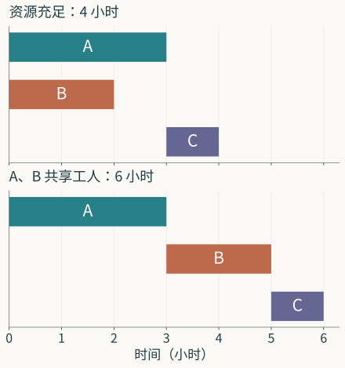

三项工作，分别要花三小时、两小时和一小时。把工时加起来，共六小时。若问这些工作什么时候能做完，六小时却未必是答案。

先把事情说清楚。A、B 是两项准备工作，C 是最后的装配；A、B 都完成，C 才能开始。暂且假定工时固定，工作开始后不中断，也没有搬运、等待材料等额外用时。这是为说明问题而构造的小例子。

如果有两名能分别完成 A、B 的工人，且 C 在准备完成后即可执行，他们可以同时开工。A 在第三小时完成，B 在第二小时完成，C 从第三小时开始，第四小时结束。如果 A、B 都必须由同一名工人完成，二者就得排队：无论先做哪项，准备工作都要花五小时，随后再做 C，共六小时。工作还是那三项，工时也未改变；改变的是谁能同时做什么。

这一点很小，却把问题的入口换了。工时总数记录了要做多少工作，完工时间还取决于工作怎样接续、哪些工作能够同时发生。要用数学回答后一个问题，得让这些关系也进入表达。

*原创时间图。上图资源充足，下图 A、B 共用一名工人；C 均在二者完成后开始。*

## 从工时总数到先后关系

可以先画三点，用 A、B、C 表示三项工作，再画两条箭头 A→C、B→C。箭头的意思是“前项完成，后项才能开始”。这样一来，原先一句话中的依赖关系有了可以检查的形状：C 有两个前提，A、B 之间没有先后要求。

图上的箭头并没有规定 A、B 一定同时做。它只规定 C 开始时，A、B 都已经完成。把“没有先后要求”读成“可以同时执行”，还需要工人、设备和材料等资源允许。两项工作争用同一个工人，恰是依赖图没有记录的另一种关系。

这一遗漏有时会被漂亮的图藏住。点都画了，箭头也很清楚，读者容易觉得对象已经表达完整。但图是否够用，要看拿它回答什么。问 C 依赖哪些工作，这张图已经能答；问只有一名工人时何时完工，还得补上资源条件。数学表达的充分与否，由要做的判断来检验。

先研究资源充足的情形。A 一开始就能做，而 C 必须等 A 的三小时，再做自己的这一小时。因此，整个项目至少要四小时。安排 A、B 同时开工，又确实可以在第四小时结束。下界和可行安排碰在一起，最短完工时间便确定为四小时。

这里用了两种不同的理由。“至少四小时”从任何安排都躲不开的依赖中推出；“四小时能做完”则由一份具体安排证成。只有前一个理由，还不知道四小时是否做得到；只有后一个理由，也不知道是否还可更快。一个说明不能低于哪里，一个说明可以达到哪里，二者相合才得到最优值。

## 让一份安排成为可以比较的对象

要比较安排，可以给每项工作一个开始时刻。记为 $s_A,s_B,s_C$，单位都是小时；三项工时分别为 $p_A=3,p_B=2,p_C=1$。从时刻零起安排工作，开始时刻不能为负。C 的两个前提写成

$$
s_C\ge s_A+3,\qquad s_C\ge s_B+2.
$$

两条不等式只把“做完才能接着做”说得更明确。一个候选安排是否满足依赖，如今可以代入检查。比如 $(s_A,s_B,s_C)=(0,0,3)$ 满足条件，而 $(0,0,2)$ 不满足第一条：它让 C 在 A 完成前开工。

完工时间也要说明取什么。对这三项工作，所有工作中最晚的结束时刻是

$$
F(s)=\max\{s_A+3,\ s_B+2,\ s_C+1\}.
$$

我们寻找满足上述条件、使 $F(s)$ 最小的开始时刻。选择量、必须遵守的关系和用来比较的数，至此才接到一起。三项工时之和仍是六，却不再被误当作所有安排共同的完工时间。

现在加入那一名共享工人。A、B 占用他的时间区间不能重叠。于是至少要满足两种次序中的一种：

$$
s_A+3\le s_B\quad\text{或}\quad s_B+2\le s_A.
$$

这个“或”很要紧。实际允许先 A 后 B，也允许先 B 后 A，建模时并没有理由替安排者预先选定。如果只画 A→B，图会表达一份已经决定次序的方案，却丢掉另一个本来合法的选择。看似增加了一条箭头，实则缩小了可供比较的安排。

A、B 不重叠，二者完成至少用五小时；C 又在二者之后花一小时，所以完工时间至少为六。安排 $(0,3,5)$ 达到六；安排 $(2,0,5)$ 也达到六。最短时间相同，过程却不同。这时若还要照顾某个工人的午间休息、尽早交付 B，或降低切换工具的次数，就有了继续比较两份安排的理由。

数学语言使这些区别能够留下来。它也会暴露一个常见的含混：“最优”究竟只比较最后的时间，还是还比较别的事情？若目标函数只记录 $F$，两份安排在这个目标下并列最优；额外偏好要么加入比较规则，要么明确留到下一轮选择。一个最优值不会替我们保管没有写进去的偏好。

## 图为什么在一类问题中已经够用

三项工作的答案可以直接算出。任务多了，仍可先问：依赖图在什么条件下足以给出最短完工时间？这个问题已经从一个安排，转向一类安排的结构。

设有至少一项、总数有限的任务，每项工作有固定的非负工时 $p_i$，所有依赖组成一张有向无环图。工作可以从零开始，资源足够，各项工作在依赖满足后都能立即执行。这里“无环”表示沿依赖箭头不会绕回自己。若 A 等 B，B 又等 A，并且二者都要求对方完成后才开始，原先这套执行规则就要重新考察；下面的构造用不到这样的图。

沿一条依赖路径上的工作必须依次执行；只含一项工作的路径也计入比较。若一条路径依次经过 $i_1,\ldots,i_m$，任何合法安排的完工时间都不小于这条路径的工时之和。因此所有路径中最长的工时和给出下界：

$$
L=\max_{\text{依赖路径 }P}\sum_{i\in P}p_i.
$$

接下来要找达到它的安排。无环图中的任务可以按一种顺序处理，使每项工作出现时，其前置工作都已处理。没有前置工作的任务从零开始；有前置工作的任务，在这些工作中最晚的完成时刻开始。若 $f_i$ 是工作 $i$ 的完成时刻，就逐项计算

$$
f_i=p_i+\max_{j\to i}f_j,
$$

没有前置工作时，把这里的最大值取为零。每一步都遵守依赖，又没有添加额外等待。通向 $i$ 的路径，由通向某个前置工作的路径再接上 $i$ 组成；递推正是在这些路径中选最长。因此 $f_i$ 等于以 $i$ 结尾的最长路径工时和，所有任务最晚的完成时刻就是 $L$。我们既有不能低于 $L$ 的理由，也构造了达到 $L$ 的安排。

这个结果说明，充足资源下的依赖调度，可以化为图上的最长路径问题。它的用处来自已说清的条件。回到共享工人的例子，图的最长路径仍为四，但最短完工时间变成六。最长路径继续给出下界，达到下界的构造却不再合法：它会让 A、B 同时占用同一名工人。

因此，失败也有明确的落点。依赖关系没有错，路径下界没有错；出问题的是让所有已满足依赖的任务立即开工这一步。资源争用使“依赖满足”和“现在可以执行”分开，原来的一种关系已经不足以组织全部选择。

## 改动表达，也会生出新的问题

共享工人的例子比充足资源的例子难处理，可以先暂时去掉资源限制。原本合法的安排，在限制放宽后仍然合法；另有一些原来做不到的安排进入了候选集合。把前者的可行集合记为 $\mathcal F_{\mathrm{限}}$，后者记为 $\mathcal F_{\mathrm{松}}$，便有

$$
\mathcal F_{\mathrm{限}}\subseteq\mathcal F_{\mathrm{松}},
\qquad
\min_{s\in\mathcal F_{\mathrm{松}}}F(s)
\le
\min_{s\in\mathcal F_{\mathrm{限}}}F(s).
$$

这是同一个目标下的比较。候选安排更多，最小完工时间可以下降，也可以保持原值，不会因选择增加而上升。例中放宽后的最优值为四，原问题为六，二者相差两小时。

放宽约束给出了一份不能直接执行的安排，也留下了原问题可以使用的下界。例中，我们再利用共享工人至少工作五小时、C 随后工作一小时的关系，把下界从四提高到六；已有的六小时安排于是得到最优性的证明。任务更多时，一份可行安排与一个容易计算的下界未必恰好相合。二者之间的差距，就标出了还需要研究的地方。

新的问题也从这里生出来。哪些资源限制其实不会提高最短时间？差距可以有多大？能否用另一种容易计算的限制给出更贴近原问题的下界？这些问题不必逐一等待一座工厂提出。可行集合的包含、最优值的比较，以及对原结构的一次改动，已经给了它们数学上的内容。

这也是“把问题带进数学语言”的另一面。我们选图和不等式来表达原先的事情；图和不等式又让我们看见，删除、增加或改换一项关系后，还可以问些什么。数学把握在这个往返中发展。一次形式化能使问题清楚，也能使原先的提问显得不够。

## 不确定性改变的不只是一组数

上面的工时都已给定。实际做事时，工时可能要到工作开始后才逐渐知道。若把它们简单换成平均工时，最短安排仍可算出，但所得答案针对的是那组平均数。它是否能应付较慢的一次执行，要另外看。

先考虑一个有限的可能工时集合 $\mathcal P$，以及给定的期限 $D$。用 $\Phi(s,p)$ 表示安排 $s$ 在工时 $p$ 下满足依赖、资源限制，并在 $D$ 前完成。若必须提前公布固定的开始时刻，我们问的是

$$
\exists s\;\forall p\in\mathcal P:\ \Phi(s,p).
$$

同一份安排要应付全部允许的工时。若工时会在安排之前完整告知，则可以针对各组工时分别安排，问的是

$$
\forall p\in\mathcal P\;\exists s:\ \Phi(s,p).
$$

后一种条件给了安排者更多信息。前一种成立，后一种也成立；后一种成立时，各组工时可能用的是不同安排，还没有得到一份事先固定的共同安排。量词的次序把决策何时作出、作出时知道什么，留在了问题之中。

实际调度还可能居于二者之间：开始时只知道工时范围，执行中观察谁先完成，再决定下一项工作。此时选择的对象要从一组固定开始时刻改成一项策略，策略可以根据已经发生的事行动，却不能预先利用尚未出现的信息。若只在第二个式子里分别挑出各组工时的最佳安排，再把它们称为一项在线策略，就可能偷偷让决策者提前知道未来。

这时引入策略，并非为了使符号更多。原来的 $s$ 不能表达“等到 B 完成，再看 A 的进度决定下一步”。新的对象承担了这个条件动作，也承担了必须检查的限制：它在当时知道多少。数学语言在这里辨出了两种看似相同的“总能安排好”，而这一区别会改变一个工程承诺能否成立。

## 语言的选择要经得起问题的追问

这个例子先后用了总工时、依赖图、开始时刻、不重叠条件、可行集合和策略。它们各自保留不同的事情。工时总数用于算工作量；图用于追踪先后；时间区间用于检查资源冲突；策略用于组织随观察而改变的行动。后一个表达未必取代前一个，工作量仍可能给出资源下界，依赖图也仍是复杂安排的骨架。

从工时总数走到依赖图，再从图走到可行安排，我们并非一路往同一个式子里添细节。所问的关系变了，合用的对象也会变。若只问工作量，总数已经有用；若问资源充足时的最短工期，路径结构给出答案；若允许执行中调整，固定时刻又得让位于根据历史行动的策略。恰当的抽象既要保留当前问题所需，也要使暂时放下的条件可以找回来。

因此，形式化的进展可以落实为一次确定的修正：四小时的下界仍在，同时开工的构造因共享工人而失败，于是加入不重叠条件；平均工时下的一份安排仍在，面对未知工时的承诺却还未成立，于是辨认信息何时可用。我们知道了旧表达在哪一步不够，也知道了新表达增加的东西如何参与判断。

还有一层关系，以上构造没有替实际项目建立。三小时、两小时从哪里来？一名工人是否真的能独立完成那项工作？把一次做完的过程当作不中断的任务，是否符合当前用途？这要靠观察、测量与经验检验。下一篇从一个水箱出发，继续追踪一项数学关系怎样取得描述实际对象的根据。

---

**模型与工程：六篇核心阅读**

1. [数学怎样把握问题](/posts/mathematical-language-and-problems/)
2. [水箱怎样成为模型](/posts/from-observation-to-model/)
3. [模型内部保存什么](/posts/inside-the-model/)
4. [模型改变后，哪些结论还能保留](/posts/model-transformations/)
5. [模型怎样成为组件](/posts/model-as-open-component/)
6. [从模型到工程判断](/posts/engineering-model-chain/)
