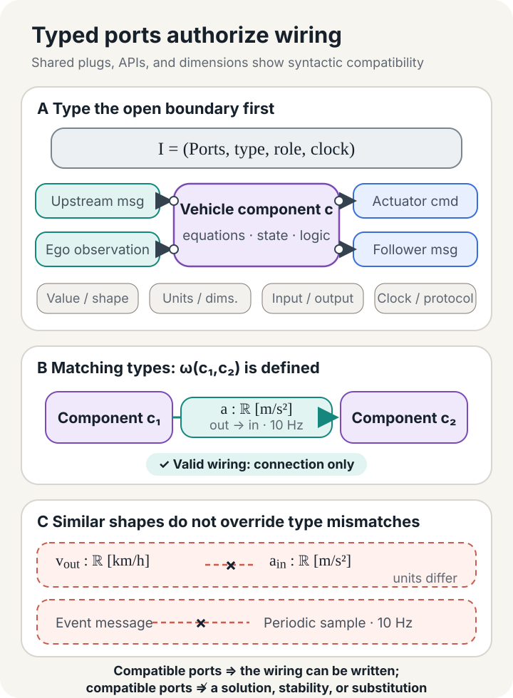

## Same Plug, Failed Substitution

Consider a four-vehicle platoon undergoing a version upgrade. An engineer plans to replace the control module on the second follower with a candidate release. Both modules use the same connector, read the same CAN and V2V fields, and output desired acceleration over the same range. The candidate has passed single-vehicle replay tests and even reduced the spacing-tracking error. A change process that asks only whether the interface matches and the new version is more accurate would approve the replacement.

The engineer changes only the control module, but the relevant unit of comparison and qualification is the controlled vehicle before and after the upgrade. Its unchanged communication stack, state estimator, low-level actuators, and vehicle dynamics remain inside the common boundary because they join the control module in determining the messages and motions visible to the platoon.

The platoon integration engineer still cannot approve the change. The original module sends a platooning control message every 50 ms; the candidate updates only every 100 ms. The fields, units, and encodings have not changed. Yet each neighboring-vehicle monitor expects a message at 20 Hz and initiates a front split or back split if no new message arrives for 150 ms. At the candidate's 10 Hz rate, one lost frame can extend the interval to 200 ms and cause the protocol to split the platoon. The ENSEMBLE multi-brand platooning specification gives precisely these timings: PCMs are transmitted at 20 Hz, neighbors expect updates every 50 ms, and the timeout is 150 ms.[^ensemble-protocol]

A field table records the shape of instantaneous data. The relevant system difference lies in the interaction history that the table leaves incomplete. The candidate "plugs in" and performs better on a single-vehicle metric, but the old conclusions about platoon cohesion, downstream disturbance amplification, and safe headway have not followed it into the system.

Substitution is therefore a conditional system claim. An auditable claim names the object being replaced, its admissible environments, the behavior the system observes, and the properties that must survive. It also shows that the local relation survives wiring, feedback, and hidden internal signals. Otherwise, "substitutable" remains an unauditable empirical judgment.

Platooning makes the issue vivid because one vehicle's action becomes the next vehicle's input. The same difficulty appears in co-simulation, probabilistic perception, and agents that call external tools. Once a model enters an existing system, it produces behavior jointly with its context. Comparing two isolated models covers only a small part of the substitution claim.

## A Model Becomes a Component at Its Boundary

Start by deciding where to draw the box. The same platoon-control problem admits at least three cuts. The box may contain only the control law, leaving vehicle dynamics, state estimation, the communication stack, and actuators in the environment. It may instead contain the controller and vehicle, with radar observations, V2V messages, management commands, and vehicle motion at the exposed surface. Pull the boundary out once more and the entire platoon becomes a component whose environment is road traffic and a dispatch system.

Each cut is legitimate, but each answers a different question. Replacing a control law requires the candidate to fit an existing vehicle. Replacing a controlled vehicle moves its dynamics and low-level actuators inside the candidate component. Presenting the whole platoon to a higher-level scheduler turns inter-vehicle communication and following errors into internal variables. A change of boundary changes the referents of "same interface" and "preserved behavior."

Herbert Simon used near decomposability to explain why complex systems sometimes support hierarchical study. An observer may provisionally encapsulate detail when interactions within a component are stronger, on the relevant time scale, than interactions between components. That warrant depends on scale and purpose. A vehicle controller may form a separate unit in a millisecond execution loop. A study of a platoon on a long descent may have to enlarge the boundary to include brake temperature, payload, and the responses of following vehicles.[^simon]

We can describe a component boundary with the typed signature

$$
I=(P,\operatorname{type},\operatorname{role},\operatorname{clock}).
$$

$P$ is the set of ports. $\operatorname{type}$ records value domains, units, or dimensions; $\operatorname{role}$ distinguishes inputs, outputs, and physical ports with no predetermined causal direction; $\operatorname{clock}$ records continuous time, discrete sampling, message freshness, and permitted protocol order. Without a unit annotation, meters per second and kilometers per hour both pass a floating-point memory-layout check. Without a clock, a 10 Hz message port and a 20 Hz port look identical.

For follower $i$, a schematic control boundary might begin with

$$
u_i=
\pi_i\bigl(
d_i,\Delta v_i,a_{i-1}^{\mathrm{msg}},
x_i^{\mathrm{est}},r_i
\bigr).
$$

Here $d_i$ is distance to the preceding vehicle, $\Delta v_i$ is relative velocity, $a_{i-1}^{\mathrm{msg}}$ is the predecessor acceleration received over the communication link, $x_i^{\mathrm{est}}$ is the vehicle's estimated state, and $r_i$ contains the reference speed or desired time gap. The output $u_i$ is desired acceleration. This equation exposes only the functional interface of the control law. If the replacement object is a controlled vehicle, the boundary must also accommodate sensor timestamps, message sequence numbers, vehicle length, road grade, actuator requests, state broadcasts to the following vehicle, and join, leave, and failure modes.

Port roles cannot all be flattened into software-function inputs and outputs. Voltage and current at an electrical port, or force and velocity at a mechanical port, are often connected through conservation laws or power-conjugate variables. Forcing a causal direction onto such a physical connection can manufacture an ordering that does not exist in the composed model. Software messages, by contrast, often have a clear sender, receiver, and protocol state. A useful type system preserves that distinction.

*Figure 1. Port matching licenses an engineer to write down a wiring relation. It does not establish a closed-loop solution, an operating behavior, or a system guarantee.*

For a boundary $I$, let $\operatorname{Tr}(I)$ denote all type-correct boundary histories. A history may be a continuous trajectory, a timestamped discrete sequence, or a trace containing mode-switch events. We can write a deterministic or nondeterministic behavioral model as

$$
m=(I,\mathcal B_m),
\qquad
\mathcal B_m\subseteq\operatorname{Tr}(I),
$$

where $\mathcal B_m$ collects the boundary behaviors that the component permits. Internal state equations, neural-network layers, filters, and solvers may all generate these histories. Distinct internal presentations may define the same model at the current observation boundary when their projected admissible behaviors agree.

If a team also needs to state the conditions for reuse, it can attach a local contract $K$ to the behavioral model:

$$
c=(m,K).
$$

$m$ specifies what may happen at the boundary, while $K$ states the component's promise under specified environmental conditions. A mathematical model remains complete without an open boundary. Component identity arises only after a team chooses a purpose-specific contact surface, permitted connections, and observation scheme; drawing a box alone does not make the model reusable.

## Wiring Is Syntax; Behavior Is Semantics

Connect the predecessor's message to the controller, the controller output to the low-level actuator, and vehicle motion back to the radar and the following vehicle. The lines on the drawing first prescribe how variables are equated, transformed, sampled, or conserved. A system run exists only when the local histories satisfy all those relations together.

Let $m_i=(I_i,\mathcal B_i)$ be a family of components and let $\omega$ be a wiring arrangement. Construct a common history space $\operatorname{Tr}_\omega$ that contains every external and internal port. A wiring relation $R_\omega\subseteq\operatorname{Tr}_\omega$ constrains histories in that space, while restriction maps $r_i:\operatorname{Tr}_\omega\to\operatorname{Tr}(I_i)$ send a global history to component $i$'s boundary. Once internal ports are hidden, the external behavior lies in $\operatorname{Tr}(I_{\mathrm{ext}})$:

$$
\mathcal B_{\omega(m_1,\ldots,m_n)}
=
\operatorname{proj}_{\operatorname{Tr}(I_{\mathrm{ext}})}
\left(
R_\omega\cap\bigcap_i r_i^{-1}(\mathcal B_i)
\right).
$$

The intersection requires every local model and every wire to describe the same run consistently. Projection forgets signals that an external observer cannot see. Expanding the existential quantifier behind the projection makes the operation more explicit:

$$
b_{\mathrm{ext}}
\in\mathcal B_{\omega(m_1,\ldots,m_n)}
\quad\Longleftrightarrow\quad
\exists b_{\mathrm{int}},
\ (b_{\mathrm{ext}},b_{\mathrm{int}})
\in R_\omega\cap\bigcap_i r_i^{-1}(\mathcal B_i).
$$

An external history is admissible when at least one internal history makes all component behaviors and wiring constraints hold at once. Hiding removes the observer's ability to distinguish the particular internal witness; it does not remove the internal constraints. A wiring diagram alone cannot create an external history for which no witness exists.

Willems's behavioral approach describes a dynamical system by a time axis, a signal space, and a set of admissible trajectories. Interconnection imposes joint constraints through shared variables, after which existential quantification hides latent variables and leaves the manifest behavior. This treatment avoids assuming in advance which variable is an input and which is an output, a useful feature for physical systems and feedback connections.[^willems] The notation $\mathcal B_m$ follows that discipline here, without claiming that probability distributions, optimization orderings, or causal interventions can all be reduced without loss to ordinary trace sets.

Typed wiring diagrams provide a systematic syntax for nesting connected boxes. Vagner, Spivak, and Lerman organize typed boxes and wiring diagrams into an operad and construct an algebra of open dynamical systems over it. A large wiring arrangement can be built by substituting smaller arrangements into one another, and the semantic operation respects that nesting.[^wiring] In the behavioral notation used here, the requirement takes the form

$$
\mathcal B_{\omega(m_1,\ldots,m_n)}
=
\mathsf A(\omega)
\bigl(\mathcal B_{m_1},\ldots,\mathcal B_{m_n}\bigr).
$$

The left side is the behavior of the connected component; on the right, the wiring operation acts on local behaviors. The operad-algebra laws make nested wiring coherent: composing subdiagrams first or expanding the hierarchy first yields isomorphic behavior. Category theory supplies that compositional consistency. Engineers must still choose the ports, the delay limits, and the safety properties. The systems in the original paper use directed ports, instantaneous transmission, and explicit state; other systems need other semantic algebras.

*Figure 2. Black-boxing preserves wiring constraints through the existence of an internal witness while forgetting the witness's value. Different implementations can produce the same boundary behavior under a chosen semantics and observation.*

Passive linear circuits provide a rigorous instance. Baez and Fong hide internal nodes to obtain a relation between potentials and currents at the terminals, and prove that this black-boxing operation preserves circuit composition. Different internal topologies can therefore have the same external relation.[^blackbox] Their result concerns passive linear networks, specified terminals, and Lagrangian relations. Other systems require their own black-box semantics.

A controlled-vehicle black box can hide internal differences in the same fashion. One release may use a Kalman filter and another a moving-horizon estimator. If both permit the same message and motion histories at the chosen boundary, the behavioral model can identify them. A following vehicle that relies on confidence intervals will expose a difference if the old boundary exports only point estimates. The next level of observation and context must decide whether the black box has hidden too much.

## Black Boxes Agree Only Relative to Observation and Context

A replay bench feeds a candidate controller a fixed set of predecessor trajectories. Frame by frame, the candidate produces nearly the same acceleration as the old controller, building a collection of records in which the two appear behaviorally equivalent. Once installed, acceleration changes the vehicle's position; that position changes the next radar gap and the disturbance received by the following vehicle. The replay bench fixes the input history. In closed loop, the component helps generate its future inputs. These experiments place the component in different contexts.

We can reuse the observation scheme developed in the previous essay. An observation specification $v$ selects the external ports and time scale to retain, together with a deterministic projection, aggregation, or query. $\Omega_v$ then maps complete behavior into a common observation space. Exact behavioral equivalence under this observation is

$$
m\equiv_v m'
\quad\Longleftrightarrow\quad
\Omega_v(\mathcal B_m)
=
\Omega_v(\mathcal B_{m'}).
$$

If $v$ retains only desired acceleration sampled at 10 Hz, it may filter out 2 ms scheduling jitter. A deadline property requires that same jitter to remain visible. A query restricted to mean spacing error may also erase a brief unsafe approach. The retained quantities define what counts as the same black box. Approximate substitution additionally needs an error-propagation account and a purpose-specific tolerance; exact equivalence does not supply either one.

Finite replay compares only the histories covered by a test set. Contextual substitution carries a stronger quantifier. Let $E[-]$ denote a system with one component-sized hole and let $\mathcal C_{\mathrm{adm}}$ be a family of admissible contexts. Observational equivalence can then be lifted to

$$
\forall E[-]\in\mathcal C_{\mathrm{adm}},
\qquad
\Omega_v\!\left(
\mathcal B_{E[m]}
\right)
=
\Omega_v\!\left(
\mathcal B_{E[m']}
\right).
$$

$\mathcal C_{\mathrm{adm}}$ need not contain every imaginable world. An engineer might restrict it to one-vehicle-look-ahead topologies, a stated speed domain, bounded communication delays and losses, and neighbors that pass compatibility checks. The quantifier must cover the use domain promised by the change claim. Evidence from one four-vehicle formation does not extend on its own to arbitrary lengths, reorderings, or post-split formations.

In their work on concurrent processes, Hennessy and Milner connect observational equivalence with substitution into contexts. Equivalent processes can be placed in larger expressions without changing observations only when the equivalence is a congruence for the language's composition operators.[^context-equivalence] This essay carries that idea into engineering components: substitution is a counterfactual conditional. If the candidate occupies the same position in an admissible context, the selected observations must agree or the required properties must continue to hold. The admissible contexts, physical domain, and error criteria are engineering additions; the original process-theoretic results do not provide them.

This account also clarifies the philosophical status of a boundary. A component boundary is a cut made for reasoning, and black-boxing is a form of forgetting with an explicit retention rule. The object does not determine one purpose-independent black-box specification. A team selects the interactions to expose, then uses experiment or proof to show that hidden differences leave its present conclusion intact. Two controllers may produce similar commands on the same replay set because both capture the relevant vehicle dynamics, or because the test never excites their differences.

An observation relation turns "they look the same" into an auditable statement, but it does not allocate responsibility. Better performance under low network latency establishes a behavioral fact over one domain. The engineer must still say who provides that latency and what the controller promises when the network leaves the domain.

## Contracts Attach Conditions to Guarantees

Suppose the old controller guarantees that the propagation gain between adjacent vehicles remains below $0.9$ when communication delay is at most 50 ms, messages arrive at 20 Hz, and actuator lag stays within a specified interval. The candidate reduces the gain to $0.7$, but its proof covers delays only up to 20 ms. Its guarantee is stronger numerically. In the old environment, however, it makes no promise for histories with delays between 20 and 50 ms.

The contract metatheory developed by Benveniste and colleagues writes a contract as

$$
K=(\mathcal E_K,\mathcal I_K),
$$

where $\mathcal E_K$ is the set of legal environments and $\mathcal I_K$ the set of legal implementations. A nonempty environment set gives compatibility; a nonempty implementation set gives consistency. Refinement should shrink the implementation set while enlarging the environment set. This direction precedes any particular language for assumptions.[^contracts]

For calculations in the platoon example, we use an assume-guarantee special case over a fixed universe of boundary behaviors:

$$
K=(A,G),
\qquad
A,G\subseteq\operatorname{Tr}(I).
$$

$A$ and $G$ are predicates, or subsets, over complete boundary histories. $A$ primarily constrains coordinates controlled by the environment; $G$ constrains coordinates for which the component is responsible, or the joint history as a whole. A behavioral model $m=(I,\mathcal B_m)$ satisfies the contract exactly when

$$
m\models K
\quad\Longleftrightarrow\quad
\mathcal B_m\cap A\subseteq G.
$$

During composition, engineers first lift each local predicate along the port maps into a common global history space. Contract theories may express $A$ and $G$ with state machines, temporal logic, probability bounds, or resource budgets, and may use different saturation and composition operations. The direction of conditional reasoning is the part needed here: when an environment history belongs to $A$, the component's behavior must belong to $G$.

For a common alphabet, common property universe, and normalized representation, the following strong conditions provide a convenient sufficient check:

$$
A_{\mathrm{old}}\subseteq A_{\mathrm{new}},
\qquad
G_{\mathrm{new}}\subseteq G_{\mathrm{old}}.
$$

The first inclusion makes the candidate accept every environment accepted by the old component, and perhaps more. The second narrows the range of behaviors promised by the candidate. Together they are sufficient for the candidate to refine the old contract, but they are not a necessary-and-sufficient definition for arbitrary contract representations. The 20 ms candidate above fails the first inclusion. A smaller gain over its narrow domain does not make it a substitute for a controller specified up to 50 ms. A team may instead narrow the permitted environment to 20 ms, but then the network, monitoring, and fallback logic belong to the system change. The result is no longer a local equivalent replacement.

Interface automata encode the same division of responsibility in their action semantics. Inputs express choices made by the environment, while outputs belong to the component. Alternating refinement therefore asks a new component to restrict inputs less and outputs more.[^interface-automata]

Once contracts are composed, no local $G_i$ can be used without support. For component $i$, the external assumptions, wiring relations, and partner guarantees must jointly imply its assumption:

$$
R_\omega\land A_{\mathrm{ext}}
\land\bigwedge_{j\ne i}G_j
\models A_i.
$$

All local guarantees and the wiring relation must also imply the required system guarantee:

$$
R_\omega\land A_{\mathrm{ext}}
\land\bigwedge_iG_i
\models G_{\mathrm{sys}}.
$$

These formulas are proof obligations, not a rule that licenses circular reasoning. In an acyclic connection, assumptions can be discharged in topological order using partner guarantees that have already been established. Feedback requires a temporal assume-guarantee rule with a base case and an inductive invariant, or a separate noncircular global closure lemma. Setting $A_1=G_2$ and $A_2=G_1$ otherwise spends each conclusion before proving it. A failed assumption closure does not make a local proof mathematically false; its premise has not been supplied in this composition. A failed system implication can also leave a platoon's tail-disturbance bound or lost-link split behavior without an owner even when every local guarantee holds.

*Figure 3. A guarantee is conditional. A composition proof must supply every local assumption and derive the system property from the local guarantees. The arrows denote proof obligations, not permission to cite conclusions circularly.*

Delay, loss, actuator capability, and topology can enter a platoon contract. Engineers must still choose runtime predicates that can be measured. A monitor cannot decide when to fall back if $A$ says only that "network conditions are good." A 20 ms delay limit needs a timestamp semantics, a measurement point, and defined behavior when the limit is exceeded. A contract derives its value from enforceable conditions, not from rewriting ordinary requirements in set notation.

## When Local Refinement Survives Composition

The candidate now preserves the ports and offers a more permissive contract. The platoon engineer must still establish that the connected equations have a solution and that the relevant composition operations preserve local refinement. Contract compatibility asks whether some acceptable environment exists. Feedback well-posedness asks whether each external excitation produces a unique, causal internal response.

Consider the feedback connection

$$
u=\Delta(y)+d_u,
\qquad
y=G(u)+d_y,
$$

and define

$$
\Phi(u,y)=
\bigl(u-\Delta(y),\,y-G(u)\bigr).
$$

Here $G$ and $\Delta$ act on compatible extended signal spaces. In the control-theoretic definition used by Megretski and Rantzer, the interconnection is well posed when $\Phi^{-1}$ exists and is causal. Given an external disturbance $(d_u,d_y)$, the internal signals $(u,y)$ are then unique and cannot depend on the future. A further claim of $L_2$ stability requires $\Phi^{-1}$ to have finite induced gain on $L_2$.[^well-posedness] A legal wiring diagram and two nonempty contracts therefore do not finish the closed-loop analysis.

Two scalar ports already provide counterexamples. The wiring

$$
y_1=y_2,
\qquad y_2=y_1
$$

has infinitely many solutions, while

$$
y_1=y_2+1,
\qquad y_2=y_1
$$

has none. At the type level, both systems connect scalar ports without a unit or role mismatch. The semantics of the closed-loop equations decides whether the system can run.

Let $c$ be the original component, $c'$ the candidate, and $\Psi_{\mathrm{req}}$ the set of properties to preserve. Write $X\downarrow$ when the composite object $X$ is well posed. We define the contextual substitution target as

$$
c'\sqsubseteq_{\mathcal C_{\mathrm{adm}},\Psi_{\mathrm{req}}}c
\quad\Longleftrightarrow\quad
\forall E[-]\in\mathcal C_{\mathrm{adm}},
\quad E[c]\downarrow\Rightarrow
\left(
E[c']\downarrow
\ \land\
\forall\psi\in\Psi_{\mathrm{req}},
E[c]\models\psi\Rightarrow E[c']\models\psi
\right).
$$

The context family, property set, and satisfaction relation in this definition each require an operational meaning. $\mathcal C_{\mathrm{adm}}$ lists the system environments that may occur. $\Psi_{\mathrm{req}}$ lists the properties that this change must preserve. $\models$ uses the judgment appropriate to each property. Whenever the baseline composition is well posed, the candidate composition must remain well posed and retain each target property already satisfied by the baseline. In a platoon, the judgment may use trace inclusion or induced gain. Other semantic objects require other satisfaction relations.

Local refinement supports modular reasoning only if it is a precongruence for the wiring operations in use:

$$
c'\preceq_{\mathrm{loc}} c
\quad\Longrightarrow\quad
\omega(\ldots,c',\ldots)
\preceq_{\mathrm{loc}}
\omega(\ldots,c,\ldots).
$$

Each operator in use changes the semantics: hiding, renaming, serial or parallel composition, and feedback. Local contract refinement is modular only after monotonicity has been proved for those operators. The contextual relation is a precongruence only when $\mathcal C_{\mathrm{adm}}$ is closed under the relevant composition, and it remains distinct from local refinement. Work on input/output automata proves preservation for specified operators and has also exposed boundaries that require correction under more general nondeterminism.[^precongruence]

*Figure 4. Set inclusion supplies one strong local sufficient check. Contextual substitution additionally requires the local relation to survive admissible composition while feedback well-posedness and target system properties are preserved separately.*

This definition also limits the inflated reading of "all contexts." Purpose and contract determine the admissible family. A component specified only for constant-time-headway following on highways need not be equivalent in low-speed mining convoys, urban cut-in traffic, or racetrack operation. Conversely, an engineer cannot validate against one convenient set of neighbors and then declare that the vehicle supports arbitrary formations.

The contextual relation first constrains semantic models. If a change also reaches generated code, a processor, or a vehicle, the computational artifact and deployed instance require renewed evidence at their own addresses. A precongruence theorem cannot test deadlines on a new processor or measure the response lag of a new braking system.

## Replacing That One Vehicle in the Platoon

Return the candidate controlled vehicle to the second-follower position. The change case draws on four distinct bodies of evidence: the ENSEMBLE specifications, heterogeneous-ACC analysis, a CACC topology study, and an embedded-MPC experiment. Each addresses a different proof obligation. The candidate boundary contains the controller, communication stack, state estimator, low-level actuation, and vehicle dynamics. Message arrival and vehicle response form one continuous causal chain, so disturbance propagation and safety properties must be evaluated over the platoon.

### Timing Is Part of a Port's Semantics

The multi-brand platooning control message defined by ENSEMBLE carries position, heading, vehicle length, station identity, generation time, and sequence number. It also carries predicted and current longitudinal acceleration, velocity, road grade, and related fields. The specification emphasizes that position and heading become meaningful only together with message age: latency may exist, but the receiver must know its size. Predicted acceleration has the lowest latency, and a receiver should monitor its reliability.[^ensemble-spec]

Fields in one message can originate at different update rates. CAN signals often refresh faster than GNSS, so one timestamp for the entire packet can conceal the true age of individual fields. Feedback collected after tests involving seven vehicle brands led ENSEMBLE to call for multiple timestamps grouped by similar update rates. The same report notes that a 50 ms period and 150 ms timeout tolerate two lost messages without an immediate timeout. A split status sent only once, however, may disappear without warning. Field presence, temporal validity, and the behavior after loss or retransmission together make up the communication port.

The 10 Hz candidate from the opening therefore changes both periodic behavior and failure traces. It may keep producing parseable messages when no packets are lost, yet it violates the 20 Hz protocol. One loss then pushes the interval beyond the watchdog limit. If a receiver initiates a split, the platoon topology changes and any propagation result proved for a fixed formation must be evaluated again. The timing failure has crossed the communication-layer boundary.

### Vehicle Parameters Enter the Propagation Channel

The same control formula on a different vehicle forms a different closed loop with sensor delay and actuator lag. Wang and colleagues model a heterogeneous ACC platoon with third-order longitudinal dynamics:

$$
\dot x_i=v_i,
\qquad
\dot v_i=a_i,
\qquad
\dot a_i=\frac{u_i-a_i}{\tau_i},
$$

where $\tau_i$ is the lag in the propulsion or braking chain. The controller reads spacing and velocity values delayed by $\xi_i$:

$$
u_i(t)=
f\!\left(
s_i(t-\xi_i),v_i(t-\xi_i),v_{i-1}(t-\xi_i)
\right).
$$

For a linear constant-time-headway controller,

$$
u_i=
k_{v,i}(v_{i-1}-v_i)
+k_{s,i}(s_i-t_{d,i}v_i-s_0),
$$

and the corresponding error-propagation channel contains all these parameters:

$$
H_i(s)=
\frac{
(k_{v,i}s+k_{s,i})e^{-\xi_i s}
}{
\tau_i s^3+s^2+
(k_{v,i}+t_{d,i}k_{s,i})se^{-\xi_i s}
+k_{s,i}e^{-\xi_i s}
}.
$$

Slower sensor filtering, a different brake response, or a revised target headway changes $H_i$. Wang and colleagues show that ignoring both sensing delay and actuator lag can overestimate controller performance. They derive sufficient conditions for string stability in a linearized, unconnected, heterogeneous ACC model and test them in simulation.[^wang] These formulas show how a parameter domain enters a substitution condition. They do not cover CACC protocol failures, road behavior of physical vehicles, or nonlinear emergency braking.

### The Full Product Can Pass While Prefixes and Splits Fail

Let $E_i$ be the spacing error at follower position $i$, with

$$
E_i(s)=H_i(s)E_{i-1}(s),
\qquad
\|H_i\|_{\mathcal H_\infty}\le\gamma_i.
$$

For stable causal LTI channels in cascade under equilibrium initial conditions, submultiplicativity of the induced norm gives

$$
\|E_n\|_2
\le
\left(\prod_{i=1}^{n}\gamma_i\right)
\|E_0\|_2.
$$

This derivation supports two substitution qualifications with different strength. If every channel in the admissible contexts satisfies $\gamma_i\le1$, then a stable candidate channel with $\gamma_k'\le1$ preserves nonamplification at each vehicle along the same kind of cascade. If the team checks only

$$
\gamma_k'
\prod_{i\ne k}\gamma_i
\le1,
$$

it has established a head-to-tail bound for the full formation. Truncating the formation removes factors from the product. Merely reordering a position-independent set of scalar $\gamma_i$ values leaves the full product unchanged, but changes the prefix products and where amplification occurs. More general channels $H_i$ may depend on neighbors, position, or operating mode, in which case reordering also redefines the factors. A full-product bound alone cannot establish the guarantee for every prefix or split formation.

Panels 4(b) and 4(e) of Wang et al. make the distinction concrete. The three followers use $(k_s,k_v,t_d)$ values

$$
(0.6,0.8,1.2),\qquad
(0.4,0.6,1.0),\qquad
(0.7,0.8,1.4).
$$

The middle follower's local channel amplifies the disturbance; attenuation at the final follower is enough for the complete four-vehicle head-to-tail condition to hold. A split after the middle follower removes that downstream attenuation. The evidence supports the complete formation's endpoint bound, not every prefix or split formation.

### A New Signal Changes Topology and Guarantee

A candidate controller may improve a local metric by consuming more information. [The previous essay](/en/posts/engineering-model-chain/) compared the string-stability conditions for one-vehicle and two-vehicle look-ahead in the homogeneous continuous-time LTI platoons studied by Ploeg and colleagues. The replacement-specific lesson is enough here: a message from the second predecessor increases port arity, enlarges the information that the environment must supply, and changes the propagation channel being compared at system level.[^ploeg] Such a candidate may define a new platoon design. It is not a local refinement of the original single-predecessor contract.

Topology also affects common causes. Two upstream messages may originate in the same leader maneuver and cannot be treated as independent disturbances with separate single-input bounds. A communication failure that changes CACC into ACC alters the controller, available ports, and guarantees together. Each mode and each switching trace requires its own behavior and contract; one frequency-response curve from the connected mode cannot cover the entire run.

### Propagation and the Safety Envelope Need Separate Ledgers

A disturbance that does not grow down the platoon does not establish a minimum distance at every instant. Vehicles may have small $L_2$ errors between successive followers and still cross a safety limit during a short braking peak. Actuator saturation, cut-ins, and tire adhesion also sit outside the linear propagation channel.

ENSEMBLE assigns these responsibilities separately in its Platooning Support Function. Drivers normally choose a target headway between 1.4 s and 1.6 s, while the realized headway must remain at or above 0.8 s. A separate steady-state requirement prevents velocity disturbances from growing. Before the collision-warning sequence is complete, the initial brake request is limited to $-3.5\,\mathrm{m/s^2}$; stronger braking requires additional sensors to verify the risk. The specification also treats brake temperature, tire type and wear, payload, and road conditions as factors that alter braking capability.[^ensemble-spec]

These requirements may coexist in one system contract, but none replaces another. $\|H_i\|_\infty$ governs one class of propagation histories. The 0.8 s lower bound constrains peak spacing, while braking and warning rules constrain mode transitions and actuator action. A candidate that improves propagation gain but demands a larger instantaneous brake command must still remain inside the PSF physical envelope.

### Runtime Rewrites the Same Mathematical Relation

The multilayer platoon MPC built by Ibrahim and colleagues shows how a model changes when it becomes a computational artifact. The upper layer receives predecessor messages and solves a distributed MPC problem at 10 Hz; lower-level state feedback runs every 2 ms. The team used the Fast Gradient Method, precomputed fixed matrices, generated C code from MATLAB, and deployed the system on four Cohda MK5 units. Continuous-to-discrete conversion used an approximation, and eigenvalue calculation called the GNU Scientific Library.[^ibrahim]

The embedded system differed from the theoretical version in traceable ways. V2V messages carried timestamps, allowing a follower to estimate information age and predict the predecessor's current state. The prediction assumed that the predecessor used the same lower-level controller and treated current acceleration as the recent desired acceleration. After packet loss, the upper layer held the previous desired acceleration. The devices ran Ubuntu rather than a real-time operating system, so an occasional delay in the lower-level thread briefly "froze" the simulated vehicle state. Replacing the lower-level algorithm, scheduling period, or operating system changes both the prediction premise and runtime behavior.

This experiment supports the feasibility of an embedded realization; the four devices simulated vehicle states. Physical vehicle dynamics, road disturbances, and real sensors still require other evidence. Even when the formal propagation channel is preserved, new generated code, libraries, and processors change the address being qualified. Unchanged mathematical steps from an old proof may be reused. A deadline test of an old binary cannot be assigned to the new binary.

### What a Passing Substitution Requires

ENSEMBLE's white-label truck provides a concrete composition case. The project specified a common tactical layer, state and attribute exchange, and V2X protocol across multiple vehicle brands, while allowing each OEM to implement its own longitudinal control, sensors, and braking system. Capability information also enters the composition: vehicles propagate constraints such as maximum acceleration request and desired maximum velocity through the platoon, allowing upstream control to adapt to its most limited member. The project implemented, tested, and evaluated the Platooning Support Function across seven brands.[^ensemble-spec]

These results establish interoperability for the seven-brand Platooning Support Function under the project's common protocol, capability propagation, and test regime. The evidence attaches to that tested configuration; it does not by itself justify a hot swap of any schema-compatible controller or extend to arbitrary platoon lengths. The project's corresponding work on the Platooning Autonomous Function remained a theoretical specification, distinct from the implemented Support Function evidence.

For the candidate vehicle in our scenario, an auditable acceptance condition can now be written. The candidate preserves the clocked external boundary. Its vehicle and actuator implementation remains within the dynamic envelope named by the old contract. It accepts at least the old component's delay, loss, and road environments, and refines its local propagation, constraint, and fallback guarantees. Those relations survive the permitted one-vehicle-look-ahead wiring and topology changes, while the system separately meets its headway and braking envelope. The team then retests each changed code artifact, ECU, communication configuration, and vehicle at the appropriate address.

## Carrying the Substitution Test into Other Systems

The platoon combines continuous dynamics, timed messages, and frequency-domain gain, which can make this approach look peculiar to control theory. The ports, behaviors, contracts, and context quantifier survive in three different systems below. Their boundary semantics and preserved properties do not.

### FMI: The Same Scalar Ports Can Form a Loop with No Solution

Suppose two FMUs form an algebraic loop through scalar outputs:

$$
y_A=f_A(y_B),
\qquad
y_B=f_B(y_A).
$$

Take $f_B(z)=z$. The old component uses $f_A(z)=z/2$, so the simultaneous equations have the unique solution $y_A=y_B=0$. A candidate keeps the same scalar port but changes the relation to $f_A'(z)=z+1$. The loop then requires

$$
y=y+1,
$$

which has no solution. The type checker permits the connection; the composed equations reject the substitution.

FMI 3.0.2 provides metadata and mechanisms for algebraic loops, iterative dependencies, and saving and restoring FMU state. After a failed co-simulation step, an importer may roll back each FMU, shorten the step, and try again. A candidate that lacks the required get/set FMU-state capability prevents the old rollback algorithm from operating even if variable names, types, and causality attributes match. The standard specifies available mechanisms. It does not prove that a particular composed model has a unique solution or that an iteration converges.[^fmi]

The example carries well-posedness from feedback control into co-simulation. A substitution claim must include the importer strategy, algebraic-loop solver, and state-recovery capability. Comparing only the FMU variable tables misses the composition semantics that determines whether a run exists.

### Probabilistic Perception: Confidence Needs Distributional Semantics

A LiDAR detector outputs a class, a three-dimensional bounding box, and a confidence value. A candidate network preserves the tensor shape and reaches roughly the same mean average precision as its predecessor. Let $Y$ be the true class, $\hat Y$ the predicted class, and $\hat P$ the reported confidence. If the downstream planner treats confidence as an event probability, its contract also depends on calibration. Idealized classification calibration under deployment distribution $D$ is

$$
\Pr_D(\hat Y=Y\mid\hat P)=\hat P
\qquad D\text{-a.s.}
$$

Under finite confidence binning, predictions near $0.9$ should be correct about nine times in ten. For object detection, "correct" additionally depends on matching and IoU rules. Feng and colleagues therefore examine both classification and bounding-box regression calibration, showing that detection accuracy and uncertainty quality require separate evaluation. Ovadia and colleagues find that calibration degrades for several methods as distribution shift grows, and that temperature scaling fails to retain its IID calibration performance on shifted data.[^calibration]

A shared schema establishes only that the planner can read a class, box, and confidence. Substitutability also depends on the meaning of $\hat P$, the distribution against which it is calibrated, and the tail risk used by the system. If the old contract promises a bound on calibration error over a stated distribution family, a new model must refine that promise under the same family and scoring rule. Mean accuracy on one IID test set cannot discharge this condition.

The boundary semantics for this case should be a probability law over histories or a stochastic kernel. Its contract may use calibration, coverage, or a task-specific risk measure. Turning miscalibration into vehicle risk still requires propagation through the planner and the closed-loop vehicle dynamics.

### Tool-Using Agents: The Response Matches While Reality Changes Twice

Suppose an agent calls `create_ticket`. The request and response conform to the same JSON schemas, and the old service deduplicates requests by `request_id`. The first request creates a ticket, but its response is lost in transit. The client cannot know whether the server executed the request, so it retries. The old service recognizes the repeated `request_id` and leaves one ticket. A candidate service returns the same successful response shape but performs no idempotency check, creating a second ticket on the retry.

The tool's boundary semantics must therefore include at least a state-transition kernel

$$
T(\,\cdot\mid s,x)
\in
\mathcal P\!\left(S\times(Y\sqcup E)\right),
$$

where $S$ is the external state space, $X$ the request space, and $Y$ and $E$ the response and error spaces. For $(s,x)\in S\times X$, the kernel assigns a distribution to post-call state and outcome. A partial failure may change $S$ even when it returns an error. Under an $X\to Y$ view, the two services appear identical. Once the observation includes state changes and failure traces, the duplicate ticket becomes visible.

MCP tool input and output schemas specify the shapes of arguments and structured results. Annotations such as `idempotentHint` offer hints to a client, but the specification warns clients not to treat annotations as trusted guarantees. HTTP semantics likewise connect automatic retry to method idempotency because a client may not know how much of a request the server processed before a failure.[^tool-semantics] Replacing a tool with effects in the world requires checks on retry, deduplication, authorization, and partial failure. The duplicate-ticket scenario is a constructed counterexample to the sufficiency of protocol fields; it is not a report of an incident in a particular MCP service.

The FMI failure concerns existence of a solution, the perception failure concerns a distributional promise, and the tool call changes external system state. Their semantic objects differ. In each case, the substitution claim must survive the actual composition.

### Three Views of Engineering Models

This series has examined engineering models at three scales. ["From Model to Engineering System"](/en/posts/engineering-model-chain/) follows the relations among reality, requirements, computation, deployment, and evidence. ["What Is Inside a Model?"](/en/posts/inside-the-model/) opens the model and distinguishes typed signature, formal presentation, semantic instance, observation, and representation. This essay puts bounded models next to one another and studies their wiring, contracts, and substitution. The views apply recursively: a platoon is a component of a traffic system, while a controlled vehicle contains estimator, controller, and actuator components.

A compact substitution claim reads:

> Under the admissible context family $\mathcal C_{\mathrm{adm}}$ and required property set $\Psi_{\mathrm{req}}$, the candidate satisfies $c'\sqsubseteq_{\mathcal C_{\mathrm{adm}},\Psi_{\mathrm{req}}}c$; actual wiring preserves the local refinement, while changed computational and deployment relations are requalified separately.

That sentence must expand into a component boundary, assumptions and guarantees, composition operators, feedback well-posedness, an observation specification, target properties, and evidence addresses. The apparently identical plug in the opening did not license a substitution because the difference between 50 ms and 100 ms traveled through the watchdog and topology into a platoon-level property. Interface reuse comes from this network of relations: it shows which proofs survive and which work must be repeated.

---

[^ensemble-protocol]: Boris Atanassow et al., *[Platooning Protocol Definition and Communication Strategy](https://publications.tno.nl/publication/34640511/YQUtYF/atanassow-2022-platooning.pdf)*, ENSEMBLE Deliverable D2.8, 2022, Section 4.2, pp. 31-32, and Section 4.4.5, pp. 44-46, especially `PCM_TIMEOUT = 150 ms` and REQ_V2V_040-044. The document establishes protocol and state-machine requirements, not control-stability results.

[^simon]: Herbert A. Simon, "[The Architecture of Complexity](https://doi.org/10.2307/985254)," *Proceedings of the American Philosophical Society* 106(6), 1962, pp. 474-475. This essay uses near decomposability only to make boundaries relative to interaction strength and time scale; it does not treat hierarchical decomposition as a fact about every system.

[^willems]: Jan C. Willems, "[The Behavioral Approach to Open and Interconnected Systems](https://doi.org/10.1109/MCS.2007.906923)," *IEEE Control Systems Magazine* 27(6), 2007, pp. 51-54, 62-64, and 70-72. The behavioral kernel, interconnection, and latent/manifest projection come from these sections. The generic trace notation here does not cover every probabilistic, optimization, or causal semantics.

[^wiring]: Dmitry Vagner, David Spivak, and Eugene Lerman, "[Algebras of Open Dynamical Systems on the Operad of Wiring Diagrams](https://tac.mta.ca/tac/volumes/30/51/30-51.pdf)," *Theory and Applications of Categories* 30, 2015, Definition 2.7, Definition 3.1, Proposition 3.11, Definition 4.2, and Proposition 4.5, pp. 1797-1814.

[^blackbox]: John Baez and Brendan Fong, "[A Compositional Framework for Passive Linear Networks](https://tac.mta.ca/tac/volumes/33/38/33-38.pdf)," *Theory and Applications of Categories* 33, 2018, pp. 1163-1164, and Definition 7.3.1 and Theorem 7.3.2, p. 1213. Their black-box functor applies to passive linear networks and the relation semantics specified in the paper.

[^context-equivalence]: Matthew Hennessy and Robin Milner, "[Algebraic Laws for Nondeterminism and Concurrency](https://www.scss.tcd.ie/matthew.hennessy/pubs/old/HMjacm85.pdf)," *Journal of the ACM* 32(1), 1985, pp. 137-139 and 143-144. The original paper treats finite concurrent processes; this essay uses it to motivate a substitution target over engineering context families.

[^contracts]: Albert Benveniste et al., *[Contracts for System Design](https://inria.hal.science/hal-00757488)*, INRIA Research Report RR-8147, 2012, pp. 25-27 and 30, Definitions 1 and 3, Properties 1 and 3, and Eqs. (10)-(14). The $(A,G)$ form in the main text is a special case over a fixed universe of trace properties.

[^interface-automata]: Luca de Alfaro and Thomas A. Henzinger, "[Interface Automata](https://doi.org/10.1145/503209.503226)," *ESEC/FSE 2001*, pp. 113-118, Definitions 1-15 and Theorems 3-4. This essay uses only the allocation of input/output responsibility and the intuition behind optimistic compatibility; it does not extend the original theory beyond its boundaries under general nondeterminism.

[^well-posedness]: Alexandre Megretski and Anders Rantzer, "[System Analysis via Integral Quadratic Constraints](https://doi.org/10.1109/9.587335)," *IEEE Transactions on Automatic Control* 42(6), 1997, Section II, p. 821. Causal invertibility and boundedness carry the distinct obligations of well-posedness and stability.

[^precongruence]: Paul C. Attie and Nancy A. Lynch, "[Dynamic Input/Output Automata: A Formal and Compositional Model for Dynamic Systems](https://doi.org/10.1016/j.ic.2016.03.008)," *Information and Computation* 249, 2016, Theorems 17-18; Walter Vogler and Gerald Lüttgen, "[A Linear-Time Branching-Time Perspective on Interface Automata](https://doi.org/10.1007/s00236-020-00369-4)," *Acta Informatica* 57, 2020, Theorems 45, 54, and 57. These sources calibrate the claim that precongruence must be proved for the composition operators in use.

[^ensemble-spec]: Edoardo Mascalchi et al., *[Final Version Functional Specification for White-label Truck](https://publications.tno.nl/publication/34640520/7W6Wtu/mascalchi-2022-final.pdf)*, ENSEMBLE Deliverable D2.5, 2022. The boundary between the implemented, tested, and evaluated seven-brand PSF and the theoretical PAF specification appears in the Executive Summary, pp. 8-9, and Section 3, pp. 53-55; common functions and OEM-specific implementations in Section 2.1.2, pp. 16-20; capability propagation and message semantics in Sections 2.3.2-2.3.4, pp. 22-28; longitudinal-control requirements in Section 2.5.4, pp. 46-50; multi-timestamp and packet-loss feedback in Sections 3.2.5-3.2.6, pp. 54-55; and braking factors in Tables 11 and 13, pp. 79-87.

[^wang]: Meng Wang et al., "[String Stability of Heterogeneous Platoons with Non-connected Automated Vehicles](https://doi.org/10.1109/ITSC.2017.8317792)," *2017 IEEE 20th International Conference on Intelligent Transportation Systems*, Sections II and III.F, Eqs. (24)-(30); Section IV.A-C, Eqs. (31)-(40), and Figure 4(b,e). The paper provides sufficient conditions and simulation for linearized, unconnected ACC, not road validation of CACC.

[^ploeg]: Jeroen Ploeg et al., "[Controller Synthesis for String Stability of Vehicle Platoons](https://doi.org/10.1109/TITS.2013.2291493)," *IEEE Transactions on Intelligent Transportation Systems* 15(2), 2014, Sections II-V, Definition 1, Eqs. (18) and (20), and Conditions (19) and (21). The criteria assume Assumption 1, $\|P_1\|_{\mathcal H_\infty}<\infty$, existence of the required transfer-matrix inverses, and validity for every $i\ge2$; the analysis uses homogeneous continuous-time LTI models and fixed communication delay.

[^ibrahim]: Amr M. E. Ibrahim et al., "[Multi-layer Multi-rate Model Predictive Control for Vehicle Platooning under IEEE 802.11p](https://doi.org/10.1016/j.trc.2020.102905)," *Transportation Research Part C* 124, 2021, article 102905, Sections 10.1-10.5, pp. 28-31. Four Cohda MK5 units simulated vehicle states in HIL, supporting embedded feasibility rather than physical road-vehicle evidence.

[^fmi]: Modelica Association, *[Functional Mock-up Interface Specification 3.0.2](https://fmi-standard.org/docs/3.0.2/)*, Sections 2.2.4, 2.2.7.4, 2.2.9, 2.2.11, 2.4.2, 4.1, and 4.2.1. The specification provides algebraic-dependency metadata, reduced-step recomputation, FMU-state save/restore, and capability flags; it does not prove well-posedness or convergence for a particular co-simulation.

[^calibration]: Chuan Guo et al., "[On Calibration of Modern Neural Networks](https://proceedings.mlr.press/v70/guo17a.html)," *ICML 2017*, Section 2, Eq. (1); Di Feng et al., "[Can We Trust You? On Calibration of a Probabilistic Object Detector for Autonomous Driving](https://arxiv.org/abs/1909.12358)," arXiv:1909.12358, 2019, Sections III-IV, Eqs. (2)-(3), Section VI-A, and Figures 2-3; Yaniv Ovadia et al., "[Can You Trust Your Model's Uncertainty? Evaluating Predictive Uncertainty Under Dataset Shift](https://proceedings.neurips.cc/paper/2019/hash/8558cb408c1d76621371888657d2eb1d-Abstract.html)," *NeurIPS 2019*, Section 4.2 and Figures 2-3. These sources support classification calibration, classification/regression calibration for probabilistic object detection, and calibration degradation under distribution shift, respectively. They do not directly establish collision risk.

[^tool-semantics]: Model Context Protocol, *[Tools, specification revision 2025-11-25](https://modelcontextprotocol.io/specification/2025-11-25/server/tools)* and the same revision's *[Schema Reference: Tool and ToolAnnotations](https://modelcontextprotocol.io/specification/2025-11-25/schema#tool)*; IETF, *[RFC 9110: HTTP Semantics](https://www.rfc-editor.org/rfc/rfc9110#section-9.2.2)*, Section 9.2.2. MCP annotations are hints rather than trusted guarantees; the duplicate-ticket scenario is constructed for this essay.
