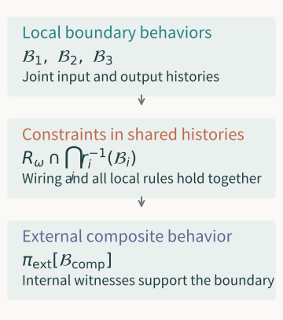

A network produces a prediction, which then helps determine an action. The action changes the next input, and that input returns to the network. A function compared under fixed conditions in essay IV now enters an environment that continues responding to it. To decide whether the network can be used, or replaced by another, we must retain this exchange.

A similar change occurs in tool use. A call has already changed state, but its response is lost in transit. Having received no result, the caller sends the request again. If we inspect only the fields accepted and the type returned, both calls still fit the tool's description. If one request should have at most one effect, execution, notification, and retry become distinct events to compare within a common history.

Entering a whole first adds relations. Which quantities are exposed, when they are available, who controls inputs, who owes outputs, what internal wiring retains, and how an environment may use the component all affect the final judgment. This essay builds interconnection and hiding from those boundaries, examines why feedback can have no solution, multiple solutions, or unstable responses, and develops conditions for contracts and substitution. Probabilistic calls and stateful tools then show how the understanding changes with its objects.

## How Purpose Selects a Model's Boundary

Essay III distinguished presentation, semantics, and observation. An internal model may contain parameters, states, equations, probability kernels, or operational rules. To make it a component, we select the parts the environment can obtain or change. Call this boundary an interface $I$. It relates an internal object to permitted connections without exposing every internal variable.

A fixed network might expose only an input sequence and output logits. It might instead expose layer representations for analysis, or include caches, generation state, and tool calls. The first boundary suits a comparison of individual forward functions; the latter concerns continuing interaction. When replacing a running generation service, comparing only a single uncached function can hide state that affects its future.

Training has its own boundary. Data batches, parameters, and optimizer state jointly determine the next update. Exposing parameters without accounting for momentum may leave subsequent training undetermined by the visible state. Essay III's equal functions with different gradients, and essay IV's changes of coordinates and metric, explain why. A boundary must retain what the present operation needs; state augmentation can make the description closed.

An interface also includes the meaning of its quantities. A real number might represent absolute temperature, deviation from a set point, an increment over the next step, or a rate per second. These have different origins, units, and relations to execution. A common numerical type still needs the appropriate conversion before connection. A probability needs its event and conditioning information; a time needs its clock, sampling instant, and permitted age. Types can organize these distinctions, while reference and conventions give the types content.

Protocols and capabilities enter the boundary too. A component may require initialization before execution, permit a calculation to be undone, or retain effects after a failure. An environment relying on these operations must check more than a variable table. Which operation may be issued when, and which state follows a failure, belong beside the values that may be returned.

The boundary can therefore change as the question changes. If communication delay controls the closed-loop conclusion, we may compare the controller together with its channel. If solver error is central, we retain the endpoints between algorithm and decoding. Enlarging the boundary internalizes more responsibilities and enlarges the object being replaced. A proposal cannot compare a narrow module and then silently use a larger system to prove its guarantee.

This choice preserves the requirement that models connect to experience. A physical quantity at an interface still needs the measurement and representation relations developed in essay II. We first fix the mathematical and protocol boundary so that a common space can express what may happen to the component.

## How Boundary Objects Become Histories

For a stateless function, one input-output pair records a single action. A stateful component, delay, or retry needs order. Begin with common logical steps $k=0,1,\ldots$, input domain $U$, and output domain $Y$. Take the boundary-history space to be $\operatorname{Tr}(I)=(U\times Y)^{\mathbb N}$. An element $h=(u_k,y_k)_{k\ge0}$ records a whole input-output sequence rather than the values at one step.

Here $k$ orders this interaction. Physical sampling additionally needs instants $t_k$, intervals, and execution windows. Training steps, layer depth, and generation positions retain their separate meanings. Asynchronous components may instead use timestamped event sequences with rules for concurrency, message arrival, or precedence. We first derive results on common discrete steps and then identify what changes with the boundary.

Let $\pi_I$ restrict a complete internal history to its boundary. If allowed internal histories form $\mathcal B_{\mathrm{full}}$, boundary behavior is $\mathcal B=\pi_I[\mathcal B_{\mathrm{full}}]\subseteq\operatorname{Tr}(I)$. The projection hides internal state while retaining the joint inputs and outputs the internal object can produce. Equal boundary behaviors cannot be distinguished in this history language. Exposing an additional state or operation can change that comparison.

Joint histories must retain joint relations. An input change at step one may affect output at step five; two outputs may arise from the same hidden state. Separate lists of possible inputs and possible outputs discard those connections. For example, two output bits that always agree and two that always disagree each have the same individual possibilities, zero and one. Their joint outputs already differ. Hiding internal variables and separating a joint relation are different operations.

Histories also need the events required by the property. A response within ten steps needs requests, responses, waiting, and step counts in the observation. A list of successful returns may erase an execution that never returns. “Every success is correct” can then hold while responsiveness remains unchecked. Observing only completions may serve an analysis, whose support stays with those events.

An initial internal state may be fixed or range over an allowed set. A fixed initial state may give a unique history per input; a set of initial states can give several outputs even under deterministic update rules. Behavior sets record both cases so that we can investigate the source of variation. It may be a legitimate choice or ambiguity introduced by omitting an initial state. Several elements alone do not establish an error.

Probability needs further content. The same history set can carry different probabilities, just as essay III's Gaussian laws can share a support. Failure probability and correlations between calls require laws on histories, conditional kernels, and relevant state. A history set can still organize reachability, but it supplies no probability weights. We rebuild composition on that richer boundary later in the essay.

## How Causality and State Establish a Response

A deterministic component may be represented by a history map $F:U^{\mathbb N}\to Y^{\mathbb N}$. It is causal when equal inputs through step $k$ imply equal outputs through step $k$. Current output uses at most the inputs already received. Strict causality requires output through step $k$ to depend only on earlier inputs and a specified initial condition; changing the same-step input does not immediately change the same-step output.

These conditions have concrete differences. The stateless rule $y_k=au_k$ is causal, but generally not strictly causal. A one-step delay $y_k=u_{k-1}$ is strictly causal once $u_{-1}$ is specified. Connecting two direct same-step actions in feedback may require solving current quantities together. A state delay in one direction can instead let us read an existing state before calculating its successor. Timing changes the solution obligation.

Explicit state often reveals that order. For $s_k\in S$, specify $s_0$ and use

$$
y_k=\lambda(s_k,u_k),\qquad
s_{k+1}=\delta(s_k,u_k).
$$

If $\lambda$ and $\delta$ are total functions on their declared domains, an input gives a unique response by stepwise recursion. A readout $\lambda(s_k)$ makes output strictly causal with respect to current input; dependence on $u_k$ introduces a direct path. Totality, the initial state, and update order jointly establish the result. An interface merely naming a state type specifies none of these three facts.

For a generation model, state can include the generated sequence and cache, while inputs include new messages or tool results. An update produces new state and output events. If a cache is a recoverable computational summary of retained history, we can prove that removing it preserves outputs. If random state, permissions, or environmental responses prevent recovery from that history, reducing state requires a new semantic argument. Essay IV's fixed forward model now becomes part of continuing interaction.

Vagner, Spivak, and Lerman provide an existing construction of open dynamical systems: a state space, input space, output read from state, and a vector field depending on state and input. Typed wiring reorganizes exposed inputs and outputs while retaining state. Their semantic algebra proves compatibility with nested wiring.[^wiring] State-only output is one of the construction's conditions; it does not establish a solution to every arbitrary instantaneous algebraic loop.

Discrete state models can likewise compose, using their own update and history semantics. Continuous state can use differential equations, with separate checks of existence, uniqueness, and causal dependence. Random state can use transition kernels. Each language gives structure to “next,” while conclusions remain the responsibility of its actual rules. A box with input and output arrows is an entry point to these specifications.

## How Wiring Becomes a Common Constraint

Suppose interfaces $I_i$ have boundary behaviors $\mathcal B_i\subseteq\operatorname{Tr}(I_i)$. To connect their quantities, choose a common history space $H$ containing all relevant variables. Restrictions $r_i:H\to\operatorname{Tr}(I_i)$ extract each component's history. A wiring relation $R_\omega\subseteq H$ specifies equality, conversion, conservation, sampling, or delay. Local behaviors are pulled back along $r_i$ before their intersection is taken in the common space.

Complete allowed behavior and exposed behavior are

$$
\mathcal B_{\mathrm{comp}}
=R_\omega\cap\bigcap_i r_i^{-1}(\mathcal B_i),
\qquad
\mathcal B_{\mathrm{ext}}
=\pi_{\mathrm{ext}}[\mathcal B_{\mathrm{comp}}].
$$

Here $\pi_{\mathrm{ext}}:H\to\operatorname{Tr}(I_{\mathrm{ext}})$ selects the final exposed quantities. The first equation requires a complete history to satisfy every local rule and the wiring. The second retains only what the environment observes. An exposed history is allowed when at least one internal witness jointly satisfies all constraints. Projection does not require that witness to be unique; well-posedness needs a further judgment.

*Original relation diagram. Local rules are lifted to a common history domain, intersected, and projected to hide internal variables. The arrows express constraint and projection relations; the prose examines the existence, uniqueness, and causality of witnesses.*

Develop a construction that will continue through the feedback analysis. A deviation $e_k\in\mathbb R$ accumulates step by step; $u_k$ is the net deviation increment for that step, and $w_k$ an external disturbance increment. Component rules are

$$
e_{k+1}=e_k+u_k+w_k,
\qquad u_k=-ay_k,\qquad a>0.
$$

Deviation and increment define this discrete construction. An application must then establish empirical correspondences to its physical quantities and channels. Since $u$ means an increment, an actual rate interface also needs interval conversion. One component produces deviation histories, another calculates a control increment from measurement $y$, and the measurement path determines which step $y$ refers to. Each part has its own responsibility.

Synchronous wiring $y_k=e_k$ yields $e_{k+1}=(1-a)e_k+w_k$. Given $e_0$ and a disturbance history, read the existing deviation, calculate $u_k$, and update the next step. This gives a unique causal response. Exposing $e,w$ permits internal $u,y$ to be hidden; a control-amplitude question retains $u$ at the boundary and enlarges the property being asked.

A one-step path $y_k=e_{k-1}$ instead yields $e_{k+1}=e_k-ae_{k-1}+w_k$, given $e_{-1},e_0$. The controller still follows the same local formula and the deviation component the same accumulation rule. The path relation changed. The same components can form different systems under different wiring; a system difference need not originate in an incorrectly evaluated local formula.

Wiring organizes variables together with adapters, storage, time alignment, and conversions. A channel that exposes fresh values only at selected times needs its holding behavior in the relation. Different units need a conversion there too. Including these in $R_\omega$ makes it possible to identify exactly which condition changed in a subsequent comparison.

## How Composition Continues After Hiding

Hiding must retain the boundary still needed for connection. For domains $X,Y,Z$, let $R\subseteq X\times Y$ and $S\subseteq Y\times Z$. Connect their intermediate $y$ and hide it:

$$
S\circ R
=\{(x,z):\exists y\in Y,\ (x,y)\in R\land(y,z)\in S\}.
$$

An intermediate value exists and the endpoint relation holds. Connect $T\subseteq Z\times W$ next. Both groupings require the same pair $y,z$ to satisfy all three relations. Therefore

$$
T\circ(S\circ R)
=\{(x,w):\exists y,z,\ R(x,y)\land S(y,z)\land T(z,w)\}
=(T\circ S)\circ R.
$$

Existential quantification and conjunction prove associativity directly; variable names and types agree on both sides. The identity relation $\{(x,x):x\in X\}$ passes $x$ unchanged through composition. This semantic language really does preserve composition: a subsystem can be formed first and its boundary relation then connected to a larger system.

History relations allow the same elimination, provided interfaces retain all histories and joint constraints needed by later wiring. If two subsystems still share a hidden variable, independently discarding it replaces a common witness with two witnesses. A single number formerly had to satisfy both conditions; now different numbers might satisfy each. This can enlarge whole-system behavior. For example, one constraint requires the shared real $z=0$ and another the same $z=1$. No common witness exists. Eliminate $z$ separately, however, and both relations on the empty external coordinates are nonempty. Legitimate hiding retains the remaining interface, while interfaces or wiring must still carry shared structure.

Two resistors in series give an easily checked physical relation. Take positive resistances $R_1,R_2$, endpoint potentials $v_0,v_2$, internal potential $v_1$, and a common current direction $i$. Local constraints are $v_0-v_1=R_1i$ and $v_1-v_2=R_2i$; connection additionally imposes internal current conservation. Eliminating $v_1$ gives $v_0-v_2=(R_1+R_2)i$. Conversely, this endpoint relation gives the unique $v_1=v_0-R_1i$, establishing both directions.

Under a convention in which each port current flows inward, the left current is $i$ and the right current $-i$; the internal connection requires inward currents to sum to zero. The sign convention changes the port expression while preserving the endpoint relation. Both potential and current must remain. Comparing only a voltage output may not suffice for an arbitrary later circuit.

Baez and Fong establish a broader rigorous black-boxing for passive linear networks. They send circuits to Lagrangian relations on boundary potentials and currents and prove that the corresponding functor preserves composition.[^blackbox] Our two-resistor elimination is an elementary calculation showing what is preserved. It does not replace their construction for general networks, power structure, and sign conventions.

This is where categorical language acquires a purpose. Objects record interfaces, morphisms record relations, composition records wiring and hiding, and associativity permits grouping. Another internal semantics sent to boundary semantics should preserve the corresponding operations. Safety, implementability, and feedback responses remain further properties of those objects. Composition supplies a place for proofs; specific guarantees must still be established within it.

## Checking Existence, Uniqueness, and Causality in Feedback

Local functions can be total while their connection cannot run. Take static real components $y=u$ and $u=y+r$, with external input $r$. Substitution requires $y=y+r$. For $r\ne0$, no internal witness exists. For $r=0$, every $y=u$ is a witness. Port types agree and both local functions can be evaluated, yet the whole has no solution or multiple solutions.

The calculation separates outcomes of the wiring formula. Writing $R_\omega$ establishes that composition is defined in the current type language. Nonempty $\mathcal B_{\mathrm{comp}}$ establishes that some complete histories jointly satisfy it. A deterministic response to a given external input additionally needs a unique response for every allowed input and causal dependence. A nonempty total set might cover only one input.

Unique existence does not establish causality. The rule $y_k=r_{k+1}$ gives a unique output when an entire infinite input is provided, but requires the next input in advance. A device reading only information already received cannot act on that rule at the current step. Offline processing can use such future information; real-time feedback has its own information boundary. Implementability of a history formula depends on its purpose.

Causality and stability also differ. Given an initial state and input, $x_{k+1}=2x_k+r_k$ is unique and causal, yet nonzero initial states grow under zero input. The preceding deviation recurrence can likewise be evaluated at every step, with stability depending on the gain. Well-posedness first establishes the response object; stability then examines its magnitude and change over time.

An instantaneous algebraic loop can be handled by establishing a fixed point. Suppose each step requires $y=\Phi_r(y)$. For every allowed $r$, assume $\Phi_r$ maps a nonempty closed domain $D\subseteq\mathbb R^p$ into itself and has a uniform Lipschitz constant $q<1$. Iteration from any $y^{(0)}\in D$ gives

$$
\|y^{(j+1)}-y^{(j)}\|
\le q^j\|y^{(1)}-y^{(0)}\|.
$$

The geometric sum makes the sequence Cauchy; completeness gives a limit in the domain, and continuity makes that limit a fixed point. The distance between two fixed points is at most $q$ times itself, so they coincide. This is a sufficient well-posedness condition. If each step's $r$ contains only known external quantities and existing state, stepwise fixed points and state updates also give a causal response.

Uniform contraction is a computable sufficient test. A linear instantaneous loop might instead obtain uniqueness from an invertible matrix. A nondeterministic component might deliberately allow several choices; its semantics can be a response set, with guarantees covering allowed choices or with a selection strategy supplied explicitly. A random component may require an initial law and conditional kernels that determine a response law. Well-posedness first takes the meaning appropriate to the semantics, then the corresponding proof.

Unique external output with several internal witnesses also needs its purpose checked. A relational black box can admit those implementations if the internal choices affect neither future behavior nor any retained observation. If actuators, later state, or evidence depend on the choice, relevant content must remain. Projecting several witnesses to one external value does not specify how a device obtains that value.

## Why Equal Observations Still Need a Context

Essay III's observational equivalence has its own domain. Consider stateless real components $c_+(u)=u$ and $c_-(u)=-u$, observed independently only through absolute output. For every common $u$, both give $|u|$ and are identical under that observation. If a later system uses signed output, the forgotten distinction participates in connection again.

Let an environment feed output back through $u=\tfrac12y+1$, while observing the whole through $|y|$. With $c_+$, the solution is $y=2$; with $c_-$, it is $y=-2/3$. Both compositions have unique responses, but their absolute outputs differ. A sign erased by independent observation changes input through feedback and reappears in the final absolute value. The equality did not survive this context.

The missing relation is exactly the sign's return into input. If a context only sends $|y|$ to a deterministic downstream function, then $|c_+(u)|=|c_-(u)|$ continues through that function. A context that reads the sign before choosing its next input uses information the observation omitted. Restricting contexts or enlarging observation are two ways to revise the comparison.

Complete joint boundary behavior has a stronger role under fixed relational wiring. Equal joint history sets occupy the same place in the intersection-projection formula when the same $r_i$ and $R_\omega$ are used, so replacement preserves composition behavior directly. Retaining all current history constraints demands more information than equal error, final value, or absolute output.

Practical substitution often needs less than complete equality. A candidate may reduce allowed error, accept more inputs, change its internal structure, or improve a required property. A directed relation must say which old conditions remain accepted and which new behaviors stay within the guarantee. Contracts place those responsibilities at the boundary, refinement checks their direction, and the resulting relation is carried through a particular context.

This also revises the use of “black box.” Deep internal hiding still needs a boundary relation adequate for the next connection. A finer observation from a new context may require reopening the component to recover sign, state, timing, or probability structure. A black box serves a purpose through what it retains; a changed relation can require a reopened boundary.

## Expressing Conditional Commitments as Contracts

Components rarely promise the same result in every environment. A calculator may require bounded inputs, a sensor channel bounded message age, and a tool valid permissions and request identity. Separate environmental conditions from component commitments in an assume-guarantee contract $K=(A,G)$. In our trace-property instance, $A,G\subseteq\operatorname{Tr}(I)$ are conditions on complete boundary histories.

Use the satisfaction relation

$$
c\models(A,G)
\quad\Longleftrightarrow\quad
\mathcal B_c\cap A\subseteq G.
$$

Histories allowed by the component and satisfying the assumption must satisfy the guarantee. $A$ mainly limits environmental inputs, timing, or operations; $G$ limits outputs and joint relations. Both occupy a common history domain for comparison, but responsibility for controlling inputs and outputs must still be specified. A component cannot acquire operational qualification simply by refusing every input.

Benveniste and colleagues' contract metatheory first organizes responsibilities through sets of admissible environments and implementations and defines refinement accordingly. Assume-guarantee trace properties are one of its instances.[^contracts] Our equation uses a common boundary and synchronous histories; later closure arguments are proved in this essay. We do not transplant all the report's asynchronous dataflow composition formulas here.

A conditional statement can be cheap. With $A=\varnothing$, no history owes a guarantee; with $\mathcal B_c=\varnothing$, every $G$ is satisfied. These true set statements provide no runnable response to an allowed input. Even separately nonempty sets may have an empty intersection. Operational judgment therefore also checks input coverage, composition responses, and whether the guarantee addresses those responses.

Another gap appears when nobody owns an assumption. A controller may prove performance with fresh measurements while its channel makes no commitment about message age. Two documents side by side cannot close that assumption. The environment can bear it, the channel can prove it, or monitoring and fallback can put stale messages under another rule. Each choice changes boundary behavior rather than repeating “assume fresh measurements.”

Guarantees and evidence remain distinct. A contract specifies what must hold under which conditions. A proof can establish model satisfaction, a runtime check can inspect a current trajectory, and empirical research can support the relation between reality and model. The satisfaction formula supplies none of this evidence by itself. Essay VI develops those responsibility relations; first we examine how local commitments actually close in a whole.

## Closing Feedback Contracts Without Circular Assurance

Pulling contracts into a common history space suggests two useful obligations. Partners' guarantees, wiring, and external conditions should establish each component's assumptions. All guarantees and wiring should imply the system guarantee. These identify what to prove; they do not permit us to assume every unproved guarantee and then announce every assumption established.

Two identity components expose the circle. Each promises output zero when input is zero, a valid conditional commitment. Connect them through $y=u$ and $u=y$. One component's guarantee “output zero” does imply the other's assumption “input zero.” Yet the loop also allows $u=y=1$, where neither assumption holds. Mutual implication has obtained neither condition from an external premise or initial state.

Stateful feedback can obtain that premise through an initial base case and time induction. Take

$$
x_{k+1}=\rho x_k+u_k+w_k,
\qquad y_k=x_k,
\qquad 0\le\rho<1.
$$

Specify $|x_0|\le1$ and external disturbances $|w_k|\le\epsilon$, with $0\le\epsilon\le1-\rho$. The controller guarantees $|u_k|\le1-\rho-\epsilon$ when $|y_k|\le1$. One implementation is $u_k=-\kappa y_k$, $0\le\kappa\le1-\rho-\epsilon$. Its control guarantee is conditional, and safe state requires the input bound.

The initial condition first establishes $|y_0|\le1$, enabling the controller's input bound. With the external disturbance bound,

$$
|x_{k+1}|
\le\rho|x_k|+|u_k|+|w_k|
\le\rho+(1-\rho-\epsilon)+\epsilon=1
$$

whenever $|x_k|\le1$. Step zero establishes step one, and repetition proves $|x_k|\le1$ for every $k\ge0$. An already established current state bound supports the current control guarantee; that guarantee and the disturbance bound support the next state bound. Dependencies advance through time, with a base case outside the circle, rather than simultaneously assuming two unproved conclusions.

This construction also distinguishes safety from convergence to zero. Persistent nonzero disturbance can preserve the interval invariant without convergence. An initial state outside the interval does not start this induction. Recovery control, if available, needs rules outside the domain and a proof of entry. The interval proof retains its role while an enlarged purpose adds its requirements.

Changing measurement paths changes the induction. Reading an earlier $x_{k-1}$ may still let a previous state bound support the input amplitude. Reading arbitrary values of unchecked age supplies no such connection. A decline or response-speed guarantee additionally requires the old value's timing effect to be calculated. An amplitude contract does not establish those properties.

Induction is one closure method. Acyclic dependencies can advance through established upstream guarantees; instantaneous feedback can use an independent fixed-point argument or global invariant. Dependency and temporal structure determine the method. Contracts name local responsibilities; a closure proof connects those responsibilities in the actual composition.

## Preserving Conditions and Direction in Contract Refinement

Candidates are often described as accepting more environments and providing stronger guarantees. Calculate that direction in our trace instance. Let the old contract be $(A,G)$ and the new one $(A',G')$. If

$$
A\subseteq A',\qquad
G'\cap A\subseteq G,
$$

and $c'$ satisfies the new contract, it also satisfies the old. Indeed, $\mathcal B_{c'}\cap A\subseteq\mathcal B_{c'}\cap A'\subseteq G'$, and retaining $A$ gives $\mathcal B_{c'}\cap A\subseteq G'\cap A\subseteq G$. These directly usable sufficient conditions compare the guarantee only where the original environment requires it.

The stronger $G'\subseteq G$ is also sufficient and can be easier to check, but can reject acceptable candidates. Outside its assumption, the old contract promised nothing. New behavior there need not satisfy the old guarantee. Globally comparing two unnormalized guarantees can mistake differences in unconstrained regions for substantive conflict.

Saturation makes this explicit. In a fixed history universe $\mathcal H=\operatorname{Tr}(I)$, let $\widehat G=G\cup(\mathcal H\setminus A)$. Then $\mathcal B_c\cap A\subseteq G$ is equivalent to $\mathcal B_c\subseteq\widehat G$. Including histories outside the assumption states that the contract places no restriction there. For contracts normalized in the common domain, $A\subseteq A'$ and $\widehat G'\subseteq\widehat G$ express expanded environments and restricted implementations.

The report's fixed-alphabet, saturated A/G instance gives refinement in this direction under those conventions.[^contracts] Our derivation explains the conditional statement. Different input-output responsibilities, history types, or contract languages need their own refinement definitions. The same set notation cannot erase who controls the variables.

A prediction interface illustrates the direction. Suppose the old assumption accepts domain $D$ and guarantees error at most $\eta$. A candidate accepts a larger $D'$ and tightens the old-domain guarantee to $\eta'<\eta$. With common error semantics, reference object, and time range, it preserves the old guarantee. If lower error holds only on a smaller domain, the new assumption is stronger. The original environment can still supply deleted inputs, so “lower error” does not establish inherited qualification.

Declared guarantees and actual behavior need separate checks. An implementation may satisfy stronger facts than its coarse documentation records, or tightened documentation may lack an implementation. A substitution review can use proved contracts or reopen semantics to obtain the required local relation. Mathematical refinement supplies direction; current proof and evidence establish whether this candidate follows it.

## How Behavior Restriction Passes Through Wiring—and Loses Responses

Fixed interfaces and relational wiring preserve a simple behavior inclusion. If component $j$ is replaced by $\mathcal B'_j\subseteq\mathcal B_j$, with all other components and $R_\omega$ unchanged, pullback, intersection, and projection preserve inclusion:

$$
\mathcal B'_{\mathrm{comp}}\subseteq\mathcal B_{\mathrm{comp}},
\qquad
\mathcal B'_{\mathrm{ext}}\subseteq\mathcal B_{\mathrm{ext}}.
$$

A candidate's complete history satisfies the smaller local set and hence the old one. All other rules and wiring agree, so it belongs to the old complete behavior. Taking the external image proves the second inclusion. This is actual compositional monotonicity, carrying local behavior restriction to a whole.

For a system property $\Psi\subseteq\operatorname{Tr}(I_{\mathrm{ext}})$, an old guarantee $\mathcal B_{\mathrm{ext}}\subseteq\Psi$ passes to the candidate. Universal history properties follow inclusion. But the conclusion admits an empty set: the candidate might never respond. A smaller set can remove errors or remove every behavior its environment needs. Operational qualification additionally requires existence and input coverage.

Consider a single-call relation $\mathcal B=\{(u,0):u\in\mathbb R\}$ and candidate $\mathcal B'=\{(0,0)\}$. The candidate is contained in the old behavior and its output guarantee is unproblematic, yet input $u=1$ has no response. We need to retain inputs the old environment may supply while restricting allowed outputs on those inputs. Joint relation inclusion alone does not distinguish input and output responsibilities.

A candidate with stronger outputs on the old domain and additional accepted inputs need not have full behavior contained in the old set: it adds pairs outside the old input domain. We may restrict to the original environment before comparing, use expanded-environment/restricted-implementation contracts, or adopt a simulation relation distinguishing input-output responsibility. The object determines the choice and the responsibility determines its direction.

Protocols particularly need this distinction. A service may conform on every completed request while allowing permanent waiting after a request. Inclusion of completion records preserves “correct when successful” without “a request obtains a result.” If progress is owed, waiting, rejection, timeout, or infinite execution must enter the boundary with acceptable conditions. Omitting one bad output and never producing output are different operational behaviors.

The preservation proof also fixes the actual composition operator. It uses the same pullbacks and $R_\omega$. Changing protocol, sampling, or hidden boundary changes the operation under comparison. Changed probabilistic dependence is uncontrolled by support inclusion; changed effect targets are uncontrolled by return values alone. A defined composition enables monotonicity to be proved. A changed composition needs its corresponding preservation relation.

## Giving Contextual Substitution Its Universal Scope

Write $E[c]$ for a component placed in an environment with a slot. The slot includes interface, timing, protocol, and required capabilities; the environment includes other components and wiring. Declare an admissible context family $\mathcal C_{\mathrm{adm}}$ and a required property family $\Psi_{\mathrm{req}}$. Whole-system observations across contexts must enter a common comparable domain. Properties with distinct addresses need their satisfaction relations specified individually.

In the present deterministic-feedback branch, $E[c]\downarrow$ means a unique causal response for every external input and initial condition declared by the context. Define purpose-relative substitution by

$$
c'\sqsubseteq_{\mathcal C_{\mathrm{adm}},\Psi_{\mathrm{req}}}c
\quad\Longleftrightarrow\quad
\forall E\in\mathcal C_{\mathrm{adm}},\quad
E[c]\downarrow\Rightarrow
\left(E[c']\downarrow\ \land\
\forall\psi\in\Psi_{\mathrm{req}},\
\bigl(E[c]\models\psi\Rightarrow E[c']\models\psi\bigr)\right).
$$

When a baseline is well posed in an allowed context, the candidate must also be well posed and preserve target properties already satisfied by the baseline. Complete behavioral equality is unnecessary. If convergence alone is required, speed may change; deadlines and input amplitudes enter $\Psi_{\mathrm{req}}$ separately when required. A changed property family changes the substitution question.

The universal quantifier ranges over the declared context family. Proving a synchronous composition covers that structure. Proving two fixed delays covers those fixed structures. Time-varying delay, additional callers, or new permissions create new contexts. Interface contracts and structural conditions can describe a family without enumerating it, but the proof must cover what those conditions permit.

This clarifies replay versus feedback. Replay fixes an input sequence and compares outputs on those inputs. In feedback, changed candidate outputs change later inputs and the executions follow different histories. A local comparison limited to replay points may cease to apply when the candidate leaves them. A uniform relation on a common reachable domain can support a complete feedback comparison.

Local refinement can reduce universal proof work. If a semantic relation is preserved by every admissible wiring and also ensures input coverage and well-posedness, its preservation theorem yields substitution in those contexts. Universal history-property transfer through relation inclusion is one example. Other objects need simulations, probability distances, or state correspondences. The principle is similar, but obligations follow the semantics.

Calling a relation a precongruence additionally requires preservation under allowed outer composition. A complete behavioral comparison defined through all legal closing contexts can use closure under context composition: joining outer and inner contexts produces another admissible context, so the original universal comparison applies. A narrow metric alone, or a family not closed under nesting, provides no such general conclusion. Naming a relation “substitutable” does not prove its closure.

Context scope can thus be studied and revised. A use outside the current family can enlarge it and trigger a candidate recheck. An unnecessarily strong restriction can be relaxed through a new proof. Universality does not require predicting every future; it makes the present commitment explicit and supplies a place to reconnect when circumstances change.

## How Synchrony and One-Step Delay Change Substitution

Return to the deviation integrator with $w_k=0$. Synchronous measurement gives $e_{k+1}=(1-a)e_k$, hence $e_k=(1-a)^ke_0$. Convergence for every initial deviation holds exactly when $|1-a|<1$, or $0<a<2$. The observation is asymptotic zero-input deviation, without simultaneously evaluating control amplitude, constraints, or disturbance performance.

Let the old controller use $a_0=0.5$ and the candidate $a_1=1.2$. Synchronous absolute-value factors are $0.5$ and $0.2$ per step. For a common nonzero $e_0$, the candidate is faster on this measure. Its negative factor alternates the sign of deviation. Absolute decay is unaffected, but “faster” has not covered a requirement to approach monotonically or avoid crossing zero.

Retain one-step measurement delay. The recurrence is $e_{k+1}=e_k-ae_{k-1}$ with specified $e_{-1},e_0$. Substituting $e_k=r^k$ gives

$$
r^2-r+a=0,
\qquad
r_\pm=\frac{1\pm\sqrt{1-4a}}2.
$$

For $0<a<1/4$, both roots lie between zero and one. Every initial response is a linear combination of their powers and converges to zero. At $a=1/4$, the repeated root $1/2$ gives $(b_0+b_1k)2^{-k}$, again converging. For $a>1/4$, conjugate roots have product $a$ and each has modulus $\sqrt a$. Thus $1/4<a<1$ still decays, $a=1$ admits nondecaying responses, and $a>1$ admits growing responses.

Within the declared $a>0$, convergence for all initial histories under one-step delay holds exactly for $0<a<1$. The old root modulus is $\sqrt{0.5}<1$; the candidate's is $\sqrt{1.2}>1$. With $e_{-1}=e_0=1$, for example, the candidate has a nonzero oscillating response that does not converge to zero. Growth with oscillation need not increase absolute value at every step.

Failure lies at the interconnection of path and control. The controller correctly evaluates $u_k=-ay_k$, and the measurement correctly supplies the preceding value. The synchronous evaluation remains valid. Together they have not established convergence under the present timing. If only the controller is replaced, delay belongs to its admissible context. If controller and path are replaced together, that larger object must be delivered and checked.

Repair is concrete. Restrict the family for now to permanently synchronous or permanently one-step-delayed measurement. The intersection of their conditions is $0<a<1$. Choosing $a=0.8$ gives synchronous absolute factor $0.2$ and convergence under both fixed timings. Retaining $1.2$ requires changing and verifying the path to meet the timing of the guarantee. Editing an assumption to say “synchronous” does not change the actual channel.

The $0.8$ repair retains a cost. Under one-step delay, the old modulus $\sqrt{0.5}$ is smaller than the new $\sqrt{0.8}$, so the candidate has slower asymptotic decay. Oscillation can make a particular finite-time value smaller; root moduli compare the long-run envelope. A candidate can be faster synchronously and slower with delay. Selection follows the performance requirements of the purpose.

*Original theoretical responses with $e_{-1}=e_0=1$ for every gain. The upper plot is synchronous and the lower has fixed one-step delay; lines indicate sample order. The recurrences were checked against characteristic-root expressions. Switching and packet loss are outside this figure's conditions.*

This construction makes substitution conditions directly checkable. Candidate, measurement timing, initial history, zero disturbance, and convergence observation are explicit. The result can then be used in those contexts. Disturbance bounds, input saturation, or time-varying delay reopen further relations.

## What Fixed-Mode Results Mean Under Switching

Fixed synchrony and fixed one-step delay do not cover a path with time-varying $d_k\in\{0,1\}$. Such a system obeys $e_{k+1}=e_k-ae_{k-d_k}$, selecting a different rule each step. With $s_k=(e_k,e_{k-1})^T$,

$$
s_{k+1}=A_{d_k}s_k,
\qquad
A_0=\begin{pmatrix}1-a&0\\1&0\end{pmatrix},
\qquad
A_1=\begin{pmatrix}1&-a\\1&0\end{pmatrix}.
$$

Fixed-mode proofs study $A_0^k$ or $A_1^k$; switching studies $A_{d_{k-1}}\cdots A_{d_0}$. Ordered matrix products are a new object. The preceding root conditions alone do not prove convergence of all those products. This gap also gives no basis for claiming that switching instability has been found for $a=0.8$.

A separate two-matrix construction shows why individual stability is insufficient. For $M>1$, let

$$
B_0=\begin{pmatrix}0&M\\0&0\end{pmatrix},
\qquad
B_1=\begin{pmatrix}0&0\\M&0\end{pmatrix}.
$$

Both squares are zero, so either fixed mode removes the initial state within two steps. Alternation gives $B_1B_0=\operatorname{diag}(0,M^2)$. Starting from $(0,1)^T$, the second component is multiplied by $M^2$ every two steps and grows. Good individual modes can have opposite behavior when alternated. This is a separate author-constructed example; its instability is not a fact about the preceding $A_0,A_1$.

A positive sufficient condition is a common positive-definite $Q$ and $0<\rho<1$ with $A_d^TQA_d\preceq\rho^2Q$ for every allowed mode. The norm $\|s\|_Q=(s^TQs)^{1/2}$ then satisfies $\|s_{k+1}\|_Q\le\rho\|s_k\|_Q$, giving $\|s_k\|_Q\le\rho^k\|s_0\|_Q$ under arbitrary allowed switching. The common bound controls all products, rather than separate results obtained by changing norm for each mode.

A common quadratic bound is one route, not a necessary condition for every stable switching system. Dwell times, switching graphs, multiple invariants, and other constrained structures can also help. If a real path permits only particular transitions, retain them in the context family. Restrictions can improve a proof, and the operating object must meet the restrictions supporting that improvement.

Time includes more than delay counts. Sampling intervals, calculation completion, message publication, and actuation may use different clocks. A path convention must connect “correct each step” to physical time. A result arriving after the next deadline can retain correct one-step computational semantics while producing a different execution history. Training, layer depth, and generation order, separated in essay IV, acquire additional temporal addresses at runtime.

## How Small Local Errors Accumulate Through Feedback

Exact substitution is often too strong; ask instead how much difference the target observation permits. Fix a common state domain $D$ and common external inputs or disturbances $w_k$. The baseline is $x_{k+1}=F(x_k,w_k)$ and the candidate $\widehat x_{k+1}=\widehat F(\widehat x_k,w_k)$. Assume both trajectories remain in $D$, the baseline map has a uniform state Lipschitz constant $\rho\ge0$, and $\|\widehat F(x,w)-F(x,w)\|\le\delta$ for all current inputs and times.

Adding and subtracting $F(\widehat x_k,w_k)$ gives, for $\varepsilon_k=\|\widehat x_k-x_k\|$,

$$
\varepsilon_{k+1}\le\rho\varepsilon_k+\delta,
\qquad
\varepsilon_k\le\rho^k\varepsilon_0+
\delta\sum_{j=0}^{k-1}\rho^j.
$$

For $\rho<1$, the second term is at most $\delta/(1-\rho)$; for $\rho=1$, at most $k\delta$; for $\rho>1$, the geometric sum may grow. The same stepwise error has different long-term bounds under different feedback. Here $\rho$ belongs to the closed state map. An open module's Lipschitz constant must first be carried through its environment and wiring to that map.

The synchronous deviation system gives a concrete connection. If ideal control is $-ae_k$ and the candidate adds control error bounded by $\delta$ on the common deviation domain, the closed-loop difference satisfies this recurrence with $\rho=|1-a|$. For $0<a<2$, a uniform accumulation bound follows. Error from an old measurement instead needs a two-step state and its state operator; the single-step factor cannot simply be reused.

The common domain is an obligation too. A bound checked only at old replay samples may fail in a new region reached by the candidate. We can establish invariants independently, or prove a bound on a larger domain and use an error budget to keep trajectories inside. The latter needs initial distance, boundary margin, and a complete induction. “Assume it always remains in the training range” does not establish these connections.

The terminal observation must then be connected. If readout $o$ has constant $L_o$ on the common domain, $\|o(\widehat x_k)-o(x_k)\|\le L_o\varepsilon_k$. A discrete choice additionally needs a margin from its decision boundary. Essay IV showed how bounded readouts and margins carry geometric change to probabilities and classes. Local error, closed-loop state, and purpose observation now connect through their respective maps.

Such bounds help design candidates: allocate local error over the required response horizon, select gains with sufficient margin, or enlarge a model to improve state relations. They also expose unacceptable comparisons. Average prediction error cannot by itself supply a uniform $\delta$; repeatedly claiming high local accuracy cannot remove an amplifying feedback factor. Evidence must support the error conditions actually used, and runtime feedback helps identify which conditions need revision.

## Preserving Conditions and Dependence in Probabilistic Components

A probabilistic component accepts $x\in X$ and gives an output law $K(\cdot\mid x)$. If the next component produces $z$ through $L(\cdot\mid y)$, and the supplied $y$ includes sufficient conditioning information for its dependence, sequential composition is

$$
(LK)(B\mid x)=\int_Y L(B\mid y)K(dy\mid x).
$$

Draw $y$, then draw $z$ conditionally on it; the integral retains both probability steps. If the next component also depends on a common hidden $h$, use $L(\cdot\mid y,h)$ and retain the joint or conditional law of $h$. Separate marginal kernels cannot determine that composition, just as separate reachable sets cannot determine a joint relation.

Two failure events provide a complete comparison. Each fails with probability $p\in(0,1)$. The baseline uses independent randomness each time, so joint failure has probability $p^2$. A candidate first draws one shared failure switch of probability $p$ and follows it on both calls, giving joint failure probability $p$. Identical marginal failure rates yield different outcomes in a context relying on repeated trials for reliability.

If the system treats simultaneous failure of two independent checks as its risk event, the candidate's single-call tests do not inherit the $p^2$ guarantee. If only one call is needed, the dependence difference may not enter the property. Independence needs support at the composition where it is used; two local reports each listing $p$ cannot supply it.

Continuing interaction can retain the needed structure. Let common state space $S$ and output space $Y$ be finite. Use the joint next-state/output kernel $K_k(s',y\mid s,x)$ and initial law $\mu_0$. A caller chooses $x_k=\pi_k(y_0,\ldots,y_{k-1})$ from observed output history. The augmented law for $T$ steps is

$$
\Pr(s_0,y_0,s_1,\ldots,y_{T-1},s_T)
=\mu_0(s_0)\prod_{k=0}^{T-1}
K_k(s_{k+1},y_k\mid s_k,\pi_k(y_{<k})).
$$

Each conditional kernel is normalized, so successive summation proves that the product defines a probability law. The policy can adapt to earlier outputs and kernels can vary with $k$. State and conditioning now have addresses, letting composition follow actual histories. Finite sets make this calculation explicit; general measurable spaces need corresponding kernels and measurability conditions.

Probability approximation can also pass through this composition. Suppose components share the state space, initial law, and caller policy, and at every current step satisfy $\sup_{s,x}d_{\mathrm{TV}}(K_k(\cdot\mid s,x),K'_k(\cdot\mid s,x))\le\eta$, over all allowed states and inputs. At each step a maximal coupling keeps two still-equal augmented histories equal with probability at least $1-\eta$. On a finite space, pair the common mass $\min(K_k,K'_k)$ at each result and then pair residual masses; this directly supplies the probability.

A union bound on the first separation step gives at most $T\eta$. Every external trajectory event agrees on equal histories, hence

$$
d_{\mathrm{TV}}(\mathbb P_T,\mathbb P'_T)
\le\min(1,T\eta).
$$

This finite-history bound holds under the same adaptive policy, with stronger conditions than a small probability difference at one fixed input. Different initial laws add an initial term; different state domains need a correspondence; changed shared randomness needs a new joint kernel. Output-only projection cannot increase total variation, so the same bound covers that external observation.

Risk guarantees can pass through the relation: an old trajectory-event risk at most $r$ gives a candidate bound $r+T\eta$, to compare with the purpose's tolerance. Here $\eta$ is a uniform conditional-kernel bound and cannot be read directly from average accuracy. Probability responsibility proceeds from kernel through history and composition to event; new data must support the kernels and error conditions.

## Preserving Tool Effects Through Failure and Retry

Stateful tool semantics continue from the preceding section: input produces both a return and a new state. A deterministic tool is a special joint kernel concentrated on one result. A random tool can use $T(\cdot\mid s,x)$, with next state, normal returns, and error events in its result domain. An error return need not imply unchanged state. The channel must record execution and notification separately.

Take a tool that increments a counter for each new request. Its input is a request identifier $r$. The old state is $(N,D)$, where $N\in\mathbb N$ is the counter and $D$ a finite partial map from request identifiers $\mathcal R$ to $\mathbb N$, storing receipts for committed requests. Let $r\in\mathcal R$ and initially $D$ be empty. The rule is

$$
(N,D,r)\longmapsto
\begin{cases}
(N,D,D(r)),&r\in\operatorname{dom}D,\\
(N+1,D[r\mapsto N+1],N+1),&r\notin\operatorname{dom}D.
\end{cases}
$$

The three result entries are new count, new receipt table, and return value. Assume checking and state writing form one atomic operation, with counter and table persisted together after commit, rather than one written without the other. An unseen identifier then increments once, while a repeated identifier returns its original receipt. Induction over calls gives $N=N_0+|\operatorname{dom}D|$; each identifier contributes at most one increment.

A candidate keeps only $N$, increments it on every call, and returns the new value. In a single unretried call, both can give the same state change and result type. If the first call commits but its response is dropped, a retry with the same $r$ leaves the old count increased once and the candidate's twice. Fields and return types agree; the effect property in a retrying context differs.

This counterexample places failure of notification in the channel, after execution. The caller knows only that no receipt arrived and cannot conclude that state was unchanged. A substitution comparison observing successful returns alone may miss the first committed effect; observing the count or later queries reveals it. Writes, external actions, permissions, and receipts must enter the boundary according to the property.

RFC9110 likewise defines idempotent methods through the intended server-side effect of identical requests and explains automatic retries after communication failure; repeated requests may produce different responses or records.[^retry] Our receipt-preserving tool is more specific, with state rules and atomic persistence conditions supplied by the construction. Idempotence alone guarantees neither eventual completion nor exactly one occurrence of every internal event.

Continued delivery has its own conditions. Eventual receipt depends on the channel and retry policy. A client generating a fresh identifier for each retry creates a new request. If receipt entries expire while very old requests can still arrive, the at-most-once scope must change. With payloads, the same identifier must refer to consistent content, and the protocol must handle conflicts rather than treating different actions as duplicates.

Concurrency also tests atomicity. Two calls that both find $r$ absent and then write increments invalidate the premise of the proof. An actual atomic transaction or equivalent serialization relation can implement the stated state operation. Cancellation can follow commit; compensation is another effect rule. A message saying “cancelled” does not prove state restoration.

The tool thus broadens what the interface refers to: request, state, commit, notification, and renewed call jointly form behavior. A model that only recommends an action may leave some effect obligations with its caller. A model deciding calls and changing permissions enlarges the comparison boundary. Which segment is replaced determines who owns which conditions and where later evidence must be addressed.

## How Protocol Capabilities Change Permitted Connections

Numerical components can promise more than numbers: state saving, restoration, or recalculation. Consider a co-simulation context that saves every component's current state, attempts a forward step, and, if whole-system error is too large, restores state and retries with a smaller step. The operation requires recovery of the same initial state and re-execution of its rules. Component step-size conventions must also permit the adjustment. Current output alone cannot reconstruct all internal state.

A candidate exposing the same variables without state restoration cannot execute the context's recovery path. We can reject the substitution, change scheduling, or enlarge the candidate boundary with an adapter that actually preserves and restores state. Caching one output number outside the component may fail to restore internal delays, iterative state, or randomness. The semantics determines what the adapter must preserve.

FMI3.0.2 §2.2.7.4 specifies getting and setting complete FMU state and ties the operations to the `canGetAndSetFMUState` capability flag; serialization has a separate flag. Its examples include rejecting later co-simulation steps and restarting from an accepted state.[^fmi] An importer relying on this capability has a slot the candidate cannot fill without it. This uses the specified standard version's conditions and does not claim that every importer requires rollback.

Protocols also specify order. Requesting a step before required initialization is an illegal history; permanently refusing the next step within a legal history is a failure of progress. Error codes, recovery state, and allowed subsequent operations bring continuation after failure into the boundary. A normal-path unit test does not cover all those paths.

Sometimes a changed context can accept the candidate. A scheduler using only forward steps no longer needs rollback, but its new error, stability, and termination obligations need checks. Failure to fill the old slot does not make a candidate useless for every purpose. Revised purpose and composition need guarantees under their new conditions.

Protocol checks can therefore stop an invalid proposal early. Check ports and required operations before behavior, well-posedness, and properties, so work addresses the missing relation. Compatible capabilities permit further reasoning; they still leave semantic and empirical responsibilities to complete.

## Distinguishing Model, Computational Artifact, and Runtime Substitution

A component can now include a mathematical model, program, or operating device. The objects are connected, but comparison must identify which is replaced. A semantic-model change concerns behavior of formulas, rules, or kernels. A computational-artifact change concerns how decoding and algorithms implement that behavior. A runtime-instance change concerns devices, channels, clocks, resources, and interaction with a real environment.

A new solver can preserve the ideal model while changing numerical error and completion time. Essay IV carried local truncation and implementation errors separately to finite depth. A runtime context adds when a result becomes usable. An unchanged ideal control law implemented after its deadline can change the closed-loop history. Equal models and runtime substitution compare different objects.

Parameter updates also act through two relations. They change prediction and internal features, which can be compared through functions, representations, and readouts. They also change the service's response over allowed inputs, states, and calls. A network choosing tools changes probabilities and action paths together. Forward error supplies a local basis; the open boundary and composition conditions determine whether it covers the whole.

Evidence inheritance is therefore more than copying a qualification label. A model proof may continue to apply to an unchanged semantic instance, while implementation correspondence, resources, and timing need review. An unchanged runtime channel must still meet any new assumptions introduced by the candidate. An untouched file establishes that the file remains, without establishing that its conditions remain satisfied in the new whole.

State migration is an additional operation. Two services with valid initial states do not license arbitrary transfer of a live old state into the new service. Supply a migration map, check domains, caches, receipts, random state, or optimizer state, and prove the subsequent response relation. Essay III's internal identity re-enters here rather than disappearing behind the component box.

Essay VI places purpose, requirements, material, models, computation, operation, and evidence in a complete responsibility graph and follows inheritance through version changes. We now have a preparation for it: a bounded substitution object, addressed conditions and guarantees, and feedback that identifies where investigation must return.

## Forming a Whole-System Judgment That Can Be Used Further

Return to the network prediction. A single offline decision can retain the relation between input population, output observation, and action ordering. Continuing feedback brings state, timing, conditional kernels, and effects into open histories. Purpose shapes the boundary, which identifies what must be retained. A simple object can suffice; an overly narrow object reveals its missing content through a compositional counterexample.

Relational interconnection makes local rules jointly hold in a history, and hiding retains an external object for further connection. Associativity, black-boxing, or a semantic algebra supports grouping and reuse when it actually preserves those operations. Missing, conflicting, or future-dependent internal witnesses lead to existence, uniqueness, and causality obligations. A well-posed but growing response leads instead to stability and other purpose-dependent properties.

Contracts place conditions and responsibilities at interfaces. Expanded environments and restricted guarantees have a definite direction, while time induction gives feedback assumptions a noncircular basis. The actual operation must prove which local behavior relations pass through composition. Input coverage, response existence, and target-property preservation enter substitution separately; one inclusion cannot supply the entire operational judgment.

The deviation system therefore yields concrete choices. Synchronous gain $1.2$ is faster than $0.5$; with fixed one-step delay it fails convergence. Gain $0.8$ preserves convergence in both fixed timings, at a slower asymptotic cost under delay. Added switching needs matrix products; local error needs accumulation on a common domain; a physical device needs its actual channels connected back to the model.

Probabilistic calls carry comparison into conditional kernels, shared state, and dependence. Tool retries carry effects into distinct commit and receipt histories. Recovery protocols carry capabilities into allowed operations. Each changes the semantics while allowing composition judgments to continue through explicit endpoints. A unified perspective here identifies and connects relations rather than reducing every object to an unweighted arrow.

A proposal can thus reach a checkable conclusion: select the boundary and contexts, establish port and protocol correspondence, close assumptions, obtain a semantic local relation, and prove that wiring preserves responses and target properties. A failure already locates feedback: add a capability, change timing, enlarge state, revise a guarantee, or reject this substitution for the present purpose. Repair follows the content of failure, while existing correct results retain their roles.

Treating the composed whole as another component lets this work continue outward. Reopening it lets us explain the source of a guarantee. Essay VI returns through that whole to engineering purpose: how proofs, calculations, and field material jointly support a judgment, and what remains supported after an update. Model formation, internal understanding, transformation, and interconnection now each have a concrete role, with new experience continuing to revise them.

[^wiring]: Dmitry Vagner, David I. Spivak, and Eugene Lerman, [Algebras of Open Dynamical Systems on the Operad of Wiring Diagrams](https://tac.mta.ca/tac/volumes/30/51/30-51abs.html), TAC30(2015), 1793–1822; Definition4.2, Remark4.4, and Proposition4.5, printed pages1813–1814. Their construction uses state-output open dynamical systems and typed wiring. This essay separately constructs discrete histories and general relational calculations.

[^blackbox]: John C. Baez and Brendan Fong, [A Compositional Framework for Passive Linear Networks](https://www.tac.mta.ca/tac/volumes/33/38/33-38abs.html), TAC33(2018), 1158–1222; Definition7.3.1 and Theorem7.3.2, printed page1213. The boundary relation and functor use specified passive linear networks and Lagrangian structure. The two-positive-resistor elimination is calculated separately here.

[^contracts]: Albert Benveniste and colleagues, [Contracts for System Design](https://inria.hal.science/hal-00757488), INRIA RR8147(2012), §V-A–D, printed pages24–27, Definition1, TableIV, and Properties1–3; §VII-A, printed page30, Definition3 and saturated-refinement equation12. This essay uses an explicit synchronous trace-property instance and derives its conditional guarantee, monotonicity, and time induction in the prose.

[^retry]: [RFC9110: HTTP Semantics, §9.2.2](https://www.rfc-editor.org/rfc/rfc9110.html#section-9.2.2), 2022. The adopted relation is between intended idempotent effect and retry after communication failure. Counter, identifier, and persistent receipt are an author-constructed state model.

[^fmi]: [FMI3.0.2: Getting and Setting the Complete FMU State](https://fmi-standard.org/docs/3.0.2/#get-set-fmu-state), §2.2.7.4; common capability attributes in §2.4.2, Table13. Only complete-state saving/restoration and the `canGetAndSetFMUState` condition are used here. A variable table does not establish interchangeability under every co-simulation algorithm.

---

**The six essays in “Models and Engineering”:** [How Mathematics Forms Problems](/en/posts/mathematical-language-and-problems/) · [How Models Refer to the World](/en/posts/from-observation-to-model/) · [What Is Inside a Model](/en/posts/inside-the-model/) · [How Models Change](/en/posts/model-transformations/) · **How Models Enter a Whole** · [From Models to Engineering Judgment](/en/posts/engineering-model-chain/).
