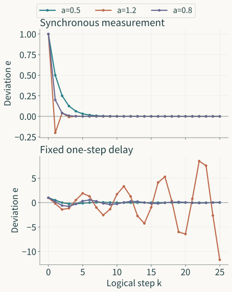

A new controller suppresses error faster in a synchronous test. In the existing system, one extra measurement delay makes error grow, while the old controller remains stable. Local improvement and system replacement give different answers.

Work through a construction. For stored-volume deviation near an operating point, scale time and flow appropriately and use an ideal integrator:

$$
e_{n+1}=e_n+u_n.
$$

Here $e_n\in\mathbb R$ is deviation at step $n$, and $u_n$ is the net deviation increment caused by flows over the next interval. Deviation may have either sign. Real capacity, pump saturation, and outlet details are omitted. These assumptions differ from essay II's orifice model and essay IV's no-inflow decay model. This construction examines replacement in feedback.

The controller receives $y_n$ and produces

$$
u_n=-a y_n,\qquad a>0.
$$

Its input-output rule is simple. Motion also depends on the step represented by $y_n$ and the interval in which $u_n$ acts.

## Why the Synchronous Test Supports the Candidate

Let $y_n=e_n$ and execute the increment in the current update interval. The connected system becomes

$$
e_{n+1}=(1-a)e_n.
$$

The old controller uses $a=0.5$, multiplying error by $0.5$ each step. The candidate uses $a=1.2$, multiplying it by $-0.2$. Candidate error alternates in sign but decreases in absolute magnitude by a smaller factor. Under a synchronous error-decay comparison, it is faster.

For common $e_0$, magnitudes are $0.5^n|e_0|$ and $0.2^n|e_0|$, both tending to zero. This compares closed-loop error in this connection; it does not also compare maximum pump command or other performance measures.

Both controllers take a number and return a number, making replacement look convenient. But measurement timing was fixed to the current step in this test. That timing is a premise of the recurrence.

## One Step of Delay Changes the Recurrence

Keep the existing data path, giving the controller the preceding measurement at step $n$: $y_n=e_{n-1}$. Then

$$
e_{n+1}=e_n-ae_{n-1}.
$$

The numbers and the correctly executed rule $u_n=-ay_n$ remain, but the system is now second order. Its future needs both $e_{-1}$ and $e_0$.

Substituting a response of the form $e_n=r^n$ gives

$$
r^2-r+a=0,
\qquad r_\pm=\frac{1\pm\sqrt{1-4a}}2.
$$

At $a=0.5$, the roots are $(1\pm i)/2$, both with modulus $\sqrt{0.5}<1$; every initial-deviation response tends to zero. At $a=1.2$, the conjugate roots have modulus $\sqrt{1.2}>1$. Arbitrarily small initial deviations can yield responses that fail to vanish and instead grow in oscillation amplitude. The synchronous decay conclusion does not transfer to this delayed context.

The failure is located precisely. Parameter reading and gain execution are correct. The test connects measurement to the current state; the existing system connects it to the previous state. Compatible numerical ports with a different time relation produce different feedback dynamics.

This also separates replay from feedback. Replaying measurements checks whether the controller produces increments by its rule; the next replayed measurement is already fixed. In the connected tank, an increment changes future measured deviation. Stability depends on how outputs alter subsequent inputs.

## Which System Property Must the Repair Preserve?

Allow two contexts: measurement is always synchronous or always delayed one step. Timing is fixed within a run, without arbitrary switching. Replacement should make error tend to zero for every initial deviation in these contexts.

Synchronous stability requires $|1-a|<1$, hence $0<a<2$. The delayed condition also follows directly from roots.

For $0<a<1/4$, both roots lie strictly between zero and one. At $a=1/4$, the repeated root is $1/2$; terms such as $n(1/2)^n$ still vanish. For $a>1/4$, roots are conjugate with modulus $\sqrt a$, below one exactly when $a<1$. The common stable range for both fixed timings is therefore

$$
0<a<1.
$$

The candidate $1.2$ lies outside it. Reducing the gain to $a=0.8$ restores stability. Its synchronous factor is $0.2$, retaining the candidate's fast absolute decay, while delayed roots have modulus $\sqrt{0.8}<1$.

There is a cost. Under delay, the old root modulus is $\sqrt{0.5}$ and the repaired one $\sqrt{0.8}$, giving slower asymptotic decay. If the required property is stability under both fixed timings, the repair has a proof. If delayed asymptotic decay must also be at least as fast as before, $0.8$ fails that requirement.

Replaceability now has definite content: which controller, which timings, and which property. Another choice is to make the data path synchronous and retain $1.2$, but that changes the context and requires checking the synchronization promise. Changing gain and changing timing are different repairs.

*Original theoretical responses with e₋₁=e₀=1. The upper panel is synchronous and the lower has a fixed one-step delay, with common initial history. Lines indicate sample order; there is no packet loss or switching delay.*

## Interfaces Give Assumptions an Address

Labeling both ports “real number” is insufficient. Input $y_n$ is operating-point deviation; output $u_n$ is net change over an interval. Measurement step, execution interval, and handling of stale measurements also specify the component.

These conventions make wiring checkable. Absolute height must be converted before a deviation controller uses it. An increment needs time and cross-section conversion before an actuator expecting flow per second can use it. An extra queued step breaks synchronization. An interface is the concrete boundary between component and environment.

Promises belong at that boundary. The controller can return $-ay_n$ for each received $y_n$; the measurement path can deliver the declared step's state; the actuator can apply the increment in the corresponding interval. Connected promises yield the recurrence whose stability was proved.[^contracts]

If only the controller's documentation promises synchronization while the measurement path does not provide it, the proof lacks a premise. To combine local guarantees, each environmental assumption needs a supporting component or operation. Diagram arrows connect values; contract conditions connect proofs.

The recurrence also separates determined behavior from stable behavior. Given initial values, both the old controller and unstable candidate uniquely determine each next value. The candidate amplifies responses rather than lacks a solution. Systems with instantaneous algebraic loops may separately require existence and uniqueness of joint behavior. Legal connections, determined behavior, and preserved goals have different objects of checking.

## Allowed Contexts Bound the Proof

The common range covers fixed zero- or one-step delay. Time-varying delay gives

$$
e_{n+1}=e_n-ae_{n-d_n},
\qquad d_n\in\{0,1\}.
$$

Stability of each fixed case does not by itself prove stability for all switching sequences. That question concerns consecutive combinations of update rules. A product requiring this condition needs a proof covering switching sequences, available history, and the target property; adding the two fixed examples is insufficient.

Real apparatus may also have saturation, packet loss, and noise. Using this stability result requires checking the ideal recurrence or an error relation sufficient to preserve the goal. Observation equivalence from [essay III](/en/posts/inside-the-model/) also becomes context-dependent: matching some standalone outputs need not preserve an entire feedback response.

Other components need checks fitted to their objects. Construct a stateful tool that increments a counter on every call and returns its value. After a timeout retry, the caller may receive only one response although the tool executed twice. Field names and numerical types remain compatible. To preserve “at most one increment per request,” examine request identity, execution state, and repeated calls; feedback gain conditions do not answer this replacement question.

## A Replacement Judgment with Grounds

The original proposal now permits distinct decisions. Keeping a data path that may have a fixed one-step delay requires rejecting $a=1.2$. Choosing $a=0.8$ preserves convergence under both declared fixed timings but loses the old delayed asymptotic decay speed. Keeping $1.2$ requires modifying and checking the synchronous path.

Each decision has grounds. The candidate's synchronous speed remains correct, and its delayed instability has a derivation. Repair reconnects local improvement, system conditions, and the property to preserve.

A model becomes a component through these relations for connection, comparison, and replacement. The [next essay](/en/posts/engineering-model-chain/) follows a real engineering system: what grounds do model proofs, program execution, and road trials each supply for operation and updates?

---

**Models and Engineering: the six core essays**

1. [How Mathematics Forms Problems](/en/posts/mathematical-language-and-problems/)
2. [How Models Refer to the World](/en/posts/from-observation-to-model/)
3. [What a Model Retains](/en/posts/inside-the-model/)
4. [Which Conclusions Survive a Model Change?](/en/posts/model-transformations/)
5. [How a Model Becomes a Component](/en/posts/model-as-open-component/)
6. [From Models to Engineering Judgment](/en/posts/engineering-model-chain/)

[^contracts]: Separating environmental assumptions and component guarantees is central to contract methods. See Albert Benveniste et al., *Contracts for System Design*, INRIA Research Report RR-8147, 2012, §VII-A, Definition 3, p.30. The synchronous and fixed-delay proofs here follow from our construction. [Report](https://inria.hal.science/hal-00757488).
