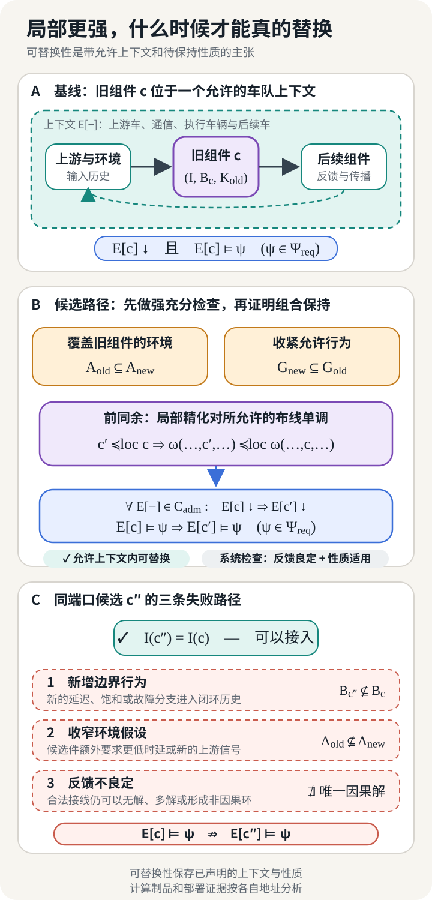

## 插头相同，为什么仍不能换

设想一支四车车队正在做版本升级。工程师准备把第二辆跟车上的控制模块换成候选版本。旧模块和新模块使用同一连接器，读取相同的 CAN 与 V2V 字段，输出同样范围内的期望加速度。候选版本已经跑完单车回放，间距跟踪误差还小了一些。若变更单只问“接口是否兼容”和“新版本是否更准”，这次替换已经可以签字。

实际变更的制品是控制模块；本文用于比较和资格化的组件对象则是升级前后的整辆受控车辆。未改动的通信栈、状态估计、低层执行器和车辆动力学作为共同实现留在这个边界内，因为它们与控制模块一起决定车队看见的消息和运动行为。

车队集成工程师仍然不能签字。原模块每 50 ms 发送一次 platooning control message，候选模块每 100 ms 才更新一次。消息中的字段、单位和编码都没有变化；接收方的邻车监视器却按 20 Hz 的协议等待消息，并在 150 ms 内没有收到新消息时发起 front split 或 back split。候选模块以 10 Hz 运行时，只要再丢一帧，消息间隔就可能拉到 200 ms，车队会按协议分裂。ENSEMBLE 的多品牌车队规范正好给出了这组时序：PCM 以 20 Hz 发送，邻车每 50 ms 期待更新，超时常数为 150 ms。[^ensemble-protocol]

字段表只记录瞬时数据的形状，这次系统差异存在于它没有完整表达的交互历史中。候选模块“能接上”，单车指标也更好，但原系统关于车队不断开、扰动不向后放大、安全距离得到保持的结论还没有随它一起过来。

替换因此是一条带条件的系统主张。我们需要说清楚候选替换了什么对象，哪些环境仍然允许接入，系统观察哪些行为，又希望保留哪些性质。随后还要检查局部关系在接线、反馈和隐藏内部信号以后是否继续成立。把这些条件省略掉，“可替换”就只剩一句无法复查的经验判断。

车队案例让这个问题显得尖锐，因为一辆车的动作会成为后车的输入。相同的困难也出现在协同仿真、概率感知和会调用外部工具的 agent 中。模型一旦嵌入已有系统，它便与上下文共同产生行为；比较两个孤立模型，只覆盖了替换判断的一小部分。

## 模型在边界处成为组件

先决定方框画在哪里。同一个车队控制问题至少有三种切法。方框可以只包住控制律，此时车辆动力学、状态估计器、通信栈和执行器都属于环境。方框也可以包住控制器与车辆，留下雷达观测、V2V 消息、管理命令和车辆运动作为外部接触面。再向外扩一层，整个车队成为一个组件，道路交通和调度系统才是它的环境。

每一种切法都合法，却回答不同的问题。更换一条控制律时，候选必须适配既有车辆；更换一辆受控车辆时，动力学和低层执行器已经进入候选组件；把整队交给上层调度时，车间通信和跟驰误差会成为内部变量。边界改变以后，“相同接口”和“保持行为”所指的对象也随之改变。

Herbert Simon 用近可分解性解释复杂系统为何有时适合分层研究：组件内部的作用在相关时间尺度上强于组件之间的作用，观察者才有理由暂时把一部分细节封装起来。这个理由具有尺度和用途。车辆控制器在毫秒级执行环里可以单独成件；研究车队遇到长下坡时，制动温升、车辆载荷与后车响应又可能迫使工程师扩大边界。[^simon]

本文把一个组件边界写成有类型签名

$$
I=(P,\operatorname{type},\operatorname{role},\operatorname{clock}).
$$

$P$ 是端口集合。$\operatorname{type}$ 记录值域、单位或量纲；$\operatorname{role}$ 区分输入、输出以及没有预设因果方向的物理端口；$\operatorname{clock}$ 保存连续时间、离散采样、消息新鲜度和允许的协议顺序。一个浮点数端口若缺少单位，米每秒与千米每小时都能通过内存布局检查。一个消息端口若缺少时钟，10 Hz 与 20 Hz 也会被当成同一种连接。

对车队中的第 $i$ 辆跟车，可以先写一个示意性的控制边界：

$$
u_i=
\pi_i\bigl(
d_i,\Delta v_i,a_{i-1}^{\mathrm{msg}},
x_i^{\mathrm{est}},r_i
\bigr).
$$

$d_i$ 是与前车的间距，$\Delta v_i$ 是相对速度，$a_{i-1}^{\mathrm{msg}}$ 是通信得到的前车加速度，$x_i^{\mathrm{est}}$ 是自车估计状态，$r_i$ 保存参考速度或目标时距，输出 $u_i$ 是期望加速度。这个式子只画出了控制律的函数接口。若替换对象是“受控车辆”，边界还要容纳传感器时间戳、消息序号、车辆长度、道路坡度、执行器请求、向后车广播的状态，以及加入、退出和故障模式。

端口的角色也不能全都压成软件函数的输入与输出。电气端口上的电压和电流、机械端口上的力和速度，通常通过守恒关系或功率共轭变量连接。把这样的物理连接强制定向，可能在模型组合时制造不存在的因果顺序。软件消息则常有清楚的发送方、接收方和协议状态。类型系统需要保留这种差异。

*图 1　端口匹配授权工程师写下接线关系。它没有给出闭环解、运行行为或系统保证。*

给定边界 $I$，令 $\operatorname{Tr}(I)$ 表示所有类型合法的边界历史。历史可以是连续轨迹、带时间戳的离散序列，也可以包含模式切换事件。一个确定性或非确定性的行为模型可先写成

$$
m=(I,\mathcal B_m),
\qquad
\mathcal B_m\subseteq\operatorname{Tr}(I),
$$

其中 $\mathcal B_m$ 收集组件允许出现的边界行为。内部状态方程、神经网络层、滤波器和求解器都可以生成这些历史；在当前观察边界下，只要投影后的允许行为没有变化，它们便可以具有不同的内部呈现。

若团队还要说明复用条件，可在行为模型外附一份局部契约 $K$：

$$
c=(m,K).
$$

$m$ 规定边界上可能发生什么，$K$ 规定环境满足哪些条件时组件承诺什么。一个尚未被切出开放边界的数学模型依然是完整模型。组件身份来自用途所选的接触面、允许连接和观察方式；方框图本身没有赋予它可复用性。

## 接线图是语法，行为是语义

把前车消息接到控制器，把控制器输出接到低层执行器，再把车辆运动送回雷达与后车。图纸上的线条先规定变量如何相等、转换、采样或守恒。只有满足这些关系的局部历史，才能共同构成一次系统运行。

设 $m_i=(I_i,\mathcal B_i)$ 是若干组件，$\omega$ 是接线方式。先建立容纳全部外部与内部端口的共同历史空间 $\operatorname{Tr}_\omega$；接线关系 $R_\omega\subseteq\operatorname{Tr}_\omega$，限制映射 $r_i:\operatorname{Tr}_\omega\to\operatorname{Tr}(I_i)$ 把全局历史送到第 $i$ 个组件边界。隐藏内部端口后，外部行为位于 $\operatorname{Tr}(I_{\mathrm{ext}})$，可写成

$$
\mathcal B_{\omega(m_1,\ldots,m_n)}
=
\operatorname{proj}_{\operatorname{Tr}(I_{\mathrm{ext}})}
\left(
R_\omega\cap\bigcap_i r_i^{-1}(\mathcal B_i)
\right).
$$

交集要求所有局部模型和接线关系对同一次运行给出相容描述，投影则忘掉外部观察者看不到的内部信号。把投影中的存在量词写开，这一操作更直观：

$$
b_{\mathrm{ext}}
\in\mathcal B_{\omega(m_1,\ldots,m_n)}
\quad\Longleftrightarrow\quad
\exists b_{\mathrm{int}},
\ (b_{\mathrm{ext}},b_{\mathrm{int}})
\in R_\omega\cap\bigcap_i r_i^{-1}(\mathcal B_i).
$$

一条外部历史被允许，意味着至少存在一组内部历史，使每个组件与全部接线同时成立。隐藏没有删除内部约束，只删除了观察者对具体内部见证的区分。若没有这样的见证，外部历史不会凭一张连线图产生。

Willems 的行为方法把动力系统描述为时间轴、变量空间与允许轨迹的组合。系统互联通过共享变量施加共同约束，latent variables 再由存在量词隐藏，留下 manifest behavior。这种写法绕开了“谁是输入、谁是输出”的预设，适合解释物理系统和反馈连接。[^willems] 本文使用的 $\mathcal B_m$ 沿用了这项纪律，但没有要求概率分布、优化排序或因果干预都无损地变成普通轨迹集合。

类型化 wiring diagram 给“方框怎样嵌套接线”提供了更系统的语法。Vagner、Spivak 与 Lerman 把带类型端口的方框和 wiring diagram 组织成 operad，并构造开放动力系统的代数：一个大接线可以由较小接线嵌套而成，语义运算随这种嵌套组合。[^wiring] 用本文的行为记号，这项要求写成

$$
\mathcal B_{\omega(m_1,\ldots,m_n)}
=
\mathsf A(\omega)
\bigl(\mathcal B_{m_1},\ldots,\mathcal B_{m_n}\bigr).
$$

左边是接线后组件的整体行为，右边是接线运算对各局部行为的作用。嵌套接线在相干同构意义下不依赖括号与层级展开。范畴论在这里管理组合的一致性；端口由谁选择、延迟上界取多少、哪项安全性质必须保持，仍由具体建模与工程任务决定。原论文中的系统具有定向端口、瞬时传线和显式状态；其他系统需要自己的语义代数。

*图 2　黑箱化通过“存在内部见证”保留接线约束，同时遗忘见证的具体取值。不同内部实现可以落到同一边界行为；这个合并依赖选定的语义与观察。*

被动线性电路给出了一个严格实例。Baez 与 Fong 把内部节点隐藏为端子上的电势—电流关系，并证明这种 black-boxing 保持电路接线；不同内部拓扑可以由此具有同一个外部关系。[^blackbox] 这一结论针对被动线性网络、指定端子和 Lagrangian relation，其他系统需要另建黑箱语义。

受控车辆的黑箱也会遗忘内部差异。一个版本用卡尔曼滤波，另一个版本用移动窗估计；只要二者在选定边界上允许相同的消息与运动历史，行为模型可以把它们合并。若后车依赖置信区间而旧边界只暴露点估计，两种实现之间的差异已经影响系统，却被边界选择藏了起来。黑箱是否合适，要由下一层观察和上下文检验。

## 黑箱相同，只相对于观察和上下文

候选控制器在回放台上收到一组固定的前车轨迹。它逐帧给出与旧控制器近似相同的加速度，团队于是积累了一批“二者行为相同”的记录。上车以后，加速度会改变本车位置；位置改变下一时刻的雷达间距，也改变后车收到的扰动。回放台把输入历史固定住，闭环系统会让组件参与生成未来输入。这两种实验放置组件的上下文不同。

这里先复用上一篇的观察思路。观察规格 $v$ 选择要保留的外部端口、时间尺度以及确定性的投影、聚合或查询；$\Omega_v$ 再把完整行为送入共同观察空间。两个模型在这项观察下的精确行为等价可以写成

$$
m\equiv_v m'
\quad\Longleftrightarrow\quad
\Omega_v(\mathcal B_m)
=
\Omega_v(\mathcal B_{m'}).
$$

若 $v$ 只保留 10 Hz 的期望加速度，内部 2 ms 调度抖动可能被滤掉；若系统性质涉及截止时间，同一抖动便必须留在观察中。若查询只检查平均间距误差，短时的危险接近也可能消失。所谓“同一个黑箱”由保留项定义；近似可替换还要另给误差传播与用途阈值，不能由这项精确等价顺手推出。

有限回放只比较测试集覆盖的历史。上下文可替换要求更强的量词。令 $E[-]$ 表示留有一个组件空位的系统，$\mathcal C_{\mathrm{adm}}$ 是允许的上下文族，则观察等价可以提升为

$$
\forall E[-]\in\mathcal C_{\mathrm{adm}},
\qquad
\Omega_v\!\left(
\mathcal B_{E[m]}
\right)
=
\Omega_v\!\left(
\mathcal B_{E[m']}
\right).
$$

$\mathcal C_{\mathrm{adm}}$ 不需要容纳所有想象得到的世界。工程师可以把它限定为一车前视拓扑、给定速度域、规定的通信延迟与丢包包络，以及通过相容性检查的邻车。量词必须覆盖变更声明所承诺的使用范围。若测试只覆盖一支四车队列，证据便不能自动扩张到任意长度、重排和分裂后的队列。

Hennessy 与 Milner 在并发进程中把观察等价与代入上下文联系起来。等价关系只有在语言的组合算子下构成 congruence，工程师才可以把等价进程放进更大表达式而保持观察结果。[^context-equivalence] 本文把这项思想移到工程组件：替换是一条反事实条件陈述，意思是“若在允许上下文里改用候选，所选观察或性质仍成立”。这里的上下文族、物理域和误差标准是工程扩展，不能从并发进程的原定理中直接取得。

这也澄清了边界的哲学地位。组件边界是一项为了推理而作的切分，黑箱化是一项带保留项的遗忘。对象本身不决定唯一、与用途无关的黑箱规格。团队选择哪些交互留在边界上，再用实验或证明说明被隐藏差异不会改变当前用途下的结论。两个控制器在同一回放集上给出相近命令，既可能源于共同捕捉了车辆动力学，也可能只是测试没有激发它们的差异。

观察关系把“看起来一样”收紧为可核查的声明，却还没有分配责任。候选控制器在低延迟网络中表现更好，只说明一组行为事实。工程师还需写明低延迟由谁保证，以及网络越过边界后控制器承诺怎样变化。

## 契约让保证带着条件说话

设旧控制器在通信时延不超过 50 ms、消息以 20 Hz 到达、执行器滞后落在给定区间时，保证相邻车辆的传播增益不超过 $0.9$。候选控制器把增益降到了 $0.7$，但证明只覆盖时延不超过 20 ms。单看保证数字，候选更强；放回原环境后，20 ms 到 50 ms 的输入历史失去了任何承诺。

Benveniste 等人的契约元理论把一份契约写成

$$
K=(\mathcal E_K,\mathcal I_K),
$$

$\mathcal E_K$ 是合法环境集合，$\mathcal I_K$ 是合法实现集合。环境集合非空给出 compatibility，实现集合非空给出 consistency。精化应当减少允许实现，同时扩大能够接纳的环境。这个方向先于某一种具体的假设语言。[^contracts]

为了沿车队案例计算，本文采用固定边界行为全集上的假设—保证特例：

$$
K=(A,G),
\qquad
A,G\subseteq\operatorname{Tr}(I).
$$

$A$ 与 $G$ 都是完整边界历史上的谓词或子集；$A$ 主要约束环境控制的坐标，$G$ 则约束组件负责的坐标或整条联合历史。行为模型 $m=(I,\mathcal B_m)$ 满足契约，当且仅当

$$
m\models K
\quad\Longleftrightarrow\quad
\mathcal B_m\cap A\subseteq G.
$$

组合时，各局部谓词先沿端口映射提升到同一个全局历史空间。不同契约理论会用状态机、时序逻辑、概率界或资源预算表达 $A$ 与 $G$，也会采用不同的饱和及组合运算。这里需要的是条件推理的方向：环境历史落入 $A$ 时，组件行为必须落入 $G$。

在共同 alphabet、共同性质全集和规范化表示下，一组便于检查的较强充分条件是

$$
A_{\mathrm{old}}\subseteq A_{\mathrm{new}},
\qquad
G_{\mathrm{new}}\subseteq G_{\mathrm{old}}.
$$

左式让候选接受旧组件能够接受的全部环境，并且可以多接一些；右式让候选承诺的行为范围收窄，因此足以推出候选精化旧契约。它不是任意契约表示下的充要定义。前述 20 ms 候选没有满足左式，即使它在窄域内给出更小的传播增益，也不能替代覆盖 50 ms 时延的旧控制器。若团队愿意把允许环境同步缩窄到 20 ms，还要把网络、监测和回退一起纳入新的系统变更，而不能把它登记为局部等价替换。

接口自动机把同一责任方向写进动作语义：输入表达环境选择，输出由组件负责，alternating refinement 因而要求新组件少限制输入、多约束输出。[^interface-automata]

契约进入组合后，单个 $G_i$ 不能悬空使用。对第 $i$ 个组件，外部假设、接线关系和伙伴组件的保证需要共同推出它的假设：

$$
R_\omega\land A_{\mathrm{ext}}
\land\bigwedge_{j\ne i}G_j
\models A_i.
$$

全部局部保证连同接线关系还要推出所需系统保证：

$$
R_\omega\land A_{\mathrm{ext}}
\land\bigwedge_iG_i
\models G_{\mathrm{sys}}.
$$

这两行是待证明的义务，不是可以循环套用的证明规则。无环连接可按拓扑顺序，用已经建立的伙伴保证逐项闭合假设；反馈连接则需要带初始情形和归纳不变量的时序 assume–guarantee 规则，或一条独立的非循环全局闭合引理。否则 $A_1=G_2$、$A_2=G_1$ 只是在互相预支结论。假设闭合失败时，局部证明仍可以保持数学正确，只是它的前提没有在当前组合中兑现；系统推论缺失时，若干局部保证也可能共同留下无人承担的车队末端扰动上界或失联分裂性质。

*图 3　保证是一项条件承诺。组合证明既要为每个局部假设找到来源，也要建立局部保证到系统性质的推理；图中箭头是待证义务，不是循环引用结论的许可。*

时延、丢包、执行器能力和拓扑可以写进车队契约；工程师仍要选择可测的运行判据。若 $A$ 写着“网络状况良好”，监测器无法判断何时触发回退。若时延上界写成 20 ms，则时间戳语义、测量点和越界处理都应当进入契约或其实现记录。契约的价值来自可兑现的条件，不来自把普通需求改写成集合符号。

## 局部精化怎样穿过组合

候选已经保持端口，契约也比旧版本更宽容。车队工程师仍需确认接线后的方程有解，并且局部精化在所用组合运算下保持。契约相容性回答“存在可接受环境吗”，反馈良定性回答“每个外部激励是否产生唯一且因果的内部响应”。

考虑反馈连接

$$
u=\Delta(y)+d_u,
\qquad
y=G(u)+d_y,
$$

并定义

$$
\Phi(u,y)=
\bigl(u-\Delta(y),\,y-G(u)\bigr).
$$

这里 $G$ 与 $\Delta$ 作用在相容的扩展信号空间上。在 Megretski 与 Rantzer 使用的控制论定义中，互联良定要求 $\Phi^{-1}$ 存在且因果；给定外部扰动 $(d_u,d_y)$ 后，内部信号 $(u,y)$ 才唯一并且不能依赖未来。若进一步声称 $L_2$ 稳定，$\Phi^{-1}$ 还须在 $L_2$ 上具有有限诱导增益。[^well-posedness] 因而，一张合法接线图和两份非空契约还没有完成闭环分析。

两个标量端口已经足以制造反例。接线

$$
y_1=y_2,
\qquad y_2=y_1
$$

拥有无穷多组解；改成

$$
y_1=y_2+1,
\qquad y_2=y_1
$$

则没有解。两组方程在类型层都只连接标量端口，接口检查不会报告单位或角色冲突。闭环求解语义决定系统是否能运行。

令 $c$ 为原组件，$c'$ 为候选组件，$\Psi_{\mathrm{req}}$ 是要保持的性质集。以 $X\downarrow$ 表示组合对象 $X$ 良定，本文把上下文替换目标定义为

$$
c'\sqsubseteq_{\mathcal C_{\mathrm{adm}},\Psi_{\mathrm{req}}}c
\quad\Longleftrightarrow\quad
\forall E[-]\in\mathcal C_{\mathrm{adm}},
\quad E[c]\downarrow\Rightarrow
\left(
E[c']\downarrow
\ \land\
\forall\psi\in\Psi_{\mathrm{req}},\quad
E[c]\models\psi\Rightarrow E[c']\models\psi
\right).
$$

定义中的上下文族、性质集和满足关系必须分别落地。$\mathcal C_{\mathrm{adm}}$ 列出允许出现的系统环境，$\Psi_{\mathrm{req}}$ 列出此次变更必须保持的性质，$\models$ 则采用与性质相配的判断。基线组合良定时，候选组合既要良定，也要保留基线已经满足的目标性质。在车队中，这可以是轨迹包含或诱导增益；换到其他语义类型，满足关系也随之改变。

局部精化若要支持模块化推理，还需对所用布线形成前同余：

$$
c'\preceq_{\mathrm{loc}} c
\quad\Longrightarrow\quad
\omega(\ldots,c',\ldots)
\preceq_{\mathrm{loc}}
\omega(\ldots,c,\ldots).
$$

这里的“所用布线”很重要。隐藏、重命名、串联、并行与反馈各自改变语义，局部契约精化是否单调，需要针对实际组合算子证明。上面的上下文关系只有在 $\mathcal C_{\mathrm{adm}}$ 对相应组合封闭时才形成前同余；它与局部精化不是同一个关系。输入／输出自动机的研究给出了特定算子下的保持定理，也留下过在更一般非确定情形中需要修正的边界。[^precongruence]

*图 4　集合包含给出一组局部强充分检查；上下文替换还要求局部关系穿过允许的组合，并分别保持反馈良定性与目标系统性质。*

这一定义也限制了“所有上下文”的夸张读法。允许上下文由用途和契约划定。若原组件只承诺高速公路恒定时距跟驰，候选无需在矿区低速编队、城市切入和赛车场景中逐一等价。反过来，工程师不能在验证时只留一组方便的邻车，再在部署说明中声称车辆可以任意编组。

上下文关系首先约束语义模型；若变更还触及生成代码、处理器或车辆，计算制品与部署实例也要按各自地址复验。前同余无法替新处理器完成截止时间测试，也无法替新制动系统测量响应滞后。

## 换掉车队里的那一辆

现在把候选受控车辆放回原来的第二个跟车位置。以下把 ENSEMBLE 规范、异构 ACC 分析、CACC 拓扑研究与嵌入式 MPC 结果分别填入一张构造性变更单，每项来源只承担对应的证明义务。候选边界包含控制器、通信栈、状态估计、低层执行和车辆动力学；消息到达与车辆响应构成连续因果链，扰动传播和安全性质需要在整队上求值。

### 消息的时间属于端口语义

ENSEMBLE 的多品牌 platooning control message 携带位置、航向、车辆长度、站点身份、生成时间与序号，也携带预测和当前纵向加速度、速度及道路坡度等信息。规范特别指出，位置和航向只有结合消息年龄才有意义；延迟可以存在，但接收方必须知道它有多大。预测加速度延迟最低，接收方还应监测其可靠性。[^ensemble-spec]

同一消息中的数据可能来自不同刷新周期。CAN 信号通常比 GNSS 更新快，给整包消息附一个时间戳会掩盖各字段的真实年龄。ENSEMBLE 在七品牌测试后的反馈中提出按相近刷新周期设置多个时间戳的需要。它还指出 50 ms 周期与 150 ms 超时允许两帧丢失而不立即超时；若某项 split status 只发送一次，这项状态可能在没有警告的情况下丢失。字段存在、字段在何时有效、丢失后如何保持或重发，合起来才构成通信端口。

因此，开篇的 10 Hz 候选同时改变了周期和故障轨迹。它可以在无丢包时持续送出可解析消息，却没有满足 20 Hz 协议；一帧丢失又会把间隔拉过 watchdog。若接收方随后发起 split，车队拓扑改变，原来在固定队列中证明的传播关系也需要重新求值。时序故障没有停留在通信层。

### 车辆参数进入传播通道

同一控制公式落在不同车辆上，会与传感延迟和执行器滞后共同形成新的闭环。Wang 等人为异构 ACC 车队采用三阶纵向模型：

$$
\dot x_i=v_i,
\qquad
\dot v_i=a_i,
\qquad
\dot a_i=\frac{u_i-a_i}{\tau_i},
$$

其中 $\tau_i$ 表示动力或制动执行链的滞后。控制器读取延迟 $\xi_i$ 之前的间距与速度：

$$
u_i(t)=
f\!\left(
s_i(t-\xi_i),v_i(t-\xi_i),v_{i-1}(t-\xi_i)
\right).
$$

在线性恒定时距控制器中，

$$
u_i=
k_{v,i}(v_{i-1}-v_i)
+k_{s,i}(s_i-t_{d,i}v_i-s_0),
$$

相应的误差传播通道含有全部这些参数：

$$
H_i(s)=
\frac{
(k_{v,i}s+k_{s,i})e^{-\xi_i s}
}{
\tau_i s^3+s^2+
(k_{v,i}+t_{d,i}k_{s,i})se^{-\xi_i s}
+k_{s,i}e^{-\xi_i s}
}.
$$

传感滤波变慢、制动执行器响应改变或目标时距重新设定，都会改变 $H_i$。Wang 等人的分析说明同时忽略传感延迟与执行器滞后可能高估控制性能，并为线性化的非联网 ACC 模型给出异构串稳定的充分条件和仿真验证。[^wang] 这些公式可以揭示参数域如何进入替换条件；它们没有覆盖联网 CACC 的协议故障、实车道路行为和紧急制动非线性。

### 完整乘积通过，前缀与分裂仍可能失败

令 $E_i$ 是第 $i$ 个跟车位置上的间距误差，并写成

$$
E_i(s)=H_i(s)E_{i-1}(s),
\qquad
\|H_i\|_{\mathcal H_\infty}\le\gamma_i.
$$

稳定因果 LTI 通道在平衡初值下串联，诱导范数的次乘性给出

$$
\|E_n\|_2
\le
\left(\prod_{i=1}^{n}\gamma_i\right)
\|E_0\|_2.
$$

这条推导给出两种力度不同的替换资格。若允许上下文中的每个通道都满足 $\gamma_i\le1$，候选通道稳定且 $\gamma_k'\le1$，逐车不放大的性质可以沿同类串联保持。若团队只验证

$$
\gamma_k'
\prod_{i\ne k}\gamma_i
\le1,
$$

它得到的是完整队列的 head-to-tail 上界。截短会删去乘积中的因子；若只是把同一组位置无关的标量 $\gamma_i$ 重新排序，总乘积不变，但各段前缀乘积和放大发生的位置会改变。更一般地，若 $H_i$ 依赖邻车、位置或运行模式，重排还会重新定义因子本身。完整乘积因此不能单独推出任意前缀或分裂后的保证。

Wang 等人的 Figure 4(b,e) 把差别画得很具体。三个跟车采用的 $(k_s,k_v,t_d)$ 依次为

$$
(0.6,0.8,1.2),\qquad
(0.4,0.6,1.0),\qquad
(0.7,0.8,1.4).
$$

中间跟车的局部通道会放大扰动，最后一辆跟车再把它衰减，因此完整四车队列的 head-to-tail 条件成立。若队列在中间跟车之后分裂，新的末端失去了原来负责衰减的后车。这项记录支持完整队列的端到端上界，却不能单独支持任意分裂点或任意前缀的保证。

### 新信号会换掉拓扑和保证

候选控制器还可能靠更多信息得到更好的局部指标。[上一篇](/posts/engineering-model-chain/)已经借 Ploeg 等人的齐次连续时间 LTI 车队展开一车前视与两车前视的不同串稳定判据。这里保留它对替换问题的新结论：第二前车消息会增加端口元数，扩大环境必须提供的信息，并改变系统所比较的传播通道。[^ploeg] 这种候选可以构成新的车队设计，却不是原来单前车组件契约下的一次局部精化。

拓扑还影响共同原因。两个上游消息可能来自同一次领导车动作，不能当作独立扰动后分别套用单输入界。通信断开后从 CACC 切到 ACC，控制器、可用端口和保证都会一起变化。模式切换需要为每个模式及切换轨迹给出新的行为和契约，不能沿用连接状态下的一条频域曲线覆盖全部运行。

### 传播性质与安全包络分别落账

扰动沿队列不放大，并没有给出任意时刻的最小间距。车辆可以在所有跟车之间保持较小的 $L_2$ 误差，同时因一个短时制动峰值越过安全界；执行器饱和、切入和轮胎附着也位于线性通道之外。

ENSEMBLE 对 Platooning Support Function 分开写下这些责任。驾驶人选择的目标时距通常在 1.4 s 到 1.6 s，系统实现的时距不得低于 0.8 s；稳态跟驰另有不放大速度扰动的要求。未完成碰撞警告序列时，初始制动请求限制在 $-3.5\,\mathrm{m/s^2}$；更强制动还要由额外传感器验证风险。规范另行讨论制动温度、轮胎类型和磨损、载荷及路面条件怎样改变制动能力。[^ensemble-spec]

这些要求可以共同出现在一份系统契约中，却不能相互替代。$\|H_i\|_\infty$ 负责一类传播历史，0.8 s 下界约束峰值间距，制动与告警规则约束模式转换和执行器动作。候选若改善传播增益却需要更大的瞬时制动，系统仍需检查它是否留在 PSF 的物理包络中。

### 同一数学关系会被运行时改写

Ibrahim 等人的多层车队 MPC 展示了模型进入计算制品后的变化。上层以 10 Hz 接收前车消息并求解分布式 MPC，下层状态反馈每 2 ms 运行。研究团队用 Fast Gradient Method 求解，把固定矩阵提前计算，再从 MATLAB 生成 C 代码，部署在四台 Cohda MK5 上。连续到离散变换采用近似，特征值计算调用 GNU Scientific Library。[^ibrahim]

嵌入结果与理论版本出现了可定位的差异。V2V 消息带时间戳，后车据此估计信息年龄并预测前车当前状态；预测假设前车使用相同的下层控制器，并把当前加速度视近期望加速度。丢包时，上层保持上一期望加速度。设备运行 Ubuntu 而非 RTOS，下层线程偶尔延迟，模拟车辆状态便短暂“冻结”。换掉下层算法、调度周期或操作系统，会同时改变预测前提和实时行为。

这组实验支持嵌入实现的可行性分析，四台设备模拟的是车辆状态。实车动力学、道路扰动和真实传感器仍需另行取证。形式通道保持时，新的代码生成、依赖库和处理器也会改变资格化地址。旧证明可以复用未受影响的数学步骤，旧二进制的截止时间测试不能转交给新二进制。

### 正面替换需要怎样的通过条件

ENSEMBLE 的 white-label truck 给出了现实中的组合路径。项目把多品牌车辆共享的战术层、状态与属性交换、V2X 协议写成共同规格，同时允许 OEM 各自实现纵向控制、传感器和制动系统。能力信息也参与组合：车辆把最大加速度请求和期望最高车速等限制沿车队传播，上游可以按最受限车辆调整队列动作。项目完成了七品牌 Platooning Support Function 的实现、测试和评估。[^ensemble-spec]

这个结果支持多品牌车辆在共同协议、能力传播和系统测试约束下互操作。证据的地址是通过项目测试的七品牌 Platooning Support Function；任意 schema-compatible 控制器的热替换仍需完成上述局部精化和组合证明，任意车队长度也需要独立量词。项目对 Platooning Autonomous Function 的相关部分只给出理论规格，证据范围与已经实施的 Support Function 分开。

对当前候选车辆，工程师可以写出一份可审核的通过条件。候选保持带时钟的外部边界；车辆与执行器实现落在原契约声明的动力学包络；它接受不少于旧组件的时延、丢包与道路环境，局部传播、约束和回退保证精化旧契约。这些关系还要在允许的一车前视布线及拓扑切换中保持，系统另行满足时距与制动包络。随后，团队对改动过的代码、ECU、通信配置和车辆完成相应复验。每一项结论由此获得自己的对象地址。

## 把替换判据带到其他系统

车队使用连续动力学、时序消息和频域增益，容易让人误以为这套思路只属于控制理论。换到三类系统以后，端口、行为、契约和上下文量词仍然有用；需要更换的是边界语义以及待保持的性质。

### FMI：同一标量端口，闭环可以没有解

两个 FMU 通过标量输出形成代数环：

$$
y_A=f_A(y_B),
\qquad
y_B=f_B(y_A).
$$

取 $f_B(z)=z$。旧组件使用 $f_A(z)=z/2$，联立后只有 $y_A=y_B=0$。候选组件保持同一标量端口，却改用 $f_A'(z)=z+1$，闭环要求

$$
y=y+1,
$$

因此没有解。类型检查允许接线，组合方程拒绝这次替换。

FMI 3.0.2 为 algebraic loop、迭代依赖和 FMU state 的保存／恢复提供元数据与机制。协同仿真 importer 可能在一步失败后回滚各 FMU，再缩短步长重算。候选若不支持所需的 get/set FMU state 能力，原来的回滚算法便无法工作，即使变量名、类型和 causality 属性都兼容。标准描述可用机制，不替具体模型证明闭环存在唯一解，也不保证迭代收敛。[^fmi]

这个例子把良定性从控制系统带到协同仿真。替换声明需要包含 importer 策略、代数环求解方式和状态恢复能力；只比较 FMU 的变量表会漏掉决定运行成败的组合语义。

### 概率感知：confidence 的数值需要分布语义

一个 LiDAR 检测器输出类别、三维框和 confidence。候选网络保持完全相同的张量形状，平均检测精度也接近旧版本。令 $Y$ 为真实类别、$\hat Y$ 为预测类别、$\hat P$ 为预测置信度。下游规划器若把 confidence 当作事件概率，它依赖的契约还包含校准：在部署分布 $D$ 上，理想化的分类校准写成

$$
\Pr_D(\hat Y=Y\mid\hat P)=\hat P
\qquad D\text{-a.s.}
$$

在有限数据的置信度分箱中，这意味着落入 $0.9$ 附近的预测约九成正确。目标检测中的“正确”还取决于匹配与 IoU 规则；Feng 等人因此分别研究分类与框回归校准，并显示检测准确率与不确定性质量需要分开评估。Ovadia 等人又发现，分布偏移增大时，若干方法的校准会退化，温度缩放也无法在偏移数据上维持其 IID 条件下的校准表现。[^calibration]

于是，同一 schema 只说明规划器读得到 class、box 和 confidence。候选是否可替换，还取决于 $\hat P$ 的语义、校准所针对的分布，以及系统使用哪一段尾部风险。若旧契约承诺给定分布族上的校准误差上界，新模型需要在同一分布族和评价规则下精化它。一次 IID 测试集上的平均准确率无法替代这项条件。

这里的边界语义应是历史上的概率律或随机核，契约则使用校准、覆盖率或任务选定的风险量。失校准怎样变成车辆风险，还要经过规划与车辆动力学的闭环传播。

### 工具型 agent：响应相同，现实状态可能多改一次

设 agent 调用 `create_ticket`。请求和响应都通过同一 JSON schema，旧服务还按 `request_id` 去重。第一次请求已经创建工单，但响应在网络中丢失；客户端不知道服务端是否执行，于是重试。旧服务识别相同 `request_id`，只保留一张工单。候选服务返回同样格式的成功响应，却没有幂等处理，第二次调用又创建一张工单。

工具的边界语义因此至少要写成状态转移核

$$
T(\,\cdot\mid s,x)
\in
\mathcal P\!\left(S\times(Y\sqcup E)\right),
$$

$S$ 是外部状态空间，$X$ 是请求空间，$Y$ 与 $E$ 分别是响应和错误空间；给定 $(s,x)\in S\times X$，该核为调用后状态与结果赋予分布。部分失败即使返回错误也可能已经改变 $S$。若只用 $X\to Y$，两种服务可以看起来相同；把状态变化和失败轨迹加入观察，重复工单便成为可见差异。

MCP 的工具 input/output schema 规定参数与结构化输出的形状，`idempotentHint` 等 annotation 为客户端提供提示；规范同时提醒客户端不能把 annotation 当作可信保证。HTTP 语义也把自动重试与方法幂等性联系起来，因为客户端可能不知道一次失败前服务器处理了多少请求。[^tool-semantics] 替换一个具有现实副作用的工具，需要检查重试、去重、权限与部分失败。这个构造性反例说明协议字段无法独自承担状态转移契约，并不声称某个具体 MCP 服务已经发生重复建单事故。

FMI 的失败落在方程是否有解，概率感知的失败落在分布承诺，工具调用则改变系统外部状态。三者使用不同语义对象，却都要求替换主张穿过实际组合。

### 工程模型的三个视角

这个系列对工程模型做了三次缩放。[《从模型到工程系统》](/posts/engineering-model-chain/)沿现实、要求、计算、部署和证据之间的关系移动；[《模型内部有什么》](/posts/inside-the-model/)打开模型，区分有类型签名、形式呈现、语义实例、观察与表征；本文把已划定边界的模型放在一起，研究布线、契约和替换。三种视角可以递归使用：车队是交通系统里的组件，受控车辆内部又包含估计器、控制器和执行器组件。

最短的替换声明可以写成：

> 在允许上下文族 $\mathcal C_{\mathrm{adm}}$ 和性质集 $\Psi_{\mathrm{req}}$ 下，候选满足 $c'\sqsubseteq_{\mathcal C_{\mathrm{adm}},\Psi_{\mathrm{req}}}c$；局部精化由实际布线保持，变化的计算与部署关系另行复验。

这条声明必须能够展开成组件边界、假设与保证、组合算子、反馈良定性、观察规格、性质和证据地址。开篇那只看似相同的插头没有授权替换，因为 50 ms 与 100 ms 的差异会沿这些关系穿过 watchdog、拓扑和整队性质。接口的可复用性来自这组关系：它能指出哪些证明仍然成立，哪些部分必须重做。

---

[^ensemble-protocol]: Boris Atanassow et al., *[Platooning Protocol Definition and Communication Strategy](https://publications.tno.nl/publication/34640511/YQUtYF/atanassow-2022-platooning.pdf)*, ENSEMBLE Deliverable D2.8, 2022，Section 4.2, pp. 31–32；Section 4.4.5, pp. 44–46，尤其是 `PCM_TIMEOUT = 150 ms` 与 REQ_V2V_040–044。该文档给出协议和状态机要求，不承担控制稳定性证明。

[^simon]: Herbert A. Simon, “[The Architecture of Complexity](https://doi.org/10.2307/985254),” *Proceedings of the American Philosophical Society* 106(6), 1962, pp. 474–475。本文只借其近可分解性说明边界相对于作用强度和时间尺度，不把层级分解视为所有系统的既定事实。

[^willems]: Jan C. Willems, “[The Behavioral Approach to Open and Interconnected Systems](https://doi.org/10.1109/MCS.2007.906923),” *IEEE Control Systems Magazine* 27(6), 2007, pp. 51–54、62–64、70–72。行为核、互联和 latent／manifest 投影来自这些部分；本文的通用迹记号不覆盖所有概率、优化或因果语义。

[^wiring]: Dmitry Vagner, David Spivak and Eugene Lerman, “[Algebras of Open Dynamical Systems on the Operad of Wiring Diagrams](https://tac.mta.ca/tac/volumes/30/51/30-51.pdf),” *Theory and Applications of Categories* 30, 2015, Definition 2.7、Definition 3.1、Proposition 3.11、Definition 4.2、Proposition 4.5, pp. 1797–1814。

[^blackbox]: John Baez and Brendan Fong, “[A Compositional Framework for Passive Linear Networks](https://tac.mta.ca/tac/volumes/33/38/33-38.pdf),” *Theory and Applications of Categories* 33, 2018, pp. 1163–1164，Definition 7.3.1 与 Theorem 7.3.2, p. 1213。其黑箱函子适用于被动线性网络及文中指定的关系语义。

[^context-equivalence]: Matthew Hennessy and Robin Milner, “[Algebraic Laws for Nondeterminism and Concurrency](https://www.scss.tcd.ie/matthew.hennessy/pubs/old/HMjacm85.pdf),” *Journal of the ACM* 32(1), 1985, pp. 137–139、143–144。原文讨论有限并发进程；本文据此提出工程上下文族中的替换目标。

[^contracts]: Albert Benveniste et al., *[Contracts for System Design](https://inria.hal.science/hal-00757488)*, INRIA Research Report RR-8147, 2012, pp. 25–27、30，Definitions 1、3，Properties 1、3，Eqs. (10)–(14)。正文的 $(A,G)$ 是固定迹性质全集上的特例。

[^interface-automata]: Luca de Alfaro and Thomas A. Henzinger, “[Interface Automata](https://doi.org/10.1145/503209.503226),” *ESEC/FSE 2001*, pp. 113–118，Definitions 1–15、Theorems 3–4。本文只使用输入／输出责任与乐观相容性的直觉；原始理论在一般非确定情形中的边界不被外推。

[^well-posedness]: Alexandre Megretski and Anders Rantzer, “[System Analysis via Integral Quadratic Constraints](https://doi.org/10.1109/9.587335),” *IEEE Transactions on Automatic Control* 42(6), 1997, Section II, p. 821。因果可逆与有界性分别承担良定性和稳定性。

[^precongruence]: Paul C. Attie and Nancy A. Lynch, “[Dynamic Input/Output Automata: A Formal and Compositional Model for Dynamic Systems](https://doi.org/10.1016/j.ic.2016.03.008),” *Information and Computation* 249, 2016, Theorems 17–18；Walter Vogler and Gerald Lüttgen, “[A Linear-Time Branching-Time Perspective on Interface Automata](https://doi.org/10.1007/s00236-020-00369-4),” *Acta Informatica* 57, 2020, Theorems 45、54、57。两者用于校准“前同余需按组合算子证明”的力度。

[^ensemble-spec]: Edoardo Mascalchi et al., *[Final Version Functional Specification for White-label Truck](https://publications.tno.nl/publication/34640520/7W6Wtu/mascalchi-2022-final.pdf)*, ENSEMBLE Deliverable D2.5, 2022。PSF 的七品牌实现、测试、评估及 PAF 的理论规格边界见 Executive Summary, pp. 8–9 与 Section 3, pp. 53–55；共同功能与 OEM 特定实现见 Section 2.1.2, pp. 16–20；能力传播与消息语义见 Sections 2.3.2–2.3.4, pp. 22–28；纵向控制要求见 Section 2.5.4, pp. 46–50；多时间戳和丢包反馈见 Sections 3.2.5–3.2.6, pp. 54–55；制动影响因素见 Tables 11、13, pp. 79–87。

[^wang]: Meng Wang et al., “[String Stability of Heterogeneous Platoons with Non-connected Automated Vehicles](https://doi.org/10.1109/ITSC.2017.8317792),” *2017 IEEE 20th International Conference on Intelligent Transportation Systems*, Sections II、III.F，Eqs. (24)–(30)；Section IV.A–C，Eqs. (31)–(40)、Figure 4(b,e)。论文给出线性化非联网 ACC 的充分条件和仿真，不是 CACC 道路验证。

[^ploeg]: Jeroen Ploeg et al., “[Controller Synthesis for String Stability of Vehicle Platoons](https://doi.org/10.1109/TITS.2013.2291493),” *IEEE Transactions on Intelligent Transportation Systems* 15(2), 2014, Sections II–V、Definition 1、Eqs. (18)、(20)、Conditions (19)、(21)。判据以 Assumption 1、$\|P_1\|_{\mathcal H_\infty}<\infty$、所需传递矩阵逆存在及对所有 $i\ge2$ 成立为前提；分析采用齐次连续时间 LTI 模型和固定通信时延。

[^ibrahim]: Amr M. E. Ibrahim et al., “[Multi-layer Multi-rate Model Predictive Control for Vehicle Platooning under IEEE 802.11p](https://doi.org/10.1016/j.trc.2020.102905),” *Transportation Research Part C* 124, 2021, article 102905, Sections 10.1–10.5, pp. 28–31。四台 Cohda MK5 在 HIL 中模拟车辆状态，支持嵌入可行性分析，不是实车道路证据。

[^fmi]: Modelica Association, *[Functional Mock-up Interface Specification 3.0.2](https://fmi-standard.org/docs/3.0.2/)*, Sections 2.2.4、2.2.7.4、2.2.9、2.2.11、2.4.2、4.1、4.2.1。规范给出代数依赖、缩步重算、FMU state 保存／恢复与能力标志，不证明具体协同仿真的良定性或收敛。

[^calibration]: Chuan Guo et al., “[On Calibration of Modern Neural Networks](https://proceedings.mlr.press/v70/guo17a.html),” *ICML 2017*, Section 2, Eq. (1)；Di Feng et al., “[Can We Trust You? On Calibration of a Probabilistic Object Detector for Autonomous Driving](https://arxiv.org/abs/1909.12358),” arXiv:1909.12358, 2019, Sections III–IV，Eqs. (2)–(3)，Section VI-A，Figures 2–3；Yaniv Ovadia et al., “[Can You Trust Your Model’s Uncertainty? Evaluating Predictive Uncertainty Under Dataset Shift](https://proceedings.neurips.cc/paper/2019/hash/8558cb408c1d76621371888657d2eb1d-Abstract.html),” *NeurIPS 2019*, Section 4.2、Figures 2–3。它们分别支持分类校准、概率目标检测的分类／回归校准和分布偏移下的校准退化，不直接建立碰撞风险。

[^tool-semantics]: Model Context Protocol, *[Tools, specification revision 2025-11-25](https://modelcontextprotocol.io/specification/2025-11-25/server/tools)*，以及同版本 *[Schema Reference: Tool and ToolAnnotations](https://modelcontextprotocol.io/specification/2025-11-25/schema#tool)*；IETF, *[RFC 9110: HTTP Semantics](https://www.rfc-editor.org/rfc/rfc9110#section-9.2.2)*, Section 9.2.2。MCP annotations 是提示而非可信保证；重复建单是本文构造的反例。
