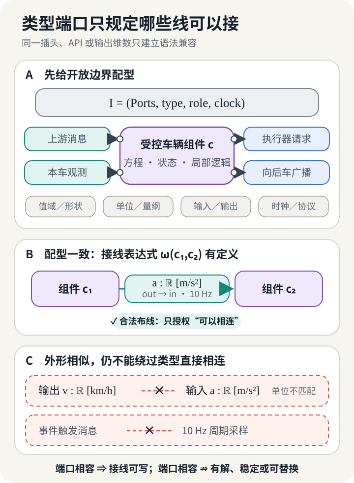
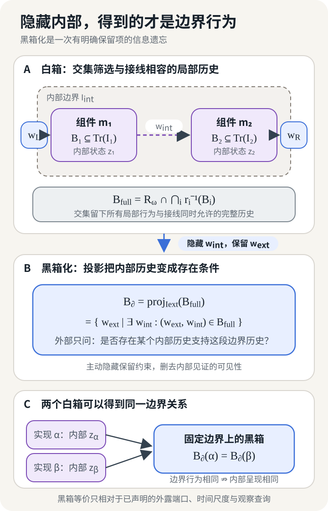
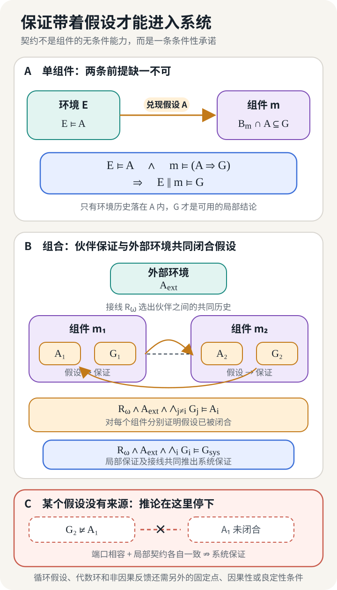

## 同一个插头，两种系统行为

设想一支四车车队正在做版本升级。工程师准备把第二辆跟车上的控制模块换成候选版本。旧模块和新模块使用同一连接器，读取相同的 CAN 与 V2V 字段，输出同样范围内的期望加速度。候选版本已经跑完单车回放，间距跟踪误差还小了一些。若变更单只问“接口是否兼容”和“新版本是否更准”，这次替换已经可以签字。

实际变更的制品是控制模块；用于比较和资格化的组件对象则是升级前后的整辆受控车辆。未改动的通信栈、状态估计、低层执行器和车辆动力学作为共同实现留在这个边界内，因为它们与控制模块一起决定车队看见的消息和运动行为。

车队集成工程师没有签字。原系统每 50 ms 发布一次 platooning control message；候选控制器每 100 ms 才完成一次新计算。控制计算变慢本身不决定发包周期。这里把失败情形说全：候选的 PCM 发布器只在新计算完成后推进序号和生成时间，没有以 20 Hz 保持上一结果的发布器或速率适配器；邻车监视器也只用判为新鲜的帧重置 watchdog。于是新鲜 PCM 相隔 100 ms，丢失一帧便把间隔拉到 200 ms，越过 150 ms 超时阈值并触发 front split 或 back split。ENSEMBLE 的多品牌车队规范给出 PCM 的 20 Hz 发布、50 ms 更新期待和 150 ms 超时；候选发布器与新鲜度判定是本例另行写明的集成假设。[^ensemble-protocol]

若通信栈用适配器继续以 20 Hz 发包，传输 watchdog 可能一直被重置。此时替换义务落在重复字段的数据年龄和闭环误差上：新序号不等于新控制计算，生成时间或字段级时间戳才说明下游读到的数据有多旧。

字段表只记录瞬时数据的形状，这次系统差异存在于交互历史中。候选模块“能接上”，单车指标也更好；原系统关于车队不断开、扰动传播和安全距离的结论，各自依赖更大的系统上下文。

一份可复查的替换声明写明对象、允许环境、观察和待保持性质，并给出局部关系经接线、反馈与内部信号隐藏后的结论。车队把这项要求暴露得很清楚：一辆车的动作会成为后车的输入，孤立模型之间的比较到这里已经结束。

## 模型在边界处成为组件

先决定方框画在哪里。同一个车队控制问题至少有三种切法。方框可以只包住控制律，此时车辆动力学、状态估计器、通信栈和执行器都属于环境。方框也可以包住控制器与车辆，留下雷达观测、V2V 消息、管理命令和车辆运动作为外部接触面。再向外扩一层，整个车队成为一个组件，道路交通和调度系统才是它的环境。

三种切法分别回答不同的问题。更换一条控制律时，候选必须适配既有车辆；更换一辆受控车辆时，动力学和低层执行器已经进入候选组件；把整队交给上层调度时，车间通信和跟驰误差会成为内部变量。边界改变以后，“相同接口”和“保持行为”所指的对象也随之改变。

Herbert Simon 用近可分解性解释复杂系统为何有时适合分层研究：组件内部的作用在相关时间尺度上强于组件之间的作用，观察者才有理由暂时把一部分细节封装起来。这个理由具有尺度和用途。车辆控制器在毫秒级执行环里可以单独成件；研究车队遇到长下坡时，制动温升、车辆载荷与后车响应又可能迫使工程师扩大边界。[^simon]

一个组件边界可以写成有类型签名

$$
I=(\mathsf{Ports},\operatorname{type},\operatorname{role},\operatorname{clock}).
$$

$\mathsf{Ports}$ 是端口集合。$\operatorname{type}$ 记录值域、单位或量纲；$\operatorname{role}$ 区分输入、输出以及没有预设因果方向的物理端口；$\operatorname{clock}$ 保存连续时间、离散采样、消息新鲜度和允许的协议顺序。上一篇用 $\Sigma$ 描述一个模型中所有合法符号及其类型；这里的 $I$ 由其中对组合外露的量，加上此次用途声明的时钟、协议与能力约定组成。它是开放接口视图，不替代完整签名。一个浮点数端口若缺少单位，米每秒与千米每小时都能通过内存布局检查。一个消息端口若缺少时钟，10 Hz 与 20 Hz 也会被当成同一种连接。

对车队中的第 $i$ 辆跟车，可以先写一个示意性的控制边界：

$$
u_i=
\pi_i\bigl(
d_i,\Delta v_i,a_{i-1}^{\mathrm{msg}},
x_i^{\mathrm{est}},r_i
\bigr).
$$

$d_i$ 是与前车的间距，$\Delta v_i$ 是相对速度，$a_{i-1}^{\mathrm{msg}}$ 是通信得到的前车加速度，$x_i^{\mathrm{est}}$ 是自车估计状态，$r_i$ 保存参考速度或目标时距，输出 $u_i$ 是期望加速度。这个式子只画出了控制律的函数接口。若替换对象是“受控车辆”，边界还要容纳传感器时间戳、消息序号、车辆长度、道路坡度、执行器请求、向后车广播的状态，以及加入、退出和故障模式。

端口的角色也不能全都压成软件函数的输入与输出。电气端口上的电压和电流、机械端口上的力和速度，通常通过守恒关系或功率共轭变量连接。把这样的物理连接强制定向，可能在模型组合时制造不存在的因果顺序。软件消息则常有清楚的发送方、接收方和协议状态。类型系统需要保留这种差异。

*图 1　端口匹配授权工程师写下接线关系。它没有给出闭环解、运行行为或系统保证。*

下面先限定确定或非确定迹语义。令 $\operatorname{Tr}(\Sigma)$ 表示完整签名上的类型合法历史，$\operatorname{Tr}(I)$ 表示接口上的类型合法边界历史。若狭义语义对象 $M$ 允许的完整历史为 $\operatorname{Beh}_{\Sigma}(M)$，而 $I$ 按上面的外露量和时间、协议约定形成，则

$$
\begin{aligned}
\operatorname{Beh}_{\Sigma}(M)&\subseteq\operatorname{Tr}(\Sigma),
&
\pi_I&:\operatorname{Tr}(\Sigma)\to\operatorname{Tr}(I),\\
\mathcal B_m&:=\pi_I\bigl[\operatorname{Beh}_{\Sigma}(M)\bigr]
\subseteq\operatorname{Tr}(I),
&
m&=(I,\mathcal B_m).
\end{aligned}
$$

$\pi_I$ 把完整历史限制到外露量及其时序，$\mathcal B_m$ 因而只收集组件允许出现的边界行为。内部状态方程、神经网络层、滤波器和求解器都可以生成这些历史；在当前观察边界下，只要限制后的允许行为没有变化，它们便可以具有不同的内部呈现。概率核、优化排序和因果干预结构分别保留测度、值与次序、干预语义，不能只改写成无权迹集合；后文的跨域反例会随语义类型更换边界对象。

若团队还要说明复用条件，可在行为模型外附一份局部契约 $K$：

$$
c=(m,K).
$$

$m$ 规定边界上可能发生什么，$K$ 规定环境满足哪些条件时组件承诺什么。一个尚未被切出开放边界的数学模型依然是完整模型。组件身份来自用途所选的接触面、允许连接和观察方式；方框图本身没有赋予它可复用性。

## 接线之后，哪些历史还能发生

把前车消息接到控制器，把控制器输出接到低层执行器，再把车辆运动送回雷达与后车。图纸上的线条先规定变量如何相等、转换、采样或守恒。只有满足这些关系的局部历史，才能共同构成一次系统运行。

设 $m_i=(I_i,\mathcal B_i)$ 是若干组件，$\omega$ 是接线方式。先建立容纳全部外部与内部端口的共同历史空间 $\operatorname{Tr}_\omega$；接线关系 $R_\omega\subseteq\operatorname{Tr}_\omega$，限制映射 $r_i:\operatorname{Tr}_\omega\to\operatorname{Tr}(I_i)$ 把全局历史送到第 $i$ 个组件边界。隐藏内部端口后，外部行为位于 $\operatorname{Tr}(I_{\mathrm{ext}})$，可写成

$$
\mathcal B_{\omega(m_1,\ldots,m_n)}
=
\operatorname{proj}_{\operatorname{Tr}(I_{\mathrm{ext}})}
\left(
R_\omega\cap\bigcap_i r_i^{-1}(\mathcal B_i)
\right).
$$

交集要求所有局部模型和接线关系对同一次运行给出相容描述，投影则忘掉外部观察者看不到的内部信号。一条外部历史进入组合行为，意味着至少存在一组内部历史，使每个组件与全部接线同时成立。隐藏删掉的是观察者对见证取值的区分，内部约束仍留在结果中。

Willems 的行为方法把动力系统描述为时间轴、变量空间与允许轨迹的组合。系统互联通过共享变量施加共同约束，latent variables 再由存在量词隐藏，留下 manifest behavior。这种写法绕开了“谁是输入、谁是输出”的预设，适合解释物理系统和反馈连接。[^willems] 这里的 $\mathcal B_m$ 沿用了这项纪律；概率分布、优化排序或因果干预需要各自的语义对象。

类型化 wiring diagram 给“方框怎样嵌套接线”提供了组合语法。Vagner、Spivak 与 Lerman 把方框和接线组织成 operad，再让开放动力系统的语义随嵌套接线组合。[^wiring] 这项结构保证分层展开不会任意改变组合结果。端口、延迟上界和待保持的安全性质由工程任务选择；组合运算随系统的语义类型改变。

*图 2　黑箱化通过“存在内部见证”保留接线约束，同时遗忘见证的具体取值。不同内部实现可以落到同一边界行为；这个合并依赖选定的语义与观察。*

被动线性电路给出了一个严格实例。Baez 与 Fong 把内部节点隐藏为端子上的电势—电流关系，并证明这种 black-boxing 保持电路接线；不同内部拓扑可以由此具有同一个外部关系。[^blackbox] 这一结论针对被动线性网络、指定端子和 Lagrangian relation，其他系统需要另建黑箱语义。

受控车辆的黑箱也会遗忘内部差异。一个版本用卡尔曼滤波，另一个版本用移动窗估计；只要二者在选定边界上允许相同的消息与运动历史，行为模型可以把它们合并。若后车依赖置信区间而旧边界只暴露点估计，两种实现之间的差异已经影响系统，却被边界选择藏了起来。黑箱是否合适，要由下一层观察和上下文检验。

## 黑箱由观察和上下文决定

候选控制器在回放台上收到一组固定的前车轨迹。它逐帧给出与旧控制器近似相同的加速度，团队于是积累了一批“二者行为相同”的记录。上车以后，加速度会改变本车位置；位置改变下一时刻的雷达间距，也改变后车收到的扰动。回放台把输入历史固定住，闭环系统会让组件参与生成未来输入。这两种实验放置组件的上下文不同。

这里先复用上一篇的观察思路。观察规格 $v$ 选择要保留的外部端口、时间尺度以及确定性的投影、聚合或查询。若 $v$ 逐条观察历史，可写 $o_v:\operatorname{Tr}(I)\to\mathcal O_v$，并令 $\Omega_v(\mathcal B)=o_v[\mathcal B]\in\mathcal P(\mathcal O_v)$ 表示行为集的像；若 $v$ 对整个行为集做聚合或查询，则直接取 $\Omega_v:\mathcal P(\operatorname{Tr}(I))\to\mathcal O_v$。以下比较的两项都进入同一个共同观察空间。精确行为等价写成

$$
m\equiv_v m'
\quad\Longleftrightarrow\quad
\Omega_v(\mathcal B_m)
=
\Omega_v(\mathcal B_{m'}).
$$

若 $v$ 只保留 10 Hz 的期望加速度，内部 2 ms 调度抖动可能被滤掉；若系统性质涉及截止时间，同一抖动便必须留在观察中。若查询只检查平均间距误差，短时的危险接近也可能消失。所谓“同一个黑箱”由保留项定义。上式只说明选定观察下的精确相等；近似替换声明另行给出误差传播模型与用途阈值。

有限回放只比较测试集覆盖的历史。上下文可替换要求更强的量词。令 $E[-]$ 表示留有一个组件空位的系统；$\mathcal C_{\mathrm{adm}}$ 只收纳槽口与 $m,m'$ 的接口同型、且组合行为能经 $v$ 进入同一观察空间的上下文。观察等价于是提升为

$$
\forall E[-]\in\mathcal C_{\mathrm{adm}},
\qquad
\Omega_v\!\left(
\mathcal B_{E[m]}
\right)
=
\Omega_v\!\left(
\mathcal B_{E[m']}
\right).
$$

$\mathcal C_{\mathrm{adm}}$ 可以限定为一车前视拓扑、给定速度域、规定的通信延迟与丢包包络，以及通过相容性检查的邻车。量词要覆盖变更声明承诺的使用范围。测试只覆盖一支四车队列时，证据的声称域就是这支队列；任意长度、重排和分裂需要新的上下文量词与验证。

Hennessy 与 Milner 在并发进程中把观察等价与代入上下文联系起来。等价关系只有在语言的组合算子下构成 congruence，工程师才可以把等价进程放进更大表达式而保持观察结果。[^context-equivalence] 移到工程组件以后，替换成为一条反事实条件陈述：“若在允许上下文里改用候选，所选观察或性质仍成立。”上下文族、物理域和误差标准由工程任务另行给出。

这也澄清了边界的哲学地位。组件边界是一项为了推理而作的切分，黑箱化是一项带保留项的遗忘。对象本身不决定唯一、与用途无关的黑箱规格。团队选择哪些交互留在边界上，再用实验或证明说明被隐藏差异不会改变当前用途下的结论。两个控制器在同一回放集上给出相近命令，既可能源于共同捕捉了车辆动力学，也可能只是测试没有激发它们的差异。

观察关系把“看起来一样”收紧为可核查的声明。候选控制器在低延迟网络中表现更好，这是一组行为事实；契约接着写明谁保证低延迟，以及网络越过边界后控制器承诺怎样变化。

## 契约让保证带着条件说话

设旧控制器在通信时延不超过 50 ms、消息以 20 Hz 到达、执行器滞后落在给定区间时，保证相邻车辆的传播增益不超过 $0.9$。候选控制器把增益降到 $0.7$，证明域止于 20 ms。旧控制器覆盖的 20 ms 到 50 ms 输入历史没有候选保证。

沿车队案例计算时，只需要一套固定边界行为全集上的假设—保证契约：[^contracts]

$$
K=(A,G),
\qquad
A,G\subseteq\operatorname{Tr}(I).
$$

$A$ 与 $G$ 都是完整边界历史上的谓词或子集；$A$ 主要约束环境控制的坐标，$G$ 则约束组件负责的坐标或整条联合历史。行为模型 $m=(I,\mathcal B_m)$ 满足契约，当且仅当

$$
m\models K
\quad\Longleftrightarrow\quad
\mathcal B_m\cap A\subseteq G.
$$

组合时，各局部谓词先沿端口映射提升到同一个全局历史空间。这里的 $A$ 与 $G$ 采用迹性质；状态机、概率界或资源预算需要各自的满足关系和组合运算。环境历史落入 $A$ 时，组件行为必须落入 $G$。

在共同 alphabet、共同性质全集和规范化表示下，一组便于检查的较强充分条件是

$$
A_{\mathrm{old}}\subseteq A_{\mathrm{new}},
\qquad
G_{\mathrm{new}}\subseteq G_{\mathrm{old}}.
$$

左式让候选接受旧组件的全部环境，右式收窄候选允许出现的行为；在当前规范化迹性质表示中，这两项包含关系足以推出契约精化。前述 20 ms 候选只在窄域内给出更小传播增益，旧控制器承诺的 20 ms 到 50 ms 时延没有候选保证。团队若同步缩窄网络时延，还须把网络、监测和回退纳入同一项系统变更。

契约进入组合后，单个 $G_i$ 不能悬空使用。对第 $i$ 个组件，外部假设、接线关系和伙伴组件的保证需要共同推出它的假设：

$$
R_\omega\land A_{\mathrm{ext}}
\land\bigwedge_{j\ne i}G_j
\models A_i.
$$

第二项义务是由全部局部保证与接线关系推出所需系统保证：

$$
R_\omega\land A_{\mathrm{ext}}
\land\bigwedge_iG_i
\models G_{\mathrm{sys}}.
$$

这两行列出待证明的义务。无环连接可按拓扑顺序，用已经建立的伙伴保证逐项闭合假设；反馈连接需要带初始情形和归纳不变量的时序 assume–guarantee 规则，或一条独立的非循环全局闭合引理。直接设置 $A_1=G_2$、$A_2=G_1$ 只会互相预支结论。假设闭合失败时，局部证明保持数学正确，其前提却没有在当前组合中兑现；系统推论缺失时，若干局部保证也可能留下无人承担的车队末端扰动上界或失联分裂性质。

*图 3　保证是一项条件承诺。组合证明为每个局部假设找到来源，并建立从局部保证到系统性质的推理；图中箭头标记待证义务，循环依赖会把假设留在未闭合状态。*

时延、丢包、执行器能力和拓扑可以写进车队契约；这些条件需对应可测的运行判据。若 $A$ 写着“网络状况良好”，监测器无法判断何时触发回退。若时延上界写成 20 ms，则时间戳语义、测量点和越界处理都应当进入契约或其实现记录。可兑现的条件赋予契约工程价值，集合符号本身没有这种作用。

## 局部精化怎样穿过组合

下面改用另一个候选。先假定它保持端口，并通过上文的契约包含检查；反馈良定性仍需单独检查。车队工程师要确认接线后的方程有解，并证明局部精化由所用组合运算保持。契约兼容性只检查可接受环境是否存在；反馈良定性要求每个外部激励产生唯一且因果的内部响应。

考虑反馈连接

$$
u=\Delta(y)+d_u,
\qquad
y=F(u)+d_y,
$$

并定义

$$
\Phi(u,y)=
\bigl(u-\Delta(y),\,y-F(u)\bigr).
$$

这里 $F$ 与 $\Delta$ 是作用在相容扩展信号空间上的两个反馈算子；前文的 $G$ 继续表示契约保证，第一篇的 $P$ 则专指用途与决策情境。在 Megretski 与 Rantzer 使用的控制论定义中，互联良定要求 $\Phi^{-1}$ 存在且因果；给定外部扰动 $(d_u,d_y)$ 后，内部信号 $(u,y)$ 才唯一并且不能依赖未来。若进一步声称 $L_2$ 稳定，$\Phi^{-1}$ 还须在 $L_2$ 上具有有限诱导增益。[^well-posedness]

两个标量端口已经足以制造反例。接线

$$
y_1=y_2,
\qquad y_2=y_1
$$

拥有无穷多组解；改成

$$
y_1=y_2+1,
\qquad y_2=y_1
$$

则没有解。两组方程在类型层都只连接标量端口，接口检查不会报告单位或角色冲突。闭环求解语义决定系统是否能运行。

令 $c$ 为原组件，$c'$ 为候选组件，$\Psi_{\mathrm{req}}$ 是要保持的性质集。以 $X\downarrow$ 表示组合对象 $X$ 良定，上下文替换目标定义为

$$
c'\sqsubseteq_{\mathcal C_{\mathrm{adm}},\Psi_{\mathrm{req}}}c
\quad\Longleftrightarrow\quad
\forall E[-]\in\mathcal C_{\mathrm{adm}},
\quad E[c]\downarrow\Rightarrow
\left(
E[c']\downarrow
\ \land\
\forall\psi\in\Psi_{\mathrm{req}},\quad
E[c]\models\psi\Rightarrow E[c']\models\psi
\right).
$$

定义中的上下文族、性质集和满足关系必须分别落地。$\mathcal C_{\mathrm{adm}}$ 列出允许出现的系统环境，$\Psi_{\mathrm{req}}$ 列出此次变更必须保持的性质，$\models$ 则采用与性质相配的判断。基线组合良定时，候选组合须保持良定，并保留基线已经满足的目标性质。在车队中，这可以是轨迹包含或诱导增益；换到其他语义类型，满足关系也随之改变。

$\preceq_{\mathrm{loc}}$ 要在具体语义上另行定义：它可以是迹行为包含、契约精化或某种模拟关系，三者的方向和前提按各自语义确定。定义固定以后，模块化推理要求这项局部精化对所用布线形成前同余：

$$
c'\preceq_{\mathrm{loc}} c
\quad\Longrightarrow\quad
\omega(\ldots,c',\ldots)
\preceq_{\mathrm{loc}}
\omega(\ldots,c,\ldots).
$$

这里的“所用布线”很重要。隐藏、重命名、串联、并行与反馈各自改变语义，局部契约精化是否单调，需要针对实际组合算子证明。上面的上下文关系只有在 $\mathcal C_{\mathrm{adm}}$ 对相应组合封闭时才形成前同余；它与局部精化不是同一个关系。输入／输出自动机的研究给出了特定算子下的保持定理，也留下过在更一般非确定情形中需要修正的边界。[^precongruence]

![图分三层。基线把原组件 c 放入允许上下文 E[-]，检查组合良定且满足性质 ψ。候选 c′ 须覆盖 A_old，并在 A_old 内把允许行为收在 G_old 以内；局部精化须经布线保持，候选组合也须良定且满足 ψ。候选 c″ 虽接口相同，新增边界行为、额外环境条件或非良定反馈都会推翻系统结论。](./model-as-open-component/contextual-substitution.zh.svg)

*图 4　集合关系检查候选是否覆盖原环境，并在 $A_{\mathrm{old}}$ 内收紧允许行为。布线单调性、反馈良定性和性质 $\psi$ 的保持分别构成系统替换义务。*

这一定义也限制了“所有上下文”的夸张读法。允许上下文由用途和契约划定。若原组件只承诺高速公路恒定时距跟驰，候选无需在矿区低速编队、城市切入和赛车场景中逐一等价。反过来，工程师不能在验证时只留一组方便的邻车，再在部署说明中声称车辆可以任意编组。

下文把一份证据所绑定的主张、对象、用途域和版本称为“证据地址”。上下文关系首先约束语义模型；若变更触及生成代码、处理器或车辆，计算制品与部署实例按各自证据地址复验。前同余无法替新处理器完成截止时间测试，也无法替新制动系统测量响应滞后。

## 换掉车队里的那一辆

现在回到开篇的候选受控车辆，把它放回第二个跟车位置。候选边界包含通信栈、状态估计、低层执行和车辆动力学；消息到达与车辆响应形成一条因果链，扰动传播和安全性质都要在整队上求值。

### 时钟和车辆共同改变传播通道

ENSEMBLE 的 platooning control message 携带位置、运动状态、生成时间和序号。位置与航向要结合消息年龄解释，而 CAN 与 GNSS 字段可能采用不同刷新周期；七品牌测试后的反馈因此提出为不同字段组设置多个时间戳。按 50 ms 名义周期计算，连续丢失两帧后，下一帧恰落在距上次接收 150 ms 的超时边界。此时是否触发取决于监视器采用 $>$ 还是 $\ge$、接收与定时任务的先后顺序以及调度抖动；不能把“两帧可容纳”写成无条件结论。一次性发送的 split status 也可能在没有警告的情况下消失。通信端口由字段、时间和丢失后的处理规则共同构成。[^ensemble-spec]

在开篇列出的发布器耦合、无速率适配和“只计新鲜帧”三个假设下，10 Hz 控制计算使新鲜 PCM 相隔 100 ms；一帧丢失把间隔拉到 200 ms，明确越过 150 ms watchdog。接收方发起 split 后，原固定队列中的传播关系随拓扑重新求值。若适配器仍以 20 Hz 发布保持值，由 10 Hz 计算降频造成的单帧丢失超时不再成立；普通连续丢包仍按上一段的 150 ms 边界判断，工程师还要检查字段数据年龄怎样进入 $H_i$ 与闭环误差。

同一控制公式落在不同车辆上，会与传感延迟和执行器滞后形成新的闭环。Wang 等人的线性恒定时距 ACC 模型把执行链滞后 $\tau_i$、传感延迟 $\xi_i$、目标时距 $t_{d,i}$ 和控制增益都写入误差传播通道：

$$
H_i(s)=
\frac{
(k_{v,i}s+k_{s,i})e^{-\xi_i s}
}{
\tau_i s^3+s^2+
(k_{v,i}+t_{d,i}k_{s,i})se^{-\xi_i s}
+k_{s,i}e^{-\xi_i s}
}.
$$

传感滤波、制动响应或目标时距任一改变，都会改写 $H_i$。Wang 等人由此给出线性化非联网 ACC 的异构串稳定充分条件和仿真；测试域是该模型与参数范围，声称域不含 CACC 协议故障、实车道路行为和紧急制动非线性。[^wang]

### 完整队列、分裂点与安全包络各有地址

令 $E_i$ 是第 $i$ 个跟车位置上的间距误差，并写成

$$
E_i(s)=H_i(s)E_{i-1}(s),
\qquad
\|H_i\|_{\mathcal H_\infty}\le\gamma_i.
$$

稳定因果 LTI 通道在平衡初值下串联，诱导范数的次乘性给出

$$
\|E_n\|_2
\le
\left(\prod_{i=1}^{n}\gamma_i\right)
\|E_0\|_2.
$$

若允许上下文中的每个通道都满足 $\gamma_i\le1$，候选通道稳定且 $\gamma_k'\le1$，逐车不放大的性质可以沿同类串联保持。若团队只验证

$$
\gamma_k'
\prod_{i\ne k}\gamma_i
\le1,
$$

它得到的是完整队列的 head-to-tail 上界。位置无关的标量重新排序不改变总乘积，但各段前缀与放大发生的位置会变化；若 $H_i$ 依赖邻车、位置或模式，重排还会重新定义因子。Wang 等人的 Figure 4(b,e) 正好给出这种四车队列：中间跟车放大扰动，最后一辆再把它衰减；从中间分裂后，新末端失去原来的衰减通道。该仿真支持完整队列的端到端上界，分裂后的前缀不在同一结论内。

候选若增加第二前车消息，便增加了端口和环境义务，也改写了传播通道。Ploeg 等人的一车前视与两车前视判据对应两种拓扑；后者可以成为新设计，不能登记为原单前车契约下的局部精化。[^ploeg] 断联后从 CACC 切到 ACC 也会同时换掉端口、控制器和保证，每个模式及切换轨迹都要有自己的行为条件。

串稳定判断比较整段误差历史的 $L_2$ 能量；任意时刻的最小间距属于点态安全约束。车辆可以在所有跟车之间保持较小的 $L_2$ 误差，却因一个短时制动峰值越过安全界；执行器饱和、切入和轮胎附着也位于线性通道之外。

ENSEMBLE 对 Platooning Support Function 分开写下这些责任。驾驶人选择的目标时距通常在 1.4 s 到 1.6 s，系统实现的时距不得低于 0.8 s；稳态跟驰另有不放大速度扰动的要求。未完成碰撞警告序列时，初始制动请求限制在 $-3.5\,\mathrm{m/s^2}$；更强制动还要由额外传感器验证风险。规范另行讨论制动温度、轮胎类型和磨损、载荷及路面条件怎样改变制动能力。[^ensemble-spec]

在上述稳定因果 LTI 前提下，$\|H_i\|_{\mathcal H_\infty}$ 给出间距误差通道的诱导 $L_2$ 能量增益；0.8 s 条款约束每一时刻实现时距的点态下界；制动与告警规则限定模式转换和执行器动作。传播增益改善而瞬时制动需求上升时，PSF 的物理包络决定候选能否部署。

### 代码和车辆各有证据地址

Ibrahim 等人的多层车队 MPC 把上层 10 Hz 优化器和每 2 ms 运行的下层反馈部署到四台 Cohda MK5。代码由 MATLAB 生成，连续到离散变换采用近似，特征值计算还调用外部库。丢包时，上层保持上一期望加速度；Ubuntu 上的下层线程偶尔延迟，模拟车辆状态便短暂“冻结”。[^ibrahim]

这组 HIL 实验检验了嵌入实现，四台设备中的车辆状态仍是模拟量。实车动力学和真实传感器属于另一项验证。代码生成、依赖库或处理器变化后，数学证明中未受影响的步骤可以复用；旧二进制的截止时间测试留在原制品地址。

ENSEMBLE 的 white-label truck 给出了现实中的组合路径。项目把多品牌车辆共享的战术层、状态与属性交换、V2X 协议写成共同规格，同时允许 OEM 各自实现纵向控制、传感器和制动系统。能力信息也参与组合：车辆把最大加速度请求和期望最高车速等限制沿车队传播，上游可以按最受限车辆调整队列动作。项目完成了七品牌 Platooning Support Function 的实现、测试和评估。[^ensemble-spec]

这个结果支持经过项目测试的七品牌 Platooning Support Function 在共同协议和能力传播约束下互操作。任意 schema-compatible 控制器的热替换与任意队长均超出这项测试；Platooning Autonomous Function 的相关部分也只有理论规格。

把原控制器换成候选后，工程师沿带时钟的外部边界重算传播，并用原车辆与执行器包络检查候选的时延、丢包处理、约束和回退行为。只有当一车前视布线与拓扑切换后的整队仍处在时距和制动包络内，这条替换才成立。代码、ECU、通信配置或车辆若发生变化，对应证据随之重开；对象与地址未变的记录可以继续使用。

## 把替换判据带到其他系统

三个短反例检验这套替换关系能否离开车队。每个系统都保留开放边界和上下文量词，同时采用自己的语义对象。

### FMI：回滚能力属于协同仿真接口

FMI 3.0.2 允许 importer 在一步失败后恢复各 FMU 的先前状态，再缩短步长重算。依赖这条路径的 importer 给槽口增加了一项明确能力要求：候选 FMU 必须支持所需的 get/set state 操作。候选即使保留同样的标量变量，缺少状态保存与恢复能力也会中断原回滚算法。替换检查因此覆盖 importer 使用的状态能力及其版本，而不止变量 schema。[^fmi]

### 概率感知：confidence 的数值需要分布语义

一个 LiDAR 检测器输出类别、三维框和 confidence。候选网络保持完全相同的张量形状，平均检测精度也接近旧版本。令 $Y$ 为真实类别、$\hat Y$ 为预测类别、$\hat P$ 为预测置信度。下游规划器若把 confidence 当作事件概率，它依赖的契约还包含校准：在部署分布 $D$ 上，理想化的分类校准写成

$$
\Pr_D(\hat Y=Y\mid\hat P)=\hat P
\qquad D\text{-a.s.}
$$

在有限数据的置信度分箱中，落入 $0.9$ 附近的预测应约九成正确。目标检测还需指定匹配与 IoU 规则；Feng 等人分别评估分类与框回归校准，Ovadia 等人则记录了分布偏移下的校准退化。[^calibration] 张量 schema 只保证规划器能够读取 class、box 和 confidence。若旧契约承诺给定分布族上的校准误差上界，候选要在同一分布族和评价规则下接受检验；一次 IID 平均准确率属于另一个声称域。

### 工具型 agent：响应相同，现实状态可能多改一次

设 agent 调用 `create_ticket`。请求和响应都通过同一 JSON schema，旧服务还按 `request_id` 去重。第一次请求已经创建工单，但响应在网络中丢失；客户端不知道服务端是否执行，于是重试。旧服务识别相同 `request_id`，只保留一张工单。候选服务没有幂等处理，第二次调用又创建一张工单，最后仍返回同样格式的成功响应。

工具的边界语义因此至少要写成状态转移核

$$
T(\,\cdot\mid s,x)
\in
\mathcal P\!\left(S\times(Y\sqcup E)\right),
$$

$S$ 是外部状态空间，$X$ 是请求空间，$Y$ 与 $E$ 分别是响应和错误空间；给定 $(s,x)\in S\times X$，该核为调用后状态与结果赋予分布。部分失败即使返回错误也可能已经改变 $S$。若只用 $X\to Y$，两种服务可以看起来相同；把状态变化和失败轨迹加入观察，重复工单便成为可见差异。

MCP 的工具 schema 规定参数与结构化输出的形状，`idempotentHint` 等 annotation 只给客户端提供提示。HTTP 也把自动重试与方法幂等性相联系，因为客户端无法从一次失败响应判断服务器已经执行到哪一步。[^tool-semantics] 具有现实副作用的工具要把重试、去重和部分失败写进契约；上述重复建单只是展示这一差异的构造性反例。

FMI 检查状态回滚能力，概率感知检查分布承诺，工具调用检查外部状态转移。三种语义的共同点只到这里：替换主张必须在实际组合中求值。

## 回到 50 ms

[《从模型到工程系统》](/posts/engineering-model-chain/)追踪模型进入计算、部署和证据的关系；[《模型内部有什么》](/posts/inside-the-model/)区分完整签名、语义实例与观察；组合任务从中选出开放接口 $I$，再把投影到边界轨迹的行为 $\mathcal B$ 放进布线和契约。

开篇的候选每 100 ms 完成一次控制计算。若 PCM 发布器随计算以 10 Hz 推进新鲜帧、没有 20 Hz 适配且 watchdog 只计新鲜帧，一帧丢失会产生 200 ms 间隔并触发 150 ms 超时；split 随即使固定拓扑下的传播证明失去证据地址。若适配器以 20 Hz 重发保持值，拓扑可以不变，但旧证明中的字段年龄和闭环误差前提需要重新核对。团队保留地址未变的数学步骤，按新的时钟、拓扑、代码和车辆更新其余证据。到这一步，“同一个插头”才被改写成一项可以签字、也可以拒绝的工程结论。

---

[^ensemble-protocol]: Boris Atanassow et al., *[Platooning Protocol Definition and Communication Strategy](https://publications.tno.nl/publication/34640511/YQUtYF/atanassow-2022-platooning.pdf)*, ENSEMBLE Deliverable D2.8, 2022，Section 4.2, pp. 31–32；Section 4.4.5, pp. 44–46，尤其是 `PCM_TIMEOUT = 150 ms` 与 REQ_V2V_040–044。该文档给出协议和状态机要求，不承担控制稳定性证明；正文关于候选发布器、新鲜帧和无适配器的条件属于作者构造的集成情形。

[^simon]: Herbert A. Simon, “[The Architecture of Complexity](https://doi.org/10.2307/985254),” *Proceedings of the American Philosophical Society* 106(6), 1962, pp. 474–475。本文只借其近可分解性说明边界相对于作用强度和时间尺度，不把层级分解视为所有系统的既定事实。

[^willems]: Jan C. Willems, “[The Behavioral Approach to Open and Interconnected Systems](https://doi.org/10.1109/MCS.2007.906923),” *IEEE Control Systems Magazine* 27(6), 2007, pp. 51–54、62–64、70–72。行为核、互联和 latent／manifest 投影来自这些部分；本文的通用迹记号不覆盖所有概率、优化或因果语义。

[^wiring]: Dmitry Vagner, David Spivak and Eugene Lerman, “[Algebras of Open Dynamical Systems on the Operad of Wiring Diagrams](https://tac.mta.ca/tac/volumes/30/51/30-51.pdf),” *Theory and Applications of Categories* 30, 2015, Definition 2.7、Definition 3.1、Proposition 3.11、Definition 4.2、Proposition 4.5, pp. 1797–1814。

[^blackbox]: John Baez and Brendan Fong, “[A Compositional Framework for Passive Linear Networks](https://tac.mta.ca/tac/volumes/33/38/33-38.pdf),” *Theory and Applications of Categories* 33, 2018, pp. 1163–1164，Definition 7.3.1 与 Theorem 7.3.2, p. 1213。其黑箱函子适用于被动线性网络及文中指定的关系语义。

[^context-equivalence]: Matthew Hennessy and Robin Milner, “[Algebraic Laws for Nondeterminism and Concurrency](https://www.scss.tcd.ie/matthew.hennessy/pubs/old/HMjacm85.pdf),” *Journal of the ACM* 32(1), 1985, pp. 137–139、143–144。原文讨论有限并发进程；本文据此提出工程上下文族中的替换目标。

[^contracts]: Albert Benveniste et al., *[Contracts for System Design](https://inria.hal.science/hal-00757488)*, INRIA Research Report RR-8147, 2012, pp. 25–27、30，Definitions 1、3，Properties 1、3，Eqs. (10)–(14)。正文的 $(A,G)$ 是固定迹性质全集上的特例。

[^well-posedness]: Alexandre Megretski and Anders Rantzer, “[System Analysis via Integral Quadratic Constraints](https://doi.org/10.1109/9.587335),” *IEEE Transactions on Automatic Control* 42(6), 1997, Section II, p. 821。因果可逆与有界性分别承担良定性和稳定性。

[^precongruence]: Paul C. Attie and Nancy A. Lynch, “[Dynamic Input/Output Automata: A Formal and Compositional Model for Dynamic Systems](https://doi.org/10.1016/j.ic.2016.03.008),” *Information and Computation* 249, 2016, Theorems 17–18；Walter Vogler and Gerald Lüttgen, “[A Linear-Time Branching-Time Perspective on Interface Automata](https://doi.org/10.1007/s00236-020-00369-4),” *Acta Informatica* 57, 2020, Theorems 45、54、57。两者用于校准“前同余需按组合算子证明”的力度。

[^ensemble-spec]: Edoardo Mascalchi et al., *[Final Version Functional Specification for White-label Truck](https://publications.tno.nl/publication/34640520/7W6Wtu/mascalchi-2022-final.pdf)*, ENSEMBLE Deliverable D2.5, 2022。PSF 的七品牌实现、测试、评估及 PAF 的理论规格边界见 Executive Summary, pp. 8–9 与 Section 3, pp. 53–55；共同功能与 OEM 特定实现见 Section 2.1.2, pp. 16–20；能力传播与消息语义见 Sections 2.3.2–2.3.4, pp. 22–28；纵向控制要求见 Section 2.5.4, pp. 46–50；多时间戳和丢包反馈见 Sections 3.2.5–3.2.6, pp. 54–55；制动影响因素见 Tables 11、13, pp. 79–87。

[^wang]: Meng Wang et al., “[String Stability of Heterogeneous Platoons with Non-connected Automated Vehicles](https://doi.org/10.1109/ITSC.2017.8317792),” *2017 IEEE 20th International Conference on Intelligent Transportation Systems*, Sections II、III.F，Eqs. (24)–(30)；Section IV.A–C，Eqs. (31)–(40)、Figure 4(b,e)。论文给出线性化非联网 ACC 的充分条件和仿真，不是 CACC 道路验证。

[^ploeg]: Jeroen Ploeg et al., “[Controller Synthesis for String Stability of Vehicle Platoons](https://doi.org/10.1109/TITS.2013.2291493),” *IEEE Transactions on Intelligent Transportation Systems* 15(2), 2014, Sections II–V、Definition 1、Eqs. (18)、(20)、Conditions (19)、(21)。判据以 Assumption 1、$\|P_1\|_{\mathcal H_\infty}<\infty$、所需传递矩阵逆存在及对所有 $i\ge2$ 成立为前提；分析采用齐次连续时间 LTI 模型和固定通信时延。

[^ibrahim]: Amr M. E. Ibrahim et al., “[Multi-layer Multi-rate Model Predictive Control for Vehicle Platooning under IEEE 802.11p](https://doi.org/10.1016/j.trc.2020.102905),” *Transportation Research Part C* 124, 2021, article 102905, Sections 10.1–10.5, pp. 28–31。四台 Cohda MK5 在 HIL 中模拟车辆状态，支持嵌入可行性分析，不是实车道路证据。

[^fmi]: Modelica Association, *[Functional Mock-up Interface Specification 3.0.2](https://fmi-standard.org/docs/3.0.2/)*, Sections 2.2.4、2.2.7.4、2.2.9、2.2.11、2.4.2、4.1、4.2.1。正文只使用这些部分规定的失败后缩步重算、FMU state 保存／恢复和相应能力标志。

[^calibration]: Chuan Guo et al., “[On Calibration of Modern Neural Networks](https://proceedings.mlr.press/v70/guo17a.html),” *ICML 2017*, Section 2, Eq. (1)；Di Feng et al., “[Can We Trust You? On Calibration of a Probabilistic Object Detector for Autonomous Driving](https://arxiv.org/abs/1909.12358),” arXiv:1909.12358, 2019, Sections III–IV，Eqs. (2)–(3)，Section VI-A，Figures 2–3；Yaniv Ovadia et al., “[Can You Trust Your Model’s Uncertainty? Evaluating Predictive Uncertainty Under Dataset Shift](https://proceedings.neurips.cc/paper/2019/hash/8558cb408c1d76621371888657d2eb1d-Abstract.html),” *NeurIPS 2019*, Section 4.2、Figures 2–3。它们分别支持分类校准、概率目标检测的分类／回归校准和分布偏移下的校准退化，不直接建立碰撞风险。

[^tool-semantics]: Model Context Protocol, *[Tools, specification revision 2025-11-25](https://modelcontextprotocol.io/specification/2025-11-25/server/tools)*，以及同版本 *[Schema Reference: Tool and ToolAnnotations](https://modelcontextprotocol.io/specification/2025-11-25/schema#tool)*；IETF, *[RFC 9110: HTTP Semantics](https://www.rfc-editor.org/rfc/rfc9110#section-9.2.2)*, Section 9.2.2。MCP annotations 是提示而非可信保证；重复建单是本文构造的反例。
