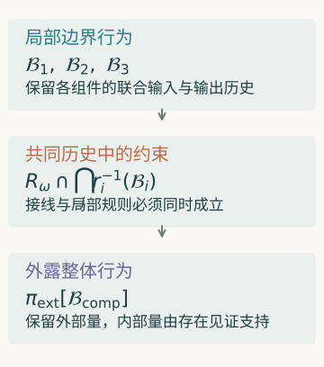

一个网络已经给出预测，预测随后被送去决定动作。动作改变下一次输入，新的输入再回到网络。第四篇在固定条件下比较的函数，如今进入了一个会继续回应它的环境。要判断这个网络能否使用，或者能否换成另一个，便须把这番往返留下来。

类似的变化也发生在工具调用中。一次调用已经改变状态，返回却在途中丢失；调用者没有见到结果，又发了一遍请求。若只看工具收到什么字段、返回什么类型，两次调用仍与原说明相符。若所求是一项请求只产生一次作用，执行、返回与重试就成为不同的事，必须在共同历史中比较。

模型进入整体，首先增加的是关系。哪些量向外开放，哪些时刻可以取得，谁控制输入，谁承担输出，内部接线留下什么，外界又能怎样使用它，都影响最后的判断。本篇从这些边界进入互联，实际构造接线与隐藏，检查反馈为何无解、多解或失稳，再建立契约和替换的条件。概率调用和有状态工具随后检验这套理解怎样随对象改变。

## 用途怎样为模型选择边界

第三篇曾把模型的呈现、语义和观察分开。一个内部模型可以包含参数、状态、方程、概率核或操作规则；成为组件时，要从其中选择外界可取得或可改变的部分。这个选择记作接口 $I$。它把内部对象与允许的连接联系起来，并不要求把所有内部变量都暴露出去。

一个固定网络可以只开放输入序列和输出 logit，也可以开放各层表示供分析，还可以连同缓存、生成状态和工具调用一起开放。第一种边界适于比较一次前向函数；后一种边界关乎继续交互。若正在替换的是一个持续运行的生成服务，只比较无缓存的单次函数，就可能把影响未来的状态藏在比较之外。

训练也有自己的边界。数据批次、参数和优化器状态共同决定下一步更新；只开放参数而未交代动量，未必能由外露状态确定后续训练。第三篇的同函数、不同梯度，第四篇的坐标和度量变化，都说明了这一点。边界须留下当前操作所需的内容，数学上可以用状态扩充来取得闭合。

接口还包含量的意义。一个实数可以表示绝对温度、相对设定值的偏差、下一拍增量，或每秒变化率；它们有不同的零点、单位和执行关系。即使数值类型相同，连接以前仍需相应换算。若量是概率，要说明事件和条件；若量是时间，要说明时钟、采样时刻和允许的年龄。类型可以组织这些区别，所指和约定使类型真正取得内容。

协议与能力也进入边界。组件可以要求先初始化再运行，可以允许撤销某次计算，可以在失败后保留已经发生的作用。另一端若依赖这些操作，就不能只核对一张变量表。允许何时发出哪个操作、失败以后处在什么状态，与允许返回哪个值，同属连接需要的说明。

边界因而可以改变，却须跟着问题改变。若通信延迟左右闭环结论，可以把控制器与通路合为一个较大的比较组件；若求解器的误差是焦点，则保留算法和解码之间的端点。扩大边界使更多条件成为内部职责，也使替换对象更大。不能在提出替换时比较一个窄模块，到证明保证时却悄悄借用另一套更大的系统。

这番选择没有改变模型必须与经验相接的要求。接口上的一条物理量说明，还要通过第二篇的测量与表征关系获得现实对应。此处先固定数学与协议边界，接下来才有共同空间来说明，这个组件可能发生什么。

## 边界上的对象怎样成为历史

对一个无状态函数，输入和输出的一对值即可记录一次作用。一个有状态、延迟或重试的组件，需要保留先后。先采用共同逻辑步 $k=0,1,\ldots$，输入域为 $U$，输出域为 $Y$，边界历史空间可取 $\operatorname{Tr}(I)=(U\times Y)^{\mathbb N}$。一个元素写成 $h=(u_k,y_k)_{k\ge0}$，表示一整串输入输出，而不是某一拍的数值。

这里的 $k$ 是此次交互的逻辑次序。若对应物理采样，还须给出时刻 $t_k$、间隔和执行区间；训练步、层深和生成位置仍各有自己的含义。对异步组件，可以改用带时间戳的事件序列，并保留并发、消息到达或发生先后的规则。本文先在共同离散步上完成推导，再指出边界改变时哪些结论需重查。

从完整内部历史到边界历史的限制记作 $\pi_I$。若内部允许历史为 $\mathcal B_{\mathrm{full}}$，边界行为是 $\mathcal B=\pi_I[\mathcal B_{\mathrm{full}}]\subseteq\operatorname{Tr}(I)$。这项投影隐藏内部状态，留下内部对象可以产生的联合输入输出。若两个组件的边界行为相同，当前历史语言辨不出它们；把新的状态或操作开放后，比较可能改变。

联合历史要保留联合关系。输入在第一拍的变化可能影响第五拍输出，两个输出也可能由同一个隐藏状态共同产生。分别列出“输入可以取什么”“输出可以取什么”，会舍掉这些联系。比如两位输出总是相同的组件与总是相反的组件，各位单独看都能取零和一；联合输出已经不同。隐藏内部与拆散联合关系，是两种不同的操作。

历史还要包含所求性质需要的事件。若要求十步内给出答复，就把请求、答复、等待和步数放进观察。若只保留成功返回的列表，永远不返回的执行可能从列表中消失。一项“每次成功都正确”的性质仍可成立，响应性却未被检查。选择只观察完成事件可以服务某个分析，其支持范围便留在那些事件上。

有时内部初始状态固定，有时允许一组初值。前者可能让每个输入对应唯一历史；后者即使逐步规则确定，也会形成多个允许输出。用行为集合可以并列记录这些情况，接下来判断多样性来自哪里。它既可能是合法选择，也可能是丢掉初值造成的歧义，不能单凭集合中元素多就称系统出错。

概率对象要再留一层内容。相同历史集合可以有不同概率，正如第三篇两个高斯律有相同支撑。若替换问题关乎失败概率或调用之间的相关性，边界语义应包含历史上的律、条件核及状态信息。历史集合仍可组织可达性，却没有替概率职责提供权重。本篇后半段会在这项边界上重新构造组合。

## 因果、状态与一次响应怎样接上

确定组件可以用历史映射 $F:U^{\mathbb N}\to Y^{\mathbb N}$ 表示。它是因果的，意指输入在 $0$ 到 $k$ 相同，输出在 $0$ 到 $k$ 也相同。当前输出至多使用已经到来的输入。严格因果则要求到第 $k$ 拍的输出，只依赖此前输入和指定初值；同拍输入改变，不立即改变同拍输出。

这两种条件有具体区别。无状态规则 $y_k=au_k$ 是因果的，却通常不是严格因果的；一拍延迟 $y_k=u_{k-1}$ 在给定 $u_{-1}$ 后严格因果。若两条同拍作用接成反馈，当前量可能需要一起求解；若一个方向具有一拍状态延迟，则可以先读已有状态，再计算下一状态。时序改变了求解义务。

把状态显式留下，常可看清这项顺序。设 $s_k\in S$，给定 $s_0$，采用

$$
y_k=\lambda(s_k,u_k),\qquad
s_{k+1}=\delta(s_k,u_k).
$$

若 $\lambda,\delta$ 在声明域上都是全函数，给定输入以后，逐拍递推取得唯一响应。若读出只用 $\lambda(s_k)$，输出对当前输入严格因果；若它使用 $u_k$，当前输出有直接通路。这里的全域、初值和更新次序共同建立了结论。一个仅写有状态类型的接口，还未规定这三件事。

对一个生成模型，状态可包括已生成序列和缓存，输入可包括新消息或工具结果。一次更新产生新状态和输出事件。若缓存只是原历史的可恢复计算摘要，可以证明删去它仍保持相同输出；若随机状态、权限或环境回应使摘要不再由保留历史决定，缩小状态就需要重新建立语义。第四篇的固定前向模型在这里成为持续交互中的一部分。

Vagner、Spivak 和 Lerman 的开放动力系统给出一种已有构造：状态空间、输入空间、由状态读出的输出，以及由状态和输入决定的向量场；类型化接线随后改变外露输入输出的组织，并保留状态。其语义代数证明这种操作与嵌套接线相合。[^wiring] 输出先由状态取得，是该构造的条件之一，不能把任意同拍代数环直接算作已经由它解决。

离散状态模型在这里同样可以计算组合，但采用的是自己的更新与历史语义。连续状态可以改用微分方程，并另查解的存在、唯一性与因果依赖；随机状态可以改用转移核。几种语言都使“下一步”有结构，其推论却各由实际规则承担。把一个组件画成有输入箭头和输出箭头的方框，只是这些说明的入口。

## 接线怎样成为共同约束

现在有若干接口 $I_i$ 和边界行为 $\mathcal B_i\subseteq\operatorname{Tr}(I_i)$。为使局部量真正相接，取一个容纳全部相关量的共同历史空间 $H$。限制映射 $r_i:H\to\operatorname{Tr}(I_i)$ 取出第 $i$ 个组件的历史；接线关系 $R_\omega\subseteq H$ 指定量怎样相等、换算、守恒、采样或延迟。局部行为先沿 $r_i$ 拉回同一空间，才可以求交。

整体的完整允许行为和外露行为为

$$
\mathcal B_{\mathrm{comp}}
=R_\omega\cap\bigcap_i r_i^{-1}(\mathcal B_i),
\qquad
\mathcal B_{\mathrm{ext}}
=\pi_{\mathrm{ext}}[\mathcal B_{\mathrm{comp}}].
$$

$\pi_{\mathrm{ext}}:H\to\operatorname{Tr}(I_{\mathrm{ext}})$ 选出最终外露量。第一式说一项完整历史同时满足每个局部规则和接线；第二式只保留其中可被外界观察的部分。一个外露历史合法，意味着至少有一个内部见证使全部约束共同成立。投影没有要求内部见证唯一，后面的良定性须另作判断。

*原创关系图。局部规则先提升到共同历史域，求交后隐藏内部量；箭头表示约束与投影的关系，正文继续检查见证的存在、唯一与因果。*

用一个可以贯穿反馈分析的构造把它展开。偏差 $e_k\in\mathbb R$ 按每拍累加，输入 $u_k$ 是该拍的净偏差增量，$w_k$ 是外部扰动增量。组件规则分别为

$$
e_{k+1}=e_k+u_k+w_k,
\qquad u_k=-ay_k,\qquad a>0.
$$

这里以偏差和增量定义一项离散构造；实际应用时，再建立相应物理量与通路的经验对应。$u$ 的意义是增量；若实际接口开放的是变化率，还需间隔换算。一个组件产生偏差历史，一个组件根据测量 $y$ 给出控制增量，测量通路决定 $y$ 指向哪一拍。三部分各有自己的职责。

同步接线 $y_k=e_k$ 使整体成为 $e_{k+1}=(1-a)e_k+w_k$。给定 $e_0$ 与扰动历史，逐拍先取已有偏差，再算 $u_k$，随后更新下一拍，因而存在唯一因果响应。若外露 $e,w$，内部 $u,y$ 可隐藏；若研究控制量约束，则把 $u$ 留在边界，所问性质随之扩大。

一拍通路改为 $y_k=e_{k-1}$，给定 $e_{-1},e_0$ 后，整体成为 $e_{k+1}=e_k-ae_{k-1}+w_k$。控制器仍执行同一条局部公式，偏差组件也仍执行同一条累加规则，改变的是通路关系。同一组组件可以在不同接线中形成不同系统；系统差异没有必要先归咎于哪个局部公式算错。

接线把变量连同适配器、存储、时间对齐与转换一起组织。若采样通路只在部分时刻开放新值，保持器就是关系的一部分；若两端采用不同单位，换算也进入关系。将这些内容写进 $R_\omega$，使后续比较能够指出究竟哪一项条件发生变化。

## 隐藏内部以后，组合怎样继续

隐藏的关键在于留下连接还要使用的边界。取三个值域 $X,Y,Z$，关系 $R\subseteq X\times Y$、$S\subseteq Y\times Z$。把中间 $y$ 接上再隐藏，得到

$$
S\circ R
=\{(x,z):\exists y\in Y,\ (x,y)\in R\land(y,z)\in S\}.
$$

中间量存在，首尾关系成立。再接 $T\subseteq Z\times W$，两种分组都要求存在同一对 $y,z$ 使三项关系一起成立。于是

$$
T\circ(S\circ R)
=\{(x,w):\exists y,z,\ R(x,y)\land S(y,z)\land T(z,w)\}
=(T\circ S)\circ R.
$$

这次结合律由存在量词与合取直接证明；中间变量的命名和类型在两边相同。恒等关系 $\{(x,x):x\in X\}$ 则在复合时原样传递 $x$。我们由此获得一项确实保持组合的语义语言，可以先组成子系统，再把子系统的边界关系接入更大系统。

对历史关系也可以做同样的消元，前提是接口留下后续接线所需的全部历史与联合约束。若两个子系统还要共同使用一个隐藏变量，先将各自的这个变量独立丢掉，就会把原来的共同见证拆成两个见证。原本需要同一个数同时满足两条件，如今可能分别找到不同数；新的整体行为会被放大。例如一个约束要求共享实数 $z=0$，另一个要求同一 $z=1$，共同见证不存在；分别消去 $z$ 后，两项外部空坐标关系却都非空。合法隐藏保留余下接口，共享结构还需由接口或接线携带。

两个串联电阻给出一项容易核对的物理关系构造。取正电阻 $R_1,R_2$，端点电势 $v_0,v_2$、内部节点电势 $v_1$，统一电流方向 $i$。局部约束是 $v_0-v_1=R_1i$、$v_1-v_2=R_2i$，连接还要求内部电流守恒。消去 $v_1$ 后得到 $v_0-v_2=(R_1+R_2)i$。反过来，这项端点关系给出唯一 $v_1=v_0-R_1i$，因而两个方向都成立。

若采用每个端口向内流入的电流约定，左端电流为 $i$、右端为 $-i$，接线就在内部要求两股向内电流之和为零。符号约定改变了端口表达，未改变端点关系。这里必须同时留下电势和电流；只比较某个电压输出，未必足以在任意后续电路中继续使用。

Baez 和 Fong 对被动线性网络建立了更广的严格黑箱化：把电路送到端点电势—电流的 Lagrangian 关系，并证明相应函子保持其组合结构。[^blackbox] 刚才的两电阻消元是本文的初等计算，便于看见保持的内容；它没有替代该理论对一般网络、功率结构和符号约定的构造。

这也说明范畴语言在何处取得用途。对象记录接口，态射记录关系，复合记录接线并隐藏，结合律允许分组；若另一种内部语义能按同样操作送来外部语义，就应证明相应保持。安全、可实现性与反馈响应仍是这些对象上的进一步性质。组合结构使证明可以安放，具体保证还要在其中建立。

## 反馈的存在、唯一与因果分别怎样检查

局部函数可以处处有值，连接后仍无从运行。取两个静态实数组件 $y=u$ 与 $u=y+r$，$r$ 是外部给定量。代入以后要求 $y=y+r$。当 $r\ne0$，没有内部见证；当 $r=0$，任意 $y=u$ 都是见证。端口类型没有冲突，两个局部函数也都能求值，整体却分别无解和多解。

这项计算把接线公式的不同结果分开了。$R_\omega$ 可以写出，说明组合在当前类型语言中有定义；$\mathcal B_{\mathrm{comp}}$ 非空，说明某些完整历史能够共同成立。若要让给定外部输入产生一次确定响应，则须进一步要求每个允许输入有唯一响应，并且响应依赖遵守因果。仅有整个集合非空，可能只覆盖一个外部输入。

存在唯一也未必因果。规则 $y_k=r_{k+1}$ 在给定一整条无限输入后有唯一输出，却要先知道下一拍输入。若装置只能读取已到达信息，它不能按这条规则当拍行动。离线处理可以采用这种未来信息，实时反馈须采用自己的信息范围。同一个历史公式能否实现，跟它进入的用途有关。

因果与稳定同样分开。递推 $x_{k+1}=2x_k+r_k$ 在给定初值与输入以后，唯一且因果；零输入下非零初值却不断增大。前节的偏差递推也总能逐拍求值，选定增益以后才会出现稳定或失稳。良定性先使系统响应有明确对象，稳定性再比较该响应的大小与时间变化。

处理同拍代数反馈，可以直接建立固定点。若每拍要解 $y=\Phi_r(y)$，且对所有允许 $r$，$\Phi_r$ 把欧氏空间中的一个非空闭域 $D\subseteq\mathbb R^p$ 送回自身，并有统一 Lipschitz 常数 $q<1$，从任意 $y^{(0)}\in D$ 迭代便得到

$$
\|y^{(j+1)}-y^{(j)}\|
\le q^j\|y^{(1)}-y^{(0)}\|.
$$

几何和使迭代为 Cauchy 列，完备性给出域内极限，连续性使它满足固定点方程；两个固定点之差至多为自身的 $q$ 倍，故只能相同。这是一项足够的良定条件。若每拍的 $r$ 只含已知外部量和已有状态，逐拍固定点加状态更新还能给出因果响应。

统一收缩提供一项可计算的充分判据。一个线性同拍环也可以通过可逆矩阵取得唯一解；一个非确定组件也可能有意允许多个选择。对后一种对象，合法语义可以是一组响应，所求保证要覆盖允许选择，或显式给出选择策略。随机组件则可要求指定初始律和条件核确定一项响应律。判断先沿语义取得对应的良定含义，再采用适合它的证明。

外露量唯一而内部见证多个时，也要看用途。若内部选择不会影响未来和所有保留观察，关系黑箱可以容纳这些实现；若执行器、后续状态或证据依赖其中选择，就须留下相应内容。把多个见证投成一个外部值，不等于已经指定装置怎样取得那个值。

## 观察相同，为什么还要经过上下文

第三篇讨论的观察等价有自己的域。取两个无状态实数组件 $c_+(u)=u$、$c_-(u)=-u$，独立观察只记录输出绝对值。对每个同样输入 $u$，两者都给出 $|u|$，因此在这个观察中完全相同。若后续系统使用有符号输出，原来忘掉的区别便重新参与连接。

令环境把输出接回输入，规定 $u=\tfrac12y+1$，同时从整体外部观察 $|y|$。用 $c_+$ 时解得 $y=2$；用 $c_-$ 时解得 $y=-2/3$。两种组合都有唯一响应，绝对值却不同。被独立观察消去的符号，通过反馈改变输入，再进入最终绝对值。相同观察没有穿过这项上下文。

符号通过反馈重新参与输入，这正是原观察遗漏的关系。若上下文只把 $|y|$ 送到一个确定后续函数，那么 $|c_+(u)|=|c_-(u)|$ 可以沿那个函数继续成立。若上下文先读取 $y$ 的符号再选择下一输入，则它使用了原观察未保留的内容。限定上下文或扩大观察，分别能够修订原来的比较。

边界上的完整联合行为，在固定关系接线中有更强的作用。若两组件的联合历史集合完全相同，替换时使用相同 $r_i$ 和 $R_\omega$，它们在交集—投影式中所占位置相同，组合行为也相同。这个结论由代入直接得到。它保留当前全部历史约束，因而比单一误差、末值或输出绝对值等价需要更多信息。

实际替换常不要求完整相同。一个候选可以减少允许误差，接受更多输入，改变内部结构，或者在所求性质上改善。于是需要有方向的关系，说明哪些旧条件继续被接受，哪些新行为仍在原保证以内。契约先把这些责任安放在边界上，精化再检查方向，最后将它们送过具体上下文。

这项展开也修订“黑箱”的用法。黑箱可以把内部细节隐藏得很深，边界关系仍要足以支持下一项连接。若新的上下文提出更细观察，可能需要打开原组件，找回符号、状态、时序或概率结构。黑箱化的用途来自它留下什么，所需关系改变以后，边界也可以重开。

## 条件承诺怎样写成契约

组件很少在任意环境下承诺同样结果。一个计算器可以要求输入在规定范围，一个传感通路可以要求消息年龄有界，一个工具可以要求权限和请求身份有效。把允许环境的条件与组件承诺分开，记作假设—保证契约 $K=(A,G)$。在当前迹性质实例中，$A,G\subseteq\operatorname{Tr}(I)$，分别是完整边界历史上的条件。

本文采用的满足关系为

$$
c\models(A,G)
\quad\Longleftrightarrow\quad
\mathcal B_c\cap A\subseteq G.
$$

它说：由组件允许、又符合假设的历史，都满足保证。$A$ 主要限制环境负责的输入、时序或操作，$G$ 限制组件输出及联合关系。两者都写在同一历史域中，是为了能够比较；输入和输出的控制责任仍要单独说明，不能让组件通过拒绝所有输入来取得运行资格。

Benveniste 等人的契约元理论先用允许环境集合和允许实现集合组织这些责任，并据此定义精化；假设—保证的迹性质是其具体实例之一。[^contracts] 当前式子采用共同边界与同步历史，后面的闭合由本篇构造证明。它没有把该报告异步数据流实例的所有组合公式直接搬到这里。

条件式的真值可以很便宜。若 $A=\varnothing$，没有历史需要履行保证；若 $\mathcal B_c=\varnothing$，它也满足任何 $G$。这两个集合式当然为真，却没有给定允许输入下的可运行响应。即使二者分别非空，其交集仍可能为空。要判断运行，就同时检查输入是否被覆盖、组合是否有响应，以及所求保证是否针对那些响应。

另一种空缺发生在假设没人负责的时候。控制器可以在新鲜测量下证明性能，通路却没有消息年龄承诺；两份文件并列放置，不能闭合这项假设。外部环境可以承担它，已有通路可以证明它，也可以增加监测和降级操作使超龄情况进入另一套规则。每种选择都改变相应的边界行为，而不是再写一遍“假设测量新鲜”。

保证也要与证据分开。契约规定在什么条件下需要做到什么；一项证明可以建立模型满足它，一项运行检验可以检查当前轨迹，一项经验研究可以支持现实对象与模型的联系。满足式自身不替任何组件生成这些根据。第六篇会展开它们的责任关系，此处先检查局部承诺怎样在整体中实际闭合。

## 反馈契约怎样避免循环担保

把各组件的假设与保证拉到共同历史空间，可以写出两个有用的检查方向：伙伴保证连同接线和外部条件应足以满足本组件假设；全部保证和接线应足以推出系统保证。它们指出应证明什么，却没有允许先假定所有保证已经成立，再据此宣告全部假设也成立。

两个恒等组件可以显示这项循环。每个组件都规定输入为零时输出为零，这项条件承诺确实成立。接成 $y=u$、$u=y$，一个组件“输出零”的保证也确实足以使另一个“输入零”的假设成立。可整个闭环仍允许 $u=y=1$，此时两边假设同时不成立。两个条件互相蕴涵，没有从外部或初值取得其中任何一个条件的根据。

在有状态反馈中，可以通过初始基例和时间归纳取得这份根据。取状态模型

$$
x_{k+1}=\rho x_k+u_k+w_k,
\qquad y_k=x_k,
\qquad 0\le\rho<1.
$$

给定 $|x_0|\le1$；外部扰动满足 $|w_k|\le\epsilon$，其中 $0\le\epsilon\le1-\rho$。控制器在 $|y_k|\le1$ 时保证 $|u_k|\le1-\rho-\epsilon$。一项具体实现是 $u_k=-\kappa y_k$，$0\le\kappa\le1-\rho-\epsilon$。这项控制保证是条件性的，状态安全也需要输入界。

第零拍先由初始条件知道 $|y_0|\le1$，控制器因而给出输入界，外部扰动界再使

$$
|x_{k+1}|
\le\rho|x_k|+|u_k|+|w_k|
\le\rho+(1-\rho-\epsilon)+\epsilon=1
$$

在 $|x_k|\le1$ 时成立。由第零拍得到第一拍，再对每一拍重复，便证明 $|x_k|\le1$ 对全部 $k\ge0$ 保持。已建立的当前状态界支持控制器当前保证，当前保证和扰动界支持下一状态界。依赖沿时间推进，基例在循环之外，因而没有同时假定两个尚未建立的结论。

这个构造还说明安全与趋零的区别。若扰动持续非零，区间不变量仍可保持，状态却未必趋零。若初始状态在区间之外，当前归纳没有启动；如果另有恢复控制，应给出域外规则并证明何时进入区间。已有区间证明保留其作用，扩大用途再增加所需内容。

改变测量通路也会改变归纳。若控制器读取旧的 $x_{k-1}$，此前状态界仍可能足够支持输入幅值；若允许任意未核新鲜度的值，就没有这个接点。若保证还包含下降或特定响应速度，旧值产生的时序效果又须另算。相同输入幅值契约没有替这些性质提供证明。

归纳是一种闭合办法，无环依赖也可以按已经建立的上游保证顺次推进；同拍反馈可以通过独立固定点或全局不变量取得闭合。选择哪种办法，由依赖和时间结构决定。契约把局部责任写清，闭合证明让责任在实际组合中接得上。

## 契约精化怎样保持条件与方向

替换候选常用“接受更多环境，提供更强保证”来描述。沿当前迹实例可以把它算清。旧契约为 $(A,G)$，新契约为 $(A',G')$。若

$$
A\subseteq A',\qquad
G'\cap A\subseteq G,
$$

且候选 $c'$ 满足新契约，则它也满足旧契约。因为 $\mathcal B_{c'}\cap A\subseteq\mathcal B_{c'}\cap A'\subseteq G'$，再保留 $A$ 就得到 $\mathcal B_{c'}\cap A\subseteq G'\cap A\subseteq G$。这是一组直接可用的充分条件，第二项只比较原环境真正要求的保证。

更强的 $G'\subseteq G$ 也足够，检查时更容易，却可能排除本来可接受的候选。旧假设之外，旧契约原来没有承诺；候选在那里提供新行为，无须先让这些新行为满足旧保证。如果把两个未经整理的 $G$ 直接全域比较，可能把条件之外的写法差别当成实质冲突。

饱和表示使这点更清楚。在固定历史全集 $\mathcal H=\operatorname{Tr}(I)$ 中，令 $\widehat G=G\cup(\mathcal H\setminus A)$。于是 $\mathcal B_c\cap A\subseteq G$ 等价于 $\mathcal B_c\subseteq\widehat G$。假设外的历史被纳入饱和保证，明示契约在那里没有限制。若两个契约都采用共同域中的这项规范化，$A\subseteq A'$ 与 $\widehat G'\subseteq\widehat G$ 给出相应的环境扩大、实现集合收紧。

报告的固定 alphabet、饱和 A/G 实例正是在这些约定下给出精化方向。[^contracts] 当前推导解释了条件式如何工作；不同输入输出责任、不同历史类型或其他契约语言，需要各自的精化定义。同样的两个集合符号不能抹去它们控制的变量。

一个预测接口可以帮助理解方向。假设先只接受某个输入域 $D$，保证预测误差不超过 $\eta$；候选接受更大的域 $D'$，在原域内把保证收紧到 $\eta'<\eta$。只要误差语义、参考对象和时间范围相同，它继续满足旧域内保证。若候选的低误差只在一个更小域上成立，新假设变强了；原环境还可能给出被删掉的输入，因此旧资格不能由“误差更低”继承。

声明的保证和实际行为仍分别检查。一个实现可能满足比文档更强的事实，另一项粗契约却未记下来；也可能文档收紧了，程序未实现。替换审查既可以用已经证明的契约，也可以重新打开语义取得所需局部关系。数学精化给出方向，具体候选是否沿这个方向变化，由当前对象的证明和证据确定。

## 行为收紧怎样穿过接线，以及怎样失去响应

在固定接口和关系接线中，行为包含有一项容易证明的保持。若第 $j$ 个候选满足 $\mathcal B'_j\subseteq\mathcal B_j$，其他组件和 $R_\omega$ 不变，则拉回、求交和投影都保持包含，因而

$$
\mathcal B'_{\mathrm{comp}}\subseteq\mathcal B_{\mathrm{comp}},
\qquad
\mathcal B'_{\mathrm{ext}}\subseteq\mathcal B_{\mathrm{ext}}.
$$

逐项检查即可：一个候选完整历史满足更小的局部集合，必也满足旧集合；其余局部规则与接线相同，所以它属于旧完整行为。取外部像便得第二项。这是一项实际的组合单调性，允许把局部行为收紧带到整体。

若系统保证是外部历史性质 $\Psi\subseteq\operatorname{Tr}(I_{\mathrm{ext}})$，旧系统满足 $\mathcal B_{\mathrm{ext}}\subseteq\Psi$，新系统也满足它。全称性质由包含继续传递。但这项结论允许空集合，新系统可能根本没有响应。更小的行为集合可以少掉错误，也可以少掉原环境需要的所有行为，故运行资格另需存在与输入覆盖。

取单次输入输出关系，旧组件 $\mathcal B=\{(u,0):u\in\mathbb R\}$，候选 $\mathcal B'=\{(0,0)\}$。候选完全包含在旧行为以内，输出保证也毫无问题；环境一旦输入 $u=1$，候选便无响应。真正要保留的是旧环境可提供的输入，同时收紧这些输入对应的允许输出。只写联合关系包含，没有区分输入责任与输出责任。

当候选在旧域内输出更强、同时接受新输入时，完整行为反而未必包含在旧行为中，因为它新增了旧域外的输入输出。可以先限制到原环境，再比较；也可以用契约的环境扩大、实现收紧，或带输入输出责任的模拟关系。选择取决于替换对象，方向须由这项责任确定。

协议系统尤其需要这项区分。一个服务在所有已经完成的请求上都符合旧服务，却允许收到请求后永久等待。完成记录的包含保留了“成功时正确”，没有保留“请求会取得结果”。若进展是职责，边界就要留下等待、拒绝、超时或无限执行，并给出相应可接受条件。少输出一个坏值与永不输出，是两种运行行为。

一项局部保持还限定实际组合算子。前面的证明用相同拉回和相同 $R_\omega$；若换协议、换采样或换隐藏边界，证明的两个系统已不在同一个运算下。若概率依赖改变，仅包含支撑也不控制概率；若作用对象改变，只含返回值也不控制副作用。明定组合以后，单调性有了证明；改组合时再建立对应的保持关系。

## 上下文替换怎样取得全称范围

把局部对象放进一个留有槽口的环境，记作 $E[c]$。槽口包含接口、时序、协议和所需能力，环境包含其余组件及接线。规定允许上下文族 $\mathcal C_{\mathrm{adm}}$，以及要保留的性质族 $\Psi_{\mathrm{req}}$。不同上下文的整体观察须进入共同、可比较的域；若性质有不同地址，也要逐项明确其满足关系。

在当前确定反馈分支，$E[c]\downarrow$ 表示对上下文声明的每个外部输入和初始条件，组合都有唯一因果响应。定义带用途的替换目标为

$$
c'\sqsubseteq_{\mathcal C_{\mathrm{adm}},\Psi_{\mathrm{req}}}c
\quad\Longleftrightarrow\quad
\forall E\in\mathcal C_{\mathrm{adm}},\quad
E[c]\downarrow\Rightarrow
\left(E[c']\downarrow\ \land\
\forall\psi\in\Psi_{\mathrm{req}},\
\bigl(E[c]\models\psi\Rightarrow E[c']\models\psi\bigr)\right).
$$

这项定义要求：基线在允许上下文中有良定响应时，候选也有，并保持基线已经满足的目标性质。它没有要求两系统全部行为相同；若只要求趋零，速度可以变化，若还要求时限或输入幅值，这些性质要分别进入 $\Psi_{\mathrm{req}}$。改变性质族，就改变了替换问题。

全称量词落在已声明的上下文族。证明一项同步组合，只覆盖那个同步结构；证明两种固定延迟，覆盖那两类固定结构；如果还允许时变延迟、额外调用者或新权限，便出现新的上下文。允许族可以由接口契约和结构条件描述，无须逐个列出，但证明也须覆盖这些条件允许的对象。

回放与反馈的区别由此明确。回放先固定一列输入，把候选送过这列数据，可以比较同样输入下的输出。反馈中，候选输出改变后面的输入，两条执行会走向不同历史。若局部比较只在回放遇见的点上成立，新的闭环可能离开那些点；对共同可达域取得的统一关系，才有机会支持完整反馈比较。

局部精化可以减少全称证明的负担。若已证明某种语义关系由每个允许接线保持，并且保证输入覆盖与良定性，那么同类上下文中的替换可以由这条保持定理取得。关系包含给出的全称历史性质传递，就是其中一项。另一些对象需要模拟、概率距离或状态对应，原理相近，具体义务随语义改变。

若还要称关系为组合的前同余，需要它在允许的外层组合中继续保持。对由所有合法闭合上下文定义的完整行为比较，可以利用上下文的复合封闭：把外层和内层接成一个仍被允许的上下文，再应用原全称比较。若只保留某一项狭窄指标，或允许族在嵌套后不封闭，就没有这项一般结论。命名“可替换”没有替关系证明封闭性。

这些条件使上下文范围可被研究和修订。若实际用途中出现原族外的结构，可以扩大允许族，重新检查候选；若某项条件太强、排除了并无危险的环境，也可以根据新的证明放宽它。全称并不要求预知一切未来，而是使当前承诺的范围明确，变化以后有能够接回的地方。

## 同步与一拍延迟怎样改写替换结论

回到偏差积分器，先令 $w_k=0$。同步测量得到 $e_{k+1}=(1-a)e_k$，所以 $e_k=(1-a)^ke_0$。对任意初始偏差都趋零，当且仅当 $|1-a|<1$，即 $0<a<2$。这里所比较的是零输入下的渐近偏差，尚未同时评价控制量、约束或抗扰性能。

旧控制器取 $a_0=0.5$，候选取 $a_1=1.2$。同步时每拍绝对值倍率分别为 $0.5$ 和 $0.2$；对相同非零 $e_0$，候选在这项指标上更快。候选因子为负，偏差符号交替；这没有影响绝对值衰减，却提醒我们，若用途还要求单调靠近或不越过零，当前“更快”并未覆盖它。

保留一拍测量通路以后，递推成为 $e_{k+1}=e_k-ae_{k-1}$，指定 $e_{-1},e_0$。代入 $e_k=r^k$，得到

$$
r^2-r+a=0,
\qquad
r_\pm=\frac{1\pm\sqrt{1-4a}}2.
$$

当 $0<a<1/4$，两根都在零与一之间，任意初始响应是两根幂的线性组合，因而趋零。当 $a=1/4$，重根为 $1/2$，响应含 $(b_0+b_1k)2^{-k}$，仍趋零。当 $a>1/4$，根为共轭复数，乘积为 $a$，每根模为 $\sqrt a$。因此 $1/4<a<1$ 仍衰减，$a=1$ 有不衰减响应，$a>1$ 有增长响应。

在已经声明的 $a>0$ 内，一拍延迟对全部初始历史趋零的条件正是 $0<a<1$。旧 $0.5$ 的根模为 $\sqrt{0.5}<1$，候选 $1.2$ 的根模为 $\sqrt{1.2}>1$。例如 $e_{-1}=e_0=1$ 时，候选有非零振荡响应且不趋零；其增长带振荡，不必每一拍的绝对值都变大。

失效的位置落在通路与控制的互联。控制器一直正确执行 $u_k=-ay_k$，测量也一直正确返回上一拍值；同步评测所得仍然成立。它们没有共同建立当前时序下的趋零性质。若比较边界只含控制器，延迟属于必须接受的上下文；若把控制器连通路一起替换，候选就须交付并检查那套更大的对象。

修正可以作得具体。允许族先限定为始终同步或始终一拍延迟，两种条件的交集为 $0<a<1$。取 $a=0.8$，同步绝对倍率为 $0.2$，两种固定时序都趋零。若必须保留 $1.2$，就需改变并核实通路，使它符合相应保证的时序；仅把说明书中的假设改成同步，没有改掉真实通路。

$0.8$ 修正还保留了代价。一拍延迟时，旧根模 $\sqrt{0.5}$ 小于新根模 $\sqrt{0.8}$，新方案的渐近衰减反而更慢。某个有限时刻的值可能因振荡而较小，根模比较关乎长期包络。候选可以在同步场景更快，同时在延迟场景变慢；系统选择应按当前用途的性能要求判断。

*原创理论响应。三种增益均取 $e_{-1}=e_0=1$；上图同步，下图固定一拍延迟，连线表示样本次序。这组曲线由本文递推计算，并与特征根表达式核对；切换和丢包不在此图的条件内。*

这项构造使替换条件可以直接检查。候选、测量时序、初始历史、零扰动及趋零观察都已明定，结论才可以沿上下文使用。若下一项用途要求抗扰界、输入饱和或随时间变化的延迟，还需继续打开其新关系。

## 模式会切换时，固定结果怎样继续

固定同步和固定一拍延迟，并没有覆盖 $d_k\in\{0,1\}$ 随时间变化的通路。后一种系统为 $e_{k+1}=e_k-ae_{k-d_k}$；它在每拍选择不同规则。用状态 $s_k=(e_k,e_{k-1})^T$ 可写成

$$
s_{k+1}=A_{d_k}s_k,
\qquad
A_0=\begin{pmatrix}1-a&0\\1&0\end{pmatrix},
\qquad
A_1=\begin{pmatrix}1&-a\\1&0\end{pmatrix}.
$$

固定模式的证明研究 $A_0^k$ 或 $A_1^k$，切换研究 $A_{d_{k-1}}\cdots A_{d_0}$。矩阵乘积的方向与次序已是新的对象。前面的根条件没有独自证明所有这些乘积趋零；本篇也不据这项空缺声称 $a=0.8$ 已被找到切换失稳。

一般的两矩阵构造可以说明，逐模式稳定并不足够。取 $M>1$，令

$$
B_0=\begin{pmatrix}0&M\\0&0\end{pmatrix},
\qquad
B_1=\begin{pmatrix}0&0\\M&0\end{pmatrix}.
$$

两者平方均为零，单独持续使用会在两步内消去初值。交替使用时，$B_1B_0=\operatorname{diag}(0,M^2)$；从 $(0,1)^T$ 出发，每两步把第二分量乘以 $M^2$，不断增长。每个模式都很好，交替关系仍可产生相反结果。这是另一项作者构造，不能将它的失稳当成刚才那对 $A_0,A_1$ 的事实。

一种正面的充分条件是找到同一个正定矩阵 $Q$ 和 $0<\rho<1$，使所有允许模式满足 $A_d^TQA_d\preceq\rho^2Q$。定义 $\|s\|_Q=(s^TQs)^{1/2}$，逐拍便有 $\|s_{k+1}\|_Q\le\rho\|s_k\|_Q$，任意允许切换下都得到 $\|s_k\|_Q\le\rho^k\|s_0\|_Q$。这次共同控制的是全部乘积，而不是各自换一个范数后所得的独立结果。

寻找共同二次界是一条路线，并非所有切换稳定系统的必要条件。还可以利用驻留时间、切换图、多重不变量或其他受限结构。若实际通路只允许某些转换，就把这些限制留在上下文族里；证明能因限制而改善，改善的根据也需要被运行对象满足。

时间还不只包含延迟拍数。采样间隔、计算结束、消息发布和执行生效可以分属不同钟表；“每拍正确”要接到哪段物理时间，须由通路约定建立。若结果在下一次截止以后才到达，一步计算语义仍可正确，实际执行却已换成另一历史。第四篇分开的训练、层深与生成次序，在运行端继续获得新的时间地址。

## 小的局部误差怎样经过反馈累积

精确替换常太强，可以改问目标观察允许多大差。先固定共同状态域 $D$，外部输入或扰动序列 $w_k$ 相同。原闭环为 $x_{k+1}=F(x_k,w_k)$，候选为 $\widehat x_{k+1}=\widehat F(\widehat x_k,w_k)$。假定两条轨迹都留在 $D$，原映射对状态有统一 Lipschitz 常数 $\rho\ge0$，且在当前全部输入和时刻，$\|\widehat F(x,w)-F(x,w)\|\le\delta$。

由加减 $F(\widehat x_k,w_k)$，误差 $\varepsilon_k=\|\widehat x_k-x_k\|$ 满足

$$
\varepsilon_{k+1}\le\rho\varepsilon_k+\delta,
\qquad
\varepsilon_k\le\rho^k\varepsilon_0+
\delta\sum_{j=0}^{k-1}\rho^j.
$$

若 $\rho<1$，第二项至多为 $\delta/(1-\rho)$；若 $\rho=1$，它至多为 $k\delta$；若 $\rho>1$，相应几何和可能增大。相同的每步误差，在不同反馈关系中得到不同长期界。这里的 $\rho$ 来自已经闭合的状态映射；一个开放模块的 Lipschitz 常数，还须连同环境与接线传到它。

同步偏差系统给出具体连接。若理想控制为 $-ae_k$，候选在共同偏差域上多出一项至多 $\delta$ 的控制误差，则闭环差满足上述递推，$\rho=|1-a|$。当 $0<a<2$，可以取得统一累积界。若误差来自旧值测量，应先扩充到两拍状态，再检查相应状态算子；不能仍沿单拍因子直接计算。

共同域也是义务。候选误差界若只在旧回放样本上成立，候选闭环走到新区域以后便未必可用。可以独立建立双方不变量，可以先在较大域证明界，再用误差预算保证轨迹留域；后一种办法须有初始距离、离边界的裕度和完整归纳。写一句“假定一直处于训练范围”不能替代这些接点。

终端观察还要接上。若读出 $o$ 在共同域中有常数 $L_o$，则 $\|o(\widehat x_k)-o(x_k)\|\le L_o\varepsilon_k$。若观察为离散选择，则还需距离决策边界的 margin；第四篇已经给出有界读出和 margin 怎样使几何变化进入概率及类别。局部误差、闭环状态与用途观察现在按各自映射相接。

这些界可以帮助设计候选：在响应所需的时间范围内分配局部误差，选有足够裕度的增益，或扩大模型以取得更准确的状态关系。它们也会指出不可接受的比较。平均预测误差不能独自充任全域 $\delta$，一个增长的反馈因子不能靠重复声称局部精度很高而消除。证据应支持实际采用的误差条件，新的运行反馈再告诉我们哪些条件需要修订。

## 概率组件怎样保留条件与相关

概率组件先指定输入 $x\in X$，再给出输出律 $K(\cdot\mid x)$。如果后续组件在给定输出 $y$ 后按核 $L(\cdot\mid y)$ 产生 $z$，且当前已给出的 $y$ 足以包含它依赖的条件，顺序组合为

$$
(LK)(B\mid x)=\int_Y L(B\mid y)K(dy\mid x).
$$

先抽 $y$，再按其条件抽 $z$，两步的概率内容保留在积分里。若后续还依赖共同隐藏量 $h$，就应使用 $L(\cdot\mid y,h)$，并保留 $h$ 的联合或条件律。单独边缘核不足以确定这种组合，正如单独的可达集合不足以确定联合关系。

两个失败事件有一个完整对照。每次失败的概率都是 $p\in(0,1)$。旧对象每次使用独立随机量，两次同时失败的概率为 $p^2$；候选先抽一个概率为 $p$ 的共同失败开关，两次都照这个开关行动，同时失败的概率为 $p$。每次边缘失败率完全相同，依赖重复试验取得可靠性的上下文却见到不同结果。

如果系统把两次独立检验的同时失败当作风险事件，原来 $p^2$ 的保证就不能由候选单次测试继承。若系统只需要一次调用，那项相关差异可能不参与当前性质。独立性必须在会使用它的组合处取得根据，不能由两份各写一个 $p$ 的局部报告补出来。

持续交互可以把所需结构留下。设共同状态域 $S$、输出域 $Y$ 为有限集合，状态转移与输出的联合核为 $K_k(s',y\mid s,x)$，初始律为 $\mu_0$。调用者按已见输出历史选择输入 $x_k=\pi_k(y_0,\ldots,y_{k-1})$。有限 $T$ 步的增广轨迹律为

$$
\Pr(s_0,y_0,s_1,\ldots,y_{T-1},s_T)
=\mu_0(s_0)\prod_{k=0}^{T-1}
K_k(s_{k+1},y_k\mid s_k,\pi_k(y_{<k})).
$$

每个条件核归一化，逐层求和便证明整个乘积是概率律。策略可以根据此前输出改变输入，核也可以随 $k$ 改变；状态和条件关系已有地址，组合因此能按实际历史展开。有限集合只为让这次计算清楚，一般可测空间需要对应的核与可测性条件。

概率近似也可以穿过此种组合。若两组件有相同状态域、相同初始律和相同调用策略，并对当前每一拍满足 $\sup_{s,x}d_{\mathrm{TV}}(K_k(\cdot\mid s,x),K'_k(\cdot\mid s,x))\le\eta$，上确界覆盖全部允许状态与输入。每步可用最大耦合，让尚未分离的两条增广历史继续相同的概率至少为 $1-\eta$。在有限空间中，耦合先把各结果的共同质量 $\min(K_k,K'_k)$ 配到一起，其余质量再分别配对，直接得到这项概率。

首次分离事件按步求并集，至多为 $T\eta$。任何外部轨迹事件在两条相同历史上取值相同，因此

$$
d_{\mathrm{TV}}(\mathbb P_T,\mathbb P'_T)
\le\min(1,T\eta).
$$

这是对相同适应策略仍成立的有限历史界，条件比“某个固定输入上的概率差很小”更强。初始律不同会增加初始项；状态域不同要先建立对应；共同随机源改变则需要重新给出联合核。边界上若只观察输出，投影不会增加总变差，故同一界继续覆盖该外部观察。

风险保证可以由这条关系传递：若旧轨迹事件风险至多 $r$，候选至多为 $r+T\eta$，再与用途容限比较。这里的 $\eta$ 是条件核的统一界，不能由一个平均准确率直接读出。概率职责从核、历史、组合一路进入事件，新的数据再负责支持核及其误差条件。

## 工具的作用怎样在失败与重试中保存

有状态工具的语义可以从上节继续取得：输入不仅产生返回，还产生新状态。确定工具是联合核的一项特例，状态和返回集中在一个确定结果上；随机工具可以给出 $T(\cdot\mid s,x)$，结果域包括下一状态、正常返回与错误事件。错误返回未必表示状态未变，执行与告知要通过通路分别记录。

取一项每个新请求将计数器加一的工具，输入为请求标识 $r$。旧工具的状态是 $(N,D)$，$N\in\mathbb N$ 为计数，$D$ 为请求标识集 $\mathcal R$ 到 $\mathbb N$ 的有限偏映射，保存已提交请求对应的回执；$r\in\mathcal R$，初始 $D$ 为空。它采用

$$
(N,D,r)\longmapsto
\begin{cases}
(N,D,D(r)),&r\in\operatorname{dom}D,\\
(N+1,D[r\mapsto N+1],N+1),&r\notin\operatorname{dom}D.
\end{cases}
$$

三项结果分别是新计数、新回执表和返回值。假定检查与状态写入为一个原子操作，提交以后表和计数一起持久保存，不会在中途只写成其中一项。则每个未见过的标识只增加一次计数，重复标识返回原回执。由调用次序归纳，$N=N_0+|\operatorname{dom}D|$；每个标识对应的增量至多为一。

候选只保留 $N$，每次调用都做 $N\mapsto N+1$ 并返回新值。一次不重试的调用中，两者可以给出同样的状态变化和相同类型的结果。若第一次已经提交，返回却被通路丢掉，调用者使用相同 $r$ 重试，旧工具仍只增加一次，候选增加两次。字段和返回类型一致，带重试上下文中的作用性质不同。

这项反例把返回失败放在通路，而非工具未执行的位置。调用者只知道没有收到回执，不能由此断定状态没有改变。若替换比较只观察成功返回，第一次已经提交的作用可能被漏掉；若还观察计数或随后查询，差异便出现。实际工具的写入、外部操作、权限和回执应随所求性质进入边界。

RFC9110 对幂等方法的说明也以相同请求的预期服务端作用为准，并据此解释通信失败后的自动重试；它明确允许重复请求产生不同响应或记录。[^retry] 本文保存原回执的工具比这项一般定义更具体，其状态规则与原子持久化条件由构造给出。幂等不独自保证请求最终完成，也不承诺每种内部事件只发生一次。

继续交付需要自己的条件。回执是否最终送达，取决于通路和重试策略；客户端若每次重试生成新标识，就换成了新请求；若回执表过期而很久以前的请求还会到达，原“至多一次”范围也需重新限定。若请求还包含载荷，同一标识对应的内容应一致，冲突应按协议处理，不能把不同操作误作重复操作。

并发同样检验原子条件。两个调用若都先发现 $r$ 不在表中，再各自写入增量，当前证明便失去前提。可以在实际实现中建立原子事务或其他等价序列化关系，然后证明它实现上述状态操作。取消也可能发生在提交之后，补偿则是新的作用规则；一条“已取消”的文字没有替状态恢复作证明。

工具因此让接口的所指更宽：请求、状态、提交、告知与再调用共同形成行为。若模型只返回建议而不触发工具，某些作用义务可以留在调用者；若模型同时决定调用并改变权限，比较边界就相应扩大。替换哪一段，决定谁承担哪些条件，也决定后续证据应指向什么。

## 协议能力怎样改变允许的连接

数值组件除了给出数，还可能承诺保存状态、恢复状态或重算。取一个协同计算的上下文：先保存各组件当前状态，再尝试向前推进一步；如果整体误差过大，就恢复原状态，减小步长重新计算。这个操作需要组件能回到同一初始状态，重新执行对应规则。步长调整是否合法，还由各组件的步长约定承担。只开放当前输出值，不足以重建所有内部状态。

若候选允许读取相同变量，却不能恢复状态，原上下文的失败恢复路径便无从执行。可以拒绝这次替换，可以改变调度算法，也可以扩大候选边界，增加真正保存恢复状态的适配器。仅在外面缓存一个输出数，未必能够恢复内部延迟、迭代状态或随机状态；适配器需要保持的对象须按组件语义确定。

FMI3.0.2 在§2.2.7.4规定完整 FMU 状态的取得与恢复，并将相关操作绑定到 `canGetAndSetFMUState` 能力标志；序列化另有标志。其说明用协同仿真拒绝后续步、从已接受状态重新启动作为用途之一。[^fmi] 若某 importer 确实依赖这项能力，候选缺少它，就没有原槽口所需的接口能力。这里采用指定标准版本的操作条件，不声称所有 importer 都要求回滚。

协议还包括操作顺序。若初始化后才能推进，调用者在未初始化时要求结果，问题属于不合法历史；若组件在合法历史中永久拒绝下一步，问题属于未履行进展。错误码、恢复状态和允许的后续调用，把失败以后怎样继续也纳入边界。一次正常路径的单元测试没有覆盖全部这些路径。

有时可以改变上下文来接受候选。调度器不再回滚，改用只向前推进的算法，旧能力就不再是必要假设。新算法的误差、稳定和终止需要相应检查。候选未能占据原槽口，并不等于它对任何用途都无价值；修订用途和组合以后，应以新条件重新建立保证。

协议层因此可以及早停止一次不成立的替换提议。先检查端口和必要操作是否存在，再检查行为、良定性和性质，能使工作对准真正缺少的关系。若能力已经兼容，后面的语义与经验职责仍需完成，兼容只是继续推理所需的一项根据。

## 替换模型、计算制品与运行实例怎样分开

到这里，组件已可以含数学模型，也可以含计算程序或运行装置。三种对象之间有联系，比较却须先说明替换了哪一个。语义模型改变，关乎公式、规则或核的行为；计算制品改变，关乎它怎样按解码和算法实现这些行为；运行实例改变，关乎设备、通路、时钟、资源与真实环境中的交互。

一个新求解器可能保持同一个理想模型，同时改变数值误差和完成时刻。第四篇已将每步截断误差与实现误差分别传到有限深度；放入运行上下文后，结果何时能够使用又加入关系。若理想的控制律相同而新程序越过执行截止，当前闭环历史就可能改变。模型相同与运行替换，各有自己的比较对象。

训练参数更新也可以沿两条关系工作。一方面它改变预测与内部特征，可用前篇的函数、表示和读出比较；另一方面它改变此服务在允许输入、状态和调用中的响应。若网络用于选择工具，概率和动作路径会一并变化。纯前向误差能够提供一项局部根据，是否足以覆盖整体，由开放边界与组合条件决定。

证据的继承因此不只是复制一个合格标记。模型上的证明可以继续适用于未改变的语义实例；实现对应、资源和时序证据却可能需要复核。运行通路不变时，也要检查它是否仍满足候选新增的假设。某个文件没有修改，只说明该文件保留，并未说明它在新整体中承担的条件仍相同。

状态迁移还是一次额外操作。两个服务各自有合法初始态，不能据此在运行中任意把旧状态送入新服务。要给出迁移映射，检查域、缓存、请求回执、随机状态或优化器状态，随后证明迁移后的响应关系。第三篇的内部身份比较在这里重新参与，而不是被组件方框遮住。

第六篇会把用途、要求、资料、模型、计算、运行与证据放进完整责任图，并沿版本变化追踪这项继承。本篇已经给它一项准备：替换对象有明确边界，条件、响应和保证各有地址，反馈也能指出该回到哪一处继续调查。

## 怎样形成一项能够继续使用的整体判断

重新看最初的网络预测。若它只供一次离线判断，可以保留输入总体、输出观察和动作排序的关系；若它不断参与反馈，就把状态、时序、条件核及作用纳入开放历史。用途使边界成形，边界又告诉我们应留下哪些内容。一个较简的对象可以足够，一个过窄的对象则会通过组合反例显出所缺。

关系互联使局部规则在同一历史中共同成立，隐藏留下可继续连接的外部对象。结合律、黑箱化或语义代数，在确实保留这些操作时支持分组和复用。若内部见证不足、互相冲突或需要未来信息，就转到存在、唯一和因果的义务；若响应虽良定却增长，再研究稳定和用途所需的其他性质。

契约随后把条件与责任安放在接口。环境扩大、保证收紧有确定方向，时序归纳使反馈中的假设取得非循环根据。局部行为关系能够穿过怎样的组合，要由实际运算证明。输入被覆盖、响应存在和目标性质保持，分别进入替换，不能只从一条包含式推完全部判断。

偏差系统因此取得具体选择。同步场景中 $1.2$ 比旧 $0.5$ 更快；固定一拍通路中它不满足趋零条件；$0.8$ 让两种固定时序都有趋零保证，同时保留延迟下较慢的渐近代价。若新增切换，研究矩阵乘积；若加入局部误差，研究共同域中的累积；若改为物理装置，再把真实通路接回已经采用的模型。

概率调用把比较送到条件核、共同状态和相关结构。工具重试把作用送到提交与回执的不同历史。恢复协议把能力送到允许操作。它们各自改变实际语义，却仍能沿明确端点继续形成组合判断。所谓统一视角，在这里是能够辨认并接续关系，而不是把所有对象压成同一种无权重箭头。

一次提议可以据此推进到可检验的结论：选定替换边界和允许上下文，取得端口与协议对应，闭合所需假设，建立适合语义的局部关系，再证明它经过接线仍保留响应和目标性质。若在其中一处失败，反馈便已经定位：补能力、改时序、扩大状态、换保证，或承认当前用途不能这样替换。修正由失败的内容引出，已有正确结果仍各得其所。

把组成后的整体再视为一个组件，这番工作可以向外继续；要解释某项保证的来源，也可以向内重新打开。第六篇沿这个整体返回工程用途，说明一次证明、计算与现场材料怎样共同支持一项判断，以及更新以后哪些根据仍能使用。模型形成、内部理解、变换和互联至此各有了实际作用，新的经验继续促使它们修订。

[^wiring]: Dmitry Vagner、David I. Spivak、Eugene Lerman，[Algebras of Open Dynamical Systems on the Operad of Wiring Diagrams](https://tac.mta.ca/tac/volumes/30/51/30-51abs.html)，TAC30(2015)，1793—1822，Definition4.2、Remark4.4及Proposition4.5，印刷1813—1814。该语义构造采用输出由状态取得的开放动力系统及其类型化接线；本文的离散历史和一般关系计算另行给出。

[^blackbox]: John C. Baez、Brendan Fong，[A Compositional Framework for Passive Linear Networks](https://www.tac.mta.ca/tac/volumes/33/38/33-38abs.html)，TAC33(2018)，1158—1222，Definition7.3.1和Theorem7.3.2，印刷1213。其端点关系和函子保证有指定被动线性网络及 Lagrangian 结构；本文只另算两个正电阻的串联消元。

[^contracts]: Albert Benveniste等，[Contracts for System Design](https://inria.hal.science/hal-00757488)，INRIA RR8147，2012，§V-A—D，印刷24—27，Definition1、TableIV与Properties1—3；§VII-A，印刷30，Definition3及饱和精化式12。本文采用明确的同步迹性质实例，条件保证、单调性和时间归纳由正文推导。

[^retry]: [RFC9110：HTTP Semantics，§9.2.2](https://www.rfc-editor.org/rfc/rfc9110.html#section-9.2.2)，2022。这里采用幂等的预期作用与通信失败后重试的关系；计数器、标识和持久回执是作者的状态构造。

[^fmi]: [FMI3.0.2：Getting and Setting the Complete FMU State](https://fmi-standard.org/docs/3.0.2/#get-set-fmu-state)，§2.2.7.4；§2.4.2，Table13的公共能力属性表。这里仅采用完整状态保存恢复与 `canGetAndSetFMUState` 条件，不据变量表断言任意协同算法可以替换。

---

**「模型与工程」六篇：** [数学怎样形成问题](/posts/mathematical-language-and-problems/) · [模型怎样指向世界](/posts/from-observation-to-model/) · [模型内部是什么](/posts/inside-the-model/) · [模型怎样改变](/posts/model-transformations/) · **模型怎样进入整体** · [从模型到工程判断](/posts/engineering-model-chain/)。第六篇接着扩写为长文，当前链接指向其已公开版本。
