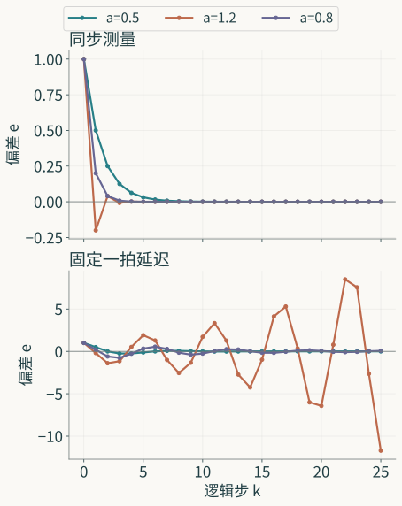

一个新控制器在同步测试中把误差压得更快。把它接到原有系统里，只多出一拍测量延迟，误差却开始增长。旧控制器在这个延迟下仍能稳定下来。局部改善与系统替换，因而给出了不同答案。

先用一个可以算到底的构造看清这件事。讨论储水量在某个工作点附近的偏差，把时间与流量作适当缩放，采用理想积分器

$$
e_{n+1}=e_n+u_n.
$$

$e_n\in\mathbb R$ 是第 $n$ 拍的偏差，$u_n$ 是下一段时间内净进出水造成的偏差增量。这里允许偏差有正有负，省略了真实水箱的容量、泵的饱和与出流细节；它与第二篇的孔口模型、第四篇的无进水衰减模型各有不同假设。这个构造用于检验反馈中的替换关系。

控制器收到测量 $y_n$，给出

$$
u_n=-a y_n,\qquad a>0.
$$

它的输入输出很简单。系统究竟怎样运动，还取决于 $y_n$ 对应哪一拍，以及 $u_n$ 作用于哪一段时间。

## 同步测试为什么支持了候选方案

先让 $y_n=e_n$，并在当拍执行控制增量。接线后，系统变成

$$
e_{n+1}=(1-a)e_n.
$$

旧控制器取 $a=0.5$，每拍误差乘以 $0.5$；候选取 $a=1.2$，每拍误差乘以 $-0.2$。候选误差会交替变号，但绝对值按更小的倍率下降。若当前比较的是同步条件下的误差衰减，候选确实更快。

这个判断有直接根据。对相同 $e_0$，两者的绝对值分别为 $0.5^n|e_0|$ 与 $0.2^n|e_0|$，都趋于零。它比较的是这项接线下的闭环误差，没有同时比较泵的最大控制量或其他性能。

两个控制器都接收一个数、返回一个数，替换看起来也很方便。但数字的对应时刻，在这次测试中已经被固定为当前拍。它不是接线图旁无关紧要的一项备注，而是推出上述递推的一个前提。

## 一拍延迟改写了递推

现在保留原有数据通路，让控制器在第 $n$ 拍收到上一拍的测量：$y_n=e_{n-1}$。于是

$$
e_{n+1}=e_n-ae_{n-1}.
$$

输入与输出仍是同样的数，控制器仍准确执行 $u_n=-ay_n$，系统递推却从一阶变成二阶。要确定未来，得给出 $e_{-1}$ 与 $e_0$ 两个初始值。

设一项响应具有 $e_n=r^n$ 的形式，代入得到特征方程

$$
r^2-r+a=0,
\qquad r_\pm=\frac{1\pm\sqrt{1-4a}}2.
$$

对旧控制器 $a=0.5$，两根为 $(1\pm i)/2$，模都是 $\sqrt{0.5}<1$，任意初始偏差的响应仍趋于零。候选 $a=1.2$ 的根则是一对共轭复数，模为 $\sqrt{1.2}>1$；存在任意小的初始偏差，使响应不能趋于零，振荡的幅度反而增长。原来那项同步衰减结论不能进入这个延迟上下文。

失败发生的位置已经清楚。没有参数读取错误，也没有把增益公式执行错；同步测试把测量与当前状态相接，原系统却把测量与上一拍相接。计算端口兼容，时间关系改变，反馈便把局部规则接成了另一种动力学。

这也区别了回放和反馈。给控制器回放一列测量，可以检查它是否按规则输出增量；回放中的下一项测量已经固定。接入水箱之后，控制增量会改变以后测到的偏差。要判断系统稳定性，输入序列如何被自身输出改变，就成了问题的一部分。

## 修正要保留哪项系统性质

先把允许的上下文规定为两种：测量始终同步，或者始终延迟一拍。延迟在一次运行中固定，不在两种情况间任意切换。我们希望替换后，对这些上下文中的任意初始偏差，误差仍趋于零。

同步的条件从 $|1-a|<1$ 得到 $0<a<2$。一拍延迟的条件也可以直接从特征根算出。

当 $0<a<1/4$，两根都是零与一之间的实数；当 $a=1/4$，重根为 $1/2$，响应含有 $n(1/2)^n$ 这样的项，仍趋于零。当 $a>1/4$，两根共轭，模为 $\sqrt a$，小于一恰要求 $a<1$。因此两种固定时序下的共同稳定范围是

$$
0<a<1.
$$

候选 $1.2$ 不在这个范围内。可以把它改为 $a=0.8$：同步时倍率为 $0.2$，保持了候选较快的绝对误差衰减；延迟一拍时根的模为 $\sqrt{0.8}<1$，也恢复了稳定性。

修正仍有代价。延迟上下文中，旧控制器根的模为 $\sqrt{0.5}$，新方案为 $\sqrt{0.8}$；后者的渐近衰减更慢。如果需要保存的性质只是“两种固定时序下都稳定”，修正有了证明；如果还要求延迟下至少保持旧方案的渐近衰减速度，$0.8$ 就没有满足这个要求。

可替换由此取得了确定的内容：替换哪个控制器，允许哪种时序，要保留哪项性质。也可以选择改造数据通路，使测量同步，再讨论 $1.2$；但这已改变上下文，需要验证同步承诺确实被实现。两个方向都可能有用，不能把改增益和改时序当成同一项修复。

*原创理论响应，取 e₋₁=e₀=1。上图同步，下图固定一拍延迟；三种增益采用相同初始历史。连线仅指示样本次序，图中没有丢包或时变延迟。*

## 接口要让假设有处落实

在这个例子中，只给输入输出各写一个“实数”，还不足以组合系统。输入 $y_n$ 是工作点偏差，输出 $u_n$ 是一段时间的净变化量；测量属于哪一拍、增量在哪一段执行、收到旧测量时怎么办，也参与规定组件。

这些约定使接线能够被检查。若另一个部件输出的是绝对水位，控制器却按偏差使用，工作点要先转换；若执行器接收的是每秒流量，控制器输出的是整段增量，时间与截面换算要先完成；若接收队列多留了一拍，同步承诺就没有落实。接口是组件与环境相接的具体边界。

组件的承诺也要落在这个边界上。控制器可以承诺，对收到的每个 $y_n$ 返回 $-ay_n$；测量通路可以承诺，收到的量确实是已声明的那一拍状态；执行器可以承诺，增量在相应区间作用。各项承诺接到一起，才给出已经证明稳定的递推。[^contracts]

如果同步承诺只写在控制器说明里，而产生测量的通路并不保证同步，那项证明缺了前提。把局部保证合成整体结论，得找到承担每项环境假设的部件或操作。系统图上的箭头让值相连，契约中的条件让证明相连。

本例的递推还说明，行为能够确定与行为稳定是不同问题。给定初值，旧控制器和失稳候选都能逐拍唯一计算下一项；候选的失败是响应放大，并非方程无解。换到含瞬时代数回路的系统，是否存在且唯一的联合行为又需另外建立。接线是否合法、行为能否确定、目标性质能否保持，各自有不同的检查对象。

## 允许的上下文决定证明到哪里

上述共同范围只处理固定的零拍或一拍延迟。若延迟随时间切换，递推变成

$$
e_{n+1}=e_n-ae_{n-d_n},
\qquad d_n\in\{0,1\}.
$$

我们已证明每种固定情况稳定，还没有由此证明所有切换序列都稳定。新的问题涉及不同更新规则的连续组合。若产品需要这种使用条件，就应把切换序列、可用历史与需要保持的性质放进证明，而不能把原来的两个算例相加当作答案。

真实装置还可能有饱和、丢包和噪声。要使用这里的稳定性结论，先检查运行系统是否满足这条理想递推，或与它有足以保留目标性质的误差关系。第三[篇](/posts/inside-the-model/)讨论的观察等价，也在此受到上下文限制：独立运行时相同的若干输出，在反馈中未必保留整个响应。

这种检查可以迁移到其他组件，却要跟着对象改换内容。构造一个带状态的工具：每次调用把计数器加一，再返回当前值。加入超时重试后，调用者虽然只得到一次返回，工具可能已经执行两次。接口仍收取同样字段、返回同样数字类型；如果系统性质是“一项请求最多增加一次”，就得考虑请求身份、执行状态和重复调用，而不能用这里的反馈增益条件判断替换。

## 一项可以承担的替换结论

回到最初提议，现在可以作出几项不同决定。保留原数据通路中可能出现的固定一拍延迟，就拒绝 $a=1.2$ 的原提议；取 $a=0.8$，可以在已声明的两种固定时序下保存趋零性质，但不保存旧方案在延迟下的渐近衰减速度；若保留 $1.2$，则要改造并检查同步通路。

这些决定都有可指出的依据。候选在同步测试中较快，仍是一项正确结果；它进入另一种反馈后失稳，也有明确推导。修正没有抹去其中任何一个，而是把局部改善、系统条件与需要保留的性质重新接好。

模型作为组件的意义，便落在这种可以继续连接、比较与替换的关系中。下一[篇](/posts/engineering-model-chain/)转向一项真实工程系统：模型内的证明、程序执行和道路试验，分别给了团队什么根据，又怎样支持一次运行与更新的判断？

---

**模型与工程：六篇核心阅读**

1. [数学怎样把握问题](/posts/mathematical-language-and-problems/)
2. [水箱怎样成为模型](/posts/from-observation-to-model/)
3. [模型内部保存什么](/posts/inside-the-model/)
4. [模型改变后，哪些结论还能保留](/posts/model-transformations/)
5. [模型怎样成为组件](/posts/model-as-open-component/)
6. [从模型到工程判断](/posts/engineering-model-chain/)

[^contracts]: 把环境假设与组件保证分开，是契约方法的基本思路。参见 Albert Benveniste et al., *Contracts for System Design*, INRIA Research Report RR-8147，2012，§VII-A，Definition 3，p.30。这里的同步与固定延迟证明由正文构造完成。[研究报告](https://inria.hal.science/hal-00757488)。
