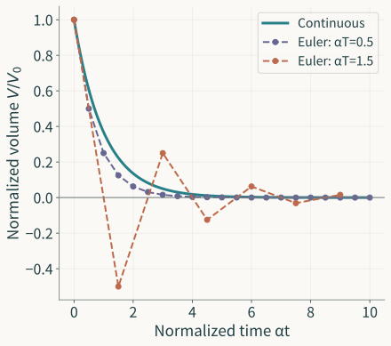

A storage model says volume keeps decreasing but stays positive at every finite time. Replace it with a stepwise calculation and the result may still tend to zero while first producing negative volume. Checking only eventual decay can miss the change.

A transformation can answer different property questions differently. The [previous essay](/en/posts/inside-the-model/) related height and volume through invertible coordinates. This one starts with a solvable decay equation and checks what sampling, approximation, and implementation preserve.

## Fixing the Model under Comparison

Take an ideal linear storage model with outflow proportional to current volume and no inflow:

$$
\frac{dV}{dt}=-\alpha V,\qquad
\alpha>0,\qquad V(0)=V_0>0.
$$

The volume $V$ is nonnegative, and $\alpha$ has units of inverse time. This is a different outflow law from the square-root height relation in essay II. A signed height deviation near an operating point also cannot stand in for this nonnegative total volume.

The solution is

$$
V(t)=V_0e^{-\alpha t},\qquad t\ge0.
$$

Volume decreases monotonically, stays strictly positive at every finite time, and tends to zero only as time tends to infinity. These are definite properties of the specified object. We can now ask which remain true after replacing it with a computational rule.

## Exact Sampling Preserves Values at Sample Times

Fix an interval $T>0$ and retain volumes at $0,T,2T,\ldots$. Writing $V_n=V(nT)$ gives directly

$$
V_{n+1}=e^{-\alpha T}V_n.
$$

This recurrence gives exact sample values. Its factor lies strictly between zero and one, so samples remain positive, decrease, and tend to zero. The continuous solution and recurrence correspond exactly at these times.

For a volume integral over an interval, reconstruction matters. Filling every interval $[nT,(n+1)T)$ with its left-end value $V_n$ gives a staircase. The continuous model keeps decaying exponentially within the interval. The samples agree; intermediate values do not.

The continuous integral over one interval is

$$
\int_{nT}^{(n+1)T}V(t)\,dt
=V_n\frac{1-e^{-\alpha T}}\alpha,
$$

The staircase gives $TV_n$, which is larger because $1-e^{-\alpha T}<\alpha T$. The staircase is a reconstructed signal, not a claim that actual tank volume stays constant between samples. Exact samples answer sample questions. An observation of the intervening process brings reconstruction into the answer.

Two changes should thus be separated. A model may still specify a continuous process while publishing samples, or it may specify a different process that updates in steps. One changes visible information; the other changes the dynamics. A row of plotted sample points does not settle which happened.

## Approximation Separates Two Properties

Approximating the interval's change by its initial rate gives explicit Euler:

$$
\widehat V_{n+1}
=\widehat V_n+T(-\alpha\widehat V_n)
=(1-\alpha T)\widehat V_n.
$$

Set $\lambda=\alpha T>0$. The multiplier $1-\lambda$ lets us check several properties directly.

At $0<\lambda<1$, the multiplier lies between zero and one: nonnegative initial values stay nonnegative, and positive ones decrease. At $\lambda=1$, the next value becomes zero and stays there. Nonnegativity survives, but strict positivity at finite times does not.

At $1<\lambda<2$, the multiplier is negative with magnitude below one. Values alternate in sign while their absolute magnitude decreases to zero. The next step from positive volume is negative. Reporting it as stored water would violate the state's original meaning.

At $\lambda=2$, equal-magnitude sign alternation persists; larger $\lambda$ makes magnitudes grow too. Nonnegativity and convergence therefore require different ranges:

$$
\begin{aligned}
\text{Nonnegative initial states stay nonnegative:}&\quad 0<\alpha T\le1,\\
\text{All initial states converge to zero:}&\quad 0<\alpha T<2.
\end{aligned}
$$

*Original theoretical curves with initial volume normalized to 1. Lines show sample order; the Euler results concern discrete samples. At αT=1.5, convergence coexists with loss of nonnegative volume.*

The convergence range permits steps that fail the volume interpretation. Strict positivity further excludes $\alpha T=1$ from the nonnegativity range.

“Stability” needs a specific meaning. Here it means that the linear recurrence's initial-condition influence vanishes asymptotically. It does not also establish nonnegative volume, an accurate finite-time process, or small integral error. These properties can be checked together, each with its own reason.

## How Smaller Steps Bound Error

We can prove that sufficiently fine Euler grids approximate the continuous samples over a fixed finite interval. This conclusion need not rest on visually close curves.

For $0<\lambda<1$,

$$
-\log(1-\lambda)=\lambda+\delta,
\qquad
\delta=\int_0^\lambda\frac{s}{1-s}\,ds
\le\frac{\lambda^2}{2(1-\lambda)},
$$

Thus the Euler value at $t_n=nT$ is

$$
\widehat V_n
=V_0(1-\lambda)^n
=V_0e^{-\alpha t_n}e^{-n\delta}.
$$

It is below the continuous volume at that time, with additional decay $e^{-n\delta}$. Fix $H>0$. At every $nT\le H$, using $1-e^{-x}\le x$ gives

$$
0\le V(t_n)-\widehat V_n
\le V_0 n\delta
\le\frac{V_0\alpha^2HT}{2(1-\alpha T)}.
$$

The bound tends to zero with $T$. It applies uniformly at all grid times within this fixed horizon and retains the effects of initial volume, decay parameter, and observation length.

This complements the earlier property checks. Refinement reduces sample error, while the nonnegative step condition still matters for the actual calculation. An algorithm that converges under refinement can produce negative volume on the chosen coarse grid. An asymptotic result describes a refinement path; conditions locate the present computation on that path.

Retain the objects compared by the bound: the continuous solution and ideal Euler recurrence at grid times, with the same initial value and $\alpha$. Interpolation into a continuous curve or a horizon changing with the grid introduces operations needing further checks. Applying an old bound to a new comparison first requires confirming the objects still match.

## A Recurrence and Its Running Program Differ

Ideal Euler is already a discrete mathematical model. A program implementing it must handle numerical representation, parameter reading, loop times, and output. A correct recurrence specifies what it should execute.

To examine one difference, suppose each program step has total error $\eta_n$ relative to that rule, with an established bound $|\eta_n|\le\varepsilon$:

$$
\widetilde V_{n+1}=r\widetilde V_n+\eta_n,
\qquad r=1-\alpha T,\qquad 0\le r<1.
$$

Starting from the same initial value, the program-rule difference propagates by the same factor while past errors accumulate:

$$
|\widetilde V_n-\widehat V_n|
\le\varepsilon\sum_{j=0}^{n-1}r^j
=\varepsilon\frac{1-r^n}{1-r}
\le\frac\varepsilon{\alpha T}.
$$

This bound accumulates step errors in the worst direction. Actual magnitudes, signs, and dependence affect the result. If $\varepsilon$ is a fixed bound independent of $T$, shorter steps increase the step count and enlarge this coarse bound. Choosing a useful step requires estimating $\varepsilon$ from the actual implementation mechanism and considering it together with discretization error.

Wrong units for $\alpha$, or disagreement between loop $T$ and output timestamps, may make the program execute another recurrence. Rather than ask only about “model accuracy,” we can check relations between equation, discrete rule, and execution separately. The needed check follows the object changed.

## Relations that Support Further Use

We now have specific judgments. Exact sampling preserves sample values; staircase reconstruction changes interval integrals; Euler nonnegativity and convergence require different step ranges; grid error over a fixed finite horizon has a bound; implementation adds another error to estimate.

They support different choices. Approximate volume at selected times calls for error and nonnegativity conditions. Integral quantities require reconstruction checks. Feeding samples into feedback makes sampling times and errors part of a new closed-loop relation.

Transformation yields these relations for further use: preserved conclusions, changes introduced by operations, and error under stated conditions. The [next essay](/en/posts/model-as-open-component/) turns to a feedback model with input and examines why a candidate that regulates faster synchronously may fail with delayed measurements.

---

**Models and Engineering: the six core essays**

1. [How Mathematics Forms Problems](/en/posts/mathematical-language-and-problems/)
2. [How a Tank Becomes a Model](/en/posts/from-observation-to-model/)
3. [What a Model Retains](/en/posts/inside-the-model/)
4. [Which Conclusions Survive a Model Change?](/en/posts/model-transformations/)
5. [How a Model Becomes a Component](/en/posts/model-as-open-component/)
6. [From Models to Engineering Judgment](/en/posts/engineering-model-chain/)
