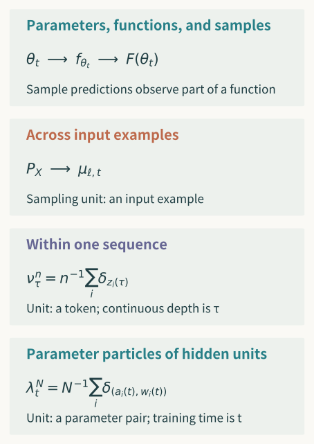
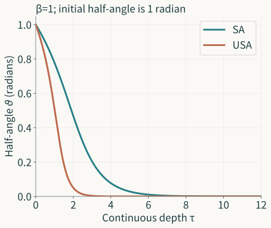

A network with billions of parameters has a large parameter-storage requirement, but that number does not yet specify our research object. Training can move parameters and change intermediate representations; output functions have their own scale of change. Rearranging hidden units changes the parameter array while preserving the function. As width grows, feature changes vanish under one parametrization and can persist under another. What grows, and what remains, must be calculated along these distinct relations.

Transformers bring the difficulty to another setting. A sequence's tokens interact across layers. We can describe the evolution of many points or the evolution of a measure. Finite points and measures have an exact connection; increasing the number of points or layers raises further approximation questions. Even if two dynamics both form one cluster, deleting the attention denominator and changing the metric remain different operations. The former changes evolution; the latter may give the original evolution a new geometric interpretation.

The third essay separated presentation, semantics, observation, and identity. This essay makes transformations work between those objects. We start with the chain rule for finite networks, then examine training kernels, width, geometry, and depth. We next enter self-attention's particles and measures to derive normalization, error, and clustering. Each result supplies a relation we can use further and identifies feedback that would change the original mathematical question.

## In which space is the object high-dimensional?

Fix an architecture. Parameters are $\theta\in\Theta\subseteq\mathbb R^D$, inputs belong to $X$, and the output function is $f_\theta:X\to\mathbb R^k$. Here $D$ is parameter dimension and $k$ output dimension. An input can be an encoded sequence rather than a scalar. Write the representation at layer $\ell$ as $z_{\ell,\theta}:X\to\mathbb R^{d_\ell}$. Parameter space, function space, and each representation space now have distinct elements and coordinates.

Suppose training forms a trajectory $\theta_t$. Write $f_t=f_{\theta_t}$ and $z_{\ell,t}=z_{\ell,\theta_t}$. Initially, $t$ means continuous training time; a stepwise algorithm requires its own discrete step count. Layer index $\ell$ tells us where a forward computation is, rather than how long training has lasted. Autoregressive position tells us how many tokens have been generated or supplied. Calling all three “iterations” obscures the object compared by a curve.

If the input population has law $P_X$ and the representation map is measurable, we can study the pushforward

$$
\mu_{\ell,t}=(z_{\ell,t})_\#P_X,
\qquad
\mu_{\ell,t}(B)=P_X\bigl(z_{\ell,t}^{-1}(B)\bigr).
$$

This is the probability that a representation of an input falls in $B$. Changing the population can change $\mu$ with parameters fixed; changing parameters can change it with the population fixed. Separating these sources lets us analyze training and population effects on a scatterplot respectively. When both change, comparison must specify which conditions it holds fixed. Without a specified population, a finite-sample plot observes those samples.

Distances have different addresses too. $\|\theta-\theta'\|_2$ measures parameter-coordinate differences. For fixed input, we can measure $\|z_{\ell,\theta}(x)-z_{\ell,\theta'}(x)\|_2$. Function comparisons can concern sample error, population mean error, or maximum error on an input domain. For square-integrable outputs, for example, $\|f-g\|_{L_2(P_X)}^2=\int\|f(x)-g(x)\|_2^2\,dP_X(x)$. Small population error can coexist with large differences in a low-probability region; maximum error includes that region.

The third essay's hidden-unit permutation gave an exact comparison. Rearranging adjacent weights together preserves all of $f$, rearranges representation coordinates, and usually changes the parameter array. Comparing representations coordinate by coordinate reveals a change; aligning the permitted permutation first may give zero difference. Both readings have mathematical meaning, selected by purpose. Function equality also did not establish equality of continued training, since updates may use those coordinates.

We can consequently make “a high-dimensional model is complex” more precise. Parameter and realization size matter directly for computational cost. Functions and layer operators are closer to input-perturbation questions. Feature formation requires representations and their population relations rather than a terminal loss alone. Choosing spaces gives an ambitious inquiry objects that can actually be compared.

## How transformations retain, lose, and add content

First distinguish changes along objects already developed. An invertible coordinate change carries structure to another presentation. The third essay's $V=Ah$, for fixed $A>0$, converted evolution, initial conditions, and thresholds together, permitting recovery in both directions. Changing the variable but keeping an old initial condition does not perform that correspondence. Invertibility and preservation jointly support further reasoning; numerical resemblance does not prove them.

A quotient groups objects already declared equivalent. Hidden-unit permutation can remove coordinate redundancy; absolute-value observation identifies $x$ and $-x$. Continuing an operation after identification requires independence from the representative. Absolute values determine the absolute value of a product but not a sum. Learning raises the same obligation: if parameters realizing the same function induce different next functions, training has not become a single-valued update on that function quotient.

Coarse-graining or projection retains some information. A fine object generally determines its projection, while the projection need not recover the fine object uniquely. A vector of predictions on fixed samples projects a function. Agreement there does not establish agreement elsewhere. Whether lost information matters depends on subsequent queries. New inputs or compositions may require a richer observation or enough added state to close the coarse object.

A lift adds needed structure. Sometimes the original topology is too weak to support a response we already want to study. For integers $n\ge1$, take

$$
x_n(s)=n^{-1/2}(\cos ns,\sin ns),\qquad 0\le s\le2\pi.
$$

The paths converge uniformly to zero because their maximum amplitude is $n^{-1/2}$. Yet $dx_n^2=\sqrt n\cos(ns)\,ds$, so $\int_0^{2\pi}x_n^1\,dx_n^2=\int_0^{2\pi}\cos^2(ns)\,ds=\pi$. The zero path has zero integral. Uniform convergence of path amplitude has not preserved this response. If the problem uses it, richer objects including the relevant iterated integrals are needed. The first essay connected this entrance to rough-path construction.

Approximation needs common observation and error. For the earlier scalar storage law $\dot V=-aV$, $a>0$, exact sampling has factor $e^{-a\Delta}$; Euler has $1-a\Delta$. For nonnegative initial values, Euler preserves nonnegativity when $0<a\Delta\le1$ and decays to zero when $0<a\Delta<2$. In $1<a\Delta<2$, values decay but alternate in sign. Terminal decay and nonnegativity throughout are different observations.

There is also a finite-interval error relation. For $0<a\Delta<1$ and $j\Delta\le H$, let $\delta=-\log(1-a\Delta)-a\Delta$. Using $\delta=\int_0^{a\Delta}u/(1-u)\,du\le(a\Delta)^2/[2(1-a\Delta)]$ and $1-e^{-j\delta}\le j\delta$ gives

$$
0\le V_0e^{-aj\Delta}-V_0(1-a\Delta)^j
\le\frac{V_0a^2H\Delta}{2(1-a\Delta)}.
$$

For fixed $H$, the right side vanishes. It compares grid values with the same initial condition rather than recovering all continuous-interval properties. This storage law also differs from the second essay's orifice-outflow law. Model, computation, and query retain their own addresses. The example supplies a short bridge from finite approximation to the network questions below.

Taking a limit requires a sequence of differently sized objects to enter a common space. Width changes parameter dimension, so arrays do not immediately have a shared fixed-coordinate distance. Function values, kernels, empirical measures, or normalized statistics can provide comparison. The object of convergence, its topology, and whether time or input ranges are fixed affect the conclusion. A limit is not synonymous with “sufficiently large.” Proximity of a finite object requires another error relation.

Operations can be combined, but their retained relations must connect. Quotienting before training requires an update that descends. Projecting before a limit requires the relevant continuity. Approximating before a long-time judgment requires long-time error control. Changes in mathematical language now have concrete content: some re-coordinate an object, some give a question richer structure, and some change the research object itself.

## How parameter training induces function change

Fix $m$ training inputs $x_1,\ldots,x_m$ and first take scalar outputs. Define the prediction vector $F(\theta)=(f_\theta(x_1),\ldots,f_\theta(x_m))\in\mathbb R^m$. This observes the current samples, while $f_\theta$ remains defined on all of $X$. Use a differentiable loss $\ell:\mathbb R^m\to\mathbb R$, giving objective $\mathcal L(\theta)=\ell(F(\theta))$. Labels and samples are fixed here, entering $\ell$ and $F$.

Assume differentiability along the trajectory and Euclidean parameter gradient flow. Let $J_F(\theta)\in\mathbb R^{m\times D}$ be the prediction Jacobian, with row $i$ equal to $\nabla_\theta f_\theta(x_i)^T$. The chain rule gives parameter velocity, then prediction velocity:

$$
\dot\theta=-J_F(\theta)^T\nabla\ell(F),
\qquad
\dot F=-K_\theta\nabla\ell(F),
\qquad
K_\theta=J_F(\theta)J_F(\theta)^T.
$$

All three identities hold for the current finite network. They require no infinite width. $K_\theta$ is an $m\times m$ Gram matrix, with entry $(i,j)$ the inner product of parameter gradients at two inputs. It describes how a loss direction moves sample predictions through parameter space. If the direction induced by the first sample's error changes the second prediction, the cross term carries that influence. The process contains more than independent diagonal adjustments.

The matrix is positive semidefinite: for every $u\in\mathbb R^m$, $u^TK_\theta u=\|J_F^Tu\|_2^2\ge0$. Along the trajectory, $d\ell(F)/dt=-\nabla\ell(F)^TK_\theta\nabla\ell(F)\le0$. Loss is nonincreasing, but convergence to arbitrary labels does not follow. Some prediction directions may belong to a nullspace, and the matrix may change during training. Descent and attainable directions are distinct questions we can now investigate.

For fixed input $x$ outside the training samples, the chain rule gives

$$
\frac{d f_\theta(x)}{dt}
=-\sum_{j=1}^m k_\theta(x,x_j)\,\partial_j\ell(F),
\qquad
k_\theta(x,x')=\nabla_\theta f_\theta(x)^T\nabla_\theta f_\theta(x').
$$

The sample matrix $K$ restricts this whole-input training kernel to sample pairs. Knowing $K$ supports sample-prediction analysis. Evolution at a new input also needs its cross-kernel values with the training inputs. A finite Gram matrix does not uniquely determine the kernel on all inputs or establish generalization error on a target population.

We temporarily use $\ell(F)=\frac12\|F-y\|_2^2$, without a $1/m$ averaging factor. An averaged loss also changes gradients and time scale; different source conventions require conversion. Multiple outputs can be flattened across samples and coordinates, yielding a Gram matrix that retains cross-coordinate coupling. Rearrangement changes its presentation, while corresponding rearrangement of observation and loss keeps the inference aligned.

Euclidean flow is one choice. With a positive-definite preconditioner $M(\theta)$, velocity becomes $-M\nabla\mathcal L$ and the prediction matrix becomes $J_FMJ_F^T$. Momentum adds state, stochastic gradients add a random process, and discrete step size adds a one-step approximation. Each can have its own semantics and observation. Treating them all as the same $K$ would erase structure supplied by the algorithm.

The finite identity first shows how parameters carry loss directions into function change, rather than simplifying a model immediately to a fixed kernel. We can now ask whether the kernel freezes, has a limit, or retains feature learning. The third essay's equal functions with unequal training have a concise address: equal $F$ may have different $J_FJ_F^T$, hence different prediction velocities.

## Fixed-kernel evolution and comparison with a changing kernel

If $K_\theta$ is exactly fixed at $K_0$ under specified conditions, squared-loss residual $r=F-y$ satisfies $\dot r=-K_0r$, giving $r(t)=e^{-K_0t}r(0)$. A symmetric positive-semidefinite matrix has an orthogonal eigendecomposition. Each component of the initial residual decays as $e^{-\lambda_it}$; nullspace components remain. A fixed kernel thus connects learnable directions and rates explicitly.

A positive minimum eigenvalue gives exponential decay of every sample-residual component. A small eigenvalue gives a slow direction; a zero eigenvalue retains the initial nullspace residual. These judgments concern the current samples and loss. Changing samples changes the Gram matrix; changing purpose changes the error that matters. Fast training-error decay does not determine risk outside the sample set alone.

A finite network generally supplies $K(t)$. To approximate it by a fixed kernel, specify the error. Let both prediction processes start at the same $F(0)$, with original residual $r(t)$ and frozen-kernel residual $r_0(t)$. Assume $\|K(t)-K_0\|_{\mathrm{op}}\le\varepsilon_T$ on $[0,T]$. Their difference $e=r-r_0$ satisfies

$$
\dot e=-K_0e-(K(t)-K_0)r,
\qquad
e(t)=-\int_0^t e^{-K_0(t-s)}(K(s)-K_0)r(s)\,ds.
$$

Since $K_0$ is positive semidefinite, $\|e^{-K_0u}\|_{\mathrm{op}}\le1$. Original loss descent gives $\|r(s)\|_2\le\|r(0)\|_2$. Therefore $\|e(t)\|_2\le t\varepsilon_T\|r(0)\|_2$. This bound needs the stated conditions rather than learnability of every original-kernel direction. Small kernel variation becomes a finite-time prediction bound; extending time requires another estimate.

Approximation by another kernel $\widehat K_0$, or different initial predictions, introduces additional terms in the difference equation. A bound assuming identical initial conditions cannot be retained unchanged. New-input analysis also needs changes in its cross-kernel values. Freezing now has a visible benefit and cost: training becomes a linear residual process, and changing geometry enters an error that must be controlled.

Finite points can also reach a larger observation through input geometry. Suppose the common input domain $U\subseteq\mathbb R^p$ is compact and test points form a radius-$h$ covering net. If the two functions are $L_f,L_g$ Lipschitz on $U$ and net-point error is at most $\delta$, choose a point within $h$ of any $x\in U$. The triangle inequality gives $|f(x)-g(x)|\le\delta+(L_f+L_g)h$. Coverage and uniform continuity together carry finite comparisons to the whole domain. High-dimensional domains may need many points; smaller data support changes coverage. These conditions must come from the current object. Sampling from a population does not itself cover all legal inputs.

This gives a useful empirical question. Compare $K(t)$ on selected samples and check whether fixed-kernel approximation covers the needed time and predictions. If feature formation is the target, also observe representations and readout relations rather than declaring equal mechanisms from similar predictions. An approximation can serve current predictions without retaining every internal question. The required content should guide adoption.

We have not yet established that greater width makes every network a kernel. We have a finite identity, a conditional fixed-kernel solution, and a checkable error bound. How width reduces variation depends on parametrization, initialization, learning rate, activation, and training range. The next section puts those conditions into a comparison of two scales.

## How width choices retain feature formation

Take a shallow network we can calculate directly, with scalar input $x\in[-R,R]$, activation $\sigma=\tanh$, and hidden width $N$. First use

$$
f_N(x)=\frac1{\sqrt N}\sum_{i=1}^N a_i\sigma(w_i x).
$$

Both $a_i,w_i$ are trainable; write $f_N(t,x)$ when training time must be explicit. Parameters use ordinary Euclidean gradient flow and loss remains a squared-error sum on fixed $m$ samples. Width $N$ differs from sample count $m$. To make the scaling statement a complete finite construction, take even $N$, with paired units initialized at equal $w$ and opposite $a$, and uniform initial bounds on $|a_i|,|w_i|$. Then $f_N(0,x)=0$ on all inputs and initial loss does not grow with width.

This deterministic pairing removes initialization fluctuations for the construction, rather than describing every training initialization. Let $r_j=f_N(x_j)-y_j$. Calculation gives

$$
\dot a_i=-N^{-1/2}\sum_{j=1}^m r_j\sigma(w_i x_j),
\qquad
\dot w_i=-N^{-1/2}a_i\sum_{j=1}^m r_j\sigma'(w_i x_j)x_j.
$$

Loss descent uniformly bounds $\|r(t)\|_2$ in $N$. Since $|\sigma|\le1$, $|\sigma'|\le1$, and inputs and sample count are fixed, $|\dot a_i|\le C/\sqrt N$. On fixed $[0,T]$, all $a_i$ remain uniformly bounded, giving $|\dot w_i|\le C_T/\sqrt N$. Integration bounds both parameter changes by $O_T(N^{-1/2})$ and representation changes $\sigma(w_ix)$ by the same order uniformly on $|x|\le R$.

The factor $N^{-1/2}$ comes from output parametrization. Loss and boundedness conditions then extend it over a finite time interval. This is a calculation rather than the intuition that many parameters each change little. Time growing with $N$ may change constants and accumulated effects. A width-dependent diverging initial loss or another learning-rate scale would likewise require a new argument.

The corresponding training kernel is

$$
k_N(x,x')=\frac1N\sum_{i=1}^N
\left[\sigma(w_ix)\sigma(w_ix')
+a_i^2\sigma'(w_ix)\sigma'(w_ix')xx'\right].
$$

The first and second derivatives of $\sigma$ are bounded on the current range. Each summand changes by $O_T(N^{-1/2})$, and averaging keeps that order. On fixed samples, $K_N(t)-K_N(0)$ has an analogous operator bound, giving frozen-kernel prediction error through the preceding section. If initial empirical statistics also have a definite limit, we can study convergence of $K_N(0)$. Feature freezing, kernel approximation, and the initial-kernel limit are three connected steps.

Now use a different scale:

$$
\widetilde f_N(x)=\frac1N\sum_{i=1}^N a_i\sigma(w_ix),
\qquad
\dot\theta=-N\nabla_\theta\mathcal L.
$$

Output becomes an average and training speed is multiplied by $N$. Each unit has $\dot a_i=-\sum_j r_j\sigma(w_ix_j)$ and $\dot w_i=-a_i\sum_j r_j\sigma'(w_ix_j)x_j$. Width factors cancel, so the previous $N^{-1/2}$ bound no longer forces feature changes to vanish. They may still vanish for particular loss, data, or initialization. A scale admitting finite change is different from every task necessarily producing it.

The same pairing construction exhibits the possibility. Initialize every $w_i(0)=1$, half the $a_i(0)=1$, and half $-1$, with sole sample $x=1$ and label one. Both networks initially represent the zero function. The second scale has residual minus one and $\dot w_i(0)=a_i(0)\sigma'(1)$. Positive and negative groups separate at rates that do not shrink with $N$. The first scale adds a factor $N^{-1/2}$. Equal initial functions do not impose the same scale of feature evolution.

Collect parameter pairs into $\lambda_t^N=N^{-1}\sum_i\delta_{(a_i(t),w_i(t))}$. The average network becomes $\widetilde f_N(x)=\int a\sigma(wx)\,d\lambda_t^N(a,w)$. Each particle's velocity depends on shared sample residuals. Feature learning gains another object: moving parameter particles change their distribution, which changes the function. This relation already holds at finite $N$. A general-initial-measure limit additionally needs existence, stability, and finite-error arguments; writing an integral does not establish them.

Tensor Programs IV gives a broader classification for fixed-depth MLPs and abc parametrizations. Its classification uses specified $\tanh$ or smooth activations and stable, nontrivial parametrizations, with explicit training-routine and feature-change definitions.[^tpiv] Under those conditions it separates feature-learning and kernel regimes; linear activations outside them cannot simply inherit the classification. Admitting feature learning requires some routine, fixed step, and input with nonvanishing feature change in the width limit. The kernel regime requires one fixed positive-semidefinite kernel organizing updates for every admissible routine. These are existential and universal judgments respectively.

Our two finite-flow calculations show how scale enters change. The source classification concerns its defined discrete SGD limits. They connect through the mechanism question while retaining different proof objects. If feature formation is the target, choose a model retaining it or specify finite corrections. If prediction with fixed features is the target, kernel dynamics can be useful. Expressivity, training reachability, population risk, and feature mechanism each have an object; simplification at one level does not answer them all.

## Why changing parameter coordinates also requires a metric

The third essay's $f_{a,b}(x)=abx$ showed different Euclidean training velocities for one function. A coordinate change reveals the relation directly. Let $\theta=h(\eta)$ be smoothly invertible, with invertible Jacobian $H=Dh(\eta)$. Both coordinates represent the same function and loss. But adopting Euclidean gradients anew in $\eta$ gives $\dot\eta=-H^T\nabla_\theta\mathcal L$, hence

$$
\dot\theta=-HH^T\nabla_\theta\mathcal L.
$$

This generally differs from the original $-\nabla_\theta\mathcal L$. Loss-value correspondence has been preserved, while geometry of parameter motion changes. Orthogonal transformations satisfy $HH^T=I$ and preserve ordinary Euclidean gradients; arbitrary scaling does not. Hidden permutations in the third essay supplied an orthogonal transformation with a provable preservation relation.

To retain original Euclidean geometry in new coordinates, give tangent vectors the pullback metric $G=H^TH$. Then $\dot\eta=-G^{-1}H^T\nabla_\theta\mathcal L$, and multiplying by $H$ yields $\dot\theta=-\nabla_\theta\mathcal L$. Coordinates and metric now move together, giving corresponding trajectories. A language change can reveal the geometry of a process; a variable change followed by a default metric may instead define another process.

This also connects learning rates and units. Scaling a coordinate by ten changes gradient scaling in the reverse direction. Keeping one numerical step size on each coordinate then gives different actual motion. Metric and preconditioner organize direction and magnitude together. Saying only that loss decreases retains a scalar result without specifying how the process moves in parameter space.

Quotients have their own difficulty. If symmetry preserves function and metric, and updates commute with the group action, training may define a good process on the quotient. If equal-function parameters induce different $J_FJ_F^T$, function values alone do not determine the next velocity. Retain more state or alter training to make it close. Quotienting removes proved redundancy, while variables affecting the future need their own treatment.

The metric here is first a mathematical choice. Suitability for optimization requires further grounds. It may improve conditioning, change implicit preferences, or change reachable processes; usefulness must be checked along loss, data, realization, and purpose. Self-attention will give a concrete later example: changing a metric retains the vector field while changing its gradient interpretation. Both cases require identifying objects before calculating preservation.

## Giving effective geometry calculable content

Parameter dimension $D$ may be large while one observation involves fewer directions. To give effective complexity content, specify a direction set $S\subseteq\mathbb R^D$ and norm. For standard Gaussian $g\sim N(0,I_D)$, define Gaussian width $w(S)=\mathbb E\sup_{u\in S}\langle g,u\rangle$. It measures the largest random linear observation across the set, rather than its cardinality or manifold dimension.

Take a $k$-dimensional linear subspace $E$ and its unit sphere $S$, with $1\le k\le D$. Projection $\Pi_Eg$ is standard Gaussian within that subspace. Selecting the best unit direction gives $\sup_{u\in S}\langle g,u\rangle=\|\Pi_Eg\|_2$, so

$$
w(S)=\mathbb E\|g_k\|_2,
\qquad
\sqrt{2/\pi}\,\sqrt k\le w(S)\le\sqrt k.
$$

Jensen's inequality and $\mathbb E\|g_k\|_2^2=k$ give the upper bound. For the lower bound, $\|g_k\|_2\ge\|g_k\|_1/\sqrt k$, while each standard Gaussian coordinate has expected absolute value $\sqrt{2/\pi}$. Width grows as $\sqrt k$; unused ambient coordinates do not enlarge this set's width. The structure is a specified subspace, rather than one supplied automatically by a network's size.

Next take $M$ fixed unit directions $u_1,\ldots,u_M$. Their observations may be correlated, yet all can be controlled. For $s>0$, $e^{s\max_i|\langle g,u_i\rangle|}\le\sum_i(e^{s\langle g,u_i\rangle}+e^{-s\langle g,u_i\rangle})$. Gaussian moment-generating functions bound the right side's expectation by $2Me^{s^2/2}$. Taking logarithms, applying Jensen, and optimizing $s$ gives

$$
\mathbb E\max_i|\langle g,u_i\rangle|
\le\sqrt{2\log(2M)}.
$$

For $r\ge0$, applying one-dimensional Gaussian tails and a union bound similarly gives $\Pr(\max_i|\langle g,u_i\rangle|\ge r)\le2Me^{-r^2/2}$. Independence across directions is unnecessary. The directions must be fixed or independent of the Gaussian draw being tested. Uniform control of many queries incurs a logarithmic dependence on $M$ beyond one-direction scaling.

Selecting the direction from the same noise can defeat the bound. Let the sole direction be $u(g)=g/\|g\|_2$, defined arbitrarily at zero. Then $\langle g,u(g)\rangle=\|g\|_2$, with expectation of order $\sqrt D$. Treating it as a preselected direction would incorrectly give a dimension-independent bound. Dependence between learned directions and test randomness is therefore a condition to establish. Sample splitting, conditioning, or a new complexity estimate may supply the connection.

Small intrinsic dimension also requires a structural choice. A planar circle is a smooth one-dimensional manifold with a two-dimensional linear span. A finite set can have local manifold dimension zero while containing many distant directions. For hypercube vertices $S=\{(\pm1,\ldots,\pm1)/\sqrt D\}$, for example,

$$
w(S)=\mathbb E\frac{\|g\|_1}{\sqrt D}
=\sqrt{2/\pi}\,\sqrt D.
$$

A local zero-dimensional label has not made global directional complexity small. This does not contradict the subspace calculation; the structures differ. Discrete mixtures, low rank, smooth manifolds, and branching sets can resemble one another in a two-dimensional projection while requiring different coverage for global perturbations and uniform queries.

For representations, we might study population support, tangent directions near data, or changes reachable during training. Each choice requires identifying how the set is obtained, its distance, and the comparison scale. Low covariance rank states a second-order linear property without recovering a smooth manifold alone. Information readable from a variable does not alone establish that the output uses it. Geometry sharpens the question; mechanisms reconnect through the appropriate intervention and generation relations.

## Why propagation through layers requires operators

Fix trained parameters and let forward layers satisfy $z_{\ell+1}=T_\ell(z_\ell)$. At differentiable points, first-order input changes propagate through Jacobians: $\delta z_L\approx J_{L-1}\cdots J_0\delta z_0$. Products are ordered and directions change between layers. Collecting one eigenvalue per layer does not specify that effect; exchanging order may change the product itself.

Finite perturbations require uniform Lipschitz conditions on relevant connecting paths or visited regions. A derivative at one point describes a local first-order response. Spectral norms give $\|J_{L-1}\cdots J_0\|_{\mathrm{op}}\le\prod_\ell\|J_\ell\|_{\mathrm{op}}$. This is useful but can be loose when directions do not align. Studying the product, reachable directions, or task observation can yield a comparison closer to the actual question.

Stable eigenvalues can coexist with substantial transient amplification. For $M>0$, take

$$
A=\begin{pmatrix}-1&M\\0&-1\end{pmatrix},
\qquad
e^{sA}=e^{-s}\begin{pmatrix}1&Ms\\0&1\end{pmatrix}.
$$

Both eigenvalues are minus one, and every fixed initial response eventually vanishes. Starting from $e_2=(0,1)^T$, however, the norm at $s=1$ is $e^{-1}\sqrt{1+M^2}\ge M/e$. Increasing $M$ makes amplification at this finite time arbitrarily large. Here $s$ is evolution time in the operator construction, rather than training time or an actual network's layer index.

The matrix is nonnormal, so an orthogonal eigenbasis cannot decouple all directions. Asymptotic spectrum describes eventual decay; singular values and induced norms describe maximal amplification at a specified time. Even diagonalizable matrices require carrying the coordinate change's condition number back to the original norm. Listing eigenvalues has not performed that return.

This construction establishes the need for operator comparisons, rather than reporting the same mechanism in an actual Transformer. Studying a trained network needs its corresponding Jacobians, norms, and input range, followed by the required task observation. Normalization, residual connections, activation, and attention coupling all enter those operators. Derivatives observed on a few samples address those samples and their relevant neighborhoods.

Operators connect geometry and scale too. A large full-space norm may mainly involve directions absent from current data; a small average may miss rare directions central to a task. Restriction to a specified direction set can help. If training, intervention, or context moves outside that set, its bound must be checked again. Effective geometry chooses the comparison, and operators specify how change passes through it.

## Two ways contributions accumulate with depth

Width changes coordinate scale within layers; depth adds connected layers. Write a residual network as $z_{\ell+1}=z_\ell+s_Lg_\ell(z_\ell)$, with total depth $L$ and branch multiplier $s_L$. Random initialization and training-induced updates need not accumulate alike. The former can partly cancel; the latter can align through shared loss. Dividing each layer by depth does not yet specify which process is retained.

First inspect initialization through an explicit scalar construction. Take independent $\xi_1,\ldots,\xi_L\sim N(0,\sigma^2)$ and $S_L=L^{-\alpha}\sum_{j=1}^L\xi_j$. Its law is exactly $N(0,\sigma^2L^{1-2\alpha})$. At $\alpha=1/2$ its distribution is unchanged with $L$; above that it tends to zero in mean square; below it variance grows and probability in any fixed bounded interval vanishes.

Between layers separated by roughly $\varepsilon L$, variance at $\alpha=1/2$ tends to $\sigma^2\varepsilon$, giving root-mean-square change $\sigma\sqrt\varepsilon$. This differs from a smooth deterministic depth curve with $O(\varepsilon)$ change over the same normalized interval. Keeping terminal output bounded does not distinguish these relations when the question concerns diversity across layers.

Independence, zero mean, and Gaussian law belong to this construction. Real branches depend on previous states, and training can correlate them. They cannot all be treated as these independent summands automatically. Nonzero means accumulate as $L^{1-\alpha}$; identical summands have variance of order $L^{2-2\alpha}$. Means and correlation change the required scale beyond branch amplitude alone.

In general, $\operatorname{Var}(\sum_jY_j)=\sum_j\operatorname{Var}(Y_j)+2\sum_{i<j}\operatorname{Cov}(Y_i,Y_j)$. Roughly $L^2$ covariance terms can change the total order even when individual terms are small. Training updates respond to shared labels or loss, making correlated accumulation relevant. If every layer moves by $L^{-1}v$ in one shared direction, total change is $v$; movement by $L^{-1/2}v$ gives $\sqrt Lv$. A scale accommodating initialization does not automatically accommodate effective training updates.

Linear residual networks permit another exact recursion. With width $N$, independently centered entries of $W_\ell$ having variance $1/N$, independent of preceding state, let $z_{\ell+1}=(I+L^{-\alpha}W_\ell)z_\ell$. Conditional on $z_\ell$, the cross term has zero expectation and $\mathbb E\|W_\ell z_\ell\|_2^2=\|z_\ell\|_2^2$. Therefore

$$
\mathbb E\|z_L\|_2^2
=(1+L^{-2\alpha})^L\,\mathbb E\|z_0\|_2^2.
$$

This is a finite-network initialization identity. Its multiplier tends to $e$ at $\alpha=1/2$, to one above that, and diverges below. The second-order statistic retains an energy scale rather than uniform guarantees for every coordinate, sample path, or high-probability event. Keeping the conclusion at its address permits further appropriate controls.

After training, $W_\ell$ no longer retains its original independence from forward and backward states. An update is formed from layer input and output-propagated gradient, then changes later inputs. The initialization cross term cannot still be set to zero without justification. A model redrawing independent weights at every step changes the training object. It may serve another mechanism but cannot replace the original process solely under the label random network.

Tensor Programs VI studies joint scaling of branch multipliers, learning rates, and gradient processing. Its general setup uses widthwise $\mu$P before the depth limit and conditions including mean subtraction. Stability, nontriviality, nonlinearity-input scale, and feature diversity enter separately.[^tpvi] Bounded output is one requirement; a trainable limit can still make nearby layers too similar.

In its scale notation, branches use $L^{-\alpha}$ and updates after unified gradient processing use $L^{-\gamma}$. The choice $\alpha=\gamma=1/2$ is Depth-$\mu$P for its single-layer residual blocks. Raw SGD and coordinate-normalized optimizers require different learning-rate scales; transferring a numerical rate directly does not preserve effective updates. The next section calculates this distinction in one exact step and separates local from global linearization.

## Why small changes in every layer can still change the whole network

Take a scalar residual network with input one and $L$ factors $1+L^{-\alpha}w_\ell$, giving

$$
f(w)=\prod_{\ell=1}^L(1+L^{-\alpha}w_\ell).
$$

Initialize all $w_\ell(0)=0$, with target zero and loss $f^2/2$. Initial output is one and every loss gradient is exactly $L^{-\alpha}$. One ordinary SGD step with raw rate $\eta_L=cL^{2\alpha-1}$, $c>0$, gives $w_\ell(1)=-cL^{\alpha-1}$. Each layer's multiplier becomes $1-c/L$, so

$$
f_1=(1-c/L)^L\longrightarrow e^{-c}.
$$

For $\alpha<1$, every parameter update vanishes, as does every multiplier change, while total output retains a finite change. Small changes multiply across increasingly many layers. Vanishing one-layer updates do not establish global freezing. The zero initialization is deliberately chosen for this construction; it does not satisfy every preceding random-network condition or classify general residual networks.

Linearizing the entire output once in parameters at initialization gives $f_{\mathrm{lin},1}=1+\sum_\ell L^{-\alpha}(-cL^{\alpha-1})=1-c$, generally different from $e^{-c}$. Each layer was already linear in its own parameter, while multiplication between layers retained higher-order interactions. Layerwise linearization and global parameter-function linearization are separated by a complete construction.

The product expansion explains the retained order. Roughly $L^2/2$ second-order terms each have size $c^2/L^2$, so their total need not vanish. Higher orders accumulate with their corresponding combinatorial counts. Inspecting each small term without its count or alignment loses the total change. A global fixed-kernel process needs its own conditions beyond small layer updates.

Optimizers change rate scaling further. Ideal coordinatewise sign updates replace each positive gradient by one. At the same initial point, rate $\eta_L=cL^{\alpha-1}$ gives the same multiplier $1-c/L$. For $\alpha=1/2$, raw ordinary-SGD rate is constant-order, whereas sign-update rate is $L^{-1/2}$. Comparable global changes require different raw step scales.

The sign update has no momentum or stabilizing constant and is not complete Adam. Actual normalization can contain $g/(|g|+\epsilon)$, $\epsilon>0$. For gradients much smaller than $\epsilon$, this approaches $g/\epsilon$ rather than sign. Scaling must check whether gradient-processing inputs stay in the original regime. Tensor Programs VI retains gradient prescaling and effective processing inputs separately; omitting them changes the limit.

Within-block interaction introduces another obligation. A two-layer linear branch has $(W_2+\Delta W_2)(W_1+\Delta W_1)$: an old product, two first-order terms, and $\Delta W_2\Delta W_1$. Assume uniformly bounded original operator norms, $O(L^{-1/2})$ update norms, and outside branch factor $L^{-1/2}$. The cross term is $O(L^{-3/2})$, totaling only $O(L^{-1/2})$ under simple addition over $L$ blocks.

That calculation has not included arbitrary amplification between blocks. Without uniform bounds on preceding and subsequent operator products, small terms can amplify, as the nonnormal example showed. Under the required propagation conditions, within-block cross terms can disappear while first-order updates continue combining across blocks. A limit retains some interactions and removes others. Its suitability depends on which interactions carry the mechanism under investigation.

Tensor Programs VI studies the distinction, with different proof statuses. Section 4 and appendices develop linear-network sequential limits and classification; depth-convergence estimates in the chosen version include $L=2^k$. Section 7 explicitly labels general nonlinear classification as claims, with heuristic proofs and additional technical conditions. Section 9 and experiments address interaction limits in multilayer residual blocks. General derivations, finite-model experiments, and rigorous linear results consequently support different judgments.

Scale selection can organize finite updates, trained features, and diversity across layers. It also asks whether the choice has removed the mechanism of interest. A mathematically convenient scale, or hyperparameter transfer in specified experiments, still needs connections to another finite architecture, training duration, and optimizer. Existence of a limit, existence of feature learning, and transfer of optimal hyperparameters are related but distinct judgments.

## From attention updates to spherical dynamics

Now fix trained parameters and examine one sequence across layers. Let token representations be $z_1,\ldots,z_n\in\mathbb R^d$. Single-head attention turns query-key inner products into weights and aggregates values. Set $A=Q^TK$ and inverse-temperature parameter $\beta>0$:

$$
a_{ij}(Z)=\frac{e^{\beta z_i^TAz_j}}{\sum_{k=1}^ne^{\beta z_i^TAz_k}},
\qquad
u_i(Z)=\sum_{j=1}^n a_{ij}(Z)Vz_j.
$$

Rows are nonnegative and sum to one. They weight values inside the current sequence rather than give vocabulary-class probabilities. Each $a_{ij}$ depends on $z_i,z_j$ and other tokens through the denominator. Changing one token can change its value and other rows' aggregation. Sequence length $n$, hidden width, and vocabulary size have different positions in the model.

First specify a simplification permitting evolution analysis. Representations lie on $S^{d-1}$ and normalization projects to the sphere; $Q,K,V$ are fixed and shared across layers. Multihead attention, feed-forward sublayers, and masks are temporarily removed. This entrance follows Geshkovski and colleagues' mathematical model.[^sa] It retains nonlinear attention coupling. The omitted structures still require reconnection for a complete architecture.

Suppose a layer uses a small residual step $\Delta>0$: $z_i^+=\bigl(z_i+\Delta u_i(Z)\bigr)/\|z_i+\Delta u_i(Z)\|_2$. For unit $z_i$, its denominator is $1+\Delta\langle z_i,u_i\rangle+O(\Delta^2)$. Uniformly bounded $u_i$ gives

$$
z_i^+=z_i+\Delta P_{z_i}u_i(Z)+O(\Delta^2),
\qquad
P_z=I-zz^T.
$$

Projection $P_z$ puts velocity in the spherical tangent space. The first-order continuous-depth model is $dz_i/d\tau=P_{z_i}u_i(Z)$, where $\tau$ is continuous layer depth. Since $z_i^TP_{z_i}=0$, norms remain spherical. This does not turn training into a continuous process; matrices stay fixed throughout forward evolution.

The discrete-continuous connection also has a finite relation. With a Lipschitz field on the current compact domain and uniformly bounded one-step remainder $C\Delta^2$, errors propagate by the Lipschitz factor. Discrete Gronwall gives $O(\Delta)$ global error on fixed depth intervals. Arbitrarily varying matrices, nonshrinking steps, or uncontrolled remainders do not supply that relation. A network with a given layer count alone does not specify a family with $\Delta\to0$.

Spherical normalization retains its own identity. Actual LayerNorm can include mean, variance, learned scale, and shift; reduction to unit norm is a model choice. It makes the domain compact, uniformly bounds exponential weights, and enables tangent and geometric analysis. Restoring other parameters requires checking changes in domain and vector field before applying spherical proofs to that normalization.

Without positions or masks, a shared update permutes outputs when tokens are permuted. Each row proves this: rearrangement moves the exponential numerators and denominator sum together, rearranging attention rows and columns; value aggregation and projection follow. This is permutation equivariance on labeled sequences rather than equality of outputs at unchanged positions. Passing further to an unlabeled set or measure removes order.

Positions need another object. Concatenating content with distinguishable position labels can preserve position in each measure atom. Adding content and position vectors requires injectivity on the allowed content domain to recover both; addition itself does not supply it. A causal mask lets a position receive only earlier positions, so labels and available information must enter the kernel or history rather than remain an unrestricted symmetric sum.

The simplification obtains a defined question: how token representations interact across depth under fixed training conditions. It permits calculations of clustering, stability, and measures with explicit return endpoints. Formation of trained matrices, advancing generation positions, and reading task outputs need other connections. The next section distinguishes the three measures already present.

## Why three measures cannot replace one another

*Original relationship diagram. Training time $t$, layer index $\ell$, and continuous depth $\tau$ are distinct. The body develops the measures' spaces and sampling units; arrows assemble mappings already specified.*

Earlier, $\mu_{\ell,t}=(z_{\ell,t})_\#P_X$ described a chosen representation across inputs. Shallow feature learning used $\lambda_t^N$ for parameter particles. Within one sequence, define

$$
\nu_\tau^n=\frac1n\sum_{i=1}^n\delta_{z_i(\tau)}.
$$

The sampling unit for $\nu$ is a token; for $\mu$, an input; for $\lambda$, a hidden unit's parameter pair. All use probability-measure language with different underlying spaces, size indices, and sources of change. Calling them all representation distributions without further specification merges distinct limits into one curve.

A sequence's tokens can be highly correlated. Order, repetition, reference, or masking relates a position to others. An equal-weight empirical sum specifies $1/n$ per atom without proving independent sampling. Independent uniform spherical initialization must be stated where a mathematical construction uses it. Actual learned representations need their own distributional grounds.

Population representations also require choosing what to retain. One can push forward a sentence's final vector, a fixed position's token, or a token obtained by first sampling a sentence and then sampling a position under a rule. The last is a joint sampling process affected by positional weighting and length distribution. It differs from one fixed sequence's unlabeled $\nu$. Changing population sequence lengths also brings normalization into comparison.

A simple construction shows population averages losing within-sequence relations. For length two with binary tokens, population A chooses $(0,0)$ or $(1,1)$ equally, while B chooses $(0,1)$ or $(1,0)$ equally. Randomly choosing a position gives $\frac12\delta_0+\frac12\delta_1$ in both. Yet A always has equal tokens within a sequence and B always different ones. One-token population laws do not retain the joint relation.

Attention using relations between the two tokens can therefore induce different updates. Shared marginals do not determine the sequence function. We can retain ordered input vectors, or study a distribution of measures, treating each sequence's $\nu$ as another random object. Order and joint information retained by each choice still need specification. Mathematical language here selects content rather than changes a letter for one quantity.

An unlabeled $\nu$ suits the symmetric particle model: each point's velocity is a function of itself and the common measure, without extra mechanisms attached to its index. Projection then connects particle and measure equations exactly. Different token capabilities, matrices, or positional effects require retaining labels or measures of different types. Sufficient information can close a coarse object; a failure identifies what to add.

Vocabulary probabilities inhabit another space. A final representation passes through readout and softmax to probabilities on vocabulary symbols. Atoms of $\nu$ are hidden-space points, not those probabilities. Closer token points may affect readout, but shape alone does not establish entropy, accuracy, or reasoning ability. Readout, target population, and task loss must connect geometry to those judgments.

## How finite tokens enter a weak equation exactly

For unlabeled shared attention, take $V=I$ and express velocity as a function of a point and measure:

$$
b(z,\nu)=P_z\frac{\int e^{\beta z^TAy}y\,d\nu(y)}{\int e^{\beta z^TAy}\,d\nu(y)},
\qquad
\frac{dz_i}{d\tau}=b(z_i,\nu_\tau^n).
$$

Substituting $\nu^n=n^{-1}\sum_i\delta_{z_i}$ cancels the $1/n$ factors and recovers the finite particle equation. No limit in $n$ has been taken. Integration gives the existing sum a shared organization; calling this step mean-field approximation would understate the exact relation.

Take a smooth spherical test function $\varphi$, such as a coordinate, smoothed-region statistic, or other differentiable observation. Differentiate the finite sum directly:

$$
\frac{d}{d\tau}\langle\nu_\tau^n,\varphi\rangle
=\frac1n\sum_{i=1}^n\nabla_S\varphi(z_i)\cdot b(z_i,\nu_\tau^n)
=\langle\nu_\tau^n,\nabla_S\varphi\cdot b(\cdot,\nu_\tau^n)\rangle.
$$

Here $\langle\nu,\varphi\rangle$ denotes integration and $\nabla_S$ the spherical gradient. An ambient extension gives the same inner product with tangent $b$. The identity retains each atom's contribution to observation changes without requiring a smooth measure density.

This is the weak form of $\partial_\tau\nu+\operatorname{div}_S(b\nu)=0$. For smooth time-dependent $\varphi(\tau,z)$ vanishing at $T$, integrate the chain rule:

$$
\int_0^T\langle\nu_\tau,
\partial_\tau\varphi+\nabla_S\varphi\cdot b\rangle\,d\tau
+\langle\nu_0,\varphi(0,\cdot)\rangle=0.
$$

The weak equation moves mass along a vector field without requiring a differentiable density at each location. Atomic measures satisfy it exactly; general measure solutions can be constructed through characteristic pushforwards. Particle and measure observations now connect. Differential-equation language studies both without merging their initial-data identities.

Unequal fixed atomic weights also satisfy the weak equation if velocities use the corresponding measure. With fixed position labels $p_i$, retain atoms in joint space $(p,z)$, evolving only $z$ while the interaction kernel reads both positions. Causal masks, capabilities, or types can require this enlargement. Projecting away labels may leave velocity undetermined by the unlabeled $\nu$ alone.

Changing particle count differs again. Adding a generated token changes the atom collection and $n^{-1}$ weights, including old atoms' weights. This adds mass and redistributes weights rather than advancing the fixed-$n$ continuity equation. Generation position and depth separate once more: mass conservation inside one forward pass cannot replace a growing generation history.

Layer-varying matrices allow the weak identity with explicitly time-dependent $b_\tau$, while energy conclusions must include those changes. Training-varying matrices give new conditions for each forward pass. Similar equations allow connection without granting identical invariance. The chosen time and object determine test functions, fields, and errors.

The result is strong and bounded: finite particles in the unlabeled symmetric model enter the weak equation exactly. General initial measures need existence and uniqueness; approximation of particles by those measures needs stability; sampling rates for actual sequences need distributional conditions. Each additional obligation follows from the preceding result and is calculated next.

## Removing the denominator versus changing the metric

The attention denominator normalizes each row to unit total weight. Replacing it by $n$ gives unnormalized velocity:

$$
b_i^{\mathrm{USA}}=P_{z_i}\frac1n\sum_j e^{\beta z_i^TAz_j}Vz_j,
\qquad
b_i^{\mathrm{SA}}=P_{z_i}\frac1{Z_i}\sum_j e^{\beta z_i^TAz_j}Vz_j,
\quad Z_i=\sum_j e^{\beta z_i^TAz_j}.
$$

Both objects can be studied, but their vector fields differ. USA's total row weight is $Z_i/n$, depending on configuration; SA divides it away. Equal denominators across particles permit a common time change along a configuration path. General denominators differ by row, leaving no single multiplier for the whole system. The operation then changes more than time units.

Take two spherical points symmetric about an axis with angle $2\vartheta$, $0<\vartheta<\pi/2$, and $A=V=I$. Self-interaction projects to zero; the other point contributes tangent magnitude $\sin(2\vartheta)$. Thus

$$
\dot\vartheta_{\mathrm{SA}}
=-\frac{\sin(2\vartheta)}{1+e^{\beta(1-\cos2\vartheta)}},
\qquad
\dot\vartheta_{\mathrm{USA}}
=-\tfrac12e^{\beta\cos2\vartheta}\sin(2\vartheta).
$$

Both velocities are negative on the open interval, eventually clustering on the symmetry axis. Their angles at the same depth usually differ. Both clustering and preservation of evolution are distinct judgments. This symmetric case permits a special time correspondence without proving one for arbitrary many-particle configurations.

*Original theoretical curves numerically integrating the body's two-point equations: $\beta=1$, initial half-angle one radian, and fixed identity matrices. They compare geometry at the same depth rather than report an actual network experiment or task performance.*

Energy gives another route. Fix symmetric $A$ and $V=A$. This coincides with the preceding $V=I$ instance when $A=I$. For this symmetric object on $(S^{d-1})^n$, define negative interaction energy

$$
E(Z)=-\frac1{2\beta n^2}\sum_{i,j}e^{\beta z_i^TAz_j}.
$$

Symmetry combines the two derivative contributions involving $z_i$, yielding

$$
\nabla_{S,i}E=-\frac1{n^2}P_{z_i}\sum_j e^{\beta z_i^TAz_j}Az_j.
$$

We use negative energy and descent; the source also uses positive interaction energy and ascent for the same field. Retaining sign and normalization permits comparison without assuming identical metric or time merely from the label gradient flow.

For tangent vectors $\xi=(\xi_i)$ and $\eta=(\eta_i)$, first use average product metric $g_0(\xi,\eta)=n^{-1}\sum_i\langle\xi_i,\eta_i\rangle$. By the gradient definition, component $i$ of $\operatorname{grad}_{g_0}E$ is $n\nabla_{S,i}E$, whose negative equals USA velocity. USA is therefore energy descent under $g_0$.

To retain original SA, instead use the configuration-dependent metric

$$
g_Z(\xi,\eta)=\frac1{n^2}\sum_i Z_i(Z)\langle\xi_i,\eta_i\rangle.
$$

Every $Z_i$ is positive, giving a positive-definite metric on each tangent space. Gradient components become $(n^2/Z_i)\nabla_{S,i}E$, whose negatives are exactly $b_i^{\mathrm{SA}}$. Dynamics and energy stay fixed while geometry of the gradient changes. The differential $dE[\xi]$ remains the same; a metric turns it into a velocity vector.

Along SA, dissipation is $dE/d\tau=-n^{-2}\sum_i Z_i\|b_i^{\mathrm{SA}}\|_2^2\le0$; along USA it is $-n^{-1}\sum_i\|b_i^{\mathrm{USA}}\|_2^2\le0$. Under the symmetry conditions, equilibria agree while rates differ. Energy monotonicity alone does not prove one limiting cluster. Critical configurations, stability, and initialization still matter; a clustering proof follows after finite-error analysis.

The matrix conditions carry this interpretation. Nonsymmetric $A$ introduces transpose contributions in differentiation; $V\ne A$ changes value directions. The field then need not equal this energy gradient. The conditions match the source's finite-particle module without extending to arbitrary trained matrices. Its weighted-Wasserstein interpretation for measures is a formal geometric construction at another level, rather than a complete theory established by finite-dimensional calculation alone.

Changing metric thus preserves the original dynamics while connecting it to energy as a gradient, enabling further geometry and stability analysis. Removing the denominator may also aid analysis but yields another dynamics. Both routes can serve a purpose; choose whether the research requires the original process or accepts a substitute with related properties.

## Carrying finite-measure error into time and dimension

Return to $V=I$ and fixed $A$, possibly nonsymmetric. Particle and general measure dynamics use the same normalized field, giving common comparison endpoints. Equip the sphere with ambient chord distance and define

$$
W_1(\nu,\mu)=\inf_{\pi\in\Pi(\nu,\mu)}\int\|z-y\|_2\,d\pi(z,y).
$$

Couplings $\Pi(\nu,\mu)$ have marginals $\nu,\mu$, specifying how their masses pair. The distance minimizes mean transport length. It compares atomic and continuous measures on a common space and scale. Another task observation requires its own conversion rather than inheriting an error merely under the label distributional proximity.

Compactness gives explicit exponential-kernel bounds. Set $B=\beta\|A\|_{\mathrm{op}}$. Then $e^{-B}\le e^{\beta z^TAy}\le e^B$, and the denominator is at least $e^{-B}$. Each position variable has kernel Lipschitz constant at most $Be^B$; the kernel times $y$ has $y$-Lipschitz constant at most $e^B(1+B)$. This counts kernel and value changes separately.

Write numerator and denominator as $N(z,\nu)$ and $Z(z,\nu)$. For fixed $z$, coupling gives $\|N(z,\nu)-N(z,\mu)\|_2\le e^B(1+B)W_1(\nu,\mu)$ and $|Z(z,\nu)-Z(z,\mu)|\le Be^BW_1(\nu,\mu)$. Since $\|N\|_2\le Z$, both ratio-error terms are controlled by the same denominator lower bound.

For $z,z'$, numerator and denominator each have bound $Be^B\|z-z'\|_2$, and $\|P_z-P_{z'}\|_{\mathrm{op}}\le2\|z-z'\|_2$. One explicit, nonoptimal set of constants is consequently

$$
\|b(z,\nu)-b(z',\mu)\|_2
\le C_x\|z-z'\|_2+C_\nu W_1(\nu,\mu),
\quad
C_x=2+2Be^{2B},\quad C_\nu=e^{2B}(1+2B).
$$

Particle count does not appear explicitly, while temperature and matrix norm do. Growth of those quantities with dimension or size changes the constants. Also $\|b\|_2\le1$: a convex average of unit values has norm at most one, and projection cannot increase it. Compact domain, a positive denominator bound, and Lipschitz dependence jointly support existence and stability.

For example, prescribe a continuous measure path, solve ordinary differential equations in its field, and push initial mass forward. On short intervals, Lipschitz control gives a contraction estimate for this map. Successive continuation constructs a unique self-consistent path. Finite particles give one such path. This is the same bounded Lipschitz model; growing, unnormalized, or singular interactions require their own well-posedness analysis.

Stability follows through transport directly. Take initial coupling $\pi_0$ and evolve its endpoints along fields driven by $\nu_\tau$ and $\mu_\tau$, producing coupling $\pi_\tau$. Let $D(\tau)=\int\|z_\tau-y_\tau\|_2\,d\pi_0$. At zero separation, use upper-right derivatives or integral inequalities. The field bound and $W_1(\nu_\tau,\mu_\tau)\le D(\tau)$ give $D'\le(C_x+C_\nu)D$. Gronwall yields

$$
W_1(\nu_\tau,\mu_\tau)
\le e^{C\tau}W_1(\nu_0,\mu_0),
\qquad C=C_x+C_\nu.
$$

Take the infimum over initial couplings to obtain the relation. Initial empirical measures approaching a general measure therefore approach its evolution at fixed finite depth. Particles already entered the weak equation exactly; the new relation compares different initial measures. Its guarantee covers specified finite intervals, while long-time approximation requires controlling exponential growth.

A uniform field error $\delta$ adds $D'\le CD+\delta$, giving $D(\tau)\le e^{C\tau}D(0)+\delta(e^{C\tau}-1)/C$. Initial and dynamical errors enter differently. Changing normalization or matrices requires the latter term; numerical realization adds discretization error. More initial tokens do not automatically reduce either.

Approximating initial data raises dimension next. Fix $d\ge2$ and intrinsic spherical dimension $s=d-1$. Cover the sphere by $M$ radius-$h$ balls and partition it into cells assigned to their centers. Moving both the measure and empirical sample measure to centers costs at most $h$ each. Remaining center-mass transport costs at most $\sum_j|\widehat p_j-p_j|$, since sphere diameter is two.

For $n$ points genuinely IID from $\mu_0$, cell frequencies have variance $p_j(1-p_j)/n$. Cauchy's inequality gives $\mathbb E\sum_j|\widehat p_j-p_j|\le\sqrt{M/n}$. Therefore

$$
\mathbb E W_1(\nu_0^n,\mu_0)
\le2h+\sqrt{M/n}.
$$

For a fixed sphere, small-ball area scales as $h^s$. A maximal separated set has disjoint radius-$h/2$ balls and covering radius-$h$ balls, giving $M\le C_dh^{-s}$. Taking $h=n^{-1/(s+2)}$ gives the conservative expectation bound $(2+\sqrt{C_d})n^{-1/(s+2)}$. This is not an optimal sampling rate, but its conditions and derivation are explicit. Correlated tokens cannot inherit IID frequency variance directly.

A sampling-independent lower bound also exposes dimension. Let $\mu_0$ be uniform spherical measure and choose any $n$ support points. A radius-$r$ cap has mass at most $K_dr^s$: angular integration with $\sin^{d-2}u\le u^{d-2}$ gives the small-cap power bound. Take $r=(2K_dn)^{-1/s}$, enlarging $K_d$ if needed to ensure $r\le1$. The union of all $n$ caps still covers at most half the mass.

At least half the uniform mass lies at least $r$ from every support point. Any transport pays that distance, so $W_1(\nu_0^n,\mu_0)\ge r/2$, for arbitrary atomic weights. This gives a geometric obstruction of scale $n^{-1/(d-1)}$ at fixed dimension. Larger dimension reduces the exponent. Many samples must be assessed together with the space and observation. A metric retaining fewer statistics can change the difficulty while changing retained content too.

Propagating the conservative sampling bound gives $\mathbb E W_1(\nu_\tau^n,\mu_\tau)\le C_de^{C\tau}n^{-1/(s+2)}$, absorbing prefactors into $C_d$. For $\tau_n=c\log n$ under a fixed model and dimension, $c<1/[C(s+2)]$ suffices for this bound to vanish. Arbitrary long times, growing dimension, and scale-dependent temperature remain beyond it. These conditions locate the joint-scaling question.

The stability relation returns measure language to finite systems. Initial distance, time, temperature, matrices, and dimension enter separately, allowing finite size to be chosen for a target depth. Next comes another relation: why a finite configuration in a hemisphere clusters, and how its rate also depends on scale.

## A complete clustering proof inside a hemisphere

Keep $V=I$, arbitrary fixed $A$, and finite $\beta>0$, so normalized attention coefficients are positive. Suppose a unit $w$ satisfies $\langle w,z_i(0)\rangle>0$ for every initial point. They lie in one open hemisphere. This is checkable for a finite configuration rather than an automatic property of token representations.

Let $r_i=\langle w,z_i\rangle$ and $r_0=\min_i r_i(0)>0$. The spherical equation gives $\dot r_i=\sum_j a_{ij}(r_j-\langle z_i,z_j\rangle r_i)$. At a positive minimum, $r_j\ge r_i$ and $\langle z_i,z_j\rangle\le1$, so every summand is nonnegative. The minimum of finitely many smooth functions is locally Lipschitz, with almost-everywhere derivative selected from minimizing components. Thus the minimum does not decrease.

A first time reaching zero would contradict continuity and the preceding lower bound $r_0$. Hence all $r_i\ge r_0$ for all time. This positive margin makes the next coordinate conversion legitimate and supplies an estimate constant.

Use projective coordinates

$$
y_i=\frac{z_i}{r_i},
\qquad
\langle w,y_i\rangle=1,
\qquad
\frac{dy_i}{d\tau}=\sum_j c_{ij}(y_j-y_i),
\quad c_{ij}=a_{ij}\frac{r_j}{r_i}.
$$

The quotient derivative proves the last identity: terms along $z_i$ in $\dot z_i/r_i$ cancel those from $z_i\dot r_i/r_i^2$. Spherical projection becomes consensus dynamics on a shared affine plane, with configuration-dependent coefficients. The proof retains that dependence and uses their positive lower bound.

With $B=\beta\|A\|_{\mathrm{op}}$, we have $a_{ij}\ge e^{-2B}/n$. Also $r_j\ge r_0$ and $r_i\le1$, so $c_{ij}\ge c_0/n$, where $c_0=r_0e^{-2B}>0$. This keeps every point interacting and enables contraction. A mask removing edges would require different connectivity and information conditions.

Fix any unit direction $u$. Set $M_u=\max_i\langle u,y_i\rangle$, $m_u=\min_i\langle u,y_i\rangle$, with mean $\overline y_u$. At a maximizing component, all differences are nonpositive, so decreasing coefficients to $c_0/n$ increases its derivative, giving $M_u'\le c_0(\overline y_u-M_u)$. At a minimum, differences are nonnegative, giving $m_u'\ge c_0(\overline y_u-m_u)$.

At ties, use upper-right or almost-everywhere derivatives and integrate the inequalities. Subtraction yields

$$
M_u(\tau)-m_u(\tau)
\le e^{-c_0\tau}\bigl(M_u(0)-m_u(0)\bigr).
$$

Every directional range contracts without specifying a predetermined center. Let $D_0=\max_{i,j}\|y_i(0)-y_j(0)\|_2$. Taking maximal range over unit directions gives $\max_{i,j}\|y_i(\tau)-y_j(\tau)\|_2\le D_0e^{-c_0\tau}$, because the distance between two points is the largest directional inner product of their difference.

After pairwise distances vanish, establish a limit for the cluster's location. Normalized row sums equal one, so $\sum_jc_{ij}\le1/r_0$ and $\|\dot y_i\|_2\le(D_0/r_0)e^{-c_0\tau}$. Integrable velocities give a limit for each $y_i$; contracting distances make those limits identical. Denote it $y_*$:

$$
\|y_i(\tau)-y_*\|_2
\le\frac{D_0}{r_0c_0}e^{-c_0\tau}.
$$

Since $\langle w,y_*\rangle=1$, it is nonzero. Original points satisfy $z_i=y_i/\|y_i\|_2$. On the current domain $\|y_i\|_2,\|y_*\|_2\ge1$, normalization is 2-Lipschitz by the reverse triangle inequality on denominators. Therefore $z_i\to z_*=y_*/\|y_*\|_2$, with $\|z_i-z_*\|_2\le2D_0(r_0c_0)^{-1}e^{-c_0\tau}$.

Existence of a limit and an exponential rate are now established separately. Positive hemisphere margin permits projective coordinates, positive coupling contracts ranges, and row-sum control makes velocity integrable. The conditions match the source's hemisphere module; this essay supplies its own full projective-coordinate derivation rather than proving convergence from visual proximity.

USA with $V=I$ follows the same route. Here $a_{ij}=n^{-1}e^{\beta z_i^TAz_j}$, with lower bound $e^{-B}/n$ and row-sum upper bound $e^B$. Thus $c_0=r_0e^{-B}$ and velocity bounds gain $e^B$. Both cluster with different rates and trajectories. General $V$ changes directions in the projective dynamics, preventing direct reuse of this proof.

Random high-dimensional initialization gives one sufficient way to obtain a hemisphere. For $n\le d$, $d\ge2$, independent uniform sphere points are almost surely linearly independent. Conditional on earlier points, a lower-dimensional subspace intersects the sphere in zero spherical area. Put the points in columns of $Z_0$. Then $G=Z_0^TZ_0$ is positive definite; $\widetilde w=Z_0G^{-1}\mathbf1$ satisfies $Z_0^T\widetilde w=\mathbf1$. Normalizing gives the same positive inner product with every point.

This establishes the hemisphere under random hypotheses without making actual learned tokens independent or uniform. Two antipodal points $z,-z$, by contrast, have every weighted value parallel to $z$, annihilated by tangent projection; the configuration stays fixed and has no shared open hemisphere. A self-only attention mask makes every configuration stationary too. Changed boundary conditions produce explicit different outcomes.

The rate exposes scale as well. The bound $c_0=r_0e^{-2\beta\|A\|}$ can be tiny near hemisphere boundaries or at high inverse temperature. Token count and dimension can affect $r_0$ through initialization geometry. Orthogonal points, for example, have margin $1/\sqrt n$ using their normalized sum. A theorem for every finite configuration does not supply one clustering time uniform across all sizes.

## Why Long Time and Large Size Require an Order of Limits

Finite-time stability of measures and long-time clustering of finite configurations can both hold. Combining them into “infinitely many particles eventually form one cluster” requires another argument. Time-dependent error contains $e^{C\tau}$, while clustering rates depend on the model and initial geometry. Approximation near a fixed time and conclusions over arbitrarily long times need different control.

The same simplified attention gives an explicit difference. Fix $d\ge3$, $\beta>0$, and $A=V=I$. Let $\sigma_d$ be uniform spherical measure. For every $z$, the integral $\int e^{\beta z\cdot y}y\,d\sigma_d(y)$ points along $z$: all rotations fixing $z$ preserve the integral. Tangent projection annihilates it. The general measure solution starting from $\sigma_d$ therefore remains $\sigma_d$, without becoming a point mass.

For every finite $n\ge2$, Theorem 6.1 collected by Geshkovski and colleagues gives a different result: with identity matrices, $d\ge3$, and fixed finite temperature, SA and USA converge to one cluster for almost every initial configuration.[^cluster] This covers more than the previous section's sufficient hemisphere condition. We use that existing result here; the hemisphere proof above is not its entire proof. The joint law of independent uniform initial points is absolutely continuous with respect to product spherical area, so it falls under this “almost every” statement.

Let $\nu_\tau^n$ be the normalized particle solution with those random initial points, and examine $D_n(\tau)=\mathbb E W_1(\nu_\tau^n,\sigma_d)$. For each fixed $\tau$, the sampling and stability bounds give $D_n(\tau)\to0$. For fixed $n$, however, $\nu_\tau^n\to\delta_{z_*^n}$ almost surely. Spherical chord distance is at most two, allowing bounded convergence to pass this limit through expectation.

Rotation symmetry makes distance from any point mass to the uniform measure the same constant $a_d=\int\|y-z\|_2\,d\sigma_d(y)>0$, independent of unit $z$. A point mass can only pair with all the uniform mass, so this integral is exactly $W_1(\delta_z,\sigma_d)$. Thus

$$
\lim_{n\to\infty}\lim_{\tau\to\infty}D_n(\tau)=a_d,
\qquad
\lim_{\tau\to\infty}\lim_{n\to\infty}D_n(\tau)=0.
$$

The same finite model and initial sampling produce different iterated limits. Asymmetry in a finite random configuration can develop over long time, while exact rotational symmetry of the infinite measure persists. This explanation rests on the identity and existing finite clustering theorem just stated; the finite-time error bound has not been extended to infinite time.

Temperature gives another order-of-limits question that we can prove directly. Return to two symmetric points with initial $\vartheta_0\in(0,\pi/2)$ and normalized equation $\dot\vartheta=-\sin(2\vartheta)/(1+e^{\beta(1-\cos2\vartheta)})$. For fixed finite $\beta$, velocity is negative on the open interval. The solution decreases and has a limit. If that limit were positive, velocity would have a uniform negative upper bound nearby, a contradiction. Its long-time limit is therefore zero.

Taking $\beta\to\infty$ first changes the result. Whenever $\vartheta\ge\vartheta_0/2$, we have $1-\cos2\vartheta\ge1-\cos\vartheta_0>0$, so speed is at most $e^{-\beta(1-\cos\vartheta_0)}$. For any fixed $T$, sufficiently large $\beta$ keeps total movement below $\vartheta_0/2$ over this interval. That range consequently sustains itself, and movement tends to zero. At fixed finite depth, $\vartheta_\beta(\tau)\to\vartheta_0$.

Together these calculations give

$$
\lim_{\beta\to\infty}\lim_{\tau\to\infty}\vartheta_\beta(\tau)=0,
\qquad
\lim_{\tau\to\infty}\lim_{\beta\to\infty}\vartheta_\beta(\tau)=\vartheta_0.
$$

Taking hard attention first makes each point select its own maximal inner product; tangent projection removes self-action. Weak interaction at finite temperature can still act over enough time. Strictly positive coefficients and coefficients tending to zero can differ structurally over long time. Approximating large inverse temperature by hard attention therefore needs a time range as well.

Width and depth carry the same obligation. Tensor Programs VI uses a specified width-first, depth-second route, giving intermediate random variables and recurrences definite limits. This does not itself bound error for every finite width-to-depth ratio. If an actual network grows along a different ratio, that sequence of objects needs its own relation to the original limit. Two quantities “both going to infinity” do not erase the order.

These examples make limits research choices. A general measure can approximate fixed-depth behavior well while long-time single-point clustering remains a valid property of the finite random object. Hard attention may approximate a finite process while removing accumulated interaction. Each answers a conditional question. Observation, time range, size route, and error determine whether an idealization retains the mechanism being investigated.

## Connecting Clustering to Readout and Task Observations

Having established token geometry, ask how it affects output. Fix a shared linear readout $W\in\mathbb R^{q\times d}$, with logits $u=Wz$ and vocabulary probabilities $p(z)=\operatorname{softmax}(Wz)$. Here $q$ is vocabulary size: probabilities lie in the vocabulary simplex, while $z$ remains a spherical point. This explicit map lets geometric distance become output error.

Put $M=\max_j\|W_{j,:}\|_2$. Cauchy's inequality gives $\|Wz-Wz'\|_\infty\le M\|z-z'\|_2$. The softmax Jacobian is $\operatorname{diag}(p)-pp^T$; applied to any direction $v$, its $j$th entry is $p_j(v_j-\sum_kp_kv_k)$. Summing absolute values gives at most $2\|v\|_\infty$. Integrating along the segment between logits yields

$$
\|p(z)-p(z')\|_1\le2M\|z-z'\|_2.
$$

With a fixed bounded readout, nearby representations give nearby output probabilities; multiply the earlier exponential geometric bound by $2M$. If observation concerns one event's probability, total variation also controls its error. This conversion establishes a difference in probability values. Whether the formal model is calibrated to actual word frequencies or labels remains an empirical relation.

Discrete decisions have boundaries. If the highest logit of $Wz$ exceeds the runner-up by $\gamma>0$, and $M\|z-z'\|_2<\gamma/2$, the logit errors cannot reverse that ranking: both outputs select the same class. With a zero margin or a margin smaller than the error, very close probability vectors may select different classes. A margin condition connects continuous probability distance with discrete choice.

Clustering may also conflict with a task's requirements. If positions require different classes, and the shared fixed readout has a unique maximum at the limiting point, sufficiently close positions will all select that class. This follows from the stated readout and margin; it is not a universal claim that clustering reduces ability. A task needing a common summary, or positions using additional state, can give the same geometric change another purpose.

When readout changes with size, its norm $M$ needs checking too. Take two-dimensional points $z_\pm=(\sqrt{1-\epsilon^2},\pm\epsilon)$, $0<\epsilon<1$. They are distance $2\epsilon$ apart and converge to the same point. Give the readout rows $(0,1/\epsilon)$ and $(0,-1/\epsilon)$. Their logits are $(1,-1)$ and $(-1,1)$, respectively, so the probability difference does not vanish. Shrinking geometric distance is amplified by a growing readout norm.

This complete counterexample identifies the missing condition: convergent representations and a readout family need joint control for terminal behavior to converge. It matches the earlier bounded-readout result. Learning can change $W$; a bound for fixed $W$ does not become uniform over every size by itself. Changing input distribution, labels, or loss also changes the task significance of a given output difference.

A scatterplot can now lead to testable questions. If points approach each other, check distance and alignment, then the directions amplified by the actual readout, then the effect on target loss or decision boundaries. Nearby shapes, recoverable information, the model's actual use, and population task performance each need their connecting relation. Geometry becomes useful reasoning without substituting for the task judgment.

A nonlinear readout can pass error along the same route once it has a Lipschitz bound or another continuity modulus on the required state domain. A readout accessing history, tools, or new tokens requires an expanded state domain. Part V examines those open endpoints and contexts. Already, an internal geometric property needs a readout, conditions, and shared observation before it supports a use.

## How Finite Implementation Carries Idealization Error

Continuous depth, finite particles, and numerical programs can now be compared. Initial $W_1$ distance and common dynamics relate the first two; the program still has to implement the selected particle evolution. If the actual object is a discrete architecture, study its discrete semantics directly. If a program approximates a continuous model, step size and implementation error belong to another pair of endpoints.

Here program results are decoded to the sphere according to a specified rule, and implementation error is measured there. Changing decoding or domain requires estimating the corresponding relation again. For normalized particle equations at fixed $n$, pair configurations by index and use maximum pointwise distance $e=\max_i\|z_i-\widehat z_i\|_2$. This pairing gives $W_1(\nu_Z^n,\nu_{\widehat Z}^n)\le e$, so the preceding velocity bound controls the whole configuration. Choose $L_b\ge C_x+C_\nu$ large enough to cover stability of one-step normalization as well. Unmarked measures support population observations; indexed maximum error helps inspect each discrete state. The inequality connects them.

Suppose an ideal projected Euler step has local error at most $C\Delta^2$ relative to continuous flow, and stability factor $1+L_b\Delta$ on the current domain. Increase constants if needed to cover normalization at small steps. Suppose also that each program step differs from this ideal discrete rule by at most $\epsilon_\Delta$. Starting from the same initial state gives

$$
e_{k+1}\le(1+L_b\Delta)e_k+C\Delta^2+\epsilon_\Delta.
$$

For $L_b>0$ and $k\Delta\le T$, summing the geometric progression and using $(1+L_b\Delta)^k\le e^{L_bT}$ yields

$$
e_k\le\frac{C\Delta+\epsilon_\Delta/\Delta}{L_b}(e^{L_bT}-1).
$$

Local error and implementation error have different scales. The former gives first-order global control in step size. Whether the latter also vanishes depends on how per-step error changes with step size and precision. If $\epsilon_\Delta=O(\Delta^2)$, its contribution has the same order as truncation error. Fixing worst-case absolute error per step at a constant does not make the bound improve automatically under unlimited subdivision.

This coarse bound permits worst-case accumulation. It does not claim that actual floating-point errors always share a sign, or that every program worsens as its grid is refined. Magnitude, correlation, and precision require their own analysis. It nevertheless identifies a concrete implementation choice: as step count grows, precision and the error mechanism must enter the budget together. A denser approximation to continuous flow and a more accurate current program each have conditions.

To compare program measure $\widehat\nu_\tau^n$ with a general measure solution $\mu_\tau$, use a triangle relation in the common spherical distance: program to ideal particles, plus ideal particles to the general measure. Paired error controls the first term; initial state, time, and dynamical estimates control the second. If USA replaces SA as well, vector-field difference is another term, not a hidden numerical error.

Model simplification may not be a small controllable error at all. Removing feed-forward blocks, changing masks or normalization, or sharing previously unshared matrices changes the semantic object. Only a quantitative relation on common observations places that change in an approximation budget. If two objects currently serve to compare mechanisms, retain their difference rather than inventing an already-small $\delta$.

A common file format does not establish decoding between program and model. Vector coordinates, normalization, step size, matrix order, units, and output observations must match the equations. Row-wise and column-wise softmax, for example, normalize different objects. A transpose can be valid under a corresponding coordinate convention, or it can change the original direction of action. A program function named “attention” is a place to start inspection.

Verification also retains what each kind of evidence establishes. Checking one-step updates on selected configurations supports correspondence on those configurations. Proving that code executes explicit rules supports a broader algorithmic relation. Observing loss or representations in an actual model supports that object and data range. These kinds of evidence can help one another while referring to different things. Part VI places them in the full responsibility relation; here each error first acquires two endpoints to which it can return.

## From Recoverable Features to a Mechanism of Use

A width limit retaining feature change first establishes change in a mathematical process. Geometry and readout then show how information enters output. To ask what mechanism a feature performs, give “performs” a testable relation. Change magnitudes, clusters, and linear-probe accuracy alone do not specify it.

Take a deterministic network with input $(u,v)$, representation $z=(u,v)$, and output $f=z_1$. A linear probe recovers $v$ perfectly from $z_2$, while the output uses only $u$: change $v$ holding $u$ fixed, and $f$ stays unchanged. Recoverability establishes that information is present in this representation; use concerns how the current output depends on it. The same construction separates the two judgments clearly.

Now let the data population contain only $u=v=\pm1$, each with equal probability. Outputs $f_1(u,v)=u$ and $f_2(u,v)=v$ agree throughout that population and both have zero error for label $u$. On the formally permitted input $(1,-1)$ they disagree. The observed population's support does not cover this distinction. If an actual intervention can produce the new input, it offers a test. If it cannot, the empirical conclusion retains its original support.

Hidden-state intervention needs its own operation. Suppose the original model sends $z$ to a later function $g$. Replacing a coordinate, projecting away a direction, or adding a perturbation makes a new internal input, then passes it through the same $g$. This can study downstream dependence. Whether it lies in the representation domain normally produced by the network, and whether its change corresponds to an actual input operation, are separate questions. A mathematical intervention can expose a candidate mechanism before empirical identification is complete.

Local derivatives and finite interventions also differ. For $g(z)=z_2^2$, the derivative in the second coordinate is zero at $z_2=0$, yet a finite change affects output. A zero-gradient observation has not excluded every nonlinear effect. A large gradient may point along a direction never visited by the target population. Perturbation size and region specify the quantifiers behind “uses this feature.”

Coordinate interpretation depends on alignment too. For linear readout $w^Tz$, rotate representations to $z'=Rz$ and readout to $w'=Rw$, with orthogonal $R$. Output is unchanged. To preserve an intervention deleting the second coordinate, delete its corresponding rotated direction; deleting the new second coordinate instead changes the question. This construction permits joint transformation of linear representation and readout. It does not extend arbitrary rotations to all network architectures.

A mechanism judgment can thus develop through several steps: find a difference in permitted observations, specify alignment and intervention, compute propagation through the later function, then test the intervention's relation to the empirical object. If feedback shows a changing representation but no output dependence on that direction, revise the use hypothesis. If dependence appears only outside observed support, investigate its purpose and obtainable evidence further. Model formation and revision continue here.

This gives the mathematical definition of feature learning and a task's feature concept distinct uses. TPIV's feature-change definition distinguishes parameterization limits; our particle evolution computes changes in finite features; linear probes, internal interventions, and actual-data tests answer another set of questions. Connecting these relations tracks how mathematical features enter a task and identifies the next material needed.

## Returning Scale to the Original Question

We can now follow a research judgment all the way back. Suppose the question is whether a family of increasingly large networks improves a task through new feature relations. Retain architecture family, input population, loss, and training conditions, then compare the parameter-to-function map and representation change. A limit that suppresses feature change can still study fixed-feature prediction, while the original question about feature formation needs another scale or a finite correction.

A scale retaining feature change next requires checking which features, layers, and observations change. Finite change in every layer does not by itself establish diversity across layers. Label information in a representation does not by itself establish that the output uses it to perform the task. The earlier magnitudes, geometry, readouts, and interventions open these questions separately. Research advances beyond extending the same loss curve.

For forward Transformer dynamics, trained parameters first become fixed conditions. A shared single-head spherical model gives an exact route to particles and a weak equation. Changing normalization gives alternative dynamics; changing metric can retain the original process while revealing its gradient structure. Hemisphere geometry, matrices, and positive coupling determine clustering; dimension, temperature, and time determine finite approximation. Before taking long time or hard attention, limit order has already become a structural question.

If the task uses geometric clustering, a readout turns it into prediction or decision. If the task needs other distinctions, expand observations accordingly. A formal calculation can expose a useful candidate or change the original question through a counterexample. New understanding sometimes enriches the model, and sometimes gives a current simplification a more accurate use. Both are outcomes of mathematical work.

Finite systems and evidence then return. Training-kernel change, initial-measure sampling, particle stability, numerical error, and readout continuity all have definite objects and conditions. Errors meeting in one observation domain can propagate further. Bounds pointing to different objects need a conversion first. Empirical relations determine how actual matrices, populations, and operating ranges differ from the ideal model; equations do not generate those data themselves.

This route changes operations too. A kernel approximation meeting the required horizon and prediction accuracy may support simpler solution. A central feature mechanism calls for retaining its evolution. Degeneration of within-layer relations calls for checking depth and optimizer scales again. A long-time result apparently conflicting with fixed-time approximation calls for retaining both scopes and studying their transition. Feedback located in object, observation, scale, or implementation gives revision a concrete destination.

Mathematical languages here do more than name things. A Gram kernel sends parameter change to predictions; a metric sends loss differentials to motion; Gaussian width controls a set of directions uniformly; interacting equations send token relations to measures; coupling sends initial measure error to finite time; projective coordinates turn spherical nonlinearity into provable consensus. Each language adds an inference and requires preserving the structure on which it relies.

The next essay brings these mathematical objects into a whole. When training or inference becomes an actual component, the outside can change inputs, invocation times, state, and permissions, and feedback can change future encountered distributions. Internal properties need interfaces, histories, and interconnection relations to support a system guarantee. Part IV has distinguished the objects on which transformations work. Part V explains how they connect and substitute in open contexts, and when their interiors must be reopened.

[^tpiv]: Greg Yang and Edward J. Hu, [Tensor Programs IV: Feature Learning in Infinite-Width Neural Networks](https://proceedings.mlr.press/v139/yang21c.html), ICML 2021; author's [long version v3](https://arxiv.org/abs/2011.14522v3), §§3.1–3.2, Assumption 3.1, Definitions 3.5/3.7, Theorems 3.6/3.8, and Corollary 3.9. We use the classification under its specified parameterizations and activations. The shallow finite-gradient-flow bounds here are derived separately.

[^tpvi]: Greg Yang, Dingli Yu, Chen Zhu, and Soufiane Hayou, [Tensor Programs VI: Feature Learning in Infinite-Depth Neural Networks](https://arxiv.org/html/2310.02244v5), v5, 2023-10-12, §§3–4, 6.3, 7, and 9.2; Appendices C.3 and D. We distinguish one-step constructions, linear arguments, general nonlinear claims, and experiments, retaining the prescribed width-then-depth route. No claim of the same guarantee for every joint size or a full Transformer is made.

[^sa]: Borjan Geshkovski, Cyril Letrouit, Yury Polyanskiy, and Philippe Rigollet, [A mathematical perspective on Transformers](https://arxiv.org/html/2312.10794v5), arXiv v5, 2025-08-21; published in Bulletin of the AMS 62(3), 2025, 427–479. Model and finite-measure formulation: §§2.2–3.1, PDF pp.5–11; SA/USA and weighted finite-particle metrics: §§3.3–3.4, PDF pp.13–16. This essay separately derives explicit stability constants, conservative sampling bounds, and the projective-coordinate hemisphere proof.

[^cluster]: The same version, Theorem 6.1 and its cited Theorem 4.3, PDF p.21/p.20; Theorem 6.3 and Lemma 6.4 in §6.1, PDF pp.21–23. Theorem 6.1 collects existing results for finite $n$, $d\ge3$, identity matrices, and almost every initial configuration. Together with stationarity of the uniform measure, it supports our different iterated limits. Clustering is not used to infer actual task capability.

---

**The six essays in Models and Engineering:** [How Mathematics Forms Problems](/en/posts/mathematical-language-and-problems/) · [How Models Refer to the World](/en/posts/from-observation-to-model/) · [What Is Inside a Model](/en/posts/inside-the-model/) · **How Models Change** · [How Models Enter a Whole](/en/posts/model-as-open-component/) · [From Models to Engineering Judgments](/en/posts/engineering-model-chain/). The remaining installments will be expanded in sequence; links lead to the currently published versions.
