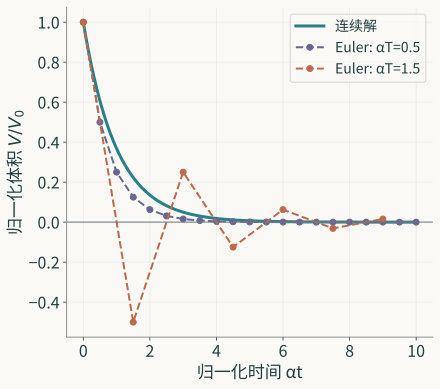

一个储水模型说，水量会持续减少，但有限时间内总是正的。把它改成逐步计算的规则，结果仍可趋向零，却可能先算出负的水量。若只检查“最后是否衰减”，这个变化很容易被放过。

模型变换的困难便在这里：同一项转换，对不同性质可能给出不同答案。上一[篇](/posts/inside-the-model/)用可逆换元对应水位与体积；这一篇从一条容易求解的衰减方程出发，实际检查采样、近似和计算实现各自留下什么。

## 先把这次比较的模型固定

取一个理想的线性储水模型：出水量与当前体积成正比，且没有进水，

$$
\frac{dV}{dt}=-\alpha V,\qquad
\alpha>0,\qquad V(0)=V_0>0.
$$

$V$ 是非负体积，$\alpha$ 的单位是时间的倒数。这里改用了线性出流关系；第二篇的孔口律是水位平方根的函数，与这条方程不同。也不能把某个工作点附近可正可负的水位偏差，直接当成这里的非负体积。

这条方程的解为

$$
V(t)=V_0e^{-\alpha t},\qquad t\ge0.
$$

因此体积单调下降，任意有限时刻仍大于零，时间趋于无穷时才趋于零。对于这次比较，这些性质都已经有了确定对象。接下来要问，改成计算规则后，哪一项还成立。

## 精确采样保留了采样时刻的值

固定采样间隔 $T>0$，只取 $0,T,2T,\ldots$ 时刻的体积。记 $V_n=V(nT)$，由连续解直接得到

$$
V_{n+1}=e^{-\alpha T}V_n.
$$

这个递推在采样时刻给出精确值。因子介于零与一之间，所以样本保持为正、逐项下降并趋于零。就这些采样值而言，连续解与离散递推已经完全对应。

若还要计算一个时间区间内的体积积分，样本怎样填回区间就有了作用。把每段 $[nT,(n+1)T)$ 都填成左端值 $V_n$，会得到一条阶梯曲线；连续模型在这段内却仍按指数下降。两者的样本相同，区间内的值不同。

连续模型在一段内的积分是

$$
\int_{nT}^{(n+1)T}V(t)\,dt
=V_n\frac{1-e^{-\alpha T}}\alpha,
$$

而阶梯重构给出 $TV_n$。由于 $1-e^{-\alpha T}<\alpha T$，后一项较大。这里的阶梯是重构信号，并不表示水箱实际在区间内保持不变。精确样本足以回答样本上的问题；另一项观察需要用到区间内的过程，重构的选择便进入了答案。

这项差异也提醒我们分开两种改变。模型可以仍规定连续过程，只向外发布样本；也可以另规定一个按步更新的过程。前者改变可见的信息，后者改变所用的动力学。都画成一排采样点，二者却不是同一个判断。

## 近似递推的两种性质会分开

如果用区间开始时的变化率近似整个区间的变化，得到显式 Euler 规则：

$$
\widehat V_{n+1}
=\widehat V_n+T(-\alpha\widehat V_n)
=(1-\alpha T)\widehat V_n.
$$

记 $\lambda=\alpha T>0$。体积每步乘以 $1-\lambda$，这一个因子就足以检查几个性质。

当 $0<\lambda<1$，因子在零与一之间，非负初值保持非负，正初值逐步减小。当 $\lambda=1$，下一步直接变成零，随后一直为零。它保存了非负性，却舍掉连续模型“有限时间始终为正”的性质。

当 $1<\lambda<2$，因子为负，绝对值小于一。序列的绝对值不断减小，数值趋向零；符号却每步改变，正体积的下一步变成负体积。若用这项结果报告储水量，已经违反了原来状态量的含义。

到 $\lambda=2$，因子为负一，序列等幅交替；再增大 $\lambda$，绝对值也开始增长。于是非负性与趋零分别要求

$$
\begin{aligned}
\text{所有非负初值保持非负：}&\quad 0<\alpha T\le1,\\
\text{所有初值的数值趋零：}&\quad 0<\alpha T<2.
\end{aligned}
$$

*原创理论曲线，初值已归一化为1。连线帮助辨认样本次序；Euler 的结论针对离散样本。αT=1.5 时数值趋零，体积的非负意义却已丢失。*

两个范围不相同。在后一范围内选步长，足以得到趋零的序列，却未必得到合乎体积意义的序列。若要求保持严格正性，范围还要去掉 $\alpha T=1$。

“稳定”因此需要落到具体含义上。这里用它说明这个线性递推的初值影响渐近消失；它没有同时说明体积非负、有限时间的下降过程准确，或累计量误差很小。那些性质可以一道检查，却要各有理由。

## 步长变小，误差怎样得到界

还可以进一步证明，在固定有限时间内，足够细的网格使 Euler 样本接近连续样本。这个结论不必只靠两条曲线相邻来判断。

取 $0<\lambda<1$。由于

$$
-\log(1-\lambda)=\lambda+\delta,
\qquad
\delta=\int_0^\lambda\frac{s}{1-s}\,ds
\le\frac{\lambda^2}{2(1-\lambda)},
$$

Euler 在时刻 $t_n=nT$ 的结果可以写成

$$
\widehat V_n
=V_0(1-\lambda)^n
=V_0e^{-\alpha t_n}e^{-n\delta}.
$$

它比该时刻的连续体积小，额外的衰减由 $e^{-n\delta}$ 给出。固定时间上限 $H>0$，对所有 $nT\le H$，利用 $1-e^{-x}\le x$ 得到

$$
0\le V(t_n)-\widehat V_n
\le V_0 n\delta
\le\frac{V_0\alpha^2HT}{2(1-\alpha T)}.
$$

当 $T$ 趋于零，右侧也趋于零。它给出了这个固定时间区间内、所有网格时刻共同适用的误差界；界还清楚保留了初始体积、衰减参数与观察时长的作用。

这个结果与前面的性质检查相互补充。网格细化能减小样本误差，而保持非负性的步长条件在每次实际计算中仍有作用。一个最终会收敛的算法，当前选用的粗网格可能仍给出负体积。渐近结论说明一条精化路径，条件检查说明这次计算处在那条路径的哪里。

误差界的对象也应保留。这里比较的是同一初值、同一 $\alpha$ 下，网格时刻的连续解与理想 Euler 递推；若再插值成连续曲线，或把观察时长随网格改变，还需检查新增操作中的误差。把原先的界带入新的比较时，先看它比较的是否仍是这两个对象。

## 数学递推与运行的程序仍是两件事

理想 Euler 规则已经是一种离散数学模型。程序实现这项规则时，还要处理数的表示、参数读取、循环时刻和输出。把递推式写正确，只确定了它应执行什么。

为看清其中一项差异，假定程序每一步与理想递推相比有总误差 $\eta_n$，并已取得 $|\eta_n|\le\varepsilon$ 的界：

$$
\widetilde V_{n+1}=r\widetilde V_n+\eta_n,
\qquad r=1-\alpha T,\qquad 0\le r<1.
$$

程序与理想递推从同一初值开始。二者之差按同一个因子传递，过去的误差则逐步加入，所以

$$
|\widetilde V_n-\widehat V_n|
\le\varepsilon\sum_{j=0}^{n-1}r^j
=\varepsilon\frac{1-r^n}{1-r}
\le\frac\varepsilon{\alpha T}.
$$

这个界把每步误差按最不利的方向累积；实际误差的大小、符号和关联会影响所得结果。若把 $\varepsilon$ 视为与 $T$ 无关的固定上限，缩短步长会增加所需步数，使这个粗界变得更大。要决定合用的步长，需要依具体实现的误差机制估计 $\varepsilon$，再与离散化误差合起来考虑。

此外，若程序读取的 $\alpha$ 单位错误，或循环中的 $T$ 与发布样本的时间戳不一致，运行结果可能已在执行另一条递推。比起笼统地问“模型精度够不够”，这里可以分别核对方程、离散规则和程序执行的关系。哪个对象改变，所需检查就跟到哪里。

## 结论沿什么关系继续使用

这次变换得到了一组具体判断。精确采样保存了采样时刻的值；阶梯重构改变了区间积分；Euler 的非负性与趋零有不同步长范围；在固定有限区间的网格时刻，近似误差有明确的上界；程序执行又引入一项需要另外估计的误差。

这些判断分别支持不同的计算选择。若只要某些时刻的近似体积，可以据误差与非负性条件选步长；若累计量参与判断，就得审查区间重构；若把样本送入反馈控制器，采样时刻与误差将进入另一套闭环关系。

模型变换的成果正在这些可以接着使用的关系中。原来哪个结论保留了，新增操作改变了什么，在哪个条件下有多大误差，已经能够逐项证明。下一[篇](/posts/model-as-open-component/)转向一个带输入的反馈模型，检验一个同步条件下调节更快的候选方案，为什么在带延迟的反馈中仍可能失败。

---

**模型与工程：六篇核心阅读**

1. [数学怎样形成问题](/posts/mathematical-language-and-problems/)
2. [模型怎样指向世界](/posts/from-observation-to-model/)
3. [模型内部保存什么](/posts/inside-the-model/)
4. [模型改变后，哪些结论还能保留](/posts/model-transformations/)
5. [模型怎样成为组件](/posts/model-as-open-component/)
6. [从模型到工程判断](/posts/engineering-model-chain/)
