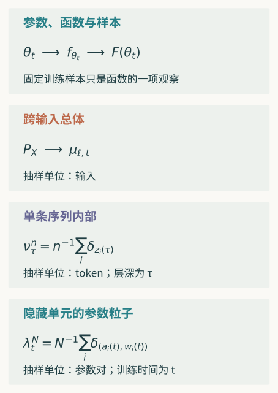
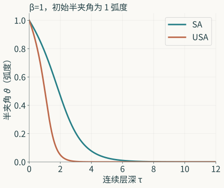

一个网络有几十亿个参数，这个数说明了存放参数的规模，却还没有说明我们正在研究什么。训练可以使参数移动，也可以使中间表示改变；输出函数的变化又有自己的尺度。把隐藏单元换一个次序，参数数组已经不同，函数仍可相同。把网络不断加宽，在一种参数化中，特征变化逐渐消失；在另一种参数化中，变化可以留下。变大的究竟是什么，留下的又是什么，需要沿这些关系分别计算。

Transformer 把这项困难推进到另一处。一条序列的 token 在层间相互作用，可以写成许多点的共同演化，也可以写成测度的变化。有限点与测度之间有精确关系；有限点越来越多、层越来越深，又提出新的近似问题。即使两种动力学都聚成一个簇，删除注意力分母与改变度量也仍是两种操作：前者改变演化，后者可能为原演化找到新的几何解释。

第三篇已经分开呈现、语义、观察与身份。本篇让变换在这些对象之间实际工作。先从有限网络的链式法则进入训练核，再比较宽度、几何和深度尺度；随后进入自注意力的粒子与测度，推导归一化、误差和聚集。各项结果给出可继续使用的关系，也说明什么反馈会使我们改换原来的数学问题。

## 高维首先在哪个空间

固定一个架构，参数写为 $\theta\in\Theta\subseteq\mathbb R^D$，输入属于 $X$，输出函数为 $f_\theta:X\to\mathbb R^k$。这里 $D$ 是参数维数，$k$ 是输出维数；输入可以是一条编码后的序列，不必是一维数字。第 $\ell$ 层的表征记为 $z_{\ell,\theta}:X\to\mathbb R^{d_\ell}$。参数空间、函数空间和各层表征空间，至此已有不同的元素与坐标。

设训练形成参数轨迹 $\theta_t$。为简便，写 $f_t=f_{\theta_t}$、$z_{\ell,t}=z_{\ell,\theta_t}$。$t$ 先表示连续训练时间；若实际算法逐步更新，则另用步数说明离散过程。层号 $\ell$ 表示一次前向计算经过哪一层，不等于训练已经多久。自回归生成位置表示已经生成或提供了多少 token，也不等于这两种时间。把三者都叫“迭代”，读者便难以确定同一条曲线所比较的对象。

若输入总体有概率律 $P_X$，而表征映射可测，就能研究推前

$$
\mu_{\ell,t}=(z_{\ell,t})_\#P_X,
\qquad
\mu_{\ell,t}(B)=P_X\bigl(z_{\ell,t}^{-1}(B)\bigr).
$$

它统计的是许多输入经过该层以后，表征落入集合 $B$ 的概率。输入总体改变，即使参数固定，$\mu$ 也可能改变；参数改变，即使总体固定，$\mu$ 仍可能改变。把这两个来源分开，可以分别分析训练变化与总体变化对图形的影响；两者同时变化时，比较还须说明保持了哪个条件。对没有指定的总体，有限样本图只能给出那些样本的观察。

距离也各有地址。$\|\theta-\theta'\|_2$ 量参数坐标差；对固定输入，可以量 $\|z_{\ell,\theta}(x)-z_{\ell,\theta'}(x)\|_2$；对函数，可以量样本误差、总体平均误差，或某个输入域上的最大误差。例如，平方可积时，$\|f-g\|_{L_2(P_X)}^2=\int\|f(x)-g(x)\|_2^2\,dP_X(x)$。总体平均小，仍可能在低概率区域差得很大；最大误差则把那个区域也计入。

第三篇的隐藏单元置换已经给出一个精确比较：同时重排相邻权重，整个 $f$ 保持，表征坐标按置换移动，参数数组通常改变。若沿原坐标逐项比较表示，会看见变化；若先把允许的置换对齐，比较又可能为零。两种读数都有数学意义，其用途由当前问题决定。函数相同也没有自动证明接着训练仍相同，因为更新规则可能使用那些坐标。

因此，“高维模型很复杂”还需继续问。若关心求解成本，参数与实现的规模直接相关；若关心输入扰动，函数和层间算子更接近所求对象；若关心特征形成，表征及其总体关系不能被一个终端损失代替。确定空间并不会缩小研究的野心，它使野心有了能够逐项比较的对象。

## 变换怎样保存、遗失和增加内容

先沿已有对象区分几种改变。可逆换元把结构送到另一种坐标中；第三篇的 $V=Ah$ 在 $A>0$ 固定时，同时转换演化、初值与阈值。两端可以来回恢复。若只改符号而留下旧初值，所得方程就没有经过那项对应。可逆性和保持关系共同支持继续推理，数值相似没有替它们作证明。

取商把已经选定的等价对象放入同一类。网络隐藏单元置换可以消去一项坐标冗余；绝对值观察把 $x$ 与 $-x$ 合并。合并以后，原来的操作能否继续，须检查代表无关性。乘法的绝对值由两端绝对值决定，加法却不然。对学习也一样：相同函数的参数若诱导不同的下一步函数，训练还不能直接成为这个函数商上的单值更新。

粗粒化或投影保留部分信息，通常可以从细对象得到粗对象，却不能由粗对象唯一恢复细对象。固定样本上的预测向量就是函数的一项投影。两个函数在样本上相同，没有使样本之外也相同。被遗失的信息是否必要，要看后续查询；若新的输入或组合需要它，就应扩大观察，或者给粗对象补入足够的状态。

提升则给对象增加所需的结构。有时原来的拓扑太弱，甚至不能支持已经想问的响应。取整数 $n\ge1$，令

$$
x_n(s)=n^{-1/2}(\cos ns,\sin ns),\qquad 0\le s\le2\pi.
$$

路径一致趋于零，因为最大幅度是 $n^{-1/2}$；但 $dx_n^2=\sqrt n\cos(ns)\,ds$，所以 $\int_0^{2\pi}x_n^1\,dx_n^2=\int_0^{2\pi}\cos^2(ns)\,ds=\pi$。零路径的这项积分是零。路径幅度的一致收敛，没有保存这个积分响应。若所求问题确实用到它，需要连同相应的迭代积分研究更丰富对象；第一篇已经说明了这条入口与粗糙路径构造的联系。

近似要给出共同观察与误差。旧稿的线性储量方程 $\dot V=-aV$，$a>0$，精确采样因子为 $e^{-a\Delta}$，Euler 因子为 $1-a\Delta$。对非负初值，Euler 保持非负需要 $0<a\Delta\le1$；趋于零需要 $0<a\Delta<2$。在 $1<a\Delta<2$ 中，序列趋零却交替为正负。末端衰减与全程非负，是不同观察。

它还有有限区间的误差关系。若 $0<a\Delta<1$、$j\Delta\le H$，令 $\delta=-\log(1-a\Delta)-a\Delta$。由 $\delta=\int_0^{a\Delta}u/(1-u)\,du\le(a\Delta)^2/[2(1-a\Delta)]$，以及 $1-e^{-j\delta}\le j\delta$，可得

$$
0\le V_0e^{-aj\Delta}-V_0(1-a\Delta)^j
\le\frac{V_0a^2H\Delta}{2(1-a\Delta)}.
$$

对固定 $H$，右边趋零；它比较网格时刻、相同初值上的值，不会仅凭这条界恢复所有连续区间性质。这里的储量律也不同于第二篇的孔口出流律。模型、计算与查询各自有地址，旧例因而能作为短桥梁，把有限近似接到以下网络问题。

取极限还要说明一串不同规模的对象怎样进入共同空间。加宽会改变参数维数，原数组之间没有直接的固定坐标距离；函数值、核、经验测度或归一化统计量可以提供比较。收敛在哪个对象上，采用哪种拓扑，时间或输入范围是否固定，都影响所得。极限不是“规模足够大”的同义词；有限对象接近它，需要另一条误差关系。

这些操作可以连续使用，但每一步留下的关系应当接得起来。先取商再训练，要检查更新能否下降；先投影再取极限，要检查投影是否连续；先近似再作长期判断，要检查误差是否在长期仍受控。数学语言的改变在这里有具体内容：有的使原对象换了一套坐标，有的使原问题取得新的结构，也有的确实换了研究对象。

## 参数训练怎样诱导函数变化

固定 $m$ 个训练输入 $x_1,\ldots,x_m$，先取标量输出，定义预测向量 $F(\theta)=(f_\theta(x_1),\ldots,f_\theta(x_m))\in\mathbb R^m$。向量 $F$ 是当前样本上的观察，函数 $f_\theta$ 仍定义在整个 $X$。采用可微损失 $\ell:\mathbb R^m\to\mathbb R$，优化目标为 $\mathcal L(\theta)=\ell(F(\theta))$。标签和样本此时固定，其作用进入 $\ell$ 与 $F$。

假定沿所研究的轨迹可微，参数采用欧氏梯度流。令 $J_F(\theta)\in\mathbb R^{m\times D}$ 为预测对参数的 Jacobian，第 $i$ 行是 $\nabla_\theta f_\theta(x_i)^T$。链式法则先给出参数速度，再给出预测速度：

$$
\dot\theta=-J_F(\theta)^T\nabla\ell(F),
\qquad
\dot F=-K_\theta\nabla\ell(F),
\qquad
K_\theta=J_F(\theta)J_F(\theta)^T.
$$

这三个等式对当前有限网络成立，没有先要求宽度无穷。$K_\theta$ 是 $m\times m$ 的 Gram 矩阵，其第 $(i,j)$ 项为两个输入的参数梯度内积。它描述一次损失方向经参数空间以后，怎样带动样本预测。若第一个样本上的误差推动的参数方向也改变第二个样本，交叉项就承担这项影响；并不只有每个样本独自调整的对角项。

矩阵半正定，因为对任意 $u\in\mathbb R^m$，$u^TK_\theta u=\|J_F^Tu\|_2^2\ge0$。沿轨迹，$d\ell(F)/dt=-\nabla\ell(F)^TK_\theta\nabla\ell(F)\le0$。它保证这个损失不增加，却没有自动保证收敛到任意指定标签：某些预测方向可能位于 $K$ 的零空间，也可能随着训练改变。下降方向与可达范围，已经是可以继续研究的两项内容。

对训练样本之外的固定输入 $x$，链式法则给出

$$
\frac{d f_\theta(x)}{dt}
=-\sum_{j=1}^m k_\theta(x,x_j)\,\partial_j\ell(F),
\qquad
k_\theta(x,x')=\nabla_\theta f_\theta(x)^T\nabla_\theta f_\theta(x').
$$

训练样本上的 $K$ 是这个全输入训练核在样本对上的限制。知道 $K$，可以研究样本预测；要推断一个新输入的演化，还需要它与各训练输入之间的核值。有限 Gram 矩阵没有唯一指定全部输入上的核，更没有仅凭自身给出目标总体上的泛化误差。

本篇暂用 $\ell(F)=\frac12\|F-y\|_2^2$，未加入 $1/m$ 平均因子。若损失改成平均平方，梯度和时间尺度也随之改变；来源采用不同约定时应换算。多输出可以把各样本各坐标铺成预测向量，Gram 于是保存坐标之间的耦合。坐标排列会改变矩阵呈现，但相应排列观察与损失后，推理仍有明确对应。

欧氏梯度流也只是一个选择。若采用正定预条件矩阵 $M(\theta)$，参数速度为 $-M\nabla\mathcal L$，预测中的矩阵成为 $J_FMJ_F^T$。动量带来额外状态，随机梯度带来随机过程，离散步长带来一步近似。它们可以另建语义和观察；把这些过程都直接写成上面的同一个 $K$，会抹去算法实际增加的结构。

有限恒等式的价值正在这里。它没有把模型简化到一个固定核，而是先显示参数如何把损失方向送到函数变化。核是否冻结、是否有极限、有没有保留特征学习，接下来才能在这个等式上提出。第三篇的相同函数而不同训练，也有了一个简洁地址：相同 $F$ 可能对应不同 $J_FJ_F^T$，从而具有不同预测速度。

## 固定核的演化，以及怎样比较变核

若在指定条件下 $K_\theta$ 恰好固定为 $K_0$，平方损失的残差 $r=F-y$ 满足 $\dot r=-K_0r$，所以 $r(t)=e^{-K_0t}r(0)$。对称半正定矩阵有正交特征分解。将初始残差写入其特征向量，第 $i$ 项按 $e^{-\lambda_i t}$ 衰减；零特征值方向保持。一个固定核因此把可学方向与速度清楚地联系起来。

若最小特征值为正，全部样本残差按相应指数界下降；若它很小，有些方向下降很慢；若为零，零空间中的原残差仍在。三个判断都关乎这一组样本及当前损失。改变样本集合会改变 Gram 矩阵；改变目的会改变需要观察的误差。训练误差下降快，仍没有单独决定样本之外的风险。

真正的有限网络通常给 $K(t)$。要用固定核近似，先说清误差。设两个预测过程从同一个 $F(0)$ 出发，原过程残差为 $r(t)$，冻结核过程为 $r_0(t)$，并假定在 $[0,T]$ 上 $\|K(t)-K_0\|_{\mathrm{op}}\le\varepsilon_T$。差 $e=r-r_0$ 满足

$$
\dot e=-K_0e-(K(t)-K_0)r,
\qquad
e(t)=-\int_0^t e^{-K_0(t-s)}(K(s)-K_0)r(s)\,ds.
$$

$K_0$ 半正定，故 $\|e^{-K_0u}\|_{\mathrm{op}}\le1$；原损失下降又给 $\|r(s)\|_2\le\|r(0)\|_2$。于是 $\|e(t)\|_2\le t\varepsilon_T\|r(0)\|_2$。这条界不要求原核的各个方向都可学，只要求上述条件。核的变化小，经过有限时间可以转成预测差；时间范围扩大，误差还需重新估计。

若误差来自另一个近似核 $\widehat K_0$，初值也有误差，就应把相应项接入同一方程，而不能继续使用“同初值”的界。若研究新的输入，差方程还包含该输入与训练集的交叉核变化。这样，冻结核的好处与代价都有了可见对象：原来相互依赖的训练被化成一个线性残差过程，变化中的几何则被放入待控制的误差。

有限点还可以借助输入几何取得更广的观察。设共同输入域 $U\subseteq\mathbb R^p$ 紧，测试点构成半径 $h$ 的覆盖网；若两个函数在 $U$ 上分别为 $L_f,L_g$ Lipschitz，网点误差至多 $\delta$，则对任意 $x\in U$，选距离至多 $h$ 的网点，再用三角不等式得到 $|f(x)-g(x)|\le\delta+(L_f+L_g)h$。这将网点比较送到全域，但要求覆盖与统一连续性同时成立。高维域所需网点可以很多，数据支撑较小也会改变覆盖；这些几何条件应由当前对象提供。训练点并不因来自某个总体，就已经覆盖所有合法输入。

这也给有限实验一个合适提问。可以比较 $K(t)$ 在已选样本上的变化，检查固定核近似是否覆盖所需时间与预测；若目标是表征形成，还应观察表示和可读出关系，而不能因预测相近就宣布内部机制相同。一个近似能够完成当前预测，并不要求它还保留所有内部问题。需要哪一种内容，应当在采用近似以前说明。

所谓“网络变宽以后就是核”，至此还没有成立。我们只有一个有限恒等式，一个条件性的固定核解，以及一项可直接核查的误差界。宽度如何使核变化变小，取决于参数化、初始化、学习率、激活和训练范围。下一节将实际比较两套尺度，让这些条件进入计算。

## 宽度选择怎样保留特征形成

取一个可直接计算的浅层网络，标量输入 $x\in[-R,R]$，激活 $\sigma=\tanh$，隐藏宽度为 $N$。先采用

$$
f_N(x)=\frac1{\sqrt N}\sum_{i=1}^N a_i\sigma(w_i x).
$$

$a_i,w_i$ 都可训练；训练时间需显出时写为 $f_N(t,x)$。参数用普通欧氏梯度流；损失仍是固定 $m$ 个样本的平方和。这里 $N$ 表示宽度，与样本数 $m$ 分开。为了把量级结论做成一个完整有限构造，取偶数 $N$，初始化时每对单元的 $w$ 相同，$a$ 一正一负，并令初始 $|a_i|,|w_i|$ 有统一上界。这样 $f_N(0,x)=0$ 对全部输入成立，初始损失不随宽度增加。

这项配对是本文选择的确定性构造，用来省去初始化概率波动；它不是声称所有训练都如此初始化。令 $r_j=f_N(x_j)-y_j$。计算给出

$$
\dot a_i=-N^{-1/2}\sum_{j=1}^m r_j\sigma(w_i x_j),
\qquad
\dot w_i=-N^{-1/2}a_i\sum_{j=1}^m r_j\sigma'(w_i x_j)x_j.
$$

平方损失下降，$\|r(t)\|_2$ 有不随 $N$ 的上界。$|\sigma|\le1$、$|\sigma'|\le1$，输入和样本数固定，所以 $|\dot a_i|\le C/\sqrt N$。在任意固定 $[0,T]$，$a_i$ 仍有统一上界，进而 $|\dot w_i|\le C_T/\sqrt N$。积分以后，两个参数的变化均为 $O_T(N^{-1/2})$；表示 $\sigma(w_ix)$ 在全部 $|x|\le R$ 上的变化也受同一量级控制。

这个结论没有用“参数很多，所以每个很小”的直觉替代计算。$N^{-1/2}$ 来自输出参数化，又经损失和有界条件取得整个有限时间上的界。时间随 $N$ 增长时，常数与累积可能变化，需要新证明。初始损失若随 $N$ 爆炸，或采用另一种学习率，也不能原样保留上述推论。

相应的训练核为

$$
k_N(x,x')=\frac1N\sum_{i=1}^N
\left[\sigma(w_ix)\sigma(w_ix')
+a_i^2\sigma'(w_ix)\sigma'(w_ix')xx'\right].
$$

在当前有界范围内，$\sigma$ 的一、二阶导数均有界。每个加项的变化因而是 $O_T(N^{-1/2})$；求平均后仍是该量级。对固定样本，$K_N(t)-K_N(0)$ 的算子范数有同类界，上一节于是给出冻结核预测误差。若初始经验统计还有确定极限，便可以继续研究 $K_N(0)$ 到那个极限的关系。特征冻结、核近似和初始核极限，至此是三步有联系的判断。

现在采用另一套尺度：

$$
\widetilde f_N(x)=\frac1N\sum_{i=1}^N a_i\sigma(w_ix),
\qquad
\dot\theta=-N\nabla_\theta\mathcal L.
$$

输出归一化改为平均，训练速度也改为 $N$ 倍。对每个单元，$\dot a_i=-\sum_j r_j\sigma(w_ix_j)$，$\dot w_i=-a_i\sum_j r_j\sigma'(w_ix_j)x_j$。宽度因子相消，特征变化不再由前面的 $N^{-1/2}$ 界压到零。它仍可能因特定损失、数据或初值而为零；尺度允许有限变化，与每个任务一定产生变化不同。

可以在同一个配对构造中看见这项允许。令所有 $w_i(0)=1$，一半 $a_i(0)=1$，一半为 $-1$；只有样本 $x=1$，标签为一。两种网络初始函数都为零。第二套尺度的初始残差为负一，故 $\dot w_i(0)=a_i(0)\sigma'(1)$，正负两类以不随 $N$ 缩小的速度分开。第一套尺度的相应速度则多乘 $N^{-1/2}$。相同初始函数没有使特征演化采用同一尺度。

把参数对收成经验测度 $\lambda_t^N=N^{-1}\sum_i\delta_{(a_i(t),w_i(t))}$，平均网络可写为 $\widetilde f_N(x)=\int a\sigma(wx)\,d\lambda_t^N(a,w)$。每个粒子的速度由当前样本残差共同决定。这给特征学习一项新的对象：参数粒子移动，改变整个分布，再改变函数。有限 $N$ 已有这条关系；一般初始测度的极限，还需存在、稳定和有限差的论证，不能由积分写法直接取得。

Yang 与 Hu 的 Tensor Programs IV 在更广的固定深度 MLP 和 abc 参数化中，给出了特征学习与核训练的分类。它的分类定理采用指定的 $\tanh$ 或平滑激活、稳定且非平凡的参数化，并按其训练 routine 和特征变化定义量化；在这些条件下，得到特征学习与核机制的二分。[^tpiv] 线性激活等未满足条件的例子不应套入这项分类。 其定义中，允许特征学习要求存在某个训练 routine、固定步骤和输入，使特征变化在宽度极限保留非零量级；核机制则要求一个固定半正定核组织全部允许 routine 的更新。存在一种特征变化，与全部过程服从同一核，是不同量词的判断。

这两项有限梯度流计算展示尺度怎样进入变化。原文分类研究的是其定义的离散 SGD 极限，二者在机制问题上相接，证明对象则各自明确。分类又给进一步研究提供明确选择：若所求机制是特征形成，应采用保留这项形成的模型或说明有限修正；若所求是在固定特征上的预测，核机制可以很有用。表达能力、训练可达性、总体风险和特征机制各有对象，某一层面的简化成功不能代它们全部作答。

## 换参数坐标，为什么还要换度量

第三篇的双参数函数 $f_{a,b}(x)=abx$ 说明，同一函数可以在欧氏训练下有不同速度。这个现象也可以从坐标变换直接看出。设 $\theta=h(\eta)$ 是光滑可逆换元，Jacobian $H=Dh(\eta)$ 可逆。两种坐标给出同一个函数与损失；但在 $\eta$ 坐标中重新采用欧氏梯度，链式法则给 $\dot\eta=-H^T\nabla_\theta\mathcal L$，于是

$$
\dot\theta=-HH^T\nabla_\theta\mathcal L.
$$

这一般不同于原来的 $-\nabla_\theta\mathcal L$。损失的数值对应已经保持，参数运动的几何却改变了。正交坐标变换满足 $HH^T=I$，因此普通欧氏梯度可以保持；任意伸缩没有这项性质。第三篇的隐藏置换正是允许证明这项保持的一种正交变换。

若要在新坐标中保留原来的欧氏几何，给切向量采用拉回度量 $G=H^TH$。梯度速度变为 $\dot\eta=-G^{-1}H^T\nabla_\theta\mathcal L$，再乘 $H$，可得 $\dot\theta=-\nabla_\theta\mathcal L$。这次改变坐标同时搬动了度量，原轨迹因而有准确对应。改变计算所用的语言，可以揭出原过程的几何；仅换变量后继续用默认度量，则可能定义另一过程。

这项比较也说明学习率与单位的关系。把一个坐标放大十倍，损失梯度按另一方向缩放；若仍给各坐标同一个数值步长，实际移动不等价。度量和预条件把“向哪边、移动多少”组织在一起。把训练描述成损失不断减少，只保留了一个标量结果，尚没有确定过程怎样在参数空间走。

商空间也有自己的困难。若对称变换保持函数和度量，且更新与群作用相容，训练可能在商上形成良好的过程。若等函数的参数诱导不同的 $J_FJ_F^T$，函数值本身不足以定义下一速度，就应保留更多状态，或者改变训练结构使它闭合。取商消除了已证明的冗余，却不能随意消去影响未来的变量。

此处的度量首先是数学选择，是否适合实际优化另有依据。它可以改善条件数，也可能改变隐含偏好和可达过程；哪一项改变有用，要沿损失、数据、实现与所求任务检验。到了自注意力，我们还会遇见一次更具体的度量改变：原向量场保持，梯度解释改变。两处问题都需要先区分对象，再计算保持关系。

## 有效几何怎样取得可计算内容

参数维数 $D$ 可以很大，某项观察涉及的方向却可能少得多。要让“有效复杂度”有内容，先指定一个方向集合 $S\subseteq\mathbb R^D$ 和所用范数。对标准高斯向量 $g\sim N(0,I_D)$，定义高斯宽度 $w(S)=\mathbb E\sup_{u\in S}\langle g,u\rangle$。它量随机线性观察在整个集合上能达到多大，不等于集合的点数或流形维数。

先取一个 $k$ 维线性子空间 $E$，令 $S$ 为它的单位球面，$1\le k\le D$。正交投影 $\Pi_Eg$ 是这个子空间中的标准高斯向量。因为沿球面选择最合适的方向，$\sup_{u\in S}\langle g,u\rangle=\|\Pi_Eg\|_2$，所以

$$
w(S)=\mathbb E\|g_k\|_2,
\qquad
\sqrt{2/\pi}\,\sqrt k\le w(S)\le\sqrt k.
$$

上界由 Jensen 不等式及 $\mathbb E\|g_k\|_2^2=k$ 得到。下界用 $\|g_k\|_2\ge\|g_k\|_1/\sqrt k$，而每个标准高斯坐标的平均绝对值为 $\sqrt{2/\pi}$。两个界说明宽度按 $\sqrt k$ 增长，嵌入空间的多余坐标没有增加这个方向集合的宽度。所用结构是一个确定子空间，而不是由“大网络”三个字自动提供的子空间。

再取 $M$ 个固定单位方向 $u_1,\ldots,u_M$。各 $\langle g,u_i\rangle$ 可以相关，我们仍可控制全部方向。对 $s>0$，$e^{s\max_i|\langle g,u_i\rangle|}\le\sum_i(e^{s\langle g,u_i\rangle}+e^{-s\langle g,u_i\rangle})$。高斯矩母函数使右侧期望不超过 $2Me^{s^2/2}$；取对数和 Jensen，再优化 $s$，得到

$$
\mathbb E\max_i|\langle g,u_i\rangle|
\le\sqrt{2\log(2M)}.
$$

对 $r\ge0$，分别使用一维高斯尾界后求并集，得到 $\Pr(\max_i|\langle g,u_i\rangle|\ge r)\le2Me^{-r^2/2}$。这里没有要求不同方向的观察独立；要求的是方向固定，或至少不依赖正在抽取的 $g$。统一控制许多查询的代价，已从单一方向的量级增长到含 $\log M$ 的界。

若方向也根据同一个噪声选，原界可能失效。令唯一方向为 $u(g)=g/\|g\|_2$，在 $g=0$ 时任意定义。此时 $\langle g,u(g)\rangle=\|g\|_2$，平均量级为 $\sqrt D$。把它当成一个事先固定的方向，会错用不随 $D$ 增长的单方向界。学习所得方向与检验随机量之间的依赖，因此是必须建立的条件；样本划分、条件化或新的复杂度控制可以提供相应联系。

“内在维数小”也需要说明是哪种结构。一个平面中的圆是光滑一维流形，但其线性张成空间有两维。有限集合的局部流形维数可以为零，却仍包含许多相隔很远的方向。例如取超立方体顶点 $S=\{(\pm1,\ldots,\pm1)/\sqrt D\}$。它是有限集合，然而

$$
w(S)=\mathbb E\frac{\|g\|_1}{\sqrt D}
=\sqrt{2/\pi}\,\sqrt D.
$$

零维的局部标签没有把全局方向复杂度压小。这与子空间算例并不矛盾，两者保存的几何不同。离散类别混合、低秩、光滑流形、许多分支，可能在二维投影里给出相似图形，却对全局扰动与统一查询提出不同的覆盖问题。

对网络表示，可以研究固定输入总体的支撑、数据附近的切向方向，或训练过程中实际可达的变化集合。每一次都需说明集合怎样取得、距离如何选择、比较覆盖哪个尺度。线性协方差低秩说明二阶线性结构，不能独自恢复一套光滑流形；一个变量可被读出，也不能独自证明输出实际使用了它。几何使问题更细，而机制需要沿相应干预和生成关系接回来。

## 层间扰动为什么还要看算子

固定训练参数，令前向各层为 $z_{\ell+1}=T_\ell(z_\ell)$。在可微点，小输入扰动的一阶变化沿 Jacobian 传递，$\delta z_L\approx J_{L-1}\cdots J_0\delta z_0$。这里乘积有次序，向量方向随每层改变，不能只把各层的某个特征值写在一起。次序交换甚至可能改变乘积本身。

若要控制有限扰动，需对相关输入域中的连接路径或各层经过的区域给出统一 Lipschitz 条件。单个点上的导数只说明局部一阶响应。谱范数界可给 $\|J_{L-1}\cdots J_0\|_{\mathrm{op}}\le\prod_\ell\|J_\ell\|_{\mathrm{op}}$；它易于使用，方向失配时也可能很松。直接研究乘积、可达方向或任务观察，可以取得另一种更贴合问题的界。

稳定特征值还可能伴随明显的瞬态放大。取 $M>0$ 和矩阵

$$
A=\begin{pmatrix}-1&M\\0&-1\end{pmatrix},
\qquad
e^{sA}=e^{-s}\begin{pmatrix}1&Ms\\0&1\end{pmatrix}.
$$

两个特征值都为负一，任意固定初态的响应最终趋于零。但从 $e_2=(0,1)^T$ 出发，在 $s=1$ 时，响应范数为 $e^{-1}\sqrt{1+M^2}$，至少为 $M/e$。增大 $M$，这一有限时刻的放大可以任意大。这里的 $s$ 是该算子构造的演化时间，不是训练时间或实际网络层号。

矩阵并非正规矩阵，不能以正交特征基把所有方向解耦。渐近谱说明最终衰减，奇异值和诱导范数说明指定时刻的最大放大，二者回答不同问题。即使可对角化，换到特征坐标后也需把换元的条件数送回原范数。只列特征值没有完成这个返回。

这个构造揭示算子比较的必要，并不报告实际 Transformer 已经具有同一机制。要研究一个已训练模型的扰动，应取得其相应 Jacobian、范数和输入范围，再比较任务所需观察。层归一化、残差连接、激活与注意力耦合都会进入这些算子。若导数只在少量样本上观察到，证据仍属于那些样本及其邻近范围。

算子也把几何和尺度接在一起。一个很大的全空间范数，可能主要沿当前数据不经过的方向；一个很小的平均量，又可能遗漏任务真正关心的少数方向。可以限制到已经明确的方向集合，但限制以后若训练、干预或上下文使状态离开该集合，原界要重新检查。有效几何帮助选择比较，算子则说明变化如何穿过它。

## 深度缩放中的两种累积

宽度改变每层的坐标规模，深度增加连接在一起的层数。对残差网络，写 $z_{\ell+1}=z_\ell+s_Lg_\ell(z_\ell)$，其中总深度为 $L$，支路乘子为 $s_L$。初始化的随机支路与训练造成的更新，未必按同一种方式累积。前者可能近似抵消，后者可能因共同损失而同向。只说“把每层除以深度”，还没有选择要保留的过程。

先用一项完全明确的标量构造检查初始化。取独立 $\xi_1,\ldots,\xi_L\sim N(0,\sigma^2)$，总变化为 $S_L=L^{-\alpha}\sum_{j=1}^L\xi_j$。它精确服从 $N(0,\sigma^2L^{1-2\alpha})$。当 $\alpha=1/2$，其分布不随 $L$ 改变；当 $\alpha>1/2$，它在均方意义下趋零；当 $\alpha<1/2$，方差增长，落在任何固定有界区间内的概率趋零。

若只看相隔约 $\varepsilon L$ 层的变化，在 $\alpha=1/2$ 时，其方差趋于 $\sigma^2\varepsilon$，均方根为 $\sigma\sqrt\varepsilon$。这种层间变化具有平方根尺度。它与光滑的确定性层深曲线相隔 $\varepsilon$ 时产生 $O(\varepsilon)$ 变化不同。要研究各层是否保留不同信息，只有总输出不爆炸，尚不足以辨认这些关系。

这个加和构造把独立、零均值和高斯分布说在了对象里。真实残差支路依赖前层状态，训练也可能使支路相关，不能直接将所有支路当成上述独立项。若均值非零，总均值还会按 $L^{1-\alpha}$ 累积；若各项完全相同，方差按 $L^{2-2\alpha}$ 累积。相关性与均值使所需尺度改变，不能从支路幅度独自决定总变化。

一般地，$\operatorname{Var}(\sum_jY_j)=\sum_j\operatorname{Var}(Y_j)+2\sum_{i<j}\operatorname{Cov}(Y_i,Y_j)$。协方差项有约 $L^2$ 项，即使每项不大，也可能改变总量级。训练更新都回应同一个标签或损失，正是需要检查相关累积的一处。若每层都沿共同方向移动 $L^{-1}v$，总变化为 $v$；若每层沿该方向移动 $L^{-1/2}v$，总变化为 $\sqrt Lv$。初始化能容纳的支路规模，不会自动成为训练能容纳的有效更新规模。

在线性残差网络中，这项区别可以进一步落到精确递推。取宽度 $N$，$W_\ell$ 的各元素独立、均值零、方差 $1/N$，并与此前层状态独立；令 $z_{\ell+1}=(I+L^{-\alpha}W_\ell)z_\ell$。条件于 $z_\ell$，交叉项期望为零，$\mathbb E\|W_\ell z_\ell\|_2^2=\|z_\ell\|_2^2$，于是

$$
\mathbb E\|z_L\|_2^2
=(1+L^{-2\alpha})^L\,\mathbb E\|z_0\|_2^2.
$$

它对这项有限网络的初始化成立。$\alpha=1/2$ 时，倍率趋于 $e$；$\alpha>1/2$ 时趋于一；$\alpha<1/2$ 时发散。这个二阶统计量保存的是能量规模，不是每个坐标、每条样本路径或所有高概率事件的统一保证。把所得说在其地址上，才能继续添加相应控制。

训练以后，$W_\ell$ 不再与前向和反向状态保持原有独立关系。某层的更新由该层输入和从输出传回的梯度共同形成，又会影响后续层的输入。初始化递推中的交叉项因此不能沿用为零。一个数学模型若在每一步重新独立抽取所有权重，已经改了训练对象；它或许能研究另一机制，却不能凭名称“随机网络”接替原过程。

Tensor Programs VI 研究了残差支路、学习率和梯度处理的共同尺度。其一般设置先采用宽度方向的 $\mu$P，再取深度极限，并用均值消去等条件处理支路；稳定、非平凡、非线性输入尺度和层间特征多样性分别参与判别。[^tpvi] 这些目标说明，输出量级稳定只是其中一项要求。某个极限仍能训练，却可能使邻近层过于相似，因而留下另一种内部退化。

在该文的尺度语言中，支路按 $L^{-\alpha}$、经过统一梯度处理后的更新按 $L^{-\gamma}$ 组织。$\alpha=\gamma=1/2$ 是其单层残差块的 Depth-$\mu$P 选择。原始 SGD 与逐坐标归一化优化器所需的学习率并不相同；将一个优化器里的数值直接搬给另一个，没有保存有效更新。下一节以一步精确计算说明这个差异，并分开局部与整体线性化。

## 各层变得很小，整体为何仍会改变

取一个标量残差网络，输入为一，$L$ 层分别乘 $1+L^{-\alpha}w_\ell$，输出

$$
f(w)=\prod_{\ell=1}^L(1+L^{-\alpha}w_\ell).
$$

令所有 $w_\ell(0)=0$，标签为零，损失为 $f^2/2$。初始 $f=1$，每个参数的损失梯度恰为 $L^{-\alpha}$。采用普通 SGD 一步，取原始学习率 $\eta_L=cL^{2\alpha-1}$，$c>0$，得到 $w_\ell(1)=-cL^{\alpha-1}$。各层的乘子都变为 $1-c/L$，因此

$$
f_1=(1-c/L)^L\longrightarrow e^{-c}.
$$

当 $\alpha<1$，每个参数更新都趋零，每层乘子的变化也趋零，整体输出却留下有限变化。有限层的变化在越来越多层之间相乘，不能由单层更新趋零倒推整体冻结。这里的初值是本文刻意选的零初值，未满足前节随机网络的全部条件；它用来精确展示组合，不承担一般残差网络的分类。

再把整个输出函数在初值处只作一次参数线性化。线性化给 $f_{\mathrm{lin},1}=1+\sum_\ell L^{-\alpha}(-cL^{\alpha-1})=1-c$，一般不同于 $e^{-c}$。每层关于自身参数本来就是线性的，层与层的乘积仍保存了高阶交互。所谓“逐层可以线性化”与“整个参数函数可以线性化”，至此有一个完整的分离构造。

乘积展开还能解释留下的量级。二阶交互包含约 $L^2/2$ 项，每项约 $c^2/L^2$，其总量并未趋零；更高阶也按相应组合数累积。只检查每项小，而不检查共有多少项、是否同向，便会遗失这个总体变化。固定核的全局线性过程因而需要自己的条件，不能由逐层小更新直接宣布成立。

优化器进一步改变学习率尺度。若在同一个初值处采用理想的逐坐标符号更新，每个正梯度被处理为一；取学习率 $\eta_L=cL^{\alpha-1}$，则一步后同样得到乘子 $1-c/L$。$\alpha=1/2$ 时，普通 SGD 的原始学习率是常数量级，符号更新的学习率则是 $L^{-1/2}$。两者为相同量级的整体变化付出了不同的原始步长。

这里的符号更新没有动量和稳定常数，不把它直接写成完整 Adam。真实的一步归一化可能包含 $g/(|g|+\epsilon)$，$\epsilon>0$；当梯度远小于 $\epsilon$ 时，处理结果趋近 $g/\epsilon$，已经不同于符号。在改变规模时，梯度处理的输入是否仍处于原来的量级，必须核查。Tensor Programs VI 的统一设置正将梯度预缩放与处理函数的有效输入分别保留，省去它们会改变极限。

块内交互又提出另一义务。若一条残差支路含两层，线性部分为 $(W_2+\Delta W_2)(W_1+\Delta W_1)$，展开包含旧乘积、两个一次项，以及 $\Delta W_2\Delta W_1$。假定旧权重算子范数统一有界，更新范数为 $O(L^{-1/2})$，支路外再乘 $L^{-1/2}$，则块内交叉项为 $O(L^{-3/2})$；即使简单相加 $L$ 个块也只得 $O(L^{-1/2})$。

这个量级计算还没有包括任意增长的块间放大。若前后传播的算子乘积没有统一控制，小项仍可能被放大；上一节的非正规例已经展示了这种风险。在所需传播条件成立时，块内交叉项可以消失，而跨块的许多一次更新继续组合。极限保留了某些交互，也消去了另一部分。是否适合所求机制，需要回到哪一类交互正在承担功能。

Tensor Programs VI 对这项区别作了具体研究，但其结果有不同证明状态。§4及附录给线性网络的顺序极限和分类论证；该版本的深度收敛展示包含 $L=2^k$ 的递推估计。§7把一般非线性分类明标为 claims，并给启发式证明和额外技术条件；§9与实验讨论多层残差块的交互限制。一般架构中的推导、有限模型实验与线性网络的严格结果，因而分别支持不同判断。

因此，选尺度有一个积极结果：可以让有限更新、训练后的特征和层间多样性取得共同组织。也有一个具体问题：当前选择是否把要研究的机制消掉。即使某个尺度便于数学分析，或在指定实验中便于超参迁移，新的有限架构、训练时长和优化器仍须建立自己的连接。极限存在、特征学习存在、最优超参能够迁移，是相互有关但不同的判断。

## 从注意力更新进入球面动力学

现在固定训练所得的参数，研究一条输入序列经过各层。设 token 表征为 $z_1,\ldots,z_n\in\mathbb R^d$，单头注意力把 query 与 key 的内积转成权重，再加权 value。令 $A=Q^TK$，温度参数为 $\beta>0$，写

$$
a_{ij}(Z)=\frac{e^{\beta z_i^TAz_j}}{\sum_{k=1}^ne^{\beta z_i^TAz_k}},
\qquad
u_i(Z)=\sum_{j=1}^n a_{ij}(Z)Vz_j.
$$

每行权重非负且和为一；它们是在当前序列内如何加权各 value 的数，不是词表输出的类别概率。$a_{ij}$ 同时依赖 $z_i,z_j$ 和其他 token 的分母；因此一个 token 改变，不只改变自己的值，还可能改变其他行的加权。序列长度 $n$ 与隐藏宽度、输出词表大小有不同位置。

为取得可分析的演化，先明确一项简化。取单位球面 $S^{d-1}$ 上的表征，用球面投影归一化；矩阵 $Q,K,V$ 在所有层共享且固定，暂去掉多头、前馈子层和掩码。这个对象来自 Geshkovski 等人的数学模型入口。[^sa] 它保留注意力的非线性耦合，省略的机制没有因为文字“Transformer”而消失；要研究完整架构，后面还需把那些结构接入。

假定一层采用很小的残差步 $\Delta>0$：$z_i^+=\bigl(z_i+\Delta u_i(Z)\bigr)/\|z_i+\Delta u_i(Z)\|_2$。对单位 $z_i$，分母为 $1+\Delta\langle z_i,u_i\rangle+O(\Delta^2)$。若 $u_i$ 统一有界，展开得到

$$
z_i^+=z_i+\Delta P_{z_i}u_i(Z)+O(\Delta^2),
\qquad
P_z=I-zz^T.
$$

$P_z$ 把速度投到球面切空间。一阶连续层深模型于是为 $dz_i/d\tau=P_{z_i}u_i(Z)$；$\tau$ 表示层深的连续变量。由 $z_i^TP_{z_i}=0$，球面范数沿该动力学保持。这里没有把训练过程连续化，矩阵在整个前向演化中仍是固定条件。

离散到连续也有有限关系。若当前紧集上的向量场 Lipschitz，离散一步的展开余项统一为 $C\Delta^2$，在固定层深区间内，递推误差按 Lipschitz 因子传播，可以经离散 Gronwall 得到 $O(\Delta)$ 的全局误差。若矩阵随层任意变化、步长没有变小，或余项没有统一控制，就没有这条对应。实际模型恰有若干层，不会独自提供取 $\Delta\to0$ 的家族。

球面归一化也应保留自己的身份。实际 LayerNorm 可以含均值、方差、可学习尺度和偏移；把它们化为单纯单位范数，是当前数学对象的选择。它使状态域紧，指数权重有统一界，也使切空间和几何分析可用。若后来要恢复那些参数，应检查域与向量场怎样改变，而不是把球面证明照搬到任何归一化层。

无位置、无掩码且共享同一更新时，置换 token 会相应置换输出。证明可以逐行看：重排同时移动指数分子与分母求和项，所以注意力权重的行列按同一置换改变，value 聚合与球面投影也相应移动。它是有标记序列上的置换等变，而不是每个位置输出都保持原值。将序列进一步变为无标记的集合或测度，则会消去次序。

位置结构需要新的对象。若表征采用内容与位置的拼接，且位置标记可区分，测度中的每个原子可以保留相应位置。若只是内容向量与位置向量相加，恢复原二者需要对允许内容域证明编码可辨；加法这个名字没有提供单射性。因果掩码还让某位置只接收此前位置，标记和可用信息必须进入核或历史，而不能继续用全部 token 对称求和。

这项简化获得了一个明确的研究问题：固定训练条件下，token 表征怎样沿深度相互作用。它使聚集、稳定和测度演化能够计算，也留下清楚的返回端点。训练矩阵怎样形成、生成位置怎样递增、任务输出怎样读出，分别需要另外的联系；下一节先辨认当前已经出现的三类测度。

## 三类测度为什么不能互代

*原创关系图。训练时间 $t$、层号 $\ell$ 与连续层深 $\tau$ 分开；三类测度的底层空间和抽样单位见正文。箭头汇合已经说明的映射。*

前文有 $\mu_{\ell,t}=(z_{\ell,t})_\#P_X$，它跨许多输入统计一个选定表示。浅层特征学习有 $\lambda_t^N$，它收集网络中的参数粒子。现在一条序列内部还可定义

$$
\nu_\tau^n=\frac1n\sum_{i=1}^n\delta_{z_i(\tau)}.
$$

$\nu$ 的抽样单位是 token；$\mu$ 的抽样单位是输入；$\lambda$ 的单位是隐藏单元的参数对。三者都使用概率测度语言，底层空间、数量指标和变化来源却不同。将它们都叫“表征分布”而不再解释，会把不同的极限混到同一条曲线上。

一条序列的 $n$ 个 token 可以高度相关。句子的词序、重复词、指代或掩码，使一个 token 的位置与其余 token 联系；把经验测度写成等权和，只说明每个原子给了 $1/n$ 权重，没有证明这些点是独立样本。若采用独立均匀球面初始化作为数学模型，应说在该构造处；训练所得真实表征的分布条件仍须另有依据。

对跨输入总体，也要指定保留哪一个表示。可以对一句话的终端向量作推前，可以对固定位置的 token 作推前，也可以先随机选一句话、再按指定规则选其中一个位置。最后一种给出了一个联合抽样过程，位置权重和句长分布影响所得。它与某条固定序列的无标记 $\nu$ 不同；若研究改变句长的总体，归一化方式本身也进入比较。

一个简单构造显示总体平均怎样掩去句内关系。考虑长度为二、token 取零或一的两种输入总体：甲在 $(0,0)$ 和 $(1,1)$ 间等概率选择；乙在 $(0,1)$ 和 $(1,0)$ 间等概率选择。若随机抽一个位置，两者都得到 $\frac12\delta_0+\frac12\delta_1$。但在甲中，一句内两个 token 总相同；在乙中总不同。单 token 的总体律没有保留句内联合结构。

若注意力使用两个 token 的相互关系，甲与乙便可能诱导不同的更新。它们的共同边际不能决定整个序列函数。可将输入对象保留为有序向量，也可在测度空间上研究“测度的分布”，让每条序列的 $\nu$ 再成为一项随机对象；两者保留的次序和联合信息仍需具体说明。这是选数学语言的实际选择，而非给同一个量换字母。

无标记 $\nu$ 对当前对称粒子动力学却非常合适：每个点的速度可写成该点与共同测度的函数，粒子编号不承担额外机制。经过投影以后，粒子方程和测度方程可以精确接起来。若每个 token 有不同的权限、矩阵或位置作用，就应把标记一并保留，或者把对象扩大为类型不同的测度族。信息足够时，粗对象可以闭合；不足时，反例使我们知道要补哪一项。

词表输出概率则又在另一空间。一个终端表征经读出矩阵和 softmax，得到各词表符号的概率；$\nu$ 的原子是隐空间中的点，二者没有直接的类型相等。token 点聚近，可以影响某些读出，却不能仅凭形状推出输出熵、正确率或推理能力。必须把读出、目标总体和任务损失接入，几何判断才会取得它们的地址。

## 有限 token 怎样精确进入弱方程

在没有额外标记的共享注意力中，令 $V=I$，将速度写成点与测度的函数：

$$
b(z,\nu)=P_z\frac{\int e^{\beta z^TAy}y\,d\nu(y)}{\int e^{\beta z^TAy}\,d\nu(y)},
\qquad
\frac{dz_i}{d\tau}=b(z_i,\nu_\tau^n).
$$

代入 $\nu^n=n^{-1}\sum_i\delta_{z_i}$，分子分母中的 $1/n$ 相消，正好恢复有限粒子方程。$n$ 并没有被送到无穷；积分记号只是给已有求和一项共同组织。把这一步称为均值场近似，会误记当前保持关系的强度。

取球面上的光滑测试函数 $\varphi$。它可以表示一个坐标、某种平滑区域统计量，或其他可微观察。有限求和允许直接求导：

$$
\frac{d}{d\tau}\langle\nu_\tau^n,\varphi\rangle
=\frac1n\sum_{i=1}^n\nabla_S\varphi(z_i)\cdot b(z_i,\nu_\tau^n)
=\langle\nu_\tau^n,\nabla_S\varphi\cdot b(\cdot,\nu_\tau^n)\rangle.
$$

$\langle\nu,\varphi\rangle$ 表示积分，$\nabla_S$ 是球面梯度；若先在环境空间中延拓函数，因 $b$ 切向，普通梯度与切向梯度在这里给出同样的内积。公式保存每个原子对观察变化的贡献，无需假定测度有光滑密度。

这就是连续性方程 $\partial_\tau\nu+\operatorname{div}_S(b\nu)=0$ 的弱形式。对随时间变化、在 $T$ 处为零的光滑 $\varphi(\tau,z)$，把链式法则从零积分到 $T$，得到

$$
\int_0^T\langle\nu_\tau,
\partial_\tau\varphi+\nabla_S\varphi\cdot b\rangle\,d\tau
+\langle\nu_0,\varphi(0,\cdot)\rangle=0.
$$

弱方程把质量沿向量场移动，而不是要求每个位置都有一项可微密度。原子测度可以准确满足它；一项一般测度的解也可以采用特征流推前来构造。有限点与测度因此在共同观察上连接，微分方程语言让我们同时研究两者，但没有把两种初值身份混同。

若改成非等权初始测度，固定权重的原子同样满足弱方程，只要速度按相应测度定义。若每个粒子带着位置 $p_i$，而 $p_i$ 不沿层改变，可在 $(p,z)$ 的联合空间上保留原子；速度只作用于 $z$，相互作用核可以读取两端位置。因果掩码、不同权限或类型，使这项扩大有明确用途。将标记投掉以后，原来的速度未必只由无标记 $\nu$ 决定。

粒子数变化则又不同。生成一个新 token 时，$n^{-1}$ 权重和原子集合同时改变，旧原子的权重也因重新归一化而改变。那项操作含质量加入和权重重分配，不是上述固定 $n$ 连续性方程的一次普通前进。自回归位置与层深在这里再次分开：一次前向处理内部的质量守恒，不能接替不断增长的生成历史。

矩阵随层变化时，弱恒等式仍可使用显式依赖 $\tau$ 的 $b_\tau$；能量结论却需要检查变化项。矩阵随训练改变时，每次前向又有新的参数条件。方程形式相似，使两种研究能够相接，并没有使它们享有同一个不变性。我们需要保留哪个时间和哪个对象，决定测试函数、向量场和误差的相应地址。

这一步因此得到一个很强而有限的成果：无标记对称模型的有限粒子已经精确进入弱方程。要把它推广到一般初始测度，需要解的存在与唯一；要用一般测度近似有限粒子，需要稳定估计；要对真实序列使用抽样率，需要相应分布条件。每项追加义务都由前一项所得引出，接下来分别计算。

## 删除分母，与改变度量

注意力分母将每行归一化，使总权重为一。若把分母换成 $n$，得到非归一化速度

$$
b_i^{\mathrm{USA}}=P_{z_i}\frac1n\sum_j e^{\beta z_i^TAz_j}Vz_j,
\qquad
b_i^{\mathrm{SA}}=P_{z_i}\frac1{Z_i}\sum_j e^{\beta z_i^TAz_j}Vz_j,
\quad Z_i=\sum_j e^{\beta z_i^TAz_j}.
$$

两者都是可研究的对象，但向量场已经不同。非归一化每行的总权重是 $Z_i/n$，依赖当前配置；归一化则将它除掉。若所有粒子的分母恰好相同，可以把相同配置路径上的速度作共同时间变换。一般配置中的 $Z_i$ 各不相同，便没有一个全系统的统一倍数，不能把这次改变只叫作改时间单位。

先取两个关于某轴对称的球面点，夹角为 $2\vartheta$，$0<\vartheta<\pi/2$，并令 $A=V=I$。自作用的切向投影为零，另一个点的投影给 $\sin(2\vartheta)$，因此

$$
\dot\vartheta_{\mathrm{SA}}
=-\frac{\sin(2\vartheta)}{1+e^{\beta(1-\cos2\vartheta)}},
\qquad
\dot\vartheta_{\mathrm{USA}}
=-\tfrac12e^{\beta\cos2\vartheta}\sin(2\vartheta).
$$

两种速度在开区间内都为负，最后聚向中轴；同一个深度时刻的夹角却通常不同。这项构造使“都聚集”与“保留同一演化”分开。它还有当前对称性所允许的特殊时间对应，不能据此倒推任意多粒子配置都允许该对应。

*原创理论曲线，按正文的两点方程数值积分：$\beta=1$，初始半夹角为1弧度，固定单位矩阵。两条曲线比较同一层深的几何变化，未表示真实网络实验或任务表现。*

能量解释提供另一路线。令固定 $A$ 对称，且 $V=A$；它与前节 $V=I$ 的实例在 $A=I$ 时重合。对这个满足对称条件的对象，在 $(S^{d-1})^n$ 上定义负相互作用能

$$
E(Z)=-\frac1{2\beta n^2}\sum_{i,j}e^{\beta z_i^TAz_j}.
$$

对称性使双重求和中关于 $z_i$ 的两项导数合在一起，给出球面梯度

$$
\nabla_{S,i}E=-\frac1{n^2}P_{z_i}\sum_j e^{\beta z_i^TAz_j}Az_j.
$$

这里采用负能量与下降方向；来源也使用正相互作用能和上升方向，两种记法对应同一个向量场。保留符号和归一化，便能逐项比较，而不会只因都叫“梯度流”就认为度量和时间相同。

给切向量 $\xi=(\xi_i)$、$\eta=(\eta_i)$ 先用平均乘积度量 $g_0(\xi,\eta)=n^{-1}\sum_i\langle\xi_i,\eta_i\rangle$。按梯度定义，$\operatorname{grad}_{g_0}E$ 的第 $i$ 项是 $n\nabla_{S,i}E$；其负值正好为 USA 速度。因此非归一化动力学是这项能量在 $g_0$ 下的下降流。

若要保留 SA 原向量场，改用配置依赖的度量

$$
g_Z(\xi,\eta)=\frac1{n^2}\sum_i Z_i(Z)\langle\xi_i,\eta_i\rangle.
$$

所有 $Z_i>0$，所以它在每个切空间上正定。梯度分量变成 $(n^2/Z_i)\nabla_{S,i}E$，其负值正是 $b_i^{\mathrm{SA}}$。于是原动力学没有改，能量也没有改，计算梯度所用的几何改变了。微分 $dE[\xi]$ 仍与原来相同；度量负责把这个线性微分转换成速度向量。

沿 SA，能量耗散为 $dE/d\tau=-n^{-2}\sum_i Z_i\|b_i^{\mathrm{SA}}\|_2^2\le0$；沿 USA 则为 $-n^{-1}\sum_i\|b_i^{\mathrm{USA}}\|_2^2\le0$。平衡点在这套对称条件下相同，速度和耗散率不同。能量单调本身也没有证明唯一聚集点；还需研究临界配置、稳定性和初值，下一节之后将实际给出一项聚集证明。

矩阵条件承担了这项解释。若 $A$ 不对称，双重求和的导数会引入相应转置项；若 $V\ne A$，注意力速度中的 value 方向又不同，不能直接等于这里的能量梯度。本文选择的条件与来源有限粒子模块一致，未将它扩大到任意已训练矩阵。来源在测度端进一步作加权 Wasserstein 的形式解释，那属于另一层几何构造，不能由有限维计算独自宣告完整理论已经建立。

改变度量因而有一项清楚所得：保持原动力学，同时让已有能量与它取得梯度关系，便能借助相应几何和稳定工具继续研究。删除分母也可能使问题易于分析，却得到另一个动力学。两条路线都可以有用，选择时应该说明当前研究要保持原过程，还是接受一个具有相关性质的替代过程。

## 有限测度的误差怎样带入时间和维数

恢复 $V=I$，矩阵 $A$ 固定，可以不对称。粒子与一般测度使用同一个归一化向量场，比较才有两个共同端点。给球面采用环境空间的弦距，定义一阶 Wasserstein 距离

$$
W_1(\nu,\mu)=\inf_{\pi\in\Pi(\nu,\mu)}\int\|z-y\|_2\,d\pi(z,y).
$$

$\Pi(\nu,\mu)$ 是所有边际分别为 $\nu,\mu$ 的联合律；它安排怎样把两边的质量配在一起。距离取最省的平均搬运长度。它可以比较原子与连续测度，也要求共同状态空间和单位。若换成另一种任务观察，所得误差需要新的转换，不能直接沿名称“分布接近”传递。

当前球面紧，指数核也有显式界。令 $B=\beta\|A\|_{\mathrm{op}}$，则 $e^{-B}\le e^{\beta z^TAy}\le e^B$，分母至少为 $e^{-B}$。核对每个位置变量的 Lipschitz 常数不超过 $Be^B$；核乘 $y$ 对 $y$ 的常数不超过 $e^B(1+B)$。后一个界把核变化和 value 变化分别计入，不能只看指数的一项导数。

以 $N(z,\nu)$、$Z(z,\nu)$ 分别记向量分子与标量分母。固定 $z$，用任意耦合比较两种测度，可得 $\|N(z,\nu)-N(z,\mu)\|_2\le e^B(1+B)W_1(\nu,\mu)$、$|Z(z,\nu)-Z(z,\mu)|\le Be^BW_1(\nu,\mu)$。又因 $\|N\|_2\le Z$，比较比值时，两项误差被同一分母下界控制。

再比较 $z,z'$，分子分母各有 $Be^B\|z-z'\|_2$ 的界，且 $\|P_z-P_{z'}\|_{\mathrm{op}}\le2\|z-z'\|_2$。于是可选一组不求最优、但完全明确的常数：

$$
\|b(z,\nu)-b(z',\mu)\|_2
\le C_x\|z-z'\|_2+C_\nu W_1(\nu,\mu),
\quad
C_x=2+2Be^{2B},\quad C_\nu=e^{2B}(1+2B).
$$

这条界没有显式的粒子数 $n$；它仍依赖矩阵范数和温度，二者若随维数或规模增长，常数也会变。当前 $\|b\|_2\le1$，因为 value 的凸平均范数不超过一，投影不会增大范数。紧域、分母正下界和 Lipschitz 条件共同提供了解与稳定分析所需的结构。

例如，可以先给一条连续测度路径，在其向量场中解各初值的常微分方程，再把初始测度推前。短时间内，上述 Lipschitz 控制使这项映射取得压缩估计；逐段延长，就能构造自洽测度路径并证明唯一。有限粒子的自洽路径是其中一例。这里使用的是同一个有界 Lipschitz 模型，不对任意增长、无归一化或奇异相互作用预先承诺同样良定。

稳定估计可以直接通过搬运来推导。取初始耦合 $\pi_0$，让两个端点分别沿由 $\nu_\tau$ 和 $\mu_\tau$ 驱动的特征流前进，形成耦合 $\pi_\tau$。令 $D(\tau)=\int\|z_\tau-y_\tau\|_2\,d\pi_0$。距离在零处可能不可微，可用上右导数或积分不等式；由速度界和 $W_1(\nu_\tau,\mu_\tau)\le D(\tau)$，得到 $D'\le(C_x+C_\nu)D$。Gronwall 再给

$$
W_1(\nu_\tau,\mu_\tau)
\le e^{C\tau}W_1(\nu_0,\mu_0),
\qquad C=C_x+C_\nu.
$$

在初始耦合上取下确界，便取得该式。对有限 $n$ 的经验测度和一般测度，只要初值距离趋零，就有固定有限深度上的趋近；粒子方程早已精确进入弱方程，现在增加的是两种初值之间的误差关系。这项保证的时间域是指定有限区间；长期近似另需控制指数增长。

若向量场本身还有统一误差 $\delta$，同一推导增加 $D'\le CD+\delta$，给出 $D(\tau)\le e^{C\tau}D(0)+\delta(e^{C\tau}-1)/C$。初值与动力学误差因此有不同入口。改变归一化或矩阵，需要估计后一项；数值实现还会有离散误差。仅让初始 token 更多，没有自动减小这两种误差。

初值怎样接近，又会遇到维数。固定 $d\ge2$，球面内在维数为 $s=d-1$。若有 $M$ 个半径 $h$ 的球面覆盖，按覆盖将球面划为单元，每个单元的点离选定中心至多 $h$。将一般测度和样本测度分别搬到中心，各花至多 $h$；中心处剩余质量的搬运成本不超过 $\sum_j|\widehat p_j-p_j|$，因为球面直径为二。

若 $n$ 个点确实独立同分布于初始 $\mu_0$，单元频率有方差 $p_j(1-p_j)/n$。Cauchy 不等式于是给 $\mathbb E\sum_j|\widehat p_j-p_j|\le\sqrt{M/n}$。因此

$$
\mathbb E W_1(\nu_0^n,\mu_0)
\le2h+\sqrt{M/n}.
$$

对固定球面，小球面积按 $h^s$ 控制；取极大的分离点集，其半径 $h/2$ 小球不交而半径 $h$ 球覆盖，得到 $M\le C_dh^{-s}$。选 $h=n^{-1/(s+2)}$，上式给 $(2+\sqrt{C_d})n^{-1/(s+2)}$ 的保守期望界。它不是最优抽样率，但每项条件和推导都在这里；相关 token 不能直接使用独立频率方差。

维数困难也可以给一个不依赖抽样的下界。令 $\mu_0$ 为均匀球面测度，任取 $n$ 个支撑点。一个半径 $r$ 的球面帽质量至多 $K_dr^s$：由角坐标积分，$\sin^{d-2}u\le u^{d-2}$，小帽面积取得这项幂次界。取 $r=(2K_dn)^{-1/s}$，必要时增大 $K_d$ 使 $r\le1$，全部 $n$ 个球的质量仍至多一半。

至少一半均匀质量离所有支撑点不小于 $r$，任何搬运都须为它付出这段距离，故 $W_1(\nu_0^n,\mu_0)\ge r/2$。它适用于任意原子权重，显示固定 $d$ 下至少有 $n^{-1/(d-1)}$ 的几何尺度困难。维数增大，幂次变小；所谓“样本很多”，要与当前观察和空间一起判断。换成只关心少数统计量的度量，也许会改变困难，却同时改变了保留内容。

将保守抽样界送入演化，得到 $\mathbb E W_1(\nu_\tau^n,\mu_\tau)\le C_de^{C\tau}n^{-1/(s+2)}$，此处把常数重新合记。若时间增长为 $\tau_n=c\log n$，固定模型、固定维数下，$c<1/[C(s+2)]$ 足以使这个上界趋零。任意长期、维数随 $n$ 增长、温度随规模增长，都未被这项判断覆盖。条件恰好告诉我们联合尺度的问题在哪里发生。

稳定关系使测度语言真正能返回有限系统。它给出初始距离、时间、温度、矩阵和维数各自如何进入误差，研究者可以按目标深度选择有限规模。下一节研究另一种关系：在具有半球条件的有限配置中，为什么所有点会聚到一起，以及该结论的速度又怎样依赖尺度。

## 半球中的聚集怎样得到完整证明

仍采用 $V=I$，固定任意矩阵 $A$ 和有限 $\beta>0$，归一化注意力为正。设存在单位向量 $w$，使全部初始点满足 $\langle w,z_i(0)\rangle>0$。它们位于同一个开半球。这个条件对有限配置可以直接检查；它不是每种 token 表征都自然具有的性质。

记 $r_i=\langle w,z_i\rangle$、$r_0=\min_i r_i(0)>0$。由球面方程，$\dot r_i=\sum_j a_{ij}(r_j-\langle z_i,z_j\rangle r_i)$。当 $i$ 取得当前最小正 $r_i$ 时，$r_j\ge r_i$，且 $\langle z_i,z_j\rangle\le1$，所以每项非负。有限个光滑函数的最小值局部 Lipschitz，几乎处处的导数从取得最小值的分量中选择；上述不等式使最小值不下降。

若假设某时刻首次到达零，此前最小值始终至少为 $r_0$，与该时刻连续性矛盾。于是所有时间都保持 $r_i\ge r_0$，半球没有被离开。这个正下界使接下来的坐标转换有定义，也将原先的几何条件转成可用于估计的常数。

采用射影坐标

$$
y_i=\frac{z_i}{r_i},
\qquad
\langle w,y_i\rangle=1,
\qquad
\frac{dy_i}{d\tau}=\sum_j c_{ij}(y_j-y_i),
\quad c_{ij}=a_{ij}\frac{r_j}{r_i}.
$$

最后一式由商的求导直接得到：$\dot z_i/r_i$ 中沿 $z_i$ 的项，恰被 $z_i\dot r_i/r_i^2$ 抵消。球面上的投影非线性因此进入一个共同仿射平面内的共识形式，系数仍随配置变化。以下证明保留这项依赖，使用所有耦合系数的正下界。

前节 $B=\beta\|A\|_{\mathrm{op}}$ 给 $a_{ij}\ge e^{-2B}/n$；又有 $r_j\ge r_0$、$r_i\le1$，故 $c_{ij}\ge c_0/n$，其中 $c_0=r_0e^{-2B}>0$。这项下界使全部点持续相互作用，后面用它证明收缩。若掩码切断了某些边，当前下界就不再成立，需要另一种连通与信息条件。

取任意固定单位方向 $u$，令 $M_u=\max_i\langle u,y_i\rangle$、$m_u=\min_i\langle u,y_i\rangle$，并记这些标量的平均为 $\overline y_u$。对取得最大值的分量，每个差都非正，因此将系数减至 $c_0/n$ 只会增大其导数，得到 $M_u'\le c_0(\overline y_u-M_u)$。对最小分量，差都非负，得到 $m_u'\ge c_0(\overline y_u-m_u)$。

在并列极值处，使用相应上右导数或几乎处处导数，仍可积分这些不等式。两式相减给

$$
M_u(\tau)-m_u(\tau)
\le e^{-c_0\tau}\bigl(M_u(0)-m_u(0)\bigr).
$$

共识并不要求各粒子朝一个事先指定的中心走；每个方向上的整个范围同时缩小。令 $D_0=\max_{i,j}\|y_i(0)-y_j(0)\|_2$。对全部单位方向使用上式，再取最大范围，得到 $\max_{i,j}\|y_i(\tau)-y_j(\tau)\|_2\le D_0e^{-c_0\tau}$。这里利用任意两点的距离等于其差向量在单位方向上的最大内积。

点间距离趋零以后，再确定团簇位置的极限。归一化权重行和为一，$\sum_jc_{ij}\le1/r_0$；因此 $\|\dot y_i\|_2\le(D_0/r_0)e^{-c_0\tau}$。速度可积，每个 $y_i$ 都有极限，且点间距离收缩使极限相同。记它为 $y_*$，则

$$
\|y_i(\tau)-y_*\|_2
\le\frac{D_0}{r_0c_0}e^{-c_0\tau}.
$$

$\langle w,y_*\rangle=1$，所以极限非零；原点 $z_i=y_i/\|y_i\|_2$。在当前 $\|y_i\|_2,\|y_*\|_2\ge1$ 的范围，归一化映射有 $2$ 倍 Lipschitz 界：分母差由反三角不等式控制。于是 $z_i$ 收敛到同一个单位点 $z_*=y_*/\|y_*\|_2$，并满足 $\|z_i-z_*\|_2\le2D_0(r_0c_0)^{-1}e^{-c_0\tau}$。

这项证明把存在极限与取得指数率分别完成。它也逐项显示保持条件：半球的正余量让射影坐标合法，正耦合下界让范围收缩，行和控制让团簇速度可积。它采用与来源半球聚集模块相同的模型条件，以射影坐标给出本文的完整推导，不靠图中“看起来更近”代替收敛。

非归一化 USA、$V=I$ 也能沿同一路线。此时 $a_{ij}=n^{-1}e^{\beta z_i^TAz_j}$，下界换为 $e^{-B}/n$，行和上界换为 $e^B$；因此 $c_0=r_0e^{-B}$，速度界多含 $e^B$。它们均聚集，却有不同常数和时间过程。一般 $V$ 会改变射影坐标中的作用方向，当前证明便不能原样成立。

随机高维初始化能够提供半球条件的一种充分构造。若 $n\le d$，$d\ge2$，初始点独立均匀取自球面，它们几乎必然线性独立：逐点条件化，一个低维线性子空间与球面的交集在球面面积中为零。把各点作为列组成矩阵 $Z_0$，则 $G=Z_0^TZ_0$ 正定；取 $\widetilde w=Z_0G^{-1}\mathbf1$，有 $Z_0^T\widetilde w=\mathbf1$，归一化后所有内积为同一个正数。

这证明随机假设下存在半球，没有证明真实学习所得 token 独立或均匀。相反，若取两个对跖点 $z,-z$，value 的任意加权和始终沿 $z$ 的方向，切向投影为零，配置永远静止；它不在任何共同开半球。若掩码只允许自注意力，任意初始点也都静止。边界条件的不同，已经产生了明确的不同结果。

指数率还暴露尺度。归一化的下界 $c_0=r_0e^{-2\beta\|A\|}$ 可能很小；点近半球边缘、温度很大，所给保证都变慢。$n$ 与维数改变，也可能通过初始几何改变 $r_0$。例如相互正交的 $n$ 个点用等和方向时，余量为 $1/\sqrt n$。即使每个有限配置都满足结论，也没有从这条界取得对所有规模统一的聚集时间。

## 长时间与大规模，为什么要核对极限次序

固定时间的测度稳定界和有限配置的长期聚集，分别成立；把两者连成一句“无限多粒子最终也聚成一个点”，仍需检查极限。时间误差含 $e^{C\tau}$，聚集速度又依赖模型和初始几何。两种估计已经指出，固定时间附近的近似和任意长期结论需要不同控制。

可以在同一个简化注意力中给出明确差异。固定 $d\ge3$、$\beta>0$，取 $A=V=I$。令 $\sigma_d$ 为均匀球面测度。对任意 $z$，$\int e^{\beta z\cdot y}y\,d\sigma_d(y)$ 沿 $z$ 的方向，因为围绕 $z$ 的所有旋转保持积分；切向投影将它消去。因此以 $\sigma_d$ 为初值的一般测度解始终是 $\sigma_d$，并不形成单点。

对每个有限 $n\ge2$，Geshkovski 等人汇列的 Theorem6.1 则给出：在这里的单位矩阵、$d\ge3$、固定有限温度条件下，对几乎所有初始配置，SA 和 USA 最终聚到一个点。[^cluster] 它比前节半球充分条件覆盖更广，此处采用这个已有结果，不把前节证明写成其全部证明。独立均匀初值的联合律对球面乘积面积绝对连续，因而符合“几乎所有”的地址。

令 $\nu_\tau^n$ 为这些随机初值形成的归一化粒子解，考察 $D_n(\tau)=\mathbb E W_1(\nu_\tau^n,\sigma_d)$。对任意固定 $\tau$，前节抽样与稳定界使 $D_n(\tau)\to0$。另一方面，固定 $n$ 时，几乎必然有 $\nu_\tau^n\to\delta_{z_*^n}$；球面距离不超过二，故可用有界收敛把极限送入期望。

旋转对称使单点到均匀测度的距离为同一个常数 $a_d=\int\|y-z\|_2\,d\sigma_d(y)>0$，不依赖单位 $z$。因为单点的质量只能与全部均匀质量配对，这个积分正是 $W_1(\delta_z,\sigma_d)$。于是

$$
\lim_{n\to\infty}\lim_{\tau\to\infty}D_n(\tau)=a_d,
\qquad
\lim_{\tau\to\infty}\lim_{n\to\infty}D_n(\tau)=0.
$$

相同的有限模型与相同的初始抽样，给出了不同迭代极限。有限随机配置中的不对称，可以在长期逐渐放大；无限测度中的精确旋转对称则始终保持。这个解释依托刚才的恒等与已有有限聚集定理，不把有限时间误差界擅自扩大到无限时间。

温度还有一项可以独立证明的次序问题。回到两个对称点，初始 $\vartheta_0\in(0,\pi/2)$，归一化方程为 $\dot\vartheta=-\sin(2\vartheta)/(1+e^{\beta(1-\cos2\vartheta)})$。固定有限 $\beta$ 时，速度在开区间为负，解下降且有极限；若极限仍为正，速度在其邻域有负的统一上界，矛盾。因此长期极限为零。

若先让 $\beta\to\infty$，情形不同。在 $\vartheta\ge\vartheta_0/2$ 的范围，$1-\cos2\vartheta\ge1-\cos\vartheta_0>0$，速度绝对值至多 $e^{-\beta(1-\cos\vartheta_0)}$。对任意固定 $T$，充分大的 $\beta$ 使这段时间的总移动小于 $\vartheta_0/2$，该范围因此自洽保持，且移动趋零。故固定有限深度上，$\vartheta_\beta(\tau)\to\vartheta_0$。

两项计算给

$$
\lim_{\beta\to\infty}\lim_{\tau\to\infty}\vartheta_\beta(\tau)=0,
\qquad
\lim_{\tau\to\infty}\lim_{\beta\to\infty}\vartheta_\beta(\tau)=\vartheta_0.
$$

硬注意力的先取极限使每个点只选自己的最大内积，自作用被切向投影消去；有限温度的弱交互却在足够长时间内仍能作用。严格正系数与趋零的系数，其差异在长期可以成为结构差异。只说温度很大，因此接近硬注意力，必须同时说明时间范围。

宽度与深度也有同样的义务。Tensor Programs VI 采用先宽度、后深度的指定路线，这使中间随机变量和递推关系有明确极限。它并没有单独规定任意有限宽深比例的误差。若实际网络按另一比例增长，需要建立那一串对象与原极限的联系，而不是将两个“都趋无穷”写成一个没有次序的符号。

这些例子让极限成为研究选择。固定深度上的一般测度可以很准确，长期单点可能仍是有限随机对象的有效性质；硬注意力可以适合有限过程的近似，也可能消去累积交互。它们分别回答有条件的问题。确定观察、时间范围、规模路线和误差，才知道所采用的理想化有没有留下原来要研究的机制。

## 聚集怎样接到读出和任务观察

token 的几何变化已有结果，接下来可以问它怎样影响输出。固定一项共享线性读出 $W\in\mathbb R^{q\times d}$，logit 为 $u=Wz$，词表概率为 $p(z)=\operatorname{softmax}(Wz)$。此处 $q$ 是词表大小；概率位于词表单纯形，$z$ 仍是球面点。它们之间的映射明确以后，几何距离才可转换成输出差。

令 $M=\max_j\|W_{j,:}\|_2$。Cauchy 不等式给 $\|Wz-Wz'\|_\infty\le M\|z-z'\|_2$。softmax 的 Jacobian 为 $\operatorname{diag}(p)-pp^T$，对任意方向 $v$，其第 $j$ 项是 $p_j(v_j-\sum_kp_kv_k)$；绝对值相加不超过 $2\|v\|_\infty$。沿两端 logit 的连接线积分，得到

$$
\|p(z)-p(z')\|_1\le2M\|z-z'\|_2.
$$

于是，固定有界读出下，表征聚近可以使输出概率聚近；前面的指数几何界可以原样乘上 $2M$。若观察只取一个事件的概率，其误差还可由总变差控制。这次转换得到的是概率数值的差，当前正式模型是否对真实词频或标签校准，仍由经验关系承担。

离散决策还有边界。若 $Wz$ 的最高项与次高项相差 $\gamma>0$，而 $M\|z-z'\|_2<\gamma/2$，各 logit 的误差不足以翻转这项排序，两个输出的最大类别相同。若原差距为零，或比误差更小，概率向量很近也可能改变所选类别。连续概率距离和离散选择之间，通过 margin 条件取得联系，而不是自动相等。

聚集与任务要求也可能冲突。若多个位置要求不同类别，且共享固定读出在极限点上有唯一最大类别，那么全部位置足够聚近以后，它们会选同一类别。这个结论来自已经说明的读出与 margin，不是“聚集导致能力下降”的普遍命题。若任务本来需要共同摘要，或者各位置还使用其他状态，同一种几何变化可能承担另一用途。

读出随规模变化时，上界中的 $M$ 必须一并检查。取二维点 $z_\pm=(\sqrt{1-\epsilon^2},\pm\epsilon)$，$0<\epsilon<1$；它们相距 $2\epsilon$，趋向同一个点。取两行读出为 $(0,1/\epsilon)$ 和 $(0,-1/\epsilon)$，两个 logit 分别为 $(1,-1)$ 与 $(-1,1)$，概率差不趋零。几何距离虽然缩小，读出范数却增长，将小方向放大了。

这是一项完整反例：表征收敛与读出族若没有共同控制，终端行为未必收敛。它与前面的有界读出结论正好对齐条件。学习过程中 $W$ 可能变化，不能先在固定 $W$ 下建立界，再把它写成所有规模共同的界。输入分布、标签或损失改变，也会使相同输出差获得不同的任务意义。

图形观察可以在这里进一步取得可检验的问题。若散点越来越近，先检查距离和对齐；再检查实际读出沿哪些方向放大；然后将输出变化送到目标损失或决策边界。邻近形状、可读出信息、模型实际作用和总体任务表现各有接法。这样，几何没有退成一张装饰图，也没有越过接口替任务作判断。

若读出非线性，可以在所需状态域上取得 Lipschitz 或其他连续模量，再沿相同关系传递误差。若读出访问历史、外部工具或新增 token，状态域就需要扩大。第五篇会研究这些开放端点和上下文；此处已经说明，内部几何性质进入用途以前，至少应取得读出、条件和共同观察。

## 有限实现怎样承接理想化的误差

连续层深模型、有限粒子和数值程序现在可以并列比较。前两者的关系由初始 $W_1$ 距离和共同动力学建立；程序还须实现选定的粒子演化。若当前实际对象就是离散架构，应直接研究其离散语义。若当前对象是连续模型而程序用来近似它，步长与实现误差则属于另外的端点。

以下将程序结果按规定解码送到球面，并在该共同域取得实现误差；若改变解码或域，重新估计相应关系。取归一化粒子方程，固定 $n$，逐项配对两种配置，使用最大点距离 $e=\max_i\|z_i-\widehat z_i\|_2$。相同编号的配对给 $W_1(\nu_Z^n,\nu_{\widehat Z}^n)\le e$；前节速度界于是给整个配置上的 Lipschitz 控制。以下取 $L_b\ge C_x+C_\nu$，使它同时覆盖一步归一化所需的稳定常数。无标记测度适于总体观察，有编号的最大误差则方便检查每个离散状态，它们通过这项不等式连接。

设理想的投影 Euler 一步对连续流的局部误差至多 $C\Delta^2$，并在当前域上具有一步稳定因子 $1+L_b\Delta$；必要时可增大常数以覆盖小步长的归一化。再设程序每步与这个理想离散规则相差至多 $\epsilon_\Delta$。从同一初值出发，误差递推为

$$
e_{k+1}\le(1+L_b\Delta)e_k+C\Delta^2+\epsilon_\Delta.
$$

假定 $L_b>0$，对 $k\Delta\le T$ 求等比和，并用 $(1+L_b\Delta)^k\le e^{L_bT}$，得到

$$
e_k\le\frac{C\Delta+\epsilon_\Delta/\Delta}{L_b}(e^{L_bT}-1).
$$

局部误差与实现误差有不同尺度。前者随步长取得一阶全局控制；后者是否也趋零，取决于每步误差怎样随步长和精度改变。若 $\epsilon_\Delta=O(\Delta^2)$，它能与截断误差同阶；若最坏的每步绝对误差被固定为一个常数，上界不会因无限细分自动改善。

这个粗界允许每步误差以最不利方式累积，并不声称实际浮点误差必然同向，或每个程序细化网格都会变差。实际大小、相关性和计算精度需要自己的分析。但它已经指出一个具体实现选择：计算步数增加时，精度和误差机制应一起进入预算。把连续解算得更密，与把当前程序算得更准，分别有条件。

若要把程序的测度 $\widehat\nu_\tau^n$ 与一般测度解 $\mu_\tau$ 比较，在共同球面距离中可以写三角关系：程序到理想粒子的距离，加上理想粒子到一般测度的距离。前一项由配对误差控制，后一项由初值、时间和动力学估计控制。若还使用了 USA 接替 SA，向量场差应作为另一项，而不能藏进“数值误差”。

模型简化也未必是一项可小量控制的误差。删除前馈、改掩码、改归一化或共享原本不共享的矩阵，都改变了语义对象；只有在共同观察上建立定量关系，才可进入一个近似预算。若当前只是通过两种对象比较机制，就应直接保留模型差异，而不虚构一个已很小的 $\delta$。

相同文件格式没有替程序与模型建立解码。向量坐标、归一化、步长、矩阵顺序、单位和输出观察，都要对准公式。比如逐行 softmax 与逐列 softmax 具有不同归一化对象；转置可以在相应坐标约定中合法，也可以使原作用方向改变。知道程序使用了一个叫“attention”的函数，只是实现定位的入口。

验证也要保留所能建立的内容。对若干配置核对一步更新，支持那些配置的实现对应；证明代码按明确规则逐项执行，支持更广的算法关系；在真实模型上观察损失或表征，支持其当前对象与数据范围。三类证据可以互相帮助，但所指并不相同。第六篇会把它们送入完整责任关系，本篇先使每个误差有能够接回的两个端点。

## 特征可被读出，怎样再问作用机制

宽度极限保留特征变化，首先得到的是数学过程中的变化。几何和读出又说明其中信息如何进入输出。若进一步问某个特征承担了什么机制，就应给“承担”一项可检验的关系，而不能只列变化量、聚类或线性探针准确率。

取一个简单的确定网络，输入为 $(u,v)$，隐藏表示为 $z=(u,v)$，输出为 $f=z_1$。一个线性探针可以从 $z_2$ 完全读出 $v$，输出却只使用 $u$：固定 $u$ 改变 $v$，$f$ 不变。可读出说明信息存在于当前表示，作用则关乎当前输出经过什么关系使用信息。这两项判断在同一构造中有清楚区别。

再让数据总体只包含 $u=v=\pm1$，两点等概率。输出 $f_1(u,v)=u$ 与 $f_2(u,v)=v$ 在该总体上完全相同，标签为 $u$ 时也都有零误差；在形式上允许的输入 $(1,-1)$ 上，它们回答相反。观察总体的支撑没有覆盖这项区分。若新输入可由实际干预取得，可以设计相应检验；若不可能取得，经验结论就保留在原支撑上。

隐层干预还需要说明改了什么。设原模型将 $z$ 送入后续函数 $g$；替换一个坐标、投影一个方向或加入扰动，会形成新的内部输入，再经过同一个 $g$。这个操作可用来研究后续依赖。它是否落在原网络通常产生的表示域上，以及其变化能否对应实际输入操作，分别需要检查。数学干预可以揭出候选机制，并不因此已经完成现实辨认。

局部导数和有限干预也不同。函数 $g(z)=z_2^2$ 在 $z_2=0$ 处对该坐标的导数为零，有限改动却改变输出。一个零梯度观察没有排除全部非线性作用；一个很大的梯度，也可能沿目标总体从不经过的方向。选择扰动幅度和区域，让“使用了什么”取得当前所求的量词。

坐标解释还受到对齐影响。对线性读出 $w^Tz$，若表示旋转为 $z'=Rz$，读出同时改为 $w'=Rw$，$R$ 正交，则输出完全保持。原来删除第二坐标的干预，在新坐标中应删除其对应方向，才是同一个操作；随意仍删第二坐标则换了问题。这里是允许线性表示与读出共同变换的构造，不将任意旋转推广到全部网络架构。

一项机制判断可以因此沿几步形成：在合法观察中找到差异，指定对齐和干预，计算它如何传到后续函数，再检验干预与经验对象的联系。若新反馈显示表示在变、输出却不依赖该方向，就修订原来的作用假设；若输出依赖出现，但只在支撑外出现，就进一步辨认用途和可取得证据。模型形成和修订在这里继续发生。

这也使特征学习的数学定义与任务概念各有用途。TPIV 的特征变化定义用于区分参数化极限；本文的粒子演化用于计算有限特征如何变化；线性探针、内部干预与真实数据试验则回答另一组问题。这几项关系接起来，便能追踪数学特征如何进入任务，并确定下一步需要哪一种材料。

## 把尺度问题带回原问题

现在可以沿一项研究判断走完整个返回。假定所求是：一族逐渐变大的网络，是否通过新的特征关系改善某个任务。先保留架构家族、输入总体、损失与训练条件，再比较参数到函数的映射及表示变化。若采用的极限将特征变化压到零，它仍可能研究固定特征的预测，但原来关于特征形成的提问需要另一种尺度或有限修正。

若改用保留特征变化的尺度，接下来还要检查哪些特征、哪些层和哪些观察改变。每层存在有限变化，不独自等于层间多样性；表示包含标签信息，也不独自等于当前输出通过它完成任务。前面的量级、几何、读出与干预，分别将这些问题打开。研究推进因此不止是把同一张损失曲线画得更长。

若对象是前向 Transformer，训练参数先成为固定条件。选择共享单头球面模型，可以精确进入粒子和弱方程；更换归一化可以取得替代动力学，改度量则可以保留原过程并显出梯度。半球、矩阵和正耦合决定聚集，维数、温度和时间决定有限近似。取长期或硬注意力以前，极限次序已经成为必须回答的结构问题。

若所求任务确实使用某项几何聚集，读出关系把它转成预测或决策；若任务要求其他区分，应相应扩大观察。一个形式模型的计算可以揭出有用候选，也可以通过反例使原问题改变。新的理解有时让模型更丰富，有时让当前简化取得更准确的用途，二者都是数学工作的所得。

有限系统和证据随后接回来。训练核的变化界、初始测度的抽样界、粒子稳定界、数值误差界及读出连续性，均有明确对象和条件。能在同一观察域中相接的误差可以继续传递；指向不同对象的界则先需转换。真实网络的矩阵、总体和运行范围与理想模型相差多少，由经验关系确认，公式自身没有替它们生成数据。

这条路线还改变操作。若核近似已满足所需时间与预测，可以采用其简化求解；若特征机制是核心，就保留其演化；若各层内部关系退化，就重新检查深度与优化器尺度；若长期结论与有限测度的固定时间估计冲突，就保留两个地址，研究它们之间的过渡。反馈定位到对象、观察、尺度或实现以后，修订便有具体去处。

数学语言在本篇不只承担命名。Gram 核把参数变化送到预测；度量把损失微分送到运动；高斯宽度使方向集合取得统一控制；相互作用方程把 token 关系送到测度；耦合把测度初值误差送到有限时间；射影坐标把球面非线性送到可以证明的共识。每种语言增加一种推理，同时要求保存其所依赖的结构。

下一篇将让这些数学对象进入整体。一个训练或推理模型用于实际组件时，外界可以改变输入、调用时序、状态与权限，也可以通过反馈改变以后遇见的分布。内部性质须经接口、历史和互联关系才能支持整体保证。第四篇已经辨清变换沿哪些对象工作；第五篇接着说明，这些对象在开放上下文中怎样连接、怎样替换，何时还要重新打开内部。

[^tpiv]: Greg Yang、Edward J. Hu，[Tensor Programs IV: Feature Learning in Infinite-Width Neural Networks](https://proceedings.mlr.press/v139/yang21c.html)，ICML2021，作者[长版本v3](https://arxiv.org/abs/2011.14522v3)，§3.1—3.2，Assumption3.1、Definitions3.5/3.7、Theorems3.6/3.8和Corollary3.9。此处采用指定参数化与激活下的分类；本文浅层有限梯度流的界另行推导。

[^tpvi]: Greg Yang、Dingli Yu、Chen Zhu、Soufiane Hayou，[Tensor Programs VI: Feature Learning in Infinite-Depth Neural Networks](https://arxiv.org/html/2310.02244v5)，v5，2023-10-12，§§3—4、6.3、7及9.2；AppendixC.3与D。本文区别单步算例、线性论证、一般非线性claims与实验，采用其指定宽度再深度路线，未宣称任意联合规模或完整Transformer有同一保证。

[^sa]: Borjan Geshkovski、Cyril Letrouit、Yury Polyanskiy、Philippe Rigollet，[A mathematical perspective on Transformers](https://arxiv.org/html/2312.10794v5)，arXivv5，2025-08-21；论文发表于Bulletin of the AMS62(3)，2025，427—479。模型与有限测度入口见该版本§§2.2—3.1、PDF5—11；SA/USA与有限粒子加权度量见§§3.3—3.4、PDF13—16。本文另给显式稳定常数、保守抽样界及射影坐标的半球证明。

[^cluster]: 同一版本，Theorem6.1及其所引用的Theorem4.3，PDF21／PDF20；§6.1的Theorem6.3与Lemma6.4见PDF21—23。Theorem6.1汇列既有来源结果，规定有限n、d≥3、单位矩阵和几乎所有初值；本文以此和均匀测度静止构造两个迭代极限的差异，未据聚集推出实际任务能力。

---

**「模型与工程」六篇：** [数学怎样形成问题](/posts/mathematical-language-and-problems/) · [模型怎样指向世界](/posts/from-observation-to-model/) · [模型内部是什么](/posts/inside-the-model/) · **模型怎样改变** · [模型怎样进入整体](/posts/model-as-open-component/) · [从模型到工程判断](/posts/engineering-model-chain/)。
