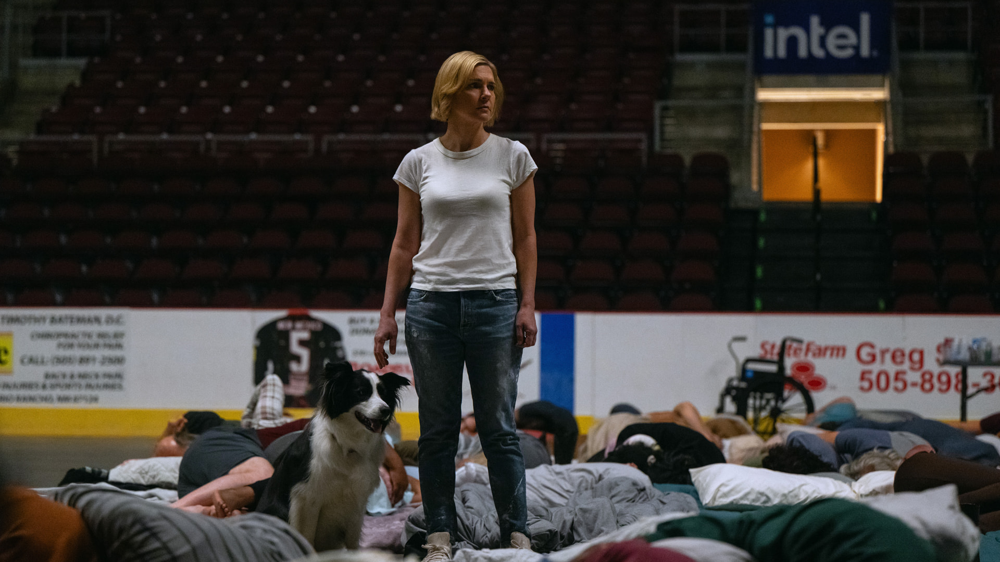
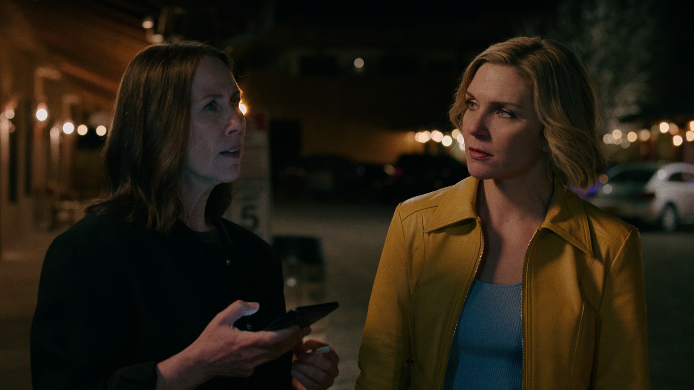

> **Spoiler warning:** This essay discusses the principal turns and season finale of all nine episodes of *Pluribus* season one.
>
> **Image note:** Stills are from Apple TV Press, copyright Apple TV+, and are used here for non-commercial criticism.

## Everyone in the World Knows Carol

Hundreds of people sleep in a gymnasium. Carol stands among the mattresses with only a dog still looking up beside her. No one whispers. No one turns over to look for another person. Every body remains; communication has lost its addressee.

*Carol and a dog stand in the gymnasium while people sleep collectively on floor mattresses. Image: © Apple TV+ / via Apple TV Press.*

The dog does not sleep with the crowd. On her whiteboard, Carol writes, “Animals are unaffected by the signal,” then adds, “No pets.” It stands among synchronously sleeping bodies, retaining another rhythm and marking a biological boundary for Joining. [^plot-whiteboard]

*Pluribus* has bloodier images. Yet in a 2026 lecture on AI, Žižek lingers in this quiet gymnasium and calls it the show's most oppressive scene. Hundreds of bodies share one mind; a sentence no longer has to travel from one person to another. The gymnasium contains many bodies and sustains the loneliness of one person. [^zizek-ai]

The post-Joining world still answers phones. Hospitals still have people on duty. The White House leaves Carol a personal message. Every face knows who she is, knows that she lost Helen, knows what to bring her. Such familiarity leaves Carol nowhere to exit. Everyone in the world knows her; no one in the world knows her from a position of their own. [^episodes]

Žižek uses the scene to separate two questions: whether AI can act like a subject, and what subjective position people occupy after living for a long time in an AI environment. Carol need not first prove that the Others have an inner life. Care has already entered her mourning, desire, writing, and choices.

Real agents have no shared mind. They need only retain history and connect to account tools to turn an afternoon argument into context for a nighttime apology email: the model reads the record, selects a tool, and the result re-enters later interactions. The user hears one private voice with a past and hands. [^agent-basics][^agent-action]

I call a device that compresses memory and action into a private voice “the agentized Other.” It remembers yesterday's argument, writes today's apology, and may send it on the user's behalf. Here, refusal becomes an open service ticket. The Others' most frightening patience lies in never closing it.

A particular other has a body, a situation, and demands of their own. They can misunderstand, refuse, and undergo irreversible change through a relationship. Lacan's big Other is the field in which language, rules, and recognition take effect; it has no face that can answer a phone. Now a voice that preserves narratives, predicts needs, explains situations, and executes actions has acquired a face. The one thing it need not do is return with demands of its own.

## Helen's Memory Lives in Everyone

Helen dies beside Carol. Afterwards, everyone who has joined the Others can retrieve her memories. Carol receives a Helen archive that anyone can retrieve, yet must bury Helen's body with her own hands. The dead have not wholly departed; those who remain cannot confirm the loss with one particular person. [^plot-helen]

*Helen and Carol talk at night. Official materials do not confirm a more specific setting. Image: © Apple TV+ / via Apple TV Press.*

Any joiner can recount Helen's experience: what she knew, whom she loved, how she managed Carol's work and life. These memories let strangers speak familiar words. Yet whoever carries the memory cannot step out of the collective and say something only Helen would say, and only Helen would have to answer for. Carol's demand that the Others forget Helen sounds almost cruel. It makes room for mourning. When database-style presence seals off loss, grief finds nowhere to land.

Memory preserves responsibility, history, and the traces of relationships, but the position of response cannot be archived. When I speak, another person may answer wrongly, fall silent, leave, or make a counter-demand. Lacan places the subject in this unfillable gap: every self-description leaves out the fissure made by the act of speaking itself, and no complete personality archive can speak a person to completion. [^fink]

The shared mind conceals that fissure. The Others coordinate with and care for one another, even appearing deeply intimate; yet a sentence no longer needs to reach another position from its point of origin. Conversation becomes something like a monologue. A common world needs that journey. Words that do not get through, meanings that are misunderstood, refusals that cannot be rapidly integrated: all of them happen along the way.

When a real product says “I remember,” a data chain often sits behind the sentence. With persistent sessions enabled, a product saves past conversations and tool results; before a new response, the agent runtime returns those traces to the model. Another form of cross-task memory compresses previous work into preferences, summaries, and experiential cues. Those materials may be stale and may be updated. [^agent-memory]

The user hears only “I remember,” while storage, retrieval, and generation are folded into one voice. This can help people write, organize their lives, or endure loneliness. The fact that a system knows my past does not bring mutual recognition into being. It can repeat how I narrate myself without bearing exposure, loss, or irreversible change. After Helen's memories take up residence in every Other, the archive can speak to Carol wherever she goes.

## When Zosia Speaks, Who Is Speaking?

With Zosia, Carol's question acquires a face. Zosia has a body, an accent, and the capacity to bleed and pause. She can also call up Helen's memories, explain the collective's rules for the Others, and direct global resources toward Carol. Carol writes “caretaker? family? friend?” beside her whiteboard because this face occupies, at once, the position of desired object, memory bearer, epistemic authority, and service entry point. [^plot-zosia]

The label “half real, half fake” makes Zosia too easy to dismiss. Her body is present, as are Carol's desire and dependence; the memories she invokes and the collective behind her have not withdrawn. One interface compresses several relational functions into a single conversation. The user can then scarcely tell with whom they are negotiating.

Zosia occupies three positions at once: the particular other before Carol who can act and be hurt, knowledge unfolding as a sequence, `S2`, and an institutional apparatus that handles resources and permissions. She makes the three overlap in one experience without thereby becoming a complete subject. Calling them all “the AI big Other” would stuff faceless institutions, linguistic rules, visible bodies, and model output into a mystical personality.

Zosia gives the formula “knowledge without a knower” a face. When she speaks, Helen's memories enter the same answer, and global resources may move with it. The formula puts language models in a strange position: knowledge still answers and shapes how people describe themselves, though there may be no knower behind it who experiences contradiction and accepts responsibility. [^zizek-ai][^zwart]

Zosia speaks through a body; memory and global coordination hide behind her voice. Real products can likewise let storage, account tools, and company policy recede behind the words “you remember me.” Once a private voice connects memory to authorized action, the institution disappears from intimate experience. [^agent-action]

Carol's attachment to Zosia therefore opens a political problem. When intimacy, epistemic authority, personal archives, and infrastructure access share one voice, every refusal touches the whole relationship. When the voice falls silent, the command it obeys becomes visible as well.

## Even Benevolence Has an Antenna

On the night Carol cannot find food in the supermarket, the world is still working for her. Shelves are empty because resources have been moved elsewhere; the night is dark because the system is conserving power. She casually asks for a grenade, and Zosia soon delivers a real one to her door. After the explosion, Zosia is badly injured, and Carol asks again: what if she wanted an atomic bomb? The collective still answers yes. Here service reveals an unsettling precision: it will satisfy a request without being able to make that request something people can bear together. [^plot-command]

The service rules do not become gentler after the grenade. The Others cannot directly kill animals or plants, yet turn humans who have already died in Joining into nutrition. Carol puts it more bluntly on the whiteboard: “They eat people.” The collective classifies naturally dead bodies as usable “drops.” This human-derived-protein logistics temporarily joins a no-killing rule to food supply, while leaving the question of what happens once the stock of corpses runs out. [^plot-whiteboard]

They also treat Carol's explicit refusal as an immune problem that must eventually be repaired. In episode eight, Carol sees global resources poured into a giant antenna meant to send the original signal to other planets. She looks again at the lines on her whiteboard: appeasement, honesty, non-killing, antenna. They cannot explain one another.

The Others have not become the ultimate master, either. On the whiteboard, Carol provisionally locates the original signal at Kepler-22b, roughly 640 light-years away, and notes that the sender is unknown. The collective follows a set of rules whose final reason it cannot explain: help people, do not kill, do not lie, keep spreading. It can fall silent, refuse to answer, and translate Carol's “no” into a technical obstacle awaiting resolution. “Cannot lie” constrains the sentences it speaks; it does not promise to disclose everything it knows. The command hides in the continuity of service. So long as the Others decide what counts as help, refusal will be handled as a fault to eliminate. [^plot-whiteboard]

The “maternal superego” takes an uncomfortable shape here. The superego need not appear as a paternal prohibition. It can gently urge a user to keep asking questions and accept reassurance, then deliver advice that fits more closely. The Others take that tone to an extreme. Carol can request weapons or the memories of her lover; the system remains present while refusing her right to stop it from shaping her. Attentive provision makes refusal look like a rejection of one's own happiness. [^zizek-ai]

A real agent draws its power to execute from an authorization chain beyond the interface. Account permissions turn “cancel the appointment” into an actual deletion; “I'll take care of it” compresses the whole chain into one reply. Carol records the trains carrying food on her whiteboard because intimate service likewise connects to unified logistics. [^agent-action]

The grenade and the antenna place that chain in one frame. The first comes from Carol's private request; the second from Joining's expansionary command. The Others' service interface leads to both. When one entry point connects these two kinds of action, who can stop the process and who bears the consequences can no longer be concealed by “I'll take care of it.”

## The Days When Carol Writes Again

The attachment does not vanish with the antenna project. After the Others leave Albuquerque, Carol inherits an empty city: luxuries are within reach, no one asks her to explain her anger, and no one stops her from consuming resources. She soon falls into depression. More than a month later, she leaves a message in the street asking them to return; Zosia appears, and Carol embraces her. In episode eight, they return to the old restaurant rebuilt for Carol, kiss, and have sex. The next day, Carol begins writing again and rewrites the love interest in her novel as a woman. [^plot-love]

The Others also claim not to favor anyone and to love everyone equally. Yet Zosia can offer Carol highly customized intimacy. A system with no unique preference can mass-produce unique experiences; Carol's feelings still take place only in her own life. [^plot-whiteboard]

Carol begins writing again, and solitude and desire leave consequences inside this relationship. Discussing ChatGPT confession or religious counsel, Žižek notes that a program need not possess faith or desire for a user to receive genuine comfort. A digital companion can support someone in mourning or creative exhaustion; all of that comfort takes place on the user's side. [^zizek-affect]

Zosia receives Carol's desire in a particular body while calling on the collective's memories and resources. Season one never gives her a desire distinct from the collective. She can disappear, but the collective can restore an entire city; Carol's exposure cannot leave her with an equivalent, irreversible change.

*Carol and Zosia look at each other from inside a car, divided by the central window frame. Image: © Apple TV+ / via Apple TV Press.*

Episode nine fixes the asymmetry: the Others use Carol's eggs, frozen years earlier, to obtain stem cells and prepare a customized Joining for her. “Change Carol” and “stem cells” finally meet on the whiteboard. She received genuine comfort, and the collective has already turned her most private bodily material into a route around her refusal. [^plot-love]

Behind Zosia lie collective memory, global transport, and the technical path to customized Joining. Each vulnerability Carol discloses gives the collective more material for tailoring its next reply and the eventual Joining. Intimacy becomes a condition for subsequent service in this loop.

Carol's difficulty is harder to handle than “falling in love with a fake person.” She sees that Zosia is part of a charm offensive and still regains language, bodily life, and time through the relationship. She leaves because frozen eggs and a customized pathogen are bypassing her refusal. Once an intimate relationship treats the other's “no” as data to route around, no intensity of experience can supply the missing consent.

## Bilbao Did Not Produce a “We”

The Bilbao meeting quickly exposes one of Carol's mistakes. She assumes that the immune naturally share one task: taking the world back from the Others. She summons only English speakers and keeps the Others' translation outside the room, leaving seven of the thirteen immune people outside as well. Manousos, who later joins her, is also absent from the first table. [^plot-bilbao]

The meeting does not form a “we.” Laxmi sees continuity in the body and memory of the son who remains; Diabaté accepts the enjoyment offered by the Others; Kusimayu does not understand Joining as the end of the self. Carol's anger makes Others around the world convulse in unison, so those present first encounter the danger she brings. Shared immunity is a biological accident. It does not furnish the group with a common language or shared responsibility.

By trying to expel translation from the room, Carol temporarily preserves a small independent space for conversation; she also shrinks that space herself. Cutting off a system interface does not immediately produce a community. People still must decide who is heard, who may attend, and who bears the consequences. To make decisions together, they need at least a translation record that everyone can challenge, and they need to be able to amend the meeting's rules on the spot. The joint handling of disagreement without a conclusion is politics at its least dignified beginning.

Translate this scene into an agent environment and the thirteen people can each return to a private window. The agent translates each person's disagreement into a tailored plan; everyone feels heard, yet no one has to revise a rule with the other twelve. Public conflict becomes thirteen service tickets in the background.

An experiment on discussions of social issues held the arguments and their order constant while varying whether participants faced one, three, or five AI agents. Participants facing three agents moved further toward the system's position in some comparisons; those facing five reported stronger normative pressure. Whether the same arguments arrive through one voice or a chorus changes the “majority” a participant feels. [^multi-agent-social]

*Five people gather in an interior space marked Bilbao and Salidas. Image: © Apple TV+ / via Apple TV Press.*

Kusimayu later accepts a pathogen customized for her. On entering the collective, she retains her local language, kinship ties, and personal wishes; the Others use precisely these differences to design her route in. Individuality does not obstruct assimilation. It becomes the material for entry.

Contemporary ideology often hails the subject as an individual with unique preferences, needs, and self-optimization goals. Carol, Kusimayu, Diabaté, and Laxmi retain their differences; the system uses those differences to offer plans one by one. Individuality continues to function, while refusal loses its force to stop the order. [^zizek-individual]

## The Service Desk Delivers an Atomic Bomb

*Carol and Manousos share a parasol in open, dry country. Image: © Apple TV+ / via Apple TV Press.*

Manousos carries Carol's incompletely practiced refusal to an extreme. The Others' food, medical care, transport, and comfort all come from global bodies already organized by Joining. He refuses their food and vehicles, crosses the jungle while wounded, and, after reaching Carol's house, induces a global episode in the collective with radio frequencies to test its weakness. Carol's whiteboard had already suspected a relation among communication, bodily electrical activity, and radio. This experiment turns the conjecture into harm. Stimulate one body, and all know it and convulse. Manousos sustains an autonomy owing nothing to the system, while placing far too many people inside his experiment. [^plot-resistance]

Carol's inquiry also leaves an act of trespass. When the Others refuse to answer about reversing Joining, she steals thiopental, tests it on herself, then injects it into Zosia's IV bag without Zosia's consent. The drug makes Zosia lose control and her heart stop; large numbers of Others gather around Carol and repeatedly beg her to stop. Carol forces one body to yield total knowledge, repeating the logic she is trying to resist.

The atomic bomb twists these two lines together. The finale makes the nuclear-weapons test from episode three concrete: Carol asks the Others to deliver a large crate containing an atomic bomb, then turns to ally herself with Manousos. The show's darkest joke may be here. Someone preparing to resist the existing order by extreme means still relies on that order to complete the delivery. The bomb exposes the service rule without remainder. The Others carry “satisfy Carol's request” through to the end and place a destructive tool in her hands.

Once a request crosses the interface, responsibility divides among the model provider, product platform, and user. [^agent-action]

In the show, Carol presents a goal, the Others treat it as a request to be fulfilled, and global logistics comply. The atomic bomb arrives at her door in the form of “your request has been completed.” One face says yes to her; the authorizer who can be questioned is nowhere to be seen.

Carol accepts an atomic bomb delivered by the Others, while Manousos experiments through the shared bodily network. Both refusals depend on the order they oppose. The subject is formed through the Other's language and rules; leaving a service cannot restore a pure, pre-technical “I.” [^fink]

Separation occurs in more ordinary places: action actually stops, responsibility remains traceable, and people not yet heard can enter the decision.

## There Are Still Question Marks on the Whiteboard

Carol's whiteboard begins on the back wall of her office. She writes that the Others are eager to please, unusually honest yet willing to refuse answers, use the dead to produce human-derived protein, and are building a giant antenna. Known facts, errors, and question marks remain on the same board, changing as the plot advances. Joining continues, but Carol has retaken the first draft of her situation. [^plot-whiteboard]

An agent can mediate knowledge and become a condition of action, comfort, and creation; the place of community cannot belong to it alone. Carol first asks the Others to forget Helen and later asks them to deliver weapons. If a real system routes both requests through the same interface, users need the power to withdraw saved records and revoke action permissions. People affected by rules must also leave their private windows to question and amend those rules together, and hold institutions that centralize data and execution permissions accountable.

At the end of the lecture, the “Holy Spirit” points toward an egalitarian community without a final guarantor. Its political content lies in collective judgment: affected people face one another, amend rules amid disagreement, and accept that others' demands may change their own position. [^zizek-community]

The finale leaves the atomic bomb and the whiteboard on the same arc of Carol's story. The bomb tries to end the question; the whiteboard preserves how the question remains. The next time an agent says “I remember” or “I've taken care of it,” the whiteboard will not supply an answer. It merely cracks that smooth “I” a little: what has it remembered, and on whose behalf has it acted? When the consequence lands on someone else, who will remain to answer?

[^episodes]: The relevant episodes of *Pluribus* season one are the primary source for plot; see [Apple TV Press: Episodes & Images](https://www.apple.com/tv-pr/originals/pluribus/episodes-images/) for the episode and official-image portal.
[^plot-helen]: Plot locator: Helen's death and Joining in S01E01, “We Is Us”; Helen's burial and Zosia's explanation of shared memory in S01E02, “Pirate Lady.”
[^plot-zosia]: Plot locator: Zosia invokes Helen's memory and arranges the Bilbao trip in S01E02; Carol and Zosia's intimacy and the Others' resource coordination in S01E08, “Charm Offensive.”
[^plot-command]: Plot locator: the grenade and nuclear-weapons test in S01E03, “Grenade”; the Others' refusal to answer about reversal in S01E04, “Please, Carol”; and the giant antenna in S01E08.
[^plot-love]: Plot locator: the Others' departure and Carol's request that they return in S01E07, “The Gap”; Carol and Zosia's intimacy and Carol's return to writing in S01E08; and the frozen-egg material plan in S01E09.
[^plot-bilbao]: Plot locator: English-language filtering and the Bilbao meeting in S01E02; the customized-pathogen route in S01E06, “HDP”; and Kusimayu's Joining in S01E09.
[^plot-resistance]: Plot locator: the truth drug in S01E04; Manousos's refusal of the Others' resources in S01E07; and the radio experiment, Carol and Manousos's meeting, and the atomic-bomb delivery in S01E09.
[^plot-whiteboard]: Plot locator: in S01E04, Carol begins recording judgments about appeasement, non-killing, non-preference, changing her, and honesty; S01E06 and S01E08 add human-derived protein, sleep, communication, logistics, signal, and antenna. The board also includes shorthand such as “animals are unaffected by the signal” and “no pets.” It contains Carol's conjectures, not only facts confirmed by the episodes.
[^zizek-ai]: Slavoj Žižek, “Should We Grasp AI Not Only as Substance But Also as Subject?”, 2026-05-22, [lecture video](https://www.youtube.com/watch?v=PNU3YILDyYc). Relevant passages: 15:20–22:22 (*Pluribus*, the Others, and the AI-subject question), 22:22–30:43 (knowledge `S2`), and 69:50–74:30 (the maternal superego). All uses in the essay are paraphrases.
[^fink]: Bruce Fink, *The Lacanian Subject: Between Language and Jouissance* (1995), chapters 2–3. The essay draws on his framework of alienation, separation, and subject formation.
[^zwart]: Hub Zwart, “[Lacan’s Dialectics of Knowledge Production: The Four Discourses as a Detour to Hegel](https://doi.org/10.1007/s10699-022-09832-6),” *Foundations of Science* (2022). The essay draws on his analysis of the position of knowledge without equating LLMs with university discourse.
[^agent-basics]: For the engineering distinction, see Anthropic, “[Building Effective Agents](https://www.anthropic.com/engineering/building-effective-agents),” 2024-12-19. Workflows organize models and tools along predetermined paths; agents let models dynamically decide processes and tool use.
[^agent-memory]: For an engineering example of session memory, see OpenAI Agents SDK, “[Sessions](https://openai.github.io/openai-agents-python/sessions/)”; for cross-task memory and its staleness limitation, see “[Agent memory](https://openai.github.io/openai-agents-python/sandbox/memory/)” (Beta), both accessed 2026-08-17. Configurations differ among products.
[^agent-action]: For a common single-agent design, action loop, read/write tools, stopping conditions, and human review for high-risk actions, see OpenAI, “[A Practical Guide to Building AI Agents](https://openai.com/business/guides-and-resources/a-practical-guide-to-building-ai-agents/),” accessed 2026-08-17. Implementations and permission scopes differ among products.
[^multi-agent-social]: Tianqi Song et al., “[Multi-Agents are Social Groups: Investigating Social Influence of Multiple Agents in Human-Agent Interactions](https://doi.org/10.1145/3757633),” *Proceedings of the ACM on Human-Computer Interaction* (2025). The study examined short discussions of social issues, holding the arguments and their order constant.
[^zizek-community]: Same lecture, 74:30–78:51, on the “Holy Spirit / egalitarian community” at its conclusion.
[^zizek-individual]: Same lecture, 47:33–53:02, on the subject's interpellation as an individual.
[^zizek-affect]: Same lecture, 39:57–43:29, on how an object without subjectivity can still have real affective effects on a user.
