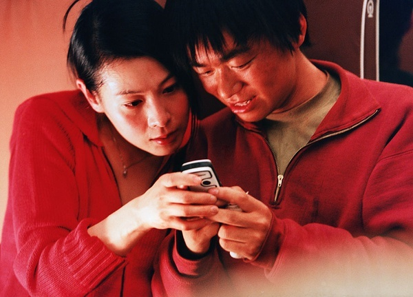

> **剧透说明**：本文涉及《天下无贼》及《无间道》三部曲的完整剧情，并以《无间道》香港原版结局和《无间道 III》对它的延续为准。

> **配图说明**：剧照来自 1905 电影网与 M+，原权利归相应权利人；本站仅用于内部、非商业评论阅读，不作转载或再分发。

## 钱袋回到傻根怀里

傻根还在睡。王薄已经负了致命伤，仍把装着六万元的挎包放回他胸前。赶到的便衣警察从王薄身上拿起手机，替他发出已经写好的信息：“傻根的事已办妥，等着我。”傻根没有看见钱款几度易手，也不知道最后替他拿回钱的人回不来了。

这双手在电影开头还用来骗车、偷手机。上了火车以后，王薄也没有马上变成傻根的保护者。他先把六万元说成自己的猎物，拦住黎叔多少带着同行间的争胜。真正先停下来的是王丽。她认傻根作弟弟，告诉王薄自己已经怀孕，不愿再让孩子跟着他们过原来的生活。王薄答应护住这笔钱，仍经过了一段迟疑。

*王丽与傻根同框。图片：via 1905 电影网。*

这笔钱在车上几度易手，王薄、王丽和便衣警察都曾把它送回傻根身边。最后一次发生在警方收网以后：黎叔脱身再盗，王薄留下追钱，搏斗后把挎包放回傻根胸前。中段将真钱换成纸钱的人是便衣警察，不能把这一步也算成王薄的保护。[^thieves-plot]

最后这一次，王薄保留了全部手艺，只把用途换了：同一双手不再拿走傻根的六万元，转而把钱送回失主手里。本文暂用“改过”指他在这个关口换了行动方向，用“补过”指六万元回到傻根手中。传统辞书里的义项彼此交叠，这里只为看清两项具体变化。[^gaiguo]

六万元恰好让“补过”有了形状。数目可以点清，失主就在眼前，钱也确实回去了。王薄从前骗过谁、偷过谁，电影没有给出名单；那些人的损失没有随着这个钱袋一起回来。他也没有认罪，没有接受调查，更没有机会向旧日受害者作出补偿。王薄救回一桩，仍不能替自己把旧账全数划掉。

这类故事常被归到“救赎”名下。王薄具体做成的，是补回六万元，并在最后一次伸手时停下。旧账怎样处理，别人是否重新相信他，还留在故事外面。

死亡尤其容易把这层限度盖住。一个人肯冒死保护别人，当然说明他的行动发生了很大的变化。死亡却没有收款人，也不会自动把未处理的损害转成清白。死者无法再回答，观众也容易在悲壮中替他关账。若把王薄的死看成一次总付款，他最后的选择反而会变轻：那双手在一个还能选择的关口，没有照旧伸向别人的钱。

王薄和刘健明都由刘德华饰演。这个事实不能证明两部电影有意互文，却让比较少了一条省事的退路：同一张脸，一双手把钱袋放回傻根胸前，另一双手会在警署里删掉陈永仁的档案。差别落在角色占据的位置和随后做出的动作上。[^andy-lau]

所以，钱袋回到傻根怀里以后，问题才刚刚出现：钱还了，人就能重新做人吗？《无间道》把这句问话交给另一个人。刘健明也曾亲手杀死控制自己的韩琛，也说自己想做好人。他接下来的动作，却让“想”与“改”之间的距离越来越长。

## 天台上那句“想做好人”

天台上，陈永仁从刘健明身后用枪控制住他。刘请求一次机会，说自己过去没得选择，现在想做一个好人。陈的回答很短：“跟法官说，看他让不让你做好人。”不同字幕在少数字词上有异，场景动作没有变：陈仍给刘戴上手铐，准备把他带回警署。[^rooftop-line]

刘想保住现有的警察身份，并从此把自己算作好人；陈不让这段自我说明当场结案。接下来仍有拘捕、调查和审判，刘做过什么要交给别人查验。

*陈永仁与刘健明在天台对峙。图片：© 寰亚影视发行（香港）有限公司 / via M+。*

这场对峙以前，两人确实短暂站到过同一边。刘借黄志诚的手机联系陈，配合警方除掉韩琛；陈可以借此报仇并恢复身份，刘也想斩断黑帮对自己的控制。停车场里，刘亲手杀死韩琛。这个结果帮了警方，也同时除掉了一个能指认刘旧身份的人。

刘决定背弃韩琛以前，已经追踪并泄露黄志诚与陈的会面地点。黄被韩琛手下从楼上抛下，傻强也在随后的枪战中重伤身亡。陈一下失去能正式证明身份的上线，也失去那个已经看出真相、仍替他遮掩的朋友。刘后来协助杀掉韩琛，终止了一层控制，却没有回头说明自己在这些死亡里做过什么。

紧接着发生的事，使这次合作很难成为刘已经改变的证明。陈在刘的桌上认出韩琛交来的文件袋，发现警队内鬼就在面前。刘随即删除陈的卧底档案。陈死在林国平枪下以后，刘又在下降的电梯里杀掉林，把内鬼案归结到这个已经死亡的内应身上，同时隐去自己的身份。香港原版里，刘走出电梯后向赶到的警员举起警察证件，继续占有这套身份；中国大陆和马来西亚使用的替代结局让他当场被捕，第三部承接的是前一种结局。[^infernal-one]

刘说“想做好人”时未必毫无真意。他厌倦韩琛的操纵，也想过一种不再替黑帮卖命的生活。中文里的“自新”正好能容纳这种愿望：从今以后另走一条路。这个愿望没有替他处理旧责。“改过自新”至少见于《汉书·刑法志》，其中那个“过”也没有被省掉。[^zixin]

拉康在《精神分析的伦理学》中追问，一个人是否依照寄居于自身的欲望行事。刘始终抓住“我要做好人”的愿望，每逢警察身份受到威胁就立刻行动。这份自觉愿望不能直接等同于拉康所说的欲望，也不能决定行动是否正当；要看他想保住什么，又把代价留给谁。[^lacan-desire]

刘向陈索取的还有旁人的承认。他想保留警察的职位、荣誉和生活，从此以警察身份被当作好人；取得这些东西的经过，他又不肯交给公开调查。陈若放下枪接受他的自我说明，刘便用一段自述替自己结了案。天台上的分歧由此很朴素：想成为怎样的人，可以由自己开头；自己做过什么，不能只由自己定案。

程序也会出错。《无间道》里的警队曾把陈开除，让一项十年卧底任务只靠少数人和一份秘密档案维持。被捕同样不能证明一个人出于自愿承担了责任。陈提到法官，没有保证判决永远正确。他只守住最低限度：刘不能同时做被告、证人和法官。刘若要继续以警察的名义行使权力，就得让别人查验他的行为，听取受害者和证人的说法，也容许裁决不按他的愿望落下。

陈永仁的处境从另一面照出这道门槛。他长期替警队工作，最后却连“我是警察”都无法靠自己证明。刘手里的警察证是真的，陈那十年的警察生涯也是真的；当时可见的警队记录支持刘，却不足以确认陈。人有没有改变之外，还有旁人凭什么知道。

## 刘健明桌上的文件袋

韩琛曾让手下填写真实资料，把装着这些记录的文件袋交给刘健明。韩琛死后，陈永仁来到警署，以为终于可以结束卧底生活。他在刘的桌上认出同一个袋子，也认出自己留下的笔迹。一个放错位置的物件，比刘的制服和职衔说得更清楚。

陈没有当场揭穿刘，先离开了办公室。刘察觉暴露，删掉陈的卧底档案。陈十年间做过的事没有跟着消失，能在警队里正式证明这些事的记录却被切断了。黄志诚已经死去，叶校长也已去世；直到陈死后，李心儿从叶校长遗物中找到留存的档案，警队才恢复他的身份。[^infernal-evidence]

传统说“名实”，关心名称、位置与实际作为能不能对得上。乍看之下，陈永仁有实无名，刘健明有名无实。刘的“名”却不空：证件能让下属服从，职衔能让他查案。陈的“实”也不能自行取得公共效力，十年工作仍需证人和档案确认。“正名”可以提醒我们，名字一旦错位，命令、奖惩和归属都会跟着错位；它没有提供现代司法认证的现成办法。[^zhengming] 陈需要恢复警察身份、还其清白。他不需要以罪人的位置等待赎免。

*刘健明出示警察证件。图片：© 寰亚影视发行（香港）有限公司 / via M+。*

齐泽克在《意识形态的崇高客体》中提醒读者，意识形态未必靠人心里相信，也寄在仪式、物件和机构的日常运转中。警察证和档案让警队照常把刘当作警察；陈的档案一删，警队便失去正式承认他的依据。刘是否相信自己清白，并不妨碍这个假身份继续生效。[^zizek-belief]

文件袋、档案和证人不会把一个人变好。它们让事实离开当事人的嘴，进入别人可以查验、质疑和补充的地方。李心儿听过陈自称警察，那是治疗关系中的私人信任；叶校长留下的档案可以使警队正式确认他的身份；寄到刘家的录音光碟又能证明刘与韩琛的关系。三条证据线各有作用，彼此不能随意替换。钱袋的效力更窄：它只证明六万元回到失主身边，不能替王薄的整个人生作证。

记录可能被删，证人也可能说谎，所以正式身份从来不等于道德真理；刘的警察证就是最刺眼的例子。

可一旦没有证人、记录和程序，职位较高、权限较大的人就更容易垄断叙述。刘删档以后，陈仍知道自己是谁，当时却几乎失去了正式证明身份的关键入口。正式确认会迟钝，也会犯错，仍不该由要求确认的人独自完成。

《天下无贼》的知情者则围着一个不知情的人重新安排动作。傻根不知道六万元曾经被偷，王薄、王丽和警察却按照“天下无贼”来做事，在一节车厢里暂时把这句话做成了现实。傻根成了被安排去相信的人。这个安排确实保护了他的财物，也把他留在失主、证人和判断者的位置之外。他没有机会追问钱怎样回来，也无法决定是否原谅。

刘的删除把隐瞒带向另一种后果：它保护删除者，把无法证明身份、无法回到警队的代价留给陈。秘密没有固定的道德方向。它遮住谁，保护谁；知情权被拿走以后，后果落在谁身上？傻根至少拿回了自己的钱。陈失去档案后，当时可见的制度记录支持刘，却不足以确认陈。

这份档案为什么会脆弱到可以被一名内鬼删除？《无间道 II》把时间带回 1991 年。刘和陈还在警校，一套警匪秩序已经开始替他们安排名字、履历和去路。

## 一个进警校，一个被警校除名

1991 年，Mary 让年轻的刘健明刺杀倪坤。刘完成了这次刺杀，韩琛随后把他送进警校。另一边，陈永仁因为隐瞒自己与倪家的血缘关系，被警校正式开除；黄志诚再把这项处分转成长达多年的卧底任务。刘带着杀人秘密穿上制服，陈接受警方任务以后留下犯罪履历。

刘后来把自己说成“以前没得选择”，这句话有现实根据。刘对 Mary 的爱慕、韩琛的安排和警队给出的升迁，把一次服从逐渐固化成生活。陈的处境也被家世、警校处分和秘密任务一再挤压，使他越履行警察职责，公开身份越像一个黑帮成员。黑帮和警队都参加了两个人的形成。

形成一个人的处境，仍没有替他完成以后每一次选择。1995 年，倪永孝清洗反叛的头目，韩琛在泰国死里逃生，陆启昌替黄志诚死于汽车炸弹。刘健明先救下 Mary，求爱被拒后又泄露她前往机场的行踪，使她落入倪家手中。爱慕可以解释这一连串服从和报复怎样积累，解释不了他为什么可以把另一个人的命拿来处置。

陈也没有因“警方卧底”四个字自动获得道德豁免。他服刑、进入倪家、替倪永孝挡枪，长期在暴力环境里维持身份；黄志诚早年卷入针对倪坤的秘密行动，陆启昌和更多人后来承担了后果。第二部把警与匪写得纠缠，责任仍能落到具体动作上：Mary 向刘发令，刘完成刺杀，后来又泄露她的行踪；黄继续追查倪家，陆启昌和陈则承受这套安排的风险。

警校用公开纪律开除陈，警方随后又让这次开除成为卧底的掩护；韩琛把刘送进警队，再借警察程序替黑帮排除对手。公开身份依赖暗处的安排，暗处的安排又借公开身份取得力量。警方卧底与刘的谋杀、删证不能等量齐观，这种纠缠已足以说明制度本身也参加了身份的制造。

到 1997 年，倪永孝试图给倪家披上合法生意和公共身份的外衣。陈把多年取得的材料交给黄志诚，请求结束卧底。黄找回韩琛，让他以受保护证人的身份指证倪永孝。

最后的对峙里，倪失去筹码，仍把枪口指向韩；黄抢先开枪。倪死在陈怀中，临死前发现陈身上的监听装置，才明确知道这个弟弟是警察。韩琛随后填补倪家留下的位置，黄的调查对象也从倪永孝换成韩琛。旗帜换了，两条卧底线原样进入第一部。[^infernal-two]

倪永孝想让倪家的权力获得一张体面的公共名片，刘健明则想让警察生涯盖住进入警队以前的那声枪响。新身份会带来新的关系和义务，也可能被旧秘密当成藏身处。陈恰好走在反方向：他越替警方完成任务，名字越难回到警察名册上。

第二部让一句江湖话在六年里回来四次。前三次，倪永孝把它当作父亲留下的规矩；最后一次，韩琛在倪举枪时把它说回给他。本文以粤语流传写法“出得嚟行，预咗要还”为分析对象。普通话转述可见“出来跑，迟早要还的”，另有版本写成“出来混，迟早是要还的”。影片的粤语对白、中文字幕和后来的转述不能混作同一份逐字原句，本文只比较这几种说法的口气。[^line-versions]

“出得嚟行”先划出一道门槛：既然已经踏进这条路，就得面对它的规矩和风险。“预咗”是已经料到，也常含着把代价算在内、做好心理准备的口气。普通话用“迟早”以后，重心移到时间上：眼前尚未发生的后果，往后总会追来。“出来混”则把粤语“出嚟行”这个整体的江湖用法，换成普通话更熟悉的说法。[^line-grammar]

两种说法都抓住了过去不会凭空消失。粤语版本把入场者的自知和心理准备说得更明，普通话版本则把“迟早”的时间必然性推到前面。

可“我早就料到”离负责还有很远。预料自己可能被杀，并不能抵掉已经杀过的人。日后遭到报复，也不等于向受害者说清事实、归还所得或接受追究。

把后果预先算进来，惩罚便可能成了入场费：我既已准备日后偿命，今天的暴力也像一个付得起代价的选择。江湖话就这样给暴力标出了价格，没能让人停手。[^zizek-belief]

句中的“还”也没有清楚的债权人。受害者要求的解释、归还和追究，被江湖改写成行动者迟早遭到的命运。影片里的“还”，最后只剩另一场报复。

话音落下不久，黄志诚开枪，倪永孝死在陈永仁怀中。韩琛接过倪的位置，又在第一部死于刘健明之手。暴力的后果逐一回来，又生出下一轮暴力。那句话说明江湖很难让人全身而退，没有告诉人怎样结束旧做法。这个空缺一直留到第三部，终于由刘健明自己的声音填满办公室。

## 办公室里响起刘健明的声音

李心儿为刘健明催眠时，刘开始用陈永仁的位置讲述自己。他说出韩琛和 Mary 怎样进入他的过去，也说出自己作为韩琛内应的经历。醒来以后，他制伏李心儿，离开诊室。

后来，刘把调查目标放到杨锦荣身上。他认定杨是韩琛留在警队的另一名内应，从杨的办公室取得录音，准备在部下面前揭发他。现场播放出的却是刘自己与韩琛往来的声音。刘发动的调查公开了自己的身份，部下转而准备拘捕他。[^infernal-three]

催眠中的声音仍被关在私人场景里。刘醒来以后可以拒认，也可以制止唯一的听众。办公室里响起的声音已经脱离他的控制，成了同事能够听见、查验并据以行动的对象。一个人可以说“我是警察”，这句话在什么关系里说出、由谁听见、造成什么后果，不再只由这个“我”掌握。

刘在催眠状态下说出了与自身经历相符的内容，没有把这番话交给任何可以追究他的程序。办公室的播放让旁人有了罪证，那份罪证来自他人的调查，没有构成他的主动认罪。到这里，受害者仍没有机会要求他交回权力、说明损害；还能弥补什么，影片更没有替他回答。

刘看似一直在行动：查杨锦荣，拿录音，集合部下。每一步都在阻止同一个问题落到自己身上。他把自己想成陈永仁，把杨当成需要逮捕的“刘健明”。当别人准备拘捕他时，他开枪杀死杨，被沈澄击伤后又企图自杀。旧身份已经侵入刘的经验，录音和枪击却留在众人面前。无论怎样解释他的痛苦，开枪仍是他在别人准备拘捕时做出的选择。

片名“无间”给这种持续的痛苦设下了宗教背景。三部曲的公开资料把它联系到没有间断的苦境；这个意象适合说明人物为何逃不开过去，不适合替任何人结算功过。[^wujian] 若再把一切写成“因果报应”，刘后来的重伤和残疾很容易被当成已经付清的价款。

早期佛教文本对这种痛苦账本恰有警惕。《中部》101 质疑以苦行逐笔磨尽旧业的主张，《相应部》36.21 也拒绝把一切苦受都归到过去所作。《增支部》又用盐落入杯水或恒河作比，说明结果并非固定的等量换算。[^karma-pain]

这些材料只帮助我们把“业”和“果报”用得窄一些。刘受了多少苦，仍不能替受害者回答他们失去了什么。

受苦与负责可以同时发生，也可能彼此错开。负责得有对象。刘需要向调查者说清事实，交回借警察身份取得的权力；还能弥补的损害要弥补，补不了的也要接受追究。刘的痛苦没有朝向这些人。他到最后仍在争夺陈的清白身份，仍想用一声枪响控制谁是警察、谁是内鬼。

“出得嚟行，预咗要还”到了这里显出它的限度。后果追上了刘，录音也留下了公共证据。他依然没有完成那个主动的“还”：把自己从警队窃取的身份和权力交出来，让受害者、证人和程序决定余下的事。

## 孩子已经会叫爸爸了

五个月后，王丽已经显怀，独自在饭桌前吃东西。便衣警察坐到她对面，说：“别等了，他走了。”王丽只答：“等我吃完了你再说。”影片随即回溯钱袋归还、王薄死亡和警察代发信息的经过；回到饭桌后，她仍在进食，眼泪已经落下来。[^thieves-ending]

那条信息请王丽“等着我”，警察如今让她“别等了”。同一个人先替王薄留下希望，又不得不把死讯带来。过去没有停在列车上，它追上了已经准备重新生活的王丽。孩子给她留下一段尚未写定的生活，却不替父母还债，也不保证她以后一定不会回到旧路。影片只给出几件有限的事实：王丽此前已经表示不愿继续原来的生活，王薄在最后一个关口也换了行动方向，傻根的钱因此回到原处。

《无间道 III》也给刘健明留下一个孩子。陈永仁死前的时间线里，刘已经知道 Mary 怀孕。陈死后十个月，两人在电话里谈离婚，刘说其他东西可以分，孩子不能分。他重伤后又过了七个月，Mary 来看他，只说孩子已经会叫爸爸了。[^lau-child]

同是刘德华的脸，王薄没有活到孩子开口，在傻根这件事上却已经换了行动方向；刘健明得知 Mary 怀孕后仍继续杀人、删证，维持假身份，后来只能由 Mary 把“孩子已经会叫爸爸”的消息带到他面前。

“爸爸”来自亲属关系，“警察”由机构授予，“好人”只是刘对自己的期许。这些称呼都要靠后来的行动站稳。孩子会叫“爸爸”，不能替刘恢复已经失去的关系。

王丽低头继续吃饭，Mary 带着孩子的消息来到刘面前。电影把两个男人的死与伤推到高潮，女人和孩子却要在高潮过后继续生活。男人的悲壮或受苦，没有把后果一起带走。

*王薄与王丽。图片：via 1905 电影网。*

刘健明因枪伤和脑损伤严重残疾，画面中不再说话。第三部没有把这个身体状态当成认罪书。拉康提出、齐泽克继续讨论的“两种死亡”，可以在这里分开肉身死亡与公共身份的消失：陈先在档案中被删除，随后才在电梯口死去；他死后，叶校长留下的记录又把警察身份写回公共秩序。刘的身体活了下来，录音响起时，“警察刘健明”已经开始崩塌。[^two-deaths]

后来的证据改变了过去在公共世界中怎样被理解，没有改变已经发生的事。陈十年的黑帮履历重新被认定为卧底工作，刘的警察生涯则被录音改写为一段内应史。王薄最后的行动也使那双手有了新的意义，他早年的受害者并没有因此消失。

影片最后回到陈死前约一周的影音店：刘和陈并肩试听音乐，谈器材，还不知道彼此正是以后要找的人。《天下无贼》也在王丽的饭桌上倒回钱袋、死亡和短信的经过。那句“等着我”在回溯之前还是希望，之后已成了遗言。叙事可以回去，人物没有得到第二次选择。

《天下无贼》沿着一趟列车把人送往下一站，《无间道 III》则把叙事折回最初的试听。两种结尾都没有签发“新生”的证明。《天下无贼》把一段未定的生活交给王丽，《无间道 III》让刘困在已经发生过的一切里面。若用“解脱”来命名，分寸还要更严。

早期佛教材料在这里能帮忙的地方很有限：它们把涅槃落到贪、嗔、痴的止息，也容许解脱在生前成立。这个范围足以排除死亡等于解脱、受苦等于旧业已清。

另一些经文又拒绝让过去行为穷尽当下的体验和努力，把业落到有意向的行动上。[^liberation-action] 放回这两组结局，王薄之死不能证明他已经解脱，影片也没有把刘的残疾签成业报判决。

王丽会带着王薄的死讯和两人的旧生活继续活；刘身边的档案、录音、死者和伤势也都来自以前的行动。过去进入现在的条件，不必替下一只伸出的手预先决定方向。王薄没能删除过去，他只在最后一次伸手时没有再照旧拿走。新生若会发生，只能由活着的人在下一次选择里继续做出来。

钱已经回到傻根怀里，孩子也已经会叫爸爸。一个人若说自己也想回来，别人仍会问：他停下了什么，愿意失去什么；那些补不回来的事，他肯不肯让人查清，并听他们把问题问完？

[^thieves-plot]: 《天下无贼》的影片资料与剧情主线参见[中国电影频道影片页](https://m.1905.com/Mdb/mdbDetail/filmid/55764/)、[央视 2009 年剧情页](https://news.cctv.com/special/gzzg/20090918/105376.shtml)及[央视 2015 年节目页](https://tv.cctv.com/2015/08/12/VIDERjCJ3w7f1pkS6UfO459b150812.shtml)。几次钱款易手以影片情节为准；本文特意分开王薄、王丽与便衣警察各自的动作，不把警方的纸钱掉包算到王薄名下。
[^gaiguo]: 《周易·益》有“见善则迁，有过则改”，《论语·学而》有“过则勿惮改”；可分别见[中国哲学书电子化计划《周易》](https://ctext.org/book-of-changes/yi1/zh)与[《论语·学而》](https://ctext.org/lunyu-zhushu/xue-er/zh)。“补过”的基本义参见台湾“教育部《重编国语辞典修订本》”[词条](https://dict.revised.moe.edu.tw/dictView.jsp?ID=20005&la=0&powerMode=0)。辞书义项本来会重叠，正文的分工只服务于本文的剧情分析；这些词也不自动包含赔偿完成、法律责任消失或重新取得他人信任。
[^andy-lau]: [中国电影频道的《天下无贼》影片页](https://m.1905.com/Mdb/mdbDetail/filmid/55764/)与[寰亚的《无间道》官方影片页](https://www.mediaasia.com/En/Movies/Info/86/)分别列出刘德华饰演王薄和刘健明。本文只把共同演员当作跨片比较的视觉条件，不据此推断主创设计了两片互文。
[^rooftop-line]: [新浪的经典场景与台词汇编](https://survey.ent.sina.com.cn/result/70825.html)记录了刘健明“以前没得选择、现在想做好人”的表达；一份[公开影片回顾](https://www.sohu.com/a/324364109_684688)同时转录了陈永仁让他去跟法官说的回答。两者足以交叉确认对话的具体意思，不是官方字幕表；正文不据此固定“好／好啊”“做个／做一个”等细小异文。
[^infernal-one]: 第一部的主创、双卧底设定与片长口径参见[寰亚官方影片页](https://www.mediaasia.com/En/Movies/Info/86/)及[香港电影资料馆节目页](https://www.filmarchive.gov.hk/tc/web/hkfa/pe-event-2020-7-1-3.html)。本文采用香港原版：刘健明杀林国平后以警察身份离开；中国大陆、马来西亚使用的替代结局中刘被当场拘捕，参见[Criterion Channel 的版本说明](https://www.criterionchannel.com/infernal-affairs/videos/infernal-affairs-alternate-ending)。第三部只承接香港原版。
[^zixin]: “改过自新”释为改正过失、重新做人，词源至少可追到《汉书·刑法志》，参见台湾“教育部《重编国语辞典修订本》”[词条](https://dict.revised.moe.edu.tw/dictView.jsp?ID=68508&la=0&powerMode=0)。本文只取“重新开始”这一层，不用“自新”注销此前行为。
[^lacan-desire]: 拉康在《精神分析的伦理学》结尾追问，一个人是否依照寄居于自身的欲望行事；见 Jacques Lacan, *The Seminar of Jacques Lacan, Book VII: The Ethics of Psychoanalysis, 1959–1960*, ed. Jacques-Alain Miller, trans. Dennis Porter, W. W. Norton, 1992, p. 314。[Lacan.com 的研讨班索引](https://www.lacan.com/seminars2.htm)概括了欲望、罪疚与“两次死亡”的关系。正文用这个问题检查刘的愿望和行动，不把坚持欲望等同于清白、守法或为他人负责。
[^infernal-evidence]: 本节的文件袋、删档、录音光碟与叶校长档案按第一部香港原版的场景层级复述；[寰亚官方影片页](https://www.mediaasia.com/En/Movies/Info/86/)与[M+“无间道：经典解构”](https://www.mplus.org.hk/tc/cinema/anatomy-of-a-classic-infernal-affairs/infernal-affairs/)只承担影片身份和版本入口，不作为这串动作的逐镜转录。M+ 页面未列出单独的再发布授权；本稿只按本站已确认的内部、非商业评论阅读范围使用所选剧照，并保留来源说明。
[^zhengming]: “名实”可指名目与实际，见台湾“教育部《重编国语辞典修订本》”[词条](https://dict.revised.moe.edu.tw/dictView.jsp?ID=32152&la=0&powerMode=0)。《论语·子路》讨论“正名”时，把名称不正与言说、事务、礼乐、刑罚的失序连在一起，见[中国哲学书电子化计划](https://ctext.org/lunyu-zhushu/zi-lu/zh)。本文只借“名实相符”照见陈、刘的错位，不把古代“正名”当成现代警队认证或司法程序的同义词。
[^zizek-belief]: Slavoj Žižek 在 *The Sublime Object of Ideology* 第一章中讨论了实践中的幻想、外置于物件和仪式的“客观信念”，以及禁令与越界的互相支持；参见第二版，Verso, 2009, pp. 31–53。[出版社页面](https://www.versobooks.com/products/1284-the-sublime-object-of-ideology)和[Google Books 书目页](https://books.google.com/books/about/The_Sublime_Object_of_Ideology.html?id=9fHWAAAAMAAJ)可核对版本与全书主题。齐泽克没有分析这两部电影，二者的联系由本文提出。
[^infernal-two]: 《无间道 II》官方页面将影片定位为 1991 至 1997 年的前传，片长记为 119 分钟，见[寰亚官方影片页](https://www.mediaasia.com/En/Movies/Info/84/)。三部曲的时间结构和连续性另参见 [Janus Films 新闻资料册](https://s3.amazonaws.com/criterion-production/janus_promo_packages/754-/Press%20Notes_Infernal%20Affairs%20Trilogy_web_original.pdf)；正文的具体动作按该版本场景复述。本文不把删剪场景混入 119 分钟版本，也不把黄志诚、Mary 与韩琛之间尚有分歧的命令关系补成一条确定指挥链。
[^line-versions]: [公开的中英逐句字幕转录](https://33.agilestudio.cn/3488.html)和[英文字幕转录](https://www.springfieldspringfield.co.uk/movie_script.php?movie=infernal-affairs-ii)都保留了四次回声：前三次由倪永孝说，1997 年终局由韩琛说；普通话转录写作“出来跑，迟早要还（的）”。香港[独立媒体关于取景地的报道](https://www.inmediahk.net/node/%E6%94%BF%E7%B6%93/%E3%80%8A%E7%84%A1%E9%96%93%E9%81%932%E3%80%8B%E5%8F%96%E6%99%AF%E7%86%9F%E9%A3%9F%E5%B8%82%E5%A0%B4-%E6%93%AC%E6%B8%85%E6%8B%86%E5%BB%BA%E5%95%86%E5%BB%88-%E5%93%A1%E5%B7%A5%E4%B8%8D%E6%8D%A8)记作“出得嚟行，预咗要还”，[2005 年一份电影台词汇编](https://news.sina.cn/sa/2005-08-05/detail-ikkntiam4272586.d.html?vt=4)则记作“出来混，迟早是要还的”。这些公开转录能确认次数、说话者和流传异文，不能认证影片的逐字原声或官方字幕。
[^line-grammar]: 语言学材料把“出得嚟行”中的“得”分析为情况已经实现，并由此构成“既然……”的前提，见[香港语言学学会 2017 年会摘要，第 33 页](https://lshk.org/wp-content/uploads/2022/11/ARF-2017_Abstracts.pdf)；香港中文大学的[粤语语法资料](https://www.cuhk.edu.hk/lin/cbrc/CantoneseGrammar/multimedia/11.htm)把“咗”列作完成体标记。这两项来源支持本文对语气的解释，不证明电影声轨的逐字内容。
[^infernal-three]: 《无间道 III》寰亚官方目录记为 118 分钟，并概述陈死前与刘后来生活的双时间线，见[寰亚官方影片页](https://www.mediaasia.com/En/Movies/Info/83/)。办公室录音与枪击按该版本场景层级复述；官方页面只支持版本和双时间线，不作为这串动作的逐镜转录。本文不让不同剪辑中多盒录音的具体流转承担论证。
[^lau-child]: 《无间道 III》的前置时间线明确说 Mary 怀孕；陈永仁死后的时间线又给出离婚、孩子抚养和“已经会叫爸爸”的结局。场景顺序可与[一份标注为 Criterion 片源的用户上传字幕](https://subtitlecat.com/subs/586/Infernal%20Affairs%20III%20%282003%29%20Criterion%20%281080p%20BluRay%20x265%2010bit%20Tigole%29.html)交叉核对；[Criterion 的三部曲评论](https://www.criterion.com/current/posts/7993-the-infernal-affairs-trilogy-double-bind)将尾声概括为前妻带来一个刘将无法认识的孩子的消息。这位 Mary 是郑秀文饰演、后来成为刘健明妻子的人，不是第二部中刘嘉玲饰演的韩琛妻子 Mary。
[^two-deaths]: “两种死亡”区分肉身死亡与符号位置的死亡，参见 Slavoj Žižek, *The Sublime Object of Ideology*, 第四章“You Only Die Twice”，pp. 131–149，以及[Lacan.com 对《精神分析的伦理学》的概述](https://www.lacan.com/seminars2.htm)。正文把删档视为后一结构在影片中的具体呈现，只借这一区分分析删档、死亡、恢复身份与录音公开的先后关系，不把人物遭遇写成精神分析概念的例证。
[^wujian]: [Janus Films 三部曲资料册 PDF 第 5 页、页内第 4 页](https://s3.amazonaws.com/criterion-production/janus_promo_packages/754-/Press%20Notes_Infernal%20Affairs%20Trilogy_web_original.pdf)说明片名与持续不息的地狱苦境有关；[Criterion 的三部曲评论](https://www.criterion.com/current/posts/7993-the-infernal-affairs-trilogy-double-bind)也用这一意象理解影片。两者能说明片名和母题的来路，不能据此断定某个人物已经受到足量惩罚或获得宗教意义上的解脱。
[^karma-pain]: [《中部》101](https://suttacentral.net/mn101/zh/zhuang) §§2.4—2.7、4.2—5.7、12.1—15.4 质疑以苦行磨尽旧业的说法；[《相应部》36.21](https://suttacentral.net/sn36.21/en/bodhi) SC 2—4 列出多种苦受来源，反对把一切感受归于过去所作；[《增支部》3.100](https://suttacentral.net/an3.100/en/sujato)以盐块入杯水或恒河说明同一行为的结果会随承载条件而异。它们只限定早期佛教语境中“业”与苦受的用法。刘健明受苦不能补偿受害者，是本文对剧情的判断。
[^thieves-ending]: [央视 2007 年剧情梗概](https://ent.cctv.com/20070529/103704.shtml)确认五个月后警察找到已经怀孕、重新生活的王丽；饭桌、死讯、回溯及警察代发信息的顺序，据[央视 2015 年授权播放页](https://tv.cctv.com/2015/08/12/VIDERjCJ3w7f1pkS6UfO459b150812.shtml)所载完整片画面核对。正文不写餐馆名称和具体食物。
[^liberation-action]: [《相应部》38.1](https://suttacentral.net/sn38.1/en/sujato) §§2.1—2.10 以贪、嗔、痴的止息说明涅槃；[《如是语》44](https://suttacentral.net/iti44/en/ireland)区分生前已经解脱而感官仍在，与已经解脱者生命终结后的无余状态。[《增支部》3.61](https://suttacentral.net/an3.61/en/bodhi) SC 2—4 拒绝用过去所作穷尽地解释当前体验和行动，[《增支部》6.63](https://suttacentral.net/an6.63/en/sujato) §§33.3—36.3 则以意向性的身、口、意行为说明业。这里不从佛教文本推出现代自由意志理论，只用它们排除“死亡等于解脱”“过去已把下一步全部写死”两种过度说法。
