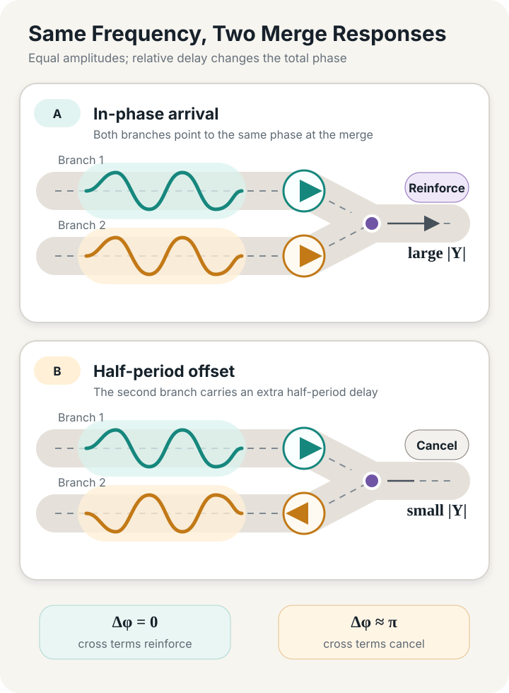
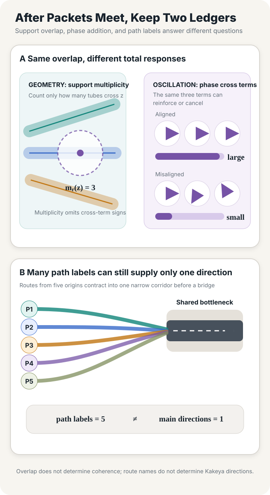

> **Cover note:** This original conceptual image uses miniature roads, localized disturbances, and a transparent spectral plane to show two propagation channels meeting at a merge. It is not experimental data, a real road scene, or a figure from a mathematics paper.

## How Half a Period Changes the Peak at a Merge

Two feeder links meet at a merge. The downstream link still has spare receiving capacity; signal timing, turning ratios, and priority rules remain fixed for now. The average flow on each feeder also stays constant. Each merely carries a small periodic perturbation around its mean: slightly above the mean for a while, then slightly below it, and finally back to the original level.

In the first case, the two perturbations reach the merge at the same time. One rising segment meets the other, so a downstream detector sees a larger peak. In the second, one feeder adds half a period of propagation delay. Its rising segment meets the other feeder's falling segment, and the detector sees little change.

What adds here are **signed small perturbations** around the same equilibrium, not two complete traffic streams imagined as sine waves that can pass through a capacity constraint. Let the linear responses of the two branches at frequency $\omega$ be $A_1(i\omega)$ and $A_2(i\omega)$, with fixed delays $\tau_1$ and $\tau_2$. If both branches receive the same disturbance template $X$, the frequency-domain response at the merge is

$$
Y(i\omega)=
\left[
A_1(i\omega)e^{-i\omega\tau_1}
+A_2(i\omega)e^{-i\omega\tau_2}
\right]X(i\omega).
$$

Both terms inside the brackets have a magnitude and a phase. Their total relative phase is

$$
\Delta\phi
=
\arg A_2(i\omega)-\arg A_1(i\omega)
-\omega(\tau_2-\tau_1).
$$

Even when the magnitudes agree, changing $\Delta\phi$ changes the magnitude of the sum. In the simplest case, $A_1=A_2$: a delay of an integer number of periods puts the terms in phase, while a delay of half a period puts them in opposition. A list of the energy carried by each branch cannot distinguish these two arrival patterns.

*Figure 1. An author-constructed small-signal example: the branch amplitudes are identical, but relative delay changes the output at the merge.*

Nothing in this example requires new mathematics. A complete complex transfer function already preserves phase, and a cross-spectrum can record relative timing between two signals. The example opens a different question. Suppose we want to know not only the final magnitude at the merge, but also where the disturbances begin to overlap, which channels they follow, how far the overlap persists, and whether the same bundle remains after the resolution is coarsened. What object should we preserve then?

## Let the Transfer Function Finish Its Job

For a closed-loop system that has already been linearized and whose topology is fixed, write

$$
\dot z=Az+Bu,
\qquad
y=Cz+Du,
$$

After choosing the input and output and taking the zero-initial-state input response, the transfer matrix is

$$
G(s)=C(sI-A)^{-1}B+D.
$$

Whenever $i\omega$ is outside the spectrum of $A$, setting $s=i\omega$ reveals gain and phase at each temporal frequency. If the question is “By how much is a disturbance at this input port amplified when it reaches that output port?”, this is the natural tool. The controller, vehicle dynamics, and chosen information topology can all enter $A,B,C,D$. An exact pure delay remains as $e^{-s\tau}$, or enters the generator of an appropriate delay system, unless the engineer explicitly substitutes a finite-dimensional approximation. Frequency-domain analysis has not ignored these elements; it has compressed them into an aggregate relation between ports.

Vehicle-platoon string stability already speaks this language. In a linear, unidirectional, scalar cascade, a common frequency-domain condition requires the propagation channel at stage $i$ to satisfy

$$
\sup_{\omega\in\mathbb R}|\Gamma_i(i\omega)|\le 1.
$$

A precise statement must also specify the signal norm, initial conditions, and channels being compared, and must quantify over every vehicle position and every finite platoon length. For multiple-input, multiple-output channels, the corresponding $H_\infty$ norm uses the largest singular value rather than the scalar absolute value. Under stable LTI assumptions, the $H_\infty$ norm connects to induced $L_2$ gain; a communication delay $e^{-i\omega\theta}$ directly changes propagation phase. Ploeg and colleagues formulate their definition and sufficient conditions within exactly these boundaries.[^string-stability]

On a finite directed acyclic network with scalar channels, the response from node $u$ to node $v$ can also be expanded as a sum over paths. For matrix-valued channels, the multiplication order along each path must be preserved:

$$
H_{uv}(i\omega)
=
\sum_{p:u\rightsquigarrow v}
\prod_{e\in p}G_e(i\omega)e^{-i\omega\tau_e}.
$$

Here $G_e$ excludes the pure delay written separately in the formula, so the delay is not counted twice. Each path retains its own complex gain, and the path contributions add at the merge. If the network contains cycles, this finite path sum omits repeated traversals. One must return to a closed-loop resolvent or a network transfer matrix whose well-posedness has been checked. Initial-state responses also have to be added separately; they cannot be smuggled into a transfer function defined for zero initial state.

Classical linear-systems theory can continue to answer “what happened where” by exposing more intermediate nodes as outputs or by computing a spatiotemporal Green function. Whether an analysis should move to a position–frequency description therefore depends on what information the question must retain:

- If only global gain and phase between fixed ports matter, stop at the transfer function.
- To locate a short-lived disturbance, use windowing, a time–frequency representation, wavelets, or a Green function.
- To explain why a localized mode moves in a particular direction, introduce the generator, dispersion relation, and phase space.
- Only after directional separation, multiscale nonconcentration, and packet interactions have been specified is there a reason to pose a decoupling or Kakeya-type problem.

Each additional kind of local structure creates another proof obligation.

## How a System Determines Its Own Frequencies

An FFT of a sensor time series gives coordinates in a sinusoidal basis. It can reveal periods, harmonics, and energy bands, but it does not yet explain why those modes propagate as they do. That second question requires the operator governing the evolution.

In a finite-dimensional LTI system, the closed-loop matrix $A$ plays this role. Its eigensystem, the resolvent

$$
(i\omega I-A)^{-1}
$$

and the input and output projections jointly determine the observed response. The matrix $A$ determines eigenmodes in state space; $B,C,D$ then determine which modes an input can excite, which modes an output can observe, and with what weights. A table of eigenvalues preserves neither of the latter relations.

The first task is therefore to identify which matrix $A$ actually is. The communication graph, control law, and vehicle dynamics jointly determine the closed-loop generator. In Fax and Murray's analysis of linear vehicle formations, Laplacian eigenvalues of the information graph enter a family of single-vehicle closed-loop stability problems. One of their examples even shows that adding an information edge can reduce the stability margin and destabilize the formation.[^formation-spectrum] Frequency response belongs to a specified closed-loop system; it is not a permanent label carried by the data itself.

On a continuous road, the Lighthill–Whitham model supplies a different evolution rule. Let $k(x,t)$ denote macroscopic vehicle concentration and $q(k)$ the flow–concentration relation. The conservation law is

$$
\partial_t k+\partial_x q(k)=0.
$$

The original paper obtains the propagation speed of small changes from the slope $dq/dk$ of the flow–concentration curve, and it explains how continuous kinematic waves can converge into shock waves.[^lwr] If $q$ is differentiable near a constant state $k_0$, write $k=k_0+u$ and retain first-order terms:

$$
\partial_tu+c\partial_xu=0,
\qquad c=q'(k_0).
$$

Only after substituting the plane wave $u=e^{i(\xi x-\omega t)}$ do we obtain this linearized model's own dispersion relation:

$$
\omega=c\xi.
$$

Here $\xi$ is spatial wavenumber and $\omega$ temporal frequency. They are dual coordinates to position and time, not two additional physical dimensions beyond the road. Changing the flux function, equilibrium state, or control law changes the local operator and propagation speed. Changing boundary conditions changes the globally admissible modes and the input–output response, though not necessarily the local quantity $c=q'(k_0)$.

### Queue Stress Test: A Spectrum Without Oscillation

A queueing system supplies a boundary case: a spectrum need not arise from physical oscillation. Consider a controlled finite-buffer, single-server birth–death queue with state $n\in\{0,\ldots,K\}$, arrival rate $\lambda$, and a fixed stationary policy that supplies state-dependent service rates $s(n)>0$. For a state function $f$, the generator is

$$
\begin{aligned}
L^sf(n)=
{}&\lambda\mathbf1_{n<K}[f(n+1)-f(n)]\\
&+s(n)\mathbf1_{n>0}[f(n-1)-f(n)].
\end{aligned}
$$

It generates the Markov semigroup $P_t^sf(n)=\mathbb E_n^s[f(N_t)]$. This spectrum primarily describes relaxation and decay, not “oscillations per second.” To study the cumulative value of a bounded statewise congestion cost $\ell(n)$, one can introduce a real parameter $\theta$ and consider the nonconservative tilted operator

$$
(\mathcal L_\theta^sf)(n)
=
(L^sf)(n)+\theta \ell(n)f(n).
$$

When this finite-state chain is irreducible, the Perron–Frobenius principal real eigenvalue $\Lambda_s(\theta)$ of the tilted matrix gives the long-run exponential moment growth rate of cumulative congestion:

$$
\Lambda_s(\theta)
=
\lim_{T\to\infty}\frac1T
\log\mathbb E_n^s
\exp\!\left(
\theta\int_0^T\ell(N_t)\,dt
\right)
$$

The tilt parameter $\theta$ is still not the temporal frequency of a road wave. Extending this statement to an infinite queue, an unbounded queue-length cost, or pathwise large deviations requires a function space, compactness, and boundary conditions; it does not follow automatically from this finite-matrix formula.[^queue-generator]

These three systems yield three kinds of spectral object: the resolvent of a closed-loop matrix, the dispersion curve of a partial differential operator, and a Markov generator together with its tilted spectrum. They do not share one FFT axis, but their analyses begin from the same question: **Which operator determines how this system is allowed to change?**

For now, this essay borrows one elementary discipline from harmonic analysis: choose modes relative to the natural operator, then study the size of their separated and recombined contributions. Geometric harmonic analysis asks one question more: what shape does a localized mode occupy, and how do those shapes intersect?

*Figure 2. Methods advance with the question. Each level names the new objects it introduces and the conditions that must be established before moving up.*

A global mode still extends across its entire domain. To follow a braking wave or short flow pulse on a continuous road, the next step is to put the mode back in space.

## Put a Mode Back in Space

A sine wave has neither a starting point nor an endpoint. A narrow frequency band specifies an attainable spatial scale, but it does not automatically locate a packet. Localization also requires an amplitude that carries a spatial center, phase, and the needed regularity. Once spatial translation has been encoded in the phase of $a_\alpha$, a one-dimensional illustration for a real, smooth dispersion branch $\omega=\Omega(\xi)$ is

$$
u_\alpha(x,t)=
\int_{\Theta_\alpha}
a_\alpha(\xi)
e^{i(x\xi-t\Omega(\xi))}\,d\xi,
$$

where $\Theta_\alpha$ is a narrow band centered at $\xi_\alpha$. The magnitude and phase of $a_\alpha$, and its distribution over $\Theta_\alpha$, jointly determine the initial envelope. The phases of different frequencies align in a small region, and the packet center moves approximately at the group velocity

$$
v_g=\Omega'(\xi_\alpha)
$$

The quantity $\Omega''$ describes how group velocities at neighboring frequencies separate, so it contributes to packet spreading. This localized unit is produced jointly by the operator and the scale. One cannot first draw an arbitrary traffic route and then christen it a wave packet.

In the wave-packet decompositions used by Hong Wang, a small frequency patch is paired precisely with an elongated support in physical space. For an extension operator over a surface with the required curvature, one works at observation scale $R$, partitions the frequency surface into caps of radius about $R^{-1/2}$, and then localizes each cap in position. Inside $B_R$, the resulting wave packets concentrate on tubes with transverse scale about $R^{1/2}$ and length about $R$.

One cap becomes a family of parallel tubes indexed by spatial center; every packet carries both an oscillation and a tube-shaped support.[^wang-wave-packets] Changing the frequency surface changes its flat directions and curvature, and therefore the shape of the packet as well.[^cone]

Linearized LWR immediately exposes the limit of this transfer:

$$
\Omega(\xi)=c\xi,
\qquad
\Omega''(\xi)=0.
$$

Every frequency has the same group velocity $c$. An ideal linear packet simply translates; curvature does not separate its frequencies. We can still track a localized density pulse and its characteristic line, but that alone does not supply the geometry required by curvature-based decoupling. Higher-order traffic models, second-order models with relaxation, discrete platoons, or delayed controllers may generate different dispersion relations. Each symbol has to be computed from its own model; neither LWR nor the paraboloid can answer on its behalf.

The other end of LWR marks another boundary. When nonlinear characteristics converge, they form a shock and the superposition of linear packets ceases to describe the evolution. Once a merge reaches the receiving capacity of the downstream link, its branches are also coupled through demand, supply, and priority rules.

The Cell Transmission Model writes flow as a piecewise minimum determined jointly by free flow, capacity, and congested supply, and distinguishes several causal states for a merging cell.[^ctm] If the demand rates on the two branches are both $0.7C_d$ while the downstream receiving capacity is only $C_d$, the linearly added $1.4C_d$ does not pass through the merge as a “coherent peak.” The excess $0.4C_d$ becomes an unserved flow rate; over a time step of length $\Delta t$, it increases the queue by approximately $0.4C_d\Delta t$ vehicles and may induce a shock that propagates upstream.

Phase in the opening example can therefore change **when the system reaches its capacity boundary**, but it cannot let physical flow continue to grow linearly beyond capacity. Any traffic wave-packet analysis must state its generator, the validity domain of its linearization, and its stopping conditions together.

## Keep Two Ledgers After Packets Meet

Suppose a model really does allow a disturbance to be written as a sum of localized packets,

$$
u\approx\sum_\alpha u_\alpha.
$$

At a single spacetime point, the total intensity obeys the identity

$$
\left|\sum_\alpha u_\alpha\right|^2
=
\sum_\alpha|u_\alpha|^2
+
\sum_{\alpha\ne\beta}
u_\alpha\overline{u_\beta}.
$$

The first term adds the pointwise squared magnitudes of the packets; the second preserves cross-phase information. Only after integrating over a region does one obtain a mathematical squared $L^2$ norm. Whether that norm represents physical energy depends on the chosen traffic variable and model. Many propagation supports can pass through one region while their cross terms largely cancel. A few packets can instead maintain phase alignment and create a large peak. Counting “how many tubes pass here” and calculating “how their packets superpose” require two different ledgers.

If $T_\alpha^{(r)}$ denotes a candidate propagation tube at scale $r$, its geometric multiplicity can be written

$$
m_r(z)=
\sum_\alpha
\mathbf1_{T_\alpha^{(r)}}(z).
$$

This records only how many supports cover the location $z$. A peak also depends on amplitude, phase, and the chosen norm. An anomaly detector that declares propagation whenever several sensors cross a threshold together will place a local hotspot, a common-source event, and accidental synchrony in the same class.

Hong Wang and Shukun Wu keep separate accounts of the oscillation inside a wave packet and its tube support. Decoupling estimates control the $L^p$ size after the frequency pieces are recombined. A useful upper bound also requires knowing how many wave-packet tubes can meet a local ball. A two-ends Furstenberg-type incidence estimate constrains this geometric multiplicity. The two accounts meet again in the final estimate.[^wang-wu]

Traffic research can first borrow a diagnostic: the evidence for a candidate propagation tube should not be concentrated almost entirely inside one short window. Assign each candidate tube $T_\alpha$ a nonnegative measure $\mu_\alpha$, for example by integrating $|u_\alpha|^2$ over discrete node–time cells or continuous spacetime, and let $L_\alpha$ be the tube's longitudinal length. Before inspecting the data, fix $0<\rho_{\min}<1$, $\eta>0$, and $C_0\ge1$. For every active tube satisfying $\mu_\alpha(T_\alpha)>0$, every $\rho_{\min}\le\rho<1$, and every longitudinal subtube $J\subset T_\alpha$ of length $\rho L_\alpha$ and the same transverse width as $T_\alpha$, require

$$
\mu_\alpha(J)
\le
C_0\rho^\eta
\mu_\alpha(T_\alpha),
$$

Call this a **two-ends-inspired longitudinal nonconcentration diagnostic**. If different network sizes or finer resolutions are compared, $C_0$ and $\eta$ must remain uniform. Enlarging $C_0$ after seeing each dataset destroys the condition's ability to discriminate. This definition is introduced here for the traffic problem. Wang and Wu's two-ends condition instead constrains the effective portion, or shading, of a unit tube that is counted in their estimate, preventing most of it from being packed into one short subtube. “Two ends” does not mean that two literal endpoints must both light up.[^wang-wu]

This diagnostic rules out a common misreading. A disturbance may appear abruptly only near one detector and place almost all its energy in a short window. If many candidate routes pass through that detector, the event may nevertheless be labeled long-range propagation. Seeing a signal at several positions and time windows along a route is not yet enough: the candidate packet passes this check only if the stated proportional bound holds over the stipulated scales. Causality still requires dynamics, temporal order, external inputs, or intervention. A spatial distribution condition cannot supply that evidence.

One threshold remains. Does “many paths” in a traffic network really provide the “many directions” required by Kakeya theory?

*Figure 3. Geometric overlap does not determine oscillatory coherence, and a rich set of path labels does not imply the directional separation required by Kakeya theory.*

## Many Paths Can Still Have Only One Direction

Suppose a bridge is fed by an increasing number of upstream origins and route choices. Every origin–destination path has a different label, and a navigation system can enumerate ever more routes. Yet they all eventually enter the same single-lane bottleneck. Near that bottleneck, the propagation supports remain confined to one narrow corridor and have nearly the same principal direction.

At a fixed spatial resolution, the number of path labels can grow while

$$
\begin{aligned}
\#\{\text{path labels}\}&\longrightarrow\infty,\\
|\text{bottleneck propagation union}|&=O(1).
\end{aligned}
$$

The constant hidden in $O(1)$ may depend on the fixed observation window and spatial resolution, but not on the number of path labels. The label space is rich; the physical directions are not. If every origin–destination label is drawn as a differently colored “tube” and Kakeya incompressibility is then invoked, the analysis has chosen the wrong notion of direction at its first step.

A Kakeya-type problem asks whether a family of thin tubes whose directions are sufficiently separated at a fixed resolution can still be compressed into a very small union. The 2025 preprint by Hong Wang and Joshua Zahl studies straight $\delta$-tubes in three-dimensional Euclidean space and assigns each tube an effective subset, or shading, with a lower density bound. Under explicit finite-scale nonconcentration conditions, they prove that the union of these effective subsets cannot be excessively compressed, and derive that three-dimensional Kakeya sets have full Minkowski and Hausdorff dimension.[^wang-zahl] This does not imply positive Lebesgue measure, and it does not apply directly to a road graph. The precise rectangular-prism and convex-set conditions are recorded in the footnote.

A traffic Kakeya program must first discharge at least five definitional and proof obligations:

1. **Generator.** Which joint operator for physics, control, and communication governs disturbance evolution?
2. **Propagation tube.** How do position, time, speed, direction, and tolerance define a tube, and how large is the packet's error outside it?
3. **Directional separation.** When do two tubes count as different directions? Does the metric come from group velocity, characteristic directions, a path cone on the graph, or a control mode?
4. **Multiscale nonconcentration.** How many fine tubes can occupy any coarse tube, bottleneck region, suitable convex set, or graph analogue?
5. **Functional.** Is the lower-bounded quantity Euclidean volume, node–time count, sensor coverage, or a risk measure? How does it connect to observability or a control objective?

These five items turn an analogy into a provable problem. If any one is missing, the supported conclusion should remain at the level of a transfer function, Green function, localized time–frequency representation, or propagation-cone diagnostic.

Where the opening merge belongs in this hierarchy depends on whether we only estimate its output peak, or also try to establish the local scale and multiscale organization of the propagation family.

For complex traffic flow and queueing control, this sequence supplies a checkable point of entry. The system's generator first determines which modes can be discussed. Wave packets and incidence geometry begin to work only after localization error, propagation shape, directional separation, and multiscale nonconcentration are under control. The system's own structural conditions must pay for every methodological upgrade.

To return to the modeling questions that precede this analysis, see [“From Model to Engineering System”](/en/posts/engineering-model-chain/), [“Inside the Model”](/en/posts/inside-the-model/), and [“How a Model Becomes a Component”](/en/posts/model-as-open-component/). They explain how a model acquires an engineering address, internal semantics, and an open boundary. This essay begins with a dynamical system that has already been specified and connected, and follows the disturbance from there.

---

[^string-stability]: Jeroen Ploeg, Nathan van de Wouw, and Henk Nijmeijer, “[$L_p$ String Stability of Cascaded Systems: Application to Vehicle Platooning](https://research.tue.nl/en/publications/lp-string-stability-of-cascaded-systems-application-to-vehicle-pl/),” *IEEE Transactions on Control Systems Technology* 22(2), 2014, Section II, Eq. (1); Section IV-A, Definition 1; Section IV-B, Eqs. (16)–(23) and Theorem 1; Section V, Eqs. (30)–(32), [DOI: 10.1109/TCST.2013.2258346](https://doi.org/10.1109/TCST.2013.2258346).

[^formation-spectrum]: J. Alexander Fax and Richard M. Murray, “[Information Flow and Cooperative Control of Vehicle Formations](https://authors.library.caltech.edu/records/kh9pq-wj662),” *IEEE Transactions on Automatic Control* 49(9), 2004, Section III, Eqs. (6)–(13), Theorems 3–4 and Example 1; Section V, [DOI: 10.1109/TAC.2004.834433](https://doi.org/10.1109/TAC.2004.834433). The paper studies linear vehicle formations with fixed delays; the spectrum of a communication graph cannot directly replace a physical propagation model for road traffic.

[^lwr]: M. J. Lighthill and G. B. Whitham, “[On Kinematic Waves II: A Theory of Traffic Flow on Long Crowded Roads](https://onlinepubs.trb.org/Onlinepubs/sr/sr79/79-002.pdf),” *Proceedings of the Royal Society A* 229, 1955, Abstract; Section 2, Eqs. (6)–(8); Sections 3–4, [DOI: 10.1098/rspa.1955.0089](https://doi.org/10.1098/rspa.1955.0089). The equations $u_t+cu_x=0$ and $\omega=c\xi$ used in the main text are first-order derivations from the conservation law near a constant state.

[^queue-generator]: Mrinal K. Ghosh and Subhamay Saha, “[Risk-sensitive control of continuous time Markov chains](https://arxiv.org/html/1409.4032v1),” arXiv:1409.4032v1, Section 1, Eqs. (1.1)–(1.3); Raphaël Chetrite and Hugo Touchette, “[Nonequilibrium Markov processes conditioned on large deviations](https://arxiv.org/html/1405.5157v3),” *Annales Henri Poincaré* 16, 2015, Sections II.1–II.3 and III.1–III.2. The main text uses only the specialization to a finite state space, fixed policy, and bounded cost; it does not claim that a principal-eigenvalue formula or a full pathwise large-deviation principle follows automatically for an infinite queue.

[^wang-wave-packets]: Hong Wang and Shukun Wu, “[Restriction estimates using decoupling theorems and two-ends Furstenberg inequalities](https://arxiv.org/html/2411.08871v3),” arXiv:2411.08871v3, 2024, Section 0.1. For a more detailed definition of paraboloid wave packets and estimates for their tails outside the tubes, see Hong Wang, “[A restriction estimate in $\mathbb R^3$ using brooms](https://arxiv.org/abs/1802.04312),” *Analysis & PDE* 13(4), 2020, Section 2.1, Definition 2.1, Eqs. (2.1)–(2.3), and Lemma 2.2.

[^cone]: Larry Guth, Hong Wang, and Ruixiang Zhang, “[A sharp square function estimate for the cone in $\mathbb R^3$](https://arxiv.org/abs/1909.10693),” *Annals of Mathematics* 192(2), 2020, Sections 1.1–1.2. The paper proves the sharp square-function estimate for the cone in three dimensions and derives local smoothing for the wave equation in $2+1$ dimensions. The main text uses only the geometric correspondence between frequency boxes for the cone and planks.

[^ctm]: Carlos F. Daganzo, “[The Cell Transmission Model: Network Traffic](https://escholarship.org/content/qt9pz309w7/qt9pz309w7_noSplash_2634ec43bcb4b8626621535d438de62a.pdf),” California PATH Working Paper UCB-ITS-PWP-94-12, 1994, Section 2.1, p. 3; Section 2.3, p. 5; Section 3.2, pp. 7–9. This source supports the discussion of capacity, demand and supply, and merge active states; it establishes no claim about frequency-domain coherence or Kakeya theory.

[^wang-wu]: Wang and Wu, “[Restriction estimates using decoupling theorems and two-ends Furstenberg inequalities](https://arxiv.org/html/2411.08871v3),” Sections 0.1–0.4, Theorem 0.3, Definitions 1.15, 1.17, 1.20–1.21, and Theorem 2.1. Their two-ends hypothesis is a quantitative nonconcentration condition on tube shadings. The measure condition in the main text is an author-defined traffic diagnostic inspired by it.

[^wang-zahl]: Hong Wang and Joshua Zahl, “[Volume estimates for unions of convex sets, and the Kakeya set conjecture in three dimensions](https://arxiv.org/abs/2502.17655),” arXiv:2502.17655v1, 2025, Theorems 1.1–1.2, Definition 1.3(A), and Corollary 1.10. The finite-scale statement assumes straight tubes, a shading-density condition, and explicit nonconcentration. Theorem 1.2 directly uses rectangular-prism nonconcentration; the paper's broader framework uses a convex-set Wolff condition. Full dimension for three-dimensional Kakeya sets does not imply positive volume.
