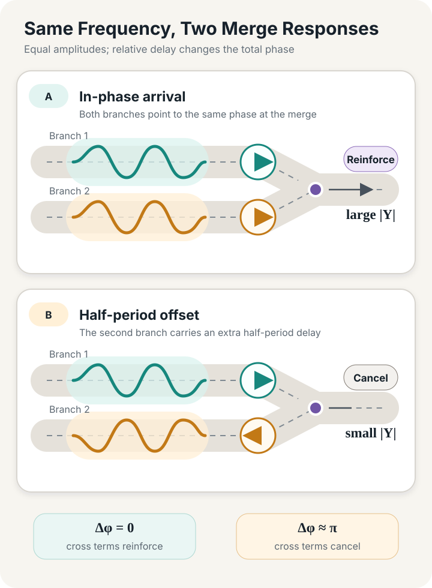
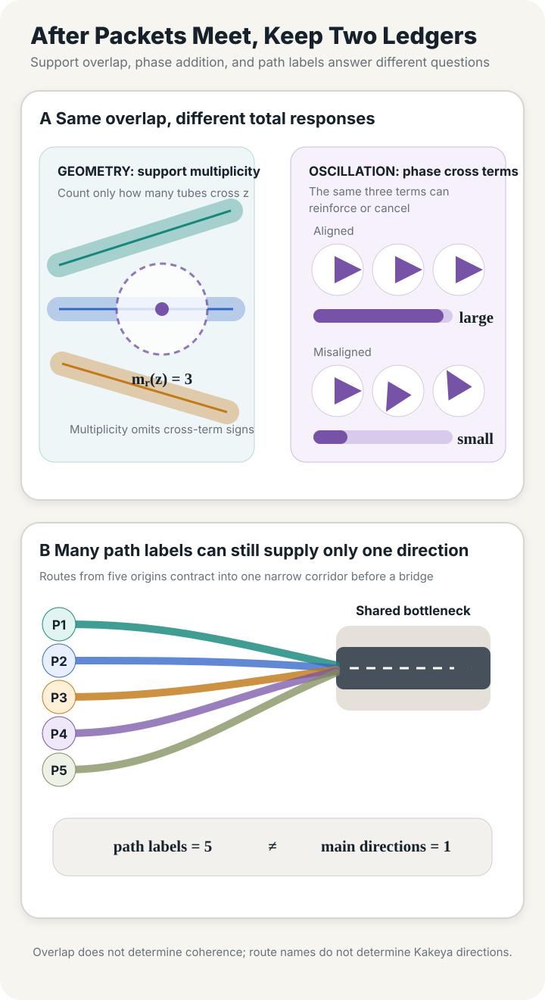

> **Cover note:** This original conceptual image uses miniature roads, localized disturbances, and a transparent spectral plane to show two propagation channels meeting at a merge. It is not experimental data, a real road scene, or a figure from a mathematics paper.

## How Half a Period Changes the Peak at a Merge

Two feeder links meet at a merge, with receiving capacity still available downstream. Throughout the observation window, signal timing, turning ratios, and priority rules remain fixed, as does the average flow on each feeder. We consider only a small periodic change around the mean: flow rises slightly above it, falls slightly below it, and returns to the original level.

First let the two disturbances arrive together. A rising segment meets a rising segment, and the downstream detector sees a higher peak. Now add half a period of propagation delay on one feeder: its rising segment meets the other's falling segment, so the change at the merge becomes small. Each branch retains the same disturbance amplitude; what changes is the arrival timing.

This construction uses a stable linear time-invariant (LTI) small-signal model and a zero-initial-state response. The topology, active branches of the capacity constraints, and control rules remain fixed. The two branches can superpose at the selected output, before saturation, spillback, or switching occurs. The quantities being added are **signed small perturbations** around the same feasible equilibrium: positive means above the equilibrium flow, negative means below it. Complete traffic streams remain subject to capacity constraints.

Let the complex responses at temporal frequency $\omega$ be $A_1(i\omega)$ and $A_2(i\omega)$, with pure delays $\tau_1,\tau_2$ written separately. Each $A_r$ already includes branch transfer, linearized junction coefficients, and phase other than that due to the separately represented pure delay. If both inputs come from the same disturbance template, whose frequency-domain representation is $X(i\omega)$, the frequency-domain output at the merge is

$$
Y(i\omega)=
\left[
A_1(i\omega)e^{-i\omega\tau_1}
+A_2(i\omega)e^{-i\omega\tau_2}
\right]X(i\omega).
$$

Each term inside the brackets retains magnitude and phase. At frequencies where both terms are nonzero, the total phase of the second relative to the first is

$$
\Delta\phi
=
\arg A_2(i\omega)-\arg A_1(i\omega)
-\omega(\tau_2-\tau_1).
$$

Thus, even with equal magnitudes, changing $\Delta\phi$ changes the magnitude of the sum. In the simplest case, $A_1=A_2$ and $\omega\ne0$, a relative delay of an integer number of periods puts the terms in phase; half a period puts them in opposition. Recording only each branch's squared magnitude discards the phase relation that distinguishes these arrival patterns.

*Figure 1. An author-constructed small-signal example: the branch amplitudes are identical, but relative delay changes the output at the merge.*

A complete complex transfer function already explains this construction, and a cross-spectrum can record the relative phase of the two signals. A new difficulty arises when the query changes. We also want to know where the disturbances begin to overlap, which channels they follow, how long the overlap persists, and whether the same bundle of propagation remains identifiable at a coarser resolution. One aggregate output at the merge does not preserve these intermediate relations. We must decide which additional observations or representations will retain them.

## Let the Transfer Function Finish Its Job

First make the opening linear model explicit. For a linearized closed-loop system with fixed topology, $z$ is the state vector, $u$ the selected disturbance input, and $y$ the selected observation output. The corresponding finite-dimensional model is

$$
\dot z=Az+Bu,
\qquad
y=Cz+Du,
$$

The matrix $A$ governs state evolution, $B$ maps inputs into the state, $C$ maps the state to outputs, and $D$ represents direct feedthrough. Taking the Laplace transform of the zero-initial-state response and eliminating the state gives the transfer matrix between ports:

$$
G(s)=C(sI-A)^{-1}B+D.
$$

Whenever $i\omega$ lies outside the spectrum of $A$, setting $s=i\omega$ gives the complex response at that temporal frequency. A scalar channel gives magnitude gain and phase; a matrix channel also retains coupling between different inputs and outputs. If the query concerns propagation gain between fixed ports, this object answers it directly.

The controller, vehicle dynamics, and selected information topology have already entered $A,B,C,D$. Exact pure delays must be retained separately as $e^{-s\tau}$ or incorporated into the generator of an appropriate delay system. Substituting a finite-dimensional matrix requires stating the approximation. The frequency-domain representation aggregates these effects into a port relation. Its adequacy depends on whether the query concerns that relation or intermediate propagation structure.

Vehicle-platoon string stability provides a specific port question: does a disturbance grow as it passes from one stage to the next? In a linear, unidirectional, scalar cascade, let $\Gamma_i$ be the transfer function of the propagation channel at stage $i$. A common frequency-domain condition is

$$
\sup_{\omega\in\mathbb R}|\Gamma_i(i\omega)|\le 1.
$$

The comparison is between the input and output of the selected propagation channel. A string-stability statement must also specify the signal norm, initial conditions, and channels, and require the bound to hold at every vehicle position and for every finite platoon length. For multiple-input, multiple-output channels, the $H_\infty$ norm is defined using the largest singular value. Under stable LTI assumptions, it equals the corresponding induced $L_2$ gain. The communication-delay factor $e^{-i\omega\theta}$ enters the phase of the complex response directly. Ploeg and colleagues fix these objects and quantifiers in their definitions and sufficient conditions, thereby fixing the meaning of the frequency-domain inequality.[^string-stability]

To retain contributions from different internal paths, we can expand the port response further. On a finite directed acyclic network whose edges and junctions have been linearized, the scalar response from node $u$ to node $v$ can be written as a path sum. Matrix-valued channels require preserving the multiplication order along each path:

$$
H_{uv}(i\omega)
=
\sum_{p:u\rightsquigarrow v}
\prod_{e\in p}G_e(i\omega)e^{-i\omega\tau_e}.
$$

Here $G_e$ represents the edge and its assigned linearized junction contribution, excluding the pure delay written separately. Multiplication along a path gives its complex gain; summation over paths gives the merged response. Acyclicity makes the number of paths finite. With feedback cycles, repeated traversals must be handled by a closed-loop resolvent or a network transfer matrix whose well-posedness has been checked. The free response from a nonzero initial state must also be added separately: it and the input-driven transfer response are different contributions.

Intermediate positions can also enter classical linear-systems analysis. Additional observation outputs reveal responses at different nodes, while a spatiotemporal Green function records the response to a localized impulse at each position and time. The choice of method therefore follows the query:

- If only global gain and phase between fixed ports matter, stop at the transfer function.
- To locate a short-lived disturbance, use windowing, a time–frequency representation, wavelets, or a Green function.
- To explain why a localized mode moves in a particular direction, introduce the generator, dispersion relation, and phase space.
- Only once packet localization error, directional separation, the applicable curvature or transversality, multiscale nonconcentration, and packet interactions are specified is there a reason to pose a decoupling or Kakeya-type problem.

These tools retain different objects. A transfer function retains a port map; a localized time–frequency representation retains the position and scale of an event. Propagation analysis must additionally explain why that localized structure continues in a particular direction. This last question brings us back to the operator governing system evolution.

## How a System Determines Its Own Frequencies

An FFT decomposes a sampled sensor time series in a discrete Fourier basis. It can reveal periods, harmonics, and the distribution of spectral energy. Yet the occurrence of a frequency component in a signal and the way the system allows that component to evolve are different questions. The first concerns a decomposition of the record; the second requires the dynamical operator.

A generator describes infinitesimal evolution. In a finite-dimensional LTI model, the closed-loop matrix $A$ generates the free evolution: the semigroup $e^{tA}$ advances the zero-input state. Its eigenstructure and the resolvent

$$
(i\omega I-A)^{-1}
$$

both enter state-response analysis. Eigenstructure describes modes; the resolvent describes the state equation's response to forcing at each temporal frequency. Including $B,C,D$ then determines which state components an input excites, which an output observes, and the direct-feedthrough contribution. An eigenvalue table retains neither the input–output relations nor enough information to describe transient amplification in a nonnormal system.

Choosing a generator therefore requires fixing the closed-loop object first. The communication graph, control law, and vehicle dynamics jointly determine $A$; changing any of them can change the response. In their analysis of linear vehicle formations, Fax and Murray bring information-graph Laplacian eigenvalues into a family of single-vehicle closed-loop stability problems, and give an example where adding an information edge reduces the stability margin and causes instability.[^formation-spectrum] Frequency response for such a system always belongs to specified interconnection and control conditions.

Moving from a platoon to a continuous road changes the type of state and operator. The Lighthill–Whitham model uses macroscopic vehicle concentration $k(x,t)$ as the state, the flow–concentration relation $q(k)$, and the conservation law

$$
\partial_t k+\partial_x q(k)=0.
$$

The original paper uses the slope $dq/dk$ to explain the speed of small changes and analyzes how continuous kinematic waves converge into shocks.[^lwr] To connect this model with the preceding linear perturbation analysis, suppose $q$ is differentiable near a constant state $k_0$, write $k=k_0+u$, and retain only terms first order in $u$:

$$
\partial_tu+c\partial_xu=0,
\qquad c=q'(k_0).
$$

This linear equation specifies which spatial and temporal oscillations fit together. Substituting the plane wave $u=e^{i(\xi x-\omega t)}$ with the stated phase convention gives the dispersion relation

$$
\omega=c\xi.
$$

The dispersion relation connects spatial wavenumber $\xi$ to temporal frequency $\omega$. These dual coordinates of position and time label scales of variation; they add no physical dimensions to the road. Here $c=q'(k_0)$ comes from local linearization. Changing the flux function, equilibrium, or control law can change the local operator and propagation speed. Boundary conditions specify globally admissible modes and input–output responses without necessarily changing the local value of $c$. Position together with its dual wavenumber forms the phase-space coordinates used here: position locates a disturbance, wavenumber labels its local scale of variation, and in multiple dimensions wavenumber also carries direction.

### Queue Stress Test: A Spectrum Without Oscillation

Road-wave dispersion can make it tempting to identify every spectrum with oscillation frequency. A finite queue clarifies the distinction. Consider a controlled finite-buffer, single-server birth–death queue with queue-length state $n\in\{0,\ldots,K\}$, arrival rate $\lambda$, and a fixed stationary policy supplying state-dependent service rates $s(n)>0$. Its generator acts on a state function $f$, describing how arrivals and service change its expectation over a short interval:

$$
\begin{aligned}
L^sf(n)=
{}&\lambda\mathbf1_{n<K}[f(n+1)-f(n)]\\
&+s(n)\mathbf1_{n>0}[f(n-1)-f(n)].
\end{aligned}
$$

The two terms correspond to increasing and decreasing queue length; the indicators restrict jumps to the finite state space. Once the policy is fixed, $L^s$ generates the Markov semigroup $P_t^sf(n)=\mathbb E_n^s[f(N_t)]$, the expected state-function value at time $t$ when the initial queue length is $n$. The generator's spectrum primarily describes relaxation and decay.

If the query changes to the exponential moment of cumulative congestion, the operator must change too. For a bounded statewise cost $\ell(n)$, exponentially weighting the accumulated cost by a real parameter $\theta$ yields the tilted operator

$$
(\mathcal L_\theta^sf)(n)
=
(L^sf)(n)+\theta \ell(n)f(n).
$$

The added diagonal term changes the expectation's weight, so the tilted evolution generally no longer preserves probability mass. For an irreducible finite-state chain, the tilted matrix still has a dominant real eigenvalue: add a sufficiently large scalar multiple of the identity, apply Perron–Frobenius theory, and shift the spectrum back. Denote this principal eigenvalue by $\Lambda_s(\theta)$. It gives the long-run exponential moment growth rate of cumulative congestion from any initial state $n$:

$$
\Lambda_s(\theta)
=
\lim_{T\to\infty}\frac1T
\log\mathbb E_n^s
\exp\!\left(
\theta\int_0^T\ell(N_t)\,dt
\right)
$$

This conclusion concerns a finite state space, an irreducible chain, and a bounded cost. The parameter $\theta$ adjusts the exponential weight of cumulative cost; it has a different meaning from the temporal frequency of a road wave. Infinite queues, unbounded queue-length costs, or full pathwise large deviations additionally require function spaces, compactness, boundary conditions, and spectral conditions.[^queue-generator]

The three examples distinguish the identities of these spectral objects. LTI port response involves a closed-loop matrix's resolvent; road waves involve a partial differential operator's dispersion relation; cumulative queue costs involve the tilted spectrum of a Markov generator. Temporal frequency, spatial wavenumber, spectral value, and tilt parameter each have their own definition. What connects them is an analytical starting point: **identify the evolution object and the query, then select the corresponding operator and spectral representation.**

This provides a reason to introduce harmonic analysis: decompose modes relative to a chosen operator, then estimate their recombined size. Geometric harmonic analysis also retains the shapes occupied by localized modes and asks how their intersections affect superposition estimates. Figure 2 places these questions and the required objects on one methodological map.

*Figure 2. Methods advance with the question. Each level names the new objects it introduces and the conditions that must be established before moving up.*

The road plane wave above connects spatial and temporal frequencies without locating a particular disturbance. To follow a braking wave or a brief flow pulse, we need a localized unit that preserves spectral information and has a position center.

## Put a Mode Back in Space

A single plane wave is spatially nonlocal. Superposing neighboring frequencies can form a localized wave packet with an envelope. Bandwidth constrains the localization scale, but the band itself does not specify position. The spectral amplitude's phase and distribution must supply the center, and the required decay depends on suitable regularity. For a real, smooth dispersion branch $\omega=\Omega(\xi)$, encode spatial translation in the phase of the spectral amplitude $a_\alpha$. A one-dimensional localized packet can then be illustrated as

$$
u_\alpha(x,t)=
\int_{\Theta_\alpha}
a_\alpha(\xi)
e^{i(x\xi-t\Omega(\xi))}\,d\xi,
$$

The set $\Theta_\alpha$ is a narrow band centered at $\xi_\alpha$; the magnitude, phase, and within-band distribution of $a_\alpha$ jointly determine the initial envelope. We can discuss the center's motion because a first-order expansion of $\Omega$ approximates the evolution phase over a narrow band. The corresponding first-order translation speed is the group velocity:

$$
v_g=\Omega'(\xi_\alpha)
$$

This is the packet-center speed in a narrow-band approximation. The error depends on bandwidth, higher-order variation of the dispersion branch, and observation time. The quantity $\Omega''$ describes differences between neighboring frequencies' group velocities and thus contributes to spreading. A packet's propagation channel and tolerance scale must follow from these evolution relations; drawing an arbitrary traffic route as a thin tube does not give it the same properties.

The surface-extension wave-packet decomposition used by Hong Wang provides a rigorous pairing. A surface-extension operator integrates amplitudes on a frequency surface into an oscillatory function in physical space. Under the relevant curvature conditions, the spectral patch and localization scale jointly determine the shape of its main support. At observation scale $R$, partition the frequency surface into caps of radius about $R^{-1/2}$, then localize by spatial center. Inside the observation ball $B_R$ of radius $R$, the resulting packets concentrate on tubes of transverse scale about $R^{1/2}$ and length about $R$.

One frequency cap corresponds to a family of parallel tubes distinguished by spatial center. Each packet retains both oscillation and tube localization, with tails outside the tube that also need estimates.[^wang-wave-packets] This geometry depends on the frequency surface: changing curvature or flat directions changes the main support. The corresponding frequency boxes for the cone, for example, are paired with plate-like objects called planks.[^cone]

Returning to linearized LWR shows why this curvature mechanism cannot be transferred directly:

$$
\Omega(\xi)=c\xi,
\qquad
\Omega''(\xi)=0.
$$

Every frequency has group velocity $c$, so a localized packet translates as a whole in the ideal linear model. It has a position center and characteristic line, but no frequency separation caused by dispersion curvature. A localized pulse therefore supports propagation tracking without supplying the curvature-based decoupling mechanism above. Higher-order traffic models, second-order models with relaxation, discrete platoons, and delayed controllers may exhibit different propagation and decay. Their dispersion relations can be established from their own operator symbols only where spatial Fourier modes or a local-symbol description are available: derivative or shift actions are transformed into frequency-variable relations, from which propagation scales must then be established. If a resulting branch is complex-valued, amplitude decay or growth must also enter the envelope evolution and error estimates; the group-velocity and spreading conclusions for the real branch above cannot be carried over directly.

Flat dispersion limits the geometric mechanism we can borrow; nonlinear change limits the linear description itself. When characteristics of the original conservation law converge into a shock, one must turn to weak solutions and entropy conditions. Once the merge reaches downstream receiving capacity, its branches also couple through demand, supply, and priority rules. The independent-branch superposition of the opening example then ceases to apply.

The Cell Transmission Model represents flow as a piecewise minimum determined by free flow, capacity, and congested supply and distinguishes different constraint states at a merging cell.[^ctm] For example, let each branch demand $0.7C_d$ while downstream receiving capacity is $C_d$. Total demand is $1.4C_d$, but the total flow that can pass is at most $C_d$. If the downstream link receives its full capacity in that step, the excess $0.4C_d$ becomes an unserved flow rate. Over a step of length $\Delta t$, it increases the queue by approximately $0.4C_d\Delta t$ vehicles and may induce an upstream-propagating shock.

Arrival phase can change **when the system reaches its capacity boundary**. Once the capacity constraint changes the active dynamical branch, subsequent responses must be calculated from the new demand–supply relation. Traffic wave-packet analysis must therefore specify its generator, linearization validity domain, and the conditions under which it must move to descriptions of shocks, queues, or control switching.

## Keep Two Ledgers After Packets Meet

Only after localization and error control have been established can a disturbance be approximately decomposed into a finite sum of localized packets:

$$
u\approx\sum_\alpha u_\alpha.
$$

For this finite packet sum itself, the following pointwise identity is exact. Applying it to the original disturbance $u$ still requires estimating the decomposition remainder separately:

$$
\left|\sum_\alpha u_\alpha\right|^2
=
\sum_\alpha|u_\alpha|^2
+
\sum_{\alpha\ne\beta}
u_\alpha\overline{u_\beta}.
$$

The first term on the right records the packets' pointwise squared magnitudes; the second records cross terms between different packets. Relative phase determines their contribution. Integrating over a region turns the pointwise relation into a mathematical squared $L^2$ norm. Whether that norm represents physical energy depends on the traffic variable and the model's interpretation.

Many supports can overlap in one region while their cross terms largely cancel; a few phase-aligned packets can instead produce a large peak. We therefore need separate records of how supports meet and how the packets superpose. The first is a geometric ledger, the second an oscillatory ledger.

Write $T_\alpha^{(r)}$ for a candidate propagation tube at scale $r$, and $z$ for a position in the selected space, such as a spacetime position. Tube multiplicity in the geometric ledger is defined by

$$
m_r(z)=
\sum_\alpha
\mathbf1_{T_\alpha^{(r)}}(z).
$$

Each indicator checks only whether $z$ lies inside a tube; their sum counts coverage. This count records neither amplitude nor phase, and it does not specify the norm used to measure response. Inferring propagation directly from simultaneous threshold crossings at several sensors can therefore conflate a local hotspot, common-source propagation, and accidental synchrony. Simultaneous occurrence is an observed relation; transmission through a dynamical channel is the mechanism that needs explanation.

Wang and Wu's work shows how the two ledgers connect. Decoupling estimates relate the $L^p$ size of recombined frequency pieces to their individual contributions. The refined decoupling estimate they use also takes as input an upper bound on how many tubes meet a specified local ball. Controlling oscillatory superposition thus leaves a tube–ball incidence-counting problem. A two-ends Furstenberg-type estimate controls geometric multiplicity, which then feeds back into the superposition estimate. The ledgers are calculated separately and meet in one conclusion.[^wang-wu]

This geometric analysis also inspires a weaker diagnostic that traffic data can use first: if a tube is interpreted as longitudinal propagation, its evidence should have a testable longitudinal distribution. Assign each candidate tube $T_\alpha$ a finite nonnegative measure $\mu_\alpha$, for example by integrating $|u_\alpha|^2$ over discrete node–time cells or continuous spacetime. Let $L_\alpha$ be its longitudinal length.

Before inspecting the data, fix a scale cutoff $0<\rho_{\min}<1$, an exponent $\eta>0$, and a constant $C_0\ge1$. For every active tube satisfying $\mu_\alpha(T_\alpha)>0$, every $\rho_{\min}\le\rho<1$, and every subtube $J\subset T_\alpha$ with longitudinal length $\rho L_\alpha$ and the same transverse width as the original tube, require

$$
\mu_\alpha(J)
\le
C_0\rho^\eta
\mu_\alpha(T_\alpha),
$$

This is the **two-ends-inspired longitudinal nonconcentration diagnostic** proposed here. It compares the measure in a short subtube with that in the whole tube. At scales where $C_0\rho^\eta<1$, a short window cannot hold all the evidence. If the factor is at least $1$, nonnegativity already guarantees the bound, so that scale supplies no additional discrimination. Constants must be uniform across the candidate tubes. When comparing network sizes or resolutions, parameters and the stipulated scale range must also agree; $C_0$ cannot be increased after inspecting each tube.

The traffic problem determines this definition's objects and quantifiers. Wang and Wu's two-ends condition instead constrains the effective portion, or shading, counted inside a tube, limiting its proportion in subtubes of a prescribed short length. It does not require two literal endpoints to light up. The measure condition over the stipulated scale range introduced here is an inspired diagnostic; it has not inherited the associated incidence theorem.[^wang-wu]

When the parameters discriminate at the relevant short-window scale, this diagnostic can rule out one kind of endpoint hotspot being mistaken for long-range propagation: a disturbance appears only near a detector, almost all its squared magnitude lies in one short window, and many candidate paths happen to cross that location. Signals at a few positions and time windows along a path do not replace the proportional check over every stipulated subtube. Passing the check establishes only longitudinal nonconcentration of the measure. Causal propagation still requires evidence from dynamics, temporal order, external inputs, or intervention.

Longitudinal nonconcentration constrains distribution within a single tube. A tube family needs another geometric structure. Do many traffic paths imply the many directions of a Kakeya-type problem?

*Figure 3. Geometric overlap does not determine oscillatory coherence, and a rich set of path labels does not imply the directional separation required by Kakeya theory.*

## Many Paths Can Still Have Only One Direction

Consider a shared-bottleneck construction. Upstream origins and route choices before a bridge keep increasing. Every origin–destination (OD) path has a different label, and a navigation system can enumerate more routes. Yet all routes eventually enter the same single-lane bottleneck. Near that bottleneck, the propagation supports remain in one narrow corridor with nearly the same principal direction.

At a fixed spatial resolution, increasing path-label count can coexist with

$$
\begin{aligned}
\#\{\text{path labels}\}&\longrightarrow\infty,\\
|\text{bottleneck propagation union}|&=O(1).
\end{aligned}
$$

The constant hidden in $O(1)$ may depend on the fixed observation window and spatial resolution, but not on path-label count. This construction separates two counts: path labels can multiply without increasing the physical directions distinguishable at the bottleneck. Different colors for different OD labels display label differences; they do not satisfy a Kakeya-type estimate's directional conditions.

A Kakeya-type problem relates direction structure to occupied size: at a fixed resolution, can sufficiently separated directions still yield a tiny union of thin tubes? Here direction comes from a Euclidean straight tube's axis, and tube widths and lengths have common scales. The 2025 preprint by Hong Wang and Joshua Zahl studies straight $\delta$-tubes in three-dimensional Euclidean space and assigns each tube an effective subset, or shading, with a lower density bound. Under explicit finite-scale nonconcentration assumptions, they obtain a lower bound for the union of these subsets and derive full Minkowski and Hausdorff dimension for three-dimensional Kakeya sets.[^wang-zahl] Full dimension does not imply positive Lebesgue measure. Nor have the finite-scale theorem's straight-tube, density, and nonconcentration assumptions acquired counterparts on road graphs. The footnote locates the specific rectangular-prism and convex-set conditions.

A traffic Kakeya program must first discharge at least five definitional and proof obligations:

1. **Generator.** Which joint operator for physics, control, and communication governs disturbance evolution?
2. **Propagation tube.** How do position, time, speed, direction, and tolerance define a tube, and how large is the packet's error outside it?
3. **Directional separation.** When do two tubes count as different directions? Does the metric come from group velocity, characteristic directions, a path cone on the graph, or a control mode?
4. **Multiscale nonconcentration.** How many fine tubes can occupy any coarse tube, bottleneck region, suitable convex set, or graph analogue?
5. **Functional.** Is the lower-bounded quantity Euclidean volume, node–time count, sensor coverage, or a risk measure? How does it connect to observability or a control objective?

These obligations connect in sequence. The generator supplies the propagation law; localization estimates establish tubes from it; a direction metric and multiscale nonconcentration constrain the family; only then can one ask what a union lower bound means for an engineering quantity. If a link remains unestablished, conclusions must concern objects already defined and supported: port response, a Green function, a localized time–frequency representation, or a propagation-cone diagnostic.

Returning to the opening example, the output difference between in-phase and opposing arrivals has already been explained by the complex transfer function. Tracking where disturbances meet requires distributed responses or a localized representation. Proving that a propagation family with many directions cannot concentrate in a tiny region additionally requires local scales, directional separation, and multiscale organization.

This gives complex traffic flow and queueing control a concrete research route. Align the query with the semantics of system evolution, identify the local structure that must be retained, then establish what estimates that structure supports. A theoretical tool becomes admissible when the system supplies the connection between the objects, assumptions, and conclusions on which the tool depends.

The six core essays in Models and Engineering discuss [mathematical formulation](/en/posts/mathematical-language-and-problems/), [empirical modeling](/en/posts/from-observation-to-model/), [semantics and observation](/en/posts/inside-the-model/), [model transformations](/en/posts/model-transformations/), [replacement in feedback](/en/posts/model-as-open-component/), and [engineering evidence](/en/posts/engineering-model-chain/). This companion essay develops propagation analysis from an already specified and connected dynamical system.

---

[^string-stability]: Jeroen Ploeg, Nathan van de Wouw, and Henk Nijmeijer, “[$L_p$ String Stability of Cascaded Systems: Application to Vehicle Platooning](https://research.tue.nl/en/publications/lp-string-stability-of-cascaded-systems-application-to-vehicle-pl/),” *IEEE Transactions on Control Systems Technology* 22(2), 2014, Section II, Eq. (1); Section IV-A, Definition 1; Section IV-B, Eqs. (16)–(23) and Theorem 1; Section V, Eqs. (30)–(32), [DOI: 10.1109/TCST.2013.2258346](https://doi.org/10.1109/TCST.2013.2258346).

[^formation-spectrum]: J. Alexander Fax and Richard M. Murray, “[Information Flow and Cooperative Control of Vehicle Formations](https://authors.library.caltech.edu/records/kh9pq-wj662),” *IEEE Transactions on Automatic Control* 49(9), 2004, Section III, Eqs. (6)–(13), Theorems 3–4 and Example 1; Section V, [DOI: 10.1109/TAC.2004.834433](https://doi.org/10.1109/TAC.2004.834433). The paper studies linear vehicle formations with fixed delays; the spectrum of a communication graph cannot directly replace a physical propagation model for road traffic.

[^lwr]: M. J. Lighthill and G. B. Whitham, “[On Kinematic Waves II: A Theory of Traffic Flow on Long Crowded Roads](https://onlinepubs.trb.org/Onlinepubs/sr/sr79/79-002.pdf),” *Proceedings of the Royal Society A* 229, 1955, Abstract; Section 2, Eqs. (6)–(8); Sections 3–4, [DOI: 10.1098/rspa.1955.0089](https://doi.org/10.1098/rspa.1955.0089). The equations $u_t+cu_x=0$ and $\omega=c\xi$ used in the main text are first-order derivations from the conservation law near a constant state.

[^queue-generator]: Mrinal K. Ghosh and Subhamay Saha, “[Risk-sensitive control of continuous time Markov chains](https://arxiv.org/html/1409.4032v1),” arXiv:1409.4032v1, Section 1, Eqs. (1.1)–(1.3); Raphaël Chetrite and Hugo Touchette, “[Nonequilibrium Markov processes conditioned on large deviations](https://arxiv.org/html/1405.5157v3),” *Annales Henri Poincaré* 16, 2015, Sections II.1–II.3 and III.1–III.2. The main text uses only the specialization to a finite state space, fixed policy, and bounded cost; it does not claim that a principal-eigenvalue formula or a full pathwise large-deviation principle follows automatically for an infinite queue.

[^wang-wave-packets]: Hong Wang and Shukun Wu, “[Restriction estimates using decoupling theorems and two-ends Furstenberg inequalities](https://arxiv.org/html/2411.08871v3),” arXiv:2411.08871v3, 2024, Section 0.1. For a more detailed definition of paraboloid wave packets and estimates for their tails outside the tubes, see Hong Wang, “[A restriction estimate in $\mathbb R^3$ using brooms](https://arxiv.org/abs/1802.04312v2),” *Analysis & PDE* 13(4), 2020, Section 2.1, Definition 2.1, Eqs. (2.1)–(2.3), and Lemma 2.2.

[^cone]: Larry Guth, Hong Wang, and Ruixiang Zhang, “[A sharp square function estimate for the cone in $\mathbb R^3$](https://arxiv.org/abs/1909.10693v4),” *Annals of Mathematics* 192(2), 2020, Sections 1.1–1.2. The paper proves the sharp square-function estimate for the cone in three dimensions and derives local smoothing for the wave equation in $2+1$ dimensions. The main text uses only the geometric correspondence between frequency boxes for the cone and planks.

[^ctm]: Carlos F. Daganzo, “[The Cell Transmission Model: Network Traffic](https://escholarship.org/content/qt9pz309w7/qt9pz309w7_noSplash_2634ec43bcb4b8626621535d438de62a.pdf),” California PATH Working Paper UCB-ITS-PWP-94-12, 1994, Section 2.1, p. 3; Section 2.3, p. 5; Section 3.2, pp. 7–9. This source supports the discussion of capacity, demand and supply, and merge active states; it establishes no claim about frequency-domain coherence or Kakeya theory.

[^wang-wu]: Wang and Wu, “[Restriction estimates using decoupling theorems and two-ends Furstenberg inequalities](https://arxiv.org/html/2411.08871v3),” Sections 0.1–0.4, Theorem 0.3, Definitions 1.15, 1.17, 1.20–1.21, and Theorem 2.1. Their two-ends hypothesis is a quantitative nonconcentration condition on tube shadings. The measure condition in the main text is an author-defined traffic diagnostic inspired by it.

[^wang-zahl]: Hong Wang and Joshua Zahl, “[Volume estimates for unions of convex sets, and the Kakeya set conjecture in three dimensions](https://arxiv.org/abs/2502.17655v1),” arXiv:2502.17655v1, 2025, Theorems 1.1–1.2, Definition 1.3(A), and Corollary 1.10. The finite-scale statement assumes straight tubes, a shading-density condition, and explicit nonconcentration. Theorem 1.2 directly uses rectangular-prism nonconcentration; the paper's broader framework uses a convex-set Wolff condition. Full dimension for three-dimensional Kakeya sets does not imply positive volume.
