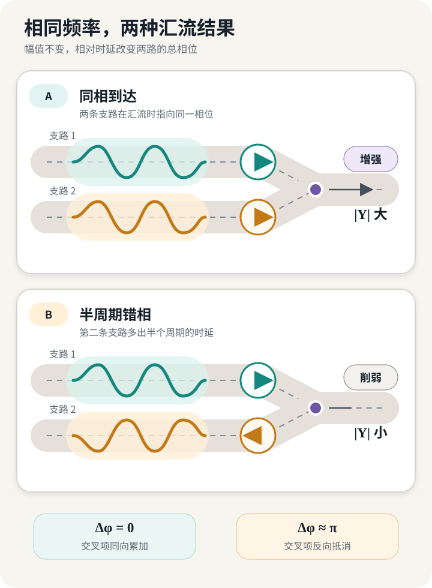
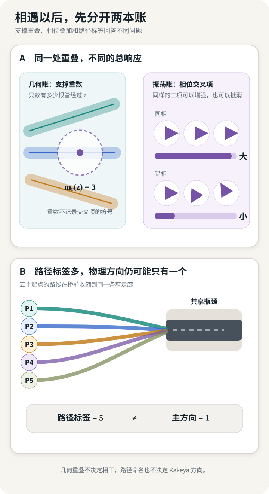

> **封面说明：** 封面为本站原创概念图，以微缩道路、局域扰动和透明谱面表现两条传播通道在汇流处相遇；它不是实验数据、道路实景或数学论文插图。

## 半个周期怎样改变汇流峰值

两条支路在一处汇流。下游仍有余量，信号配时、转向比例和优先规则暂时不变。两条支路的平均流量也不变，只在平均值附近各出现一份很小的周期扰动：一段时间略高，随后略低，然后回到原来的水平。

第一种情形里，两份扰动同时到达汇流口。上升段碰上上升段，下游检测器看到更高的峰；第二种情形里，一条支路多出半个周期的传播时延，上升段恰好碰上另一条支路的下降段，检测器看到的变化反而很小。

这里相加的是相对于同一平衡态的**有符号小扰动**，不是把两股完整车流当成可以穿过容量约束的正弦波。设两条支路在频率 $\omega$ 处的线性响应分别为 $A_1(i\omega)$ 和 $A_2(i\omega)$，固定时延为 $\tau_1,\tau_2$。若两路来自同一扰动模板 $X$，汇流口的频域响应是

$$
Y(i\omega)=
\left[
A_1(i\omega)e^{-i\omega\tau_1}
+A_2(i\omega)e^{-i\omega\tau_2}
\right]X(i\omega).
$$

方括号里的两项都有大小，也都有相位。两项的总相对相位是

$$
\Delta\phi
=
\arg A_2(i\omega)-\arg A_1(i\omega)
-\omega(\tau_2-\tau_1).
$$

即使幅值相同，$\Delta\phi$ 改变，和的大小也会改变。在最简单的 $A_1=A_2$ 情形中，相对时延为整周期时两项同相；相差半周期时两项反相。只列出“每条支路有多少能量”无法区分这两种到达方式。

*图 1　作者构造的小信号示例：支路幅值相同，相对时延改变汇流输出。*

这段算例没有要求新的数学。完整的复传递函数已经保存相位，交叉谱也能记录两路信号的相对时序。它真正打开的是另一个问题：若我们不只问汇流口最后有多大，还想知道扰动在什么位置开始重叠、沿哪条通道传播、在多长的路段上持续、粗化分辨率后是否仍然成束，应该保存什么对象？

## 先让传递函数把它能做的做完

对一个已经线性化、拓扑固定的闭环系统，写成

$$
\dot z=Az+Bu,
\qquad
y=Cz+Du,
$$

选定输入和输出，并取零初值输入响应，传递矩阵为

$$
G(s)=C(sI-A)^{-1}B+D.
$$

在 $i\omega$ 不属于 $A$ 的谱时令 $s=i\omega$，便能逐个时间频率读取增益和相位。只要问题是“这个输入端口上的扰动到达那个输出端口时放大多少”，这就是自然工具。控制器、车辆动力学和选定信息拓扑可以进入 $A,B,C,D$；精确的纯时延则保留为 $e^{-s\tau}$，或进入相应的时延系统生成元，除非工程师另作有限维近似。它们没有被频域分析忽略，只是先被压进了端口之间的整体关系。

车队串稳定性已经在使用这套语法。在线性、单向、标量级联中，常见的频域条件要求第 $i$ 级传播通道满足

$$
\sup_{\omega\in\mathbb R}|\Gamma_i(i\omega)|\le 1.
$$

严格表述还要指定信号范数、初值、被比较的通道，并把量词放到每个车辆位置和任意有限车队长度上。多输入多输出通道要用最大奇异值定义相应的 $H_\infty$ 范数，不能沿用标量绝对值。稳定 LTI 条件下，$H_\infty$ 范数与诱导 $L_2$ 增益相接；通信时延 $e^{-i\omega\theta}$ 会直接改变传播相位。Ploeg 等人的定义和充分条件正是在这样的边界内成立。[^string-stability]

对一张有限有向无环网络，在标量通道下还可以把节点 $u$ 到 $v$ 的响应展开成路径和；矩阵通道则要保持沿路径的乘积次序：

$$
H_{uv}(i\omega)
=
\sum_{p:u\rightsquigarrow v}
\prod_{e\in p}G_e(i\omega)e^{-i\omega\tau_e}.
$$

这里的 $G_e$ 不再包含式中另列的纯时延，避免重复计算。每条路径保留自己的复增益，汇合时再相加。若网络中有环路，这个有限路径和会漏掉反复绕行的贡献；应回到闭环预解式（resolvent）或经过良定性检查的网络传递矩阵。初值响应也要单独加入，不能悄悄塞进零初值的传递函数。

把更多中间节点设为输出，或者直接计算时空 Green 函数，经典线性系统理论还可以继续回答“哪里发生了什么”。因此，是否升级到位置—频率分析，要看问题要求保留哪类信息：

- 只问固定端口间的全局增益与相位，停在传递函数；
- 需要定位一段短时扰动，使用滑动窗、时频图、小波或 Green 函数；
- 需要说明局域模式为什么沿某个方向运动，再进入生成元、色散关系和相空间；
- 只有方向分离、多尺度非集中和包的相互作用都已经定型，才有理由提出解耦或 Kakeya 型问题。

每多保留一类局部结构，就多出一组证明义务。

## 系统怎样决定自己的频率

对一段传感器时间序列做 FFT，会得到它在一组正弦基上的坐标。这个操作能发现周期、谐波和能量带，却还没有回答这些模式为什么会以当前方式传播。要回答后一个问题，需要先找到规定演化的算子。

在有限维 LTI 系统中，这个角色由闭环矩阵 $A$ 承担。它的本征结构、预解式

$$
(i\omega I-A)^{-1}
$$

以及输入输出投影共同决定观测响应。$A$ 决定状态空间中的本征模态；$B,C,D$ 再决定输入能激发哪些模态、输出能观察哪些模态以及相应权重。一张本征值表没有保存后两项关系。

这里首先要确定 $A$ 究竟是哪一个矩阵。通信图、控制律和车辆动力学共同决定闭环生成元。Fax 与 Murray 对线性车辆编队的分析中，信息图的 Laplacian 特征值进入一族单车闭环稳定问题；他们给出的例子甚至表明，增加一条信息边可以降低稳定裕度并造成失稳。[^formation-spectrum] 频率响应因此属于一个已经选定的闭环系统，不是数据自己携带的永久标签。

在连续道路上，Lighthill—Whitham 模型采用另一种生成规则。令 $k(x,t)$ 表示宏观车辆浓度，$q(k)$ 是流量—浓度关系，守恒律写成

$$
\partial_t k+\partial_x q(k)=0.
$$

原论文由流量—浓度曲线的斜率得到小变化的传播速度 $dq/dk$，也说明连续运动学波可以汇聚成冲击波。[^lwr] 若 $q$ 在常值状态 $k_0$ 附近可微，写 $k=k_0+u$ 并保留一阶小量，得到

$$
\partial_tu+c\partial_xu=0,
\qquad c=q'(k_0).
$$

把平面波 $u=e^{i(\xi x-\omega t)}$ 代入，才得到这个线性化模型自己的色散关系：

$$
\omega=c\xi.
$$

这里 $\xi$ 是空间波数，$\omega$ 是时间频率。它们是位置和时间的对偶坐标，不是道路之外又增加了两个实体维度。更换通量函数、平衡态或控制律会改变局部算子和传播速度；更换边界条件则会改变全局允许的模态和输入输出响应，未必改变局部的 $c=q'(k_0)$。

### 队列压力测试：没有振荡也有谱

排队系统给出一个边界例子：谱不必来自物理振荡。考虑一个受控的有限缓冲单服务台出生—死亡队列，状态 $n\in\{0,\ldots,K\}$，到达率为 $\lambda$，固定平稳策略给出状态相关服务率 $s(n)>0$。对状态函数 $f$，生成元是

$$
\begin{aligned}
L^sf(n)=
{}&\lambda\mathbf1_{n<K}[f(n+1)-f(n)]\\
&+s(n)\mathbf1_{n>0}[f(n-1)-f(n)].
\end{aligned}
$$

它产生 Markov 半群 $P_t^sf(n)=\mathbb E_n^s[f(N_t)]$。这里的谱首先描述松弛和衰减，而不是“每秒振动多少次”。若要研究有界的逐状态拥塞代价 $\ell(n)$ 所形成的累计量，可以对实参数 $\theta$ 考察非守恒的倾斜算子

$$
(\mathcal L_\theta^sf)(n)
=
(L^sf)(n)+\theta \ell(n)f(n).
$$

在这条有限状态链不可约时，倾斜矩阵的 Perron–Frobenius 主实特征值 $\Lambda_s(\theta)$ 给出累计拥堵的长期指数矩增长率，具体为：

$$
\Lambda_s(\theta)
=
\lim_{T\to\infty}\frac1T
\log\mathbb E_n^s
\exp\!\left(
\theta\int_0^T\ell(N_t)\,dt
\right)
$$

倾斜参数 $\theta$ 仍不是道路波的时间频率。把无限队列、无界队长代价或路径大偏差接进来，还需要函数空间、紧性和边界条件，不能由这行有限矩阵公式自动获得。[^queue-generator]

三种系统给出三类谱对象：闭环矩阵的预解式、偏微分算子的色散曲线、Markov 生成元及其倾斜谱。它们不共用一条 FFT 横轴，分析却从同一个问题出发：**什么算子规定了当前系统可以怎样变化？**

本文先借用调和分析的一条基本纪律：相对于自然算子选择模式，再研究这些模式分开与重组后的大小。几何调和分析还会问，局域化后的模式占据什么形状，这些形状怎样相交。

*图 2　方法随问题升级；每一层都列出新增对象和进入下一层前必须证明的条件。*

全局模式仍然铺满整个定义域。若要追踪连续道路上的一次刹车波或短时流量脉冲，下一步要把模式重新放回位置。

## 把一个模式放回位置

一个正弦波没有起点和终点。窄频带只规定可达到的空间尺度，不会自动指定包的位置。要形成局域包，还要让振幅携带空间中心、相位和必要的正则性。把空间平移写进 $a_\alpha$ 的相位以后，对一条实且光滑的色散分支 $\omega=\Omega(\xi)$，一维示意可以写成

$$
u_\alpha(x,t)=
\int_{\Theta_\alpha}
a_\alpha(\xi)
e^{i(x\xi-t\Omega(\xi))}\,d\xi,
$$

其中 $\Theta_\alpha$ 是以 $\xi_\alpha$ 为中心的窄频带，$a_\alpha$ 的幅值、相位及其在 $\Theta_\alpha$ 中的分布共同确定初始包络。不同频率的相位在一小片区域内对齐；包中心近似以群速度

$$
v_g=\Omega'(\xi_\alpha)
$$

移动。$\Omega''$ 描述邻近频率的群速度怎样分开，因而参与包的展宽。这个局域单元由算子和尺度共同产生，不能先画一根任意的交通路径，再把它命名为波包。

在王虹使用的波包分解中，频率小片与物理空间的狭长支撑被精确配对。对具有相应曲率的曲面延拓算子，在观察尺度 $R$ 上，先把频率曲面分成半径约 $R^{-1/2}$ 的帽，再对每个帽作位置局域化；所得波包在 $B_R$ 内分别集中于横向尺度约 $R^{1/2}$、长度约 $R$ 的管。

同一个帽按空间中心分成一族平行管，每个波包同时带着振荡和管状支撑。[^wang-wave-packets] 换一张频率曲面，平坦方向和曲率也会改写包的形状。[^cone]

线性化 LWR 立即暴露出这次迁移的边界：

$$
\Omega(\xi)=c\xi,
\qquad
\Omega''(\xi)=0.
$$

所有频率具有相同群速度 $c$。理想线性包只是平移，没有由曲率带来的波包分离。我们仍然可以追踪一个局域密度脉冲及其特征线，却没有因此获得曲率型解耦所需的几何。更高阶交通模型、带松弛项的二阶模型、离散车队或时延控制器可能产生不同色散；必须逐个从自己的符号计算，不能借 LWR 或抛物面的尺度替它们作答。

LWR 的另一端也划出边界。非线性特征线汇聚时会形成冲击，线性包的叠加描述随之中止。合流口达到下游接收能力时，两支路还会通过供需和优先规则耦合。

Cell Transmission Model 把流量写成由自由流、容量和拥堵供给共同决定的分段最小值，并为合流单元区分不同的因果状态。[^ctm] 若两支路的需求率各为 $0.7C_d$，而下游接收能力只有 $C_d$，线性相加得到的 $1.4C_d$ 不会作为一个“相干峰值”穿过路口；超出的 $0.4C_d$ 成为未服务流率，在一个长度为 $\Delta t$ 的时间步内使队列增加约 $0.4C_d\Delta t$ 辆车，并可能诱发向上游传播的冲击。

所以，开篇的相位可以改变系统**何时触碰容量边界**，却不能让物理流量越过容量继续线性放大。因此，一份交通波包分析必须同时写明生成元、线性化有效域和停止条件。

## 相遇以后有两本账

假设某个模型确实允许把扰动写成局域包之和

$$
u\approx\sum_\alpha u_\alpha.
$$

在同一个时空点，整体强度满足恒等式

$$
\left|\sum_\alpha u_\alpha\right|^2
=
\sum_\alpha|u_\alpha|^2
+
\sum_{\alpha\ne\beta}
u_\alpha\overline{u_\beta}.
$$

第一项把各包的点态平方幅值相加，第二项保存交叉相位；对区域再积分以后，才得到数学上的 $L^2$ 平方范数。它是否对应物理能量，要由具体交通变量和模型另行解释。同一个区域里可以经过很多传播支撑，而交叉项大致相消；也可以只有少量包，却因相位长期对齐而产生大峰值。数“有多少条管经过这里”和算“这些包怎样叠加”是两本账。

若把尺度 $r$ 上的候选传播管记作 $T_\alpha^{(r)}$，几何重数可以写成

$$
m_r(z)=
\sum_\alpha
\mathbf1_{T_\alpha^{(r)}}(z).
$$

它只回答位置 $z$ 被多少支撑覆盖。峰值还取决于幅值、相位和所用范数。若异常检测只凭多个传感器同时越界就认定发生了传播，就会把局部热点、同源传播和偶然同步放进同一类。

王虹—吴树昆把波包的振荡与管支撑分开记账。解耦估计控制各频率片重新叠加后的 $L^p$ 大小；要得到可用的上界，还需知道一个局部球最多碰到多少根波包管。two-ends Furstenberg 型入射估计用来约束这项几何重数。两部分在最终估计中重新会合。[^wang-wu]

交通研究可以先借用一个诊断：一根候选传播管的证据，不应几乎全部挤在一个短窗口里。给每条候选传播管 $T_\alpha$ 配置非负测度 $\mu_\alpha$，例如由 $|u_\alpha|^2$ 在离散节点—时间单元或连续时空上的积分产生，并记管的纵向长度为 $L_\alpha$。在观察数据以前预先固定 $0<\rho_{\min}<1$、$\eta>0$ 和 $C_0\ge1$。要求每条满足 $\mu_\alpha(T_\alpha)>0$ 的活跃管、每个 $\rho_{\min}\le\rho<1$，以及每个长度为 $\rho L_\alpha$、横向宽度沿用 $T_\alpha$ 的纵向子管 $J\subset T_\alpha$，都满足

$$
\mu_\alpha(J)
\le
C_0\rho^\eta
\mu_\alpha(T_\alpha),
$$

就把它称为一种**受 two-ends 启发的沿程非集中诊断**。比较不同网络规模或更细分辨率时，$C_0$ 与 $\eta$ 还必须保持统一；事后为每份数据放大 $C_0$ 会使条件失去筛选作用。这一定义由交通问题另行提出。王虹—吴树昆的 two-ends 条件约束单位细管中实际计入估计的有效部分（shading），使其不得大部分挤在一个短子管中；“two ends”并不要求两个字面端点都亮起。[^wang-wu]

这项诊断能排除一类常见误读：某个扰动只在检测器附近突然出现，几乎全部能量落在一个短窗口，却因为许多候选路径都穿过该检测器而被解释成长距离传播。沿路径多个位置和时间窗都看到信号还不够；只有上述比例界在约定尺度内成立，候选包才通过这项检查。因果关系仍需动力学、时间顺序、外部输入或干预来确定；一个空间分布条件不会替这些证据作答。

这些工具仍留下一道门槛：交通网络里的“路径很多”，是否真的提供了 Kakeya 所需的“方向很多”？

*图 3　几何重叠不决定振荡相干；路径标签丰富也不等于 Kakeya 所需的方向分离。*

## 路径多仍可能只有一个方向

设一座桥前有越来越多的上游起点和路线选择。每条 OD 路径的标签都不同，导航系统也可以枚举出更多路线；但它们最终全部进入同一条单车道瓶颈。瓶颈附近的传播支撑仍挤在同一条窄走廊里，主方向几乎相同。

在固定空间分辨率下，随路径标签数增长，可以同时出现

$$
\begin{aligned}
\#\{\text{路径标签}\}&\longrightarrow\infty,\\
|\text{瓶颈附近的物理传播并集}|&=O(1).
\end{aligned}
$$

这里 $O(1)$ 的常数可以依赖固定的观察窗和空间分辨率，却不随路径标签数增长。标签空间很丰富，物理方向没有随之丰富。把每个 OD 标签画成一根不同颜色的“管”，再引用 Kakeya 的不可压缩性，会在第一步就用错方向概念。

Kakeya 型问题关心的是：在固定分辨率下，一族方向充分分离的细管能否仍被压进很小的并集？王虹与 Joshua Zahl 的 2025 年预印本研究欧氏三维中的直 $\delta$-管，并给每根管指定具有密度下界的有效部分（shading）。在明确的有限尺度非聚集条件下，他们证明这些有效部分的并集不能过度压缩，并由此推出三维 Kakeya 集具有完整的 Minkowski 和 Hausdorff 维数。[^wang-zahl] 这个结论既不等于正 Lebesgue 测度，也不直接适用于道路图；矩形棱柱与凸集条件留在脚注中。

一项交通 Kakeya 型研究至少要先完成五项定义与证明义务：

1. **生成元。** 物理、控制与通信的哪一个联合算子规定扰动演化？
2. **传播管。** 位置、时间、速度、方向和容差怎样组成一根管，包在管外的误差多大？
3. **方向分离。** 两条管何时算不同方向？这个度量来自群速度、特征方向、图上的路径锥，还是控制模式？
4. **多尺度非聚集。** 任意粗管、瓶颈区域或合适的凸集与图上区域中，最多能容纳多少细管？
5. **功能量。** 被下界约束的是欧氏体积、节点—时间计数、传感器覆盖还是风险测度？它怎样连接可观测性或控制目标？

这五项把类比变成可证明的问题。缺少任何一项，当前可支持的结论应停在传递函数、Green 函数、局域时频图或传播锥诊断。

开篇汇流口的问题停在哪一层，取决于我们只估计输出峰值，还是还要证明传播族的局域尺度与多尺度组织。

对复杂交通流和队列控制，这条顺序给出一个可检查的研究入口。系统的生成元先确定可讨论的模式；只有在局域化误差、传播形状、方向分离与多尺度非聚集都可控时，波包与入射几何才开始工作。每一次方法升级，都要由系统自身的结构条件支付。

若要回到这套分析之前的模型问题，可分别阅读[《从模型到工程系统》](/posts/engineering-model-chain/)、[《模型内部有什么》](/posts/inside-the-model/)和[《模型怎样成为组件》](/posts/model-as-open-component/)。它们说明模型如何取得工程地址、内部语义和开放边界；本文从一个已经定型并接线的动力系统继续追踪传播。

---

[^string-stability]: Jeroen Ploeg, Nathan van de Wouw and Henk Nijmeijer, “[$L_p$ String Stability of Cascaded Systems: Application to Vehicle Platooning](https://research.tue.nl/en/publications/lp-string-stability-of-cascaded-systems-application-to-vehicle-pl/),” *IEEE Transactions on Control Systems Technology* 22(2), 2014, Section II, Eq. (1); Section IV-A, Definition 1; Section IV-B, Eqs. (16)–(23) and Theorem 1; Section V, Eqs. (30)–(32), [DOI: 10.1109/TCST.2013.2258346](https://doi.org/10.1109/TCST.2013.2258346)。

[^formation-spectrum]: J. Alexander Fax and Richard M. Murray, “[Information Flow and Cooperative Control of Vehicle Formations](https://authors.library.caltech.edu/records/kh9pq-wj662),” *IEEE Transactions on Automatic Control* 49(9), 2004, Section III, Eqs. (6)–(13), Theorems 3–4 and Example 1; Section V, [DOI: 10.1109/TAC.2004.834433](https://doi.org/10.1109/TAC.2004.834433)。论文研究线性车辆编队和固定时延；通信图谱不能直接替代道路交通的物理传播模型。

[^lwr]: M. J. Lighthill and G. B. Whitham, “[On Kinematic Waves II: A Theory of Traffic Flow on Long Crowded Roads](https://onlinepubs.trb.org/Onlinepubs/sr/sr79/79-002.pdf),” *Proceedings of the Royal Society A* 229, 1955, Abstract; Section 2, Eqs. (6)–(8); Sections 3–4, [DOI: 10.1098/rspa.1955.0089](https://doi.org/10.1098/rspa.1955.0089)。$u_t+cu_x=0$ 与 $\omega=c\xi$ 是从其守恒律在常值态附近作的一阶推导。

[^queue-generator]: Mrinal K. Ghosh and Subhamay Saha, “[Risk-sensitive control of continuous time Markov chains](https://arxiv.org/html/1409.4032v1),” arXiv:1409.4032v1, Section 1, Eqs. (1.1)–(1.3)；Raphaël Chetrite and Hugo Touchette, “[Nonequilibrium Markov processes conditioned on large deviations](https://arxiv.org/html/1405.5157v3),” *Annales Henri Poincaré* 16, 2015, Sections II.1–II.3 and III.1–III.2。正文只使用有限状态、固定策略和有界代价的特化，不据此声称无限队列的主特征值或完整路径大偏差自动成立。

[^wang-wave-packets]: Hong Wang and Shukun Wu, “[Restriction estimates using decoupling theorems and two-ends Furstenberg inequalities](https://arxiv.org/html/2411.08871v3),” arXiv:2411.08871v3, 2024, Section 0.1；更细的抛物面波包定义和管外误差见 Hong Wang, “[A restriction estimate in $\mathbb R^3$ using brooms](https://arxiv.org/abs/1802.04312),” *Analysis & PDE* 13(4), 2020, Section 2.1, Definition 2.1, Eqs. (2.1)–(2.3) and Lemma 2.2。

[^cone]: Larry Guth, Hong Wang and Ruixiang Zhang, “[A sharp square function estimate for the cone in $\mathbb R^3$](https://arxiv.org/abs/1909.10693),” *Annals of Mathematics* 192(2), 2020, Sections 1.1–1.2。论文证明三维圆锥的尖锐平方函数估计，并推出 $2+1$ 维波动方程的局部光滑化结论；这里仅使用圆锥频率盒与 plank 的几何对应。

[^ctm]: Carlos F. Daganzo, “[The Cell Transmission Model: Network Traffic](https://escholarship.org/content/qt9pz309w7/qt9pz309w7_noSplash_2634ec43bcb4b8626621535d438de62a.pdf),” California PATH Working Paper UCB-ITS-PWP-94-12, 1994, Section 2.1, p. 3; Section 2.3, p. 5; Section 3.2, pp. 7–9。该来源用于容量、供需和 merge active state；它不建立任何频域相干或 Kakeya 结论。

[^wang-wu]: Wang and Wu, “[Restriction estimates using decoupling theorems and two-ends Furstenberg inequalities](https://arxiv.org/html/2411.08871v3),” Sections 0.1–0.4, Theorem 0.3, Definitions 1.15, 1.17, 1.20–1.21 and Theorem 2.1。论文中的 two-ends 是细管 shading 的定量非集中条件；正文的交通测度式是受其启发的作者定义。

[^wang-zahl]: Hong Wang and Joshua Zahl, “[Volume estimates for unions of convex sets, and the Kakeya set conjecture in three dimensions](https://arxiv.org/abs/2502.17655),” arXiv:2502.17655v1, 2025, Theorems 1.1–1.2, Definition 1.3(A) and Corollary 1.10。有限尺度结论带有明确的直管、shading 密度和非聚集条件；Theorem 1.2 直接使用矩形棱柱非聚集，论文的更广框架使用凸集版 Wolff 条件。三维 Kakeya 全维结论不意味着正体积。
