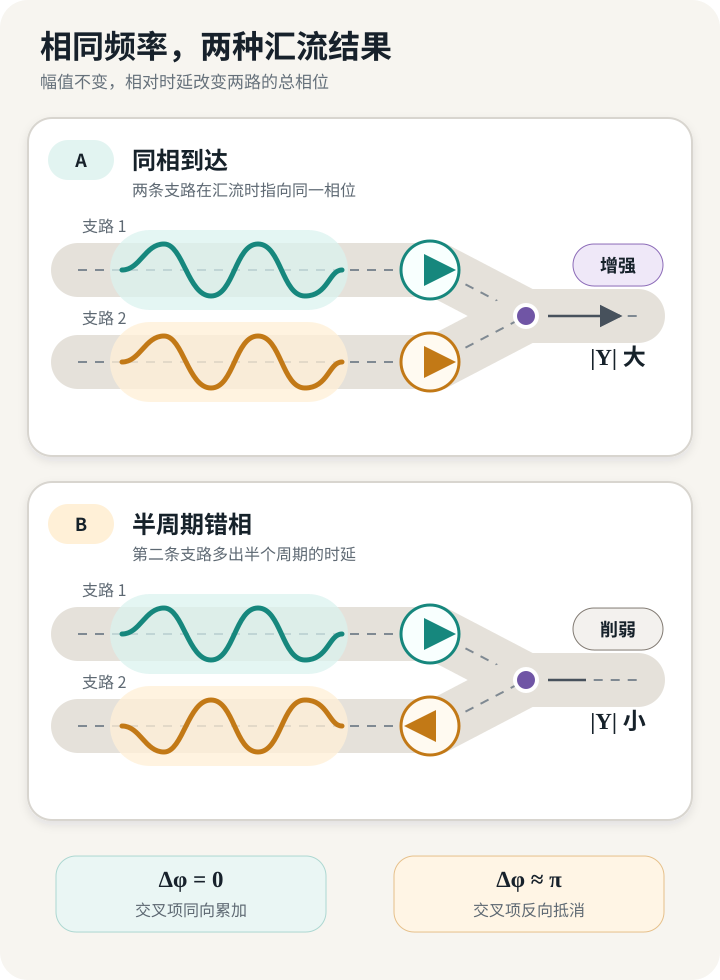
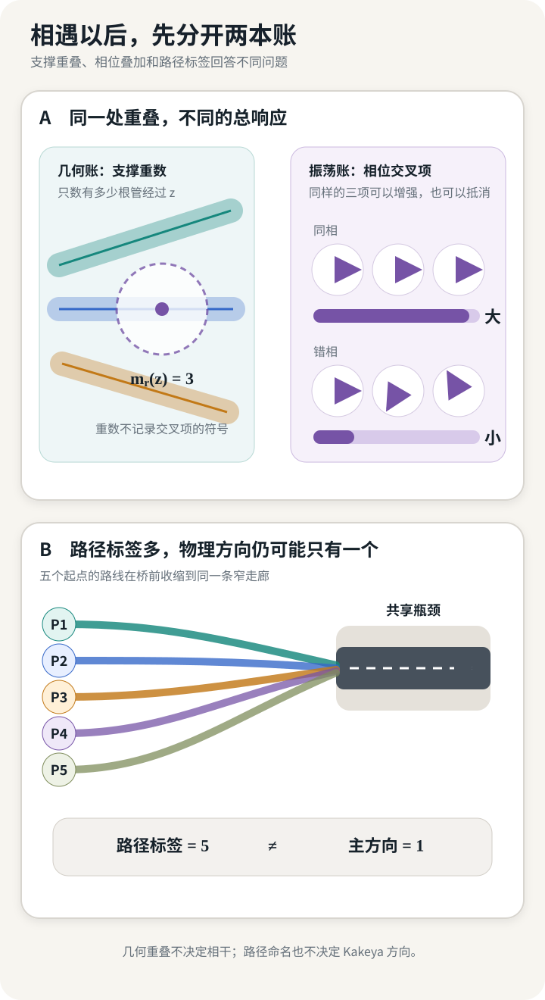

> **封面说明：** 封面为本站原创概念图，以微缩道路、局域扰动和透明谱面表现两条传播通道在汇流处相遇；它不是实验数据、道路实景或数学论文插图。

## 半个周期怎样改变汇流峰值

两条支路在一处汇流，下游尚有接收余量。观察期间，信号配时、转向比例和优先规则保持不变，两条支路的平均流量也不变。我们只考察平均值附近的一小份周期变化：流量一时略高，一时略低，再回到原来的水平。

先让两份扰动同时到达汇流口。上升段与上升段相遇，下游检测器便看到较高的峰。再让一条支路多出半个周期的传播时延：它的上升段恰逢另一条支路的下降段，汇流口的变化便小了。两条支路各自的扰动幅值未变，改变的是到达时序。

这个算例采用稳定的线性时不变（LTI）小信号模型，并取零初值响应。拓扑、容量约束当前起作用的分支和控制规则均固定，两条支路在选定输出处可以线性叠加，尚未触发饱和、回溢或切换。相加的量是相对于同一可行平衡态的**有符号小扰动**：正值表示高于平衡流量，负值表示低于平衡流量；完整车流仍受容量约束。

设两条支路在时间频率 $\omega$ 处的复响应分别为 $A_1(i\omega)$ 和 $A_2(i\omega)$，另列的纯时延为 $\tau_1,\tau_2$。$A_r$ 已包含支路传递、路口线性化系数和非纯时延相位。若两路输入来自同一扰动模板，其频域表示为 $X(i\omega)$，汇流口的频域输出便为

$$
Y(i\omega)=
\left[
A_1(i\omega)e^{-i\omega\tau_1}
+A_2(i\omega)e^{-i\omega\tau_2}
\right]X(i\omega).
$$

方括号中的每一项都保存幅值和相位。在两项均非零的频率处，第二项相对于第一项的总相位差为

$$
\Delta\phi
=
\arg A_2(i\omega)-\arg A_1(i\omega)
-\omega(\tau_2-\tau_1).
$$

因此，即使两项幅值相同，改变 $\Delta\phi$ 也会改变叠加后的幅值。在最简单的 $A_1=A_2$ 且 $\omega\ne0$ 的情形中，相对时延为整周期时两项同相，相差半周期时两项反相。单独记录每条支路的平方幅值，便丢掉了区别这两种到达方式的相位关系。

*图 1　作者构造的小信号示例：支路幅值相同，相对时延改变汇流输出。*

完整的复传递函数已经能解释这段算例，交叉谱也能记录两路信号的相对相位。新的困难出现在查询改变以后：我们还想知道扰动从哪里开始重叠，沿什么通道传播，重叠持续多长，在较粗分辨率下是否仍能辨认出同一束传播结构。汇流口的一个聚合输出不足以保存这些中间关系；接下来要判断，增加哪些观测或表示才能把它们留下。

## 先让传递函数把它能做的做完

先把开篇使用的线性模型写清。对已经线性化、拓扑固定的闭环系统，$z$ 是状态向量，$u$ 是选定的扰动输入，$y$ 是选定的观测输出；相应的有限维模型为

$$
\dot z=Az+Bu,
\qquad
y=Cz+Du,
$$

$A$ 规定状态演化，$B$ 将输入送入状态，$C$ 将状态映到输出，$D$ 表示直接馈通。对零初值响应作 Laplace 变换并消去状态，得到端口间的传递矩阵

$$
G(s)=C(sI-A)^{-1}B+D.
$$

在 $i\omega$ 不属于 $A$ 的谱时，令 $s=i\omega$ 就可读取该时间频率上的复响应。标量通道给出幅值增益与相位；矩阵通道则同时保留不同输入到不同输出的耦合。只要我们关心固定端口间的传播增益，这个对象就直接回答所问。

控制器、车辆动力学和选定的信息拓扑已进入 $A,B,C,D$。精确纯时延应另保留为 $e^{-s\tau}$，或纳入相应的时延系统生成元；若以有限维矩阵替代，便须说明所作近似。频域表示把这些作用汇总到端口关系中，是否足够，取决于所问的是端口响应还是中间传播结构。

车队串稳定性提供了一个明确的端口问题：前一级的扰动传到后一级时是否放大？在线性、单向、标量级联中，记第 $i$ 级传播通道的传递函数为 $\Gamma_i$，常见的频域条件是

$$
\sup_{\omega\in\mathbb R}|\Gamma_i(i\omega)|\le 1.
$$

这里比较的是所选传播通道的输入与输出。要据此陈述串稳定性，还须指定信号范数、初值和通道，并要求相应界对每个车辆位置、任意有限车队长度成立。多输入多输出通道的 $H_\infty$ 范数由最大奇异值定义；在稳定 LTI 条件下，它等于相应的诱导 $L_2$ 增益。通信时延因子 $e^{-i\omega\theta}$ 则直接进入复响应的相位。Ploeg 等人的定义与充分条件将这些对象和量词一并固定，频域不等式的意义也由此确定。[^string-stability]

若要保留网络内部不同路径的贡献，可以进一步展开端口响应。对边与路口均已线性化的有限有向无环网络，在标量通道下，节点 $u$ 到 $v$ 的响应可写成路径和；矩阵通道则须保持沿路径的乘积次序：

$$
H_{uv}(i\omega)
=
\sum_{p:u\rightsquigarrow v}
\prod_{e\in p}G_e(i\omega)e^{-i\omega\tau_e}.
$$

$G_e$ 表示边及其所分配的路口线性化作用，不包含式中另列的纯时延。沿路径相乘，得到这条路径的复增益；对路径求和，得到汇合后的响应。无环条件使路径数有限。若有反馈环，重复绕行的贡献需要由闭环预解式（resolvent）或经过良定性检查的网络传递矩阵处理。非零初值产生的自由响应也须另加，它与输入驱动的传递响应是两项不同的贡献。

中间位置也可以进入经典线性系统分析：增加观测输出，便能读取不同节点的响应；时空 Green 函数则记录局部脉冲输入在各位置、各时刻留下的响应。由此可见，方法的选择需要跟着查询走：

- 只问固定端口间的全局增益与相位，停在传递函数；
- 需要定位一段短时扰动，使用滑动窗、时频图、小波或 Green 函数；
- 需要说明局域模式为什么沿某个方向运动，再进入生成元、色散关系和相空间；
- 只有包的局域化误差、方向分离、适用的曲率或横截性、多尺度非集中与包的相互作用均已明确，才有理由提出解耦或 Kakeya 型问题。

这些工具保留的对象各有侧重。传递函数保留端口映射，局域时频表示保留事件的位置与尺度，而传播分析还须说明这种局域结构为何能沿某个方向接续。后一个问题把我们带回规定系统演化的算子。

## 系统怎样决定自己的频率

对传感器时间序列做 FFT，是将采样信号分解到离散 Fourier 基上。它能显示周期、谐波和谱能量分布。可是，信号中出现某个频率成分，与系统允许这种成分怎样演化，是两个问题。前者来自对记录的分解，后者要由动力学算子回答。

生成元描述演化在无穷小时间内怎样变化。在有限维 LTI 模型中，闭环矩阵 $A$ 是自由演化的生成元，零输入状态由它产生的半群 $e^{tA}$ 推进。它的本征结构以及预解式

$$
(i\omega I-A)^{-1}
$$

共同参与状态响应的分析：本征结构描述模态，预解式描述各时间频率上状态方程对强迫输入的响应。再接上 $B,C,D$，才能确定哪些状态成分被输入激发、被输出观察，以及直接馈通的贡献。一张本征值表既未保存输入输出关系，也不足以刻画非正规系统的瞬态放大。

因此，选取生成元必须先固定闭环对象。通信图、控制律和车辆动力学共同决定 $A$；其中任何一项改变，都可能改变响应。Fax 与 Murray 分析线性车辆编队时，将信息图的 Laplacian 特征值带入一族单车闭环稳定问题，并给出增加信息边反而降低稳定裕度、造成失稳的例子。[^formation-spectrum] 对这类系统讨论频率响应，讨论的总是特定接线与控制条件下的响应。

从车队转向连续道路，状态与算子的类型也随之改变。Lighthill—Whitham 模型以宏观车辆浓度 $k(x,t)$ 为状态，以 $q(k)$ 为流量—浓度关系，采用守恒律

$$
\partial_t k+\partial_x q(k)=0.
$$

原论文用曲线斜率 $dq/dk$ 说明小变化的传播速度，并分析连续运动学波怎样汇聚成冲击波。[^lwr] 为与前面的线性小扰动分析接续，设 $q$ 在常值状态 $k_0$ 附近可微，写 $k=k_0+u$，只保留关于 $u$ 的一阶项，得到

$$
\partial_tu+c\partial_xu=0,
\qquad c=q'(k_0).
$$

这个线性方程规定哪些空间与时间振荡能够配合。采用平面波 $u=e^{i(\xi x-\omega t)}$ 的相位约定，将其代入方程，得到色散关系

$$
\omega=c\xi.
$$

色散关系将空间波数 $\xi$ 与时间频率 $\omega$ 联系起来。二者分别是位置和时间的对偶坐标，用来标记变化的尺度，并未给道路增加实体维度。这里的 $c=q'(k_0)$ 来自局部线性化；更换通量函数、平衡态或控制律，局部算子和传播速度可能随之改变。边界条件则规定全局允许的模态与输入输出响应，未必改变局部的 $c$。位置与其对偶波数合在一起，便组成这里的相空间坐标：位置标记扰动在哪里，波数标记它的局部变化尺度；多维时，波数还带有方向。

### 队列压力测试：没有振荡也有谱

道路上的色散关系容易使人把谱一概理解为振荡频率。有限队列可以澄清这个区别。考虑受控的有限缓冲单服务台出生—死亡队列，队长状态为 $n\in\{0,\ldots,K\}$，到达率为 $\lambda$，固定平稳策略给出状态相关服务率 $s(n)>0$。生成元作用于状态函数 $f$，描述短时间内到达或服务使其期望怎样变化：

$$
\begin{aligned}
L^sf(n)=
{}&\lambda\mathbf1_{n<K}[f(n+1)-f(n)]\\
&+s(n)\mathbf1_{n>0}[f(n-1)-f(n)].
\end{aligned}
$$

两项分别对应队长增加和减少；指示函数将跃迁限制在有限状态空间内。固定策略后，$L^s$ 产生 Markov 半群 $P_t^sf(n)=\mathbb E_n^s[f(N_t)]$，即从初始队长 $n$ 出发，计算时刻 $t$ 的状态函数期望。生成元的谱首先描述松弛与衰减。

如果查询改为累计拥塞的指数矩，就需要改变所分析的算子。给定有界逐状态代价 $\ell(n)$，用实参数 $\theta$ 对累计代价作指数加权，得到倾斜算子

$$
(\mathcal L_\theta^sf)(n)
=
(L^sf)(n)+\theta \ell(n)f(n).
$$

附加的对角项改变了期望的权重，因此倾斜演化一般不再保持概率质量。有限状态链不可约时，倾斜矩阵仍有支配性的实特征值：可给矩阵加上足够大的标量单位阵，应用 Perron–Frobenius 理论，再移回原来的谱。记这一主特征值为 $\Lambda_s(\theta)$，它给出从任意初始状态 $n$ 出发的累计拥塞长期指数矩增长率：

$$
\Lambda_s(\theta)
=
\lim_{T\to\infty}\frac1T
\log\mathbb E_n^s
\exp\!\left(
\theta\int_0^T\ell(N_t)\,dt
\right)
$$

这个结论针对有限状态、不可约链和有界代价。$\theta$ 调节的是累计代价的指数权重，含义与道路波的时间频率不同。若转向无限队列、无界队长代价或完整路径大偏差，还须另行处理函数空间、紧性、边界与谱条件。[^queue-generator]

三个例子使“谱”的身份分明了：LTI 端口响应涉及闭环矩阵的预解式，道路波涉及偏微分算子的色散关系，队列累计代价涉及 Markov 生成元的倾斜谱。时间频率、空间波数、谱值与倾斜参数各有定义。将它们联系起来的，是同一个分析起点：**先确定演化对象与查询，再选择相应的算子和谱表示。**

由此才有理由引入调和分析：相对于选定的算子分解模式，再估计这些模式重组后的大小。几何调和分析进一步保留局域模式所占据的形状，研究形状之间的相交怎样影响叠加估计。图 2 将这些问题与所需对象放在同一张方法地图上。

*图 2　方法随问题升级；每一层都列出新增对象和进入下一层前必须证明的条件。*

上面的道路平面波给出了空间与时间频率的对应，却没有标出某次扰动发生在哪里。要追踪一次刹车波或短时流量脉冲，还需构造既保留谱信息、又有位置中心的局域单元。

## 把一个模式放回位置

单个平面波在空间上并不局域。将邻近频率叠加，可以形成带包络的局域波包；频带宽度约束局域化尺度，但频带本身不指定位置。位置中心还要由谱振幅的相位与分布确定，所需的衰减则依赖相应正则性。对实且光滑的色散分支 $\omega=\Omega(\xi)$，把空间平移写进谱振幅 $a_\alpha$ 的相位，一维局域包可示意为

$$
u_\alpha(x,t)=
\int_{\Theta_\alpha}
a_\alpha(\xi)
e^{i(x\xi-t\Omega(\xi))}\,d\xi,
$$

$\Theta_\alpha$ 是以 $\xi_\alpha$ 为中心的窄频带，$a_\alpha$ 的幅值、相位和频带内分布共同确定初始包络。之所以能讨论包中心的运动，是因为在窄频带内可用 $\Omega$ 的一阶展开近似各频率的演化相位。对应的一阶平移速度称为群速度：

$$
v_g=\Omega'(\xi_\alpha)
$$

这只是窄频带近似下的包中心速度，误差取决于频带宽度、色散分支的高阶变化和观察时间。$\Omega''$ 描述邻近频率的群速度差异，因而参与包的展宽。波包的传播通道与容差尺度要从这些演化关系导出；任意一条交通路径并不会因被画成细管而取得同样的性质。

王虹使用的曲面延拓波包分解给出了一种严格的配对。曲面延拓算子将频率曲面上的振幅积分为物理空间中的振荡函数；在相应曲率条件下，谱片与局域化尺度共同规定其主要支撑的形状。取观察尺度 $R$，先把频率曲面分成半径约 $R^{-1/2}$ 的帽，再按空间中心局域化。在半径为 $R$ 的观察球 $B_R$ 内，所得波包主要集中于横向尺度约 $R^{1/2}$、长度约 $R$ 的管。

同一个频率帽对应一族由空间中心区分的平行管；每个包同时保留振荡与管状局域化，管外还有需要估计的尾部。[^wang-wave-packets] 这套几何依赖频率曲面：曲率或平坦方向改变，主要支撑也会改变。例如圆锥的相应频率盒与板状对象（plank）配对。[^cone]

回到线性化 LWR，便能看出上述曲率机制为何不能直接迁入：

$$
\Omega(\xi)=c\xi,
\qquad
\Omega''(\xi)=0.
$$

所有频率的群速度都等于 $c$，局域包在理想线性模型中整体平移。它确有位置中心和特征线，却没有由色散曲率产生的频率间分离。因此，局域脉冲的存在足以支持传播追踪，还不足以调用上述曲率型解耦机制。更高阶交通模型、带松弛项的二阶模型、离散车队或时延控制器可能有不同的传播与衰减；只有在可用空间 Fourier 模式或局部符号描述时，才能从各自算子的符号建立相应色散关系，即把导数或移位作用转成相应频率变量后的关系，并据此确定传播尺度。若所得分支为复值，还须把幅值的衰减或增长纳入包络演化和误差估计，不能直接沿用上文实分支下的群速度与展宽结论。

平坦色散限制的是可借用的几何机制，非线性变化则限制线性描述本身。当原守恒律的特征线汇聚形成冲击时，需要转向弱解与熵条件。合流口达到下游接收能力后，两条支路也会因供需与优先规则发生耦合，开篇的独立支路叠加便不再适用。

Cell Transmission Model 将流量写成由自由流、容量和拥堵供给共同决定的分段最小值，并区分合流单元的不同约束状态。[^ctm] 例如，两条支路的需求率各为 $0.7C_d$，而下游接收能力为 $C_d$：合计需求为 $1.4C_d$，能够通过的总流率却至多为 $C_d$。若下游在该时间步接收满额，超出的 $0.4C_d$ 就成为未服务流率，在长度为 $\Delta t$ 的时间步内使队列增加约 $0.4C_d\Delta t$ 辆车，并可能诱发向上游传播的冲击。

到达相位可以改变系统**何时触碰容量边界**。一旦容量约束改变了动力学分支，后续响应便要由新的供需关系计算。交通波包分析据此需要同时给出生成元、线性化有效域，以及转入冲击、排队或切换描述的条件。

## 相遇以后有两本账

只有在局域化与误差控制已经成立后，才可将扰动近似分解为有限个局域包之和：

$$
u\approx\sum_\alpha u_\alpha.
$$

对这有限个包之和本身，在同一个时空点有精确恒等式；将它用于原扰动 $u$ 时，分解余项仍须另行估计：

$$
\left|\sum_\alpha u_\alpha\right|^2
=
\sum_\alpha|u_\alpha|^2
+
\sum_{\alpha\ne\beta}
u_\alpha\overline{u_\beta}.
$$

右边第一项记录各包的点态平方幅值，第二项记录不同包之间的交叉项。相对相位决定交叉项的贡献；区域积分才把点态关系转为数学上的 $L^2$ 平方范数。这一范数是否代表物理能量，还取决于交通变量和模型的解释。

同一片区域内，许多支撑可以重叠，而交叉项大致相消；少量包也可能因相位对齐而形成大峰值。因此，需要分别记录支撑怎样相遇、相遇的包怎样叠加。前一本是几何账，后一本是振荡账。

将尺度 $r$ 上的候选传播管记为 $T_\alpha^{(r)}$，以 $z$ 表示所选空间中的位置（例如时空位置），几何账中的管重数定义为

$$
m_r(z)=
\sum_\alpha
\mathbf1_{T_\alpha^{(r)}}(z).
$$

指示函数只检查 $z$ 是否落在某根管内，求和便得到覆盖数。这个数没有记录幅值与相位，也没有指定衡量响应的范数。将多个传感器同时越界直接判作传播，就可能混淆局部热点、同源传播和偶然同步：同时出现是观测关系，沿动力学通道传递才是待解释的机制。

王虹—吴树昆的工作说明这两本账怎样相接。解耦估计将频率片重组后的 $L^p$ 大小与各片贡献联系起来；他们使用的精细解耦估计，还把指定局部球所遇管数的上界作为输入。因而，控制振荡叠加以后，仍有一项管与球的入射计数问题要解。two-ends Furstenberg 型估计提供几何重数控制，再将该控制送回叠加估计。两本账分开计算，却在同一个结论中汇合。[^wang-wu]

这种几何分析也启发了一个较弱、可先用于交通数据的诊断：若一根管被解释为沿程传播，其证据应有可检验的纵向分布。为此，给候选传播管 $T_\alpha$ 配置有限非负测度 $\mu_\alpha$，例如在离散节点—时间单元或连续时空上积分 $|u_\alpha|^2$；以 $L_\alpha$ 表示管的纵向长度。

在观察数据以前，固定尺度下限 $0<\rho_{\min}<1$、指数 $\eta>0$ 和常数 $C_0\ge1$。对每条满足 $\mu_\alpha(T_\alpha)>0$ 的活跃管、每个 $\rho_{\min}\le\rho<1$，以及每个纵向长度为 $\rho L_\alpha$、横向宽度与原管相同的子管 $J\subset T_\alpha$，要求

$$
\mu_\alpha(J)
\le
C_0\rho^\eta
\mu_\alpha(T_\alpha),
$$

这就是本文提出的**受 two-ends 启发的沿程非集中诊断**。它比较短子管承载的测度与整管测度：在 $C_0\rho^\eta<1$ 的尺度上，短窗口不能容纳全部证据；若该因子不小于 $1$，非负测度本来就满足此界，该尺度没有额外筛选力。常数须对全部候选管统一；比较网络规模或分辨率时，参数与约定尺度范围也须一致，不能事后逐管调大 $C_0$。

这一定义的对象和量词由交通问题另行确定。王虹—吴树昆的 two-ends 条件约束细管中计入估计的有效部分（shading），在规定的短子管尺度上限制其所占比例；它不要求两个字面端点都亮起。本文在约定尺度范围内的测度式是受其启发的诊断，尚未继承相应入射定理。[^wang-wu]

当参数在相应短窗尺度上确有筛选力时，这项诊断可以排除端点热点被误作长距离传播的一类情形：扰动只在检测器附近出现，平方幅值几乎全落在一个短窗口，而许多候选路径恰好都经过该处。沿路径若干位置和时窗能看到信号，也不能替代对全部约定子管的比例检查。通过检查只说明测度满足沿程非集中；要建立因果传播，还需动力学、时间顺序、外部输入或干预证据。

沿程非集中约束一根管内部的分布，管族还需要另一种几何结构。交通网络的路径数很多，是否就意味着 Kakeya 问题中的方向数很多？

*图 3　几何重叠不决定振荡相干；路径标签丰富也不等于 Kakeya 所需的方向分离。*

## 路径多仍可能只有一个方向

考虑一个共享瓶颈的构造。桥前的上游起点与路线选择不断增加，每条起讫点（OD）路径都有不同标签，导航系统也能枚举更多路线。所有路线却最终进入同一条单车道瓶颈。只看瓶颈附近，传播支撑仍在同一条窄走廊内，主方向几乎相同。

在固定空间分辨率下，随路径标签数增长，可以同时出现

$$
\begin{aligned}
\#\{\text{路径标签}\}&\longrightarrow\infty,\\
|\text{瓶颈附近的物理传播并集}|&=O(1).
\end{aligned}
$$

$O(1)$ 的常数可依赖固定观察窗和空间分辨率，却不随路径标签数增长。这一构造分开了两个计数：路径标签可以增加，瓶颈处可分辨的物理方向并未增加。以不同颜色表示不同 OD 标签，只能展示标签差异，不能据此满足 Kakeya 型估计的方向条件。

Kakeya 型问题正是把方向结构与占据大小联系起来：在固定分辨率下，方向充分分离的细管能否仍有极小的并集？这里的方向由欧氏直管的轴向确定，管的宽度与长度也有共同尺度。王虹与 Joshua Zahl 的 2025 年预印本研究欧氏三维中的直 $\delta$-管，为每根管指定具有密度下界的有效部分（shading）。在明确的有限尺度非聚集条件下，他们得到有效部分并集的下界，并由此推出三维 Kakeya 集的 Minkowski 和 Hausdorff 维数均为完整维数。[^wang-zahl] 全维结论不推出正 Lebesgue 测度；有限尺度定理的直管、密度与非聚集条件，也尚未在道路图上建立对应。矩形棱柱与凸集条件的具体定位见脚注。

一项交通 Kakeya 型研究至少要先完成五项定义与证明义务：

1. **生成元。** 物理、控制与通信的哪一个联合算子规定扰动演化？
2. **传播管。** 位置、时间、速度、方向和容差怎样组成一根管，包在管外的误差多大？
3. **方向分离。** 两条管何时算不同方向？这个度量来自群速度、特征方向、图上的路径锥，还是控制模式？
4. **多尺度非聚集。** 任意粗管、瓶颈区域或合适的凸集与图上区域中，最多能容纳多少细管？
5. **功能量。** 被下界约束的是欧氏体积、节点—时间计数、传感器覆盖还是风险测度？它怎样连接可观测性或控制目标？

五项义务前后相接：生成元给出传播规律，局域化估计据此建立传播管，方向度量与多尺度非聚集再限定管族，最后才讨论并集下界对工程量意味着什么。任何一环尚未建立，便须在已经定义且有依据的对象上作结，例如端口响应、Green 函数、局域时频图或传播锥诊断。

回看开篇，同相与反相到达造成的输出差异，已经由复传递函数解释。若进一步追踪扰动在哪里相遇，便需分布式响应或局域表示；若还要证明许多方向的传播族不能集中在极小区域，才进入局域尺度、方向分离与多尺度组织的问题。

复杂交通流与队列控制由此取得一条具体的研究路线：先使查询与系统演化的语义相合，再确定需要保留的局部结构，最后证明这些结构能够支持何种估计。理论工具之所以有资格进入，正在于系统自身提供了它所依赖的对象、条件与结论之间的联系。

「模型与工程」六篇核心文章分别讨论[数学表达](/posts/mathematical-language-and-problems/)、[经验建模](/posts/from-observation-to-model/)、[语义与观察](/posts/inside-the-model/)、[模型变换](/posts/model-transformations/)、[反馈中的替换](/posts/model-as-open-component/)和[工程证据](/posts/engineering-model-chain/)。本篇是传播分析的旁篇，从一个已经给定并接线的动力系统继续追踪扰动。

---

[^string-stability]: Jeroen Ploeg, Nathan van de Wouw and Henk Nijmeijer, “[$L_p$ String Stability of Cascaded Systems: Application to Vehicle Platooning](https://research.tue.nl/en/publications/lp-string-stability-of-cascaded-systems-application-to-vehicle-pl/),” *IEEE Transactions on Control Systems Technology* 22(2), 2014, Section II, Eq. (1); Section IV-A, Definition 1; Section IV-B, Eqs. (16)–(23) and Theorem 1; Section V, Eqs. (30)–(32), [DOI: 10.1109/TCST.2013.2258346](https://doi.org/10.1109/TCST.2013.2258346)。

[^formation-spectrum]: J. Alexander Fax and Richard M. Murray, “[Information Flow and Cooperative Control of Vehicle Formations](https://authors.library.caltech.edu/records/kh9pq-wj662),” *IEEE Transactions on Automatic Control* 49(9), 2004, Section III, Eqs. (6)–(13), Theorems 3–4 and Example 1; Section V, [DOI: 10.1109/TAC.2004.834433](https://doi.org/10.1109/TAC.2004.834433)。论文研究线性车辆编队和固定时延；通信图谱不能直接替代道路交通的物理传播模型。

[^lwr]: M. J. Lighthill and G. B. Whitham, “[On Kinematic Waves II: A Theory of Traffic Flow on Long Crowded Roads](https://onlinepubs.trb.org/Onlinepubs/sr/sr79/79-002.pdf),” *Proceedings of the Royal Society A* 229, 1955, Abstract; Section 2, Eqs. (6)–(8); Sections 3–4, [DOI: 10.1098/rspa.1955.0089](https://doi.org/10.1098/rspa.1955.0089)。$u_t+cu_x=0$ 与 $\omega=c\xi$ 是从其守恒律在常值态附近作的一阶推导。

[^queue-generator]: Mrinal K. Ghosh and Subhamay Saha, “[Risk-sensitive control of continuous time Markov chains](https://arxiv.org/html/1409.4032v1),” arXiv:1409.4032v1, Section 1, Eqs. (1.1)–(1.3)；Raphaël Chetrite and Hugo Touchette, “[Nonequilibrium Markov processes conditioned on large deviations](https://arxiv.org/html/1405.5157v3),” *Annales Henri Poincaré* 16, 2015, Sections II.1–II.3 and III.1–III.2。正文只使用有限状态、固定策略和有界代价的特化，不据此声称无限队列的主特征值或完整路径大偏差自动成立。

[^wang-wave-packets]: Hong Wang and Shukun Wu, “[Restriction estimates using decoupling theorems and two-ends Furstenberg inequalities](https://arxiv.org/html/2411.08871v3),” arXiv:2411.08871v3, 2024, Section 0.1；更细的抛物面波包定义和管外误差见 Hong Wang, “[A restriction estimate in $\mathbb R^3$ using brooms](https://arxiv.org/abs/1802.04312v2),” *Analysis & PDE* 13(4), 2020, Section 2.1, Definition 2.1, Eqs. (2.1)–(2.3) and Lemma 2.2。

[^cone]: Larry Guth, Hong Wang and Ruixiang Zhang, “[A sharp square function estimate for the cone in $\mathbb R^3$](https://arxiv.org/abs/1909.10693v4),” *Annals of Mathematics* 192(2), 2020, Sections 1.1–1.2。论文证明三维圆锥的尖锐平方函数估计，并推出 $2+1$ 维波动方程的局部光滑化结论；这里仅使用圆锥频率盒与 plank 的几何对应。

[^ctm]: Carlos F. Daganzo, “[The Cell Transmission Model: Network Traffic](https://escholarship.org/content/qt9pz309w7/qt9pz309w7_noSplash_2634ec43bcb4b8626621535d438de62a.pdf),” California PATH Working Paper UCB-ITS-PWP-94-12, 1994, Section 2.1, p. 3; Section 2.3, p. 5; Section 3.2, pp. 7–9。该来源用于容量、供需和 merge active state；它不建立任何频域相干或 Kakeya 结论。

[^wang-wu]: Wang and Wu, “[Restriction estimates using decoupling theorems and two-ends Furstenberg inequalities](https://arxiv.org/html/2411.08871v3),” Sections 0.1–0.4, Theorem 0.3, Definitions 1.15, 1.17, 1.20–1.21 and Theorem 2.1。论文中的 two-ends 是细管 shading 的定量非集中条件；正文的交通测度式是受其启发的作者定义。

[^wang-zahl]: Hong Wang and Joshua Zahl, “[Volume estimates for unions of convex sets, and the Kakeya set conjecture in three dimensions](https://arxiv.org/abs/2502.17655v1),” arXiv:2502.17655v1, 2025, Theorems 1.1–1.2, Definition 1.3(A) and Corollary 1.10。有限尺度结论带有明确的直管、shading 密度和非聚集条件；Theorem 1.2 直接使用矩形棱柱非聚集，论文的更广框架使用凸集版 Wolff 条件。三维 Kakeya 全维结论不意味着正体积。
