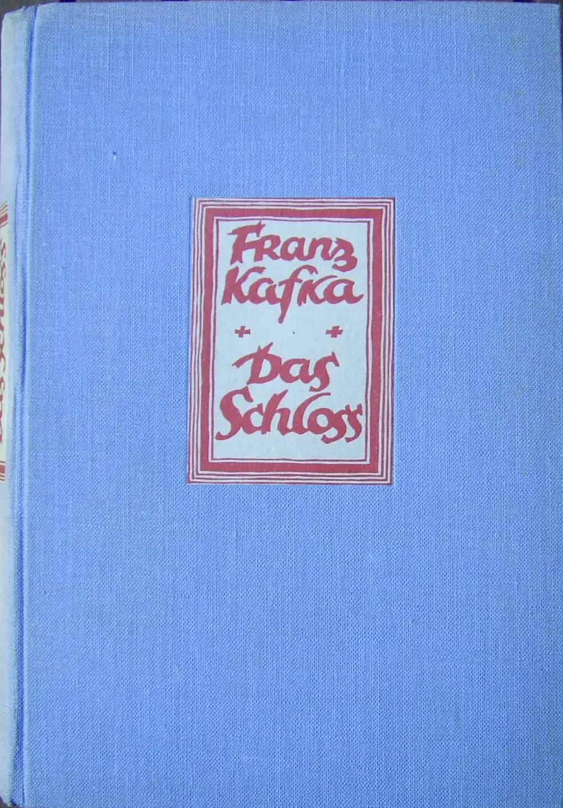
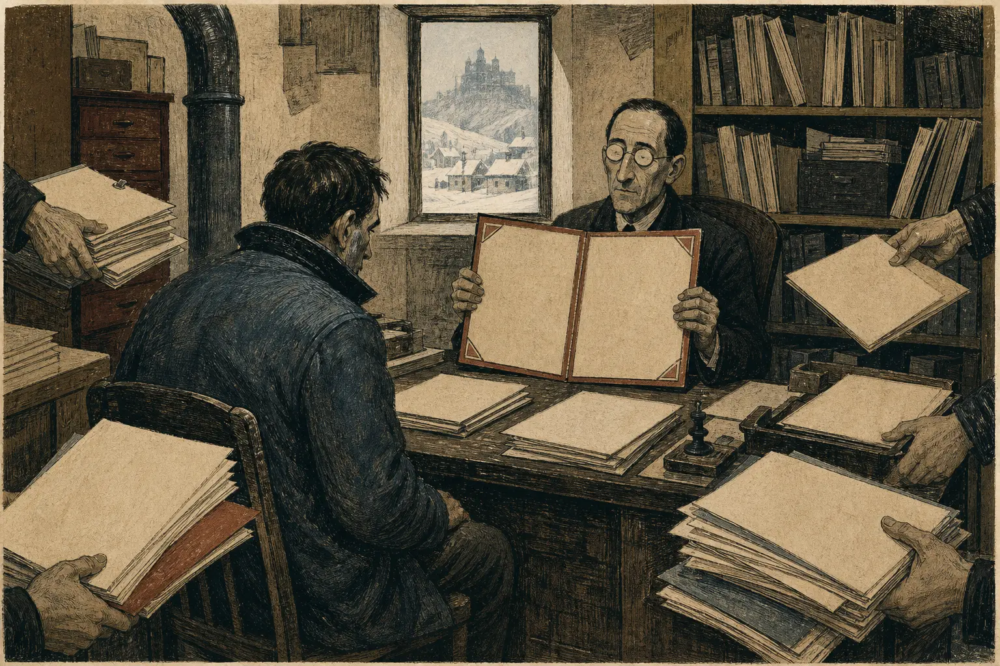
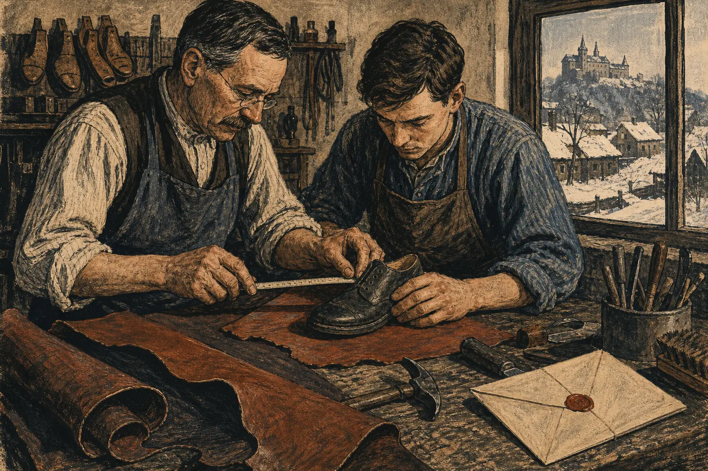

> **文本说明**：本文涉及《儒林外史》《围城》和《城堡》的完整情节。《城堡》的章页按1926年马克斯·布罗德编订版定位，现代校勘本的分章可能不同。

## 榜帖先替范进成了“老爷”

范进抱着一只鸡站在集上。家里已经断炊，母亲让他把鸡卖掉，换些米回来。报录的人就在这时进了村，邻居四处找他，最后把仍不肯相信消息的范进拉回家。家中已经挂起榜帖，他认出自己的名字，几十年应试生涯压在这张纸上突然结算，身体先垮了下来。等他从疯癫中被胡屠户一巴掌打醒，周围的人已经开始按照另一套礼数行动。[^scholars-fan]

胡屠户此前拿女婿当作穷酸，如今不敢轻易碰这位“文曲星”，替他扯平衣襟，又一路低头跟着。张静斋借着师门年谊攀作“世弟兄”，送来银子和房屋。邻里称呼变了，亲缘变了，可以支配的资源也变了。范进尚未写出一篇新文章，没有履行一项官职，榜帖已经给周围人分配了动作。

银子、房屋和屠户的畏惧已经改变了范进可以进入的关系与资源。资格最坚硬的部分就在这些行动里：许多人按照榜帖改变行为，被命名者的现实处境也随之改变。范进心里是否相信自己成了另一个人，不再是榜帖生效的前提。共同体先替他相信了。

榜帖抵达以前，考试已经替知识安排好形状。马二先生谈历代读书人的出路，从春秋的言扬行举、战国游说、汉代贤良方正讲到唐代诗赋和宋代理学，最后落在本朝文章取士。圣贤若活在当朝，也得做制艺，才能进入官场。这个说法朴素得近乎诚恳。马二先生自己久困科场，后来替书坊评卷、编选考文，确实靠阅读和编辑谋生；他的判断却把知识最后送回同一个出口：制度怎样认，读书人便怎样写。[^scholars-ma]

应试训练在这里形成了一种稳定关系。题目由别人给出，答案由获授权者判定，结果被排序保存，奖品位于未来的社会角色。数学证明、实验题和长篇论文都能容纳真实知识与智力，困难由谁提出、失败向谁交代，仍决定训练的方向。当这套回路长期占据主要学习时间和成败反馈入口，为什么是这道题、解答将改变谁的处境、题目本身出了错由谁负责，都不构成得分任务。课程若不给这些追问独立空间，提问权便留在考场外，主体把最强的能动性用在适应题目。

排名又把这种适应转换成个人差异。一次失误原本属于某个时刻，连续记录会把它写成“这个人不擅长什么”；一次高分也容易扩展为对自律、聪明和前途的总体判断。学校、家庭和用人者都能节省重新了解一个人的成本。被评价者则逐渐学会借同一套记录描述自己，连犹疑和转向也要放回分数曲线中解释。

福柯在《规训与惩罚》中把考试放在层级观察与规范判断的交点。考试被编进持续的教学和记录以后，教师不再只在某一刻检验学生做会了一道题。姓名、分数、评语和次序把个人制成可以描述、比较和调用的“个案”。[^foucault-exam] 这个机制帮助我们理解榜帖为何能越出考场。试卷已经收走，评价留下的记录仍可进入婚姻、求职和交往，继续告诉陌生人该怎样对待这个人。

标准化扩大了记录的流通范围。Ronald Dore讨论“文凭病”时抓住了两个相接的制度条件：统一考试使证书获得共同币值，职业官僚制又用普通教育资格筛选一般能力和长期可训练性。他由此区分与特定职业训练相关的资格，以及被组织用来筛选未来成员的普通教育证书。放回这条链，后者携带的很少只是“这个人已经会什么”，还包括“这个人值得被放进哪条职业路线”。[^dore]

资格因此像一笔以未来表现作抵押的信用。张静斋在范进尚未任官时便送来房屋，投资的是举人以后可能取得的权力和关系。现代机构用学历筛选新人时，也不必等候每位申请者先完成岗位任务；证书替组织预先压缩风险。这种压缩降低了大规模筛选的成本，也使一次教育记录携带了远超考场的社会期限。

从2012年到2025年，全国高等教育毛入学率由30%升至61.3%。[^edu-scale] 两个数字只给出制度尺度：资格教育已经成为大规模的常规通道，主体发生率却不能从中读取。一次评价被保存并由机构反复调用，记录便开始跨过考场，占据人的名字。榜帖先回答“范进是谁”，随后又承诺这个名字将通往怎样的生活。过去的成绩由此获得未来时态。

## 从未来寄回来的职位

方鸿渐在欧洲留学数年，没有完成足以交代的学位。回国日期临近，他需要带一项看得见的成果回去，向父亲和已故未婚妻的家族交账，于是买下虚构的克莱登大学博士文凭。那张纸没有增加他的研究，却让“留洋博士”这个角色先抵达了家中。父辈可以展示教育投资的回报，地方社会也有了称呼他的现成名字。[^fortress]

方鸿渐知道文凭虚假，甚至给自己留下一条私人原则，不把它正式写进求职履历。这个距离没有撤销照片、报纸和亲友的行动。称号一旦进入别人手中，社会效力便不再归持证者独自控制。方鸿渐的羞耻说明他没有与角色完全重合；周围人仍能借这项资格预先看见他的体面职业和婚姻位置。

*原创概念插图：文凭先在桌上取得完整外形，持有人仍在镜前整理将要扮演的角色；并非历史档案或小说场景复原。*

《城堡》把同一结构从文凭推到任命。K在深夜抵达村庄，面对驱逐时自称受伯爵召来担任土地测量员。电话先否认村里有测量员，随后又追认先前答复有误。小说始终没有给读者一份足以结束争论的原始合同，行政程序却开始围绕这个角色运转。K也把住宿、工作和进入城堡的要求拴在“测量员”这个名字上。[^castle-role]

角色为他提供的首先是一条时间线。眼下的拒绝可以解释成手续尚未完成，今天的屈辱可以兑换成未来承认，每个掌握关系的人都可能成为下一道入口。K很清楚村庄的程序矛盾百出，仍把大量精力投入证明自己本来就有资格进入。他的反抗要求城堡把角色兑现得更彻底。

*卡夫卡《城堡》1926年初版实物。摄影：Zassen，[CC BY-SA 3.0](https://creativecommons.org/licenses/by-sa/3.0/deed.zh-hans)，经 [Wikimedia Commons](https://commons.wikimedia.org/wiki/File:Franz_Kafka_Das_Schloss.jpg)，转码为 WebP。*

巴纳巴斯承担着更安静的版本。他受过制鞋训练，能够帮父亲完成鞋匠活；奥尔嘉却把恢复家族地位的希望寄托在他的城堡信使身份上。公家允诺的公务衣服迟迟不来，差事的地位和路径也不明确。巴纳巴斯深怀疑虑，阿玛莉亚不赞成、甚至可能轻视这份差事，奥尔嘉仍把他与官员的每次接触读作家族接近城堡的机会。[^castle-barnabas]

奥尔嘉的解释劳动把每次迟延接回未来。公务衣服尚未兑现，当前差事的来源和效力都不稳定，她仍把巴纳巴斯留在官署里的片刻当作接近的证据。一个明确失败会迫使人改变方向，每个空缺得到解释以后，长期悬置反倒允许未来角色持续接管现在。她为确认投入得越多，下一次差事便越难被当作普通差事放下。

职业计划会为一项实践安排时间，未来角色则替整段生活提供意义。两者的差别可以在岗位名称改变时看出来：原先关心的问题是否仍值得追下去，积累的能力能否转入新的位置，还是连自我价值也随称号一起坍塌。奥尔嘉把巴纳巴斯的每次差事都放进家族复起的远景，眼前的鞋匠活因此显得像不得不维持的日常。

在齐泽克借用拉康所作的阐释中，主人能指把浮动能指及其意义暂时缝定，幻想则为欲望提供坐标和场景。[^zizek-signifier] 放回小说，“博士”“测量员”“信使”把成绩、家庭期待和尚未发生的生活接成一条路线。未来角色仿佛已经回头发出指令，告诉今天该牺牲什么、该与谁竞争、该把哪一种劳动看得更高。

一个职业名称也可以承担另一种作用。医生、教师、工程师或编辑的身份若把人带进持续实践，失败会从病人、学生、设备或文本返回，角色便只是责任的起点。K的任命与奥尔嘉投向信使差事的希望缺少这种回返。未来位置越重要，眼前对象越容易被解释成通往位置的临时材料。

这种未来时态也进入了教育治理。教育部关于高校毕业生就业的文件要求把就业状况与招生、培养联动，对就业质量不高的专业实行红黄牌提示，并把职业生涯教育放进培养过程。[^edu-employment] 政策把供需适配设为治理对象，也表明未来岗位已进入专业设置、资源配置和培养安排。

角色先于对象、主体又只能从角色取得认可时，岗位名称既规定成功，也负责解释失败。方鸿渐知道博士证的空洞，K天天和程序争辩，奥尔嘉也反复承认信使差事的含混；文凭、任命和信使差事仍继续组织家中的行动。未来角色尚无任务成果可以自行证实时，它是否成立，只能由考官、榜单、档案或任命确认。主体越依赖未来位置组织生活，就越要持续读取这些载体，确认者也由此取得了终止争论的权限。

## 周进读到第三遍，文章忽然成了“至文”

周进担任考官时读到范进的文章，第一遍不知所云，第二遍才看出一些意思，第三遍终于认定它是“至文”，将范进点中。几十年未获承认的老童生在卷面背后浮现，周进从范进身上读到自己的遭遇。个人同情进入了阅读，考官位置又让这次阅读成为录取事实。[^scholars-fan]

这个场景很难被“有眼光”或“徇私”单独处理。小说没有给我们一套独立标准，可以在考场外替文章终审；周进的补偿冲动也没有取消他反复阅读的认真。第三遍阅读最终结束了争论。周进的考官权限把这次阅读写进榜单，后来的人只需读取结果。

《城堡》把有脸的考官拆成许多办公室。村长向K解释测量员任命的来历：村里早已答复不需要测量员，材料却进了错误部门；相关文件可能仍留在村里，也可能在途中遗失，误收材料的部门最终只收到空卷宗封套。围绕错误的调查又生产出新的公文。没有哪位官员掌握全过程，也没有谁愿意宣布整条程序作废。每个局部只确认自己收到过什么、转交过什么。[^castle-files]

*原创概念插图：任命的错误被拆进文件和办公室，每个经手人只看见自己的部分；并非《城堡》改编剧照。*

这种分散增加了参与者的解释劳动，也扩大了权威。电话里的改口可能来自更高部门，找不到的文件也许已经进入另一次审查，眼前职员的无知可以被理解成知情者位于更深处。程序越难说清，个人越难拿一次矛盾结束它。K和村民只好继续猜测哪一张纸更接近城堡的意图。

程序由此获得一种奇特的可靠性。具体答复可能前后冲突，参与者也会怀疑电话和信件的效力；村民仍按照它们安排住宿、雇用和服从。人们假定某个位置知道得更多，哪怕这个位置在经验中不断后退。周进用考官身份给文章定值，城堡的档案则让判断似乎已经在某处完成，只是尚未传到眼前。

齐泽克所谓“客观信念”描述了这种分离。信念可以存放在仪式、物件和社会行动中，个人的内心保留并不足以终止它。[^zizek-belief] K可以嘲笑程序，村长也可以承认档案混乱；只要他们继续依据任命分配住处、工作和关系，对程序的相信便已经存放在行动里。城堡无须找到一个确信它不会出错的人，这些行动已经维持了任命的效力。

外化还改变了判断者承担判断的方式。周进必须亲手在卷上作出取舍，至少还留下一个可以追问的考官。城堡职员只需援引上一份文件，村长也把自己的决定解释成对行政史的被动承接。判断继续生效，作出判断的人却越来越难以出现。资格持有者遇到的是一连串声称自己没有终审权的中介，辩论因此找不到对手。

周进的卷面至少还允许重读；城堡的每次纠错却会生出更多手续，错误最终成为程序继续工作的理由。

村长讲完整套档案史以后，回到村庄的日常：按他的说法，边界早已标定登记，土地很少转手，少量界争也由村里自己处理，所以不需要测量员。程序已经确认K的位置，土地却没有向他提出工作。

## 克拉姆表扬了一场没有发生的测量

巴纳巴斯后来带来一封被归于克拉姆的第二封信。信中赞许K迄今完成的测量，也肯定助手的表现，催促他把工作坚持下去。K读完便指出，自己从未测量过土地，以后看来也不会做；他又指着所谓助手，让巴纳巴斯自己看他们值什么。村庄没有需求，K没有成果，来自上级的评价却已经抵达。[^castle-praise]

小说没有交代这封信依据了哪些材料。它与任命、助手并置以后，读起来却形成程序自证的效果：先有“测量员”这个角色，再配上助手，监督信已经能从中读出进展，土地却留在循环之外。评价装置终于拥有了自己的对象，那就是它已经生产的记录。

现实对工作有很笨重的检验。测量结果必须和土地对得上，鞋要交给顾客，清扫之后污垢会不会消失。知识劳动的对象更复杂，也会反抗：文本证据否定漂亮的阐释，学生没有理解迫使教师换一种讲法，受到政策影响的人指出模型漏掉的后果。

研究者选择概念，教师安排课程，行动本身也会改变对象怎样显现；检验发生在方法遭遇无法被资格和程序预先消化的抵抗时。证据和受影响者若只能在既定选项里回答，装置听见的仍是自己的语言。

评价帮助组织者在大规模协作中看见工作。学分、评审、项目和绩效记录让许多无法现场观看的活动取得公共形式。当收入、晋升或组织存续依赖这些记录，而对象暴露的失败又不能改写记录，注意力便持续转向可被登记的部分。表格要求一项进度，参与者就生产可填入的进度；评审认可某种履历，机构便不断复制这种履历。异常仍在发生，只是没有权限改写评价。

人文知识的一些失败不像停机或报废那样即时显现，同行意见和语言形式因而承担更多中介工作。反馈虽慢，后果仍在发生。误读会遮住文本中的矛盾，空泛课程会让学生只剩学分，替权力提供漂亮措辞的研究也会改变公众能够说什么。知识分子若把同行承认当作最终验收，便能在文字持续生产时失去与这些后果的联系。

马二先生编选考文的劳动可以说明这种闭合怎样进入知识生产。他读卷、批注、出版，书坊也把书交到真实读者手里。产品的主要用途却是教下一批考生如何让同一套评价规则认出自己。知识没有停止生产，生产围着资格认证转了一圈，最后回来加固认证。阅读时间、训练任务和奖励随之围绕阅卷者的口味重新排列。

这种循环会制造大量可见成果。选本越成熟，考生越能稳定复现规则；录取者再进入阅卷和教学位置，又用自己的成功经验确认选本有效。制度不必伪造每一项结果，只需让成功者掌握下一轮成功的定义。工作真实、产品畅销、参与者也可能十分勤勉，评价和对象仍会一步步分离。

K后来接受学校杂役的职位。一个清晨，学生和教师已经挤在房内，他扫地、换水，弗丽达擦洗地面。村长原本用这个岗位安置并约束一个麻烦的外来者，校舍的维护仍把他们带到具体的灰尘、污水和使用者面前。这些东西不会承认测量员身份，也不读取克拉姆的信。K确实承担了一些有对象的工作，只是始终把它视为等待正式承认期间的降格。[^castle-school]

克拉姆的表扬信在文件之间取得证实，这次清扫却要接受校舍里灰尘和污水的检验。只允许内部记录决定成败的程序，则让角色在工作对象缺席时继续获得认可。

当受影响者的反馈无法抵达一个迫使众人共同重判的地址，责任会沿两类链条散开。组织可以把行动切成表格、上级与局部职责，市场和邻里中的参与者也会各自回应眼前风险与他人预期。受损者遭遇完整后果，行动者只看见自己的一个环节。《城堡》用阿玛莉亚一家展示第二类链条，《儒林外史》则给出一条更短的行政链。

## 没有判决，阿玛莉亚一家已经受罚

按照奥尔嘉向K讲述的家族史，城堡官员索尔蒂尼曾用粗俗而带威胁的信召见阿玛莉亚。她撕掉信件，拒绝前往旅店，也没有补做任何表示服从的仪式。没有正式调查，也没有判决，日常生活里的制裁已经开始。[^castle-amalia]

顾客取回送修的靴子，订单簿上的项目逐行划销；帮工布伦瑞克离开并自立门户，朋友和熟人迅速疏远，消防协会也作出辞退父亲、收回证书的决定。亲属后来还有暗中接济，这点联系托不住已经失去的收入、名誉和社会关系。父亲四处请求宽恕，办公室却说公开案卷里没有控告，他又指不出一项正式处分，因此没有什么可以宽恕或撤销。

城堡在这段故事里很少亲自行动。索尔蒂尼寄出召见信，此后的效力主要由村民完成。奥尔嘉把众人的退缩概括为恐惧，却找不到一项把这些动作统一起来的命令。这个家庭承担的后果仍然如此完整，仿佛一份从未存在的判决已经被执行。

这些动作可以由相互预期连起来。只要村民预期别人会疏远这家人，单独维持往来便显得危险；已经发生的退缩又会被后来者读成“事情有了定论”。每个人观察别人，再把别人的行动当作城堡意志的证据。奥尔嘉没有讲出一个明确的传播次序，惩罚仍可能沿着这种预期扩散，让中心保持缺席。

顾客可以继续把靴子留给父亲修，也可以取走；帮工可以留下，也可以把风险交还给雇主；消防协会的决策者没有判案，却用辞退和撤回证书加入了惩罚。行动者的自由程度和所知信息各不相同，责任不能平均分摊，差异也没有把他们从因果链上抹去。

《儒林外史》第四回给出职责链。张静斋建议汤知县严惩由教亲推来求情、并送上牛肉的老师夫，汤知县作出处置，衙役执行枷号，受刑者最终死亡。范进在场时主要纠正张静斋谈错的科举名次。建议、命令、执行和旁观各有不同重量，人命后果却由这些动作连续造成。把死亡全算在范进身上会歪曲情节，让他对现实痛苦的迟钝退出责任分析同样轻松。[^scholars-punishment]

Dennis Thompson把公共组织中许多人以不同方式参与同一决定或结果、个人贡献因而难以辨认的情形称作“许多只手的问题”。归责需要追踪每个人的因果贡献、知情状况与受强迫程度。[^thompson] 这三条线索也能区分小说里的局部行动：索尔蒂尼发出召见，顾客切断收入，消防协会的决策者制造公共污名，邻居拒绝时要承担的代价又各不相同。把他们并成“村庄”，等于替这些差异再做一次遮蔽。

无案卷处分还夺走了受罚者组织事实的能力。父亲无法指出一项决定、一个日期或一位签字人，办公室便把他的损失拆回私人交易和邻里关系。权力把后果留在生活里，把决定从记录中抽走。受害者知道惩罚存在，却难以把分散遭遇变成一项可以公开质问的共同事实。

角色在此提供了一套缩小视野的语言。职员只核对公开案卷，消防协会把辞退写成内部决定；顾客取回靴子，帮工离开雇主。前一类动作藏在职责边界后面，后一类动作藏在私人选择后面，两条链都把受害者的反驳留在局部行动之间。阿玛莉亚一家缺少一个让这些人同时面对后果的场所。

一项公共惩罚没有被任何人承认为公共决定，便会以环境的样子出现。村民只看见继续来往的风险，父亲只看见每扇窗口的拒绝。环境似乎没有作者，也就很难成为可以共同争议的规则。对于身处其中的人，最可行的行动往往变成保护自己的入口。

## K看见权力问题，又回到自己的入口

K刚听奥尔嘉说到那封召见信，便把索尔蒂尼的举动概括成一种可能威胁所有人的权力滥用。此时，他尚未听到村民如何疏远这家人，也不知道父亲后来怎样在各办公室之间请求宽恕。公共问题先在一封信上显形：官员的私人要求可以借城堡位置取得全村都懂得畏惧的分量。[^castle-k-turn]

奥尔嘉继续解释阿玛莉亚和索尔蒂尼，又把阿玛莉亚与弗丽达相比较。K随后承认，事情在他眼里的形象已经改变；住所、职位、工作、婚姻、村民资格和克拉姆关系重新回到中心。他没有停止听取家族史，也继续追问细节，衡量这些细节的轴心却已经变了：阿玛莉亚是巴纳巴斯的妹妹，巴纳巴斯又可能替他接近克拉姆。

K一直在行动。他和村长争辩，拒绝莫穆斯的笔录，在雪地里等克拉姆，利用住宿、婚姻和信使关系寻找突破口。他甚至比许多村民更清楚程序的荒谬。旺盛的行动力始终围绕一组所有格运转：我的任命、我的权利、我的入口。看穿制度没有让他离开这组坐标，只让他更熟练地在里面移动。

当决定找不到作者、申诉也找不到地址，申请材料便成为个人唯一能够直接改动的表面。招生名额、劳动制度和城市边界无法由一名申请者改写，他能做的是再考一次、换一个专业、补一张证书、进入另一家机构。资源分配只以既定门槛抵达个人，集体质疑的入口又缺席或代价过高时，能动性便集中到准入与流动。

退出取代发声，路线经验又成为主要传承内容时，个体适应便会累积成环境的稳固。成功者告诉后来者哪张证书更值钱、怎样避开风险，共同条件则更少进入讨论。下一批人看到的是一条已经被他人验证过的路线，也更有理由把改变自身当作可行的行动。

模型的目标、假设和误差承担若不开放质疑，个人接收到的便只有最后一道门槛。专业设置交给供需测算，招聘以风险控制设下门槛，组织处分落成流程结果；谁设定目标、谁承担误差，被移到模型和表格背后。个人最后拿到的只剩一份材料清单。

教育资源由谁分配，哪些劳动被承认，谁承担组织决策的损失，本来都涉及共同规则。当这些问题抵达个人，只呈现为专业是否热门、材料是否合格、哪条路线更稳时，政治冷感便发生在这次翻译中。一个人可以对排名、招聘和晋升极度敏感，同时对制定这些标准的权力保持距离。公共问题被处理成信息和规划，政治于是缩到个人履历的尺寸。

连续考试、精确搜集信息和高度自律同样可以承载政治冷感，也会训练出对组织微观政治的敏锐：谁掌握名额，哪个部门能签字，怎样让履历被看见。

职业选择、迁移和考试承担着生计，也能与公共行动并行；角色依附则把世界固定成一组既定条件，主体的全部努力都用于改善自己在条件中的位置。K曾把索尔蒂尼的召见理解成普遍的权力问题，奥尔嘉的叙述推进以后，他又按住所、职位、婚姻和克拉姆关系重排了这段历史，把行动收束为路线计算。

个人路线还会带来道德上的清洁感。顾客只处理交易，职员只核对案卷，申请者只修改材料；没有谁自认制定了规则，后果便被送回组织和市场。政治退回规划以后，主体无须公开支持制度，也无须为制度持续运作承担判断，找到更好的位置成了最可验证的成功。

K早已知道电话不可靠、档案会遗失、上级会评价不存在的工作。这份知识没有给他一个角色之外的实践，也没有给村民一个共同处理惩罚的场所。链条若要中断，现实必须重新获得反驳资格，参与者也要能够把分散的后果送回共同判断。

## 一双鞋把信使留在家里

巴纳巴斯来送另一封被归于克拉姆的信时，K追问此前托他转交给克拉姆的私人口信。巴纳巴斯说，在K托付口信后的第二天，他没有去城堡，因为父亲鞋匠活太多，需要他帮忙。K对此十分不满。在他的排序里，接近克拉姆的口信高于父亲的手艺活。小说把两种时间安排压在这次谈话里：一边通向来源和效力都不稳定的城堡消息，另一边要把鞋匠手里的活做完。[^castle-barnabas]

鞋活没有提供城堡的荣耀。从鞋匠劳动本身看，一份订单迟早要遭遇皮料、尺寸和后续使用，制作者不能只靠称号完成它。对象在这条回路里保留了发言权。信使差事迟迟没有公务衣服和明确权利，奥尔嘉仍把每次模糊接触解释成接近承认的一步。

*原创概念插图：信使职位可以悬置，皮料、尺寸和使用却要求眼前的手艺作出回答；并非《城堡》改编剧照。*

K与弗丽达清扫学校时也进入过这种回路。学生和教师已经挤在房内，K扫地、换水，弗丽达擦洗地面；谁做了什么，灰尘和污水怎样处理，都能被看见。分工没有天然消解责任，低地位工作也不缺少生产结构。K把校役劳动当作暂时降格，说明对象反馈只能纠正一项工作，未必足以重新组织一个人的欲望。

阿玛莉亚则保住了自己的判断。她撕掉召见信，不肯用形式服从换取安全。全家随之遭到孤立，这个代价使个人拒绝的边界变得清楚：它能暴露权力对众人配合的依赖，建不成申诉程序，也无法迫使顾客和邻里共同承担风险。

这些动作没有形成共同改写规则的力量。《城堡》给出了实践和拒绝，没有给出一个成熟的政治共同体。把孤立者的代价包装成现成答案，只会再让一个角色替我们完成判断。

鞋活做坏了，订单会出问题；文本经不起反例，学位也不能替作者补出内容。对象能够推翻最初的资格，仍回答不了谁选择订单、谁制定课程、失败成本落到谁身上。K把校舍扫得再干净，也改变不了阿玛莉亚无法申诉的处境。她的拒绝暴露了秩序依靠谁执行，村民随后完成的孤立又说明：缺少共同承担时，旁观者会从拒绝的代价里学会更谨慎地保护自己的位置。

资格可以保存一段训练，进入实践以后却要接受文本、学生、顾客和受影响者的复审。学位说明作者受过训练，职称记录同行曾经作出的判断，下一篇文章仍可能被一个反例推翻。知识只在项目、评审和引用之间循环时，作者可以十分忙碌，世界却失去了迫使他撤回结论的入口。

一双不合尺寸的鞋，顾客可以指出它在哪里失败；阿玛莉亚的父亲却指不出一项决定、一个日期或一位签字人。复杂分工仍要留下责任地址，使受影响者能够申诉，也使每个环节的完成无法终止对总体后果的追问。冲突回到这样的共同地址，参与者才有机会修改规则，而非只剩更换赛道。

范进家中挂起的榜帖保存了一次录取判断，写不完他往后的文章，也决定不了他怎样对待亲人和治下的人。胡屠户、张静斋和乡邻把榜帖活成社会现实，后来行动仍能撤回它的终审权。

巴纳巴斯手里的城堡信可以被奥尔嘉反复解释，每一次延迟都能再许诺一个未来。任何一份鞋匠订单迟早撞上皮料、尺寸和使用；城堡程序替不了这次验收，也无法把它无限延期。

[^scholars-fan]: 吴敬梓：《[儒林外史·第三回](https://zh.wikisource.org/wiki/儒林外史/第03回)》。范进中举、社会关系变化及周进反复阅卷均见本回。
[^scholars-ma]: 吴敬梓：《[儒林外史·第十三回](https://zh.wikisource.org/wiki/儒林外史/第13回)》，马二先生论举业及其评选、出版考文的活动。
[^foucault-exam]: Michel Foucault, *Discipline and Punish*, trans. Alan Sheridan (Vintage), Part III, ch. 2, “The Examination,” pp. 184–194。版本信息见 [Penguin Random House](https://www.penguinrandomhouse.com/books/55026/discipline-and-punish-by-michel-foucault-and-alan-sheridan/)。
[^dore]: Ronald Dore, “[The Diploma Disease Revisited](https://doi.org/10.1111/j.1759-5436.1980.mp11002009.x),” *IDS Bulletin* 11, no. 2 (1980): 55–61；[开放原文](https://www.ids.ac.uk/files/dmfile/Dore11.2final.pdf)。
[^edu-scale]: 中华人民共和国教育部：《[2012年全国教育事业发展统计公报](https://www.moe.gov.cn/srcsite/A03/s180/moe_633/201308/t20130816_155798.html)》，2013年8月16日；《[2025年全国教育事业发展统计公报](https://hudong.moe.gov.cn/jyb_sjzl/sjzl_fztjgb/202607/t20260706_1442870.html)》，2026年7月6日。
[^fortress]: 钱锺书《围城》中方鸿渐购买假博士文凭及其社会身份功能，情节定位参见 Derong Cao, “[Academic Barbarism Reconsidered: The Satire of the University in *Fortress Besieged*](https://doi.org/10.1080/25723618.2020.1781385),” *Chinese Literature and Thought Today* (2020)，该文使用上海三联书店2002年版。正文只作情节转述。
[^castle-role]: Franz Kafka, *Das Schloß*, 1926 Max Brod edition, [ch. 1](https://de.wikisource.org/wiki/Das_Schlo%C3%9F/Das_erste_Kapitel), pp. 4–8, 28；[ch. 2](https://de.wikisource.org/wiki/Das_Schlo%C3%9F/Das_zweite_Kapitel), pp. 33–35。K的测量员身份由他申明，随后得到行政程序的含混追认。
[^castle-barnabas]: Kafka, *Das Schloß*, 1926 Brod ed., [ch. 10](https://de.wikisource.org/wiki/Das_Schlo%C3%9F/Das_zehnte_Kapitel), pp. 233–234；[ch. 15](https://de.wikisource.org/wiki/Das_Schlo%C3%9F/Das_f%C3%BCnfzehnte_Kapitel), pp. 330–348。巴纳巴斯家族史主要由奥尔嘉向K转述。
[^zizek-signifier]: Slavoj Žižek, *The Sublime Object of Ideology*, 2nd ed. (Verso, 2009), ch. 3, pp. 87–129，关于缝合点／主人能指和幻想如何组织意义与欲望；版本信息见 [Verso](https://www.versobooks.com/products/1284-the-sublime-object-of-ideology)。
[^edu-employment]: 中华人民共和国教育部：《[教育部关于做好2025届全国普通高校毕业生就业创业工作的通知](https://hudong.moe.gov.cn/srcsite/A15/s3265/202411/t20241112_1162526.html)》，教就业〔2024〕5号，2024年11月11日。
[^castle-files]: Kafka, *Das Schloß*, 1926 Brod ed., [ch. 5](https://de.wikisource.org/wiki/Das_Schlo%C3%9F/Das_f%C3%BCnfte_Kapitel), pp. 113–134。村长关于测量需求、错投部门、空卷宗封套与档案程序的叙述见此。
[^zizek-belief]: Žižek, *The Sublime Object of Ideology*, ch. 1, pp. 31–45，关于信念寄存在外部实践和物件中的论述；ch. 5, pp. 185–191，关于被假定相信、知道或享受的主体。
[^castle-praise]: Kafka, *Das Schloß*, 1926 Brod ed., [ch. 10](https://de.wikisource.org/wiki/Das_Schlo%C3%9F/Das_zehnte_Kapitel), pp. 229–237。巴纳巴斯带来一封被归于克拉姆的信，信中表扬测量进度，K随后说明自己未进行测量。
[^castle-school]: Kafka, *Das Schloß*, 1926 Brod ed., [ch. 7](https://de.wikisource.org/wiki/Das_Schlo%C3%9F/Das_siebente_Kapitel), pp. 176–186，村长提出校役职位；[ch. 12](https://de.wikisource.org/wiki/Das_Schlo%C3%9F/Das_zw%C3%B6lfte_Kapitel), pp. 249–261，学生和教师已在房内，K扫地、换水，弗丽达擦洗地面。
[^castle-amalia]: Kafka, *Das Schloß*, 1926 Brod ed., [ch. 15](https://de.wikisource.org/wiki/Das_Schlo%C3%9F/Das_f%C3%BCnfzehnte_Kapitel), pp. 368–410。阿玛莉亚家族史由奥尔嘉转述；顾客取回送修靴子、帮工离开、消防协会辞退父亲及父亲请求宽恕无门均见此。
[^castle-k-turn]: Kafka, *Das Schloß*, 1926 Brod ed., [ch. 15](https://de.wikisource.org/wiki/Das_Schlo%C3%9F/Das_f%C3%BCnfzehnte_Kapitel), pp. 370–383。K先把索尔蒂尼的召见概括为普遍的权力问题，随后在奥尔嘉继续叙述时重新把住所、职位、婚姻与克拉姆关系放回中心。
[^scholars-punishment]: 吴敬梓：《[儒林外史·第四回](https://zh.wikisource.org/wiki/儒林外史/第04回)》。张静斋建议、汤知县处置及由教亲推来求情并送牛肉的老师夫受刑死亡见本回。
[^thompson]: Dennis F. Thompson, “[Moral Responsibility of Public Officials: The Problem of Many Hands](https://doi.org/10.2307/1954312),” *American Political Science Review* 74, no. 4 (1980): 905–916；[Cambridge书目与摘要](https://www.cambridge.org/core/journals/american-political-science-review/article/abs/moral-responsibility-of-public-officials-the-problem-of-many-hands/39DD3FAB7BF7DC7A242407143674F22B)。
