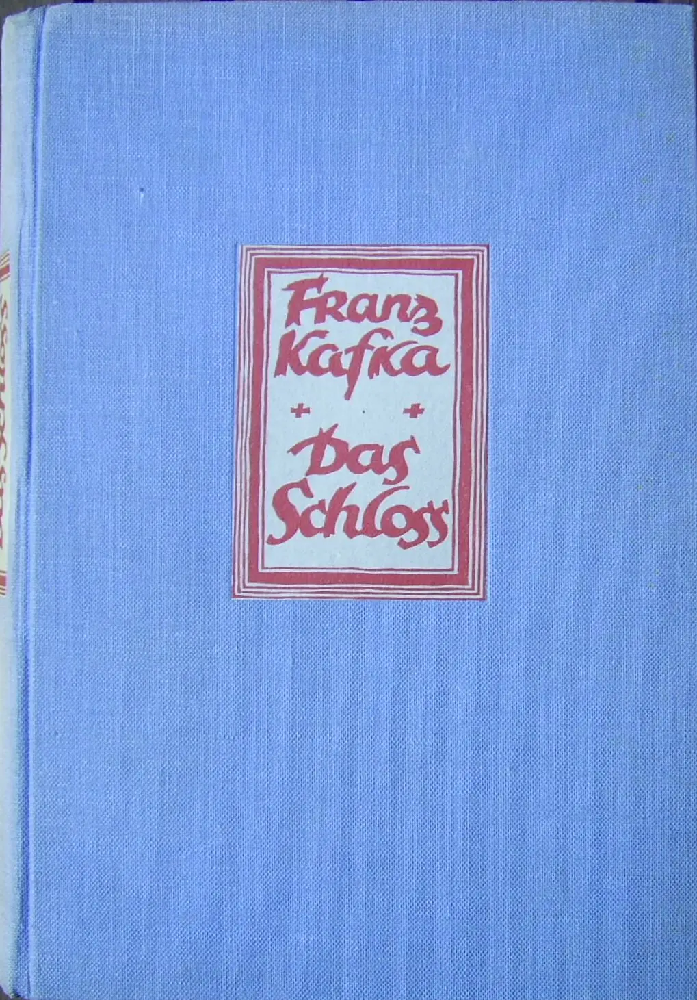
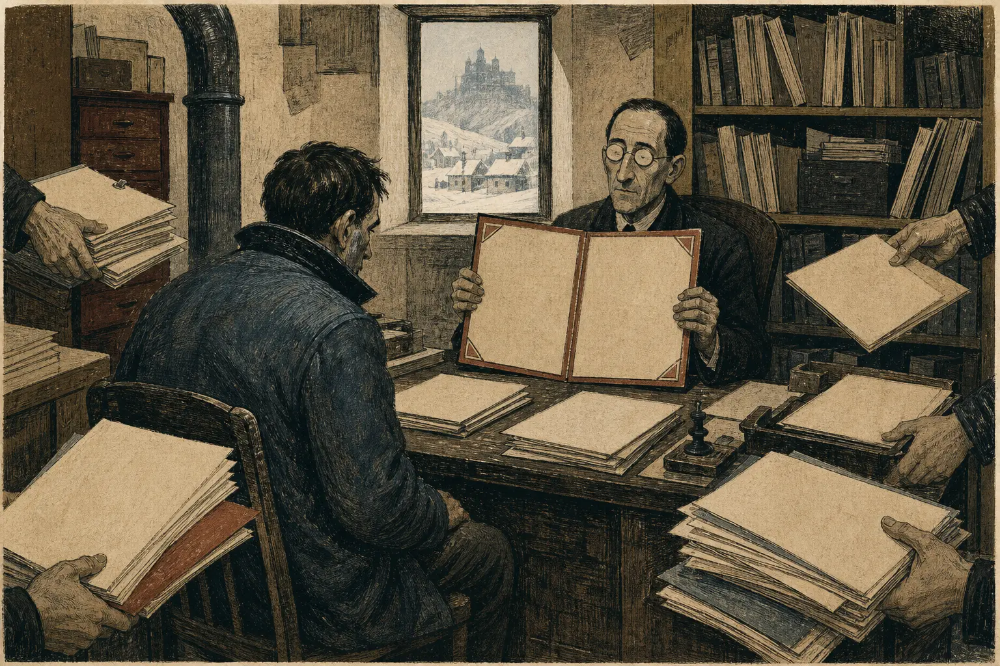
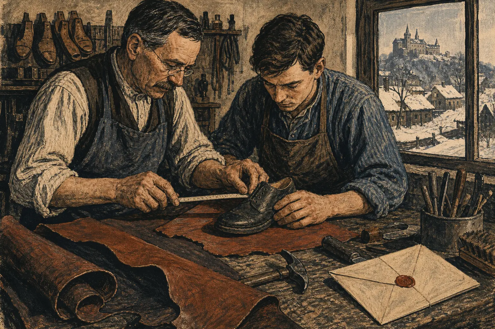

> **文本说明**：本文涉及《儒林外史》《围城》和《城堡》的完整情节。《城堡》的章页按1926年马克斯·布罗德编订版定位，现代校勘本的分章可能不同。标题借《论语》的言行之辨，追问资格留下的判断还能怎样接受实践检验。[^title-reading]

## 老爷回府了——《儒林外史》第三回

范进抱着一只鸡站在集上。家里已经断炊，母亲让他把鸡卖掉，换些米回来。报录的人就在这时进了村，邻居四处找他，最后把仍不肯相信消息的范进拉回家。家中已经挂起榜帖。他认出自己的名字，几十年的应试生涯仿佛在这张纸上结了账，随即昏倒，醒来又发了疯。等胡屠户一巴掌将他打醒，周围的人已经换了礼数。[^scholars-fan]

胡屠户此前拿女婿当穷酸，如今却怕打坏了这位“文曲星”。范进走在前面，他低头跟着，一路替女婿扯平衣襟，进门又喊“老爷回府了”。张静斋借师门年谊攀作“世弟兄”，送来银子和房屋。范进尚未写出一篇新文章，也未履行一项官职，称呼、亲缘与可以支配的资源就都变了。榜帖给了一个名次，屠户、乡绅和邻居则把名次变成了生活。范进还来不及判断自己成了谁，旁人已替他相信，并且照着这份相信行事。

这张纸何以能让众人一起改口？须往榜帖到来以前看。马二先生谈历代读书人的出路，从春秋的言扬行举讲到宋代理学，最后归到本朝文章取士。在他的解释里，圣贤若活在当朝，也得做制艺，才有官可做。他自己久困科场，后来替书坊评卷、编选考文；学问在这里不断被折回举业：读什么，怎样读，怎样评，都要让考官在文章里认得出来。[^scholars-ma]

长期应试使学习者熟悉一套分工：别人出题，获授权者判定答案，机构保存排名，成功便有望换得一个社会位置。当这套分工长期占据学习时间，又掌握主要的成败反馈，怎样提出问题就容易退到怎样答好题之后。学习者当然仍会思考，但思考的用处越来越由阅卷人的取舍来确认。

排名还会把一次应答写成对一个人的判断。某次失误原本只发生在某个时刻，连续的记录却容易使它成为“这个人不擅长什么”；一次高分也可以延伸成对聪明、自律乃至前途的总评。学校、家庭和用人者借此省下重新了解一个人的工夫，被评价者也逐渐学会照着记录讲自己。犹疑、转向和暂时的失败，都得在那条分数曲线上找位置。

福柯在《规训与惩罚》中把考试放在层级观察与规范判断的交点：姓名、分数、评语和次序，将个人制成可以描述、比较和调用的“个案”。[^foucault-exam] 试卷收走了，个案却留着。记录一旦被家庭和机构反复调用，就可能走进婚姻、求职和交往，替陌生人预先回答该怎样对待这个人。

统一标准又使记录能够在更远的地方通用。Ronald Dore讨论“文凭病”时，指出两个相接的制度条件：统一考试使证书有了共同币值，职业官僚制又以普通教育资格筛选未来成员。[^dore] 招聘者无须逐一等候申请者完成岗位任务，便可借证书先作取舍，安排他们进入相应的职业路线。这降低了大规模筛选的成本，也把一段教育经历的效力延长到未来。

资格因此带着信用的性质：它保存过去的评价，又担保某种尚未实现的可能。张静斋在范进任官以前送来房屋，看中的是举人日后可能取得的权力和关系。榜帖先回答“范进是谁”，旁人的赠与又替这个名字安排了将来的生活。过去的成绩有了未来时态，人也开始凭这份未来来经营现在。

## 我待贾者也——《论语·子罕》

方鸿渐在欧洲留学数年，没有完成足以向家里交代的学位。回国日期临近，他得带一项看得见的成果，向父亲和已故未婚妻的家族交账，于是买下虚构的克莱登大学博士文凭。购买没有给他添一点知识，“留洋博士”的身份却先送到了家。父辈可以展示教育投资的回报，地方社会也有了称呼他的现成名字。[^fortress]

他明知文凭是假，还给自己留下一条原则：不用它正式求职。然而照片、报纸和亲友已经接手了这个称号，体面的职业与婚姻也随之成为可以预想的生活。羞耻让他与假博士保持着私人距离，身份的公共效力却不会因此停下来。

*原创概念插图：文凭先在桌上取得完整外形，持有人仍在镜前整理将要扮演的角色；并非历史档案或小说场景复原。*

《城堡》将这种先到的身份推到了任命上。K深夜抵达村庄，面临驱逐时，自称受伯爵召来担任土地测量员。电话先否认有这名测量员，随后又追认先前答复有误。小说始终没有展示一份足以平息争论的原始合同，行政程序却已围绕这个角色运转。K也将住宿、工作和进入城堡的要求，系在“测量员”这个名字上。[^castle-role]

角色首先给了他一条可以解释眼下遭遇的时间线。遭到拒绝，是手续还没办完；受了屈辱，可以等将来的承认来补偿；掌握关系的人，则可能替他打开下一道门。K看得出村庄的程序矛盾百出，却仍把大量精力用来证明自己原本就有资格。他的反抗要求城堡兑现任命，未来能否成立，便成了现在能否忍耐的理由。

*卡夫卡《城堡》1926年初版实物。摄影：Zassen，[CC BY-SA 3.0](https://creativecommons.org/licenses/by-sa/3.0/deed.zh-hans)，经 [Wikimedia Commons](https://commons.wikimedia.org/wiki/File:Franz_Kafka_Das_Schloss.jpg)，转码为 WebP。*

巴纳巴斯会做鞋，可以帮父亲完成订单。奥尔嘉却把恢复家族地位的希望，寄托在弟弟的城堡信使身份上。公务衣服迟迟不来，差事的地位、办事的路径也不明确，她仍从弟弟与官员的每次接触中读出一家人接近城堡的可能。[^castle-barnabas]

延误并不一定使这个未来破产。衣服没有送来，可以说承认还在途中；差事来源含混，也可以当作正式入职前的试炼。她在确认身份上用的心越多，就越难把下一次差事只当作一次差事。父亲的鞋匠活维持着今天的生计，信使职位却掌握着一家人对明天的解释。

未来岗位也能沿另一条路径进入当下。教育部关于高校毕业生就业的文件，要求就业状况与招生、培养联动，对就业质量不高的专业实行红黄牌提示，并将职业生涯教育纳入培养过程。[^edu-employment] 毕业后的岗位数据由此反馈到专业设置、资源配置和培养安排，供需适配成为教育治理的对象。

政策中的反馈有明确的治理用途，小说里的角色则已经进入家人的期待、当事人的忍耐和日常关系。两者相接的地方，是尚未到来的岗位能够安排现在；它是否替人判断，还要看接下来的实践能否改写这种安排。方鸿渐的羞耻、K对程序的嘲弄和巴纳巴斯的疑虑，都还不足以做到这一点。亲友和村民照样依博士、测量员和信使的名义行事。工作成果尚不可见，文凭、任命和信件便先替它回答了。

## 天地间之至文——《儒林外史》第三回

周进做考官时，范进还只是一名童生。初读他的文章，周进觉得不知所云；第二次才看出些意思；第三次终于认定是“天地间之至文”，将范进取为第一名，使他进学为生员。周进曾在科场受苦，眼前这位五十四岁的老童生，使他看见了自己的遭遇。他决意细读卷子、不让幕客屈了真才，补偿的愿望也进入了这次阅读。考官手中的笔，随后将阅读写成了录取事实。[^scholars-fan]

只说他有眼光，或只说他徇私，都处理不了这段变化。小说没有交出一套能在考场外替文章终审的独立标准；同情也没有抹去他反复读卷的认真。可以追问的是，三遍之间究竟变了什么。对后来照榜单行事的人，这个问题却已经结束：考官将判断写进名次，读卷的过程便隐在结果之后。

《城堡》里的判断更难找到这样一位作主的人。村长一开始就说明，村庄不需要测量员；随后追述任命的来历。村里早已回复没有需求，材料却到了错误的部门；相关文件可能仍在村里，也可能途中遗失，误收材料的部门最终只得到空卷宗封套。调查错误又添了新的公文。各部门据自己经手的材料继续办事，K却无法从中找到一位既掌握全过程、又肯为整个任命负责的人。[^castle-files]

*原创概念插图：任命的错误被拆进文件和办公室，每个经手人只看见自己的部分；并非《城堡》改编剧照。*

这套办事方式还给怀疑留了去处。找不到文件，可以想它已进了另一轮审查；眼前的职员不知情，可以想知情者还在更深的办公室。K和村民于是继续猜测，哪张纸更接近城堡的意图。他们一面怀疑电话和信件，一面又按任命安排住宿和工作。齐泽克所说的“客观信念”，就在这两种动作的分离处显出用处：信念可以寄存在仪式、物件和社会行动里，一个人的怀疑不会自行叫停众人照旧行事。[^zizek-belief]

周进亲手在卷面上取舍，判断尚有一位可以追问的作者。城堡职员则援引上一份文件，村长又将决定解释为行政史的延续。往前追，是别人的材料；向后等，是下一道手续。任命保持有效，作出任命的人却越来越难辨认。卷面可以重读，城堡的纠错反而继续增加卷宗。

把这番档案史与村长起初说的话放在一起，矛盾才更清楚：土地边界早已标定，很少转手，少量界争也由村里自行处理。测量本无需求，测量员的身份却仍待程序解决。土地不能替公文结案。

## 无臣而为有臣——《论语·子罕》

巴纳巴斯后来送来第二封署名克拉姆的信。信中赞许K已完成的测量，肯定助手的表现，又催他把工作做好。K当即指出，上级得到的消息有误，自己根本没有进行测量；助手值什么，也请巴纳巴斯看看。村庄没有测量需求，K没有测量成果，表扬却已经到了。[^castle-praise]

这封信与土地之间的落差，使一种评价闭环显出来：任命给了K测量员的名义，助手又围绕这个名义出现，上级来信便称工作已有进展。至于进展从何而来，土地上无从查验。本文从这里读出的机制，是评价可能以机构自己留下的记录为凭据，记录所指的工作反而进不了评价。

测量要与土地对得上，鞋要合脚，教室里的污水要有人换掉。知识劳动也有自己的不相合，只是未必立刻显露：文本证据能推翻漂亮的阐释，学生听不懂，可以迫使教师另想讲法；受到政策影响的人，也能指出模型未计入的后果。有了这些反馈，工作者才知道何处须改。若它们只许被听见，却不能改动方法和结论，验收仍会停在机构已经写好的话上。

学分、评审和项目记录，使组织者能在大规模协作中掌握工作。问题发生在收入和晋升依赖记录、工作中暴露的失败却改不了记录的时候：参与者便更容易把力气花在可填写、可认定的部分。马二先生用心读卷、批注、出版，选本使后来的考生更熟悉阅卷规则。这些考生将来若又做了教师或考官，自己的成功便可以继续为旧规则作证。教与学都很忙，能否改变规则的回答却越来越少。

K接受学校杂役的职位以后，倒有一项工作当面受检。清晨，女教师和学生已经在房里，K搬走污水、提来清水，接着扫地，弗丽达擦洗地面。灰尘和污水不读克拉姆的信，在场的人能看出活做得怎样。[^castle-school] 这并没有给K一个摆脱城堡的安稳去处。教师的责难和当众的羞辱仍在，他自己也想着巴纳巴斯和将来，把校役工作放在等待正式承认的日子里。

校舍清扫至少保留了工作与结果之间的联系。土地没有测量，表扬信却声称测量已有进展；教室扫没扫，眼前的房间就能作答。判断要接受这种反驳，才会随工作而变。但即使每个人做过什么都看得见，完整后果仍可能找不到负责人。阿玛莉亚一家的遭遇，便把问题从评价推进到归责。

## 非我也，岁也——《孟子·梁惠王上》

奥尔嘉向K讲家族往事：城堡官员索尔蒂尼曾寄来一封粗俗而带威胁的信，命阿玛莉亚立即去旅店见他。她撕了信，把碎片掷回送信人脸上，拒绝前往，也没有补做哪怕表面服从的动作。没有正式审判，一家人却开始在日常生活中受罚。[^castle-amalia]

顾客取回送修的靴子，订单簿上的项目逐行划去；帮工布伦瑞克离开，自立门户；朋友和熟人纷纷疏远；消防协会通知父亲退会，并要求交回证书。亲属的接济曾延续了一些联系，后来也停了。父亲四处求宽恕，办事人却说，至少在律师能够查阅的笔录中，没有一项控告。他又说不出城堡对他下过什么正式处分，便连求宽恕的理由也无法得到承认。

索尔蒂尼写了召见信，惩罚的大部分却由村民完成。奥尔嘉谈到恐惧，也谈到众人不愿再听、不愿再说这件事的难堪；她没有指出一项统一命令，将顾客、帮工和协会的行动串成完整处分。城堡不必公开宣布判决，家庭的收入、名誉和关系已经一起垮下去。

相互观望足以使这份惩罚继续。旁人都在退避，后来者便更容易将退避看成事情已有定论；自己再退一步，又给下一人留下同样的理由。这样的执行无须每次等待上级发令。对旁人来说，退避可能是避险，也可能是借机另谋出路；对这家人来说，接连中止的交易与来往，却已经构成了完整的排斥。

顾客取回靴子，布伦瑞克离开师傅，协会收回证书，各有行动者，也各有直接后果。他们至少知道自己正在中止哪种关系。至于每人知道多少城堡的意图，承受多大压力，还有多少不照办的余地，奥尔嘉的叙述并没有同样详尽地交代。Dennis Thompson称之为“许多只手的问题”：要归责，就须逐个追踪因果贡献、知情和受压程度。[^thompson] 分工使判断变难，并不使这些动作无人做过。

受罚的家庭却无法把零散后果组成一件可以受理的事。父亲指不出一项总决定、一个生效日期或一位签字人，办公室便将他的损失解释回手艺和市场。顾客拿走自己的靴子，帮工另寻职业，协会处理成员资格，职员核对公开笔录；单独看，各人都能给自己的动作找一个说法。一旦要问这些动作共同做了什么，便没有地方让他们一起回答。

公共惩罚于是取得了“环境”的面貌。村民面对的是继续来往的风险，父亲面对的是一处又一处不受理；他有损失，却找不到一项承认损失来源的决定。规则在生活里生效，在申诉时又退回各自的事务。住在这样的环境里，人更容易关心怎样保全自己的关系和位置，因为那至少还是自己可以着手的地方。

## 不在其位，不谋其政——《论语·泰伯》

K先遇到测量与表扬的脱节，随后才从奥尔嘉那里听到惩罚与决定的脱节。刚听完召见信的内容，他已经指出索尔蒂尼滥用权力，这种事在别的条件下也可能得逞，连受害者都未必觉察。此时，他还不知道村民怎样疏远这一家人，更不知道父亲后来怎样四处求宽恕。一封信已经让他看见公共问题：官员的私人要求能够借城堡的权力逼人服从。[^castle-k-turn]

但他的理解也有一处轻重之差。他以为阿玛莉亚受到的侮辱很容易得到补偿，几天后便可忘却；真正令他警惕的，是权力滥用的普遍可能。奥尔嘉继续讲述，并把阿玛莉亚与弗丽达相比较，触动了他与克拉姆之间的私人关系。K随即承认，事情在他眼里变了形。他关心阿玛莉亚，主要因为她是巴纳巴斯的妹妹，遭遇可能牵动信使的差事；弗丽达则是自己的未婚妻。他又数起已经得到的住所、职位、工作、将来的婚姻、村民资格和通往克拉姆的关系。这个家庭的往事仍在被听取，用来衡量往事的中心却换了。

K并不缺行动。他与村长争辩，拒绝莫穆斯的笔录，在雪地里等克拉姆，也借住宿、婚姻和信使关系寻找突破口。他比许多村民更清楚程序的荒谬，行动却总绕着一组所有格：我的任命，我的权利，我的入口。这份清醒使他更善于在城堡规定的关系中移动，尚未成为与村民共同追问规则的行动。

决定找不到作主的人，申诉也找不到受理的地方，个人便容易退回那些可以直接改动的东西。申请材料就是其中一种。独自应付招生名额和劳动制度的人，更容易再考一次、换专业、补一张证书，而难以使规则的制定成为共同议题。机构继续收取按旧标准整理的材料，部分成功者又将标准传给后来者。一次次合理的应对，就这样帮助旧条件继续运转。

教育资源由谁分配，什么劳动得到承认，组织决定使谁获益、让谁受损，都涉及共同规则。到个人手里，却常常缩成专业是否热门、材料是否齐全、哪条路线稳妥。本文所说的政治冷感，就发生在这样的转换中：对排名、招聘和晋升极其敏感，却难以接近制定标准、分配后果的权力。人的主动性仍很旺盛，主要用来取得下一个位置。

生计确实要靠考试、迁移和职业选择来维持，公共行动也可以与它们同行。当改善个人位置挤压了共同追问规则的行动，而制定条件的人与承受后果的人无法参加同一场争论，公共问题就容易在私人路线里封闭起来。K知道电话不可靠、档案会遗失、上级会表扬尚未做过的工作；他也说出过权力滥用。知识和反抗都在，村民却仍没有共同处理阿玛莉亚一家受罚的地方。

## 百工居肆以成其事——《论语·子张》

巴纳巴斯送来那封表扬信时，K追问此前托他转交给克拉姆的口信。巴纳巴斯说，托付后的第二天，他没去城堡，父亲鞋匠活太多，需要自己帮忙。K勃然不满：克拉姆的事理当优先，怎能把口信忘在鞋匠凳上？巴纳巴斯仍解释，那是布伦瑞克交来的订单，自己本来就是父亲的帮工。[^castle-barnabas] 这场争执把两种工作摆在一起：一项等候来源与效力都不稳定的承认，一项须把眼前的活做完。

鞋匠活没有城堡的荣耀，却要接受皮料、尺寸和后续使用的检验。称号不能使一双鞋合脚，顾客退回来的失败得由制作者处理。信使差事尚未给巴纳巴斯明确的权利与公务衣服，奥尔嘉仍在模糊的接触里寻找进展；鞋做成什么样，却不能只靠再解释一次来改变。

*原创概念插图：信使职位可以悬置，皮料、尺寸和使用却要求眼前的手艺作出回答；并非《城堡》改编剧照。*

然而会做鞋也没有替这个家庭抵挡惩罚。阿玛莉亚撕掉信，保住了自己的判断，全家随后受孤立。父亲原来的订单逐项取消；后来巴纳巴斯才从布伦瑞克那里接到低价的活，摸黑取订单，又摸黑送回。手艺仍能养活人，交易和来往却也受着村庄的权力关系支配。阿玛莉亚的拒绝，使城堡对这些配合的依赖显形；众人仍各自计算风险，一家人便继续承受没有总决定的惩罚。

因而，恢复工作中的检验，还须让反馈有地方改变判断。资格可以保存训练结束时的评价，工作开始后，文本、学生、顾客和受影响者也应当能够使评价更新。学位记录作者受过训练，下一篇文章中的判断仍可能被一个反例推翻。复杂分工则须留下可以追责的地方：受影响者能够申诉，完成一段职责的人也须回应这段职责造成的后果。个人路线之外的政治，从这些可以共同追问、共同改变的关系里开始。

范进家里的榜帖保存了一次录取，胡屠户、张静斋和乡邻将它活成社会现实。巴纳巴斯手里的城堡信则可由奥尔嘉反复解释，每次延误都还能许诺一个未来。那天，信没有回答巴纳巴斯的身份。父亲桌上的皮料，仍等着他量尺寸。

[^scholars-fan]: 吴敬梓：《[儒林外史·第三回](https://zh.wikisource.org/wiki/儒林外史/第03回)》。范进中举、社会关系变化及周进反复阅卷均见本回。
[^scholars-ma]: 吴敬梓：《[儒林外史·第十三回](https://zh.wikisource.org/wiki/儒林外史/第13回)》，马二先生论举业及其评选、出版考文的活动。
[^foucault-exam]: Michel Foucault, *Discipline and Punish*, trans. Alan Sheridan (Vintage), Part III, ch. 2, “The Examination,” pp. 184–194。版本信息见 [Penguin Random House](https://www.penguinrandomhouse.com/books/55026/discipline-and-punish-by-michel-foucault-and-alan-sheridan/)。
[^dore]: Ronald Dore, “[The Diploma Disease Revisited](https://doi.org/10.1111/j.1759-5436.1980.mp11002009.x),” *IDS Bulletin* 11, no. 2 (1980): 55–61；[开放原文](https://www.ids.ac.uk/files/dmfile/Dore11.2final.pdf)。
[^fortress]: 钱锺书《围城》中方鸿渐购买假博士文凭及其社会身份功能，情节定位参见 Derong Cao, “[Academic Barbarism Reconsidered: The Satire of the University in *Fortress Besieged*](https://doi.org/10.1080/25723618.2020.1781385),” *Chinese Literature and Thought Today* (2020)，该文使用上海三联书店2002年版。正文只作情节转述。
[^castle-role]: Franz Kafka, *Das Schloß*, 1926 Max Brod edition, [ch. 1](https://de.wikisource.org/wiki/Das_Schlo%C3%9F/Das_erste_Kapitel), pp. 4–8, 28；[ch. 2](https://de.wikisource.org/wiki/Das_Schlo%C3%9F/Das_zweite_Kapitel), pp. 33–35。K的测量员身份由他申明，随后得到行政程序的含混追认。
[^castle-barnabas]: Kafka, *Das Schloß*, 1926 Brod ed., [ch. 10](https://de.wikisource.org/wiki/Das_Schlo%C3%9F/Das_zehnte_Kapitel), pp. 233–234；[ch. 15](https://de.wikisource.org/wiki/Das_Schlo%C3%9F/Das_f%C3%BCnfzehnte_Kapitel), pp. 330–348、389、412。巴纳巴斯家族史主要由奥尔嘉向K转述；布伦瑞克承接低价订单的情形见p.412。
[^edu-employment]: 中华人民共和国教育部：《[教育部关于做好2025届全国普通高校毕业生就业创业工作的通知](https://hudong.moe.gov.cn/srcsite/A15/s3265/202411/t20241112_1162526.html)》，教就业〔2024〕5号，2024年11月11日。
[^castle-files]: Kafka, *Das Schloß*, 1926 Brod ed., [ch. 5](https://de.wikisource.org/wiki/Das_Schlo%C3%9F/Das_f%C3%BCnfte_Kapitel), pp. 113–134。村长关于测量需求、错投部门、空卷宗封套与档案程序的叙述见此。
[^zizek-belief]: Žižek, *The Sublime Object of Ideology*, ch. 1, pp. 31–45，关于信念寄存在外部实践和物件中的论述；ch. 5, pp. 185–191，关于被假定相信、知道或享受的主体。
[^castle-praise]: Kafka, *Das Schloß*, 1926 Brod ed., [ch. 10](https://de.wikisource.org/wiki/Das_Schlo%C3%9F/Das_zehnte_Kapitel), pp. 229–237。巴纳巴斯带来一封被归于克拉姆的信，信中表扬测量进度，K随后说明自己未进行测量。
[^castle-school]: Kafka, *Das Schloß*, 1926 Brod ed., [ch. 7](https://de.wikisource.org/wiki/Das_Schlo%C3%9F/Das_siebente_Kapitel), pp. 176–186，村长提出校役职位；[ch. 12](https://de.wikisource.org/wiki/Das_Schlo%C3%9F/Das_zw%C3%B6lfte_Kapitel), pp. 249–261，女教师和学生已在房内，K扫地、换水，弗丽达擦洗地面；男教师稍后进入。
[^castle-amalia]: Kafka, *Das Schloß*, 1926 Brod ed., [ch. 15](https://de.wikisource.org/wiki/Das_Schlo%C3%9F/Das_f%C3%BCnfzehnte_Kapitel), pp. 368–410。阿玛莉亚家族史由奥尔嘉转述；顾客取回送修靴子、帮工离开、消防协会辞退父亲及父亲请求宽恕无门均见此。
[^castle-k-turn]: Kafka, *Das Schloß*, 1926 Brod ed., [ch. 15](https://de.wikisource.org/wiki/Das_Schlo%C3%9F/Das_f%C3%BCnfzehnte_Kapitel), pp. 370–383。K先指出索尔蒂尼滥用权力，也轻看阿玛莉亚所受羞辱的持续性；随后在奥尔嘉继续叙述时，将自己的住所、职位、婚姻与克拉姆关系放回中心。
[^thompson]: Dennis F. Thompson, “[Moral Responsibility of Public Officials: The Problem of Many Hands](https://doi.org/10.2307/1954312),” *American Political Science Review* 74, no. 4 (1980): 905–916；[Cambridge书目与摘要](https://www.cambridge.org/core/journals/american-political-science-review/article/abs/moral-responsibility-of-public-officials-the-problem-of-many-hands/39DD3FAB7BF7DC7A242407143674F22B)。

[^title-reading]: 《[论语·公冶长](https://zh.wikisource.org/wiki/論語/公冶長第五)》5.10：孔子因宰予昼寝，将“听其言而信其行”改为“听其言而观其行”。本文借这次判断的改变，讨论制度承认怎样重新接受工作及其后果的检验。
