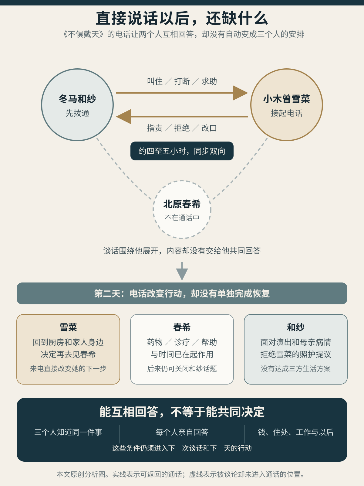
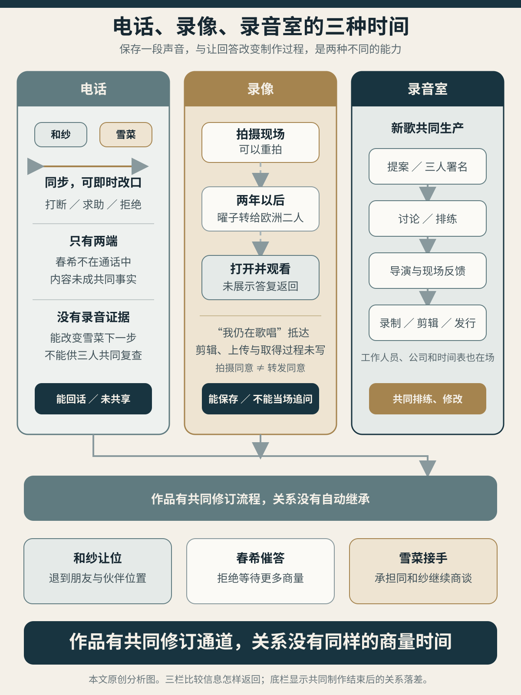

> **剧透说明**：本文涉及《白色相簿2》Coda 浮气线、冬马 True、雪菜 True 及 PS3 追加篇《不倶戴天の君へ》的结局，也完整讨论《秋》《心中天网岛》《卍》《美与哀愁》的关键情节。游戏台词、动作和时序按日文脚本复核；四部文学作品用来互相检验一种反复出现的关系格局，不据此主张丸户史明直接受它们影响。[^source]
>
> **封面说明**：封面为本站原创概念图。电话线、信纸折痕、暗红弧线与唱片纹路绕成一个没有闭合的结，声波从缺口返回；它不是游戏画面、文学档案或具体场景复原。
>
> **配图说明**：正文两图均为本站原创分析图。第一张分开“能互相回答”与“三个人共同决定”；第二张比较电话、录像和录音室各自容许怎样的返回与修改。正文承担全部判断，图像不替原文补写未发生的演奏、未说明的转发同意或终局以后的关系。

和纱的手先伸向手机。

她想找一个人听自己说话，听自己的琴，哪怕只用谎话告诉她：演奏会会顺利，母亲会好起来。手机记录里已经没有那个号码，记忆却还留着。紧接着的独白说，那个人绝不能打；自己已经发誓不再见、不再说话，也不再爱。这个语境首先指向春希。脚本没有让她把那串号码按完，也没有说它就是稍后拨出的号码。

画面转到雪菜。她从冬马曜子事务所东京支部的自动答录里抄到欧洲总部电话，一位一位往座机里输入。她同样说不清拨通以后要做什么。她想让三个人知道彼此如今怎样，又怀疑自己是否正把一颗炸弹扔到和纱演出之前；想到春希停滞、自己也快撑不住，她甚至又设想，只要自己不在，春希与和纱或许便能恢复原状。

雪菜正要按下最后一位，桌上的手机先响了。

直到这时，脚本才明确给出另一端：和纱已经拨通雪菜的手机。她把这称作自己在日本第二个绝不能拨的号码。两段禁忌号码相邻，实际动作却不能合并成“和纱凭记忆拨出了删掉的雪菜号码”。能确认的是更有意思的一件事：两个人都在找对方；和纱先接通了。[^phone]

雪菜开口仍是“好久不见”。随后一段时间，两人尽力把这通电话过成普通寒暄。她们谈工作、家人、朋友，互相说看过对方的演出。雪菜把自己的工作说得忙碌顺利，心里立刻承认这是谎话。和纱为没有资格来电道歉，雪菜又说她没有任何事需要道歉；心里真正害怕的，是一旦收下这份道歉，自己便不得不说出春希如今的样子。

她们都听得出对方还有话，都帮对方换了题。和纱准备挂断，雪菜请她以后再打，和纱也回了一句同样的话。两人甚至知道，自己仍戴着假面，并没有和好。

电话本来可以在这里成为一件温柔的纪念：彼此知道号码还在，声音也还在，六年前没有完全死去。可和纱已经说完晚安，忽然又叫住雪菜。她只来得及说一个“我”，雪菜便抢先打断，承认自己也许救不了“我们那个人”，也许辜负了和纱当初的托付。

争吵从这一句才真正开始。和纱先追问为什么，继而说自己怎样哭、怎样放弃，怎样相信只有雪菜能救春希；雪菜反问，当初先放手的不是和纱吗；和纱又把话推回五年前，说最初抢走春希的人明明是雪菜。雪菜求她帮忙，和纱答道，眼下需要帮助的其实是自己，并第一次说出曜子的病。

曜子的病一说出口，争吵没有立刻变得高尚。雪菜真切地哭，问和纱为何不守在病床边；和纱说，曜子要听她完成协奏曲，陪床与登台只能选一边，无论怎样都可能抱憾终身。雪菜说自己背不动一切，只能背春希；和纱便抓住这句话，质问她既然还肯背，怎么能说放弃。

“把春希还给我。”

和纱先骂雪菜骗子、胆小鬼，后来又平静地提出同一要求。雪菜两次拒绝。她说其余事情都可以商量，自己甚至可以去巴黎或维也纳照顾和纱与曜子；春希不能交出。和纱当场拒绝。两个人把各自的界线说到了对方面前。

最刺眼的仍是“还”。春希在这场话里像一件由两个女人托付、保管、弄丢、索回的东西。可和纱紧接着又把自己的话拆开：春希最后怎样决定，由他自己承担。她既要雪菜归还，又承认雪菜没有权代他作决定；她既把自己说成被抢夺者，又不肯把春希彻底收成战利品。两面互相冲撞，没有哪一面只是虚假。

电话持续了约四至五小时。末尾，两人一面说不会后悔，一面又说一定会后悔；一面宣布这是最后一次，一面已经让对方知道自己仍会活在世界上。旁白没有写谁先按下结束键。最干净的写法，恰好是什么也不补：话说完了，仍无人能替三个人定案。

[上一篇](/posts/white-album-2-beyond-snow-country/)从这通电话以后接着写春希与雪菜怎样恢复日常，本篇要停在电话本身稍久一些。次日，雪菜回到家中厨房，同母亲一起做饭，决定重新去见春希。来电确实改变了她的下一步。春希的恢复却并非在这一夜凭空发生。他已经在服药、看诊、散步，周围人的理解与帮助也在起作用；他自己列出的条件还包括时间。雪菜到来很重要，既不是唯一药方，也不是把崩溃者立即治好的奇迹。

后来雪菜发现，自己不在时春希也在好转，立刻把自己判成“没用的人”，又想把“更有用”的和纱还给他。春希拒绝按疗效分配恋人。他总在房内留下去向，只有仍持备用钥匙的雪菜能够读到。这样做不是因为雪菜能够包办他的恢复，而是因为他需要那个不必再为自己崩溃的、普通的雪菜。两个人终于从“谁更能救人”退回“我需要谁”。和纱仍没有进入这场回答。[^after-call]

*电话让两个人能即时纠正彼此，也没有自动生成三个人的共同安排。本站原创分析图。*

这通电话已经足够反驳一种简单说法：冬马与雪菜只会借春希传话。她们能亲自爱、恨、求助、拒绝，也能把对方逼到改口。它同时留下一个更难的问题。两个女人说得再久，只要春希仍不在场，只要谈话内容没有进入三人共有的下一步，“把他给你”与“把他还我”便仍会替别人预定未来。

日本小说很早便写过这种温柔。那里没有四五小时的辱骂，只有一位姐姐退后一步，把所爱之人“让”给妹妹。《秋》最锋利的地方，正在于这一步真的出于爱，也真的让其余两个人背上了一笔很难拒绝的债。

## 让出一个人以后

《秋》开篇时，信子与俊吉还没有正式定约。两人同样谈文学，准备进入文坛，大学同学已经把他们想象成一张新婚合影。信子嘴上否认，态度却又有意让猜测延续。妹妹照子常同他们出游；姐姐一发现她被文学谈话落在外面，便立刻换题把她拉回。最先照顾照子的人是信子，最先忘记她的人也总是信子。

变化由一封失踪的信传出。照子曾写信给俊吉，信没有到达，至少没有得到可见答复。她怀疑姐姐已经看过。信子后来问妹妹是否爱俊吉，还说若真爱便会帮助她；照子没有好好回答，信子不久便接受另一桩婚事，嫁到大阪。小说没有保存信子承认截信，也没有让俊吉知道姐妹之间发生了什么。我们看到的只是一组相邻事实：照子的怀疑，信子的询问，妹妹的沉默，姐姐的另嫁。[^aki]

照子于是替这组事实写好了名字：牺牲。她在临别信中认定姐姐为自己放弃俊吉，请姐姐以后也不要抛弃她。信子每次重读都落泪。叙述却在最完整的地方插入一个反问：这场结婚果真全由牺牲造成吗？信子不愿深想，宁可停在温暖的感伤里。

这个反问没有揭出一项藏在爱背后的卑劣真相。更准确地说，爱、嫉妒、社会压力、自我保护和理想中的姐姐形象，共用了同一个退出动作。信子可以真心舍不得妹妹受伤，也可以害怕公开竞争、害怕被拒绝；她还可能借一桩可执行的婚姻离开始终说不清的三角。动机没有一枚最底层的硬币，挖到底便可把其余部分判作假货。

她在大阪的婚姻也不是纯粹受刑。丈夫起初整洁、温和，愿意听她谈小说与戏剧，也陪她出游。真正缩小她的，是婚后每天怎样安排。信子重新写作，丈夫便从送洗的衣领、家庭开销和“不能永远做女学生”说起，逼她把妻职放在稿纸之前。她在黑暗里说以后不再写小说，也哭过；夫妻第二天又“自然和好”。小说没有写谁道歉、家务怎样重分；自然和好只是让日子继续，冲突的原因原封不动。此后信子很少再动笔，俊吉却已在杂志上发表作品。

一年后，她独自到东京探望照子与俊吉。旧日的文学谈话立即回来，双方也默契地不谈各自的婚姻。俊吉每逢沉默快要变成等待，便另起一个话题。照子归来，三个人吃她养的鸡所下的蛋，俊吉高谈人的生活总靠掠夺维持；夜里又说缪斯是女人，只能由男人俘获。姐妹这时会联手反驳他。她们有直接关系，也有共同语言，不是两个只会争夺男人的位置。

月光下，俊吉没有点名地叫人出去，信子跟到鸡舍。他只说鸡已经睡了，信子却想到“被取走鸡蛋的鸡”。回屋时，照子独自看着灯罩上一只蓝色横爬的小虫。第二天早晨，俊吉出门扫墓，请信子等到中午。男人离开后，姐妹才碰到昨夜。

信子说妹妹幸福，照子反说姐姐也很幸福；两个人都拿婚姻外观替对方下判词。信子追问“你真这样想吗”，随即后悔。照子哭起来，信子先有一瞬残酷的喜悦，继而说只要照子幸福、俊吉爱她，自己便已经满足。照子抬头，只说出：“那么姐姐为什么昨夜也……”句子停住了。

姐妹又哭着和好，感情没有虚假。恰因句子没有说完，她们还能在这一刻恢复亲密。被保存下来的还有另一面：照子始终无法确认姐姐是否仍在索取俊吉，信子也不必承认自己希望妹妹看见那份牺牲。妹妹若幸福，便应感谢；姐姐若不幸，便更能证明当年之爱。一次退出由此成了终身债务。

信子没有等俊吉回来。她乘车离开，透过车篷上的小窗看见他迎面走来，明明想到停车，也想到就此错过。名字几乎要叫出口，车辆已经驶过。结尾留下的只有“秋”。季节替代人名，把一个可能得到回答的呼唤改成无人能答的气氛。

《秋》没有告诉我们，信子若停下车，三个人便会得到更好结局。它只让人看见：最安静的成全同样在替人作主。信子没有问俊吉，也没有等照子说清。照子的婚姻在姐姐退出以后成为现实，往后每次幸福又都像在使用姐姐给出的东西。

《不倶戴天》把同一种语法说得更粗暴：“托付给你”“把他还来”。雪菜和和纱也都爱对方，并把对方想成更强、更适合春希的人。和纱相信只有雪菜救得了他；雪菜看见春希独自恢复，又觉得自己无用，想把“更有用”的和纱交回去。把羡慕当成授权以后，退让者可以一次决定三个人的未来，留下者则须在爱情之外，再背一份受恩人的感激。

两作还有一处重要差别。和纱在电话里当场承认，春希应当自己决定。这句话没有取消“归还”的占有欲，却把裂缝留在了话里。《秋》没有保存俊吉怎样形成并说明自己的选择；终场又由行车替信子的迟疑完成错过。

《心中天网岛》里，女人之间的信不再失踪：它确实抵达，也确实救过一个人。阿さん后来又拿出四百匁现钱，把衣物打包估作其余三百五十匁，筹成足以改变眼前局面的救援方案。问题是，她已经改变主意，新的决定却没有送到，旧约仍照原样执行。

## 信能救人，也会迟到

治兵卫是大阪天满的纸商，有妻阿さん和两个孩子，也同游女小春立下二十九张起请。恋人的誓纸数量惊人，真正先改变行动的却是另一封信。阿さん知道丈夫将随小春赴死，私下请求小春断绝，以救治兵卫性命。小春答应了。她宁肯在治兵卫面前被误解、被踢打，也不说出妻子的请求。

这段关系不靠春希式的男人居中传话。阿さん发出请求，小春收到并执行；女性之间的约定比治兵卫自己的誓纸更有力量。问题出在它只能秘密运作。治兵卫不知妻子与小春共享什么，阿さん也不知道小春为了守约正在承受什么。[^amijima]

小春并不一心求死。她怕疼，想活，还惦记着靠她维生的母亲。旧约约束的是她的一项选择，不是她全部的愿望。

后来阿さん听说太兵卫即将赎走小春，才意识到旧请求已经产生另一种危险。小春若为了救治兵卫而背弃他，便可能因失信和羞耻自尽。阿さん于是改变主意：她先拿出四百匁商款，又把衣物打包，估作所缺的三百五十匁，准备赶在太兵卫之前把小春救出来。七百五十匁是眼下所需的手金或半金，并非接近十贯的全部赎身价；其中四百匁已经是现钱，另一部分尚待典出。

钱一出现，抽象的成全便撞上居住问题。治兵卫问，小春若进家门，阿さん自己怎么办。她哭着说，可以给孩子做乳母，可以烧饭，也可以退居一旁。原文没有写她愿做下女或隐妻，更没有让她自愿交出法律上的妻位。她能想到的是把自己从妻子降成育儿、炊事或退居者，以此替两个女人腾出同一屋檐。

这份方案比“祝你们幸福”走得远。它有钱，有衣物，有执行期限，也开始问谁住在哪里。它仍只容许一个女人保住完整名位，另一个靠自降来完成善意。孩子由谁养，店铺怎样经营，两名女人各自靠什么收入，谁可以改变主意，全部没有位置。

阿さん的父亲五左卫门此时来到纸店。他看见治兵卫盛装佩刀、仆役背着衣物包，随后又翻出几乎搬空的衣箱，于是判断女儿与外孙即将被剥夺，强行把阿さん带走。父亲不知道她正在救小春；按眼前可见的事实，他的担忧并不荒唐。阿さん拒绝离婚，五左卫门也没有等一纸休书写成，只说无须文书便带走她。妻子为保护丈夫和计划而保密，正好让保护妻子的行动拆断了新方案。

七百五十匁的救赎方案没有生效：三百五十匁尚只是待典衣物的估值，治兵卫把仍在身上的四百匁商款改作结账、布施和花费。他又向店家谎称自己将去京都采购，听见兄长和孩子寻找自己，仍藏着没有出声，最后带小春离开。阿さん的新决定没有送到，旧约仍约束着小春的一项选择：她要保住妻子的名节，又同治兵卫走向死亡。

临死时，两人还试图把死亡分开。小春怕同死会让阿さん蒙羞，要求异处分死；治兵卫先持刀刺死小春，再到别处用她的抱带缢死自己。身体的距离是她对妻约最后的服从。天亮以后，渔民发现遗体，绘双纸和净琉璃又把两处重新合成一桩“网岛心中”。小春想保留的分别，被公共故事抹成了更动人的合一。

近松让纸在全剧不断换形：纸商的账簿，恋人的起请，妻子的密信，未曾写成的休书，最后还有预告悲剧的绘双纸。纸能让缺席者继续行动，能把钱、名誉和誓言固定下来；纸也不会自己知道事实已经改变。阿さん已经从“请你断绝”转为“我拿钱救你”，旧请求却仍在小春身上执行。

电话的好处很实际：和纱能叫停，雪菜能拒绝，照护提议也能当夜改口。一个请求失效时，对方可以立即听见新版本。春希仍不在通话中，电话内容也没有变成三个人可以共同复查的事实；雪菜提出去欧洲，和纱当场拒绝，住处、工作和照护都没有继续谈下去。

《卍》把两端都搬进同一间屋。三个核心人物知道基本关系，两个女人也直接相爱，光子甚至每日登门、偶尔留宿。一句“不”仍会在她们面对面时失效。

## 面对面，也未必肯放手

《卍》由幸存者園子讲述。小说开头已经称她“柿内未亡人”，读者知道丈夫会死，却不知道光子为何死、園子为何活下来。她从自己保存并筛选的书信、照片、血书、侦探报告和新闻中逐件讲述；材料越多，死者越无法纠正她的说法。園子也承认自己前后可能说得不一致。谷崎没有在这些材料背后另放一份全知档案，只让每一种文体争夺关系的解释权。[^manji]

关系最先以画像出现。園子在女子美术学校画柳观音，身体照着模特，脸却像尚未同她交谈过的光子。学校随即传出两人有同性关系。光子第一次接近園子，提议故意公开亲近，让造谣者看个够。很久以后，她才说最初的匿名信和流言原是自己制造，为的是遮蔽綿贯与婚事；園子起先只是挡箭牌，后来園子的崇拜才使利用变成爱情。

这是一段迟到证言，不能单独盖过此前所有版本。能确认的是，社会尚未发现她们，假流言已经把两人带到一起；真正的相处又使流言越来越像事实。外界的目光不只压迫她们，也被她们拿来召唤欲望。

镜前裸体把问题落在身体上。光子愿意被画，也欣赏園子观看自己，却不肯撤去最后一层白布。園子把遮盖理解成秘密和说谎，以绝交相逼，抓住白布。光子明确要求放开；園子仍把布扯破并强行剥去，继而握住她发抖的手腕。后来两人仍拥抱、接吻。

欲望是真的，“放开”也是真的。后面的吻没有穿过时间，回去替前面的撕扯补发同意。若把前后只选一面，便会得到两种同样粗糙的故事：或者光子从未欲望園子，后来只是受迫；或者她既然后来回应，先前的拒绝便只是情趣。小说让享受凝视、保留身体边界、遭到强迫和主动亲吻在同一场景里相继成立。

两人的关系往后不断以更强的保证修补这道不安。光子先开始叫園子“姐姐”，又厌恶别人按婚姻身份称園子“夫人”。不久，她夜里求園子把两人的同款和服、钱与男装送到旅馆；園子赶到才看见綿贯，被迫替二人遮掩。受辱以后，她回到孝太郎身边，只说出部分经过，又回家操持生活。她想烧掉光子的照片和书信，终于下不了手。婚姻给她安稳，留下的东西也让被赶走的欲望继续待在家里。

光子没有靠一次坦白回来。她让人冒充医院来电，又装作怀孕、流产，用伪造的血迹和腹痛把園子召回。園子渐渐看穿，仍替她清洗、喂水、安慰；光子也知道她已经知道。两人借一场共同维持的谎言恢复照护。即使识破骗局，園子仍说不出“我不去救你”。

复合以后，園子又同綿贯秘密结盟，用血书分配彼此在光子身边的位置。条款写得很细：谁被抛弃，另一人便共同离开；谁也不能擅自私奔或同死；甚至光子的未来婚姻、生育和妊娠后的处置也被纳入安排。

这份号称管理三角的契约，签字者只有園子和綿贯。被两人分配的光子没有签，園子的丈夫孝太郎、两家父母以及可能出生的孩子更没有签。两名自觉处在边缘的人借结盟取得安全，做出的第一件事却是替中心人物规定身体和未来。

血书随后被拍照、剪裁、交换。綿贯把材料交给孝太郎；孝太郎先以收据和不离婚的承诺取回原件。文件保存了签名，却已经开始随持有者改变关系。

園子后来拿“死”逼丈夫不离婚。她和光子布置遗书、女佣口供和醒后的说辞，想用所谓安全剂量演一场假自杀，却服下了真药。表演造成真的昏迷和无法核实的空白。園子意识不清时，光子与孝太郎发生身体关系；谁先主动、光子是否同样受药物影响，小说没有提供可独立复核的视角。孝太郎其后反复参与，不能只把责任交给光子。

孝太郎于是从丈夫、律师和监控者变成关系的参与者。他说，只要一人不幸福，三人便一起死。这项“宽恕”让三名核心者知道基本格局，也从成立时就把不幸同毁灭绑在一起。他随后向光子家人撒谎，把两名女性说成纯洁友谊，又以丈夫和律师身份取得家长信任。光子每日到園子家，偶尔留宿，禁止夫妻沿用旧称，要求大家彼此直呼姓名或叫“姐姐”。这是一套私下安排，家庭和公众仍被谎言隔在外面；它不是正式、公开的三人同居。

改名也没有平均分配权力。光子开始强迫二人服安眠药，亲自看着吞咽，检查眼皮、呼吸和心跳，药力不够便换配方；她还限制食量，把自己清醒、两人昏沉的状态变成忠诚证明。孝太郎仍须拖着药后的身体去事务所，園子与他互猜谁偷偷少吃。三个人离得更近，拒绝反而更难说出口：一人若不接受测试，便像在证明自己不爱。

孝太郎后来又付钱购买照片、底片与其他证据。綿贯没有因被买断便从关系中消失：他的疑心、契约和取证方式进入孝太郎，后者也被叫作“第二个綿贯”。最后小报仍刊出血书照片和丑闻。文件没能固定任何人的欲望，只增加了可以勒索、买卖和选段展示的接口。

小报曝光以后，光子提出真正赴死。三个人在最初那幅观音像前服药，光子居中，夫妻分列两侧。園子醒来，光子与孝太郎已经死亡。她怀疑自己是否被两人有意留下；小说没有替她找到证据，也没有交代三人的最终药量。泄密者和園子生还的原因都停在幸存者的疑问里。

从画像到死亡祭坛，光子一直位于理想形象的中心。她对两个人都表现出真实依恋，也经历婚配压力、身体污名和綿贯的控制；这些经历与她后来掌握药物、检验忠诚同时存在。園子反抗丈夫的监管，也借他一向把自己当孩子的习惯，以哭闹和假死逼他让步。被控制的人转而控制别人，救人的举动也会替人作主；新的称谓废掉一套规矩，又生出另一套。

同性欲望与女性直接关系给了她们真实的爱和行动。毁掉三个人生活的，是一句“不”停不住眼前动作，分歧反复被推向绝交、曝光、药物、自伤与死亡。

雪菜 True 里也有一声“放开”。和纱要求雪菜放手，雪菜仍不放。往后，和纱仍能说出嫉妒和“不想被排除”，也能先拒绝方案、后来改变决定。她没有因这一刻永远闭嘴。[^phone-song]

唱片企划最初由雪菜提出，和纱明确拒绝；春希与雪菜仍把提案送进编辑流程，曜子又指定雪菜贴身推进。此后一周，和纱没有应允，直到电话合奏以后才明确答应演奏会与专辑。雪菜强推企划，和纱后来同意，两件事都发生过。[^recording]

昨天那句“不”，应当让昨天的动作停下；今天是否愿意，要由今天的她再说。关系给每个时刻都留出这一点余地，爱才不会把越界改写成早已默许。

血书最终变成小报上的照片。一个人松开手以后，文件和作品仍会继续规定谁是妻、姐姐、情人、背叛者或幸存者。《美与哀愁》把这种力量延长了二十四年：一个男人把十六岁少女写进名作，妻子替他把稿件打出来，后来的人再沿着那本书走进旧事。三个女人终于相见时，事故已经发生，能说的话只剩归罪和沉默。

## 作品替谁记得过去

《美与哀愁》开始于大木年近六十时重返京都。他三十一岁、已有妻室时，同十六岁的音子发生关系；音子十七岁那年八个月早产，女婴夭折。大木把她带到东京边缘一所简陋产院，事后想过，若送到更好的医院，孩子也许能活。小说没有明说那家产院由他挑选，却把成年男人、已婚身份、少女身体和医疗条件放在同一段旧事里。[^beauty]

后来大木把这段经历写成《十六七岁的少女》。妻子文子应丈夫要求开始打字。她说打字机是机器，自己却像被机器使用；错字、撕纸、哭泣和呕吐不断打断抄写。稿件完成几日后，她流产。叙述只把两件事写成推测性关联，不能当成医学因果；作品仍把一段由丈夫写出的旧情，落到了妻子的劳动与身体上。

文子也不是全无选择的工具。大木后来提议停下，她坚持把稿件打完；稿子搁置后，又是她追问为何不出版。这份坚持没有取消婚姻权力，也使作品的生产不能简化成“男人强迫妻子抄完”。她既遭受小说，也参与完成、出版和维护它。往后每次加印，文子还要为五千、一万册盖检印。

名作由此在社会上独自运转。它给大木带来声望与版税，供养家庭和太一郎的学业；书中十六七岁的音子永不衰老，现实中的音子却要带着产院、死婴和被公开改写的过去继续生活。大木自己知道作品离开作者以后会独自活下去。作品离开作者，收入没有离开作者家庭；少女形象离开音子，也没有停止替她说话。

音子后来成为画家。圭子读高中时先在东京个展和周刊画报上看见她，被画与面容吸引，主动登门，请求同住学画。她不是先读大木小说，才追随书中的少女。她与音子有独立于大木的生活：作画、做饭、洗碗、铺床、争论风格，也有嫉妒和身体欲望。师生与房主位置同样存在。音子第一次掌掴圭子，圭子后来要求她再打，不能倒过来把第一次变成预先同意；音子拿剃刀靠近时，圭子害怕逃开；音子追上她，把她带回镜前，又涂皂、使用剃刀。圭子仍在抗拒，此后音子才不再强迫。女性拿起画笔以后，也会把别人画成自己需要的形象。

圭子说要替音子报复，音子惊愕地否认自己想过复仇。她多次阻止，圭子仍分别进入大木与太一郎的关系。大木在车站主动请她把画送到北镰仓，这个入口并非她单独闯入；两人独处时，圭子明确不许他碰自己的左乳，大木仍移开她的手强行查看。圭子把复仇说成爱上太一郎、让太一郎爱上自己，也承认嫉妒音子仍爱大木。小说很少让读者直接进入她的内心；我们只能从那些彼此冲撞的言行中判断她的动机。[^beauty-body]

太一郎并非不知道上一代留下了什么。他当着圭子的面说，《十六七岁的少女》的版税贴补了一家生活、自己的学费和妹妹的婚费，母亲还得为描写自己屈辱的加印本盖检印；想到自己吃过“牺牲十六七岁少女”的钱，他感到难受。他已经不肯把父亲的成就同那位被牺牲的少女分开。

这份认识没有改掉他接近圭子的做法。圭子不让车辆停在原订旅馆，又把他带到另一处住处，随后安排车辆和湖上行程；太一郎则把她的手、耳、颈与衣着收进古寺和湖边的风景。太一郎一度怀疑自己是否正在替母亲报复音子，便叫圭子回去，下一段却继续同她上路。他说“一种结束就是一种开始”，圭子当面驳他：结束和开始是两回事。旧作如何养大下一代，他已经说清；下一代怎样不照旧走，仍没有做成。[^beauty]

最要紧的一通电话发生在太一郎洗澡时。圭子先向文子宣布，自己同太一郎已有婚约。太一郎随后表现出的惊愕，至少说明这项婚约没有得到当场共同确认。这句话立即迫使文子动身，也把父亲的旧事重新调回家中。真假还没有裁定，话已经在安排人的位置。

圭子坚持当天租摩托艇出湖，小说随后跳过三小时，只留下同行、获救与失踪三个结果。太一郎明确答应和登船的场面没有写出，事故经过也不在叙述中。新闻广播说圭子被救起，太一郎失踪，搜寻仍在继续。

结尾处，文子、音子、圭子第一次共处一室。文子摇晃镇静中的圭子，又把责任投向音子；这是一位母亲的归罪，不是叙述判决。大木带文子离开，圭子流泪睁眼，望向音子，尚未开口。女人终于相见了，来得太晚：事故过程不在，太一郎不能回答，圭子的眼泪也还没有语言。

《美与哀愁》同前面三作相比，多出一层持续性。信子的一次退出会成为妹妹的债，阿さん的一封信会继续执行旧请求，《卍》的血书会在复制和新闻中改变联盟；大木的小说则把旧事保存二十四年，进入家庭收入和下一代罪感，又与圭子后来的一句拒绝重叠。叙述没有裁定那是读后重演，还是相似处境里的常见话语。作品能替缺席者回来，也可能让她回来时只剩一个预先写好的身份。

冬马 True 末尾那段录像因此格外复杂。两年后，曜子寄来邮件，附上一串压缩文件的下载地址。春希保存、解压，同和纱牵手观看。画面里，朋操作设备，依绪告诉雪菜可以重拍，武也、孝宏也在场。雪菜知道自己正在被摄录，要求留下当天最好的演奏与歌，最后对着镜头说：“你好吗？我现在仍在歌唱。”

这句话没有在字面上点名春希或和纱。收件人由曜子的邮件替它框定。脚本也没有说明谁剪辑、上传，曜子怎样取得文件，更没有证明雪菜同意由她转发。愿意在朋友面前拍摄、愿意保存、愿意把文件寄给特定的人，是三次不同的同意。

录像让雪菜以自己的声音回到房间。春希与和纱已经两年不谈日本和雪菜，不能再把她只理解成崩溃、怨恨或永远停在离别的人：她说自己仍在唱。这段结尾停在他们打开、观看和解释，没有让雪菜听见回答。它比大木替音子写小说更接近当事人自述，也同样停在已经录好的那一遍。[^video]

CC 千晶线早已演过艺术的另一面。千晶根据学园祭、录像、春希讲述和自己的调查改编三人旧事，又由一名演员轮流扮演冬马与雪菜。舞台能使没有发生的冬雪冲突变得可见，也恰因同一具身体，无法让两个女人同时反驳。作品善于把矛盾摆出完整形状；完整也可能意味着，作者已经替人物想完。[^chikashi]

录像停在一个已经完成的文件上。雪菜 True 则把三个人放进同一套制作流程：提案可以讨论，排练可以重来，现场意见能进入正式录音，成品还能剪辑。这样的修订是否也延伸到三个人的关系，要等录音结束以后再看。

## 三个人的事，怎样还给三个人

雪菜 True 先给出最直接的冬雪冲突。雪菜从曜子的病情说起，和纱拒绝她的安慰，也拒绝把丧亲轻易纳入雪菜熟悉的家庭语言。两个人追问五年前的逃走、抢先告白、抢夺和未曾遗忘。和纱先动手，后来承认伤到雪菜的脸和心；脚本把具体动作省略，不能擅自补成一记耳光或抓伤。她们会攻击，也会立刻道歉；一句道歉又很快被下一句控诉打断。春希不在场，谁也不需要他翻译。[^setsuna-conflict]

第二次摊牌时，和纱承认只要靠近春希便无法放弃他，靠近雪菜便会嫉妒。她先要求雪菜放手、把自己丢下，最后喊出的却是：不要把我排除在外。雪菜随后在二十三点四十六分拨给春希。春希打开免提、弹起吉他；雪菜唱，和纱在她身边听。和纱请雪菜唱出“春希的词、我的曲、你的声音”。

雪菜把前一日唱过的一遍叫 take 1，把当夜电话中的吉他伴奏叫 take 2，再约定第二天让钢琴加入，完成 take 3。这个命名已经把告白变成可重复的工作：昨天没有定型，今晚可以再来，明天还可加入缺席的乐器。脚本没有展示 take 3 真正发生，也没有把这通电话呈现为可供三人复查的录音；后来的 bonus track 还是另一首新歌，不能把两段直接接起来。[^phone-song]

新歌的生产比电话更完整，也更不纯粹。唱片企划最初由雪菜提出，和纱明确拒绝；春希和雪菜仍做出提案，把项目推入编辑流程，曜子又让雪菜贴身推进。此后一周，和纱没有应允，直到电话以后才答应演奏会与专辑。共同工作从强行启动、一周无进展，走到后来的明确同意。

取得同意以后，和纱自己提出由三人做一首新歌。雪菜答应，春希也接受。正式署名把旧轻音同好会重新排出：小木曾雪菜演唱，北原春希作词，冬马和纱作曲，三人共同演奏。日程和曲目可以协商；三个人同场写词、讨论、排练，雪菜又去调集导演和录音人员，协调工作安排。

和纱完成自己的音乐会以后赶到录音室。三人试奏，导演给出意见，随后决定立刻录制。雪菜哭起来，和纱主动要求休息，又安慰她；午夜录音完成，工作人员继续通宵剪辑，和纱分别评价声乐、钢琴和吉他。成品发行、售罄、增印，雪菜又准备请春希与和纱到小木曾家共同试听。歌从私人记忆进入编辑部、唱片公司、技术人员、家人和听众组成的公共世界。[^recording]

*三种载体让回答返回到不同阶段；录音结束后，三人的决定又换了另一套时间。本站原创分析图。*

图中只选了三种承重形式。追加篇还插入一场电视直播：脚本称巴黎演出由电视独家直播，采访也送到春希房中的屏幕，雪菜同他一起收看；和纱最后对观众说“ざまぁみろ”，受话者没有点明，春希和雪菜只能各自解释。直播仍由镜头一端发送，收看的人不能当场回话。[^broadcast]

三种锚点各自解决一件事。《不倶戴天》的电话让雪菜与和纱互相打断，回答能立刻返回发送者；它只有两端，脚本也没有把这通电话呈现为可供三人复查的录音。冬马 True 的录像保存了雪菜本人，两年后仍能抵达；拍摄现场可以重拍，这段结尾却没有展示收件者把答复送回。录音室让三名当事人和外部工作人员围绕同一对象反复排练、接受意见，再完成录制和剪辑。吉他弹错便反复重来，钢琴本身没有出错也得跟着再弹；排练通过以后，三人才进入正式录音。哭泣也可以先换成休息，稍后继续。

IC 已经让三个人合奏过。这次多出的，是署名、日程、不同意见、技术人员、剪辑和发行。歌不再只替三个人表达真心，它成为三个人与许多人共同生产、可以检验和修改的东西。这大概是《白色相簿2》最接近一种新关系形式的时刻。

脚本也在同一段亲手留下反证。录音前，春希想到，祭典结束后，三颗心会是一大块附着一小块，还是三块小东西重新聚在一起，他还不知道。音乐没有替关系回答谁同谁结婚、谁可以怎样留下。

录音开始前，和纱宣布把事业据点移回日本，请求留在母亲、春希与雪菜身边。录音结束后，她又要求春希与雪菜先作为两个人往前走，说春希不能同等对待自己和雪菜。唱片把三人署名并排，关系却重新排出中心与外围：和纱是朋友、音乐伙伴、可以公开来往的人；春希准备同雪菜结婚。

春希随即区分自己对和纱的“喜欢”和对雪菜的“爱”，当场求婚。雪菜没有立刻回答。她要求多给一点时间，好让自己再同和纱商量。春希拒绝等待，要求她现在作答；稍后还承认，自己把处理和纱的事交给了雪菜。制作歌曲时，参与者可以因现场意见停下来、调整，再进入正式录音；此刻春希却要求立即回答，和纱不在场。差别不在雪菜最后有没有回答，而在谁能开启下一轮、规定截止时间、决定谁参加。她要求的三人商量并没有发生。

雪菜先把近期写好却没有寄出的回信、嫉妒、仇恨与报复心摊出来。她怀疑自己夺走了春希，又不许和纱逃开，甚至要她一生看着这场“地狱”。春希继续催答，她才争取五分钟；可她在争取时已经说定，五分钟以后会做回那个“懂事的女人”、做他的“归处”。旁白当场把这理解为同意。这个回答属于雪菜，不能因她承担过多组织劳动便贬成全无能动性的屈服；她只能用五分钟说完愤怒，五分钟以后的答复已经被说定。[^relation-gap]

雪菜 True 因此不该被概括成雪菜单向压服和纱。和纱会指控、动手、拒绝、提出不要被排除，也有同意演奏、提出新曲和迁回日本的决定权。雪菜又确实掌握更多家庭、语言与组织资源：她安排见面，连接事务所与录音人员，接住春希的求婚，往后还要继续同和纱谈。她的胜利与她的劳动是同一件事的两面。

若把这道落差说得最短：一首歌有共同排练、修改和定稿的时间，三个人的关系没有得到同样的商量时间。

作品里没有一条现成路线替它补完。冬马 True 让春希公开撤婚、辞职、迁居，承担了最彻底的社会断裂；浮气线后，和纱主动打给雪菜，两人把求助、归还和拒绝说到彼此面前；雪菜 True 则让冬雪冲突、共同照护、家庭往来和共同制作都进入可见生活。三条线各自取得真实能力，也各自留下不能由另一条线简单相加的缺口。

ISMISM 所说的“第四位置”，放到这三个人身上，就是事实改变以后，三个人还能一起重谈下一步。这与增添第四个人或设想第五条路线无关。

雪菜想再同和纱谈，春希却要求她当场回答。由此看，三个人须先知道同一件事，也要让每个人自己开口。雪菜不能凭和纱的让渡替春希选择，和纱也不能凭自己了解雪菜便替她接受；不想说、暂不回答、拒绝见面，都应由本人决定。后来一次亲吻、和好或合作，不回头改写先前的“不”。

决定还得装得下日子。谁有收入和住处，谁要辞职、迁居、照病、做饭，家人和工作人员怎样受影响，都不能留给高潮以后的某一个人独自收拾。发起、执行、终止和善后若总落到最会牺牲的人手上，共同选择便只是换了一个中心。

约定也应当随事实变化。新的病情可以重谈旧约，一句拒绝能够停住眼前动作；电话、录像、歌和新闻不能替当事人固定永久身份。任何人若只能靠曝光、失业、贫困、自伤或另一个人崩溃才能离开，留下便很难叫作自由同意。

三个人最终恋爱、同居还是分开，要留给他们自己；第四位置只管他们能否共同走到结果。雪菜 True 已经做到许多：本人冲突、公开来往、外部工作、家庭进入、共同创作。它最缺的地方，恰好由自己在录音结束后写出——雪菜想再谈，春希催她回答；和纱先让位，雪菜再接手。

第二卷一路从认罪追到选择，从选择追到雪国以外的日子，最后停在一间录音室。这里的十五分钟很短，却比“永远”更值得记住：排练不合可以重来，哭了可以先休息，昨天那一遍不必成为永久判决。

真正尚未完成的，是把这份时间也交给三个人。一段被留下的声音，日后还能不能由说话者补充、改口或收回；一个人说“不”以后，下一步又是否真的会因此改变。

她们已经相见。三个人的事，才刚刚开始。

---

[^source]: PS3 版的发售日与新增／修订内容见 AQUAPLUS [《WHITE ALBUM2 幸せの向こう側》产品页](https://aquaplus.jp/wa2/product.html)；该页不能单独证明具体追加篇属于哪条路线，路线位置与台词按本地日文脚本复核。《秋》采用青空文库[作品卡](https://www.aozora.gr.jp/cards/000879/card16.html)与[公开正文](https://www.aozora.gr.jp/cards/000879/files/16_14570.html)；《卍》采用青空文库[作品卡](https://www.aozora.gr.jp/cards/001383/card56873.html)与[公开正文](https://www.aozora.gr.jp/cards/001383/files/56873_62035.html)；《心中天网岛》采用[日本国会图书馆 1927 年岩波文库扫描](https://dl.ndl.go.jp/pid/1186884)；《美与哀愁》的书目信息见[日本国会图书馆](https://ndlsearch.ndl.go.jp/books/R100000002-I000001076355)，正文据用户持有的中央公论社 1965 年第四次印行本核对。中文短引均据日文重译。
[^phone]: 和纱希望有人听她说话、听琴并给出希望性的谎话：`wa2mas:kazusa_normal_extra:4009:166–175`；删除号码的拨号冲动及“不再见／说／爱”：`176–183`；雪菜取得欧洲总部号码、分裂动机及来电先响：`184–224`；随后才明确和纱实际打给雪菜：`225–247`。两段号码不能合并。
[^after-call]: 安全寒暄、双方谎言与假面：`wa2mas:kazusa_normal_extra:4009:246–367`；和纱阻止结束、雪菜抢先承认失败、曜子病情与相互求助：`369–425`；归还、两次拒绝、未达成的跨国照护提议及“由春希自己决定”：`426–465`；四五小时和矛盾告别：`466–492`。次日雪菜回家及决定返回：`496–551`；春希原有恢复、药物、诊疗、帮助与时间：`577–646`；有用／需要之别、备用钥匙持有者与留言：`648–698`。脚本未说明最后由谁挂断。
[^aki]: 《秋》的信子、俊吉与照子关系、失踪来信及牺牲信：`aozora:000879:000016:p000014–p000024`；大阪婚姻、写作停顿与俊吉发表：`p000025–p000040`；东京重逢、月夜、鸡舍及蓝色横爬小虫：`p000041–p000057`；姐妹未完成问答、车辆离开与结尾：`p000058–p000072`。照子只怀疑信子读过旧信，文本不确认截信；三人也没有正式婚约。
[^amijima]: 小春怕疼、想活并惦记母亲：`ndl:1186884:canvas=0039:block=0171–0220`；妻信、守约及其引出的踢打：`canvas=0041:block=0115–0190`；阿さん说明信约、筹七百五十匁并提出孩子乳母／饭炊／退居：`canvas=0044:block=0030–0257`；父亲所见、空衣箱、休书争执及带离：`canvas=0045:block=0030–0276`；治兵卫的营业谎言、结账与出走：`canvas=0046:block=0147–canvas=0047:block=0208`；绘双纸：`canvas=0047:block=0228–0237`；异处分死及公共叙事重新合一：`canvas=0048:block=0208–canvas=0050:block=0106`。七百五十匁是眼前手金／半金，不是近十贯的完整赎身价。
[^manji]: 《卍》的“先生”框架、筛选材料、画像、流言与镜前拒绝：`aozora:001383:056873:p000020,p000022–p000042`；光子改称園子为“姐姐”：`p000068`；園子的假死：`p000079`；旅馆后回家、未毁书信照片、假医院与共同识破的照护：`p000085–p000104`；迟到的流言起源证言：`p000158–p000163`；血书的签署、条款与转手：`p000118–p000149,p000167–p000176,p000184`；以死亡逼迫丈夫、假心中、药物空白、孝太郎进入、三人安排、新闻和最终服药：`p000173,p000177–p000191`。血书由園子与綿贯签署，不是三人契约；園子生还、最终药量和泄密者均未由文本裁定。
[^beauty]: 京都行程、大木、音子、产院与死婴：中央公论社 1965 年本 PDF 6–18／印刷页 3–15；文子打字、坚持完成、流产与出版提议：PDF 42–47／印 39–44；作品版税与家庭：PDF 46–47、211–212／印 43–44、208–209；圭子先由音子个展和画报登门：PDF 122–124／印 119–121；音子圭子的艺术、亲密与边界：PDF 109–146／印 106–143；圭子把太一郎带离原订旅馆：PDF 175／印 172；太一郎对版税的认识、沿途观看、复仇疑问、继续同行及“结束／开始”对话：PDF 207–215／印 204–212；未经共同确认的婚约宣告、出湖、事故与三女同室：PDF 234–245／印 231–242。明确答应、登船和事故过程被省略，太一郎到终页仍为失踪。
[^beauty-body]: 大木在车站邀请圭子把画送往北镰仓：中央公论社 1965 年本 PDF 35／印刷页 32；音子的首次掌掴及圭子后来要求再打：PDF 111–112／印 108–109；剃刀、逃离、带回镜前和后来停止强迫：PDF 139–146／印 136–143；圭子拒绝大木触碰、大木仍强行查看：PDF 163–167／印 160–164；圭子关于复仇、爱情与嫉妒的交错说法：PDF 180–184／印 177–181。小说持续绕开圭子未经他人观看的内心，正文据她的言行分析，不把其中一项动机定为唯一真相。
[^video]: 冬马 True 两年后仍回避日本旧事：`wa2:coda:3111:61–72`；曜子邮件、压缩文件与观看：`196–230`；朋操作设备、依绪说明可重拍、雪菜知情拍摄及“我仍在歌唱”：`229–252`。拍摄同意不能替代转发同意，脚本未交代剪辑、上传或曜子取得文件的过程。
[^broadcast]: 《不倶戴天》先明说巴黎演出由电视独家直播：`wa2mas:kazusa_normal_extra:4009:97`；春希房中的收看、演出后采访、和纱的“ざまぁみろ”及春希、雪菜的不同理解见 `4009:840–904`。脚本没有点明这句话的唯一受话者；春希的判断仍是人物解释。
[^chikashi]: 千晶取得学园祭录像、询问春希并以采访与调查补足改编：`wa2:cc:2406:277–328`；舞台由千晶一人分饰冬马与雪菜，并把未曾发生的正面冲突写进演出：`wa2:cc:2411:612–900`。
[^setsuna-conflict]: 雪菜 True 中冬雪从曜子病情、丧亲与社会联系进入第一次冲突：`wa2:coda:3203:69–131`；追问五年前及身体冲突：`202–288`。脚本只确认和纱先动手并伤到雪菜的脸和心，未保存可据以指定掌掴或抓伤的动作文字。
[^phone-song]: 和纱说出嫉妒、要求放开又请求不要被排除：`wa2:coda:3207:120–169`；雪菜于 23:46 拨给春希、免提吉他、和纱请求雪菜歌唱及 take 1／2／3 约定：`173–223`；和纱随后明确同意演奏会与专辑：`254–259`。电话中是既有歌曲，脚本没有录音证据，也没有展示 take 3；后来制作的新曲不能倒接成这一遍。
[^recording]: 和纱最初拒绝唱片企划：`wa2:coda:3202:73–115`；春希雪菜推进提案、编辑与贴身工作：`3203:148–195,3205:1–14,58–62`。日程和曲目协商、和纱提出三人新曲：`3208:86–120,189–238`；三人署名、写作、排练与雪菜调集人员：`3209:1–32,67–81,424–467,657–704`；祭典后分开、现场反馈、排练纠正、正式录音、休息和剪辑：`3210:150–278,440–442,519–548`；发行、售罄与家庭试听安排：`3211:1–82`。`3211:83–117` 是最终录音的交错回放，不是发行后另一次合奏。
[^relation-gap]: 和纱留在日本并请求留在母亲与两人身边：`wa2:coda:3210:285–365`；要求春希雪菜作为两人前进及不作同等婚恋安排：`567–618`；春希区分喜欢／爱并求婚，雪菜要求更多商谈时间、春希拒绝等待且承认把和纱交给雪菜处理：`683–727`；雪菜近期写好而未发出的回信：`768–859`；她的嫉妒、报复心、五分钟与“懂事女人／归处”：`878–944`。正文关于录音后商量时间的落差为本文解释，不是脚本原句。
