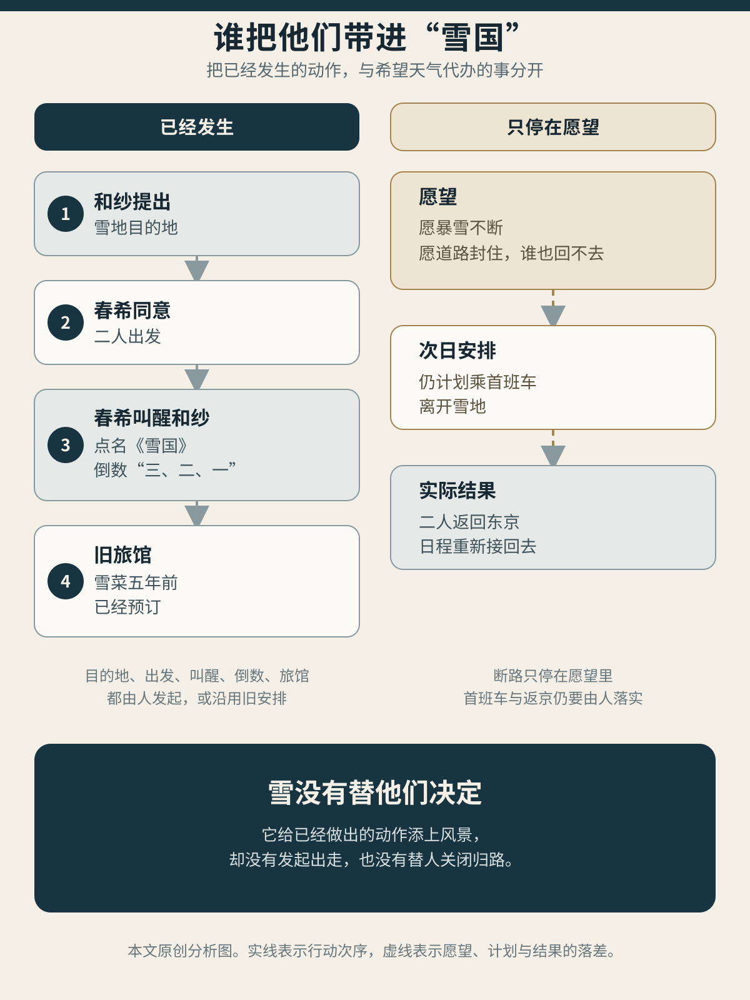
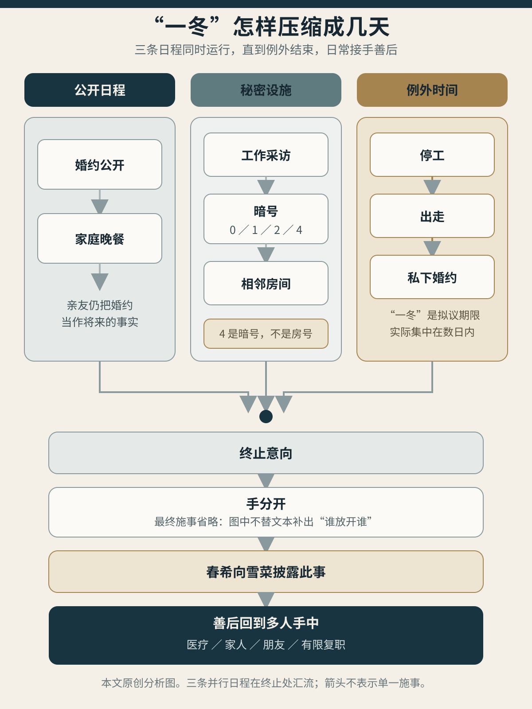

> **剧透说明**：本文涉及《白色相簿2》Coda 浮气线、冬马 True 及《不倶戴天の君へ》的关键情节，也讨论《雪国》《国境以南，太阳以西》《死之棘》的结局。游戏中的台词、动作和时序按日文脚本复核；文学作品只作有边界的结构互读，除脚本明确点名《雪国》外，不主张另外两部小说是可考的创作来源。[^source]
>
> **封面说明**：封面为本站原创概念图。列车窗把雪地、相邻房间和工作日程叠在一起，雪层下面仍有铁路、电话、账单与灯火；它不是游戏画面、文学档案或具体场景复原。
>
> **配图说明**：正文两图均为本站原创分析图。第一张分开已经发生的行动与人物希望风雪代办的结果；第二张把公开婚约、秘密日程和后来复健放在同一张时间图里。正文承担全部判断，图像不替代原文证据。

列车驶入隧道时，和纱靠着春希的肩睡着了，手里仍握着他的左手。春希没有等她自然醒来。他用右手轻轻碰醒她，问她是否读过川端康成，又让她看着窗外，同自己一起倒数。

三、二、一。隧道过去，车窗外的天空、树木和地面都白了。

《雪国》的名字由此进入浮气线。这个引典做得太漂亮，很容易让人顺着春希的眼睛，把眼前当成一道真正的分界：东京在隧道那边，雪国在这边；雪菜、工作、婚约和已经说过的话留在那边，二人终于抵达只属于自己的地方。稍后两人也盼着雪下得再大些，最好让道路和铁路全部停摆。那样一来，他们便不是决定留下，只是走不了。

可在白色出现以前，许多动作已经发生。目的地由和纱选定，春希没有反对；离开东京、换乘地方列车、在隧道里叫醒她、提起川端、发出倒数，都是人的动作。到了旅馆，他们仍在商量第二天搭首班车继续走。风雪没有把两个人困住。他们先走到这里，才希望天气替自己收走回程。

第三篇重读过这段，追问浮气线究竟由谁发起、落实和结束。第五篇又把认罪拆成药费、工时与照护，[第六篇](/posts/white-album-2-who-lives-after-choice/)追到一项选择里谁来得及知道和回答。这里还缺着一段：雪菜仍在过婚约的日子，春希与和纱怎样借一间房、几个数字和一份工作，把她的回答推迟到音乐会。

*雪景到来以前，目的地、启程、叫醒与倒数都已有主语；“被困”只是后来希望天气替他们完成的事。本站原创分析图。*

游戏既然点出了《雪国》，我们就沿这条路进去，但不忙着给人物配对。驹子和叶子照亮浮气线的地方，在于岛村看人的方式：她们一直在做事，他却能把这些事看成风景。别人的日子一旦成了风景，其中的等待和索问也就被看轻了。

## 玻璃上的脸，账本里的日子

《雪国》开篇写的是岛村第二次前往温泉乡。列车越过县界以前，车厢里先有一场照护。叶子替弟弟向站长请托，又一路照看生病的行男：给他盖衣，喂水，留意他的呼吸和脸色。岛村坐在稍远处看着她。天色暗下去以后，车窗变成镜子，叶子的脸浮到玻璃上，同山野、灯火和暮色重叠。远处一盏灯穿过她的瞳孔，成了开篇最著名的画面。[^yukiguni]

照护先发生，幻景随后才出现。这个次序很要紧。叶子并没有为了岛村摆出姿态，她甚至不知道自己正在被看。铁路、站务、车厢和玻璃把两个人放到同一处，车窗再替岛村把一项会出汗、会疲惫、也会向人提出请求的劳动，改成只供他独自领受的美。

这种改写到了驹子身上更为清楚。她能说出与岛村相隔一百九十九天，长年记日记，也给读过的小说记人物表和感想。岛村知道她不是为了发表，更不是为了给谁看，于是当面说了一句“徒劳”。驹子听出这话刺人，岛村却又立刻被这种徒劳感动：一名地方女子费力记录、练琴、读书，成果无处投递，正因此显得纯洁。

“徒劳”不是驹子给自己的判词。她记下日期，便能准确说出两次来访之间隔了多久；她从收音机和谱本练琴，真的能在宴席上工作；她计算本金、利息、生活费和剩余年期，也会为了珍惜身体而限制接客。那些事未必替她打开了理想人生，却一直在改变今天怎样过。岛村把它们统称为徒劳，收下的便只剩感动，不必再回答四年债期以后怎么办，也不必回答一年到底来几次。

一次失约和一封未写的信，把这层差别写进了时间。岛村没有按约参加赶鸟节，驹子却为了赶回来见他，缩短了在师匠身边的照护，回村空等。她后来也拒绝给他写一封“即使妻子看到也没关系”的信。那封信若要安全，便须删掉等待、欲望和埋怨，处处顾忌东京家中的收信人。岛村想得到一份不会打乱任何生活的温情，驹子却不肯替他把自己改写成安全版本。

小说几乎不给东京妻子说话。能直接确认的动作，不过是岛村离家前，她提醒丈夫别忘了防蛾。岛村还曾独自设想，把妻子带到雪国来，让驹子陪她游玩、教她跳舞；这个周到安排从未经过两个女人中的任何一人。凭这几笔，我们无法补写妻子的家务、知情或默许。可她即使没有声音，也始终挡在信纸背后：岛村可以不断往返，驹子下笔时却得先想好，东京的妻子若看见这封信，会怎样。

岛村还替雪国里的三个人补过一段爱情史。按摩妇只说地方上有驹子同师匠之子行男订过婚的传闻，又明明补了一句自己并不清楚；岛村已经在心里排出驹子、行男、叶子的悲剧三角。驹子当面否认婚约，也否认为了行男的医药费下海，叶子后来再否认一次。可在岛村眼里，传闻比两个女人的回答更适合雪国：有婚约、有牺牲、有病中归来的男人，驹子的生活便显得更像一场注定落空的爱情。三角关系先在观看者的解释里成立，再倒过来遮住当事人自己的行动史。

岛村并非全然无知。他常常知道自己的研究依靠书本和照片，知道自己爱上的是未经现场检验的西洋舞蹈；他也会看见自己失约、敷衍和无法久留。这种自知使《雪国》远比“负心男人遇到痴情艺伎”复杂，也使问题更尖锐。知道自己正在审美，并不等于停止用审美躲开答复。岛村最擅长的，正是在明白徒劳由自己命名以后，继续为徒劳而感动。

他称驹子“好女人”的一场争执，更接近《白色相簿2》熟悉的矛盾话语。驹子刚照顾过身体不适的岛村，不知道这句话究竟是在赞她，还是在评量一个容易相处的艺伎。她追问，岛村已经知道她听岔了，仍闭上眼睛不回答。最后由驹子道歉、收拾现场。到了火灾途中，这句话又被重新提起，先前没有说明的含义并未随时间消散。善意不只由说话者心里那一半决定；对方听见什么、自己又明知她听见了什么，同样属于这句话的后来。

结尾的火灾把这种距离强行撕开。叶子从蚕房二楼坠下，岛村先看见的是身体落下的线条、火光和横贯夜空的银河。小说没有交代她为什么坠落，也没有确认她是否已经死亡。驹子却已冲向现场，把叶子抱回怀里。一个人仍在观看形状，一个人的身体已经受伤，另一个人在救。川端没有因此停止写美；恰恰是极美的文字，让读者也尝到岛村的位置，再由驹子的动作迫使人发现，自己刚才把什么看漏了。

驹子与叶子也不只是围绕岛村摆放的两幅画。她们会嫉妒、厌恶、求助、托付，叶子曾请岛村善待驹子，驹子最后又亲手抱住叶子。两名女人之间有一条不经男人解释也能成立的关系。只是岛村的目光不断把这条关系收进自己的感伤，直到火场才来不及重新命名。

《雪国》先把问题落在岛村的眼睛上：他真心感动，却把驹子的等待、债务和来年一同收成了风景。若把一切全归给这种有闲旁观者，解释仍然太轻。一个极会做事的人，也能造出同样封闭的世界。《国境以南，太阳以西》写的正是这种人。

## 谁把哪段日子叫作“真”

始不是岛村。他会安排，会经营，会照顾孩子，也会在紧急时开车、订票、找医生。岛本重现以前，他同有纪子因一场雨相识，相爱，三个月后求婚，此后建立家庭，养育两个女儿。始喜欢自己的酒吧，也确实有经营才能：他听取员工意见，肯给出好薪水，懂得怎样让音乐、灯光、酒和谈话共同构成一个让人愿意再来的夜晚。

这些生活并不因岛本回来便忽然变假。有纪子给他的爱是真的，他对妻女的爱也是真的。小说偏偏让始用同一个“吸引力”形容不同女人，提醒读者：欲望强烈，不会自动替它分出真假高下。

始早年同泉交往时，已经说过关系要靠许多小而具体的事实积累，不靠一句承诺。后来他主动安排同泉表姐的幽会，对泉说过上百次谎；事情败露后，他承认责任全在自己，又断言即使人生重来仍会照做。这个自我判决听来毫不推诿，却把一连串可以逐项改变的安排压成了“我就是如此”。认罪越彻底，往后的动作反而越像没有选择。小说结尾他面对有纪子时再次说自己可能重犯，有纪子才拒绝替他判断资格，把问题送回两个人还没做出的将来。

酒吧也不是始凭品味独自造出来的。有纪子的父亲替他找地、贷款，介绍设计师和施工关系；店员、调酒师、乐手与厨师让它每晚开门。始自己把酒吧称作一座“空中庭园”：客人付钱进入一个经过精心制造、仿佛比日常更亲密的地方。他十分清楚这种感受怎样由金钱和劳动做成，却又把岛本身边的自己想成未受这些东西污染的本真。

岛本并非供他回忆的静物。她主动走进酒吧，设定哪些事不能问；她提出寻找一条流向大海的河，把夭折女婴的骨灰撒入水中；她知道始必须向妻子撒谎，也仍然发起这趟旅行。到了箱根，她又提出全取或全无，拒绝只做一个被秘密安置的情人。最后也是她在清晨离开，带走唱片，让始口头作出的选择失去实施条件。

可始对她的现实生活仍几乎一无所知：她住在哪里，是否结婚，钱从何而来，成年后经历过什么，他都不知道。岛本不肯说，自有她的理由；这还算不上撒谎。她为何离开，始也只能猜，不能凭结果把她写成高尚的成全者。知道得越少，始越能按自己的需要解释她：只要岛本出现，被婚姻、孩子和生意扯向几处的自己便仿佛重新完整。

河流之行已经演过一次雪地逃亡。始为妻子编出另一套行程，安排飞机与租车；返程遇雪，两人都暗暗希望航班停飞，让偶然替他们暴露秘密、取消回家。到箱根那一夜，始终于说愿意抛下妻女和事业。他的话很明确，尚未成为共同生活：妻女没有得到通知，婚姻没有结束，岛本现实中的关系仍无人知晓，住处、收入和孩子怎么办也不曾进入讨论。

小说甚至把这种例外同始的事业并置。岳父一面要求他借名设立幽灵公司，一面传授“不会破坏家庭”的外遇规矩：对象要选好，夜里两点前回家，不替情人置屋，也不拿朋友作借口。两类事共享一种聪明——公开规则不必改变，只需把越界控制在表面秩序还能运转的范围内。始厌恶资本上的违法，也真心把自己的欲望当作另一种不受共同规则约束的事。两种心情可以同时诚实。

岛本消失以后，有纪子先问他是否想分开。始答不知道。她让他去想，自己承担了两周等待。第二次再问，她拒绝让“我爱你”代替是或否，也不允许始用“我没有资格”和“以后可能再犯”提前判完结局。最要紧的一句是：你什么也没有问。始反复认定妻子一无所知，实际却从未问她察觉了什么，怎样度过这段日子，还想不想继续。[^south]

有纪子没有在结尾成为一名已经宽恕丈夫的贤妻。她说自己也失去过梦想，也可能在未来伤害他；她只是同意试着重新开始。小说停在始还不能起身叫醒女儿的清晨，最后搭到他背上的手也没有具名。共同生活第一次成为一个由两人提出的问题，执行还没有开始。

小说始终锁在始的回顾性第一人称里，这层形式让他的自省格外有说服力，也让岛本更难离开他的解释。十万日元、烟蒂、酒杯、照片和唱片一度像证物一样，替他证明岛本并非幻觉；结尾唱片与钱同时消失，证物链忽然断掉。小说没有断言岛本是幽灵，只让始和读者失去凭物证下结论的把握。我们只能在岛本做过的事与始替她猜出的动机之间徘徊。一个人的自省再诚恳，也可能盖过另一个人的说法。

《国境以南》于是把《雪国》的问题往前推了一步。岛村借观看躲开答复，始却能把每件事安排得井井有条。他把同岛本相处的自己称作完整，妻女、员工和岳父共同撑起来的生活便退成背景。那些日子没有消失，只在他的叙述里低了一等。

秘密把人挡在门外，下一步似乎应当是把话说尽，让每件事都见光。《死之棘》写的却不是一次已经完成的充分坦白。恰恰因为丈夫仍在隐藏、偷换和拖延，妻子才越来越需要更多事实；门也在这场追逐里越锁越紧。

## 真相也会把门锁死

《死之棘》的危机不是妻子无端猜疑。丈夫俊夫的日记已经暴露长期情事，美保要求他从此不再说谎。俊夫一面保证，一面仍用词义偷换、遗漏和延迟修正自己的话。美保随即把十年婚姻换成一笔账：做饭、洗衣、育儿、独自等待，若都按女佣工资计算，该值多少钱。真相从一开始便同家务和被夺走的时间连在一起。[^toge]

俊夫后来仍藏着照片、书信和对情人身体的记录。他把这些东西称作透明生活里最后的支撑。美保已知道有藏物，等的也不再只是清单。她还要看俊夫会不会主动开口。只要答案来得太晚、措辞不够准确，便又能证明普通回答不可信。丈夫长期欺骗给这种追问以充分根据；追问越有根据，二人越难回到不必审讯也能说话的日常。

把门锁住的并非事实渐渐增多，而是每项事实都开始承担同一项任务：证明对方是否会在无人提醒时主动忠诚。一个人已经知道答案，仍必须等另一个人自己说出；说出的时机稍有偏差，事实便立即变成下一轮测试。真话没有失去价值，却不再用来让两个人共同处理眼前的事。

小说里有一场没有流血的断指。夫妻把并未真正割伤的手指包起来，告诉孩子惩罚已经实施，俊夫也确实感到疼。几页以后，美保腹痛，仍起火做饭、铺床、准备热水袋。象征性的刑罚、真实痛感、对孩子的共同谎言和具体照护没有依次替换，而在同一夜同时存在。人可以伤害一个人，也继续替他做饭；可以照顾孩子，也把孩子拖进夫妻的惩罚仪式。

两个孩子并未被作品写成只会承受的背景。儿子把家里的情况告诉同学母亲，认为说出来更好；父亲却规定这是四个人的秘密。后来孩子说得很直白：自己不要这种家庭生活，只想要一个快乐的家。他没有替父母判断谁爱谁，只是否定他们共同做成的生活样子。

情人真正来到家中时，三个人终于同处一室，结果也不是期待已久的坦白。美保阻止情人离开，逼丈夫回答爱憎，又命他堵住出口、掌掴情人；俊夫照做，并协助限制对方身体。情人指出造成处境的人正是俊夫。最终终止暴力的不是三人达成理解，而是邻居报警，警察进入屋内。

夫妻第二天把昨夜命名为“冲击疗法”，仿佛一次剧烈对质已经挤出毒素。小说紧接着写赔偿、房东解约、搬家和亲属托儿。这场夫妻眼中的“高潮”，落到别人身上便是报警、赔钱、失去住处，还要请亲属照看孩子。三个人虽然见了面，话却没有平等说开；情人只来得及说几句，最后还得靠警察才能离开。

医学也没有替他们给出唯一答案。医生的判断彼此冲突，美保曾幻想用电击忘记，面对实际治疗时又明确拒绝；后来程序仍越过她的反抗。医院可以暂时隔开危险、提供药物和床位，却可能把关系问题缩成谁应当压住谁。到了结尾，为追回所有书信，美保甚至建议丈夫假装同情人复合，骗回证物后再逃走。要求绝对真实的人开始策划一场新骗局，只因它能替“全部真相”补齐最后一块。

夫妻最后进入锁闭病房，一张床还没有被褥。俊夫外出取东西，短暂感到自由，又看见亲属和孩子在没有自己的地方安静生活；他最后带着寝具返回。病房把二人关得比住宅更紧，书信、孩子、工作和以后怎样回答却没有一并解决。带回被褥是一个微小而真实的生活动作，也只是把今晚过下去。

岛尾的写法也拒绝把某一场争吵立成全书唯一高潮。吃饭、搬家、求医、祈祷、发作、和好，再吃饭，动作在章节之间反复回来；换一所住宅、一个医生或一套誓言，只是替同一组问题换了场地。第一人称常把刚才的暴烈同几点吃饭、孩子由谁接、被褥放在哪里并排记下。气氛之所以令人窒息，并非时时都在尖叫，而是每次尖叫以后，锅还在灶上，下一顿仍须有人做。

《死之棘》不允许我们把“回到社会”当作万能药。亲属、警察、房东和医院能止住一场暴力，安排住处，接走孩子；制度也可能只给二人换一座更牢的房间。日常若不容许不同答案、身体边界和退出，照常吃饭也会继续封门。

这同浮气线当然不是等量关系。《白色相簿2》没有十年婚姻、孩子、拘束暴力和强制医疗；和纱与雪菜也拥有岛尾笔下情人从未得到的长篇语言。把两作放在一起，只为拆掉一个过于轻松的设想：秘密说破，三个人见面，生活便会自动恢复。真话能让人重新处理共同处境，也能被改造成忠诚审判。关键仍是说完以后，别人能做什么。

## 把几天过成一冬

早在 Coda 以前，CC 已让“去和纱的音乐会”两次出现在菜单上。选项以深色文字显示，玩家看得见，却不能按下；官方系统说明也确认，深色选项表示当前不可执行，须由游戏进度决定以后是否开放。[^grey]

春希自己承认，说毫无兴趣是谎话。可过去三年也已经过成了一套日子：雪菜、朋友、同事和工作都在其中。玩家能看见另一条岔路，春希却不能按一下按钮，就把这三年从身上抹掉。

视觉小说让玩家读过别的按钮和结局，于是比单条路线中的人物知道得多。但这份跨线记忆只属于玩家。浮气线里，雪菜和和纱能据以行动的，只是她们在这条线上听见、看见和亲手做过的事。

Coda 没有简单解锁旧按钮。和纱先作为采访对象进入春希的工作；杂志社和曜子让他继续负责专访与音乐会，伤病和演出使两人的持续接触有了公开名义。隔壁房间也由曜子因工作租下，并非爱情凭空变出的一间密室。

和纱先给这段关系定了期限：只到离日、冬尽，只谈一场“假爱”，把“真爱”留给雪菜。春希随后吻她，把尚在迟疑中的提议当街接了下来。和纱先开口，春希让这段关系成真；此后两个人怎样见面、何时回家，主要由春希来排。

“假爱”也没有诚实分出感情的强弱。和纱借它同时做两件相反的事：承认自己想要春希，又保证这份欲望不会改写他同雪菜的未来。玩家放开和纱的手后，她试探着靠近，春希把试探变成了吻。从这一刻起，“只到冬尽”才从一句话变成两个人每天要过的日子。

他定出四个数字暗号：0 是回家，1 是晚归，2 是今夜不回，4 是今夜把隔壁空出来，好让雪菜留宿。数字“4”不是房号，也不是门牌。春希当着雪菜的面，用假公司、假姓氏和“四点”伪装业务留言；谎言就在婚约生活内部完成。雪菜听见的是工作安排，和纱收到的却是一张夜间出入表。[^winter]

他们一面背叛雪菜，一面又要她的生活照旧：电话照打，周末照过，连两人的亲密也不能忽然停下。雪菜每周来做饭，为两人的将来省钱，准备见父母；春希也的确爱她。婚约这边越像往常，秘密越不容易露馅。

暗号也没有真把两个女人分到互不相见的时间。和纱后来承认，她一次都没有遵守“4”，前几周始终藏在隔壁，听见春希与雪菜相处。雪菜以为隔壁无人，朋却已经起疑；后来也是朋趁武也在场时按响隔壁门铃。一道墙同时生产三种处境：雪菜以为自己同未婚夫独处，和纱把自己训练成不出声的在场者，春希相信一张暗号表还能控制碰面。

这种安排没有消除任何人的分裂。和纱提出假爱，是想保存春希与雪菜，也是在争取自己最后的时间；她要求离开，又从不真的离开隔壁。春希真心爱雪菜，也真心渴望和纱；他以为把两个真心放进不同日程，便能免去它们在同一张桌上互相否定。雪菜也并非毫无感觉。她检查过隔壁，听见过话里的空隙；春希和朋后来都判断，她可能早已察觉，并试图把怀疑压回“不知道”。三个人都知道一点，又各自按住一点，勉强护着眼前还不敢失去的生活。

情人节把日程另一端的劳动照亮。和纱得知订婚消息，祝贺春希，催他回到雪菜身边。决定折返的人却是春希。他临时编出采访，爽约雪菜的生日和拜见父母；雪菜与母亲仍在等他回家吃饭。那句脚本直接称为卑劣的谎言，遮住的不只有外遇，也有一桌按原定时间准备好的晚餐。

稍后，春希又以流感为由退出本该完成的编辑工作；信任他的同事替他重排任务，和纱也停止练琴。他们口中的“真实世界”，是同事替春希改班、和纱停下练琴以后，才腾出来的几天。

和纱在公共街道上使用眼镜、发型和“东野和美”这层伪装，春希又主动拆掉它，宣布自己要找的是冬马和纱。这个名字只是公开活动中的假身份，不能被补成旅馆登记名。身份游戏的意义在别处：两人既要躲开媒体与熟人，又需要一次被公共目光看见的亲密。

这间雪地旅馆原就存着雪菜的痕迹：五年前由她预订，三个人一起住过。雪景唤回的也是三人的《WHITE ALBUM》之夜。浮气线越想把第三个人删掉，越沿着她留下的预订和记忆往前走。

服务人员几乎认出和纱时，春希说眼前的人只是长得像钢琴家，又说两人很快就要结婚。为了遮蔽真实身份，他临时制造了一个伴侣身份；得到一句不知情的祝福以后，和纱要求他把话再说一次。春希于是求婚，和纱设想自己成为“北原和纱”，两人把当夜的身体关系当作只有彼此的仪式。

这场婚礼不因没有法律效力便全是假。它让春希与和纱第一次把“如果”说成了彼此当下承认的愿望，也给多年压抑的关系一段完整时间。作品同时把缺少的东西逐一写出：没有婚纱、礼服、戒指和知情见证，也没有冬天结束后的住处、收入、工作与家人安排。侍者真的祝福了他们，却不知道自己见证的是什么。

*“一冬”由公开婚约、真实工作和秘密房间共同托住；秘密拆除以后，生活又须由更多人接回。本站原创分析图。*

两人把期限叫作“一冬”，实际秘密生活没有过满一个月。春希同雪菜约两周未见，连续同住、停工与出走集中在最后数日，旅行到第三天清晨便告结束。时间名称的作用，恰在于让终止仿佛早已交给季节：冬尽、离日，关系自然消失。可每一步都有人在做。和纱提出期限，春希编暗号与借口，曜子提供房间，编辑部接走工作，雪菜与家人继续照婚约生活。

谎言没有抹掉两份爱，只把它们分开说给两个人听。春希对雪菜谈工作，对和纱报暗号；他向侍者谎称两人就要结婚，转过身又同和纱把这句话过成私下婚约。每句话关起门来都说得通，换到另一间屋便少了最要紧的条件。雪菜照常爱他、做饭、等候、同家人筹备婚事，却不知道这张出入表怎样运行，更无从叫停。

二人天地靠采访、工资、曜子租下的隔壁房间，以及雪菜仍在履行的婚约，才换来连续几天。雪菜留在门外等，春希与和纱便容易把共同安排出来的日子听成命运。

## 这一冬由谁收场

和纱起初说，自己从一开始就打算结束。她很快又承认，这是一句“关于说谎的谎言”。直到返程清晨，看见春希醒来时的笑，她才真正形成离开的决定。昨天还想向更北方逃，今天便准备把人还给雪菜；两面都属于她，不能靠挑出一句“真心”来消去另一句。

返东京的列车重新穿过隧道，白色世界退到窗后。继续去札幌乃至国外的提议没有执行。两人最后乘上的，是回东京的车。

音乐会前，和纱把前排唯一空着、紧邻春希的位置留给雪菜。她的演奏对春希构成告别，也替几天的同居和外遇制造了一份职业上无可挑剔的遮蔽。若所有人都只看见钢琴家完成公演，门内的日子便可以被当作什么也没发生。演奏不是公开认罪。中场真正把同居、出走、越过身体界线以及自己仍爱和纱说给雪菜听的人，是春希。[^ending]

手的分离则比任何明确判词更冷。和纱要求春希放手，春希说自己根本没有用力：只要她愿意收回，手自然会分开。和纱承认，她想让春希主动甩开、主动拒绝，好把最后责任也交给他。春希不肯替她完成。旁白最后只写两只手终于分开，没有说是谁先动。

这处省略最好留着，因为它使浮气线很难归成“冬马选择一切”或“春希终于负责”的单线。和纱先定期限，春希把它过成秘密生活；清晨由和纱决定离开，最后又由春希把实情告诉雪菜。

春希从雪菜的反应判断，她早已察觉背叛，并准备装作不知道。察觉仍不同于听完全部日程：直到同居、出走、越过身体界线以及春希仍爱和纱被说到面前，雪菜才终于听到可以当面追问的事实。她没有接受春希预先写好的自罚结论，也不让他独自把话说完。秘密日程到此停下，三人的原生活却没有回来。

第五篇已经追过这一年的休职、诊疗和照护分担；这里从一通本文暂不展开的长电话以后接起。雪菜重新吃饭，以自己的决定回去。春希也已开始几乎每天外出散步，给持有钥匙的她留下去向。他不是确信她一定回来，只是让她若回来，还能进入自己的日常。春希心里算得很明白：药物和治疗帮了他，朋友的理解与时间也帮了他；他自己还得重新散步、晒太阳、走出家门。没有雪菜，他会继续坏下去；只靠雪菜，他也好不起来。[^after]

复职时，春希明说自己暂时仍有许多事做不了；聚餐时，同事也约定不强劝酒，他想回去便让他离开。往后仍有症状反复的风险，日子只能在勉强到恶化以前停下。《不倶戴天》同《死之棘》都让家人、朋友、医生和工作进场，差别在于这些人没有再把春希和雪菜关进一间新密室。朋友能分担，雪菜能说自己撑不住，春希也得重新散步、复诊、上班。这里的“回到人间”，落在这些可以分担、拒绝和改期的小事里，同回到哪一个“正确”的女人身边无关。

冬马 True 正好检验这句话。春希公开撤婚、辞职、交接，随后迁往维也纳；这次远走比秘密“一冬”彻底得多。后日谈接着写远方怎样过成日子：和纱要演奏，春希要做经纪，曜子要治病，事务所和住处也都要有人打理。后来几次返日，还要靠日本支部订酒店、修旧宅、联系学校。欧洲同样有亲属、工作和门要一天天开。这层生活没有撤销冬马 True 的决断，也不能替它补写同雪菜尚未发生的共同重谈。

这一点也排除了一个误解：“人间”同原配、家庭常识或留在日本没有天然关系。爱若要过成共同生活，受影响的人先得知道足以作决定的事实，等待和付出也得有人听见；旧约失效以后，他们还要能够拒绝，也能够重新商量。

《雪国》的火场留下岛村未作的答复；《国境以南》的清晨留下尚未成为生活的口头选择；《死之棘》的病房把明天缩成一床被褥。浮气线把欠账拆给更多人：和纱推动终止，春希披露，雪菜回答并承担大量照护，医生、家人、朋友和同事又把生活接到次日。没有哪一个漂亮动作能独自付清。

雪盖住道路时，道路仍在。雪融以后，地面也不会自动变好；它只是重新露出铁轨、脚印和岔路，让人可以辨认这几天从哪里借来，又是谁仍站在原处等一个回答。

浮气线结束以后，冬马和雪菜终于能越过春希，直接拨通彼此的电话。她们会责骂，也会求助和拒绝。接下来请读[第八篇《她们相见以后，三人的事仍未了》](/posts/white-album-2-after-they-meet/)：它从这通电话出发，继续追问三个人怎样共同决定以后。

---

[^source]: 游戏版本与系统事实参见 AQUAPLUS [PS3 版产品页](https://aquaplus.jp/wa2/product.html)及[选项说明](https://aquaplus.jp/wa2/system03.html)。具体台词以本地日文脚本为准；[MAO Script Browser](https://mao-tls.github.io/white-album-2/script/)仅作读者可访问的非官方检索入口，不把同人英译当原文权威。《雪国》的局部明示互文见 `wa2:coda:3907:145–199`；《国境以南》《死之棘》仅作结构比较。
[^yukiguni]: 当前日文载体对应角川 2013 版，可参见[电子版书目](https://www.kadokawa.co.jp/product/321301000121/)与[纸书书目](https://www.kadokawa.co.jp/product/321301000064/)。叶子照护、车窗镜面：`epub:yukiguni-kadokawa:l000016–l000060`；驹子日记与“徒劳”：`l000261–l000286`；婚约传闻及两次否认：`l000427–l000500,l001152–l001153`；失约与安全信：`l000717–l000777`；债务、身体和未来要求：`l000786–l000844`；叶子的请求及两名女人的冲突：`l001107–l001205`；“好女人”的误解与重提：`l001254–l001288,l001418–l001431`；火灾、坠落与救援：`l001369–l001482`。叶子坠落原因及生死均未由正文确定；东京妻子的直接动作仅见 `l000672` 的防蛾提醒。
[^south]: 作品与 1992 初版书目见讲谈社[作品页](https://www.kodansha.co.jp/titles/1000020169)及[日本国会图书馆记录](https://ndlsearch.ndl.go.jp/books/R100000002-I000002211698)。泉、表姐、反复谎言与“重来仍会如此”：`epub:kokkyou-no-minami-taiyou-no-nishi:l000137–l000224`；婚姻、家庭与酒吧：`l000305–l000330`；借名公司与外遇规矩：`l000769–l000835`；岛本的信息边界与酒吧空间：`l000463–l000475,l000583–l000604,l000901–l000909`；河流旅行与航班愿望：`l000619–l000768`；箱根、口头选择与消失：`l001025–l001243`；有纪子两轮提问与开放结尾：`l001254–l001383`。岛本离开及结尾之手的动机与身份保持未决。
[^toge]: 当前正文定位以 1977 年新潮社单行本扫描为底，可参见[日本国会图书馆书目](https://ndlsearch.ndl.go.jp/books/R100000002-I000001351280)；现行文库信息见[新潮社](https://www.shinchosha.co.jp/book/116403/)。绝不撒谎与女佣工资：PDF 14–15／印刷页 11–12；延时供认：PDF 181–182／印 178–179；孩子、家务与就医经过：PDF 189、211、214–215、224、236–237、283；无血断指与家务：PDF 193、196／印 190、193；三方暴力与警察介入：PDF 298–303／印 295–300；“冲击疗法”、赔偿和搬家：PDF 304、310–317／印 301、307–314；假复合取信与病房被褥：PDF 344–350／印 341–347。OCR 只作导航，医学判断不取其中任何一种为本文诊断。
[^grey]: 两组音乐会菜单见 `wa2:cc:2024:24–65,157–218`、`2503:67–93,115–170`。深色选项的通用系统规则见 AQUAPLUS [选择项说明](https://aquaplus.jp/wa2/system03.html)；该页不解释音乐会选项变灰的具体原因，本文的意义判断来自界面位置与人物三年行动史。
[^winter]: 浮气期限与春希落实：`wa2:coda:3016:555–567,3901:3–121`；工作授权、公开婚约与数字暗号：`3902:27–209`；和纱未遵守“4”及相邻房间险些暴露：`3905:47–84,3903:181–199,3906_2:103–113`；相邻房间由曜子承租：`3907:111–129`；情人节工作借口、公开伪装及假流感：`3904:97–169,3904_2:1–70,3905:358–461,3906:1–151`；出走、隧道、旧旅馆和被困愿望：`3906:147–190,439–458,3907:145–375`；假身份与私人婚约：`3907:505–673`；秘密日程的起止与天数计算：`3902:32,35,406,3907:415,583,3908:81–83,248`。“东野和美”不能补作旅馆登记名。
[^ending]: 实际时间、终止形成与回东京：`wa2:coda:3908:81–83,204–317,462–471`；演奏会、座位与披露：`3908:188–202,342–530`；两手分离：`3908:723–777`。脚本只写两只手终于分开，没有交代最后动作的施事；演奏承担告别与遮蔽，向雪菜作字面披露的人是春希。
[^after]: 浮气线主线收束：`wa2:coda:3909:27–34,89–179`。《不倶戴天》的长电话位于 `wa2mas:kazusa_normal_extra:4009:184–492`，本文只从电话以后接续：吃饭、散步、多因恢复清单和留言见 `4009:496–646,678–698`；人群限制、有限复职及同事聚餐时的照应见 `4009:1037–1125`；尚未痊愈、避免恶化及复发预期见 `4009:1232–1246`。冬马 True 后的维也纳生活与有限返日：`wa2mas:kazusa_true:6001–6005`，不倒灌为 Coda 终幕已经完成的安排。
