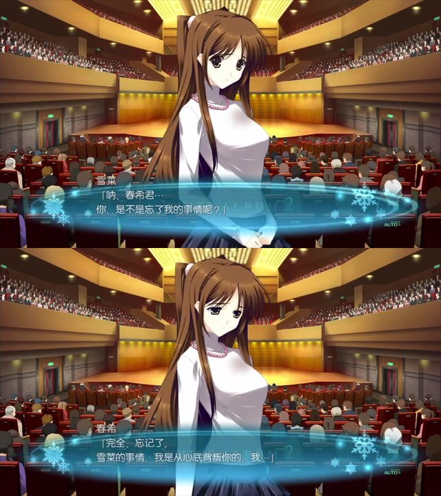
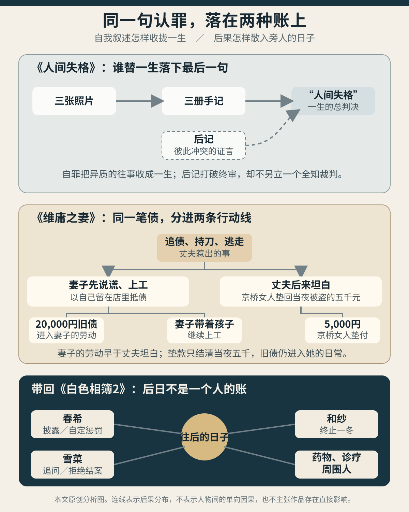

> **剧透说明**：本文涉及《白色相簿2》Coda 浮气线、冬马 True 与《不倶戴天の君へ》的完整剧情，并讨论太宰治《人间失格》（《人間失格》）、《维庸之妻》（《ヴィヨンの妻》）的结局。[^source]
>
> **内容提示**：下文谈到两部小说中的性暴力。文章只分析作品怎样安排见证、叙述省略与后果，不补写文本省去的过程，也不把这些暴力同《白色相簿2》中的自愿越轨相提并论。[^violence]
>
> **封面说明**：封面为本站原创概念图。墨迹不断加深一个人的自我判词，药、工钱、钥匙、工牌和清单则由不同的手放入另一页；它不是游戏画面，也不复原某个具体场景。
>
> **配图说明**：正文使用一张由两帧低分辨率 PS3 版实机画面组成的对照图，以及一张本站原创分析图。游戏画面著作权归 AQUAPLUS，实机录像由 xueyinhualuo 发布于 Bilibili；该素材没有开放许可，也未取得转载授权，仅作为紧贴文本的非商业评论引用。

音乐会还没有结束，春希已经把一冬发生的事说给了雪菜。

他交代了北方旅行，交代了自己同和纱发生关系，也说和纱已经决定从此不再见他。雪菜没有先问他准备怎样赎罪。她问的是一个更小的问题：和纱抱着他的时候，他有没有哪怕一瞬想起自己？

春希在心里给出的答案很清楚。他同和纱独处、同她亲密相拥时，雪菜的声音不止一次响起。正因他始终无法在心里把雪菜与和纱分开，才刻意闭起心，把自己弄坏。开口以后，他说的却是：“完全忘了。”[^affair]

*雪菜问春希在那一冬是否想起过自己；春希回答“完全忘了”。这句话同他此前反复被雪菜的声音侵入的内心叙述相冲突。PS3 版实机画面：©2012 AQUAPLUS / via xueyinhualuo, Bilibili。*

这句假话没有替春希减轻罪责，反倒把背叛说得更彻底。倘若承认自己想过雪菜，他仍像在向她求援，两人的关系也仿佛尚有余地；说自己完全忘了，便能把那一冬说成一场彻底的背叛，把自己钉在最坏的位置上。

他随后道歉，又告诉雪菜，无须原谅他，也无须接受他。这场道歉只是他的自我满足。他会把惩罚一直背下去，哪怕再度被责任感压垮。雪菜听懂了，却没有依他的安排宽恕他，也没有替他行刑。她几次叫停，最后说时间到了，请春希先听完和纱的最后一曲。

前四篇追过三个人怎样相连、怎样在缺席中保存第三人，也追过四条路线由谁发动、叫停和善后。[上一篇《结局以后，历史仍在场》](/posts/white-album-2-history-after-endings/)已经写到，浮气线结束后，雪菜同药物、诊疗、周围人的照应和时间一起，才把春希的生活接了回来。第二卷从这笔旧账开始：一个人把自己宣布成最坏的人，究竟担下了什么？他的罪名越重，旁人越容易只剩下三种位置：原谅他，惩罚他，或把他救起来。可在这些名目下面，仍有人出钱，有人照病，有人停下伤害，也有人第二天照常去工作。

太宰治的《人间失格》（《人間失格》）与《维庸之妻》（《ヴィヨンの妻》）正好从两端逼近这个问题。一部让男人把一生写成自己的失格史，另一部让妻子把诗人的痛苦换算成酒钱、病儿和工钱。它们不会替《白色相簿2》指出哪条路线正确，却能把“谁最有罪”改成一笔更难含混的账：谁说，谁付，谁有权回答，谁还得继续过日子。[^comparison]

## 把一生说成一个罪名

《人间失格》开头先摆出三张照片。

第一张是握紧拳头、挤出笑容的孩子；第二张是面容漂亮却像一张白纸的学生；第三张里的男人坐在破屋和火盆旁，脸已经无法给观看者留下印象。外层叙述者看不出三张脸怎样属于同一个人。三张照片彼此断裂，叶藏的第一册手记才把它们收进同一段“充满羞耻的一生”。

照片也不是未经解释的证据。外层叙述者把孩子的笑看成猿的皱脸，把学生的微笑看成造物，面对第三张照片甚至认不出一个可供描画的主人公。他在叶藏开口以前已经作过判断。小说因此没有在客观照片和主观手记之间排出真伪高下，而是先给我们一个满怀厌恶的观看者，再给一个厌恶自己的讲述者。两种目光都抓住了一些东西，也都可能把那个人收进自己的判词。

叶藏很早便说明，道化是他对人类“最后的求爱”。他怕人，又不能放弃人，只好不断做出能让家人、同学和佣人发笑的样子。这副面具骗过别人，也真是他的求生办法。只说他虚伪，会看不见他正靠道化与人来往；只说他自保，又会漏掉谁被他利用，还有哪些事被他瞒住。

这也解释了叶藏为何如此怕争辩。他把别人一句责备听成人类不可违抗的真理，仿佛只要回嘴，自己同对方之间便会裂开一道永远补不好的缝。到手记末尾，他甚至把不幸归结为没有拒绝的能力。道化维持了来往，也让直接的不同意见无处安放。别人笑了，他便暂时安全；别人若生气，他只能在心里把自己判得更重。

这种关系很难靠“摘下面具”解决。叶藏若忽然说出全部恐惧，听者未必因此获得答复的机会；他也可能把一场谈话变成所有人围着他的痛苦转。更实际的问题是，面具被看穿以后，两个人还能不能争辩，能不能拒绝，能不能让一句话在后来得到改正。

春希也总先把自己放进一个合宜的身份：纠错，补上工作缺口，替和纱处理伤脚，替恋人排日程。照料是真的，可他常要等到事情“非做不可”，才肯承认自己想接近谁。到了音乐厅，他又把自己判成应当退出的坏人。无论是无可挑剔地把事做好，还是把自己逐出雪菜的生活，他都省去了等她回答的时间。

叶藏的手记同样会在最彻底的自白里划定边界。药物成瘾、债务和绝望把他逼到末路，他决定给父亲写信，交代“全部实情”；句子刚说完，括号便补上一项例外：女人的事还是写不出来。被他称作全部的事实，仍由他决定哪些人和哪些伤害不进信里。

括号很短，作用却比长信更大。它没有否认叶藏此刻真想求救，也没有说信里其余事情全假；它让“全部”露出说话者亲手裁过的边。自白越长，听者越容易误以为未被提起的事情并不存在。叶藏坦白自己的药物和绝望，女人、债务怎样缠在其中却被留到信外。

音乐厅的坦白比这封信说得更多。春希交代了地点、关系和断绝，没有把雪菜蒙在婚约仍完好的假象里。这些话的分量不会因为他随后自罚便消失。然而他说“忘了”，又在同一场谈话中规定雪菜不必原谅、自己必须受罚、两人此后不应在一起。春希让雪菜知道了事实，却仍想连事实该怎样解释、两人该怎样收场也一并说定。

《人间失格》把这种收口推到尽头。叶藏进入精神病院以后，给自己下了“人间失格”的总判决。他不再分别追问幼年遭受的伤害、自己对常子和静子做过什么、良子的身体发生了什么、酒与药怎样把成本转给周围的人。不同来路、不同分量的事，都被缝进同一个身份：我已经不再是人。

这个判词很沉，甚至沉到不容申辩。叶藏把别人对自己的斥责当成人间真理，几乎没有反驳的能力；他对自己的裁决也采用了同一种口气。一个具体行为尚可停止、赔偿或重做，失格却是一生的资格判定。判得越彻底，后来越难有人逐项追问：你伤了谁，那个人怎样说，今天还能做什么。

小说没有让这句判词独占结尾。后记里的酒吧老板娘先说，人到了叶藏那样便不行了；接着又说是他父亲的错，最后称自己认识的叶藏“温顺而周到”，即使喝酒也像个好孩子。几项判断合不成一张终审判词。老板娘不了解叶藏全部生活，后记也没有把她升成全知裁判。她的出现只让三册手记无法替所有相识者说完最后一句。

三册手记和三张照片能够来到读者面前，还经过一条偶然的路。一个没有姓名和地址的包裹寄到京桥酒吧，在空袭中同杂物一起幸存；老板娘多年后才读完，又把它交给外层叙述者。叶藏想给一生封口，封口所依赖的纸张却落进别人的店、别人的战争记忆和别人的转交。后记不必知道完整真相，也能从物质上证明：一个人写完自己，文本仍会由他无法控制的人保存和解释。

老板娘的话既没抹掉手记里的伤害，也没有把父亲定成唯一祸首；她把手记之外的叶藏带回了结尾。读者因而要同时面对几种无法合并的叶藏：受过伤的人，伤过人的人，靠表演求爱的人，在别人生活里也曾温顺周到的人。任何一个名字都收不尽他的一生。

IC 结束时，春希与雪菜已在争抢罪名：一个说自己背叛了恋人，一个说自己先抢走了告白的位置。到冬马 True，和纱也把后来的再次背叛归给自己的软弱。这些自责各有根据，却不能合成一句“大家都有罪”。春希已经向恋人作出承诺，和纱知道这份承诺仍同他越界，雪菜先告白也没有替后来的两人作出选择。争着把事情全收进自己名下，反而会抹平每一步的差别。[^ic]

无论把一切归结为叶藏天生失格，还是说人人同样有罪，都会抹去每次伤害的性质与分量。《人间失格》的后记留下了另一条窄路：叶藏不必永远被逐出人间，手记写下的具体行为也不因一句“好孩子”而消失。

身份总判决到了这里已经松动，钱、工作和孩子仍不在画面中心。《维庸之妻》让债主在深夜敲开门，把“一个诗人为何如此痛苦”换成“明天由谁还钱”。

## 一句假话，几笔真账

《维庸之妻》开头，大谷深夜带着刀从家里逃走。追来的椿屋夫妇没有先评论他的天才、绝望或人格。男店主坐在破旧屋里，从三年前第一杯酒讲起：夫妻怎样进城做工，怎样攒钱开一间小店，战争、空袭和黑市又怎样改变酒的价格。当初把大谷带来的秋替他付过钱，另一位已婚女子也偶尔留下费用，更多欠账则留在店里。妻子这才知道，丈夫的名字在报刊和酒桌上流通，账却落在一对小商贩手中。

店主的长篇口述也有自己的偏向。他要向大谷的妻子证明损失，要说明夫妻已经忍耐很久，还顺便把一个让自己屡次破例的客人说成魔物。妻子没有因此得到一份绝对客观的丈夫档案。她第一次得到的是另一种丈量办法：哪次酒由谁付，谁拿经营本金填了缺口，哪位女人因大谷失去衣物和生活，店家为什么终于追到家门，大谷又为什么拔刀逃走。

人物评价仍会摇摆，账目却逼每一项关系留下痕迹。大谷可以同时是有名的诗人、让店主心软的熟客和多年不结账的人。这几个身份不必合成“真正的大谷”。妻子接下来要处理的，是其中一个身份已经给别人造成的现金缺口。

第二天，她没有筹到钱，也没有想好办法。她仍背着孩子去了椿屋，一见女店主便说，钱今晚或明天一定送来。她愿意留下做人质，也愿意在店里干活。叙述明说，这是一句连她自己都没想到的假话。

女店主露出惊喜，脸上的疑虑并未完全散去。到中午，男店主进货回来，提醒她钱没有握到手里便作不得准。妻子又请他等一天，随即向女店主借来围裙，招呼刚进门的客人。那句假话替她争来一天，也让她得以留在店里做事。她不再只在破屋里等丈夫回来，而是同店家谈条件，招呼客人，慢慢有了收入，后来客人也开始叫她“阿幸”。

假话从她嘴里顺畅流出时，她并没有在内心藏好一套周密方案。她先把自己说成有人担保的还款者，店家的迟疑和新客人的到来才慢慢把这个身份做实。她放下孩子，替女店主领回配给物，再系上围裙招呼客人。这些小事一点点填进那句空话，让它开始在现实里有了下文。

这个过程让妻子第一次在“大谷的妻子”之外，长出一部分属于自己的生活。她修整头发，添置化妆品，喜欢店里的忙碌，也能靠客人给的小费感到手上有钱。“阿幸”给了她一个在店里做事的名字；小说自始至终没有交代她的本名。她同大谷未办婚姻登记，孩子在户籍上也没有父亲。新名字扩大了她的生活，没有凭空产生财产、婚姻和身体上的保障。[^villon]

孩子也不只是账目里的一个名词。他将近四岁，身体却比别人家两岁的孩子还小，走路不稳，又经常腹泻发烧。妻子没钱带他看医生，外出又必须把他背在身上。到了椿屋，女店主抱过他，在妻子外出领配给物时替她看着，又给他一只空罐头当玩具。妻子能迈出家门，靠的不只是自己能干；她把孩子带进店里，店里的女人也替她分担了一阵照看。

这份行动没有凭空生出安全。店家先承担报案延后的风险，妻子把自己和孩子留在酒馆，也把身体放进顾客的目光与玩笑里。倘若钱没有出现，这句保证的后果会先落在他们身上。谎言改变了现实，它是否正当，仍要看这些后果落到了谁身上。

钱最后意外送来了。大谷当天闯进京桥一家酒吧，把偷钱、逃跑和前一晚的事一五一十告诉女主人。她担心闹到警察那里，替他垫付了五千元。丈夫说了真话，付钱的仍是另一个女人。

椿屋过去三年的旧账远不止五千元。店主让到两万元，妻子当场要求留下工作，以工资慢慢偿还。此后她每天背着孩子上班，大谷仍来喝酒，账照样由她结。大谷的坦白让五千元回到店里，妻子往后的工钱才真正用来还那笔旧账。

五千元和两万元之间，站着几名没有被写成竞争对手的女人。秋过去替大谷付过酒钱，秘密来店的已婚女人也曾留下过钱，京桥的女主人这次垫付现款，妻子则承担旧债。她们的付款使店家没有倒下，也使大谷一次次避免直接面对追偿。女性彼此没有公开争吵，大谷仍是这一圈善后的中心；有时正是几个人各自善后，才让那个始终欠账的人继续穿过她们的生活。

大谷的坦白使五千元回到椿屋，也把垫款的成本交给京桥的女店主；妻子的假话争取到时间和工作，又让店家、孩子和她自己先冒险。判断一句话，得看说话的人当时知道多少，那句话把事情往哪里推，几天以后又由谁兑现。

同一句话还会在时间里变质。“有人一定送钱”开口时没有事实根据，后来偶然兑现；“我会还清”开口时真诚，兑现方式却是妻子此后每日劳动。真假只说明句子在说出时是否合乎所知，责任还要追到暂缓报警、背孩子上班和继续欠账这些后果。

春希的“完全忘了”也应这样读。他知道自己没有忘。说真话会暴露他仍在两个女人之间分裂，也可能让自己抓住雪菜的爱不放；他说出相反的话，既伤害雪菜，又把自己推到最彻底的背叛者位置。这句话没有给雪菜新的事实，却守住了春希为自己定好的惩罚。

这里的分裂没有一张藏在假话后的“真脸”。春希心里仍依恋雪菜，开口又要斩断依恋，两边都属于他。前者让他无法真正忘记，后者让他能够继续自罚。内心旁白没有取消谎言，谎言也没有把依恋删掉；两句彼此作对的话，一起改变了雪菜的处境。

妻子同样无需被还原成一个更纯的动机。她起初不知道钱从哪里来，仍真心想救丈夫、保住店主，也想摆脱在家枯等的日子。工作使她愉快，又让她继续替大谷结账。几种愿望在行动中互相借力，后来产生的快乐不能证明她起初早有计划，旧债也不能证明她的快乐是假。

雪菜仍追着问。春希先说，无论怎样回答都改变不了背叛；她承认也许如此，仍继续问“答案呢”。她想知道自己是否在那一冬彻底消失。答案改变不了已经发生的事，却会改变雪菜如何理解这段关系。春希在说谎以前，已经先替她判断这个问题“没有意义”。

音乐会前的归途与分别中，和纱作了另一个决定。她亲手松开同春希的这段关系，要求他回到雪菜身边。游戏把这段回忆同末曲的演奏交错剪接：琴声仍在音乐厅响，和纱已经在另一个时间里把春希交给雪菜，甚至说只有雪菜能救他。她停下了自己同春希的越轨，也把照看春希的重担推给了最令她嫉妒的雪菜。止损与善后就此落在不同人身上。

一句话的真假，只是责任账的一栏。大谷说真话，京桥的女人付款；妻子说假话，自己和孩子进店工作；春希披露越轨，又用另一句谎言规定自己应当怎样被判。谁把事情说清，谁让伤害停下，谁承担钱与时间，谁有机会回答，从来不是同一个问题。

## 照护不能代人应允

和纱那句“只有雪菜能救他”，在分别时说得极真。她知道自己若留下，春希会继续沉入那一冬；也知道春希对雪菜的依赖并未消失。她为此离开，把自己无法做到的事托给雪菜。

一年后的《不倶戴天》却把“只有”拆开了。春希承认，没有雪菜，自己会一直坏下去；只有雪菜，自己一样可能一直坏下去。雪菜的支持、离开与回来，药物、诊疗、周围人的照应和时间，共同组成了恢复的过程。春希最后说得很朴素：雪菜不是万能的。[^aftermath]

两句话相撞，才看得见浮气线如何分配后来的日子。和纱负责离开，春希负责坠落，他们占据了悲剧最响的一幕；雪菜被指定为唯一的救人者，药物、诊疗和周围人则等在幕后。后日谈把悲剧台词遮住的生活分工补了回来：爱情可以给人回来的理由，却代替不了诊疗、复职以及时间本身。

和纱有权决定自己离开，也能从自己这一边结束这段越轨。雪菜要不要回来，要照料多久，却不在她能够安排的范围里。“只有雪菜能救他”于是同时装着两种力量：它是和纱对春希的了解，也是她替雪菜安排未来的越界。她最嫉妒雪菜，又亲口承认自己救不了春希；离开既是止损，也被她说成了救他的一部分。和纱的爱、嫉妒与自罚，就在这句话里互相拉扯。

雪菜也并非在听命善后。她爱春希，不肯把他完全交给和纱，也愿意在春希需要自己时重新走近。这些欲望给了她照护的力量，也让她更容易把自己耗尽。支持、离开与回来，是雪菜在不同时刻作的决定；中途撑不住，则显出一个人能承受的限度。她后来成为照护者，并没有抹去她作为当事人所受的伤，也没有夺走她回答的权利。

太宰两部小说中的女性也不断提供活下去所需的东西。《人间失格》里有收入、住处、家务、药物和收容；《维庸之妻》里有垫款、店铺、育儿和服务劳动。男性的痛苦写得极响，这些钱与劳动却常被写成爱情、善意，或女人天生会照料人。一旦只问男人是否真心悔恨，提供这些东西的人就会退成他悔恨深浅的证人。

静子让叶藏住进自己和女儿的公寓，替他同故乡与朋友交涉，又把他给孩子画的漫画拿到杂志社。漫画有了连载和收入，叶藏才买得起酒与烟。叶藏把这段生活称作近似男妾，把自己的依赖看成耻辱；静子的工作、编辑关系和奔走依然有自己的重量。她替一个无处可去的人找到职业，也承担了他把收入继续花在酒上的后果。

药店的寡妇又提供另一种照护。她自己拄着拐杖，家中还有病重的亲人，仍替叶藏配药、讲解用法，劝他戒酒。她后来把吗啡当作相对少害的替代物，叶藏则借亲近、哀求和欠账不断增加用量。她的关心救过急，错误判断与叶藏的利用又把危险扩大到成瘾和债务。照料并不天生无错，其中可能同时有关心、误判、权力和被利用。

静子有编辑部和收入，药店寡妇掌握药物，良子承担家务却看不懂药盒上的洋字，酒吧老板娘保存手记。她们手上的东西不同，拒绝叶藏的余地也不同。手记常用“女人总想替我做点什么”把差异收成自己的魅力与不幸。一旦回到住处、稿费、药品和家务，每个人便重新分开了。

良子遭受侵害的一场，把这种叙述倾斜写得最尖锐。堀木发现后叫叶藏去看。叶藏站在楼梯上，忘了去救良子，随后独自逃上屋顶。良子想说“他说什么都不会做”，叶藏立即阻止她继续。此后的大段内心转向叶藏自己的恐惧、信赖是否有罪，以及这件事怎样毁掉他对人的最后信心。文本明确写良子受到侵害，也写她从此对叶藏的神色战战兢兢；她自己的经验只来得及开一个句头。

叶藏目击以后崩溃、饮酒、疑惧，最后服药自杀未遂。可叙述随即把良子的身体变成他判断自己与人间关系的材料。连“原谅不原谅”也先由丈夫设想，良子没有取得同样长的篇幅说明她经历了什么，以后又要什么。一个人的自我创伤写得越完整，另一个人的伤越容易只剩下证明他崩溃的功用。

《维庸之妻》已经让妻子亲口讲述，仍没有把雨夜的经历完整交给她。她先拒绝一名年轻工人的护送，对方还是一路跟随；深夜他再次返回，请求只在玄关睡到首班车，妻子允许了这一件事。小说跳过中间过程，只用一句被动的“落入那男人手中”写天亮前发生的侵害。她第二天表面照常背着孩子上工，只说明日子还得过；先前那项有限允许从未包括后来发生的侵害。

翌晨抵达椿屋，她看见阳光落在大谷的酒杯上，觉得很美。小说没有安排一场清楚的倾诉或追责，雨夜就被日光、酒杯和营业接了过去。“表面照常”几个字把断裂留在里面：店要开，孩子要带，丈夫仍在喝。继续工作本身就是后果的一部分，日常没有替人宣布伤口已经过去。

小说结尾，大谷看见报纸称他为“非人”，辩解自己偷走五千元是想让妻儿过个好年，正因为他不是“非人”才会做出这种事。妻子没有欣喜，也没有跟着报纸和大谷争辩他究竟配不配作一个人。她只说：“非人也无妨。我们只要活着就好。”[^wife-end]

这句话拒绝了人格审判，却没有替大谷免债。妻子还在店里工作，孩子还得随她往返，她的法律身份和身体边界也没有因一句“活着就好”获得保障。活着是一条不把人逐出人间的底线，不是无限容忍的收据。大谷可以不是“非人”，偷钱、欠账、长期缺席和妻子所经历的事仍各有分量。

游戏自己也没停在“雪菜救了春希”。浮气线终点先让雪菜用一周哭完“足以哭一年”的份，随后回到春希房间，陪他熬过整整一年的恢复期。春希把她称作最愚蠢也最坚强的女人，说自己被她护着，离开她便不知道人生朝向哪里。这是春希眼中的雪菜，不是恢复过程的全部。

复职场景把其余部分写进了工作。春希回到编辑部，准备从头努力，又承诺将来一定报答大家。同事打断他，免得复职第一天又变成一场还一辈子人情的宣誓。有人赶着交稿，有人要出差，欢迎会照开，酒不劝，春希要提前回家便让他走，稿子仍接着做。乌龙茶、离席时间和当天的工作，给了他真正待得住的一天。春希这才说，自己回到了主场。

药物、诊疗和复职限制还有一个爱情无法代替的作用。它们不要求春希先证明自己值得被爱，也不要求雪菜先原谅。饮酒受限、提前离席和当日工作都按身体状况而定，不以两人今天是否和好为转移。有了这些条件，雪菜中途撑不住便不再等于她抛弃了一个只能靠自己活下去的人。照料因而可以暂停、分担和重新接手，而不是一旦接下便永久不得退出的爱情使命。

*认罪可以收拢叙述，后果却会散入钱、劳动、身体与旁人的日常。本站原创分析图；连线表示后果分布，不表示作品之间存在直接影响。*

照料人也会从中得到东西。妻子喜欢“阿幸”的新生活，雪菜愿意被春希需要，同事也愿意把熟悉的新人迎回来。喜欢店里的忙碌，不会使大谷的旧账一笔勾销；雪菜回来，也没有替她对和纱的交托表示同意。照护者可以爱，可以需要，可以在中途撑不住，也可以继续反对那些把善后推给她的人及其说法。照护从来没有替她应允这一切。

## 罪怎样落进往后的日子

冬马 True 里，春希终于把说出口的选择落到工作、婚约和住处上。他没有留在音乐厅里等雪菜宽恕，也没有再等和纱替他叫停；他自己去结束婚约，重排工作和住处。自罪在这里没有取代行动，而是催着他把选择执行到现实里。

春希先向编辑长提交辞呈，再告诉直属上司，手头的工作会做完。公司已经在他身上投入训练，同事也把他当作会长期留下的人，这封辞呈会让公司和同事承受实际损失。春希愿意把工作收尾，却只说是个人原因，始终没有告诉他们为何离开。

他又应小木曾夫妇之邀，在雪菜被朋带出门时去了她家。雪菜母亲特意请朋把她带开，好让父母在她缺席时同春希谈话。春希亲口撤回求婚，承认自己爱上了别人，说明雪菜没有错，并宣布四月起去维也纳生活。他没有说出和纱的名字，孝宏倒是在客厅外听见了一部分。春希把长期拖延的决裂带进了家庭，承受了父母的失望。他在心里催着雪菜父母尽快惩罚他、结清这笔账；孝宏在门外听过一部分谈话，随后以拳头回应。

撤回虚假的婚约，是终止一份已经无法履行的承诺；辞职与迁居准备，是为自己的选择重排职业与生活。这些都属于执行决定，应当记在春希名下。自我处罚则在另一个时刻出现：他开始把失去工作、遭人痛打、同多数旧关系断裂看成负责的证明，仿佛自己足够痛，就可以替雪菜定下偿还方式。

这几件事的完成程度并不相同。工作一项后来确实走到了交接：春希完成一期增刊的全部校对，整体工作转给松冈；松冈准备在当周接手，也直说自己的工作量会翻倍。辞职造成的负担没有消失，只是具体落到了接手人身上。维也纳仍是四月开始的计划；小木曾家听见了足以理解关系断裂的部分说明，雪菜没有在那间客厅亲自回答。冬马 True 让决定走出了内心，还没让每一个受影响的人都进入同一场协商。

辞呈迫使春希放弃自己喜欢的工作，也让编辑部失去一个培养中的新人。撤婚使小木曾一家不必继续筹备一个假的未来，也让雪菜面对五年关系、刚刚成立的婚约与家庭信任同时破裂。这些代价落在不同人身上，彼此之间没有自动换算的比例。孝宏打得再重，也不会因此让雪菜获得完整谈话；春希失去的东西再多，也不会自动等于雪菜想要的回答。

和纱随后也试图给自己定价。她告诉雪菜，自己愿意放弃钢琴，放弃几乎等同生命的钢琴家生涯，作为两次背叛的代价。雪菜当场说这没有意义，和纱也承认只是自己的满足。春希后来再次制止她，叫她丢掉“为了得到重要之物便必须扔掉另一件重要之物”的想法。钢琴若仍能使她幸福，就继续弹下去；要不要放弃钢琴家生涯，可以由她以后慢慢判断。[^true]

这组对话比一句“牺牲得还不够”更接近责任。和纱愿意付出最痛的东西，雪菜仍有权说这不是自己要的赔偿。伤害者可以主动承担成本，不能独自决定什么东西等价于受伤者失去的生活。否则，自罚越壮烈，受伤者越难拒收。

“自我满足”在这一条主线上说了两次。浮气线的春希用它形容自己的道歉与终身受罚，冬马 True 的和纱用它形容放弃钢琴。两人都知道自己正在替别人设计结案，却没有因此立刻停止。这个词也不能把道歉、辞职或放弃全擦成虚假。它点出的是定价权错了位置：付出者可以提出代价，承受伤害的人可以拒收，代价最终造成什么，还要留给以后的日子检验。

雪菜两次都拒绝被推入预设位置。音乐厅里，她没有按春希要求成为宽恕者或处罚者；面对和纱，她也没有因牺牲足够巨大便收下钢琴。她的拒绝不是对另外两人的痛苦作真假判决。她只是保留了一件本来就属于自己的事：怎样回答伤害，不由伤害者的自我判词决定。

把三部作品放在一起，后来账目大致如下：

| 发生的事 | 主要行动者 | 已经改变的现实 | 这一步尚未回答 |
| --- | --- | --- | --- |
| 披露一冬关系并道歉 | 春希 | 雪菜取得旅行、身体关系与断绝等事实 | “完全忘了”的矛盾；雪菜怎样理解、是否继续 |
| 分别时结束一冬，并完成演出 | 和纱 | 秘密关系停止，她之后离开日本 | 雪菜是否愿意接手春希；和纱以后怎样承担 |
| 叫停春希的自罚结案 | 雪菜 | 坦白没有立刻被宽恕或惩罚收口，三人听完演奏 | 她随后要付出多少照护，能否中途退出 |
| 支持、药物与诊疗、复职 | 雪菜、春希、医护与周围人 | 症状逐步缓解，日常和工作重新接上 | 爱是否等于原谅；一次恢复能否保证不再复发 |
| 辞职、撤婚与准备迁居 | 冬马 True 的春希 | 工作交接、婚约与家庭关系开始改变 | 完整告知、雪菜的独立答复与迁居后的长期安排 |
| 拒绝以放弃钢琴偿罪 | 雪菜，后来还有春希 | 和纱不能用最重自罚替受伤者定价 | 三个人怎样处理长期历史和不同关系 |

这张表不会告诉人应该选择谁。它只把一句“我来负责”拆回几件可以查验的事：伤害有没有停，相关的人知道多少，谁得到回答的工夫，钱、工作和身体成本落在哪里，治疗与日常能否由多人接续。

责任要落到具体后果，不能拿自责有多痛充作秤砣。自责有时催人停下越轨、辞职告别；一旦归结为“我就是坏人”，它又替伤人者占住了最后一句。付出者可以拿出代价，受影响的人有权拒收，也有权在第二天改口。

《维庸之妻》那句“只要活着就好”，给这笔账留下了底线：叶藏、大谷、春希和和纱都不必因为不纯洁便被永远逐出人间。良子、妻子、雪菜、孩子、店家和同事各自做过什么、承受过什么，仍须分开来记。人可以继续留在世间，做过的事仍要一笔笔记清；两者并行不悖。

春希在音乐厅想把自己的刑期一次定完。雪菜没有宣布无罪，也没有接过法槌。她让他先留下，听和纱把最后一曲弹完。随后和纱亲手松开，雪菜后来回来，药物与诊疗继续，同事在欢迎会上不再劝酒。这些事由不同的人做成，彼此也不能替代。后来的日子因而不再只属于罪人的手记。

后果账已经看见了付款、照料与停损，雪菜那个被春希判作无意义的问题却仍在原地。下一篇将从《心》《其后》《门》和 Coda 菜单重走选择发生的次序：谁先知道，谁抢先开口，谁直到结局前才等到回答。

[^source]: PS3 版资料及编剧署名见 [AQUAPLUS《WHITE ALBUM2 幸せの向こう側》产品页](https://aquaplus.jp/wa2/)；日文台词按本地保存的游戏与追加故事脚本逐行复核，公开检索入口见 [MAO Translations Script Browser](https://mao-tls.github.io/white-album-2/script/)。太宰治《人間失格》与《ヴィヨンの妻》采用青空文库日文底本，参见两部作品的[图书卡 301](https://www.aozora.gr.jp/cards/000035/card301.html)与[图书卡 2253](https://www.aozora.gr.jp/cards/000035/card2253.html)；本文中文短引均据日文重译。
[^affair]: 浮气线音乐厅坦白、雪菜追问、春希内心承认多次听见雪菜声音却开口说“忘了”、春希称道歉为自我满足，以及雪菜叫停谈话并要求听完和纱演奏：wa2:coda:3908:491–610。和纱在与春希分别时终止一冬、把春希的恢复托给雪菜，脚本将这段回忆与末曲交错呈现：3908:725–797。雪菜一年支持与浮气线终点：3909:89–192。
[^comparison]: 本文讨论同一叙事传统中可以互相校验的结构，不主张丸户史明直接受《人间失格》或《维庸之妻》影响。固定小说与多路线视觉小说也有形式差异：前者可用叙述框架保留冲突证言，后者让玩家操作部分选择，却都可能把决定与善后分给不同的人。
[^ic]: IC 结尾春希与雪菜争论谁先伤害三人关系：wa2:ic:1013:89–181。和纱将再次背叛雪菜归给自己的软弱，见冬马 True：wa2:coda:3108:386–396。
[^villon]: 《维庸之妻》中孩子的病弱与无钱就医：aozora:000035:002253:p000015–p000016；妻子与大谷未办婚姻登记、孩子在法律上无父：p000089；妻子说谎、女店主照看孩子、妻子借围裙上工：p000099–p000125；她以“阿幸”之名继续工作：p000165–p000172。
[^violence]: 《人间失格》中堀木叫叶藏观看、叶藏僵住并逃离、良子的话被打断，以及叙述转向叶藏的信赖危机，见 aozora:000035:000301:p000671–p000695。《维庸之妻》中妻子拒绝护送、允许对方仅在玄关留宿、过程省略、侵害与次日上工，见 aozora:000035:002253:p000192,p000205–p000227。
[^wife-end]: 大谷为偷钱动机辩解，妻子回以“非人也无妨，只要活着就好”：aozora:000035:002253:p000239–p000242。
[^aftermath]: 《不倶戴天》中春希说明雪菜重要却并非唯一条件，并列药物、诊疗、周围人的理解与尽力以及时间：wa2mas:kazusa_normal_extra:4009:637–646。带限制复职、同事约定不劝酒和准许提前离席、春希确认回到工作现场：4009:1081–1125。本文只取这两处窄证据，完整电话冲突与病程见上一篇。
[^true]: 冬马 True 中提交辞呈、承诺完成手头工作又隐瞒原因：wa2:coda:3105:19–69；完成一期增刊的全部校对、将整体工作转交松冈：3108:87–121。撤回婚约、在雪菜缺席的客厅向小木曾家作部分说明、孝宏在客厅外听见以及春希宣布迁居计划：3107:114–328。和纱提出放弃钢琴及钢琴家生涯作为代价、雪菜拒绝、和纱承认只是自我满足，以及春希随后反对用一件重要之物交换另一件：3108:386–414,530–572。
