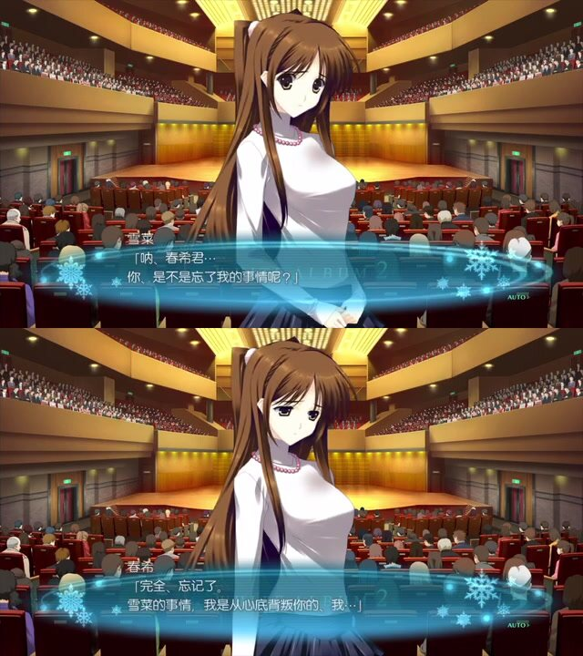

> 本文涉及 Coda 浮气线、冬马 True、《不倶戴天の君へ》，以及《人间失格》《维庸之妻》《祝福》的结局与性暴力情节。日文短引由本文译出；游戏脚本与文学底本见各节脚注。封面为原创概念画，正文对帧取自 PS3 版实机录像，用于相邻对白的评论。[^sources]

《维庸之妻》里，妻子有一天问丈夫：“为什么从前不这样呢？我现在很幸福。”[^wife-talk]

所谓幸福，并不阔气。她到小酒馆做事，忙过一天，有时同丈夫走夜路回家。做工得来的小费、重新梳好的头发、改过的和服，以及女店主送的两双白袜，都进了这份快乐。此前她在冷屋子里照看病弱的孩子，等着很少回家的丈夫。如今街上有了自己要去的地方，事情做得熟，人也会招呼她。[^wife-work]

丈夫却把话说得很大：“女人没有幸福或不幸；男人则只有不幸，总在同恐惧作战。”[^wife-talk]

这几句话很像为世间揭去了一层薄幕。可是幕一揭开，刚才说话的女人倒不见了。她挣的小费不见了，白袜不见了，连她已经说出口的幸福，也须听候丈夫解释。她没有同他辩论到底，甚至顺着想了一想；只是并不很懂，便说自己还愿意在那里做事，店里的人待她好。

丈夫又说，店里的人肯让他喝酒，不过是想从他身上赚钱。妻子刚说自己的生活，话头又转回了他。

妻子没有否认店里也要赚钱；但她说，事情不全是这样。[^wife-talk]

本文想从这个“不尽然”读回《白色相簿2》。春希说自己罪无可赦的时候，说中了什么，又遮住了什么？叶藏在手记里将自己逐出人间，读者若照单收下，会不会也让一些已经发生的事、一些正在说话的人退到暗处？[上一篇《人间有味是清欢》](/posts/white-album-2-history-after-endings/)已经看见照料怎样进入日常。这一篇还要问：人能不能不让“罪人”二字替自己安排往后的生活？

## 如临深渊，如履薄冰——《诗经·小雅·小旻》

叶藏小时候，父亲要去东京，问孩子们想要什么礼物。轮到他，他答不出。倒也并非什么都不喜欢；比起父亲后来提的玩具，他宁可要书。可真轮到自己开口，他的愿望反倒说不出来。父亲试着提起供孩子玩耍的狮子头玩具，他仍没有回答。看到父亲失望的样子，他害怕得坐立不安，夜里偷偷翻开父亲的手帖，在记礼物的地方写了“狮子舞”。[^gift]

父亲后来在东京的玩具店翻开手帖，发现这几个字，很高兴。回家后，他向母亲讲起这件事，叶藏在孩子们的房间里听见了：这孩子原来这么想要。

愿望在这里绕了一道弯。叶藏想要的，是父亲看见一个想要狮子头的儿子；父亲看见的，却是儿子终于写出了真正想要的礼物。两人都得到了片刻的安稳，安稳又恰由彼此理解的错位做成。此后要维持它，叶藏便须继续让自己像那个儿子。

把叶藏说成戴着面具的人，容易使人以为面具底下早藏着一个完好的真我，只要摘掉面具便能看见。但这一次，连他自己的欲望也在父亲的问话里失去准头，又在想象父亲的期待时取得形状。问题已经不只是他怎样伪装，还关乎他想要什么、又怎样学会想要。

齐泽克解释拉康的幻想概念时，着重指出，幻想给人的不只是一个想得到的东西，也是一种欲望的安排：我在别人的愿望里算什么，怎样才会被需要，怎样才不至于被丢开。叶藏夜里补写的那几个字，正可从这里细读。他并未先知道父亲心里全部所想，再实行一个周密骗局；他在父亲失望的脸色里，替自己找到了一个可以安身的位置。[^fantasy]

“道化”，也就是扮丑逗人发笑，有两面。叶藏把它称作自己对人类“最后的求爱”：他害怕人，又不能舍弃人；做出可笑的样子，至少还能同他们待在一起。但人们果真笑了，愿意接纳的又仿佛只是那个可笑的样子。他越熟练，越难说出一个不带笑的要求。[^clown]

竹一打断了这种熟练。体操时，叶藏故意摔倒，众人笑起来，竹一却说他是故意的。叶藏害怕的，不只是逗人发笑的把戏被识破；他靠它换来的那点安全，也随之露出破绽。于是他想接近竹一，看住这个危险的知情人。

后来两人淋了雨，竹一耳朵疼，叶藏便用棉花蘸酒精，仔细替他清理。他把这个动作也说成自己的诡计，说其中带着假仁假义的用心。竹一却预言，他以后会讨女人喜欢。两人亲近到有过膝枕这样的举动，可他们对这份亲近的理解并不相同。叶藏没有因此放下戒心，反而继续辨认自己的阴暗。[^takeichi]

叶藏确实想看住竹一；他对竹一的体贴里，也藏着这层心思。但这个目的仍解释不了两人当时怎样坐着、他怎样放轻动作、竹一又怎样接受照料。动机只能解释动作的一部分；若把它当作全部，动作在两人之间发生的事便又被抹平。叶藏只肯把自己说成“可鄙”，好让前后看起来一致；叙述里那些不一致的细节，反而格外值得停留。

叶藏给自己下的判词，能看出他怎样理解自己，却不能概括他整个人。“我是不配做人的人”也得当作一句话来听：他说这话时是在对谁说？它整理了哪些经验，又挡住了哪些经验？“失格者”这个名字当然会影响叶藏怎样看自己，却不能免去我们把它同他写下的事对照起来看。

若只在一个坏人身上找几件好事，凑成较高的总分，人物仍是一张等待结算的成绩单。更要紧的是，他对自己的看法能不能随自己做过的事而改变。如果一个人做了新的事，旁人仍只把它解释成旧本质的证明，那么所谓深刻，就不再需要听他说什么、看他做什么了。

## 为君翻作琵琶行——白居易《琵琶行》

手记里也有重新生活的片刻。叶藏同良子一起生活后，曾戒酒，也画漫画；晚饭后两人去看电影，或到咖啡店坐坐，有时还买花回来。他望着妻子，有时觉得自己也许能渐渐成为人。支持这段日子的还有京桥酒吧的女主人。所谓重新做人，在这些段落里有工作、旁人的帮助、散步和相处的实际内容。[^yoshiko-life]

然而叶藏又把良子放在一个过分洁净的位置上：她不疑人，她的信赖没有污点。他曾告诉她自己从前做过的事，她只当作笑话。两个人朝夕相处，对于这些话究竟有几分真实，所知仍不相等。

后来良子遭人侵犯，叶藏被堀木叫去观看，惊呆，退走。他的痛苦极深，却迅速被一个问题占住：自己所信赖的那种纯洁，究竟还能不能存在？良子上来，刚说到对方曾保证不会怎样，他就打断她，让她别说了，说她不会怀疑别人，叫她坐下吃豆。[^yoshiko-harm]

“你是不会疑心人的”这句话听来像体谅，也确实不是在指责她。但她原来要说明的经过没有说完。她在何种保证之下放松戒备，对方怎样利用了它，她此刻需要怎样被听见，都让位于丈夫关于信赖的判断。此后她怕他的举动、看他的脸色，原先能使她发笑的道化也失了效。叶藏在问“信赖有罪吗”，良子却正同侵害之后的恐惧过日子。

读到这里，不能只看叶藏的象征世界怎样倒塌，还得问：他把相信人间尚可安身的希望寄在了谁身上？他把良子的信任当成这份希望的凭据；良子遭人侵犯，也就容易只被他看成凭据的破灭。良子原本并不欠叶藏一份守住信赖的责任；是他的期待，把她放到了那个位置上。

叶藏也在手记里写到，自己小时候曾遭家中的男女佣人侵犯。那时他已经学会用道化应付周围的人，却不敢把受害的事告诉父母，也不知道还能向谁求助。这个孩子需要被保护；后来没能听完良子的话的丈夫，则需要为此刻怎样对待她负责。两件事落在同一人身上，不会相互作废。若把全部经历都收进“我从来就是坏的”这句总判词里，既可能把他遭受的侵害也算作他的罪，又可能把他后来亏欠别人的事藏进一种无从追问的命运。[^yozo-child]

鲁迅《祝福》写了另一种处境。柳妈追问祥林嫂“后来怎么竟然依了”，已经把被迫改嫁说成她自己的选择。祥林嫂回答：“你倒自己试试看。”这几字里有别人不肯设想的身体处境，也有她尚能回敬的一点力气。柳妈接着劝她，何不抵抗得更彻底，甚至索性撞死，又讲起再嫁之人死后所受的刑罚。后来祥林嫂还是去捐了门槛，交出积存的工钱，希望人们不再把自己看作不洁。冬至祭祀时，她精神比往常好，去拿酒杯筷子，四婶却照旧拦住她：“你放着罢。”[^zhufu]

倘若在这里问，祥林嫂是否用赎罪代替了真正的责任，问题就错了。使她必须赎罪的那套判法，本身在伤害她。她曾被强迫，又被要求用拼死抵抗证明清白；侥幸活下来，便要承担没有死去的污名。捐门槛所许诺的洁净，又不能替她取得触碰祭器的资格。她交出去的是真钱，收回来的资格却仍由别人说了算。

因而“不要陷于自责，要负起责任”并非到处适用的好话。先要辨明责从何来。强加给人的罪名，需要抵抗；实际伤害了别人，就得说明并改正；伤害者若把自己整个人判作不可挽回，就又多做了一步。这一步看似把责任压得更重，却让人无从改起。

这也改变了“同是天涯沦落人”的分量。《琵琶行》里，弹琵琶的女人先讲自己的经历，诗人才说出这个“同”字，又讲自己的迁谪。相遇并没有使两段人生变成同一段。沦落可以使人听见别人，不能先替别人规定为何沦落，更不能把被伤害与伤害人统称为同一种失德。[^pipa]

## 知我者，谓我心忧——《诗经·王风·黍离》

《人间失格》没有把最后的判断只交给手记。

小说先让一个叙述者看三张照片。他看这三张照片时都觉得不安：一张是孩子的笑脸，一张是青年的俊秀面容，还有一张是后来那张面目平淡、让人记不住的脸。叶藏还没开口，读者先听见旁观者对“这个人”的判断。随后读者才进入手记，跟着叶藏一遍遍为自己寻找解释，直到他被送进医院，写下“人间失格”。[^frame]

若只读到这里，照片与手记似乎可以互相作证：旁人早从照片里看出他异样，叶藏最后也把自己判作“失格”。可是从照片认出一个人的本质，本来就是外层叙述者的判断。叶藏又把住进病院想成自己被公开逐出人间，好像门一锁上，他是否还有资格做人就有了定论。两个判断相接，并不使其中任何一个自动成为事实。

后记里，京桥酒吧的女主人记得另一个叶藏。她记得他体贴、温柔，说他即使喝酒，也是个像神一样的好孩子。她也说过，叶藏这样的人恐怕不行了。外层叙述者说，手记若都属实，换了自己也会把叶藏送进病院；女主人则怨他的父亲。单凭一位善良见证人的判词，也安顿不了这件事。照片、手记、往来过的人，各自带着所见与所不见，继续争论这个人究竟怎样。[^postscript]

女主人的话值得听，因为她见过叶藏平日怎样待人。它不能抵消良子遭受的侵犯，也不能使叶藏幼年遭受的侵害变成误会。同样，叶藏受的苦不因他的叙述有所偏向而减轻。他把自己说得一无是处，难以开口的恐惧也因此有了声音；读者会被打动，自有其理由。正因这声音有力量，更须分清：它让我们走近叶藏的痛苦，却不能证明他对旁人的讲述句句都可信。我们要放下的，是靠一句总判词同时解决这些不相同之事的愿望。

人可以把自己固定在已有的身份里，用“我就是这样”逃避以后还要怎么做。人也会认真守住“坏人”这个身份。一个说自己处处无瑕，一个说自己处处不可救，看起来相反，却都可能让后来发生的事只能替既定的名字作证。

但自罪为什么会有这样大的吸力？因为它虽然使人痛，也替人规定了一个位置。只要我受得够苦、说得够重，旁人便应当知道怎样对待我：惩罚我，离开我，或来证明我其实没有那么坏。难以预料的关系，于是变成了一场有角色、有台词的审判。连对方的安慰，都能被我接成自己不配得到安慰的新证据。

齐泽克讨论超我时指出，舍弃本身也能带来满足。人不再为了做成某件事才作出牺牲，反倒把服从命令本身当成价值；失去得越多，就越能确认自己仍在服从某个绝对要求。这不等于受苦的人暗暗觉得疼痛舒服。它可以表现为：一个人终于认定自己就该受罚，却必须继续受苦，才觉得这个判决一直有效。[^superego]

放到自我定罪上，关键不在自责有几分真心，而在它肯不肯让事情发生变化。如果没有一种具体的改正可以让这场惩罚结束，受害者怎么回答都改变不了自罚，后来的善行也只证明“带着罪活下去”，那么自罪已经在供养自身。人或许诚恳地请求受罚，却不再肯让后来发生的事改变自己同别人的关系。

## 岂不尔思，子不我即——《诗经·郑风·东门之墠》

浮气线的音乐厅里，春希告诉雪菜自己同和纱去了北方、两人发生了关系，也说和纱已决定不再见他。越轨这件事，他没有再含糊。不能因为春希后来要处罚自己，就把整场坦白改称为一场虚假的演出。[^confess]

可是雪菜问的，偏是春希没有替她选好的问题。

她问他是不是忘了自己；又把问题说得更明白：同和纱亲密相处时，是否有一刻想起过她。春希觉得这种追问没有意义，因为无论怎样回答，背叛都已经发生。雪菜承认或许如此，还是要他答。[^question]

从判断越轨是否发生来看，春希的理由没有错。想起了恋人，仍然可以背叛恋人；记挂不使行为变成无辜。但雪菜问的显然不止罪名成立与否。她想知道，自己在他那段经历里究竟怎样存在。身体上的亲密发生时，过去的相处有没有被整个抹去？这个答案会影响她怎样理解自己和眼前的春希。即使春希确实有罪，这个答案仍然重要。

春希在内心知道，自己不止一次想起雪菜，和纱在身边时，她的声音仍会闯来。他正因为无法把两人分开，才闭起心来。可是说出口时，他回答一直忘了她，自己从心底背叛了她。

*对帧保存了“是不是忘了”与“完全忘了”的问答字幕；具体追问和春希相反的内心叙述，见脚本 3908:546–568。©2012 AQUAPLUS；实机录像由 xueyinhualuo 发布于 Bilibili。*

这句谎言替他加重了罪名。承认自己曾想起雪菜，就得承认他仍爱着她，却又伤害了她；没有忘记她，却还是越了轨。这样的春希，没法用一句话判清。回答忘了，就可以把整段关系压成彻底背叛，把自己安排成雪菜最该抛弃的人。他不愿再给她添一重难受，却仍替她决定该听见什么。

自罚在这里又造成一重具体伤害：已经受伤的雪菜还得听一份失真的交代。这与坦白那些真实事情的作用不同，不能因为两者都出自痛苦，就算作同一种真诚。这句话既然说给雪菜听，就要看她因此知道了什么，又被瞒下了什么。

春希随后说不必原谅，不必接受；这只是自己的满足。他在心里也知道，无论怎样罚自己，都对雪菜没有帮助。偏偏知道这个道理，还不足以使他停止安排自己的刑罚。雪菜担心他会再度垮掉，他仍不愿把期待压到她身上。苦心与蛮横挤在同一个地方：他不想再向她讨取，却连她主动问话的意义也一并否了。[^penalty]

雪菜叫停谈话，让他先听和纱的最后一曲。这里没有一纸无罪判决，也没有照他的意思宣告永不相见。她把眼前还在进行的事放回两人之间。春希想把自己此后一生说完，雪菜先叫他留下来，把这一刻过完。

这场谈话先改变了一件事：春希的自我判决没能成为谈话的终点。受伤的人还有自己的问题和担心，也有权不按春希的说法作答。

## 己欲立而立人——《论语·雍也》

冬马 True 让这种分歧变得更直接。春希到小木曾家撤回求婚，谈话时雪菜不在场。他愿意承担父母的失望，亲口说明关系发生变化；与此同时，他在心里催着这场审判快一点，希望认罪、受罚，早些从这里解脱。实际的说明与求一个了结的急切，可以同时存在。[^family]

孝宏听见谈话，冲出来打了春希。倘若顺着春希的自罪读下去，这几拳很容易被算作他应得的惩罚。父亲却喝止儿子，说不能打人；他向春希道歉，说如果伤势需要就医，医药费由他全付，然后要春希再也不要到这个家来。[^father]

拒绝春希与制止殴打，是同一个父亲在这场谈话里做的事。前者是拒绝继续这段家庭往来，后者是承认儿子动手仍须负责。春希伤害了雪菜，不会因此成为谁都可以随意打的人。父亲为儿子动手道歉，也不等于撤回“不许再来”的决定。拒绝往来和制止伤人各有分寸，谁受的苦都不能拿来抵账。

和纱提出放弃钢琴，又把最重的东西摆上了桌。她愿意舍弃几乎等同生命的事业，作为背叛雪菜的代价。雪菜说，没有意义。和纱也知道这只是自己的满足。[^piano-offer]

为什么没有意义？钢琴对和纱来说极其重要，失去它可以证明她愿意付出极大的代价。但雪菜失去的并不是和纱的钢琴。她被背叛的信任、婚约、原来期待的生活，不会因为和纱也毁去一项珍贵之物就获得归还。两个人各有损失，并不因此形成一笔等价的偿还。

春希后来让和纱别再把“得到一样重要的东西”和“失去另一样”绑在一起。钢琴若还会使她幸福，就继续弹；若往后不再需要，也可以重新判断。她现在不知道答案，可以等回去以后慢慢想，眼下先把明天的演奏做好。[^piano-later]

这样一来，钢琴不再只是证明和纱愿意受罚的刑具；她仍可以弹，可以喜欢，也可以留待以后再决定要不要继续。和纱与春希仍有实际责任，责任却不必以摧毁和纱继续生活的能力来证明。雪菜也保留了拒收这份牺牲的权利，不须因为对方舍得太多，就被迫赞许她舍得够多。

因而“我还应该失去什么”，与“你受的伤需要怎样面对”，有时走向相反的地方。前一个问题可以由我不断加码，越加越显得郑重；后一个问题却须容许你说，这不是我要的，或者此刻我还不能回答。承担责任的人有主动改变的工作，却没有独自宣布等价、宣布痊愈的权力。

## 衣食当须纪，力耕不吾欺——陶渊明《移居》其二

回到《维庸之妻》，那位说自己幸福的女人，起初也是去替丈夫收拾残局的。

大谷从酒馆抢走五千日元，店主夫妇追到家里。他拔刀威吓，妻子怕双方受伤，拦住追赶的店主。那笔钱是店里刚收来的款项，要用于年末向供货者付款，付不上，年后的买卖也要受影响。次日妻子来到店里，谎称马上会有人送钱，愿意留下作人质，帮忙干活。说出口时，她并没有安排好那个送钱的人。[^wife-theft]

假话使追债暂缓，也使她能够进到店里做事。这个结果不能倒推为她从一开始就有一个稳妥方案。店主继续承担钱收不回来的风险，她则把身体与劳动留在了那里。到了后来，大谷向另一个京桥女人交代偷钱的事，由那女人拿钱归还；店主打折后算作两万日元的旧债，妻子另提出以后用工作来还。五千的归还、旧债的承诺、她已经做的工作，是先后发生的不同事情。[^wife-payment]

然而若只计算坏男人花去什么、女人补上什么，妻子刚刚打开的生活就又要缩回一个洞：她所有行动的意义，都由替丈夫填了多大亏空来决定。

她小时候帮父亲照看过关东煮小店，如今招呼客人的本领派上了用场。头一天忙完，她轻快得像要飘起来，当晚也收到了不少小费。她开始打扮自己，也改了衣服，愿意继续上工。丈夫偷钱的后果确实把她推到店里；可她在店里做事、收小费、和人来往，日子渐渐有了不只围着这笔坏账转的内容。劳动虽受旧关系牵制，也能让劳动的人有新的交往和愿望。[^wife-work]

新生活的快乐也有阴影。最初的兴奋里，她仍想过让身体像冰激凌一般化去。店里的人帮她，也计算生意；客人对她的姿色和身为诗人妻子的身份感兴趣，有些招呼带着轻薄。酒馆给了她一个做事、与人来往的地方，她也因此成了客人欲望的对象。[^wife-ambivalence]

后来一位客人送她回家，先行离开，又折返，说误了末班车，请求在玄关过夜。她准许的是玄关留宿。翌日清晨，原文只用很短一句写到她遭人侵犯。第二天，她仍去酒馆上工，像没事一样。可“像没事一样”说的只是表面，不能证明她没有受伤。她准许那名客人在玄关过夜，也不等于同意之后发生的侵犯。[^wife-assault]

丈夫那些大话，也解释不了她的遭遇。他先前在夜路上谈论男性的恐惧、艺术工作没有意义，又反复追问世上究竟有没有神。妻子答不知道，日子却还得接着过。受害以后，她又提出不如搬到店里住，先替自己想了个去处；故事没有交代这个安排后来是否实现。[^wife-god]

这时她最后那句话才有了重量。大谷看到报纸骂自己“人非人”，又为偷钱辩解，说原是想让妻儿过个宽裕的新年。妻子对此并不格外高兴。她说：“就算是人非人又怎么样？只要活着就行。”[^wife-end]

“人非人”是大谷读到的骂名，“人间失格”是叶藏给自己的判词，两者不宜抹成一句共同的格言。妻子这句话不能替大谷赦免偷盗，也不能要求所有妻子忍受下去。它落在她自己过过的日子里：大谷究竟还算不算“人”，不该成为两个人都活不下去的理由。她要活，也在工作中得到快乐，后来又遭到新的伤害，还提出了新的安排。这几件事各有内容，都须一件件面对。

爱人也是一个有限的人。妻子不必永远照料大谷，来证明他还配做人；雪菜也不必替春希担保他仍有做人的资格。一个人可以愿意帮另一个人，愿意同他继续生活，却不负责替他解释所有痛苦。

照料者的快乐，也有了自身的分量。它不必先证明苦难值得，才能被承认；她若后来不愿再做，也不因曾经快乐而负上一笔不能退出的债。妻子说“我很幸福”时，这份经验首先该由她自己来说明。丈夫的大道理既不能证明它不存在，也不能把它永远固定下来。

## 知来者之可追——陶渊明《归去来兮辞》

《不倶戴天の君へ》里，春希重新回到编辑部。他仍会郑重说起将来报答大家，同事却还有稿子要交、差要出。欢迎会照样约，铃木交代不许强劝酒，从碰杯起喝乌龙茶也可以；木崎说，春希想回家，就让他回去。春希觉得这里大概还是自己的主场，滨田把“大概”也去掉了。[^return]

这里没有人召集一场道德考试，先查春希是否已经赎够罪，再许他坐回工作的位置。也没有人要求同事替雪菜完成原谅。不劝酒、准许早退，使春希能够参加聚会；还有工作可做，使他回来以后不只做一个被照顾的人。帮助落到一天的安排上，彼此便可以继续有自己的事。

这一幕，也让我想起阿长买来的《山海经》。

鲁迅小时候嫌长妈妈多事，嫌她睡觉占地方，又听她讲长毛的故事，一度觉得她有令人畏惧的“神力”。后来他想要《山海经》，家里能问的人不多，远房叔祖那里也找不到旧本，孩子自己又不能去书店买。阿长问起，他起先觉得告诉一个不识这些书的人没有用。她告假回来，却递来四本书，把书名说成“三哼经”。[^achang]

这一次，孩子又说她有“伟大的神力”。同一句话，在前后却指向了不同的事：起初是听了传闻后的畏惧，后来则是发现她竟替自己做成了一件别人不肯做、或不能做的事。书印得粗糙，纸也坏，画里的眼睛有的甚至是长方形；它仍是宝书。

阿长不必先成为孩子心目中有学问的人，才有资格帮上他的忙。她问过、听过，带着不准确的书名把书买来。单凭这件事，就足以改变孩子原先对她的看法。成年后的鲁迅仍不知道长妈妈的真名，她却没有因此只剩下一个无名仆人的轮廓。

这份给予不只留下债。阿长替孩子买来他一直想看的书，也因此改变了孩子对她的看法。一本书没有抹平她的处境，却让孩子多认出她身上原先看不到的一点本事。总盯着谁欠谁，连受助的人由此得到的兴趣和新眼光，也会缩回恩人的功劳簿。

所以，叶藏的手记、妻子的回答和雪菜的追问，值得放在一起读，却不必被编成同一本罪人名册。叶藏受过伤，也伤害过别人；妻子有自己的生计、快乐与遭遇；雪菜要听的事实，也超过春希替她拟好的罪状。一个名字越像是把人说透了，那些不符合这个名字的动作和声音，越要留在眼前。

犯下的错要承认，能改的要改；受伤的人还有什么问题没有答案，也该由他们自己说出来。强加的羞耻，可以反问。至于一个人究竟是否永远不配活着，我们不必等这场审判结束，才开始过往后的日子。春希可以在欢迎会上喝乌龙茶，鲁迅可以读阿长买来的《山海经》，妻子也可以说自己今天很幸福。往后的关系，就从这些还没说完、还没回答的事里继续生长。

[下一篇《衣沾不足惜》](/posts/white-album-2-who-lives-after-choice/)将继续追问：愿意相爱以后，工作、住处、亲友与彼此的回应，怎样决定两个人能不能把日子过下去？

[^sources]: 游戏采用本地保存的日文脚本，分开 Coda 各路线与追加故事；公开检索入口为 [MAO Translations Script Browser](https://mao-tls.github.io/white-album-2/script/)，PS3 版信息见 [AQUAPLUS 产品页](https://aquaplus.jp/wa2/)。文学底本为青空文库[《人間失格》](https://www.aozora.gr.jp/cards/000035/files/301_14912.html)与[《ヴィヨンの妻》](https://www.aozora.gr.jp/cards/000035/files/2253_14908.html)，下文 p 编号为本地逐段 reader 的稳定定位。跨作品关系为本文对读。
[^wife-work]: 《维庸之妻》，aozora:000035:002253:p000089,p000125–p000126,p000165–p000172：父亲的小店经验、第一天工作与小费、梳妆改衣、白袜和继续上工。
[^wife-talk]: 同上，p000173–p000183：夫妻夜归、妻子说幸福、大谷关于男女命运的概括，以及两人对店主用意的不同理解。
[^gift]: 《人间失格》，aozora:000035:000301:p000048–p000061：父亲询问礼物、叶藏夜里补写手帖、父亲回家后讲起发现补字的反应。
[^fantasy]: Slavoj Žižek, *The Plague of Fantasies*，关于幻想组织欲望、主体在他者欲望中寻找位置的讨论，pp. 7–11。本地 yxj-wiki 文献 src-000581。礼物场景的解释为本文采用这一思路所作的阅读。
[^clown]: 《人间失格》，p000033–p000043：恐惧、道化与“对人类最后的求爱”。
[^takeichi]: 同上，p000080–p000099：故意摔倒、竹一识破、叶藏接近他、雨后清理耳朵与竹一的预言。
[^yoshiko-life]: 《人间失格》，p000541–p000595，尤其 p000581–p000586：与良子的生活、漫画工作、京桥女主人的帮助，以及良子把叶藏所讲的过去当成玩笑。
[^yoshiko-harm]: 同上，p000671–p000695：堀木叫叶藏观看、叶藏退走、良子的话被打断，及其后恐惧与相处变化。对信赖和纯洁的概念分析为本文判断。
[^yozo-child]: 同上，p000069–p000070：幼年遭侵犯与未能向父母诉说。
[^zhufu]: 鲁迅[《祝福》](https://zh.wikisource.org/w/index.php?oldid=2523954)，柳妈追问改嫁、祥林嫂回敬“你倒自己试试看”、捐门槛和冬至祭祀段落。
[^pipa]: 白居易[《琵琶行》](https://zh.wikisource.org/w/index.php?oldid=7902625)，从琵琶女自叙到诗人回应、再次演奏的次序；本文标题取其中“同是天涯沦落人”。
[^frame]: 《人间失格》，p000013–p000026（三张照片与外层叙述者），p000773–p000801（住院、自我判词与其后叙述）。
[^postscript]: 同上，p000803–p000829。女主人只知收到手记和照片，不知叶藏当下的生死；外层叙述者与她均有自己的判断。
[^superego]: Slavoj Žižek, *The Sublime Object of Ideology*，pp. 88–89，关于道德命令、舍弃与剩余享乐的讨论；本地 yxj-wiki 文献 src-000580。本文借此辨认自罚如何获得持续的动力。
[^confess]: 浮气线，wa2:coda:3908:491–538：北方旅行、身体关系、和纱决定断绝，以及春希要求独自承担的说法。
[^question]: 同上，3908:546–568：雪菜由“是否忘记”进一步追问亲密时有无想起；春希认为不改变背叛事实，内心承认反复想起，却给出相反回答。
[^penalty]: 同上，3908:569–610：不必原谅、自我满足、内心知道自罚无助于雪菜，以及雪菜担心他垮掉、结束谈话、让他听末曲。
[^family]: 冬马 True，wa2:coda:3107:114–170：雪菜不在场，春希撤回求婚；3107:162 是春希希望认罪受罚后尽快解脱的内心叙述。
[^father]: 同上，3107:275–328：孝宏动手，父亲制止、道歉、愿负医疗费用，并要求春希不再到家里来。
[^piano-offer]: 冬马 True，wa2:coda:3108:386–414：和纱提出放弃钢琴，雪菜拒绝，和纱承认是自己的满足。
[^piano-later]: 同上，3108:530–572，尤其 551–565：春希反对以放弃另一件重要之物为得到所爱之物的条件，让钢琴的去留回到今后生活中的判断。
[^wife-theft]: 《维庸之妻》，p000027–p000085（抢款、追赶、拔刀与店主说明），p000099–p000111（妻子到店、谎言、留下帮工）。五千日元的用途由店主在 p000085 说明。
[^wife-payment]: 同上，p000153–p000170：已归还的五千日元、两万旧债的劳动偿还提议、店主转述京桥女人付款，以及妻子继续维持店主的误解。
[^wife-ambivalence]: 同上，p000112–p000126,p000180–p000201：客人玩笑、对店主动机的讨论、最初快活中的自我消融意象与诗人妻子身份受到的注目。
[^wife-assault]: 同上，p000202–p000226：客人护送、离开后返回、获准在玄关留宿、翌晨的侵害，以及之后上工时“表面”照常。
[^wife-god]: 同上，p000184–p000192（大谷谈生死、工作与神），p000227–p000237（两人在店里相见及妻子提议往后住在店里）。
[^wife-end]: 同上，p000239–p000242。大谷读到的是“人非人”一词；妻子对其偷钱的家庭理由“不觉得特别高兴”，随后说只要活着就好。
[^return]: 《不倶戴天の君へ》，wa2mas:kazusa_normal_extra:4009:1081–1125：复职、自述限制、同事邀约、不强劝酒、准许早退和“主场”的回答。
[^achang]: 鲁迅[《阿长与〈山海经〉》](https://zh.wikisource.org/w/index.php?oldid=2563428)，长妈妈的称谓、两次“神力”评价、询问与买书、书的品相，以及文末对其姓名与身世的有限记忆。
