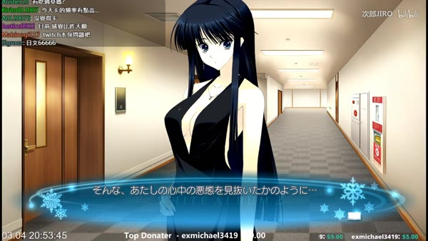
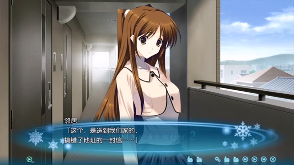
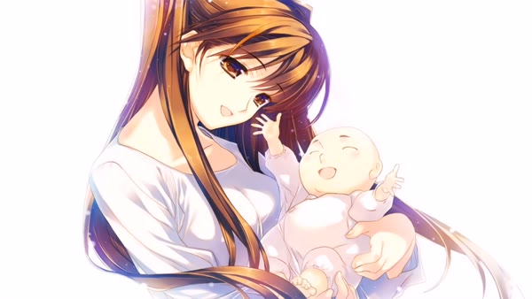

门链没有扣上。

浮气线结束以后，雪菜仍用自己的钥匙进入春希的房间。春希已经休职，每周到心疗内科就诊。他叫雪菜以后不要再来，让自己一个人待着，随即又承认自己在说谎：雪菜若真不再出现，他便不知道该怎么办。

春希自己把这份矛盾指给她看。若真想拒绝，他本可以扣上门链、收回钥匙；他一样都没有做。嘴上赶人，行动却一直保留入口。

[上一篇《第三人从工作现场归来》](/posts/white-album-2-third-person-returns/)追踪了 Coda 中的决定怎样换手。Coda Normal 由春希在心里选择，婚约、家庭和工作使这个选择落到日常里，告知留空；浮气线的形式和期限由和纱划定，春希把秘密做成生活，和纱宣布终点；两个人都不肯独自承担最后的分离，叙述也没有指明谁先抽手；雪菜接过复健善后。冬马 True 的公开决裂由春希发动，和纱逼他确认；雪菜 True 从春希求援开始，雪菜重建关系，和纱退出同等的恋爱要求，春希求婚，最后仍由雪菜回答。片尾把当时的关系定了下来，日子却不会跟着一起结束。

三篇追加故事为其中三个结局安排了不同的以后。《不倶戴天の君へ》（下文简称《不倶戴天》）接浮气线，也就是冬马 Normal；《幸せへと戻る道》接冬马 True；《幸せへと進む道》接雪菜 True。Coda Normal 在游戏里已有一年后的终点，却没有得到一篇同等规模的独立后日谈。三篇故事也不在同一条年表上：一条路线里的冲突、返乡、婚礼或怀孕，不能拿去补另一条路线的空白。[^versions]

三篇故事接着检查这份分工：工作会出事故，离开日本的人也会回到旧宅，接过善后的雪菜也在照护中撑不住。此后谁先开口，谁采取行动，谁能回答并改动原来的安排，才决定日子怎样继续。

*本文涉及 Coda 四个结局及《不倶戴天の君へ》《幸せへと戻る道》《幸せへと進む道》的完整剧透。封面为本站原创概念图；正文四张追加故事实机画面仅作非商业评论引用，版权归 AQUAPLUS，视频来源为 Bilibili 用户次郎JIRO、糖炒小熊clover。*[^source]

## 门链没有扣上，停在原地也已经选择

四月的一个周末，雪菜照常替春希洗衣、做饭，抱住他。春希承认自己从这些照护中得到满足，雪菜也承认自己因仍被需要而满足。这些动作维持了他的饮食与起居，也让两个人暂时不必重谈关系：一个等待别人进门，一个继续扮演只有自己能救他的那个人。

一夜以后，雪菜判断，自己当晚留在那里反而使春希恶化，便在他睡着后离开。随后她对工作上的人说，两人昨夜大吵了一架。使春希休职并接受治疗的崩溃，被她对外压成恋人之间的一次普通争执。

春希随后去问武也，工作该怎么办，雪菜该怎么办，今后又该怎么活。他说自己从来没有决定过什么，只是随波逐流到了这里。武也没有替他选择。他指出，明知另有道路却一直停在原地，本身就是决定。[^door]

这句话拆穿了春希对关系的说法。此后他已经按医嘱逐步外出，也恢复了与雪菜的文字联系；钥匙仍在雪菜手中，探访仍由她坚持。病情限制了春希的行动，却没有替他说明，他究竟希望雪菜留下还是离开。雪菜也没有静止。她同春希商量复职和探访，却依然无法打电话；又把“想支持春希”逐渐说成“必须支持春希”，对家人谎称两人始终相爱，从未出过问题。

IC 时，春希曾答应绝不主动同雪菜绝交，除非她先提出。CC 已经写过这句承诺怎样被守成三年的远离：他没有正式分手，却撤走了交谈、亲吻和恋人的日常。《不倶戴天》里，同一种做法又落到门上。他没有收回钥匙，也不亲口结束关系，只要求雪菜以后不要再来。承诺的字面还在，真正执行离开的动作仍交给最怕被抛下的人。

嘴上还在维持义务，雪菜的身体却先撑不住了。

一次探访途中，雪菜在车站大量出汗，双腿僵住，恶心得无法前进。等她终于来到春希家，又把迟到解释成工作拖延，强迫自己做家务、说话，恢复往日的探访。她想继续照料春希，也害怕一旦停下，自己便失去在这段关系中的位置。几种愿望一起推着她往那扇门走，身体却先停了下来。

春希后来再叫她不要来，情形已经同开头不同。他从自己的病中认出雪菜也在崩溃，确实怕她跟着垮掉，也仍在等她反抗这句话。两种愿望同时存在，背后未必还藏着一条更纯的“真心”。

雪菜开始恢复工作，却仍无法在周末走到春希家。此时电视预告了和纱的巴黎演出。电视把她呈现为正在欧洲前进的钢琴家；屏幕之外，她面对曜子的病情、演出压力和长期孤立，也在等一句能够令自己安心的话。电视轻易跨过了国境，又把一个人的公开成功同私人困境分开。

春希与雪菜都不能再推动关系时，下一通电话由和纱拨出。

## 电话接通以后，直说为什么仍然不够

上一篇已经写过雪菜 True 的冬雪冲突：雪菜从春希那里听到足以改变判断的事实，受他求助去见和纱，又主导了后面的救援与重建。《不倶戴天》的电话发生在另一条历史里。和纱已经宣布一冬走到终点；两人的手终于分开，叙述没有指定谁先抽手。她随后把春希的复健托给雪菜。接过善后的雪菜却先承认自己撑不住。

雪菜正准备联络欧洲的事务所，实际拨通的仍是和纱。她早已删掉手机里的记录，号码却留在脑中。

通话最初很客气。她们谈演出、工作和孝宏，绕开春希，也绕开各自的困境。雪菜报了假的近况；和纱则把曜子的病、演出危机和自己的孤立都藏了起来。她们只谈安全话题，好让电话别太快挂断。

和纱先说晚安，电话将要结束；她又叫住雪菜，只来得及说出“我……”。最先挑明失败的却是雪菜。她抢先道歉，承认自己也许已经救不了“我们那个人”，也辜负了和纱当年的托付。和纱先问事情为何会变成这样，随后才从震惊转向控诉。直到控诉已经开始，雪菜才明确喊出“帮帮我”。[^call]

*电话让冬马与雪菜少见地在春希不在场时持续争执；这张画面只显示和纱一端，双方开口的先后仍须由声音与脚本确定。PS3 版追加故事实机画面：©2012 AQUAPLUS / via 次郎JIRO, Bilibili。*

雪菜先把自己的失败摆到和纱面前。和纱追问以后，以自己当年如何哭泣、如何退让为依据转入控诉；雪菜这才明说希望她帮助自己。和纱也必须面对另一件事：她把春希交给自己最信任也最嫉妒的人，并没有就此结束自己的责任。这一夜，两人再也无法用当年的托付证明自己已经做完了该做的事。

争吵很快变得难听。和纱要求雪菜把春希还给自己，雪菜拒绝。她愿意在别的事情上帮助和纱，甚至去巴黎或维也纳照料曜子，却不肯把春希“还”回去。“夺回”“不交”这些词仍把春希说成可以转手的人。雪菜也把自己的条件说清了：她要和纱分担压垮自己的部分，却不打算离开春希。

旁白没有把这场直说美化成坦诚的胜利。她们一边辱骂、哭喊、装作没听见，一边替自己辩护，把责任往对方身上推。她们肯把欲望说出来，也照样会借“为了春希”攻击对方。

和纱最后说，那应由春希决定，正面打断了把他来回转让的说法。雪菜随即表明，即使春希将来抛弃自己，她也不会因此停止行动。春希的选择无法替另外两个人终止爱、敌意和各自的生活。冬马与雪菜把决定认作“我们的决定”，又以永远的敌人和强烈的爱互相告别。敌意没有吃掉爱，爱也没有把敌意洗成误会。

第二天，雪菜说自己饿了，开始做饭，把食物装进便当，准备带去同春希一起吃。她告诉母亲，自己昨夜同一位朋友在电话里争吵到天亮；随后公开说自己仍然爱过去、现在和未来的春希。她恢复探访，甚至准备在家人继续阻拦时搬出去。回到春希身边不再只是一项“非我不可”的义务，也是她承认的愿望。

通话结束后，首先重新行动的是雪菜：她重新出门。春希仍靠药物、诊疗、时间和身边人的帮助慢慢恢复；雪菜进门后，他才承认那些纸条一直在等她。[^aftermath]

两个人也没有把这一天叫作痊愈。雪菜准备花上一生，春希知道症状还会反复；他们只是重新开始行动。

后来，春希和雪菜一起观看和纱的巴黎演出与采访。和纱在公共屏幕上留下了一句“活该”。春希只确定这句话不只对自己；雪菜把它听成两人将永远为敌，春希又把它理解成一场带着爱意的诀别。三种理解都来自人物，脚本没有替观众锁定唯一收件人。电视把和纱带进房间，春希和雪菜却只能听，无法同她对话。

《不倶戴天》没有重复雪菜 True 的那场争执。雪菜 True 中，雪菜听过足以作答的事实，主动去找和纱，冲突后还安排了演出、通话和下一次见面；这通电话则重新打开浮气线已经交给雪菜的善后。和纱取回了向雪菜质问的能力，雪菜也在承认失败以后再次选择回到春希身边。争吵却一再回到“把春希还给谁”，没有形成三人的以后。电话发生以前，春希仍把停留说成随波逐流；雪菜回去以后，他才承认自己一直希望她回来。

一次冲突能推开停滞，却安排不了三年后的生活。后日谈继续写春希怎样以自罚躲开决定、以周全替别人作主，也写工作毁约以后，两个人怎样把缘由说清。房子、工资、病历、亲属和朋友便在这里进入关系。

## 选择进入生活：房屋、家人、秘密与失约

两个 True 后日谈都从已经成立的伴侣关系开始。冬马 True 留下春希发动并公开承担的决裂；雪菜 True 则把重建和收尾大半交给雪菜。到了《幸せへと戻る道》，春希与和纱已在维也纳共同生活约三年；《幸せへと進む道》里的春希与雪菜也已结婚，同在东京工作。作品没有再给他们一次路线按钮，只看原来的分工怎样落进家务、住房、差旅和加班。

### 房屋和家人替选择铺路

冬马 True 由春希发动公开决裂，和纱逼他亲口确认后，两人才移居维也纳。到了后日谈，春希同时是丈夫、经纪人、事务所职员和生活照护者。和纱仍通过演出、事务所、曜子与美代子同外界来往；春希替她排行程、管开支、照料起居，几乎包办了她的日常。

三年婚姻没有消除和纱对弃置的恐惧。返日第一夜，两人仍会在争吵中说到离婚；短暂分房后，和纱便担心春希真的不要自己。她依赖的仍是同一个人，而这个人同时是丈夫、经纪人和照护者。

曜子的白血病经持续治疗，此时病情暂时稳定。她动用事务所和人脉，修好旧宅，向学校交涉，又反复拜访另一户人家。到第五次获准进门以后，“那家的女儿”也开始帮她说服家人；脚本没有写出她的姓名。[^kazusaafter]

旧宅按记忆中的样子修复，关键物件却没有原样归位。和纱原来的钢琴仍在维也纳，日本的房子添了新琴。春希拿起一把吉他，又在和纱进门时放回支架；他认为和纱明白自己为何不再在她面前弹。二人能够回到旧宅和学校，IC 那种由钢琴、吉他和歌声组成的关系却没有随场所一起复原。

曜子与春希又把大晦日婚礼安排在峰城附属的第二音乐室，春希准备了戒指。和纱穿上婚纱时，她与春希已经登记多年、共同生活约三年。她先抗议这场惊喜，随后明确答应会回应誓词，春希才通知门外的亲友。和纱亲口作了回答，旧宅、学校和婚礼的大半准备却已由曜子与春希做完。

*这场迟来的婚礼安排在两人已经登记多年、并共同生活约三年以后，补上的是仪式和见证，并非再次缔结婚姻。Windows mini-after 实机画面，具体载体版次未定：©AQUAPLUS / via 糖炒小熊clover, Bilibili。*

曜子把旧宅留作另一个归处：开音乐会、过节、见朋友或想家时，二人都可以回来。他们没有回日本定居，却从此多了一个能在节日或演出以后回来的家。

和纱走上日本街头时，先戴上眼镜、帽子，用了“东野和美”的假名，随后才同春希在街上接吻。他们不再只能躲进旅馆，也还没有向所有人公开。

雪菜 True 在 Coda 中把重建和收尾大半压在雪菜身上，后日谈先把生活分到两个人手里。春希与雪菜各自上班，储蓄之后准备搬进 2LDK。春希主动包揽洗衣、打扫，雪菜却把做饭看成妻子仅剩的体面；家务仍要在工时和两人的自我想象之间反复商量。小木曾家来帮忙，雪菜母亲也已经同春希母亲结伴看戏、吃饭。亲属往来重新接上，这篇后日谈却仍没写春希如何面对母亲。

小木曾家的帮助也会令春希不舒服。在他看来，这家人闯进了自己一向逃避的纠葛，做事既喧闹又低效。变化在于，他开始相信即使遭到训斥，自己最后也不会被赶出这个家。

武也和依绪记得雪菜未曾参与的那三年；雪菜现在可以要求他们把旧事讲完。随后出现的收入、升迁与育儿假之争，是武也和依绪为自己的未来争论，并非春希与雪菜已经订好的育儿方案。这群朋友能够谈旧伤，也会把尚未解决的工作与照护难题带进屋里。

冬马线里，曜子修好旧宅、联络学校、一次次登门，春希与和纱才有地方回来，也有几个愿意见证婚礼的声音。和纱选择返日，也在抗议后亲口答应誓词，但她的回答发生在许多准备已经做完以后。雪菜线里，婚姻靠夫妻分工和两家人的往来撑住。门始终有内外之分：有人能进屋帮忙，有人只能以婚礼上的声音或一封信出现。

### 好意的秘密仍然会替别人决定

时间没有把谎言从两段婚姻里清除。

和纱不愿细谈曜子的病，春希却坚持掌握病情。他已经在心里开始规划：曜子去世以后，和纱何时生育，往后由谁照护她；他还认定曜子知道自己正在准备接棒。曜子曾当着和纱说明治疗状况，脚本没有写她与春希伪造诊断；这项规划里也没有和纱的回答。

婚礼惊喜也瞒着和纱。婚姻早已成立，惊喜改变的是仪式。和纱得知后先抗议，随后明确答应回应誓词，春希才联络门外的亲友。她还能抗议，也能亲口答应；春希在心里规划曜子去世后的生活、生育时机与照护交接时，脚本却没有给出和纱的回答。

雪菜线也有隐瞒。雪菜母亲已经同春希母亲来往；雪菜嘴上说自己完全不知道，春希从她顽皮的神情里猜她早已知情。春希自己也保留一些认为不会改变眼前生活的秘密。

一项隐瞒究竟有多严重，要看对方发现以后是否还来得及回答，能不能改动已有安排。一次平安夜失约把这个差别写得很具体。

### 约定破了以后，两个人怎样会合

冬马后日谈先给出了另一种承诺。婚礼正式开始前，春希再次发誓永远相伴；和纱答道，她自己已经这样发誓一百万次，第一百万零一次也不算多。这场迟来的仪式正要把早已成立的婚姻带到亲友面前，两人先在第二音乐室重复确认。故事停在誓言被见证的那一刻，没写它日后怎样失败。

雪菜后日谈恰好让约定破了一次。春希与雪菜郑重说好，平安夜晚上十点以前一定回家。两个人都知道，这类节日承诺背后压着多少旧事。结果春希遇上大臣辞职的突发报道；雪菜所在公司发现前一天发行的产品有问题，决定全面回收，她被派往都内各店道歉。两个人各自被工作留住，同时违约。

午夜的电话里，春希道歉并说清工作进度，雪菜这才告诉他，自己也没能回家。她没有独自等待春希，工作事故也使她放下了早晨那句“即使来了独家新闻也要交给上司”。两人约定下班后会合，等春希忙完再联络。

雪菜最后来到春希公司外等待，两人重新谈起过去那些体贴的谎言和绝对誓言。他们还是会说下一次一定做到，也知道自己可能再次失败。这次，他们说清缘由，重新约好见面，最后在公司门口会合。[^setsunaafter]

两人都参与了补救，承担得却不对称：雪菜赶到春希公司外，奔波和等待主要落在她身上；两人会合后去了附近已经订好的旅馆，彻夜未眠。Coda 中集中在雪菜身上的善后，到这里才开始分给双方。

《不倶戴天》中，春希把不选择说成漂流，雪菜把探访说成必须，两人靠暗号和身体硬撑。雪菜 True 后日谈里的承诺照样很强，失败却不必立刻通向自罚或沉默。冬马后日谈把誓言停在迟来的见证上；雪菜后日谈让人看到失约以后怎样继续。它们属于不同的婚姻，不能拿一边的场景替另一边补课。

三篇故事都没有把人物带到真正退出的时候。和纱可以抗议婚礼，面前却是已经布置好的场地和等在门外的宾客；春希与雪菜能够改约见面，没有走到分开的时刻。若有人决定离开，谁搬走，谁停止照护，以后还要不要联系，文本都没有回答。

到了两篇 True 后日谈，婚姻之外的第三人都只以间接形式回来：一边是匿名人影和声音，一边是明信片。

### 第三人怎样回来

冬马 True 后日谈只给了几道匿名人影。半年前来过一位未名女性，和纱说自己曾喜欢、憧憬又背叛“她”，也说“她”已经原谅自己；曜子登门拜访时，又得到“那家的女儿”协助。读者很容易把这两处人影认作雪菜，脚本始终没有让她以姓名开口。

婚礼结尾还有“友人1、友人2、友人3”的声音。玩家很容易想到武也、依绪和雪菜，文字既没有确认姓名，也无法给三个编号逐一分配身份。所谓“已经原谅”也只是春希、和纱或曜子的判断与转述，当事人没有说自己原谅了什么。和纱本人也承认，即使“她”已经原谅自己，自己仍不敢主动去见，也不能原谅自己。

雪菜 True 后日谈里，和纱以一张寄错门牌的明信片回来。春希与雪菜搬离旧居时，邻居把它交给两人。雪菜从卡片读出，和纱的维也纳公演成功，年后会回日本。春希猜她明知正确房号，仍故意写成隔壁，还故意让卡片在搬家日到达。这些都是春希的猜测；夫妻可以一起读到她的消息，也无需把卡片藏起来。

*搬离旧居时，邻居交来一封地址写成隔壁房号、因而由邻居转交的明信片。画面没有展示明信片特写；和纱的消息仍须经过旧地址和邻居才能到达这对夫妻。Windows mini-after 实机画面，具体载体版次未定：©AQUAPLUS / via 糖炒小熊clover, Bilibili。*

夫妻已经能公开谈起和纱。她年后会回日本，却不属于这个新家的日常。

春希害怕自己变得像父亲，在没有把握成为好父亲时仍提出想要孩子。雪菜随后才告诉他，检测已呈阳性，医院也在前一天确认了怀孕。春希先说出愿望，雪菜再告知结果；他的表态没有被既成事实逼出来。

片尾所谓的第三人就是孩子。孩子使家庭从两个人变成三个人，却没有继承和纱在旧三角中的位置。和纱仍由夫妻共同记得，孩子则会住进新家，成为他们共同照料的人。

*片尾 CG 把“马上成为三人的两个人”落在春希、雪菜与孩子组成的家庭上；和纱的明信片仍停在这个家庭的边界。Windows mini-after 实机画面，具体载体版次未定：©AQUAPLUS / via 糖炒小熊clover, Bilibili。*

## 一处文本空位，三条不能拼接的历史

读到这里，玩家很容易想把几段历史拼在一起：从冬马 True 取春希公开分手并承担后果，从雪菜 True 取雪菜主动去见和纱、冲突后仍安排再见，再从《不倶戴天》取和纱反过来质问雪菜的力量，最后加上共同失约后的会合。这样便似乎能凑出一条更完整的路线。

玩家读过三条路线，人物只活过其中一条。他们后来学会的事，都带着各自无法删除的经历。

浮气线把善后交给雪菜，《不倶戴天》又让这份托付在冬雪之间重新打开，春希仍到雪菜回来才肯说自己需要她。冬马后日谈延续了春希公开决裂后的婚姻，返日却要靠曜子、事务所和学校铺路；对日本一侧是否回应，文本只留下转述、匿名人影和声音。雪菜后日谈开始把一次善后分给夫妻双方，主要的赶路和等待仍由雪菜承担，和纱也仍在家门之外。

Coda Normal 只留下游戏内一年后的生活，目前核对的官方文本组未见同等的独立后日谈。春希与雪菜正在筹备半年后的婚礼，每天互说“爱你”；春希对和纱可能持续一生的感情，仍只在内心出现。文本到此为止，没有告诉我们这份感情后来是否进入两人的谈话。

第三篇所谓“位于两条 True 之间”，指的是一组尚未同时出现的条件，并不要求把三个人叫到同一间房里。受影响的人要在安排合拢以前听到足以判断的事实；他们的回答能够改变结果，也不能由旁人代写。春希得自己说明决定；和纱可以向雪菜提出要求、冲她发怒；雪菜也可以拒绝她，不必每次都做最后收拾的人。病情、住处和照护不能再由一个人暗中替另外两人安排。此后他们也许建立新的关系，也许真正分开。

即使最后仍然分开，也该由三个人在听到足以改变判断的事实后各自决定，不能再靠沉默、匿名转述或某个照护者代为收场。现有三篇后日谈分别碰到了其中几项，却没有把这些条件同时交给三个人。

第一篇写三角如何由三条关系共同生成；第二篇写和纱的缺席怎样继续组织关系，三人娘又怎样从不同位置照回春希；第三篇追问每条路线里的欲望由谁实行，受影响的人能否知情、回答，修补又落到谁身上。第四篇把这些已经换过手的责任交给时间，看它们怎样履行、失败，又怎样重新落到人手里。[下一卷从《失格者的罪，旁人的日子》开始](/posts/white-album-2-guilt-and-the-days-after/)，转向日本文学，看看这些条件在相近的三人结构中怎样出现，又怎样失败。

门链仍没扣上，旧宅已经修好，失约的两个人在公司门口见面，和纱的明信片到了隔壁。结局过去了，旧事仍在他们的日常里。

[^source]: PS3 版资料见 [AQUAPLUS《WHITE ALBUM2 幸せの向こう側》产品页](https://aquaplus.jp/wa2/product.html)；两篇 mini-after 的官方目录见 [AQUAPLUS Special Contents 页面](https://aquaplus.jp/wa2/special.html)。日文台词按本地保存的游戏脚本逐行复核，公开检索入口见 [MAO Translations Script Browser](https://mao-tls.github.io/white-album-2/script/)；本文中文短引均据日文重译。
[^versions]: 《不倶戴天》是 PS3 追加剧情，稳定脚本范围为 `wa2mas:kazusa_normal_extra:4000:1–4009:1253`。两篇丸户史明新写的 Windows mini-after 由官方活动页预告约于 2014 年 12 月 24 日寄送；当前公开语料亦经 2018 Extended Edition Special Contents 整理，不能把合集年份直接当成首次发布年。《幸せへと戻る道》为 `wa2mas:kazusa_true:6001:1–6005:236`，《幸せへと進む道》为 `wa2mas:setsuna_true:6101:1–6104:297`。Coda Normal 的游戏内一年后终点见 `wa2:coda:3024:1–78`；现有官方目录未列同等独立 after。
[^door]: IC 中“绝不主动绝交”的承诺：`wa2:ic:1006:1491–1519`；CC 中字面守约与日常撤退：`wa2:cc:2002:365–370,443–460`。浮气线后的门链、钥匙及双方从照护中获得的满足：`wa2mas:kazusa_normal_extra:4000:149–270`。武也指出停在原地也是决定并拒绝代答：`4002:137–175`。雪菜由“想支持”转为“必须支持”、在车站出现身体反应以及春希后来同时出于保护与依赖叫她离开：`4003:1–31,138–324`；`4007:63–188,209–331`。
[^call]: 雪菜准备联系事务所、和纱实际拨通电话：`wa2mas:kazusa_normal_extra:4009:184–250`。安全近况与相互隐瞒：`4009:251–365`。和纱叫住雪菜、雪菜先承认可能救不了春希、和纱追问后才进入攻击：`4009:366–432`。归还要求、雪菜拒绝、春希应自行决定及两人认领各自决定：`4009:434–491`。
[^aftermath]: 电话次日雪菜说饿、做饭、装便当，准备同春希共食，并向母亲公开自己的决定：`wa2mas:kazusa_normal_extra:4009:496–550`；她对所需时间的看法及重启探访：`4009:553–576`。春希把改善归于时间、药物、诊疗与多人支持，并承认纸条在等雪菜：`4009:577–699`。巴黎演出、采访与“活该”经电视抵达春雪：`4009:773–904`；这句台词的解释均经人物视角给出。
[^kazusaafter]: 返日争吵、分房与和纱的弃置恐慌，以及春希兼任丈夫、经纪人、职员与照护者：`wa2mas:kazusa_true:6001:13–32,39–60,65–95`；曜子病情、知情差及春希的长期计划：`6002:11–21,38–65`；三年离境、关系解冻与返日心情：`6002:78–89`。未名访客、和纱的罪感与公共空间中的变装：`6003:35–50,92–106,200–223`。旧宅修复、旧琴、吉他和新琴的差异，以及曜子对第二归处的安排：`6004:44–55,89–119,159–195`；第二音乐室、戒指、补办婚礼、重复誓言和三位匿名友人：`6005:131–236`。脚本没有给未名人物实名，“已获原谅”也都经人物转述或判断。
[^setsunaafter]: 双职工家务、储蓄、2LDK 与两边家庭联系：`wa2mas:setsuna_true:6101:17–38,67–184`。平安夜十点约定、部长辞职报道与产品召回造成双方共同失约，以及道歉、说明、重约、等待、会合与再许诺：`6102:1–35,84–179`。朋友网如何保存旧事，以及武也、依绪自己的收入与育儿假争执：`6103:1–145`。仍被保留的秘密、春希对父职的担心、雪菜前一日确认怀孕、地址写错的明信片及结尾“三人”所指：`6104:96–120,164–297`。
