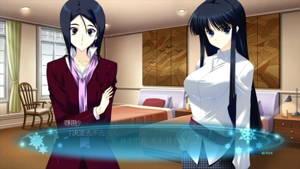
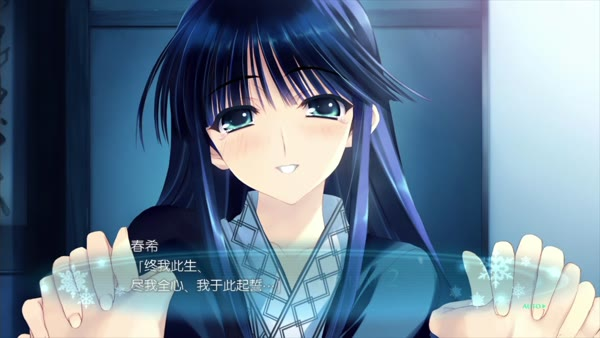
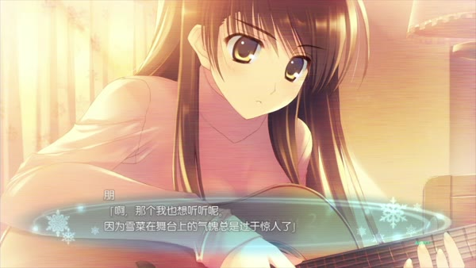
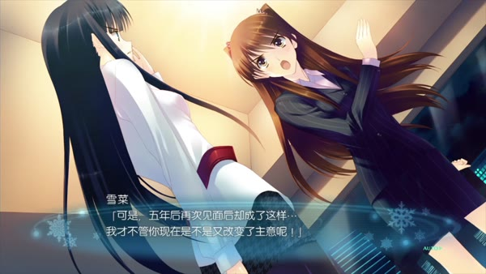
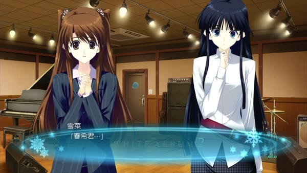

> **Spoiler warning:** This essay discusses the complete plot of *WHITE ALBUM 2: Coda* and all four in-game endings, with a limited comparison to the opening of Yasunari Kawabata's *Snow Country*. *不倶戴天の君へ* and the two True after stories are reserved for the next essay.[^source]
>
> **Image note:** This essay reproduces five low-resolution frames from PS3 gameplay for noncommercial plot criticism. Copyright remains with AQUAPLUS; the footage was uploaded to Bilibili by xueyinhualuo. The images are not open-licensed, and no republication permission has been obtained.

On the day *Kaiou GRAPH* went on sale, Setsuna saw one name printed in the largest type on its cover: Kazusa Touma. Inside was Haruki's exclusive interview, accompanied by photographs he had taken on the streets of Strasbourg.

During proofreading, Haruki had already wondered whether Setsuna might recognize the location. He removed the cathedral and other distinctive streets, omitted the place of the interview and left a text and set of photographs that could be published without it. He did not invent the interview or falsify Kazusa's career. He reduced the clues from which Setsuna could reconstruct what had happened beforehand. The magazine still confirmed for her that the meeting had been concealed.[^report]

Setsuna does not ask why Haruki met Kazusa. She first repeats something she has said before: "I won't ask you not to see her." Only then does she say what hurt her. She wanted to know before the meeting.

The article gives the problem at the center of Coda a tangible form. Concealment passes through an interview, photography, revision, proofreading and publication until it becomes an ordinary magazine feature. By deleting the landmarks, Haruki also determines when Setsuna can know and how much she can learn.

[The previous essay, "Three Years Without a Piano"](/en/posts/white-album-2-three-years-without-piano/) ended with Kazusa speaking again in Strasbourg after three years of absence. The assignment that follows guarantees another formal meeting. By Coda, the third person is no longer waiting outside the relationship. Kazusa is an interview subject, a professional pianist, Youko's daughter and someone Haruki repeatedly cares for. Setsuna now works at a record company and remains Haruki's lover, while her ring brings their engagement into discussion within the Ogiso family. All three hold places inside adult institutions. Each meeting leaves behind copy, schedules, medical records, performances and family consequences.

*Kazusa re-enters Haruki's work as the subject of an interview. The frame shows Youko and Kazusa; Haruki, asking the questions, remains outside it. PS3 gameplay frame: ©2012 AQUAPLUS / via xueyinhualuo, Bilibili.*

Discussing Coda, Fumiaki Maruto places "adult decisions" among such practical acts as resigning, handing over work and saying goodbye. A person may abandon an existing life, but must explain the decision to colleagues and those nearby, complete the necessary handover and refrain from shifting responsibility afterward.[^creator]

Whether Haruki has borne responsibility therefore depends on more than whom he chooses. We also have to ask how he speaks, what Setsuna and Kazusa know, whether either can refuse, and whether he remains present once the consequences begin.

Coda distributes those acts differently across its four endings. Before the final buttons appear, the interview, care work, Youko's illness and the engagement have already brought all three to the branching point.

## Before the Last Button Appears, Choices Have Already Been Made

Coda opens by giving Haruki and Setsuna each a business card. Haruki works at Kaiou Publishing, where he conducts interviews, proofreads and plans magazine issues. Setsuna works in publicity at a record company. They exchange cards in a conference room, then return to being lovers on weekends and discuss dates, travel and marriage. Work does not confine love to a private corner. It lets each of them make arrangements on behalf of an institution: who travels to Europe, who takes the interview, who can use a photograph and who has a professional reason to approach an artist.

The Strasbourg reunion grows from this chain. The assigned journalist hands the trip to Haruki at short notice. Setsuna later arrives in Europe as promised to join him. Kazusa spends a holiday there each year, and Youko's agency has accepted the interview. The three itineraries intersect by chance, but holiday plans and business assignments have already put all three in the same city.

On Christmas Eve, Haruki first helps an injured woman on the street and stays after recognizing Kazusa. He keeps her warm, treats her foot and carries her. Every action eases the injured woman's pain. Haruki also keeps supplying reasons for remaining: common decency, responsibility, the impossibility of leaving someone hurt in the snow. He later admits that those reasons also gave him permission to walk toward someone he had long wanted to approach.[^care]

On the telephone, Setsuna knows only that Haruki is caring for "that person." Because she does not know who the person is, she praises him for doing the right thing. The same act of care leaves the three in different positions. Haruki knows that he is breaking their promise to meet within a week and knows the injured woman is Kazusa. Kazusa knows Setsuna is waiting and still asks him to stay. Setsuna can only approve an act framed by an incomplete account.

Haruki does not remain silent after returning to Japan. He tells Setsuna that he met Kazusa, then draws his own line through the account and decides that he has "said enough." Setsuna states the limits of the dispute with precision. She wants the three of them to meet again, and she also feels jealousy and fear. She does not even know how sincere the wish for reunion is. Yet she has never demanded that Haruki stop seeing Kazusa altogether. She wants to know beforehand, to be angry and to decide whether she will take part.

The magazine fixes the concealment in print. Haruki removes the landmarks and hopes that Kazusa will have left Japan by the time it appears, so that no further conversation will be necessary. He preserves calm in the present. Setsuna receives a past he has already arranged.

Youko later expands one interview into a month-long exclusive project and demands that Haruki reject Kazusa himself. He does not accept at once. He calls Setsuna while she is rehearsing, hoping she will blame him or cry and thereby give him a reason to refuse. She does not answer. Only then does he interpret the silence as a demand that he "take responsibility himself" and accept the assignment.[^assignment]

Only after he fails to get Setsuna to refuse on his behalf does Haruki call the decision "taking responsibility himself." He can explain the interview as something done "for Kazusa" or as a job he has no reason to reject. The later meetings and concealments show what each explanation leaves out.

Professional confidentiality soon overlaps with private concealment. Kazusa obtains a ticket to Setsuna's performance and enters the hall alone. She sees Setsuna shining onstage and knows that three years of tears lie behind the light. She does not go backstage. Instead, she uses the confidentiality of the interview to make Haruki keep the visit secret. A rule meant to protect unpublished work also separates a lover who already belongs inside the relationship.

After her own performance fails, Kazusa turns all her pent-up demands on Haruki. She slaps him, presses herself against him and threatens to kiss him. Attack, jealousy and a plea for closeness arrive together. She finally proposes a way that seems able to preserve both sides: give Setsuna real love and give me false love, for this winter alone.

Haruki understands that words of love, embraces and sex cannot be divided from feeling by calling them "false." He says he must decide whom to hurt, then tries to dismiss the moment by saying that Kazusa was feverish and he had panicked. He admits that he still does not want to choose. Yet each person has already acted. Setsuna has demanded knowledge and drawn back for a time. Kazusa has performed, avoided a meeting and proposed a relationship with a deadline. Haruki has accepted the assignment, edited the article, cared for Kazusa and continued to conceal what happened. The final buttons send these acts toward different endings.

The game has four Coda endings. The Affair route branches directly after "Let go." The other three endings share an extended sequence involving Kazusa's injured hands, the special issue, Youko's illness and the engagement before separating into Coda Normal, Kazusa True and Setsuna True.[^routes]

Coda Normal, the endpoint most often lost in discussions of the "three major endings," comes first.

## When Love Remains Private, Who Has to End It?

### The Sequence Shared by the Three Non-Affair Endings: Care, Illness and an Engagement

When Haruki refuses "a winter of false love," Kazusa's right hand has already been cut by the glass of a window she broke, and she sprains her left wrist that night. In his report to the editorial office, Haruki turns both injuries into a fall down the stairs after the performance. The broken window, argument, confession and time alone in the room remain outside the report. His colleagues can only treat the event as an accident requiring a new schedule and care arrangements.

Haruki then remains in Kazusa's room. He cooks, changes her dressings, helps her bathe, feeds her and holds her hand at night. Kazusa retracts her confession as feverish nonsense, then undercuts her own bravado by insisting that fever makes it harder to lie. Both know the confession was true, but care takes the place of an answer. As long as the wound still needs treatment, today can continue into tomorrow.

Haruki first attributes his presence to the hand injury, Youko's disappearance and his own duty. The narration is more precise: Kazusa is not refusing to let him go; Haruki is refusing to let go of Kazusa. Her injuries need care and also give him daily entry to her room, a reason to arrange her meals and renewed contact with her body.

The job expands at the same time. One interview becomes a special issue of more than one hundred pages devoted to Kazusa Touma, the first magazine issue Haruki has overseen in its entirety. The project gives him formal access to the agency, her schedule, the interviews and the photographs. Kazusa does not hand all the work to Haruki. She returns to the agency, apologizes to the staff, resumes practice on her own and decides that the additional concert will proceed.

Haruki then meets Youko and learns that she has leukemia. Youko wants Kazusa to remain in Japan for good and demands that Haruki reject her daughter completely. Haruki instead begins arranging transport, treatment and daily care, becoming Youko's "comrade" in concealing the illness. Both say they are protecting Kazusa because the truth before the concert might make her collapse again. Kazusa senses a secret between her mother and Haruki but does not know what it is. She can only understand their behavior as Youko asking Haruki to stay out of pity for Kazusa.

Meanwhile, Setsuna's family discovers her ring. Through conversations in the Ogiso household and with Takeya and Io, a promise not yet fully announced becomes an "engagement." Kazusa is beside Haruki when the congratulatory call arrives. He tries to soothe her with "Today, I'll look only at you," but explains neither the engagement nor the illness. Later, Kazusa slips out and goes straight to Youko. The concealment ends only when Youko collapses in front of her.[^normal]

### Coda Normal: The Wedding Has a Date, but Where Did the Farewell Go?

Haruki walks alone through the snow after that night. Remembering all the times he asked someone else to answer for him, he says he will no longer ask anyone and will choose the person most important to him himself. The declaration is complete, but the script names no one and never shows him saying it to Setsuna or Kazusa. The three non-Affair routes split here. Kazusa True and Setsuna True continue through his disclosure and the responses it receives. Coda Normal jumps directly to one year later.

Haruki's career is going well. He and Setsuna are formally engaged and preparing for a June wedding. Their home, possible children, both families and everyday declarations of love all have concrete places in the plan. Kazusa has cancelled the additional concert and vanished from Japanese media. In the snow, Haruki admits that his feelings for her may last ten years, twenty years or the rest of his life. He then returns to Setsuna and continues telling her that he loves her.

Neither feeling turns the other into a disguise. Haruki and Setsuna share real work, family ties and daily life. Kazusa cancels her concert and disappears from Japanese reporting. Haruki's enduring love for her appears only in his internal monologue. The script does not say whether or when he tells Setsuna, and Setsuna receives no line in reply. The ending gives this feeling a voice through Haruki alone. Whether Setsuna hears it and how she answers remain inside the missing year.

An instrumental piano version of *Shiawase na Kioku* accompanies ordinary street scenes and falling snow during the credits. There is no violent break and no new three-person conversation. The wedding has a date; the other feeling appears only in Haruki's monologue in the snow.

### The Affair Route: Who Has to End a Winter of False Love?

The Affair route begins with an apparent retreat. When Kazusa reaches toward him, the option reads "Let go." Haruki lets go, and the story moves into their affair for the winter. Withdrawing from the immediate confrontation does not remove desire. They compress the future into one season and rename love as pity, sex, fever and a performance both know is incomplete.

Calling it a performance gives them codes for contacting each other, dates for meetings, reasons to switch off their phones and a deadline for leaving. Haruki's love for Setsuna is real as well, which makes it an effective cover. As long as he still loves Setsuna, he can keep claiming that the affair will never touch "real love."

During their trip, the train enters a tunnel and the carriage goes dark. Haruki wakes Kazusa and asks whether she has read Yasunari Kawabata. White land opens outside the window after the tunnel, and the narration takes care to say that this is not the precise location in the opening of *Snow Country*. Haruki uses the allusion to arrange a ritual for crossing a boundary.[^snowcountry]

At the opening of *Snow Country*, Shimamura watches Yoko tending a sick man through a window in which her reflection and the moving dusk overlap. Intimacy first passes through the gaze of an observer. Coda moves Haruki forward from that position. He is no longer watching a stranger's care through glass. He wakes Kazusa, brings her close to the window and waits with her for the white world to appear. He later says, "Kazusa decided; I only didn't object," recasting active consent as acquiescence. The self who faces ordinary judgment and society during the day becomes a performance, while the two people in the night become real.

The tunnel and blizzard make the outside world feel closed for a time. Staying overnight begins to look like a demand imposed by the weather. Haruki can then call private desire his "real self" and reduce the self who faces Setsuna, colleagues and the engagement to an act. Existing promises and the costs borne by others are shut away with the world outside the darkened window.

At the hot-spring inn, the two use false identities to obtain a room. "We are about to get married" begins as an answer for the attendant and becomes a private vow. Kazusa reaches for Haruki. They call each other husband and wife and promise to remain together forever. The vow can be sincere that night. The image contains no formal clothes, rings or witnesses, and the two have made no plans for work, a home, family or life after winter.

*Their winter-long affair reaches a vow witnessed only by the two of them; the frame contains no formal attire, rings, or other witnesses. PS3 gameplay frame: ©2012 AQUAPLUS / via xueyinhualuo, Bilibili.*

Kazusa decides to leave after daybreak. Haruki returns to Setsuna and confesses the affair. When she asks whether he ever thought of her, he replies, "I forgot you the entire time." The narration has already recorded Setsuna's voice entering the couple's world more than once. His confession still contains a lie. Haruki describes himself as a complete traitor beyond repair. He can then avoid admitting that he loves both women, demand that Setsuna deny him any choice and make "going to hell alone" the only possible ending.[^affair]

Haruki takes all the guilt upon himself without finishing what he began. Kazusa asks him to let go, and he insists that she pull her hand away herself. She completes the separation, then entrusts the broken Haruki to the woman she calls her sworn enemy. At the concert one year later, Haruki leaves before the encore. Setsuna skips the encore and follows him. The story then cuts back to the day one week after Kazusa's departure, when Setsuna entered Haruki's room and began spending a full year bringing him back to work and daily life.

Kazusa ends the winter affair. Setsuna retrieves Haruki from self-exile. The Affair route lets Haruki and Kazusa live out their desire within a secret routine, but Haruki does not complete its ending or its aftermath himself.

Kazusa True lets that desire alter their public lives. Haruki breaks up with Setsuna, resigns and leaves Japan. For this reason, it most closely resembles what readers mean when they say that Haruki finally accepts responsibility.

## Kazusa True: Social Farewells Cannot Answer for Someone Else

At the beginning of the route, Kazusa stays alone in a hotel suite and refuses to respond. Haruki tells the hotel that she left a "goodbye" message suggesting suicide and pressures the staff to prepare a key. Before the key enters the lock, Kazusa opens the door herself and exposes the lie. Haruki has used other people's fear of death to pressure her; he has not broken into the room to save someone in the act of self-harm.

Haruki then decides to leave with Kazusa but gives her one final question: will she accept a man who would betray his lover, friends, family and work? Kazusa immediately points out that he has handed the cruelest part of the decision to her again. Five days later, she does not clear him of guilt. She makes an equally cruel demand: betray Setsuna and choose me.

Haruki takes the first step toward departure, but he does not produce the answer alone. He can no longer describe leaving as the rescue of a Kazusa unable to stand on her own. Nor will Kazusa wait for him to save her. Each forces the other to say aloud the answer that will injure Setsuna.

Kazusa True is strongest when Haruki breaks up in person, resigns in person and leaves Japan in fact. He returns to the office to hand over his work, faces Takeya's anger and explains himself to the Ogiso family. The earlier promises that he would never leave, would remain beside Setsuna forever and would marry her return one by one during the breakup. They need not have been lies when first spoken. His later actions make them real promises he must now destroy with his own hands.[^kazusatrue]

Kazusa and Setsuna no longer remain separated by Haruki. Kazusa admits face to face that she is taking him, and that her jealousy makes the continuation of the trio impossible. Setsuna asks whether Kazusa loves an idealized version of Haruki. Kazusa offers to abandon the piano as compensation and even tries to injure her hands. Setsuna refuses the exchange and stops her on instinct. The loss of one person's career and body cannot restore another person's relationship or grant permission for betrayal. Even as rivals, Setsuna and Kazusa stop each other from self-destruction. That action does not cancel hostility. It prevents hostility from exhausting everything that exists between them.

Haruki cuts ties to his engagement, friends, job and life in Japan. Everyone can see these costs. Yet he still does not tell Setsuna about Youko's illness during the breakup. Setsuna True later shows that the illness could have become something all three handled together. Haruki also decides that Setsuna can withstand loss better because she has family, friends and work.

Setsuna does have people around her. Their presence does not give Haruki the right to estimate her pain for her and disclose less on that basis.

Haruki and Kazusa build a real new life after leaving Japan. They work together in Vienna, care for each other through nightmares and sustain Kazusa's career as a pianist. For two years they barely mention Setsuna or Japan, as if avoiding the names could preserve the break for which they have already paid so much. After *closing* and the credits, the story jumps two years ahead. Youko sends an email with recent news and attaches a compressed file. Haruki downloads and extracts it. Setsuna appears on the screen holding his old guitar. She announces *POWDER SNOW*, and her voice enters the room.[^video]

*Two years into Kazusa True, Setsuna enters the couple's Vienna home through a recorded file, Haruki's guitar, and song. The frame itself does not establish forgiveness. PS3 gameplay frame: ©2012 AQUAPLUS / via xueyinhualuo, Bilibili.*

The video does not declare the route a success or failure. Setsuna holds the old guitar and sings inside the screen, and her voice enters the couple's home. She and the friends from whom Haruki severed contact made the recording. Haruki and Kazusa can only sit beside each other and listen. They can no longer leave Setsuna and Japan unspoken.

The new life in Vienna is real. Setsuna's presence in the video is real as well.

Kazusa True already brings Kazusa and Setsuna into direct conflict during the farewell. Setsuna True asks a further question. If Kazusa remains in Japan, can the two women continue to meet after the argument?

## Setsuna True: When the Third Person Is Openly Present

Haruki shows no more initiative at the start of this route than he did in Kazusa True. He asks Setsuna to save Kazusa and promises to obey her after the crisis. Setsuna immediately hears the order of priorities in the request. Kazusa is his first concern, while Setsuna will have to settle what the other two have left unresolved. She knows this is unfair and chooses to go anyway.

Setsuna first faces the possibility that Youko may die. Her answer goes beyond "Your mother is still alive" or "You must be strong." She talks about doctors, funerals, relatives, work and future contact. Even if Youko dies, people will remain to help Kazusa arrange the funeral and deal with work, then accompany her through what comes after. Kazusa calls such love a convenient lie. Setsuna still answers that she loves her. The visits, performance and meeting that follow will test whether that love can take practical form.

Setsuna True carries their conflict into a conversation that cannot end with a farewell. In IC, the two already questioned each other directly but stopped quickly for the sake of the performance. Kazusa True also let them argue face to face before departure ended their contact. Here Haruki is absent. Setsuna asks why Kazusa left five years earlier and why she has dragged the problem among the three into the present. Kazusa answers that Setsuna has obtained everything and still lectures the person who has lost everything. They call each other a coward and a hypocrite. They slap and pull at one another, apologize and attack again. Afterward, they still have to face the same concert and another meeting.[^setsunatrue]

*With Haruki absent, Kazusa and Setsuna confront each other in words and through physical force; their conflict still leads to the same concert and another meeting. The frame does not decide a moral victor. PS3 gameplay frame: ©2012 AQUAPLUS / via xueyinhualuo, Bilibili.*

Setsuna has greater command of words and can draw on family and workplace ties. Kazusa strikes, mocks and threatens to leave. Each can interrupt the other and force the other to restate herself. Their fight does not produce reconciliation. It lets them deny and correct each other face to face before carrying the unresolved parts toward the same concert.

Kazusa later admits that she still loves Haruki, feels jealous of Setsuna and asks not to be excluded. Setsuna does not demand that she retract the feeling. She calls Haruki and asks him to pick up the guitar; Haruki switches the call to speakerphone. At the end of the previous essay, the performance without a piano could only send its song one way to a distant Kazusa. Now Kazusa can hear and answer as they play. They agree that next time the piano will join and they will record a complete version.

The call also changes the old allocation of the three instruments. The guitar can accompany Setsuna in Kazusa's hearing, and the piano will join the trio's performance next time. A future performance has now been promised: today's listener will become its pianist.

Kazusa remains openly within Haruki and Setsuna's life, but their romantic positions do not become equal. Looking back on IC, Setsuna admits that she demanded the trio remain together while acting first to form a couple with Haruki. Kazusa admits her jealousy but cannot treat Setsuna as nothing more than an enemy. In the end, Kazusa herself asks Haruki to return to Setsuna and says that he can no longer treat the two women in the same way. Haruki states the difference: he likes Kazusa, loves Setsuna and will marry Setsuna.

The statement does not rank all three for every future moment. It describes the life before them. Haruki and Setsuna will marry. Kazusa will remain a friend, musician and collaborator. She still loves Haruki, and Setsuna will still feel jealous. The three do not occupy one shared romantic position.

The old problem returns as soon as the proposal is made. Haruki asks Setsuna for an answer, and she points out that he has again handed her the hardest part. She slaps him, then begins sending the emails she had left unsent for a long time. The notifications sound one after another. Support, jealousy, fear, anger and resentment over professional secrecy arrive in their own sequence. The words once suppressed under "I understand" and "I'm fine" finally arrive at their separate times.[^mail]

Those five minutes let Setsuna express her anger and give it a deadline. She sends every old message and makes Haruki hear the jealousy, fear and resentment that never disappeared. After five minutes, she agrees once more to become the woman who understands him best. Haruki has heard her anger, but Setsuna still has to bring the confrontation to an end.

The ending does not stop at the phrase "the three of us." The special issue is completed at the editorial office. Kazusa is included in plans for dinner with the Ogiso family. Composition, lyrics, piano, guitar and vocals become a record. In the studio, Kazusa and Setsuna stand together before the piano and recording equipment, while Haruki remains outside the frame. A recording schedule now requires all three to meet again and complete an album for release.

*Setsuna True carries the trio into a recording studio: lyrics, guitar, piano, vocals, and recording become the concrete work of their next meeting. PS3 gameplay frame: ©2012 AQUAPLUS / via xueyinhualuo, Bilibili.*

The ending CGs for *Toki no Mahou* show the new routine. Kazusa remains openly present but outside the engagement. Setsuna accepts the proposal and will live with a man who still loves Kazusa. Haruki keeps his work, friends and family. The three can continue meeting, but Setsuna first visits Kazusa and pulls her through the crisis. Kazusa and Setsuna then speak directly. Haruki does not rejoin them until the later work of writing lyrics and recording.

Setsuna True gives the three the most time to speak and respond. Love, jealousy and rivalry can be voiced, while family, work and music require further meetings. Its difficulty lies in the same arrangement. Setsuna must listen to both of them and often has to end the argument herself. Her "understanding" of Haruki may again press her anger out of sight.

Taken together, the four endings show that the price Haruki pays does not always correspond to how much say the others retain. Kazusa True makes him break up in person, resign and leave Japan, while he still judges how much Setsuna can bear and withholds Youko's illness during the breakup. Setsuna True lets Kazusa and Setsuna fight face to face and gives the trio another performance, while Setsuna does most of the rescue and the work of ending the conflict. Coda Normal skips the disclosure scene. The Affair route leaves Kazusa to end the affair and Setsuna to bring Haruki back to daily life.

After the credits, all three still have lives to lead. Following the Affair route, Setsuna and Kazusa must argue by long-distance phone, without Haruki presiding, about who will care for him and who should leave. The couple in Vienna must face Setsuna's return through the video. The three who remain together in Japan will break promises, quarrel and try to repair the damage. Coda Normal has no after story of comparable length. Its silence leaves another question: when the third person disappears from the report, does life cease to require her answer?

[The next essay, "History Remains After the Endings"](/en/posts/white-album-2-history-after-endings/) begins after the buttons and asks who remains within time.

[^source]: For game information and production credits, see the [AQUAPLUS official site for *WHITE ALBUM2 幸せの向こう側*](https://aquaplus.jp/wa2/). Japanese dialogue was checked line by line against the game script; the [MAO Translations Script Browser](https://mao-tls.github.io/white-album-2/script/) provides a public search interface. All English quotations in this essay have been translated from the Japanese.
[^report]: Script locator for the feature, the removed landmarks and Setsuna's discovery of the concealed meeting through the magazine: `wa2:coda:3006:259–299`. Setsuna explicitly distinguishes "Do not see Kazusa" from "Do not see Kazusa without telling me."
[^creator]: For Maruto's comments on adult decisions, resignation, handover, social farewells and responsibility, see Yuichi Murakami, "[社会に全力で立ち向かいたい人のための，PS3「WHITE ALBUM2」インタビュー](https://www.4gamer.net/games/186/G018635/20121215001/)." In the same interview, Maruto calls Setsuna and Kazusa equal main heroines and rejects the claim that only one of the two completed endings is correct.
[^care]: Adult work and reunion: `wa2:coda:3001:7–176`; care for Kazusa's injury and Haruki's rewriting of his reasons: `wa2:coda:3003:242–324,453–489,663–728`; the interview: `wa2:coda:3003:775–912`.
[^assignment]: Partial disclosure and Setsuna's demand for prior knowledge: `wa2:coda:3005:91–230`; the unanswered call and Haruki's decision before the exclusive interview: `wa2:coda:3009:763–883`; Kazusa attending Setsuna's performance with a ticket: `wa2:coda:3012:340–590`.
[^routes]: The final two levels of choice appear at `wa2:coda:3016:566–592`. `3017–3023` is the extended script container shared by the three non-Affair endings; `3024` is exclusive to Coda Normal. The paths to the Affair route, Coda Normal, Kazusa True and Setsuna True were cross-checked through textual continuity, [NMM's PS3/Vita route record](https://nmm.blog.jp/archives/21904551.html) and [Atwiki's four-ending table](https://w.atwiki.jp/whitealbum2/?page=%E6%94%BB%E7%95%A5). The public transcript has flattened conditional commands, so this essay does not present a precise affection algorithm as an engine-level fact.
[^normal]: The broken window, the cut on Kazusa's right hand and that night's conflict: `wa2:coda:3016:228–305,340–360`. The injury report, care, special issue, Youko's illness and engagement in the extended non-Affair sequence: `3017:1–354`; `3018:1–470`; `3019–3023`. Several emails written to Setsuna appear only under conditional inserts and are not treated as facts shared by all three routes. Coda Normal one year later and Haruki's lifelong monologue: `3024:1–78`.
[^snowcountry]: The game's reference to Yasunari Kawabata, the train leaving the tunnel, and the pairings "decided / did not object" and "social self / real self": `wa2:coda:3907:148–199`. The comparison with *Snow Country* is limited to the opening tunnel, the window reflection and Yoko tending the sick man. It draws on Ye Weiqu and Tang Yuemei's Chinese translation; it concerns the scene's structure rather than the exact wording of the Japanese original and does not claim that Kawabata influenced all of Coda.
[^affair]: The winter agreement and secret routine of the Affair route: `wa2:coda:3901–3907`; the private vow: `3907:535–709`; the punitive lie during Haruki's confession, Kazusa withdrawing her hand and Setsuna's year of rehabilitation: `3908:455–777`; `3909:89–179`. This route is also called Kazusa Normal and should be distinguished from the Coda Normal ending in `3024`.
[^kazusatrue]: The false goodbye message and their reciprocal demands: `wa2:coda:3101:1–65`; `3102:189–350`. The breakup, resignation and explanation to the Ogiso family: `3103–3106`; `3107:114–325`. Kazusa and Setsuna's confrontation, the proposal to abandon the piano and the threat to injure Kazusa's hands: `3108:220–515`. Haruki does not tell Setsuna about Youko's illness during the breakup: `3103:296–430`; Setsuna True provides a contrast in which they deal with the illness together: `3202:1–65`; `3203:50–185`. Haruki estimates Setsuna's capacity to endure through her family, friends and work at `3103:361`; `3106:194`; `3107:429`; `3109:409–435,631–635`.
[^video]: Kazusa True first enters the credits with *closing*, then reaches Vienna two years later. The file download, Setsuna's image and *POWDER SNOW*: `wa2:coda:3111:61–72,198–252`. Song assignments can be cross-checked against this [Coda credits transcription](https://w.atwiki.jp/ercr/pages/4256.html).
[^setsunatrue]: Haruki asks Setsuna to intervene, and Setsuna points out the responsibility handed to her: `wa2:coda:3202:1–65`; the practical work of grief and the direct Kazusa-Setsuna conflict: `3203:69–288`; the telephone performance and Kazusa's request not to be excluded: `3207:152–250`; their retrospective accounts of mixed motives in IC: `3209:524–590`.
[^mail]: Haruki's public distinction between the two feelings, the proposal, the sequence of unsent emails and the "five minutes": `wa2:coda:3210:550–944`; the editorial office, family dinner and recording: `wa2:coda:3211:1–117`. Setsuna True uses *Toki no Mahou*, and the family life and joint production continue through its ending CGs.
