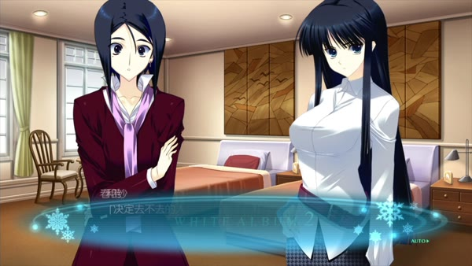
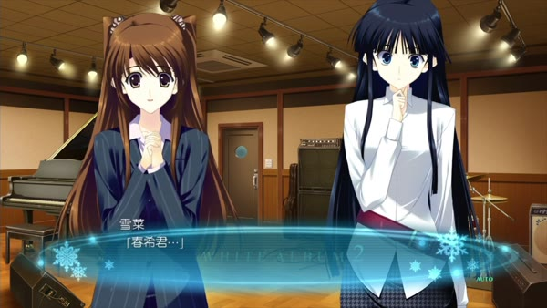

雪菜向春希讨五分钟。

他已经求婚，却还急着要答案。她想再留些时间同和纱谈，他却怕等下去，自己便被丢下了。于是他请她责骂，发怒，甚至打他，末了仍须原谅。他已经把自己能够受的罚说了一遍，也把受罚以后所盼望的事接在后面。[^five]

雪菜先前没有发出的邮件，这时接连响在他的手机里。信里的心情并不整齐：担心，嫉妒，支持，又嫌恶自己的嫉妒；明白他的工作，还要问工作为什么总准许他保守秘密。她并不是到此刻才有这些心情。只是到此刻，他才须一封一封地收。[^mails]

她说，给我五分钟，听我做一个坏女人。五分钟以后，我会做懂得一切的女人，做你的归处。

她的话还没有说完，春希已经从中听出了答应。

这是雪菜 True 临近末尾的一段。三个人走过了那么长的路，才让久未抵达的话抵达；然而准许愤怒开口的约定，已经替愤怒安排好了归宿。我们不能因这一点取消她的爱，也不能因为相爱，便认为这五分钟已经足够。

[上一篇《旧时天气旧时衣》](/posts/white-album-2-three-years-without-piano/)写重逢以前，人怎样在照常过日子中改变，又怎样给旧关系留着位置。到了 Coda，问题更逼近了一步：决定作出以后，自己和别人都可能不再像原先设想的那样；作出决定的人能不能承受这一点？

四条结局，各自给了一个去向。去向有了，路上的人却还在生长。

*本文涉及 Coda 四个游戏内结局的完整剧透，并对读鲁迅《伤逝》《娜拉走后怎样》与夏目漱石《心》。追加后日谈留待下一篇。日文台词按脚本重译；封面为原创概念图，五张实机帧用于相邻场景的评论。*[^source]

## 以己养养鸟——《庄子·至乐》

和纱回来的时候，春希已经有了一份工作。

他把录音笔放到桌上，请采访对象谈比赛、计划和日本演出。和纱说不来日本，曜子便替她转圜；母女为了比赛名次争起来，他夹在中间，倒还能够说一句：两位都不够大人。熟悉的人一旦有了名片，便仿佛可以重学称谓，从叫“冬马”改口为“和纱小姐”，连旧日的亲近也容得下一个公事公办的口气。[^interview]

*曜子与和纱面对采访者春希；录音笔打开以后，旧相识也成为工作关系。PS3 版实机画面：©2012 AQUAPLUS / via xueyinhualuo, Bilibili。*

工作并没有使旧情变轻。它让春希和和纱的见面有了理由、有了时刻，也有了别人不便追问的职业秘密。春希一面认真工作，一面借着工作靠近自己想见的人。这两件事竟能同时成立，而且都做得很认真。

他向雪菜说过在欧洲遇见和纱，说到一半，又认为已经够了。其后专访刊出，雪菜在照片中认出了斯特拉斯堡；春希原已避开大教堂和容易辨认的地标，没有在文章中写出地点，却仍没有避过她。雪菜说，她不曾禁止他见和纱，只想在见面以前知道。[^report]

“不能见”与“先告诉我”，所要求的生活很不一样。前者要使和纱消失，后者要使雪菜能够回答。春希避开的恰是后一句。他仍得以同和纱见面，却不让雪菜在会面前作答。他以为少告诉她一些，她便能少受些苦；自己担下隐瞒的重负，竟也显得像是在体贴她。

这种体贴最难拆开，因为照料确曾发生。雪地里的和纱受伤后，春希留下替她保暖；他知道，两人的亲近已经越过普通朋友的分寸。若为了揭穿借口，就把照料说成全然虚假，我们反而替他造出一个更容易解释的人：只须揭掉假面，真面目便在那里，往后一切都有了答案。[^care]

一个人真诚地认定自己就是某种人，也可能借这份认定逃开正在作的选择。“我是负责的人”，原该要求他把事情做清楚；用得熟了，却可以倒过来证明，凡是他这样做的，必然有负责的理由。称谓从一项尚须履行的要求，变成了已经签好的凭据。

春希的可靠也不能全部退回成伪装。编辑部需要他，同事确实把工作交给他；雪菜信赖过他的照顾，和纱也靠这些照顾熬过一些时刻。一个身份有它真实的来历，才会有这样大的遮蔽力量。倘若毫无信用，何必费这么多事。

因而问题不在于“可靠”二字够不够真。问题在于，当雪菜说出与他的体贴相反的愿望时，这个可靠的人能不能停下来，把她的话听进去。负责究竟是我替你把痛苦料理妥当，还是我也须听你说，我料理错了？

## 执子之手，与子偕老——《诗经·邶风·击鼓》

Coda Normal 把镜头移到一年以后。

春希仍忙着工作，同雪菜在电话里商量时间。他们已经订婚，准备六月举行婚礼，也在谈往后的住处。小木曾家的饭桌渐渐成了他的饭桌，父亲邀他喝酒，见面也成了常事。这里的生活有琐事，也有相互等候的欢喜。雪菜说，吵架也好，擦肩而过也好，她还想同他经历。[^normal]

若把这一切判成“没有选择和纱，所以勉强将就”，便先替雪菜删去了她实际享有的日子，也把春希的一份爱取消了。婚约不因另一份感情残留就自动失效。共同生活所要求的忠实，包含怎样安排时间、怎样兑现答应过的事，不能只靠内心永无波动来证明。

然而春希自己也没有取得那份清白。他爱雪菜，也知道对和纱的爱没有消失。他想，再过十年、二十年也许仍会如此；到生命末尾，愿意只看着雪菜。这句话指向一个他还没活过的未来。

说这句话就是欺骗，太早；把它当成已经兑现的终身保证，也太早。它之所以有分量，正在于说话的人还须活下去，使尚未存在的未来一点点有了内容。每一天的见面不会抹去另一份爱，却可能让“我要与你生活”这句话渐渐有了分量。

这里可以辨清两种很容易混同的忠实。一种要求我的行动服从我承认的承诺；另一种要求我的全部过去、每一处心动，都为眼前的选择证明它是唯一可能。前一种使人可以在有矛盾的心中继续相守，后一种逼人替自己的历史作伪证。春希说自己仍爱和纱，至少没有把内心打扫成一间样板房。

但我们听到的，主要还是春希的内心。结局没有同样展开雪菜怎样获知、怎样理解这份长久残留的爱。她在电话中说出的幸福，并不等于已经逐句回答了旁白里那些尚未告诉她的话。他们确实开始过上共同生活，却未必已经对这段日子有了共同的说法。

这份空白并没有抹去他们已经过上的安稳日子，却让另一个问题留了下来：相守可以先于完全理解而开始，随后仍须容得下理解发生变化。否则，十年以后的她提出一句新话，他便可以拿十年以前的幸福来答复，说你不是早已答应了么。

## 与时偕行——《周易·损·彖传》

浮气线将那一冬封得很紧。

和纱起初说，真正的爱归雪菜，她只要假的，只要离开日本以前的这段时间。称作假的，仿佛便不须争取真正恋人的位置；定了期限，仿佛期限内发生的事便不会越界生长。可感情不会照着契约上的方便长。[^winter]

到了旅馆，春希想继续往北走，越远越好。他想着明日坐首班车，去札幌，或再寻一处偏僻的温泉，和纱却在他怀中发抖。他说，总有一天会让她幸福。她答，不要总有一天，现在就要，只要一点。

于是他再次求婚。两人相互说出健康与疾病、贫穷与富有的誓词；她要作北原和纱，他要她明日在宿帐上这样写。她的欢喜是真的。倘若读到这里还只肯称作肉体关系，便同起初那张便利的契约一样，拒绝承认后来已经发生的变化。[^vow]

*旅馆中的私人誓言。和纱要求眼前的一点幸福，春希许下此后的共同生活。PS3 版实机画面：©2012 AQUAPLUS / via xueyinhualuo, Bilibili。*

誓言有一种向未来借力的本领。说“我愿意”，并非报告心里早已完成的一件事实，也是在请另一个人同自己做成一件原来没有的事。因此誓言不能因尚未实现便被轻视。它的危险也正在这里：说话的两个人可能已经被这一夜改变，却以为这一夜从此可以替每一个明早说话。

旅行第三日的早晨，和纱要结束这段关系。

她先说，自己从一开始就决定要结束。春希不信，追问究竟何时决定，又追问昨夜、出发以前那些话难道全是假的。她起初把它们一并说成谎话，后来却终于承认：直到昨夜，她还想两个人逃走；决定就在刚才，是在动摇许多次以后，看到他的笑容那一刻才终于作定。[^leave]

这一番翻转不能只读作她嘴硬，后来终于承认真心。她最初的假话，是要把一件艰难的新决定说成原来就已决定的事，好使春希别再追问，也好使自己能够离开。随后她承认爱，离开的决定却并未因此撤销。昨日想留下，今日仍爱他，今日也决定走；这几句话放在一起痛苦，却并不互相抵销。

春希若只问哪一句最真，便可能抓住相爱那一句，替其余的话判了无效。他要求和纱别把自己单方面的话说成两个人的共识，这个要求有道理；然而两个人的共识，也不能成为一个人离开时必须取得的许可。她不能代他说愿意分手，他也不能以自己不愿意，证明她必须留下。

和纱同样还想留住她熟悉的春希。她说，她爱的那个春希会顾念别人；如今这个只肯抓住她的人，正在损坏那个她爱的人。这个判断包含她确实看见的变化，也包含她不肯失去的形象：她想要他的全部，又爱他不能只顾她的样子。于是“真正的春希”成为两种愿望争夺的名字，绝不是藏在矛盾之外，等谁把它找出来便可定案的本性。[^realharuki]

这条路线中的相爱之所以深，正在于两人各自要的东西已经碰到对方身上不能兼得的部分。欲望不会因为真诚便彼此相容。肯承认这一点，才不会把和纱的离开全解释成懦弱，也不会把春希的挽留全解释成罪恶。

车窗外的雪地，曾使春希想到《雪国》。他把白天的自己说成是在扮演常识的人，把夜里同和纱在一起的自己说成真正的自己。可白日并没有因这句命名停止：编辑部替他处理未交出去的工作，上司向别处赔不是，还想为他留下能够回来上班的位置。逃走的人把一部分自己叫作真，留在原处的人便得替另一部分继续做事。[^daynight]

这些同事并不是专为惩罚他才出场。他们会抱怨，也会替他处理工作、留住他能回去的职位。若把世界写得只剩束缚，二人的自由便显得毫无疑问；脚本却留下同事的责备与好意，让“我们已经什么都抛下了”这句话说不干净。

## 诲尔谆谆，听我藐藐——《诗经·大雅·抑》

分离以后，春希向雪菜坦白。

她问，和和纱在一起的时候，是否也想过自己。他心里知道想过，许多次都想过；说出口的却是，那时一直没有想起她。此处的假话没有替他减罪，反而把罪加重。他不愿再有一丝减轻自己的可能，要让雪菜知道自己坏到底了。[^punishment]

这比通常所谓撒谎更难受。假如只查一句话真不真，便能指出谎言；若要明白他为什么偏选更坏的那句，还须看他把雪菜放到了哪里。

他把所有罪都认下，也仿佛替雪菜先作了结论：自己坏到底，不值得原谅。她若还想听矛盾的经过，想知道他在那些时候有没有想起过她，他反而不肯把这些矛盾留给她判断。坏人的供词，也可以要求受害者照单全收。人在认罪时并不必然失去解释别人的权力，有时只是把权力换了一件黑衣。

齐泽克讨论“美好灵魂”时，所追究的正是一个人怎样参与安排处境，使自己总能作为无辜、受迫或全然牺牲的人出现。关键不在他有没有痛苦，也不在他是否表面上不行动；有些看似退让的姿态，恰在积极维持别人只能占据的位置。把这个问题移到春希身上，便须多问一步：自称全然有罪以后，他是否真的放开了对其余角色的安排？[^beautiful]

这时，夏目漱石《心》的遗书显出一种相近而更冷的关系。先生将自己的过去写给青年，盼望这番坦白有助于别人认识人；他甚至承认，写作半数以上出于自己内在的要求。但他特意留下一个例外：妻子不许知道。他要使她关于自身过去的记忆尽量保持纯白，并请青年在她活着的时候继续守住秘密。[^kokoro]

他已把生命置于自己的判决之下，却仍替妻子保管她的一生应当知道多少。坦白向一人开放，保护便向另一人关门。我们若只看告白的彻底，就会漏掉这扇门；若只说它是一种冷酷，又会漏掉那份希望保护她的感情怎样参与关门。

《伤逝》使另一种“替你好”露出更直接的重量。涓生说不再爱子君，同时告诉她，这对她更好，她可以毫无挂念地做事。可是爱情结束以后她将进入怎样的生活，她有没有能力按这句话自由起来，并没有因他的坦白而解决。他后来才承认，自己没有勇气背负虚伪，倒把真实的重担卸给了她。[^shangshi]

那份手记中，子君曾经走出家庭，同他建立过有欢喜的日子，也出钱置办生活；涓生也曾学着做饭。自由的开头并不因为后来失败而变假。变化发生在共同生活里：家务渐渐占去她的时间，失业又迫使他面对生计，最后他从自己的解脱出发，替她宣布一种尚无着落的自由。

这几部作品相遇之处，是坦白以后仍未结束的关系。真话可能是必要的，却不能替另一个人安排往后的生活；把自己说成罪人，更不能让后来发生的事一笔勾销。

浮气线的雪菜还会回来。她追上提前离席的春希，身上仍是舞台服，场内还有等着她的人。春希回想，她早在一年以前那次伤害之后的一周便重新来到自己面前，此后持续陪他度日。她的主动不能从这段关系中抹去，正如她自己的痛苦也不能抹去。[^return]

春希以为把自己判到最坏，便已经承担到底。雪菜却还须一次次走过来。罪名并没有变轻；只是把自己判成罪人，不能替他重新吃饭、工作，不能替他重新听见歌，也不能替他回应那个仍在生活的人。

## 行路难，多岐路——李白《行路难》其一

冬马 True 的春希确实行动了。

编辑部的人听见他辞职，几乎不能相信。平日那样恪守规矩、责任感重到令人发烦的人，竟然要走。他答应办完手里的工作；十天以后，交接已在进行，同事松冈接下他的任务，也当面告诉他，接过去以后自己的工作量会怎样增加。[^resign]

辞职没有被一句“我要忠于爱情”代替。事情落到另一个人的桌上，留下来的人有资格不高兴。松冈骂他把工作丢下，却也骂他为何断定无人愿意参加送别会。后来春希在席间同大家说笑，心里感到温暖，知道有一些日本的记忆可以好好带走。那些被他预先安排为决裂对象的人，没有完全照他的剧本行事。[^farewell]

这给决断增加了分量。离开需要亲自说，交接需要有人做，别人的责备也不能只被拿来衬托自己牺牲得多么壮烈。与此同时，同事愿意送别，并不收回工作的负担；温暖也不是一张无责证明。两种事实并排放着，才是成人离开一处生活时的样子。

在爱情这一边，春希也不能只当和纱的救援者。她明确要求他背叛雪菜，选择自己。这里有一个无法用平均分配消除的要求：她想同这个人生活，所要的包含他不能再以原来的方式属于另一人。[^kazusachoice]

武也问起三个人一起面对的可能，春希承认，若那样做，自己便不能选择和纱。他不是算过三份幸福的总量，才发现只有这一条最好；他要和纱，其中有不能委托公共利益替自己说明的私心。说到这里，他才肯以自己的愿望为决定署名，不再声称人人的利益都要求他如此。[^takeya]

拉康在《精神分析的伦理学》中追问“为善服务”时，逼出的也包括这个问题：究竟为了谁的好？好意不能保证一个人对自己的欲望毫无亏欠，既定的善也不能预先收容全部欲望。然而从这里走到“我最想要什么便都可以做”，中间并没有现成的桥。欲望使人不能只用利益账目替自己说话，也不会替他说完所有话。[^ethics]

所以，春希对雪菜的分手必须同时从两个方向来看。他有权结束自己不能继续履行的婚约，不必等到雪菜也认为这一决定对她最好；他也须承认，这是一项令她受伤、而她完全可能不同意其解释的决定。能离开，与能规定对方如何接受离开，并不是同一种权利。

雪菜问，自己究竟哪里不好，改了是否还来得及。春希说，她什么也没有错。这个回答保住了她不必为他的选择负责的一面，也把她推进一个无从着手的位置：没有错，为什么不能留下；可以怎样弥补，却恰好排除了她想要的那一项。[^breakup]

这段对话不能由更高明的措辞消除痛苦。春希接着不告诉雪菜曜子的病情，仍在替她筛选能够承受的事实。他说不想再加重雪菜的负担；另一方面，他也想到，若说出病情，三个人可能共同照顾曜子，自己作出的决定也可能因此动摇。两层考虑缠在一起。若只把前者说成温柔，便会遮住后一层。

雪菜后来不能跟他离开日本。她说起家人、朋友和工作，说自己终究不能不做女儿；她甚至把这种牵挂解释成爱得还不够。我们却没有理由顺着这句话，把其他关系一并贬成爱情不足的证据。一个人有许多不能割断的爱，并不因此少了一颗心。[^setsunastays]

鲁迅在《娜拉走后怎样》中，将走出门的意愿同走出门以后的生计分开，也拒绝替所有人规定同一种牺牲。文学不必为社会开出一张万能药方，读者却应当看见，昂首离去所需要的路费、工作和关系，究竟落在谁身上。放到这里，也就不能让离开者垄断勇气，把留下者一概说成还不够决绝。[^nora]

冬马 True 真正做成了一次离开。两年后，维也纳的房间里，春希与和纱共同打开曜子发来的链接，下载文件。雪菜抱着那把旧吉他，向镜头说，自己仍在唱歌。[^video]

*两年后抵达维也纳的录制影像：雪菜、旧吉他与《POWDER SNOW》。PS3 版实机画面：©2012 AQUAPLUS / via xueyinhualuo, Bilibili。*

这段影像首先带回一段仍在继续的生活。雪菜能录歌，朋友也在场；这些日子便有了不由春希讲述的内容。影像没有要求他们搬回日本，也没有替所有伤害出具宽恕书。它让“我已经把那些人抛下”这句话遇上一个新事实：被留下的人还在行动，也能选择把什么送到这里。

相爱让春希与和纱走出原来的生活。如今打开影像，他们还得接住原先没有料到的东西。决定的分量并未因此减轻；他们也不必把另一个世界想成死了，才能证明自己选择了这段关系。

## 君子和而不同——《论语·子路》

雪菜 True 从一项求援开始。春希请雪菜救和纱，自己已经做不到。雪菜也承认，眼下应先顾和纱。春希想扑进她怀里求安慰，却先说了救和纱。雪菜肯定这份次序，又坦承自己仍然不甘：做对了，竟也叫她难受。她接下请求，没有因此变成全无嫉妒的人。[^rescue]

这条路线让人珍惜的，是雪菜带着嫉妒也去了。

雪菜先拿自己的母亲作设想：如果母亲去世，她要同医生、亲戚商量，处理许多事务，也得一边难过一边过日子。和纱说，自己没有那样多的人。雪菜便说，还有我，也有春希。丧亲之痛仍得面对；但在和纱想象中只剩一个人的往后，雪菜说出了几位可以一道做事的人。[^grief]

此时，和纱担心的母亲之死还没有发生；事务所却是眼前必须交涉的地方。春希和雪菜商量了一天，春希再向曜子争取每天相见的安排。雪菜没有把握，只说还想再努力几次。工作也给了她继续来见和纱的理由。和纱未必喜欢她，她不能只凭一句“我是为你好”一直站在门口。

两人见面以后，话很难听。旧日的离开，谁得到了谁，谁有资格说爱，一件件翻出来。她们掌掴，道歉，又重新吵；和纱说自己是坏人，雪菜却没有顺着这个称呼替她结束谈话。把自己说成坏人，倒像是在问：既然如此，你还来做什么？雪菜偏还要来。[^conflict]

*春希不在场的冬雪争执。道歉并未立即结束分歧，两人随后又争了起来。PS3 版实机画面：©2012 AQUAPLUS / via xueyinhualuo, Bilibili。*

动手本身不会让两个人忽然懂得彼此。这场冲突的变化，在于两人先后说出的话都遇见了会顶回来的对方，谁也不能只把另一个人安放在自己的往事里。和纱所恨的雪菜，竟不肯满足于胜利者的位置；雪菜所爱的和纱，也不会为得到善意便停下嫉妒。两人必须面对一个更麻烦、更具体的人。

这也改变了“为她好”的含义。在春希替雪菜删改事实的时候，为她好由他单方面解释；现在雪菜仍带着自己的主意来，却得听见和纱当面拒绝、讥讽和追问，和纱的回答也能影响下一步。这样一来，和纱不必只在接受帮助和拒绝帮助之间二选一；她可以说出不满、提出要求，也能影响接下来怎么做。

后来和纱承认，三个人的世界让她难受，她仍爱春希，仍会妒忌。可她也要求别把自己排除。雪菜拨给春希，请他拿吉他。和纱提出，要再听自己作的曲、春希写的词、雪菜的声音。于是雪菜唱，春希伴奏；今晚还没有钢琴，雪菜把钢琴的加入约到明天。[^phone]

在这通电话里，和纱不再只是被二人的歌声送别的人。她能说自己要哪一首，也能参与商量下一次怎样做。雪菜也说，别把自己抹掉，别把自己留在三人的事情之外。她的愿望不再只以成全别人的口气出现。

音乐的意义不只在于重演高中时的合奏。那时，同一首歌曾由愿望各异的人共同完成；如今，他们要承认彼此的差异，再商量怎样合作。朋友、爱人、音乐伙伴不必完全重合；即使婚恋位置并不对等，音乐上的合作也能继续改变彼此。

后来三人到了录音室。雪菜刚哭过，春希问她是否已经哭够，她试了试嗓子。录音的时间有限，和纱又翻出作词迟交一天的旧账。正式开始以前，雪菜满怀信心，春希却只有八成把握。这些小小的不齐整，让共同作品带上真实做事的节奏：作品要做得出来，须有人写，有人练，有人等，也须有人在还不十分有把握时开口。[^studio]

*三人参与的录音现场。共同的曲子，要经由各自的准备与配合才能完成。PS3 版实机画面：©2012 AQUAPLUS / via xueyinhualuo, Bilibili。*

她们不必先把嫉妒消除，才一起做事。正是一起做事，让嫉妒以外的愿望有了生长之处。过去逼她们只能退出或占有的局面，如今多出一种可能。

## 苟日新，日日新，又日新——《礼记·大学》

然而，最会替别人收拾局面的人，也最容易被要求一直收拾下去。

回到开头。春希请求原谅，雪菜追问，难道今天便要全部原谅，往后还要继续救他？她把未发的邮件送出，确是对旧有安排的一次打断。此前未能到达的话终于抵达，春希不能再只听她说懂得。[^five]

齐泽克分析形式自由时，特别留意一类答案早被安排好的“选择”：你似乎可以选，可双方都知道你应当选哪一个；若真接过那个只供礼貌拒绝的机会，局面反倒尴尬。这个区别使“五分钟”更加刺目。发怒被允许了，发怒以后仍旧回来，却已经写进允许的条件。[^gesture]

这里的约定又不是春希单方面发出的命令。雪菜也想做他的归处，那份愿望成就过她的勇气，并正在成就她想要的生活。倘若替她宣判，唯有拒绝求婚才算自由，我们便用另一个应当取代了她已经说出的愿望。

需要追问的是，这份愿望是否只能靠她永不退出、永远理解来维持。她爱他们，能否也有一日无力调停；她今天愿意答应，明天能否仍把没有解决的愤怒带出来，而不被看成破坏了今天的幸福？一个人作出承诺，当然会约束以后的自己。可是承诺若要求她从此没有新的感受、新的判断，便把活人请进来，再要求她照一张旧像活着。

对于春希，同样还有一个难处：他若永远等到自己不再摇摆、所有人不再受伤、全部条件已经具备，才肯作决定，那么别人还要替他这种慎重多等多久？说每一个选择都还须修订，很容易说得周全，也很容易使他又得到一件不必行动的衣服。

可是，人不可能先知道决定会带来什么，再决定要不要做。春希只能在没有保证时选择，等生活往前走，再听雪菜和和纱怎样回应。接受后来修正，不等于事先给自己留好免责的退路。

回到三人的生活里，投入意味着春希须亲口选择，也亲自履行；和纱与雪菜所要求的，也不能只靠他表示理解便算答复。有人会失望，有些道路会关闭，已经伤害的事不能靠新理解撤回。这是承诺的重量。

投入一段关系，不等于规定其中的人只能说一种话。一起做一首歌，就要练习、守时，不能每逢吃力便说不做了；可当对方指出配合出了问题，这正是把作品做下去需要的反馈。承诺会让有些选择变得不轻松，也让有些要求有了根据：正因为说过要共同生活，她才可以要求他认真听；正因为说过明天还来，他们才须处理今天没有谈好的事。

如此看，四个结局便不再是四张人格证书。Normal 的相守使日子渐有厚度，仍有未被双方共同说出的内心；浮气线的誓言真切，变化了的回答却险些被昨日的真心压住；冬马 True 做成决裂，也遇见被留下的人自行生活后的返回；雪菜 True 让直接交谈与共同工作继续，却仍须为那个最能理解别人的人留下不理解的时间。

这些差别拼不出一个没有损失的第五结局。它们让我们看见：忠于自己，也意味着承认自己终将失去独自解释一切的权力。往日的欲望、眼前的决定与后来的生活，并不天然说同一种话；人须承担它们之间的变化，才不至于把某一刻的自己当作其余人的终身法官。

“回首向来萧瑟处”，先有经过，后有回首。苏轼词中的雨已经过去，方才还曾微冷；“也无风雨也无晴”并没有使那一场雨从来不曾落下。改变的是回看时，人同风雨的关系。[^title]

Coda 留下的也有这样一次回首的可能。人可以带着没有全部解开的往事，走进一种新的生活；新的生活又会使往事取得新的轻重。只是这轻重，不能永远由最先开口的人独自称定。

[下一篇](/posts/white-album-2-history-after-endings/)将进入结局以后的日常：决定已经说出口，年岁过去，是什么让相守仍值得继续。

[^source]: 作品及版本资料见 [AQUAPLUS《WHITE ALBUM2 幸せの向こう側》官网](https://aquaplus.jp/wa2/)，日文脚本公开检索入口见 [MAO Translations Script Browser](https://mao-tls.github.io/white-album-2/script/)。本篇分别讨论 Coda Normal、浮气线（亦称冬马 Normal）、冬马 True 与雪菜 True，互斥路线不作为同一人物依次经历的四个阶段。实机帧出自 [xueyinhualuo 的 PS3 版录像](https://www.bilibili.com/video/BV1m54y147j8/)，版权归 AQUAPLUS，按相邻论述作有限评论引用。
[^five]: 雪菜 True，春希急于得到求婚答复、请求责骂以后原谅：`wa2:coda:3210:701–762`；雪菜请求五分钟、预先承诺理解与归处，以及春希已听成同意：`3210:923–946`。
[^mails]: 雪菜 True，未发邮件及随后自述：`wa2:coda:3210:771–875`。
[^interview]: Coda 采访现场、称谓、比赛与日本演出问答：`wa2:coda:3003:775–820`。
[^report]: 春希停止部分坦白：`wa2:coda:3005:170–230`；报道照片、地点处理与雪菜的知情要求：`3006:259–299`。
[^care]: 春希仍可前去见雪菜的自述、和纱脚伤的照料及对亲密程度的认识：`wa2:coda:3003:453–489`。
[^normal]: Coda Normal 独立终点：`wa2:coda:3024:1–78`；订婚与筹备婚礼见 `17–21`，春希内心与雪菜的电话发言见 `33–78`。
[^winter]: 一冬关系的最初提议：`wa2:coda:3016:550–565`。
[^vow]: 浮气线，旅途中继续逃走的计划、和纱要求眼前幸福与相互誓言：`wa2:coda:3907:582–673`。
[^leave]: 浮气线，旅行第三日早晨、和纱先称从起初便决定结束：`wa2:coda:3908:81–150`；后来承认昨夜仍想同逃、反复动摇后刚才终于决定：`3908:198–242`。
[^realharuki]: 浮气线，关于幸福、真正的春希与回到雪菜身边的争论：`wa2:coda:3908:257–315`。
[^daynight]: 浮气线，列车、川端康成与昼夜自我命名：`wa2:coda:3907:148–199`；编辑部处理缺勤与未交工作、维护春希能够归来之处：`3908:49–79`。
[^punishment]: 浮气线，雪菜追问共同生活期间是否记起自己，春希内心肯定而口头否定，以及自罚性的理由：`wa2:coda:3908:455–609`，关键矛盾在 `550–588`。
[^beautiful]: Slavoj Žižek, *The Sublime Object of Ideology*，“Not Only as Substance”章、“Positing the presuppositions”节，关于 beautiful soul 参与设置自身受迫位置的讨论，所用版 pp. 244–245。
[^kokoro]: 夏目漱石《[心](https://www.aozora.gr.jp/cards/000148/files/773_14560.html)》，下篇“先生と遺書”五十六；本地段落定位 `aozora:000148:000773:p001342–p001345`。有关遗书动机与对妻子的保密要求均出自先生自述。
[^shangshi]: 鲁迅《[伤逝](https://zh.wikisource.org/w/index.php?oldid=5977070)》，子君独立、共同生活与劳动、涓生坦白及其后自责诸段，均经涓生的手记给出。
[^return]: 浮气线一年后，雪菜从演出现场追来，以及春希回忆她一周后返回、持续陪伴：`wa2:coda:3909:89–155`。
[^resign]: 冬马 True，提出辞职与办完工作的承诺：`wa2:coda:3105:21–45`；十天后的交接、松冈接手及人员安排：`3108:88–112`。
[^farewell]: 冬马 True，松冈反驳春希预先拒绝送别会：`wa2:coda:3108:100–108`；送别席间的笑谈、温暖与日本记忆：`3108:418–482`。
[^kazusachoice]: 冬马 True，和纱要求“背叛雪菜，选择我”：`wa2:coda:3102:290–350`，明确请求在 `333–340`。
[^takeya]: 冬马 True，武也询问三人共同面对的可能，春希说明如此便不能选择和纱，并承认想将她据为己有：`wa2:coda:3106:287–304`。
[^ethics]: Jacques Lacan, *The Seminar, Book VII: The Ethics of Psychoanalysis 1959–1960*, trans. Dennis Porter，“The paradoxes of ethics”，pp. 318–320，欲望、罪感与“为了谁的善”的讨论。
[^breakup]: 冬马 True，提出分手与往日承诺的回返：`wa2:coda:3103:296–335`；雪菜询问自身过错、春希允诺补偿却无法给予她所求，以及病情的未告知：`3103:370–430`。
[^setsunastays]: 冬马 True，雪菜谈家人、朋友、工作与不能离开日本，并将之解释成爱得不够：`wa2:coda:3109:409–435`。
[^nora]: 鲁迅《[娜拉走后怎样](https://zh.wikisource.org/w/index.php?oldid=1953586)》，经济条件、文艺不必独负现实解法，以及不能替所有人规定牺牲的讨论。
[^video]: 冬马 True，两年后收到曜子邮件、下载文件并共同观看雪菜影像：`wa2:coda:3111:198–252`。
[^rescue]: 雪菜 True，春希请雪菜救和纱、双方认可眼下的优先对象，并将春雪关系的随后处理交给雪菜：`wa2:coda:3202:1–65`。
[^grief]: 雪菜 True，和纱对母亲病情的恐惧、雪菜以自己的母亲为假设说明事务与陪伴，以及向曜子提出的计划：`wa2:coda:3203:69–185`。
[^conflict]: 雪菜 True，冬雪直接言语与身体冲突、道歉后争执再起、契约工作与继续来访：`wa2:coda:3203:202–288`。
[^phone]: 雪菜 True，和纱既嫉妒又请求不被排除、电话里的吉他与歌声，以及雪菜提出下一次加入钢琴的约定：`wa2:coda:3207:152–250`。
[^studio]: 雪菜 True，录音室回忆：`wa2:coda:3211:83–117`。
[^gesture]: Slavoj Žižek, *The Plague of Fantasies*，“The Seven Veils of Fantasy”章、“The empty gesture”节，所用版 pp. 36–40，讨论 forced choice、empty gesture 及应当被拒绝的给予。
[^title]: 苏轼《[定风波·莫听穿林打叶声](https://zh.wikisource.org/w/index.php?oldid=8732900)》。题名取其“回首向来萧瑟处”；关于回看与经历的关系，是本文的读法。
