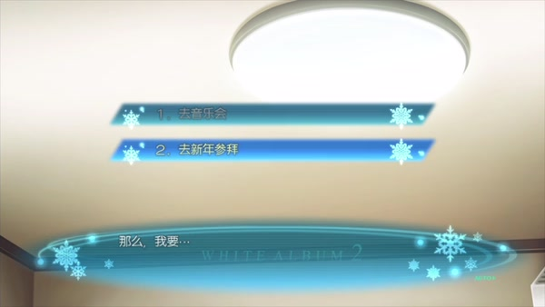
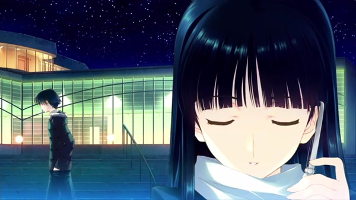
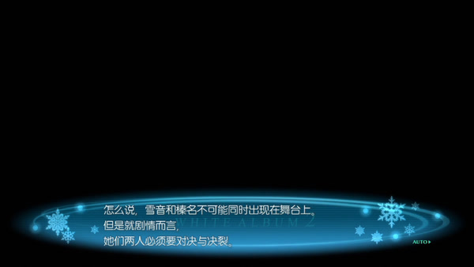
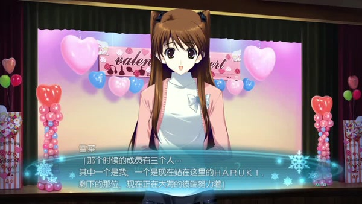

> **Spoiler warning:** This essay discusses every route in *WHITE ALBUM 2: Closing Chapter* and continues into the opening of Coda, ending when Kazusa calls Haruki's name in Strasbourg.[^source]
>
> **Image note:** This essay reproduces four low-resolution frames from PS3 gameplay for noncommercial plot criticism. Copyright remains with AQUAPLUS; the footage was uploaded to Bilibili by xueyinhualuo. The images are not open-licensed, and no republication permission has been obtained.

On December 31, a ticket to Youko Touma's New Year's concert lies on Haruki's desk. He knows the hall is nearby, and that Youko could put him in touch with Kazusa again. His mind runs ahead: attend the concert, ask Youko how her daughter is doing, and perhaps restore contact after that. He finally admits that any claim of having no interest would be a lie.

The game then gives the player two lines of text. "Go to the concert" appears above "Go on the New Year's shrine visit." The first choice is dimmed. The cursor cannot land on it, and the story continues through the second. Haruki has already voiced his desire, yet he never says that he does not want to go. The player never gets to choose. Desire has become legible and remains stranded on the menu.[^menu]

*The concert appears in the menu but cannot be selected. PS3 gameplay frame: ©2012 AQUAPLUS / via xueyinhualuo, Bilibili.*

That night's argument keeps Haruki, Takeya and Io occupied until 11:55 p.m. They walk past the concert hall just as the New Year's performance lets out. The scene cuts inside. Youko reserved a seat for Haruki, and it has remained empty from the opening to the final applause. Kazusa sits beside it. At 11:59, Haruki outside the hall and Kazusa inside each offer a New Year's greeting. Neither hears the other.

The empty chair is harsher than the disabled text. Haruki knows only that he has a ticket and a chance. The player also knows that Kazusa has returned to Japan, and that taking the seat would reduce three years of distance to the width of a chair. More knowledge still cannot carry his body through the doors.

[The previous essay, "Voices Before Names"](/en/posts/white-album-2-voice-before-names/) argued that the confession in *Introductory Chapter* had already placed desire inside a history of promises. Haruki may continue to love Kazusa while his relationship with Setsuna remains a fact; the airport separation erases neither. *Closing Chapter* takes up the next question. The person, time, place and ticket are all present. Why can Haruki still not act?

## A Ticket Still Cannot Get Him Inside

The assurance made before the school festival still governs them three years later. Setsuna pressed Haruki to promise that he would never end their relationship first. Unless she spoke the words, he would stay. After the airport, he keeps the promise in its literal form and never breaks up with her. The only exit is thereby assigned to the person most frightened of being isolated again.[^promise]

Those three years are full of action. Takeya and Io pass messages from Haruki to Setsuna, using "he has been busy" to cover his refusal to see her. Haruki changes departments, takes jobs and works late, packing his days until he has no time to think. Study and work remain parts of an actual life. They also give him dependable means to punish himself and avoid Setsuna. As long as he is busy in fact, "I never left first" can coexist with sustained withdrawal.

Setsuna cannot open the exit with one clean truth either. She once urged Haruki to dump her as soon as possible. The moment he retreated in accordance with her words, she called him back and withdrew the demand, insisting that everything she had just said was a lie. Asking him to leave tries to end the torment. Calling him back answers her inability to lose him once more. Each sentence carries out one desire; neither is a disposable shell around the other.

If Haruki treated the first statement as permission, he would use Setsuna's pain to accomplish the breakup he could not choose himself. If he accepted only the retraction, he would erase the part of her that had asked for release. He decides to wait for Setsuna to choose. The posture seems respectful, but it preserves the original asymmetry: Setsuna must end the relationship, while Haruki can remain still without limit.

On Christmas Eve, they try a tidier arrangement. Haruki says that he has forgotten Kazusa and asks Setsuna to forget with him. If they erase the history they shared three years earlier, perhaps they can begin a romance that belongs only to them. Setsuna hears something else: "Your words are so cruel. Why is the hand you hold out to me so gentle?"[^christmas]

Haruki reaches for her because he wants their mutual torment to stop and wants to embrace Setsuna again. Yet the article he has just written about Kazusa has already exposed the claim of forgetting. He never writes that he loves her, but his attention, his choice of words and the way he watches her all retain a preference. Setsuna reads the article as speech still addressed to Kazusa in the distance, and refuses his approach. A name can be struck from the contract while habits of attention and the direction of desire remain in the prose.

The New Year's menu appears after this failure. Its second choice does not send Haruki straight back to Setsuna. It takes him first to Takeya and Io. The two friends argue over why Setsuna pushes Haruki away whenever he approaches, reopening the blame and resentment that both sides have suppressed for three years. Their quarrel consumes the final minutes before midnight. Only then does Io make the call and put the phone in Haruki's hand.

At that same moment, Kazusa sits beside the empty seat.

*The two miss each other at the same venue after the concert. Dialogue before and after this frame establishes the empty seat; the image itself places Kazusa beside Haruki as he passes outside. PS3 gameplay frame: ©2012 AQUAPLUS / via xueyinhualuo, Bilibili.*

The framing refuses to explain the missed encounter through the distance between Europe and Japan. Only a few minutes and the walls of the hall separate them. Haruki's unresolved promise to his lover, his friendships and the life immediately before him stand in the way. Entering the hall would force him to answer for the changes that meeting Kazusa would bring to all of them.

Mari's route stages the same device again. The concert has begun and the hall is minutes away. "Go to the concert" appears and remains unavailable; the only action is "Stay here." This time there is no shrine visit and no phone call leading to Setsuna. Haruki remains in the editorial office because he has entered another relationship with Mari while still betraying Setsuna. After midnight, the view cuts once more to Kazusa and the empty chair.[^interface]

Both routes keep Kazusa behind the lock, while the permitted action changes with the life Haruki has already entered. The interface endorses neither Setsuna as the correct answer nor Mari as a substitute for Kazusa. It blocks a shortcut: Haruki cannot treat the wish for reunion as earlier and purer than his present ties, then skip disclosure, separation and the consequences of meeting.

The console release also invites players to expect a route unlocked on a later playthrough. The official system page explains that dimmed choices may open as the game progresses. Yet after Setsuna's route, the concert choice does not unlock; the menu disappears altogether. Fumiaki Maruto states the trick plainly in an interview. Players expect that completing every heroine will unlock the "Go to the concert" route, but its flag can never be set. The split-screen missed encounter was also part of his direction for the scene.[^flag]

This arrangement first conceals Coda behind a *Closing Chapter* that appears to have ended. It also makes the player see Haruki's wish to enter the hall alongside everything he must face first: Setsuna, his friends, work or Mari. The menu will not let the player delete one item on his behalf. Meeting Kazusa would change who possesses what information, who still counts as a lover and who bears the effects of that meeting. Haruki has settled none of these questions.

Kazusa has a body and a voice, and she is sitting beside the empty seat. She still cannot exchange words with Haruki. The events of three years earlier can enter his life only through recordings, roles and comparisons.

## The Past Becomes Material Others Can Use

Koharu first confronts *Introductory Chapter* by watching the school festival recording. Onscreen, Haruki and Setsuna draw close; the singing and their glances preserve an intimate relationship in the footage. Koharu concludes that they still love each other and decides to reunite them.

The recording has not deceived her. The omission lies in how she watches it. The image retains the trio's performance, but Koharu's first account reduces it almost to a pair of lovers. Kazusa's work in composing, training Haruki and performing does not enter Koharu's judgment. Haruki must later tell her why the three separated. After hearing his account alone, Koharu quickly casts Haruki as the injured party and understands Setsuna as a lover who punishes him by keeping her distance.[^materials]

That version gives Koharu enough reason to intervene, without giving her complete knowledge. A recording does not identify whoever falls outside the frame, and an account cannot erase the speaker's position. Once Koharu falls in love with Haruki, her earlier answer turns back on her: if Haruki and Setsuna belong together, where can she place her own desire?

Chiaki acquires more material. She studies the three people's lines of sight in the recording, listens to Haruki recount the past, then uses his reactions to refine her imitation of Kazusa. Haruki is both the person under analysis and an unwitting co-writer. His memories, body and taste keep telling Chiaki which version of "Kazusa Touma" will strike him hardest.

That accuracy supports care, gathering material and seduction at once. Chiaki understands how Haruki was hurt, and uses the same understanding to finish her work. The plot she has written stalls as soon as Setsuna answers back. Chiaki has assigned her the role of hating and attacking the woman who took Haruki. Setsuna asks instead, "Why can't it work if we're willing to forgive you?" Chiaki can only reply that the entire story would collapse.

Setsuna believes that the happiness she shared with Chiaki was real, then calls her own composure after they parted a perfect performance. Chiaki speaks desire through roles; Setsuna uses a smile to hold herself together. Performance was never Chiaki's technique alone. Neither woman contains a transparent "true feeling" that could be lifted out untouched by performance.

Chiaki later puts the Setsuna-Kazusa conflict onstage and gives their curtailed exchanges a more violent form. The production makes visible relationships that the characters could not put into words, while exposing the limit of representation. Chiaki can cycle one body through Yukine, Haruna and herself. She cannot give Setsuna and Kazusa separate bodies with which to correct the lines and live through what follows the curtain.

Mari never studies the festival recording. She reads the past first in Haruki's working habits: classes by day, writing at night, more shifts on holidays. If he uses every hour, he never has to face himself. Mari recognizes the method because she once used work as an anesthetic after heartbreak. Their intimacy begins through shared labor, while the old triangle enters by another route.

Haruki tells Mari that she resembles Kazusa. Mari immediately asks whether she is only a substitute. Haruki understands the question and first pretends not to. Each later comparison forces Mari to decide whether he sees the woman before him or an old love.

Mari's later career decision, her invitation to follow and the negotiations over life in New York gradually establish conditions specific to this relationship. Haruki's earlier claim that the two women cannot be compared and each has her own strengths does not settle the problem. The person before Haruki must be able to make demands, refuse his arrangements and carry the choice into her own work and daily life. Otherwise he compresses her into a template left by the former lover.

Each kind of material preserves something different. The recording retains actions. The actress gives conflict another voice. Comparison projects the past onto a present body. All three help a later arrival understand Haruki, and all three leave someone's answer out. Koharu misses the full triangle, Chiaki cannot authorize speech on behalf of Setsuna and Kazusa, and Mari should not have to accept comparison as Kazusa's stand-in.

The differences also follow from the way each woman enters Haruki's life. Koharu first knows him as a teacher willing to fight for a student, so she readily reads the festival video as the story of a good man trapped in an old relationship. Her mistake grows from care she has seen for herself. Chiaki begins by collecting people, voices and glances; for her, *Introductory Chapter* is first an unfinished work. At the publishing house, Mari controls Haruki's assignments and sees how a person can recast trauma as dependable labor.

All three later move from observer to participant. The consequences of their interventions depend on how much information they acquire and whom they allow to answer.

## After a New Relationship Forms, Who Remains in *Yasashii Uso*?

The completed routes for Koharu and Mari, together with Chiaki True, all close with *Yasashii Uso* ("Gentle Lie"). The routes exclude one another; they are not lessons that one Haruki experiences in succession. Players can place the three outcomes side by side from outside the branches, while each character lives through only one. The shared song groups the routes without declaring any of their new lives a failure.

### Koharu: She Cannot Decide the Ending for Her Friends

Koharu has barely promised Mihoko that she will never lie again when she preserves the most important omission with a technical distinction: "I didn't lie. I just can't tell you." She wants to help her friend win Haruki back, and she falls in love with him herself. Her sense of justice remains, while desire refuses to wait for justice to withdraw in good order. To keep both, she leaves Mihoko to decide with too little information.

Once the matter enters the school, the secret no longer belongs to three people. Rumors, a recommendation for admission, parents, classmates and younger students all begin to bear the effects. Koharu prepares to give up Haruki and forfeit the recommendation, concentrating as much punishment as possible on herself. Her willingness to suffer proves that she is in pain. It cannot decide whether Mihoko wants to know, become angry or remain her friend. If Koharu removes herself, everyone else still has to live inside the ending she arranged for them.

Haruki forces her, in a harsh voice, to admit that action also requires telling the other person and accepting the response. He concedes that he is exploiting a gap in Koharu's logic and denying her time to think. Koharu then keeps writing letters, while their friends relay contact between them. A year later, Mihoko finally calls for herself. Repair outlasts any single act of self-punishment or forgiveness and returns to the original network of friends.[^koharu]

Setsuna acts in this route as well. She makes Haruki set aside conscience and guilt long enough to name the person he most wants to protect. After he says Koharu, Setsuna and Haruki agree to delay disclosing their breakup so that responsibility will not crush Koharu before her entrance examinations. The arrangement protects the exam and withholds the truth from Koharu for longer.

Setsuna eventually takes Koharu to Haruki herself. After sending her off, she asks under her breath, "As her big sister, and as the ex-girlfriend, I've finished my job, haven't I?" Then she cries. The script cuts back to their parting two weeks earlier, allowing Haruki at another point in time to read her smile through the window as forgiveness. The smile, the arrangement and the tears are all real. "She forgave everything" is the limited understanding Haruki needs to carry away.

Koharu's restored correspondence with her friends gives this route a future of its own. *Yasashii Uso* preserves another layer of time. Protective delay carries them across the examinations and the farewell, while the same delay makes the injury appear later. Gentleness and deceit perform the same act here.

### Chiaki: One Performer Cannot Supply Two Answers

Chiaki's route moves from authority over interpretation to the stage. She has already written the triangle's conflict with great accuracy, yet Haruki still asks why someone who understands another person's pain so well refuses to let that knowledge restrain her. Chiaki's answer never settles into one final line of candid dialogue. She keeps acting through roles, and Setsuna keeps refusing the position written for her.

*One actress plays both Yukine and Haruna; the script directly acknowledges the staging problem that prevents them from appearing together. PS3 gameplay frame: ©2012 AQUAPLUS / via xueyinhualuo, Bilibili.*

The final act solves the practical difficulty that "one stage cannot show Yukine and Haruna at the same time." Chiaki can switch roles, and the feelings released by those roles can strike her in return. Formal success does not give Kazusa a right of reply. A single actress controls the entrances, pauses and exits of the conflict between the two women onstage. Setsuna, in the world outside the play, has to deal with the way this representation changes her life after the performance.

The script makes the audience part of the performance as well. The trio onstage plays *Todokanai Koi*. Members of the troupe planted among the seats begin discussing the contest, and the ordinary audience follows their cue. For a while they forget that they are watching a play and take it for a live concert. Haruki and Setsuna know that the dialogue comes from their lives and that the plot departs from fact on purpose. They still hold hands in the audience.

The third act jumps straight ahead three years and supplies an ending to the confrontation that never happened in life. Yukine has a singing career; Haruna remains beside Kazuki. The two women finally face each other and "love each other while crushing each other." Watching them, Setsuna says only that she had not been so strong then, and neither had Kazusa. In reality, the conflict was cut short before either woman could say everything; Chiaki stages a counterfactual eruption in their place.

She does not leave the answer with any fixed role. In the last act, Yukine gradually takes on the desires of Setsuna, Kazusa and Chiaki herself. She will surrender neither her lover nor singing, and she refuses to guarantee that the eventual choice will be correct. The role begins to rewrite its author. Chiaki's body collapses twice as she finishes the work, and there is not even a curtain call. She can no longer stand outside the play and call every pain mere source material.

Haruki chooses Chiaki while still calculating relationships through self-harm. Being deceived by her again seems easier to bear than hurting Setsuna once more. Chiaki first refuses his touch, but her body cannot stand; a moment later, she asks him to hold her tightly. Her refusal denies Haruki the comfort of calling the embrace a rescue. Her request then lets her stop falling alone.

Setsuna refuses Haruki's coat and his embrace. She admits her jealousy, hatred and inability to forgive, and will not let his gentleness preserve a passage back and forth. Once Haruki is no longer beside her, she says, further kindness from him will only cause trouble. The farewell stops on an unfinished form of address, and *Yasashii Uso* receives the words she cannot complete.[^chiaki]

After the credits, Haruki still cannot locate a Chiaki who never performs. He wonders whether they have returned to a "false healing," while Chiaki decides in an unspoken thought to keep playing the clown. Living together does not strip the roles away one by one. They can only learn when the other is acting, when care is needed, and allow each judgment to remain open to challenge.

### Mari: Only After the Chase Does Life Begin

Mari's route submits decision to another scale. She first tells Haruki that lovers should discuss a transfer. When her own move to New York arrives, she describes a transfer she requested and could refuse at great professional cost as an irresistible personnel order. She wants to go and wants someone to stop her. Compressing both desires into "I had no choice" is the lie she tells herself.

Before giving chase, Haruki keeps his appointment with Setsuna. He tells her about Mari, the physical betrayal and the love he refuses to relinquish. He also admits that he delayed disclosure by repeating "I'm happy now" and "telling her would only hurt her." The confession ends the omission and gives them no gentle farewell.

Setsuna briefly offers her own body in Mari's place, and Haruki refuses. He then says that he will continue to love Setsuna. She replies, "What a cruel thing to say... thank you." Love comforts her while preventing her from erasing their old relationship as a misunderstanding. Setsuna separates their joined hands herself, blesses his departure, and waits until he is gone before breaking down in front of Takeya and Io.[^mari]

Elsewhere, Mari does not want to leave alone as completely as she claims. She conceals her return to Japan and her departure time, then writes the flight and the final deadline in an email that directly asks Haruki to come after her. At the airport she calls the snowstorm, the flight and the unanswered phone "fate." When she thinks Haruki has failed to arrive, she too briefly occupies the position of the person left behind.

The flight gives those opposing desires a deadline. Mari can go to New York and hope Haruki follows. The damage begins when she first describes a negotiable career choice as an order, then hands the private answer to the weather. She has the resources of a supervisor, senior colleague and older partner. Haruki controls whether he follows and how he arranges his life. Neither can let "fate" answer for the other.

*Yasashii Uso* enters at this point. The credits first let the farewell stand; only the epilogue reveals that Haruki reached New York by another route. He secured a visa, called on contacts from his editorial work, and rerouted through Nagoya and Detroit until he arrived ahead of Mari and stood waiting for her. His enrollment, income, housing and work all remain unsettled. The two have only begun to discuss them. The transatlantic journey ends the delay, and daily life begins to demand responsibility from them both.

### One Ending Theme, Three Things Left Unsaid

Koharu resumes contact with her friends. Chiaki and Haruki begin living together. Mari and Haruki start reorganizing a life across borders. Rena Uehara sings *Yasashii Uso*, whose first person has no name; official releases later gave the song separate character covers by Setsuna and Kazusa. Across these three routes, Setsuna most consistently occupies the position of the person left behind. Mari briefly joins the same voice when she believes Haruki has not followed.[^ending]

The song keeps the costs outside the ending frame audible. Koharu's protective arrangement, the passage kept open by gentleness in Chiaki's route, and the cruel consolation of Mari's route all help the characters complete farewells they could not yet manage while telling the whole truth. Each also postpones some jealousy, anger or knowledge. These lies preserve conflicting desires: the characters want to protect the person before them and refuse to surrender their own love. The farewell can happen for now; jealousy and knowledge wait for later.

In all three routes, Setsuna performs the final relational act herself. She sends Koharu away, closes Haruki's gentle route back in Chiaki's ending, and parts their joined hands in Mari's. Her own route must therefore return the questions of approach, singing and continued life to her.

## The Ensemble Without a Piano Returns the Decision to Setsuna

The New Year's call first changes the way Haruki tells the truth. He admits that he has not forgotten Kazusa and probably never will. Before the next sentence, he remembers the impetus Mari, Chiaki and Koharu gave him during their encounters on the common route. Mari gave him courage to act. Chiaki forced him to concede that he could not give up while he still cared. Koharu made him believe that moving forward would not necessarily earn rejection. These are meetings before the branches diverge; Haruki has not lived through three mutually exclusive endings.

He then tells Setsuna that he still loves her very much. The two statements need each other. Without the first, Haruki would pretend that Kazusa had been forgotten; without the second, he would give Setsuna no answer in the present. Said together, they offer a way out of the shared forgetting attempted on Christmas Eve. Setsuna breaks down after hearing them and does not declare that they are a couple again.[^newyear]

A few days later, she says she can chase Haruki when he runs from her, but cannot face him when he approaches of his own will. Takeya and Io can create an opportunity to talk; they cannot turn fear into consent for her. Haruki does not ask them to answer in her place. He calls each day and arrives with his guitar, giving contact a repeatable place in time.

Drunk on one of those evenings, Setsuna says, "I love you more than anyone, and I hate you more than anyone." Haruki neither selects one statement as the truth loosened by alcohol nor cancels the other. He keeps playing until she falls asleep. Love sustains the attachment; hatred protects the self he injured. The guitar holds both demands for a while without forcing either to prevail.

Once Setsuna is sober, Haruki refuses to erase what she said. She also stops treating the guitar as a chance consolation and, in front of their friends, asks to hear it every day. Private care becomes a routine both people recognize. She states a need, Haruki rearranges his time to answer it, and their friends can see how the relationship moves.[^guitar]

The routine soon produces another stalemate. Haruki is prepared to wait forever, and Setsuna is willing to preserve the contact they have recovered. Takeya says this will trap her for another three years. Io points out that although the two talk, meet and listen to the guitar each day, the most dangerous distance between them has barely changed. Haruki then admits that his forbearance also shelters him from the possibility that he may never see her again.

Tomo's radio program and invitation to sing live upset the balance. The old label "school idol" suddenly returns to Setsuna. She does not seize the chance for a comeback; she retreats to the stage from three years earlier. Haruki hears her explain there why she stopped singing: "So that I could keep loving you, I made myself hate singing."[^singing]

Singing recalls the happiness of the school festival together with the secret rehearsals, jealousy, betrayal and airport. To preserve her love for Haruki, Setsuna cut off the voice that summoned the entire history. She came to hate singing over those three years. Her silence is more than a disguise waiting to be exposed; sustained self-formation has become part of her life.

After saying this, Setsuna repeatedly insists that she is "fine" and offers Haruki her body, hoping to restore their relationship as lovers at once. That would leave her to swallow the love, hatred and fear she has finally spoken. Haruki stops and picks up the guitar again.

With the guitar in hand, he keeps talking about the "real Setsuna." He treats the girl who sings, acts selfishly and gets angry as her original self. While preparing the performance, he even invokes the audience and her responsibility to them to press her back toward the stage, and realizes that he increasingly sounds like Tomo. He is helping Setsuna recover a means of expression while prescribing the person she ought to become.

Haruki changes the arrangement only when he states that he wants to perform and leaves the final decision with Setsuna: "If Setsuna says we can't take part, then we can't." If she refuses, they will apologize to the organizers together and share the consequences of withdrawing.[^decision]

This statement changes how the old promise is carried out. Three years earlier, Setsuna had to pronounce the end while Haruki waited where he was. Now each states a desire and Setsuna can refuse. Her refusal would not make her solely responsible for destroying the relationship; whether they perform or withdraw, both will deal with what follows.

Setsuna is not persuaded at once. She stays to watch Haruki rehearse and reconsiders the listeners, the old songs and her own wish. At last she walks into rehearsal herself. Two days cannot restore Haruki's guitar technique or a voice that has not sung for three years. Setsuna knows that singing may revive her hatred of Haruki, and chooses the stage anyway. Her arrival completes the turn.

She waits outside the venue for Haruki rather than entering first and handing herself over to the organizers. For two days they have rehearsed wherever one guitar would fit, including a karaoke room and Haruki's apartment, then separated only four hours before the performance. Haruki is afraid of oversleeping and keeps practising. Setsuna sets three alarms and still has to be awakened by her mother.

The performance addresses more than the couple. Koharu and her friends, Chiaki, Takeya, Io and Tomo all sit in the audience. Setsuna keeps the private details private. She admits only that her three years without singing were a form of escape and says that she will continue to sing. Their attempt at repair now enters a public life in which other people can hear it, answer it and remember.

"I'm okay" also changes direction before they go onstage. Setsuna had used the phrase to stop Haruki from asking further questions. This time Haruki says it to her even though both know how unprepared they are, and his narration admits that he too is putting on a brave front. Setsuna answers by singing the words. For the first time, the phrase passes back and forth between them.

*Setsuna publicly acknowledges the original trio and the member now missing. Haruki and the absent piano both lie outside this frame. PS3 gameplay frame: ©2012 AQUAPLUS / via xueyinhualuo, Bilibili.*

The school festival three years earlier had a vocalist, guitar and piano. This time Haruki has only a rusty guitar, while Setsuna is a singer who has forgotten how to sing. "We no longer have a piano," Haruki says in narration. They hire no actress to replace Kazusa and use no recording to fill her part. They begin to play with the loss still audible and visible.[^concert]

On New Year's Eve, the hall and ticket had been ready, yet Haruki could not enter. On Valentine's Day, the piano is missing, yet he and Setsuna can state what they want and bear the consequences of refusal, performance or withdrawal.

Haruki and Setsuna finally send *Todokanai Koi* to Kazusa far away. Setsuna tells the audience that the band once had three members and now reunites with one missing. Haruki then understands their performance as a message telling Kazusa that they have managed to go on living. She belongs to their shared history and can only receive this message from a distance.

Setsuna speaks with restraint onstage. She reduces the breakup of the trio to "many things happened." She does not disclose the betrayal to the audience or explain on Kazusa's behalf why Kazusa left. Setsuna takes responsibility for her own silence, admits that it hurt many people, and says that she will keep singing. Public action does not require turning every private truth into material for spectators. It requires enough truth to sustain the song that follows and to expose her future singing to the listeners' response.

Setsuna's route uses *Aisuru Kokoro* as its ending song and does not return to the voice of separation shared by the other three routes. It organizes a common future that Haruki and Setsuna have already begun. Setsuna re-enters her relationships with family and friends, while Haruki places his proposal on a concrete schedule. The future still has one limit: they can send a song to Kazusa, but cannot yet hear her answer, much less let her participate in their plans.

The epilogue changes the old promise one last time. Haruki travels to Strasbourg for work, and the couple agree to meet within a week. Setsuna does not wait in Japan; she follows him to Europe. On the phone, she says that she came there to chase him. Haruki once promised never to leave while Setsuna guarded the place he had left. Now both are in motion, fitting the promise into train times, hotels and the schedule of Christmas Mass.[^strasbourg]

Setsuna is still aboard the shuttle into the city when Haruki walks alone through Strasbourg. He does not know that Kazusa comes here on holiday at this time every year. A voice behind him calls "Haruki" first. He turns and sees her. They happen to meet because Kazusa is here on holiday; the work email he opens next gives the two a formal reason to speak again, since she is his interview subject the following day.

Kazusa once greeted the empty seat in the concert hall, and Haruki and Setsuna once played a message to her in the distance. Neither message received an answer on the spot. Now the person who for three years could only be watched, performed, compared and addressed speaks first. Haruki already has an engagement ring, and Setsuna is on her way. The empty chair had confined communication among the three to one-way greetings; now Kazusa has stopped Haruki face to face.

"Haruki."

"Kazusa?"

[^source]: For game information and production credits, see the [AQUAPLUS official site for *WHITE ALBUM2 幸せの向こう側*](https://aquaplus.jp/wa2/). Japanese dialogue was checked line by line against the game script; the [MAO Translations Script Browser](https://mao-tls.github.io/white-album-2/script/) provides a public search interface. All English quotations in this essay have been translated from the Japanese.
[^menu]: Script locator: `wa2:cc:2024:24–57`. The menu state in the console release can also be seen in this [PS3/Vita route record](https://nmm.blog.jp/archives/21904551.html) and the [complete PS3 gameplay recording](https://www.bilibili.com/video/BV14y4y167aW/).
[^promise]: IC promise: `wa2:ic:1006:1491–1519`. The three years of distance in CC: `wa2:cc:2002:365–460`; `wa2:cc:2009:1110–1149`.
[^christmas]: Script locator: `wa2:cc:2019:397–447,780–895`. Haruki claims that he has forgotten Kazusa and invites Setsuna to forget with him. Setsuna first questions him, then uses the article to expose the claim. The scene does not have both of them claim that they have already forgotten.
[^interface]: The missed New Year's encounter in Setsuna's route: `wa2:cc:2024:51–218`. The same disabled choice and missed encounter in Mari's route: `wa2:cc:2503:67–170`.
[^flag]: The [AQUAPLUS system page](https://aquaplus.jp/wa2/system03.html) explains that darkened choices are unavailable and may open with progress. For Maruto's comments, see Yuichi Murakami, "[社会に全力で立ち向かいたい人のための，PS3『WHITE ALBUM2』インタビュー](https://www.4gamer.net/games/186/G018635/20121215001/index_2.html)." The menu state after completing the console release appears in the route record cited above.
[^materials]: Koharu watches the recording at `wa2:cc:2012:95–136`, then judges the situation after hearing Haruki's account at `wa2:cc:2303:114–190`. Chiaki reconstructs the triangle and designs the roles at `wa2:cc:2402:859–1051`; `wa2:cc:2406:248–371`. Mari reads Haruki's working habits and asks whether she is a substitute at `wa2:cc:2011:114–156`; `wa2:cc:2504:365–445`.
[^koharu]: Koharu's omission, self-punishment and later correspondence: `wa2:cc:2308:78–141`; `wa2:cc:2313:405–453`; `wa2:cc:2315:72–140`; `wa2:cc:2316:330–430`; `wa2:cc:2320:139–235`; `wa2:cc:2322:101–125`. Setsuna's farewell and the intercut chronology: `wa2:cc:2321:209–384`.
[^chiaki]: Setsuna's refusal of Chiaki's script, the play and the farewell: `wa2:cc:2407:592–749`; `wa2:cc:2408:127–308`; `wa2:cc:2411:612–900,1100–1218`. Chiaki's unspoken thoughts after she and Haruki begin living together: `wa2:cc:2412:46–107`.
[^mari]: Mari's transfer, Setsuna's farewell and the New York epilogue: `wa2:cc:2507:361–405`; `wa2:cc:2513:542–599`; `wa2:cc:2516:572–814,930–1012`; `wa2:cc:2517:1–123`.
[^ending]: The F.I.X. Records [track page for *l'espoir*](https://fixrecords.com/kiga12/) lists the performer, lyricist and composer of *Yasashii Uso* and identifies it as a CC ending song. Its assignment to the three completed routes appears in this [PS3 credits transcription](https://w.atwiki.jp/ercr/pages/4256.html) and the route record cited above. Setsuna's route uses *Aisuru Kokoro*. Setsuna's cover appears on the [TV Animation Vocal Collection](https://fixrecords.com/kiga23/); Kazusa's appears on AQUAPLUS's [Original Soundtrack ～encore～](https://blog.aquaplus.jp/archives/7142).
[^newyear]: Script locator: `wa2:cc:2024:222–295`. The friends' later intervention and Setsuna's right to answer appear at `wa2:cc:2026:82–184`.
[^guitar]: Script locators: `wa2:cc:2027:588–709`; `wa2:cc:2028:51–112`. The renewed institutionalization of waiting appears at `wa2:cc:2029:292–410`.
[^singing]: Script locators: `wa2:cc:2029:421–429,741–780`; `wa2:cc:2030:204–415`. The phrase "real Setsuna" names Haruki's expectation in this essay; the work does not certify it as an objective, authentic self.
[^decision]: Script locator: `wa2:cc:2030:403–600`. Setsuna's observation, decision to rehearse and reflection before taking the stage appear at `wa2:cc:2031:181–322`.
[^concert]: Script locator: `wa2:cc:2031:342–441`. Setsuna publicly says that the band is missing one member. The idea that they are "reporting to Kazusa" belongs to Haruki's subsequent narration and interpretation of the performance.
[^strasbourg]: Setsuna's decision to cross the distance, the proposal arrangements and the encounter with Kazusa: `wa2:cc:2032:15–35,203–250`; `wa2:cc:2033:15–101`. Kazusa calls Haruki's name first; only afterward does Haruki read that she is his interview subject the next day.
