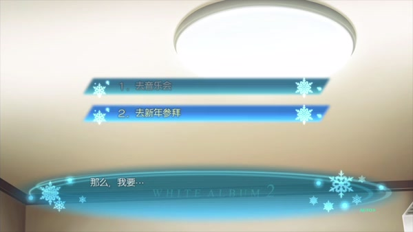
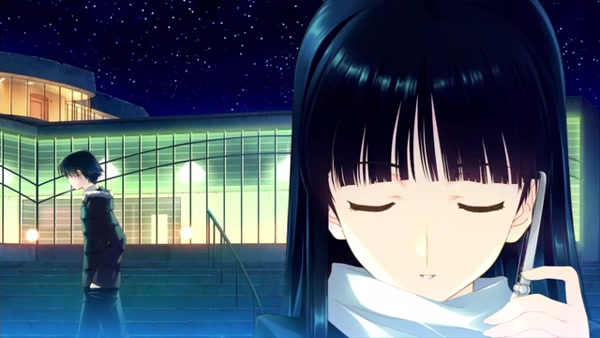
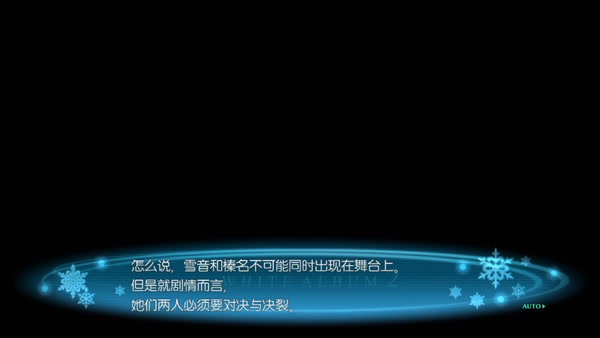

凌晨三点，春希还在公司。末班车早没有了，回家须走四十分钟。他想，这倒好：走得累些，睡得沉些，最好连梦也不做。休息日也有用，可以补觉。一个年轻人的日程这样安排起来，工作有了着落，疲倦有了着落，连空出来的日子也有了着落。唯独不知怎样面对的人，暂且不必面对。[^busy]

这是《白色相簿2》Closing Chapter 的三年。三年以前，和纱离开日本，春希与雪菜留下；三年以后，他读书，打工，写文章，租房过活，并没有守着一张旧照片坐到今天。雪菜也活在这些日子里，托人问他的近况，接他的电话，想靠近，又退回去。两个人没有正式结束关系，也越来越难在关系中相见。

说他们没有走出过去，自然不错。不过，这话还太省事。过去并非另有一间房，将两个人关着；房租要付，稿件要交，电话会响，明天照样来。他们正是借着这些今天的事，把旧关系过成了今天的样子。三年的后果，不能都算在三年前那一夜的账上。

李清照写：“旧时天气旧时衣，只有情怀、不似旧家时。”[^title] 天气与衣裳似乎仍旧，人的情怀却已不同。CC 里旧歌、旧话、旧场面一再出现：有些把人带回原处，有些使他们做出从前做不到的事。相似的事，为何有时让关系照旧重演，有时又带来另一种回答？

[上一篇《未成曲调先有情》](/posts/white-album-2-voice-before-names/)写告白以前，三个人怎样在共同生活中彼此牵动。如今合奏散了，和纱远去；本篇接着看，三年前的联系怎样留在春希与雪菜的日常里，后来走近的人又怎样改变他们能做的事。

*下文涉及 CC 各条路线及 Coda 开场。三条支线是互不相容的故事可能，不是春希依次经历的三段恋爱。日文脚本引文由本文译出。封面为本站原创概念图；四张低分辨率 PS3 实机画面用于非商业剧情评论，著作权归 AQUAPLUS，录像来源为 xueyinhualuo，未获转载授权。[^source]*

## 既自以心为形役——陶渊明《归去来兮辞》

忙碌最方便的地方，是它确实忙。

春希转系以后所做的功课、新闻社的事、编辑部的工作，都有实在的内容。他的稿子先后被退回、终于获准刊用；这份进步，是实实在在练出来的。若只说这一切都是逃避，便把他三年间学会的东西一笔勾销了。麻理批评他拿工作躲感情，也没有因此否认工作的价值；她恰恰要求他认真对待这份工作。[^work]

麻理批评的不是工作本身，而是春希怎样用日程躲开雪菜：他削去私人时间，尽量少接近她。她仍温柔地待他，他便想走近；可一想起自己做过的事，又觉得没脸，于是逃开。逃开以后，他更讨厌自己，便又让工作把日子填满。工作能做完，文章能发表，两个人的关系却仍停在原处。那原处，也是他每天走回去的地方。

春希确实希望和雪菜好起来。可他迟迟不作答，也让一种熟悉的自我形象继续存在：我没有抛下雪菜，我还在为那件事受罚，因此不该轻易幸福。自责伤人，却也使他能把自己认作那个仍忠于过去的人。倘若有一天竟快活起来，先前那些痛苦又要怎样解释？

齐泽克在《幻想的瘟疫》中借欲望与驱力的区别，提醒我们：所求一直落空，不等于反复追求毫无所得；人在循环本身也可能另有所得。[^repetition] 因而，春希的靠近、内疚、逃开和自厌，不能只按“为什么还没成功”来读；还得看这一来一回让什么继续成立。他在工作上确有进步，在关系里却仍以自责代替答复。两件事同时为真，不能彼此抵销。

这样的往返也让两人没有彻底失去彼此。春希不作答，雪菜便还可以追问；雪菜继续来问，春希也还可以用歉疚回应。两个人都在受苦，却谁也还没真正离开这段关系。问题是，维系联系的正是令他们受苦的做法。若只劝他们到此为止，他们便得先放弃眼下仅存的联系；可该怎样建立新的关系，两人还不知道。春希的退避延长了不确定，雪菜在不确定中求答，又会在承受不了时撤回。她收回自己的话，却不能因此替春希完成答复。

武也替春希圆场，说他只是工作忙，也许没能参加聚会会觉得遗憾。雪菜接过话，先问他吃得好不好、睡得够不够，最后追问：“他笑了吗？”一句话把武也问住了；依绪听出了他的谎话。[^friends] 吃饭和睡觉都能替忙人说明，笑容却逼他回答：忙成这样，春希过得究竟怎样？

依绪觉得，三年了，雪菜总该原谅春希；武也却想到，三年了，两人也可以分开。两种说法都有理由，只是他们更愿意看见两人复合。话听着是在替两人打算，也藏着朋友自己盼他们复合的心思。后来武也再劝春希等雪菜时，这个区别还会回来。

归有光写项脊轩，房子不大，时间却在墙垣与门扇间变了样。墙垣增添，门的位置改过，家人各从自己的地方经过；妻子曾来轩中问旧事、学写字，旧房也容过新日子。后来房子修好了，人却没有回来。认出旧房，不能认回旧日生活。[^room]

春希这三年的变化，也写在日程、场所和声音里。一天仍有二十四小时，他却越来越少把时间留给雪菜；遇见某个名字就转开，电话响起时也常常说不到要紧处。过去不只留在记忆里，也写在这些日常动作里。学业、写作和工作，他一样样做得更熟；有些话却越来越难说出口。判断他后来是否改变，也要看他能不能说出、做出此前做不到的回应。

## 只有情怀，不似旧家时——李清照《南歌子》

雪菜打来电话。春希语气一软，她就想起他的声音，想和他见面；可一想到另一个女人也许在他身边，她又叫春希干脆甩掉自己，让她自由。春希一退，她立刻收回这话，说刚才都是谎言。[^phone]

若只准两句话里留下一句，答案似乎很好选：想分开是假话，想留下才是真心。可雪菜说“结束这种折磨”时，折磨并非假的；她怕春希真的离开，也不是故意说反话。她第二次收回前话，通话才得以继续；可这一收，也把刚打开的分手之门关上了。她不是先在心里定好一个答案，再故意说反；这通电话里的话互相抵牾，正说明她还没能承受其中任何一种后果。

春希若把她的撤回当作最后答案，就还能继续等：不必明说两人已经分开，也不必承认自己仍爱她。于是雪菜既要等他的答复，又得亲口说出不再等。春希没有主动离开她，却把“我们是否就此分开”的最后一句留给雪菜说。

“我没变”也能替春希守住现在的位置：只要他还记得、还痛苦、还没有爱上别人，他便可以说自己内心始终如一。可雪菜经过的三年，都是春希不在场的日子。两个人说的“没有变”，起点并不一样。

夏目漱石《其后》的代助面对三千代，坚称从前与现在没有一点不同。三千代却低声说，你从那时起就已经变了。他认为她看错了；她问的却是，为什么把自己舍弃。代助又说，他也受了惩罚，三年多来一直独身。三千代回答：那不都是你自己的选择吗？[^sorekara]

三千代并不是说代助没有受苦；她只是提醒他，受苦是他自己的选择，不能因此替她结清那段日子。代助把独身看作忠实，三千代却也有自己的婚姻与经历。两人的感情仍能相通，却不能由代助一个人讲完这段关系。

春希也想用“忘记和纱”重写共同的过去。圣诞夜，他说自己已经忘了她，劝雪菜也忘了，仿佛删去和纱，两人就能回到学园祭之前。可雪菜所爱的人，正是经历过那一切之后的春希；如今却要她先承认这段相识不重要，才有机会重新得到他。[^christmas]

可文章没有替春希保密。他写和纱的报道，雪菜读了一遍又一遍，从挑剔之后的维护、批评里的偏爱，认出他看和纱的眼光。稿子里没有告白，目光却早有方向。新得的写作能力，反倒把他口头宣称结束的关系写了出来。

更绕的一层，出现在春希想象的对话里。他仿佛先得到远方那位和纱的准许，才可以抱紧眼前的雪菜。[^permission] 这句话并非现实中的和纱所说，而是春希替她安排的回答。春希所爱仍是雪菜，许可却从想象中的和纱那里来；雪菜听到“我选择你”，仍未必得到“我会向你负责”的保证。

齐泽克谈“追溯性”时，说明人会借今天的命名重排过去的意义。事情发生过的事实不会随之改写；但我们今天怎样叙述它，会影响它在现有关系中占据什么位置。[^past] 春希说“已经忘了”，想把这句话当成两人重新开始的根据。可他的报道与想象中的对话都表明，那段关系仍在替他分配谁能靠近、谁得作答。

过去的事实不能抹去，关系却不必永远按同一套办法继续。要变的不是有没有和纱，而是春希能否不再借她的名字，替眼前的选择作答。

## 盈盈一水间，脉脉不得语——《古诗十九首·迢迢牵牛星》

除夕，春希有一张曜子音乐会的票，也有赶过去的时间。它先是一份工作获得认可的回报，随后才成为通向和纱的可能：他可以见到她的母亲，可以询问近况。春希尚不知道和纱本人就在日本。[^menu]

菜单列出“去音乐会”和“去新年参拜”两项。PS3 画面里，前者发灰，光标停在后者。[^menu]

*曜子音乐会出现在选项中，却不能执行。PS3 版实机画面：©2012 AQUAPLUS / via xueyinhualuo, Bilibili。*

春希有票，也来得及赶过去；难处却不在行程。雪菜仍等着他回答，他不能再把和纱当成绕开眼前关系的另一条路。玩家看得见那项选择，却不能据此把这三年当作没有发生。

和纱也不知道这张空席为何而留。演出散场后，曜子问她左边的座位有没有人。她想起那张椅子从头空到尾，便问母亲原先邀了谁；曜子没有明说。和纱以为日本已没有她容身的地方；玩家却知道，曜子确实为一个人留了座，那人没有来。[^seat]

*演出前后的台词交代了那张空席；画面则把和纱与音乐厅外经过的春希并置。PS3 版实机画面：©2012 AQUAPLUS / via xueyinhualuo, Bilibili。*

这次错过不只是机缘不好。春希把和纱留在那个自己不敢面对的过去；和纱则以为日本已没有自己的容身之处。曜子知道左边的座位始终空着，玩家则知道它原是为春希留的；春希与和纱却都不知道，对方就在音乐会附近。两人离得这样近，还是没能见面。

《项脊轩志》可以借来写时间与空间，却不能把和纱当作归有光笔下的亡妻。亡人不能推门而入，和纱却还活着，会询问、会猜错，也会说日本已无容身之处。春希怎样记住她，不能替她说完这三年；她仍可能用自己的行动改写这个故事。

和纱还没有回到春希的生活，他却已遇上小春、千晶和麻理。她们各有朋友、工作和愿望，不会因为春希有一段难忘的旧事，就成为续篇的陪衬。

## 朋友切切偲偲——《论语·子路》

小春与春希相似：遇事喜欢替人出头，相信道理说清以后，事情就该明白；替人奔走半天，末了又把责任一股脑收回自己身上。可相似还只是开头。小春的友情受了损，春希不能再像谈自己的过错那样，说一句“都怪我”便了结。[^koharu-friends]

小春被同学议论，说她抢了朋友喜欢的男生。流言将她说成抢走朋友恋人的人；朋友疏远她，却是她眼下正在承受的现实。春希知道她被孤立，也看见她想独自承受；这和他当初很像。武也故意把话说得难听，逼他看见：他很能忍受别人骂自己，却未必愿意眼看小春也被人这样责骂。[^koharu-friends]

小春的处境让春希看见，认错不等于承担后果。他过去总以为，把错全揽到自己身上就是承担；如今看见小春也这样做，他才发现这会让受伤的人继续退开，让朋友等不到解释，也让自己有理由迟迟不介入。一个人肯吃苦是自己的事；这份苦能不能修复一段关系，还得看受伤的人有没有得到解释和回应。[^koharu-friends]

冲突之外，春希也开始向小春讲自己的过去。回想那次谈话，他觉得并非说出口以后才渐渐好转，而是已经有些好转，才终于能说。[^koharu-telling] 因而，小春的作用不只在于耐心听完；两人平日怎样相处，也让那些难碰的事慢慢变得可以谈。

小春没有把友情的破裂当作恋爱得来的代价。她把信送到美穗子家，写下两人一起上学、相处和争吵的记忆，承认眼下愿意退一步，也盼着日后还能再争吵、再和好；什么时候原谅，仍由美穗子决定。后来小春考试合格，朋友们聚在一起商量怎么祝贺她，又催美穗子给小春打电话。小春听见了她的声音。[^koharu-letter]

这些小事还不足以说明美穗子和小春已经和好。小春仍要把信交出去，等着看美穗子愿不愿意回应；她不再只在心里判自己有罪，也开始把解释和选择留给美穗子。春希也得学会把自己笼统认下的错，重新放回具体的人和事里看。

雪菜也在这条线上作出选择。她发消息告诉春希小春已经到等候的地方；小春离开后，她才独自哭出憋了两周的眼泪。[^koharu-setsuna] 她确实帮两人走到了一起，伤心也同样是真的。成全春希不等于她已经释怀；能够做成一件事，也不等于不再受伤。

小春让春希重新谈起三年前，也使他看见，独自认错不能替任何人承担后果。她与春希的关系有所改变，她和美穗子的友情却还得慢慢修复；那封信和一年后的电话，都是两人重新来往的开头。

## 假作真时真亦假——《红楼梦》第一回

千晶不只像春希，她还听得懂他怎样讲雪菜与和纱。她整理两人的形象，再照着春希容易接受的样子调整自己。她用到的家庭经历确有其事，舞台工作也是真的；她有意挑选、安排这些材料，让自己呈现成春希容易接受的样子。[^chiaki-making]

真正棘手的，正是她太懂春希。她知道春希怎样讲两位女性，也知道哪些动作会使他靠近、哪些话会让他退开。理解得准确，可以让人更会照料对方，也可能使人更会安排对方；懂得一个人，还不能证明善意。

春希原本是叙述者。他挑出记忆中重要的部分，说明谁冷、谁暖，谁伤害过他，又怎样救过他。到了千晶手里，这些话变成了工作材料；春希本人也成了作品要安排的角色。他由此碰到一种令自己不安的处境：被理解，也可能意味着被挑选、被删节、被放进一个自己没有同意的角色。

人有时会照着别人喜欢的样子改变自己。千晶熟悉春希的判断，也知道怎样让他接受自己；可她不只想讨春希喜欢，也想把戏演好，尤其想演好最难的部分。随着排练推进，她把自己也放进了这场戏。

这个难题在舞台上有了具体形式：雪音与榛名由同一位演员承担，剧本明说两人不能同时出现，却还得完成对决与决裂。[^stage] 千晶必须靠表演让这一场戏成立，也因此说服了观众。能把矛盾演得可信，正是她的本领。

*同一位演员承担雪音与榛名，脚本直接承认两人无法同时出现的调度难题。PS3 版实机画面：©2012 AQUAPLUS / via xueyinhualuo, Bilibili。*

舞台上的矛盾可以由演员和剧本安排，现实中的雪菜与和纱却不能由千晶代答。千晶可以把两个人演得可信，却不能替她们回应春希。若观众把舞台上的理解当成现实中的宽恕，越是精彩的表演，越容易让人误以为事情已经处理妥当。

雪菜也懂表演的用处。她在千晶线里维持冷静，独处后又用“演技完美”来形容自己。[^chiaki-setsuna] 从容的雪菜仍可能真心想成全春希；痛苦的她也未必能当场把一切说出口。表演可以操纵别人，也可以暂时护住自己，让她不至于在对方面前崩溃。若把表演一概看成虚假，便看不见它也曾保护过她。

告别时，雪菜说以后不要再借她的外套，也不要再搂她的肩。她怕眼前的温暖让自己又舍不得离开，于是留下春希的拨片，却不肯再接受他的触碰。[^chiaki-goodbye] 她得替自己安排今后的生活；连善意是否要收下，也由她来决定。

千晶承认自己握着伤人的刀，也答应不再用它；这份承诺还得看她日后怎样做。[^chiaki-knife] 她会演戏，也曾利用对春希的了解伤人，如今又答应不再这样。如果两人还要相处，春希得允许她不按自己的期待生活。

## 绝知此事要躬行——陆游《冬夜读书示子聿》

麻理一开始拿工作提醒春希：关系事实上已经结束，不代表心里也已过去；不要怠慢感情，也别让工作替自己挡事。若工作能开口，恐怕会问：你欠了人的事，怎么总叫我替你遮？[^work]

后来轮到她自己陷进去。工作本来有趣，做得多了，留给相处的时间便少；距离使她难受，又想靠工作忘掉难受，结果工作更多，相处更少。她也看出采访的质量受了影响，对采访对象心怀愧疚，并重申自己原来确实喜欢这份工作。[^mari-work]

麻理此前给春希分得清楚的工作与感情，自己也没能守住。她劝春希认真对待两边，不只凭年长的经验，也因为亲自经历过这种失衡。

麻理正经营自己的事业，手头还有要负责的采访，也有海外发展的机会；她的未来不等春希来安排。[^mari-work][^mari-flight] 春希这次真的追了上去：他有护照，佐和子又帮他调整航程，两人才得以相见。可是赶到美国时，他还没想好学业、住处和两人的日常。[^mari-flight] “我要见你”终于成了行动，此后怎样一起生活，却仍要由两个人继续回答。

小春让春希看见，自责会怎样落到被指责的人身上；千晶让他发现，理解也可能变成安排他人的能力；麻理则使他亲自面对工作与亲近怎样争用时间。三人都回应了他的旧事，却各有自己的友情、剧场和事业。她们能改变春希，正因为生活不只围着他转。

三条支线彼此互斥，每条里的春希都只经历一段新的关系；小春、千晶、麻理的回应不能拼成春希逐一经历、逐渐学会恋爱的过程。各线里的幸福都真实发生过，但它们属于不同的故事；雪菜的受伤也不会因此消失。

## 一日不见，如三秋兮——《诗经·王风·采葛》

回到雪菜线，除夕那通电话已经不同。春希承认忘不了和纱，也仍爱雪菜；他没有等过去整理干净，才来请求亲近。雪菜没有立刻回答，电话便结束了。她的沉默既不是原谅，也不是答应复合。[^newyear]

武也和依绪随后劝两人复合，春希请他们先别插手。朋友有心替两人着想，也盼着他们复合；可雪菜要不要复合，仍得由她自己回答。[^waiting]

春希很快又把等待当作对自己公平的惩罚。他说自己愿意等，至少也该等三年。武也提醒他：你再等三年，雪菜就已经等了六年。[^sixyears]

算术不难，难在两人从不同的日子开始计算。春希从今天起算，雪菜却不能因此得到一个新的过去。他想用相同年数补回她的等待，可能只会让她再等。受苦的时间并不是可以一笔相抵的债。

《其后》里，三千代也不让代助用“我一个人受过惩罚”结清两人之间的事。春希可以说自己等了多久，却不能规定雪菜该把这段等待看成什么。要紧的是，他能否拿出新的答复，让雪菜自己选择要不要继续。

愿意等还不够。春希若只说“多久我都等”，决定是否复合、何时开口的负担仍落在雪菜身上。接下来，电话里的吉他声给了她另一件可以回应的事。

## 听其言而观其行——《论语·公冶长》

雪菜喝醉后打来电话，一面叫春希不要逃，一面又叫他不要靠近。她责怪他，也要他像从前那样责怪自己。春希答应陪着她，先挂断手机，再转到座机上开免提；雪菜听见挂断声，以为他又走了。电话重新接通后，她才听见他要弹吉他。[^guitar]

春希挂断手机只是为了换设备，雪菜听见的却像是他又要离开。春希说明缘由后，她仍不免害怕；理由解释了他的动作，却不能立刻消去这些日子留下的惊惧。

吉他弹得不好，练过的手指仍会出错。雪菜听着，语气渐渐柔和，后来也困了；今晚，两人靠这把吉他把话接了下去。她仍喜欢春希，也仍会生他的气，三年的事没有因此解决；只是两人多了一件可以一起做的事。

第二天，雪菜又要听他弹。弹错可以，慢慢进步也可以；她要每天都听见。春希答应当晚再打来。[^again] 她要的不是永远不变的保证，而是今天听过以后，明天还能再听见。

那通电话从温柔滑向试探，再滑向恐惧与撤回。这回不安还在，但两人开始商量明晚继续通话。相同的重复不只让他们回到旧处，也把新的约定带进了明天。[^phone]

春希真把日子排得不一样：他整理兼职，只留下必要的工作，把一些时间腾出来；两人还谈到电话费用，寻找更合适的资费。[^schedule] 他没有停止忙碌，只开始为另一个人留出时间。勤勉还在，方向变了。

可春希开始弹吉他，并没有让雪菜立刻重新唱歌。他还会开玩笑，让她以为自己排在和纱之后，也仍盼她回到自己想念的歌声里。雪菜告诉他，唱歌会把学园祭以后的一切重新带回来，最后带到背叛与机场；为了不至于恨他，她曾努力不再唱。[^singing]

雪菜不唱歌，是为了不让自己恨春希，也是她维持这段关系时作出的选择。不唱使她暂时避开某些记忆，也失去了原有生活的一部分乐趣。这段关系得以维持，也有她放弃的那部分生活在支撑。

春希弹得再好，也不能因此要求雪菜登台。后来他把是否演出交给她：她想清以后仍不愿唱，他就不再劝，还愿意同她一起向相关人员道歉。[^decision] 春希仍盼她唱歌，却开始准备同她一起承担取消演出的后果。

一通电话补不回三年的疏远；春希这次把是否登台交给雪菜，也不能保证以后不再催她唱歌。两人还得在日后的通话、练习与安排中，看看这些改变能否持续。如今，他们开始商量怎样留出相处的时间，关系却还没有定局。

## 何妨吟啸且徐行——苏轼《定风波·莫听穿林打叶声》

情人节的演出并不盛大。雪菜穿着自己的衣服，没有照搬当年的舞台装束；春希练吉他的时间也还不长。演出前，她仍说唱起来可能想起过去，可能讨厌他。他接受这份风险，随后让她听自己的吉他。[^duet]

乍看之下，一人弹吉他，一人唱歌，旁边有人听，像极了当年的学园祭。可他们没有把那一天原样搬回来：雪菜说过，唱歌可能让她想起过去，也可能让她讨厌春希；他知道不能只要求她记住快乐，仍站到她身边。

雪菜在台上说，原来的轻音同好会有三个人，和纱如今在海外。和纱没有从他们的故事里消失；眼前这两个人也不用先替她作答，再开始弹唱。今晚由他们登台，由他们说明，也由他们把歌唱完。[^stage-end]

*雪菜公开承认原有三名成员、如今少了一人；春希与缺席的钢琴都在这张画面之外。PS3 版实机画面：©2012 AQUAPLUS / via xueyinhualuo, Bilibili。*

今晚确实少了钢琴，声音也单薄些。春希刚重新练吉他，雪菜临近演出才密集排练，两人能倚仗的本领都有限；可他们还是凭眼下的本领把整首歌唱完了。

雪菜还说，这支乐队也许今天重聚、今天就散；她自己却还想与歌一起生活。今晚演完，并不保证乐队永远不散。她把愿望说得更清楚：今后还想唱歌，也仍想与春希相爱。

对过去，可以有两种忠实：一种要求人继续受苦，仿佛不受苦便是轻慢昨日；另一种允许今天改变，却不抹去当年真实发生过的生活。前一种只需数出自己熬了几年，后一种还得听对方今天怎么回答。雪菜线走到这里，忠实不再只靠受苦来证明；无钢琴的合奏让另一种忠实有了声音。

这场演出没有替和纱作答。后来春希到了斯特拉斯堡，现实中的和纱终于叫出他的名字；随后，采访工作又把两人带进一段新的交往。[^return] 下一篇要追问，这次重逢怎样改变几个人之间的关系。

此刻台上只有吉他和歌声。雪菜已经说出了缺谁，也说出了自己还要做什么。曲子是旧的，今天唱完以后，她还想再唱。

[^busy]: CC 共通线，`wa2:cc:2002:433–460`：凌晨工作、步行回家与避免做梦的自述，转系、租房、工作安排，以及亲近雪菜后又退开的循环。

[^title]: 李清照《南歌子》，据[固定文本版本](https://zh.wikisource.org/w/index.php?oldid=384553)。

[^source]: 主要依据丸户史明《WHITE ALBUM 2》CC 日文脚本，本地登记 `src-001575`，稳定定位格式为 `wa2:cc:脚本号:行号`。脚本来自 v1.3.2 提取包；本文逐段核对所引场景，所附实机图则来自 PS3 版。图像源为 [xueyinhualuo 的 PS3 实况](https://www.bilibili.com/video/BV14y4y167aW/)；具体分 P 与时码分别见相关脚注。

[^work]: CC 共通线，`wa2:cc:2011:114–156`。第 `124` 行附近确认文章获得认可；麻理随后区别已经结束的事实与尚未结束的心情，要求同时认真对待工作和感情。

[^repetition]: Slavoj Žižek, *The Plague of Fantasies*, ch. 1，“The empty gesture and the forced choice”及其后关于欲望、驱力与循环的讨论，所用版本约 pp. 36–41；本地文本 `src-000581`。本文借用“宣称的终点”与“循环已有的作用”这一区别分析小说人物，不将日常重复等同临床症状。

[^friends]: CC 共通线，`wa2:cc:2002:390–420`。雪菜在 `400` 行追问春希是否笑了；依绪指出武也的保护性谎言，随后两位朋友分别提出原谅与分手的可能。

[^room]: 归有光《项脊轩志》，据[固定文本版本](https://zh.wikisource.org/w/index.php?oldid=7906684)，尤见家庭分隔及后附亡妻段。

[^phone]: CC 共通线，`wa2:cc:2009:1110–1149`。追踪对象为同一通话中雪菜的接近、要求结束与撤回，以及春希既未确认分手也未正面确认仍爱的内心叙述。

[^sorekara]: 夏目漱石《それから》第十四章，[青空文库文本](https://www.aozora.gr.jp/cards/000148/files/56143_50921.html)，本地定位 `aozora:000148:056143:p001442–p001466,p001480–p001487`。中文书名亦译《从此以后》；对话由本文译述。

[^christmas]: CC 共通线，`wa2:cc:2019:397–447,780–813`。前段为共同遗忘的提议，后段为雪菜辨认报道作者及文章中偏爱的阅读。

[^permission]: CC 共通线，`wa2:cc:2019:850–895`，尤其 `857–865`。许可来自春希想象中的和纱。

[^past]: Slavoj Žižek, *The Sublime Object of Ideology*, ch. 2，“Back to the future”，所用版本 pp. 57–59；本地文本 `src-000580`。

[^menu]: CC 共通线，`wa2:cc:2024:24–57`：票的来历、时间条件、接近曜子的可能、菜单及春希随后关于雪菜的自述。界面状态见 PS3 实况 P42，`01:30:42`；本文只据画面说明所见选项的状态，不由截图推定全部平台、存档或 IF 的可达条件。

[^seat]: CC 共通线，`wa2:cc:2024:183–218`。空席及知情差由台词建立；分屏图见 PS3 实况 P42，`01:46:40`，画面没有展示空椅子本身。

[^koharu-friends]: 小春与春希的相似由春希、武也和雪菜分别点出，见 `wa2:cc:2005:361–362`、`2303:117`、`2315:125–127`、`2321:178,314`。同学议论、朋友疏远与武也追问春希是否继续旁观，见 `wa2:cc:2315:72–129`；春希对小春“承担”的解释，见 `wa2:cc:2316:383–430`。

[^koharu-telling]: 小春线，`wa2:cc:2303:114–150`，尤其 `147–148`：春希区别“因为讲了才恢复”与“已逐渐恢复，所以能讲”，将此前小春日常的陪伴纳入解释。

[^koharu-letter]: 小春线，`wa2:cc:2320:139–196` 为送信、信中回忆及对将来的愿望；`wa2:cc:2322:101–125` 为次年考试合格后的电话。

[^koharu-setsuna]: 小春线，`wa2:cc:2321:300–339`：雪菜发送消息，告诉小春春希在等候，并在独处后允许自己哭泣。后续 `340–384` 插入先前告别的回忆，再转入小春赴约。

[^chiaki-making]: 千晶线，`wa2:cc:2406:310–328`：依据春希叙述构造冬雪形象、调整自己的呈现，以及真实家庭经历在其中的使用。千晶的工作日常另见 `wa2:cc:2408:150–187`。

[^stage]: 千晶线，`wa2:cc:2411:825–846`。PS3 实况 P15，`01:13:55`。

[^chiaki-setsuna]: 千晶线，`wa2:cc:2407:710–749`。“演技”说法出现在雪菜独处的段落。

[^chiaki-goodbye]: 千晶线，`wa2:cc:2411:1170–1218`，其中 `1199–1203` 为告别回忆里拒绝外套与搂肩，`1215–1217` 为留下拨片。拒绝温暖与保留纪念发生在同一份尚未平复的感情中。

[^chiaki-knife]: 千晶线，`wa2:cc:2412:76–84`。“刀”是人物自己使用的比喻。

[^mari-work]: 麻理线，`wa2:cc:2507:361–397`：工作、距离与逃避互相加强，并影响工作质量；麻理重申对采访对象的责任与原先工作的乐趣。

[^mari-flight]: 麻理获海外发展机会、采访尚待完成，见 `wa2:cc:2517:43–60`；春希持护照、佐和子协助改道航程、纽约相见及未有完整生活安排，见 `wa2:cc:2517:83–92`。

[^newyear]: CC 雪菜方向，`wa2:cc:2024:238–295`，尤其 `259–273`：春希承认没有忘记和纱，同时表明仍爱雪菜；雪菜没有即时答复。

[^waiting]: CC 雪菜线，`wa2:cc:2026:172–184`。春希区别朋友希望复合与雪菜自己的决定。

[^sixyears]: CC 雪菜线，`wa2:cc:2029:292–306`。春希提出至少等三年，武也以雪菜总计六年的等待反驳。

[^guitar]: CC 雪菜线，`wa2:cc:2027:622–709`。换到可免提的电话、短暂断线引起的恐慌、重新接通与吉他声均在这一段。

[^again]: CC 雪菜线，`wa2:cc:2028:51–112`，尤见 `96–112`：请求持续听见练习及约定当晚通话。

[^schedule]: CC 雪菜线，`wa2:cc:2029:317–355`，尤见 `327–329`：寻找合适资费方案，以及减少兼职、整理安排以腾出时间。

[^singing]: CC 雪菜线，`wa2:cc:2030:260–290,403–450`。不唱歌的原因由雪菜自己说明；春希“第二喜欢”的玩笑引起她对排序的恐惧。

[^decision]: CC 雪菜线，`wa2:cc:2030:581–600`：决定是否登台、尊重经思考后的拒绝，以及若取消演出两人一起道歉。

[^duet]: CC 雪菜线，`wa2:cc:2031:181–212,270–322`：演出前的衣着、排练条件、对记忆的忧虑与春希的回应。

[^stage-end]: CC 雪菜线，`wa2:cc:2031:342–396`：介绍原有三名成员、说明海外缺席者、乐队可能当日解散及雪菜继续歌唱的愿望。PS3 实况 P45，`01:11:03`。

[^return]: CC 雪菜线末尾，`wa2:cc:2033:71–101`。现实和纱先在 `90` 行附近出声，随后邮件揭示采访对象。
