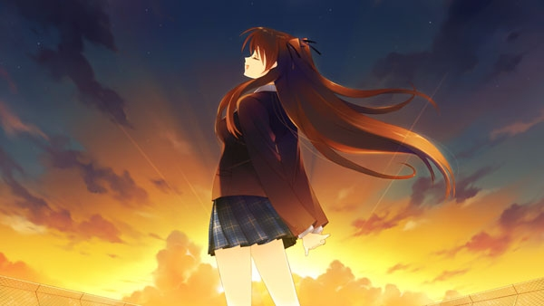
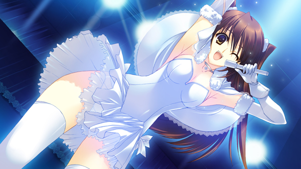
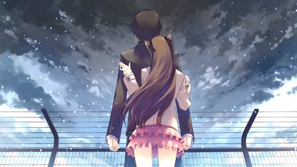

> **Spoiler warning:** This essay discusses the complete plot of *WHITE ALBUM 2: Introductory Chapter* and draws on the two official digital novels *雪が解け、そして雪が降るまで* and *祭りの後～雪菜の三十分～* to supplement the characters' perspectives.[^source]
>
> **Image note:** This essay reproduces three low-resolution game CGs for noncommercial criticism. Copyright remains with AQUAPLUS; the images were obtained via 4Gamer.net. They are not open-licensed, and no republication permission has been obtained.

On the school festival stage, Setsuna Ogiso has just announced all three names. Setsuna Ogiso on vocals, Haruki Kitahara on guitar, Kazusa Touma on keyboards, saxophone and bass. For the first time, the whole school can identify the three performers by name and role. Hours later, Setsuna and Haruki return to the dark music room. Looking up at the black ceiling, she says she hopes they can always stay together. In Haruki's mind, "always together" still includes Setsuna, Touma and himself doing something as a trio at university.

Setsuna falls silent, then says it again. This time, the sentence contains only her and Haruki.

Only then does Haruki ask himself, "Can't it be the three of us?"[^opening]

For Haruki, "the three of us" was the self-evident shape of their future. Setsuna's pause and restatement narrow her request from three people to two. The pause poses the hardest question in *Introductory Chapter*: the three are already bound to one another, so what does the confession add?

The confession makes Haruki and Setsuna lovers. From that day on, Setsuna can ask for priority and fidelity, and betrayal has someone specific to injure. The desire already linking Haruki and Kazusa remains. To see the change clearly, we have to return to the time before the voices had names.

## A Response Through the Wall Cannot Yet Sustain a Relationship

By Haruki's recollection, he first noticed the piano next door about two months earlier. The pianist joined only when he was practising alone. Sometimes the piano supplied the missing melody. Sometimes it seemed to flaunt its virtuosity. At other times, as if irritated by his poor rhythm, it pulled the song back on course. Haruki knew the other player was listening and that his guitar drew a response, but he could not tell whether the response was mockery, instruction or a passing whim.

The wall concealed identity, motive and expectation. The pianist could answer Haruki without explaining why she appeared only when he was alone. Haruki could hear the answer as a challenge and keep waiting under the pretext of practice. Both of them made choices while preserving a way out.

One evening, the voice singing *WHITE ALBUM* on the roof joined the guitar and piano. All three were inside the same song, but each knew something different. Kazusa already knew who played the guitar. Haruki heard only an unnamed pianist. Setsuna heard both instruments without knowing that the two players had been meeting through the wall for two months. After the song, Haruki and Setsuna were the first to match a voice with a person. They discovered that they loved the same song, and he soon turned a chance ensemble into an invitation: would she join a light music club that lacked a vocalist and, in practice, consisted of Haruki trying to keep it alive?[^voice]

*Setsuna on the rooftop. Game image: ©2012 AQUAPLUS / via 4Gamer.net.*

This CG contains only Setsuna on the rooftop. Haruki and Kazusa remain in two separate music rooms. Sound places all three inside one song before their bodies ever share a space.

The second music room was locked while the pianist played. Takeya suggested waiting outside until the player emerged, but Haruki decided an ordinary approach would never move her and climbed in through the window. He saw the pianist from behind before recognizing her as his classmate, Kazusa Touma, then asked her to rescue the school festival performance. His partner through the wall now had a name, and Haruki had someone he could keep pursuing and persuading.

Throughout the recruitment, Haruki found a necessary-sounding reason for every approach. The light music club lacked members, and his own guitar was not good enough. Inviting Setsuna could be described as filling the vocalist's place; following Kazusa could be described as saving the performance. His sense of duty did bring all three onto the stage. It also let him postpone the question of why he wanted this particular person. As long as the task remained unfinished, he had a reason to keep drawing closer.

A later official novel gives Kazusa's account of those days. She already knew that "Guitar-kun" was Haruki and had gone to see him of her own accord. At one point she heard their two instruments sounding together as a kind of reconciliation, though Haruki did not yet know who was answering him. That reconciliation existed only on her side. Their playing became a real exchange only after stopping, resuming, waiting and correcting had happened again and again.[^kazusa-novel]

The novel's episode with the gift also breaks the fantasy that music is innately honest. Haruki missed practice to find Kazusa a basic English book. She took his absence as contempt for her teaching, then went back through the rain to retrieve the book and found the note inside. Care had already been given, yet each could still mishear what an absence or a gift meant. Kazusa later decides that sound can convey certain things better than language. That is her judgment at a particular moment; a performance can still be misunderstood.

That night became more than an accidental encounter because invitations, a climb through the window, waiting, correction and an agreement to join followed it. Voices through a wall made an approach easier. The three still had to leave their rooms themselves.

At this point, the trio can still be drawn as two lines: Haruki to Setsuna and Haruki to Kazusa. If Setsuna and Kazusa can speak only through him, "the three of us" amounts to two relationships arranged around the male protagonist. The third side appears while Haruki is absent.

## Setsuna and Kazusa Make Their Agreement Without Haruki

After accepting the invitation to join, Setsuna does not wait for Haruki to introduce her to Kazusa. She runs after the girl who is about to leave, asks what she will have for dinner and whether she is usually alone, then turns the conversation toward the performance. She tells Kazusa that Haruki needs her. At the same time, she pursues a question that concerns her own place: why does it have to be Kazusa Touma?

Setsuna had already demanded an answer from Haruki before chasing after Kazusa. He began with the arrangement of the performance: they lacked a keyboard player, time was short and Kazusa had the strongest technique. Setsuna rejected this account of function and asked for "Kitahara-kun's personal opinion." Her question forced Haruki to admit the preference behind the task. He still spoke vaguely, but Setsuna learned that even a better musician could not replace Kazusa. She could then ask Kazusa why Haruki, too, was the only person who drew such attention from her.

The message soon exceeded the task. Setsuna asked Kazusa to be her friend and pressed her on why she reacted so strongly to Haruki when she had known about his guitar for some time. Kazusa had meant to end the conversation. That question made her turn back and ask how Setsuna saw Haruki. In Haruki's absence, the two women began judging the third person and their own positions in relation to him. Their conversation would change how each approached Haruki afterward, with no need for him to preside over it.

Setsuna also admitted that she had let Haruki reveal her karaoke secret to Kazusa on purpose, expecting Kazusa to get angry. She called the story she had just heard about Haruki and Kazusa a display of their intimacy. Setsuna was arranging the performance, managing information and testing how angry Kazusa would become where Haruki was concerned. Kazusa was no longer speaking to a girl who merely carried the male protagonist's message.

The final agreement to join the club was also made between the two of them. Kazusa later told Haruki that before leaving she had promised Setsuna she would join if Setsuna could persuade her parents. Setsuna would satisfy the condition, Kazusa made the promise to her, and Haruki learned only afterward that the two had settled it.[^setsuna-kazusa]

They could invite, test and promise each other things while Haruki was absent. Together with the existing Haruki-Kazusa and Haruki-Setsuna ties, this gave the trio three direct relationships. Their histories were unequal. Haruki and Kazusa had known each other longest; Haruki and Setsuna were the first to enter each other's family lives and develop an everyday intimacy they could talk about; Setsuna's invitation of friendship to Kazusa carried a test of Kazusa's concern for Haruki. Setsuna could see that Kazusa occupied a special place, but she did not yet know how Haruki would choose.

Setsuna first used the word "friend" to contain this overlap. Friends could eat together, practise and enter one another's lives without yet deciding who took priority. Even after Haruki and Setsuna became lovers, that name would continue to bind Setsuna and Kazusa. For now, the school festival was about to turn their private approaches into a public performance. The most important stretch of training left Setsuna outside.

## Before the Stage, Setsuna Is Left Outside

To bring Haruki's playing up to the bare minimum for an ensemble, Kazusa took him into the recording studio at her home. She had the idle equipment serviced in advance, then spent entire nights listening for every missed beat and mistake. She controlled the technique, space and tempo. Haruki supplied his time and stamina and repeated each passage until she approved it. Only after this private training could his guitar keep pace with the trio.

During those sessions, Kazusa told Haruki that she had been the one accommodating him all along. Their playing through the wall had sounded as if they had "somehow fallen into sync," but Kazusa had covered the gap in skill by adjusting her own performance. In the studio, she demanded that Haruki follow her tempo instead. For the first time, she named the work behind the sound and handed Haruki responsibility for keeping up.

An earlier rehearsal had already reversed the positions on the two sides of the wall. Haruki was sent to play in another music room. Setsuna heard that Kazusa's piano was following his guitar, and Kazusa herself understood it only after Setsuna said so. The player whom Haruki had once sought by following her sound now listened through the wall and judged his performance. Haruki, in turn, became a voice that the other two had to recognize and catch.

Setsuna did not attend the overnight sessions. From their exhaustion, Haruki's abrupt improvement and the dense traces of Kazusa's instruction, she inferred that they had practised without telling her for several nights. After Haruki left, she asked Kazusa directly why they had hidden it.

Kazusa dismissed the practice as unimportant. Setsuna immediately called herself an "outsider." Kazusa told her not to say that, and Setsuna asked whether Kazusa had considered how she would feel once she learned the truth. She was contesting more than a missed rehearsal notice.

Setsuna then offered an explanation on Kazusa's behalf. Kazusa had to look after Setsuna's practice during the day, leaving only the nights to teach Haruki. Setsuna thanked her, apologized for the accusation and ended the conversation herself. Only at the end did Kazusa admit under her breath that she had hidden the sessions because she expected Setsuna to be hurt in silence. Their first direct conflict in *Introductory Chapter* stopped there. Setsuna protected the rehearsal and carried its unanswered injury onto the stage.

When Setsuna finally received the materials for the new song, her first question was whether she alone had been excluded again. Kazusa then explained that Haruki had written the lyrics and she had composed the music. The song was written for Ogiso alone. Setsuna had no part in making it, yet she was its named recipient. Kazusa collapsed at home with a fever while finishing the song; only after recovering did she bring the materials to Setsuna.

*届かない恋* (*Todokanai Koi*) brought this asymmetry onto the stage. Kazusa handled composition, accompaniment production, training and several instruments. Haruki wrote the lyrics and managed to keep up on guitar. Setsuna sang the work to the audience. They contributed in different measures, but the audience could hear only the version they had completed together.

In a phone call before the performance, Setsuna said she liked both Haruki and Kazusa very much. The hardest thing for her was knowing that the two were together while she was absent. Haruki heard "daisuki," but his internal response reduced it to "So she likes Touma." Setsuna had placed them side by side in the sentence; Haruki removed himself and heard only her friendship with Kazusa.

Setsuna then pressed him to make the assurance more specific. Haruki swore that he would never be the one to end their friendship. Unless Setsuna ended it first, he would remain her friend. She twice confirmed that this was a promise, and he formally agreed. The assurance gave her words she could rely on, but it also assigned the future act of ending the relationship to her in advance. She kept pressing over the form of address, correcting the Japanese 「雪菜でいい」 (*Setsuna de ii*) to 「雪菜がいい」 (*Setsuna ga ii*). One particle shifts the meaning from "Setsuna is fine" toward "Setsuna is the one I want." An exclusive implication enters the wording before a lover's obligation of fidelity exists. Haruki finally called her by her given name, only to put "the three of us" back into their future during the confession.

Setsuna had already told Haruki an older story behind this anxiety. In her third year of middle school, she and four other girls had been close. A boy from the basketball club confessed to Setsuna, though one of the girls had long been in love with him. The five soon divided into a group of three, one neutral girl and an isolated Setsuna. She rejected the boy, but the friendship did not recover. They avoided her at lunch, fell silent when she entered the classroom and skipped her when passing out handouts. Those daily acts forced her to change how she dealt with other people. The secret studio sessions did not repeat that episode, but they placed her in its most familiar position: other people shared a secret, and she learned last. Setsuna calls this one reason she changed the way she related to others. That qualification matters: the old wound explains why absence is so hard for her to bear, but it cannot account for all of her love for Haruki, her friendship with Kazusa and her present jealousy.

On stage, Setsuna first regretted that they had never chosen a name for the group. She could only introduce the three people and their parts one by one. The audience saw a light music group and heard the work they had made together. The overnight training, the abruptly ended accusation and the *daisuki* Haruki had failed to hear all remained outside the announcement.[^stage]

*Setsuna occupies the foreground of this school-festival CG; Haruki and Kazusa remain outside its frame. Game image: ©2012 AQUAPLUS / via 4Gamer.net.*

The CG brings Setsuna's face and microphone into the foreground while Haruki and Kazusa remain outside the frame. A song made by all three enters public view through the singer's body; the accompanying players and the work of rehearsal have to be restored from the surrounding scenes.

The stage could distinguish the vocalist from the guitarist and the player moving among keyboard, saxophone and bass. It could also make all three submit to the same beat for the length of one song. Once the music stopped, their desired futures separated. An ensemble could not decide who should take priority after the performance. Setsuna had to put that question to Haruki alone, with Kazusa absent.

## The Confession Turns "Afterward" into a Promise

Before the confession, Io had already urged Setsuna to act soon. Setsuna admitted that she loved Haruki while still wanting the present trio to continue. Then she saw Kazusa lean close to the sleeping Haruki. The script does not confirm whether they kissed. It records only Kazusa's breathing, her apology and Setsuna witnessing the scene. Setsuna now knew that waiting would not hold the three of them at the moment they had shared on stage.

*祭りの後～雪菜の三十分～* gives the half hour after this sight to Setsuna. She first tries to convince herself to yield Haruki to Kazusa and preserve at least her own place within the trio, but she cannot make herself stand and leave. She wants Haruki and wants Kazusa to remain. Silence can no longer preserve both desires. Before Haruki wakes, Setsuna wipes away her tears, composes her expression, fixes her coat and adjusts the distance between them. Then she decides to confess her feelings herself.[^matsuri]

After the disaster, Setsuna will interpret this step as exploiting Haruki's inability to refuse someone who loves and needs him. The later novel records another argument she made to herself in that moment: she had to act if the three of them were to remain together. She knows that thought is sincere, but she does not know what it will cause.

The novel also separates the parts of her preparation. When Haruki wakes, Setsuna smiles and performs the lingering excitement of the stage; she uses a real happiness to hide the tears she has just wiped away. She places her coat over him, leading him to believe that she has been caring for him all along and to feel indebted to her. She later lets the coat fall and times the closing of her eyes. Setsuna knows that she is lying to Haruki and may lie to Kazusa. Her sudden physical advance, however, was never in the plan. She wants Haruki, wants to keep Kazusa and fears being left outside their pair. Several desires move her body at once, and she cannot put them in a single order.

Setsuna first asks whether they can always be together. Haruki immediately answers with something the three of them might do at university. She begins specifying the same university, the same faculty and the time they could spend together each day, then finally says, "You and me, Haruki-kun." Haruki's "we" retains the lineup from the stage. Setsuna is writing their intimacy after the celebration into a schedule for two. When he still tries to explain companionship through the band and friendship, she says the person she loves has praised her and she now wants to ask him for a reward.

Haruki thinks of Setsuna as the first person to understand him and Kazusa as the second. Her occasional sulking, in his mind, awakens his sense of responsibility. Her statement that she needs him to stay reaches the position he is most accustomed to answering. Haruki often approaches other people through duty. By the time he has to answer for his own desire, duty has already brought him very close.

Setsuna finally tells him that he can move away, but times the closing of her eyes so that the verbal exit becomes difficult to take. Haruki still hesitates and asks for confirmation before moving toward her himself. At the end of the kiss, Setsuna can draw back only when the strength in his arms slackens; the narration also says that Haruki was the one pressing himself against her. Setsuna narrowed the exit; Haruki still chose to approach her.[^confession]

From that moment, a new fact enters the relations among the three. Through confession and acceptance, Haruki and Setsuna become lovers; priority and fidelity thereby become obligations that can be demanded and breached. If Haruki now pursues a romance with Kazusa, it will no longer be merely a matter of two people finally recognizing their mutual feelings. He has already assumed the obligations of being Setsuna's lover. Only now does betrayal have a definite person to injure.

Once Haruki accepts her, Setsuna feels a happiness she has never known and comes to love him more. A confession gives words to an existing feeling, and the other person's answer changes the speaker in return.

With Haruki absent, Setsuna tells Kazusa about the confession herself. She admits that she arrived later, that she is jealous and that she has fallen in love with Haruki. She asks whether Kazusa can truly accept it. Kazusa calls the Haruki-Setsuna relationship the "conclusion" the two of them reached, acknowledges it as Setsuna's friend and offers her blessing. Then she turns her attention to Setsuna and asks that they stop using surnames and call each other by their given names.

"Conclusion" leaves Kazusa a narrow place to stand. She did not take part in the decision, but she acknowledges that it has been made. The Haruki-Setsuna promise is now known to all three. Calling each other "Setsuna" and "Kazusa" also shows that their friendship has not been absorbed by the lovers' relationship. In Kazusa's eyes, Setsuna changes from a rival into a friend she has named as such. A later transgression will injure both positions at once.

Calling each other by their given names does not end the conflict between Setsuna and Kazusa. During the Christmas trip, Setsuna hopes that the three can gather again every year. Kazusa first says she cannot promise even the following year, then points out that lovers also want time alone and calls the way Haruki and Setsuna have long hidden their status as a couple a game of make-believe. Setsuna admits that the dream is hers alone but still appeals to their shared school-festival experience. Kazusa finally raises a glass to "eternal friendship," while promising only to see the present night through with them. The toast preserves the wish and all three characters' knowledge that the future cannot be guaranteed in advance.[^christmas]

By this point, *Introductory Chapter* contains three kinds of "afterward": a friend promises never to be the one who leaves; a lovers' relationship demands priority and fidelity; the hope that the trio will always remain together survives only inside a toast made with full knowledge that it cannot be guaranteed. The later transgression collides with all three forms of speech.

By the time Kazusa finally says that she loves Haruki, the Haruki-Setsuna promise has already been made and acknowledged by Kazusa herself. Her late truth cannot reset the earlier choice; it can only enter the relationship that choice has already created.

## A Truth Told Too Late Cannot Turn Back the Clock

As Kazusa prepares to leave Japan, Haruki insists that she tell Setsuna about the move at once. He states his principle plainly: at minimum, a person should be honest; a feeling that has been spoken carries more weight than a guess someone else makes on behalf of the silent person. Setsuna declared her love, so he accepted Setsuna. Kazusa said nothing, and he treated her silence as the absence of the same feeling.

Before this argument begins, Haruki has already grabbed Kazusa's wrist to keep her from getting into the car. The narration soon separates his stated reason from the emotion breaking through it. His anger has moved from "Why did you hide this from Setsuna?" to "Why are you leaving me?" He continues to discuss honesty as a rule while possessiveness directs his body. The same demand to "say it now" asks Kazusa to respect Setsuna and forces her to answer Haruki's own sense of loss.

Haruki has already broken this code of honesty himself. While recruiting a keyboard player, he falsely claimed that someone was ill and admitted the lie only later. After he began dating Setsuna, he treated his continuing love for Kazusa as an exception that had already ended. Setsuna's birthday gathering has already begun when he calls from the road to Narita, saying that he feels ill and will arrive later. The nausea is real. He uses it to explain his delay while concealing his destination and the person he is going to meet, and the narration still says plainly that he is lying. Later, speaking to Setsuna, he admits that silence can itself constitute a lie. His principle of honesty describes an image of himself that he has already damaged.[^lies]

Haruki's rule can guard against one thing: he cannot decide that a silent person "really loves me" and pass off his wish as fact. Yet he also treats "I have said it" as "I have taken responsibility." Kazusa puts the problem more directly. A person can hand someone a fact that will hurt them and claim to have been honest; the person who hears it still bears the pain.

Kazusa finally admits that she loves Haruki and explains why she did not speak sooner. Setsuna had already confessed. If Kazusa spoke, she would hurt Setsuna. Her silence kept Haruki from learning how she felt sooner, but it also reflected her wish not to hurt Setsuna. Both consequences have already occurred.

After the argument, Kazusa tells Haruki not to follow her. When he approaches, she says, "Stop" and "This is wrong." She rejects him aloud while already bitterly regretting that she told him not to follow. Haruki still catches up, blocks her path and kisses her. Kazusa pushes him away and slaps him, then immediately asks how many times he has kissed Setsuna and how far behind she is. Refusal, regret and jealousy occupy the same scene. Jealousy shows that desire remains; it does not turn her spoken "Stop" into consent. Haruki also violates his obligations to Setsuna as her lover.[^honesty]

Haruki does not then break up with Setsuna. During the week of crisis, they continue to exchange greetings and walk together, but stop talking and kissing. Haruki calls these days "a coward's flight." The literal form of his earlier promise—never to leave first—remains intact while silence removes the substance of being Setsuna's boyfriend. At the time of the confession, *祭りの後* had already let Setsuna imagine exactly this way of keeping the promise: moving away in order not to leave. She rejected that future then. Haruki later makes it their daily life.[^promise]

Setsuna later tells Haruki that Kazusa had visited and left a letter, and that Setsuna herself still has something beyond goodbye to tell her. The news reopens a connection that is about to close. Haruki decides on his own to chase after Kazusa and runs out, leaving Setsuna behind. As he searches, he prepares to explain himself to Kazusa, but Kazusa's call reaches him first. Setsuna does not explicitly ask Haruki to see Kazusa again until the airport.

Kazusa calls this their final phone conversation. She says she is somewhere far away and refuses to give her location. Across that distance, Haruki admits that he loves her and cannot return to Setsuna. Kazusa first calls them both traitors and rejects the late declaration. She also says that she can want to study piano abroad, live with her mother and stay beside Haruki at the same time. Those wishes can all be true. A choice will still make some of them costly.

An ambulance siren reaches them through the phone and from the street at once, exposing the lie about distance. Haruki follows the sound and finds Kazusa in the park below his apartment. They still hold their phones although they can now see each other. Kazusa says there are things she can speak only across a phone, when nothing remains but the voice. She speaks only on the condition that they will never meet again, then apologizes to the absent Setsuna. Setsuna is not present, but this secret speech cannot remove her as its addressee.[^phone]

Even after they stand face to face, neither hangs up. The distance made by the phone and Kazusa's claim to be "far away" has collapsed, but their voices still pass through the handsets. Haruki calls her "Kazusa" for the first time; she answers with "Haruki," and only then do their lips meet directly. They cross the limit of "never meet again." Their exchange of given names marks a change in the relationship: knowing that Setsuna will be hurt, they enter another relationship together.

The first wall made it easier for Kazusa to answer Haruki; the phone lets her say what she cannot say face to face. The first time, Haruki's search and invitation brought the voices into a shared performance. This time, the siren leads him to Kazusa, and the two carry the feelings they have spoken into bodily contact. Sound completes the search twice. The second time, Setsuna and Haruki's promise are also present.

Haruki first declares that he cannot return to Setsuna and then approaches Kazusa. Having accepted the role of Setsuna's lover, Haruki bears the obligation of fidelity and is the first to violate it. Kazusa initially refuses him, then responds while knowing about the Haruki-Setsuna relationship. Together they enter a secret physical relationship. At this point Setsuna has supplied only the information that Kazusa visited; Haruki and Kazusa perform the actions that follow.

The same words, "I love you," enter different relationships before and after the confession. Spoken earlier, they might have changed a choice that had not yet been made. Spoken now, they meet Haruki after he has given Setsuna his word. Haruki and Kazusa finally confirm their feelings and leave themselves with something they must explain to Setsuna.

The phone can still keep this event as a secret between two people. The airport brings Setsuna into the scene and turns the event into shared history that none of them can privately undo.

## Each Tries to Take All the Blame

Haruki first tells Setsuna everything that happened. He admits that Kazusa had attracted him for a long time, that accepting Setsuna did not erase that feeling, and that he later crossed the boundary behind her back. He asks Setsuna to hit him and curse him, and says she should never forgive him. If Setsuna condemns him as he demands, the situation seems to become clear: one offender, one victim, and only punishment left ahead.

As the person he hurt, Setsuna should decide whether to forgive him. Haruki first dictates how she should respond to being hurt, then prepares to reject an answer he does not want. Later, he even says to himself that he will never allow Setsuna to forgive him. His self-accusation has become another way to control the conversation. He would rather preserve his place as "the unforgivable one" than ask what Setsuna wants to do with the relationship that still exists.

Setsuna rejects that allocation. She takes the whole earlier chain of cause upon herself, saying that she already knew Haruki and Kazusa loved each other and confessed first anyway. She feared that the other two would leave the trio, and she exploited Haruki's inability to refuse someone who loved and needed him. She even denies herself the right to grief or anger. Haruki immediately recognizes a hastily assembled story of self-blame that also reduces his guilt. He makes this judgment while caught in the same disaster; the earlier actions still have to test it.

The earlier actions do not support this single account. Setsuna left Haruki a verbal chance to move away while making the exit difficult in practice; he still chose to accept her, and Kazusa later acknowledged their decision. Fear of exclusion was certainly present, but it does not explain the whole scene by itself.

Haruki wants to be the unforgivable promise-breaker. Setsuna wants to be the person who designed the whole outcome and therefore has no right to be hurt. Kazusa has already called herself and Haruki traitors. Haruki asks for punishment, Setsuna reduces his guilt, while Kazusa's life also contains choices beyond guilt: study abroad, the piano and life with her mother. All three condemn themselves, but their conversation makes no progress.

On the train to the airport, a few passengers turn toward Haruki's shouting, watch for a moment and decide they are seeing an ordinary lovers' quarrel. They assume the couple will make up after getting off. The public setting reveals only volume and posture. The trio's history remains hidden from view. The name "lovers" that the passengers recognize is accurate, but they cannot know what has happened inside it.

After reciting her own "sin," Setsuna still insists on going to the airport. She pulls Haruki along as they search for Kazusa. When he starts to give up, she demands that the two meet once more. Setsuna makes the meeting happen. She cannot choose what Haruki and Kazusa do once they meet.

When Kazusa appears, Haruki runs past Setsuna toward her. Kazusa first reminds him that Setsuna is there. Haruki embraces her anyway. Kazusa apologizes to Setsuna, then returns his kiss. The misreading on the train disappears. All three now see one another. Setsuna witnesses the consequences firsthand, and Haruki and Kazusa can no longer seal the transgression inside the night they shared.[^airport]

The order of action is clear. Haruki is the first to break the promise in public. Kazusa sees Setsuna and reminds Haruki that she is there, but ultimately returns his kiss. Setsuna helps bring about the meeting and bears witness. All three call themselves guilty, but each bears a different kind of responsibility.

After Kazusa leaves, Setsuna resumes caring for Haruki. He stands where he is, neither responding nor moving. Setsuna embraces him from behind and shields him from the cold with her body, while leaving him a clear exit: if he does not want her embrace, he can pull free. Haruki neither pulls free nor turns to accept her. By fixing himself in the position of someone unworthy of forgiveness, he leaves Setsuna unable either to turn her care into reconciliation or to end it.

*After Kazusa leaves, Setsuna embraces Haruki from behind; he does not turn around. Game image: ©2012 AQUAPLUS / via 4Gamer.net.*

That exit makes a harsh contrast with Kazusa's earlier refusal. Kazusa told Haruki not to follow and ended his kiss with a push and a slap; he ignored her refusal. Setsuna now tells him to pull free, and Haruki makes immobility his answer. Once he would not stop; now he will not pull away. Both times, he leaves the consequences of a decision to the woman before him. He knows how to answer a need that someone else voices. When he must end or rebuild a relationship himself, he freezes.

The opening of *Introductory Chapter* had already written this collapse in numbers: three people at the vow, two breaking away from the three, and what remained becoming one person plus one person. The airport turns that arithmetic into action. Kazusa leaves alone. Haruki and Setsuna still stand together, but they no longer form the pair they once did. Setsuna holds him and he does not answer. Their bodies touch while the relationship remains motionless.

## The Names Remain, but the Trio Has No Next Performance

Back in the music room after the performance, Haruki's question, "Can't it be the three of us?", expresses his wish. Across the rest of the chapter, Setsuna repeatedly extends the stage into a shared future, while Kazusa eventually says that she cannot promise even the following year. The three rehearsed and performed together and made a history none of them can undo; they never jointly wrote one future. The confession turns Haruki and Setsuna's future into a lovers' relationship that can be betrayed, and Kazusa later acknowledges it. The old desires remain, but the three now occupy different places and bear different obligations.

At the end, the script moves from the snow at the airport back to the school festival, where Setsuna announces the title *届かない恋* once more. The names of lover, friend and beloved person survive the separation, but the three have lost the shared life that once sustained those names. [The next essay, "Three Years Without a Piano"](/en/posts/white-album-2-three-years-without-piano/) picks up *Closing Chapter* here.

All the names remain. The light music club will never play as a trio again.

[^source]: For game information, the official synopsis of *Introductory Chapter* and production credits, see the [AQUAPLUS *WHITE ALBUM2 幸せの向こう側* website](https://aquaplus.jp/wa2/) and its [story page](https://aquaplus.jp/wa2/story.html). The Japanese dialogue was checked line by line against the game scripts; the public search interface is the [MAO Translations Script Browser](https://mao-tls.github.io/white-album-2/script/). Quotations in this essay are translated from Japanese.
[^opening]: Script locator: `wa2:ic:1008_050:75–154`.
[^voice]: Script locators: `wa2:ic:1002:287–303`; `wa2:ic:1002:473–502`; `wa2:ic:1003:1–50`; `wa2:ic:1004:224–356`.
[^kazusa-novel]: *雪が解け、そして雪が降るまで* locators: `wa2mas:digital_novel_5000:5002:21–67`; `wa2mas:digital_novel_5000:5003:42–104`. The [AQUAPLUS special-content page](https://aquaplus.jp/wa2/special_early.html) confirms that this work and *祭りの後* are included in the console release as digital novels.
[^setsuna-kazusa]: Script locators: `wa2:ic:1005:521–640`; `wa2:ic:1005:680–895`; `wa2:ic:1005:1274–1284`; `wa2:ic:1005:1380–1420`.
[^stage]: Script locators: `wa2:ic:1006:176–220`; `wa2:ic:1006:300–346`; `wa2:ic:1006:380–493`; `wa2:ic:1006:620–732`; `wa2:ic:1006:1099–1245`; `wa2:ic:1006:1345–1589`; `wa2:ic:1007:500–566`; `wa2:ic:1007:1360–1417`; `wa2:ic:1008:200–233`; `wa2:ic:1008_030:14–55`.
[^matsuri]: *祭りの後～雪菜の三十分～* locator: `wa2mas:digital_novel_5300:5300:1–5303:36`.
[^confession]: Script locators: `wa2:ic:1008_040:32–81`; `wa2:ic:1008_050:58–59,75–188`; for Kazusa's acknowledgment of the Haruki-Setsuna relationship, see `wa2:ic:1009_030:28–85`.
[^christmas]: Script locator: `wa2:ic:1010_030:403–473`.
[^lies]: Script locators: `wa2:ic:1004:78–94`; `wa2:ic:1005:423–434`; `wa2:ic:1009:63–69,158–176,213–218`; `wa2:ic:1011_030:340–383`; `wa2:ic:1012:28–141`.
[^honesty]: Script locator: `wa2:ic:1011_030:340–657`.
[^promise]: Script locators: `wa2:ic:1006:1491–1519`; `wa2:ic:1012_030:100–103,219`; *祭りの後* locator: `wa2mas:digital_novel_5300:5303:17–25`.
[^phone]: Script locator: `wa2:ic:1012_030:135–179,184–209,214–301`.
[^airport]: Script locators: `wa2:ic:1013:67–318`; for the numerical prologue, see `wa2:ic:1001:11–20`.
