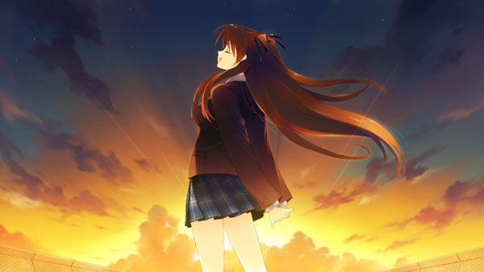
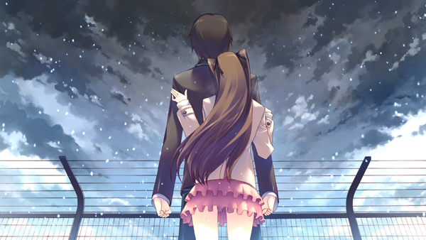

Haruki thought he was playing one last song.

The light music club had fallen apart. He had never been among the members due to perform onstage; now even his small part in organizing things and practising on his own was coming to an end. He would play a favourite, “WHITE ALBUM,” as a farewell. The piano next door joined in as usual. The player, whose identity he had yet to discover, was remarkably skilled, yet willing to accompany his clumsy guitar. Whether this was kindness, teasing or sheer boredom, Haruki could not say.[^voice]

This time, a singing voice joined them.

Haruki ran to the rooftop and found Setsuna Ogiso. Embarrassed at first, she asked him to forget what he had heard; as they talked, she could not help admitting how much she loved the song. Haruki had almost said goodbye. He had assembled every reason not to invite her: she disliked attracting attention, so why would she agree to sing onstage? In the end, he turned back and asked whether she would join the club.[^rooftop]

A song meant to finish things could also begin them again.

*Setsuna on the rooftop. Game image: ©2012 AQUAPLUS / via 4Gamer.net.*

In *WHITE ALBUM 2*'s *Introductory Chapter*, hereafter IC, Haruki Kitahara, Setsuna Ogiso and Kazusa Touma grow closer through playing together, until they reach a point where they can no longer go on as before. Read backwards from the airport, every early approach can look like a portent of disaster. Yet at the time, they were doing things: learning to play, trying to sing, finding a way to make an impossible performance happen. The life they would long for acquired its substance in these activities. What they later lost becomes visible here, too.[^source]

*This essay contains full spoilers for IC and draws on the official digital novels 雪が解け、そして雪が降るまで and 祭りの後 when revisiting the scenes. The cover is original conceptual art made for this site. The three low-resolution game images retain their use as limited quotations for criticism; sources and rights information appear in the captions and notes.*[^images]

## The Bird Calls, Seeking a Friend's Voice — Book of Songs, “Felling Trees”

Haruki first noticed the accompaniment next door about two months earlier. The other members had gone, and he stayed to practise alone, stumbling along. Once something resembling a tune emerged, the piano would arrive. Sometimes it sounded like instruction, sometimes a challenge. Later came bass, drums and saxophone. What astonished him was that the other player never made a mistake. He concluded that this person must have plenty of spare time.[^voice]

He could hear how good she was, but not the work behind that skill. He had already taken her for someone with time to spare.

The official digital novel turns to Kazusa's side of those days. She had taught Haruki guitar face to face and had initially told him he was not trying hard enough. What she could learn in a night still troubled him after long practice. As she taught him, though, she began to realize how many years of experience with instruments lay beneath her “one night.” What Haruki could grasp in his mind, his fingers might not manage; what Kazusa's fingers did naturally, she might struggle to explain. Each had a kind of proficiency, and each a clumsiness that became apparent only in the other's presence.[^teaching]

The problem of teaching changed. Blaming him for being unable to play would not make him able; demonstrating something once did not mean he could reproduce it. Kazusa began to consider how this particular person might learn enough to perform in the time remaining. She moved equipment into the second music room. When the guitar sounded next door, she met it with her own playing. If he rushed, she pulled him back; if he lagged, she waited; if a note strayed, she guided him towards where it belonged. She began with the familiar piano, then switched to other band instruments so that he could gradually get used to them.[^teaching]

They could already pick up one another's playing: Kazusa knew where Haruki was likely to go wrong, and he could adjust his fingers to her accompaniment. That understanding was still limited to rhythm, pitch and coordination. Haruki did not know how much thought Kazusa had given to teaching him, or what the waiting meant to her. A later account lets the reader see that care; Haruki could not know it then.

In the “Zhiyin” chapter of *The Literary Mind and the Carving of Dragons*, Liu Xie writes that one understands music only after practising a thousand tunes. He begins with the work of discernment: listen only according to your preferences, and what you hear will still be yourself. Liu Xie goes on to trust that a reader can pass through a work into its author's feelings, until even what is hidden becomes apparent. Between Kazusa and Haruki, that confidence carries us only part of the way. They can understand how the next notes should follow. Why the other is so patient, or why they themselves look forward to the next session, remains difficult to express and sometimes has yet to become clear even to them.[^zhiyin]

They do not yet understand each other fully, but they can already do something together. Haruki's guitar really does sound better than before.

After the exams, Kazusa hears Haruki play “WHITE ALBUM” and notices how much he has improved: the notes hold together, and his playing is steadier. He has clearly practised. Ordinarily she would ask him to slow down. This time, she follows his pace. She plays faster, and so does he; she speeds up again, and he tries to keep up. The song grows faster and heavier, nearly losing its original character. Kazusa is delighted.[^joy]

Her pleasure comes from more than teaching a student well. Haruki, whom she has always led, now urges her to move faster. She sets aside how the piece ought to be played and follows the excitement of the moment. The work they have already done matters: Haruki's growing skill gives their duet a back-and-forth. As Kazusa follows his pace, she hears that he can still find the right notes. They can now do one more thing together.

Kazusa's own days change as well. Someone who does not want to be seen playing has spent considerable time working out how another person might stand before an audience. Of course she loves Haruki, and has a need she can hardly express. But that love is not kept in her heart alone: she prepares equipment, works out how to teach him, hears his improvement and joins him in making a mess of a good song. To call all this concealment is to miss how seriously she is helping their collaboration take shape.

## Why Must Friends First Share the Same Tune? — Du Fu, “Walking Home”

When Setsuna joins, Haruki and Kazusa already share an experience they have not put into words. He enthusiastically tells Setsuna how Kazusa teaches him. Setsuna suddenly asks, “When you're with one girl, do you always talk about another?” Haruki feels unfairly accused: she asked, and he only answered honestly.[^women]

He has answered what she asked about. He has not yet heard how she is asking.

Setsuna soon seeks Kazusa out herself. They go shopping together. Seeing Kazusa make a dinner of hamburgers, Setsuna tells her to add a salad; Kazusa complains that she sounds exactly like Haruki. When men approach them in the street, each says the other is the one being approached. Setsuna even compares how often they have been approached, leaving Kazusa momentarily speechless. These small exchanges show that they no longer know each other only through Haruki; they can speak for themselves.[^women]

Naturally, they also talk about him. Setsuna notices how thoroughly Kazusa knows the club's situation and takes the opportunity to invite her to join. By now Setsuna can say that there is one more person working hard—herself—and that she wants to add another. She makes the invitation in her own right, placing herself within the activity already underway. While Haruki is still planning his next attempt at persuasion, Kazusa and Setsuna have agreed on a condition: if Setsuna can persuade her parents, Kazusa is willing to join too.[^women]

Haruki brought things together, but not everything begins with him. The two women can change each other's decisions in his absence. Their own relationship has its history; later they care for and test one another, feel jealousy, and acknowledge each other as friends. Their pain, too, comes from more than loving the same person.[^women][^recognition]

Kazusa says that she and Setsuna will probably never share the same values: they might become mortal enemies or lifelong friends. Blunt and exaggerated as this is, it comes closer to the surprise of their acquaintance than saying they already understand each other perfectly. How can someone so different come so close? In accepting the invitation, she even makes their inability to understand each other a reason why they might as well spend time together. What Haruki hears is that she has finally agreed to stay.[^women]

Haruki and Kazusa grow close through teaching and playing through a wall. Haruki and Setsuna draw together through an invitation, listening and encouragement. Setsuna and Kazusa begin to deal with one another directly. Each person gains a place they did not have before. As they see more of one another, they begin to look forward to meeting again; once rehearsal starts, that hope takes on a different meaning.[^teaching][^women]

## Cut and Filed, Carved and Polished — Book of Songs, “The Bend of the Qi”

Once rehearsal begins in earnest, “the three of us together” does not always mean three people in the same room.

Kazusa wants to test Setsuna's voice first, so she sends Haruki next door to practise alone. He assumes that, with everyone there, they will all rehearse together. Kazusa tells him that at his level he would only get in the way. The person who proposed rehearsing together is sent next door to practise on his own. A few days later, Setsuna hears that he is making fewer mistakes and wants him back. Kazusa still objects to his slowing down whenever he reaches a difficult passage. The plan has not reached that stage, she says, even as her hands begin to play along with the guitar next door. Setsuna catches her at it. Kazusa knows how to teach, but she cannot wait to play together.[^rehearsal]

Later, Kazusa takes Haruki to the basement studio at her house. The instruments, recording equipment and control room behind glass astonish him. Behind this hastily assembled student performance stand the space and equipment her family can supply, the skills she has developed over years, and the nights both of them have spent practising. Haruki now sees how much Kazusa had accommodated him through the wall. To keep a steady rhythm, she can no longer wait for him at every turn. She points out his mistakes, and he asks again and again to start over; they continue rehearsing.[^studio]

The Touma family provides the room and equipment. Kazusa uses her skill to teach him, and Haruki keeps asking to start again when he goes wrong. At this point in their rehearsal, “reliable,” “useful” and “worth waiting for” have concrete weight.[^studio]

Yet the same effort can leave an uninformed person feeling excluded. Once Setsuna learns that the two have secretly practised through the night, she cannot carry on as usual. The technical need for extra practice cannot answer, on her behalf, why she was kept in the dark. Haruki later calls and admits the concealment. She tells him how a confession of love in middle school cost her her friends. She likes Haruki and Kazusa alike. She ought to be happy to see them close, but the thought of being outside that closeness hurts.[^phone]

Her distress this time is not only about losing her friends in middle school. Haruki and Kazusa have kept something from her now; the exclusion she experienced before makes this concealment especially painful.[^phone]

As the performance approaches, the three also make a new song. Haruki has lyrics written earlier. Kazusa composes the music and prepares the backing track, adjusting the difficulty of the guitar part and taking Setsuna's vocal range into account. Presented with the new song, Setsuna again first thinks she has been left out. Kazusa explains the secrecy as a surprise: Haruki wrote the words, she composed the music, and the song is for Setsuna to sing. Haruki immediately adds that the original lyrics predate her joining; he changed their wording and imagery afterwards.[^song]

Hearing this, Setsuna takes up the song too. Haruki wrote the lyrics, Kazusa composed and arranged the music, and Setsuna gives it her voice. They have different parts, but together they make the song.[^song]

Feeling for one another helps bring the song into existence; the song also gives their closeness new substance. Its melody and lyrics, who sings it, and how the guitar fits were shaped by their different skills and by the time they spent together. Each person's contribution remains in the finished song, which bears traces of their particular history.[^song]

Before the show, Kazusa tells the others to listen to her if they lose their way. Setsuna says the last number belongs to the three of them and that she wants to sing it with abandon. Onstage, she can already joke with the audience, introduce the songs and her companions, and even put in a word for herself in the school vote. Beside her, Haruki is surprised that she has so much composure to spare. Takeya, in the audience, is surprised as well: when did Haruki learn to play so well?[^stage]

*Setsuna and her microphone fill the foreground; Haruki and Kazusa are outside the frame. Game image: ©2012 AQUAPLUS / via 4Gamer.net.*

## No Joy Surpasses Coming to Know One Another — Qu Yuan, “The Lesser Lord of Life”

The opera in Lu Xun's “Village Opera” is not particularly satisfying. The roles the children want to see take forever to appear. Once the old-woman character sits down, she seems to have no intention of getting up again. The children wait and yawn, finally agreeing to leave. They launch the boat as eagerly as when they set out. Yet by the story's end, that night's opera remains something they will scarcely encounter again.[^shexi]

To point out that memory has beautified the facts would be hasty. That night also includes Shuangxi finding a boat and reassuring the adults, and the companions taking turns at the oars. Disappointed with the show, they leave together. On the way back, they light a fire, shell beans and share them. The performance is only part of the night; the journey there and home belongs to it too. The narrator eats beans again the next day, but they taste different. Beans can be cooked again. A night spent together cannot.[^shexi]

Nor does “Village Opera” flatten the countryside's differences. The children ordinarily have work to do and are allowed to do less while entertaining their guest from afar. On hearing the praise, Old Liu Yi concludes that educated people from the city have better judgment. Closeness can arise amid such differences, and the happiness really did occur. Looking back at the school festival from here, we can see that equipment and talent were unequal, and that rehearsal brought quarrels and hurt. None of this erased the pleasure of the performance.[^shexi][^stage][^rehearsal]

A shared life first takes shape through things people can do and hope to do again: Haruki can practise tomorrow what he could not play today; someone takes the lyrics he wrote seriously, and someone waits while his hands fumble. At first, they arrange their days around the performance. Later, the days themselves become something to wish for.[^teaching][^joy][^song]

A person may first discover within a relationship that they can live this way, and only later ask what to call it. The festival gives the lyrics Haruki wrote a melody and turns them into something the three have made together. Kazusa now has someone to play with. Setsuna wants to keep the days in which the three sing, make fools of themselves and quarrel. By the time the performance ends, they are reluctant to part.[^teaching][^song][^stage]

In the final session of *Seminar XX*, Lacan links the contingency of an encounter with love's wish for it to continue: a chance meeting may be wished into something that never ends, as if it were written into destiny. This turn from contingency towards necessity is part of love's drama.[^encore] After the school festival, Setsuna says she wants their happiness onstage to continue, and Haruki imagines the three of them still doing things together. The successful performance gives them a reason to meet again, but it does not decide how they will live afterwards.[^stage][^afterstage]

After the stage, one question comes into view: this shared life has changed them, so how are they to go on? The three do not yet have the same answer.

## Hearts Differ as Faces Do — Zuo Commentary, Duke Xiang, Year 31

During the phone call in the rehearsal period, Setsuna says she wants to remain with both of them after the festival. She does not want to return to her old routine, still less to be left behind. Haruki hastens to promise that he will not leave. When she asks what exactly he means, he explains that as long as she does not break off their friendship, he will always be her friend. She accepts that promise.[^phone]

Haruki explains “not leaving” as remaining friends. Setsuna asks what he means; her question is not only whether they will end their friendship. What place she has in his heart still needs an answer from him.[^phone]

This is the dimension Žižek addresses in his discussion of fantasy in *The Plague of Fantasies*: fantasy arranges positions for desire, allowing a person to understand what they are in the other's desire. Its concern is not merely what one has yet to obtain. It also concerns what is worth wanting, and how receiving it would count as being loved.[^fantasy]

Identification deserves a longer pause. Haruki's ability to do things for his companions is a practical capacity. His wish to see himself as someone who will never abandon another person is a way of understanding himself. The two connect, but do not automatically coincide. On the phone, Setsuna mocks his tendency to play safe and asks him to promise not to leave. Haruki answers from the kind of person he believes himself to be: she should know that he meddles in other people's business and does not readily end a friendship.[^phone]

At the time, Setsuna asks Haruki to promise not to leave. He turns that promise into this: as long as they do not break off their friendship, he will remain her friend. Later, when their relationship changes, simply holding on to the friend role no longer answers her request to become his girlfriend. A person who answers only from the identity he believes in may miss what the other is asking now.[^phone][^confession]

Desire acquires direction through these exchanges as well. Being needed does more than show what one can offer; it prompts another question: what place do I have in the other's life, and will I be chosen to stay? Having a part in rehearsal gives someone a place in the performance. Whether there is a place after the show is a question about the relationship. Musical arrangements can settle the first; people have to answer the second.[^stage][^phone]

Fantasy arranges positions for desire, but that does not mean the three share the same idea of what the performance will make possible. Haruki hopes that if he organizes things well, they can stay together. Setsuna wants a place where she will not be left out. Kazusa draws close to Haruki by teaching and accompanying him, and hopes he will respond. Their wishes take shape through their dealings and affect one another.[^teaching][^joy][^phone] The pleasure of playing together can hold different futures.

After the performance, Io advises Setsuna to act soon if she is serious. Setsuna says she likes their present relationship best: today's stage was so much fun, and she wants the happiness to continue. Later, Kazusa kisses the sleeping Haruki in the music room. Setsuna sees it.[^afterstage]

The time Setsuna treasures with the other two is real. She sees Kazusa kiss Haruki and sees that their relationship has changed. Keeping things as they were also depends on choices Haruki and Kazusa must make; Setsuna cannot decide for them.[^afterstage]

The digital novel *祭りの後* follows her subsequent wavering. She blames herself while arranging opportunities to draw close. She wants Haruki while imagining that, if Kazusa becomes his girlfriend first, Kazusa's distress might gradually cause Setsuna herself to be kept at a distance. Finally, she entrusts her action to a reason she cannot be sure of: to keep the three together, she must first come to Haruki's side.[^matsuri]

Setsuna wants to reach for Haruki and fears losing what she has; she is attached to her friend and wants to become Haruki's girlfriend. The novel does not put these feelings into a settled order, and Setsuna cannot say which came first or weighs most. Keeping these motives in view together lets us see why she wavers.[^matsuri]

After Haruki wakes, she asks to stay together from now on. She talks about university and whether they might enter the same faculty. Haruki says they will still see each other at the same university, and he wants the three of them to do something again. Setsuna pauses, then asks him once more to be with her.[^confession]

The two instances of “together” finally reveal that they contain different numbers of people.

Inwardly, Haruki asks whether it cannot be the three of them. The thought has real things to hold on to: the music room, rehearsals, the song they finally completed. Yet the three-person relationship he cherishes no longer suffices as an answer to the person before him. Setsuna wants him to choose her as his girlfriend; Haruki must decide whether to accept. In the end, he initiates a kiss. The novel reveals how Setsuna brings this choice about, and the game clearly shows how Haruki makes it himself. The actions on both sides count.[^confession]

In this confession, Setsuna tells Haruki that she wants to be his girlfriend, and he answers with a kiss. They begin a relationship in which they can expect something of one another and owe each other fidelity. Some forms of closeness that could continue under the name of friendship now conflict with this promise.[^confession]

Calling Haruki and Setsuna lovers gives their relationship a settled place, but it cannot settle the desires of all three. Their commitment makes them responsible for how they treat one another from here on. Every approach, concealment and departure has to answer to that promise.[^confession]

## Hard to Meet, and Hard to Part — Li Shangyin, “Untitled”

Setsuna later speaks directly to Kazusa about the romance. She even calls herself an intruder and says Haruki no longer belongs to Kazusa. These are Setsuna's words, carrying guilt and provocation; Haruki had made no prior romantic commitment to Kazusa. Kazusa acknowledges the promise between her two friends and asks Setsuna to call her by her given name.[^recognition]

These remarks do different things. Haruki and Setsuna are now a couple, a change both women understand. Kazusa lets Setsuna call her by her given name; I read this as her willingness to remain close to Setsuna. She has not stopped loving Haruki, but she acknowledges the decision the other two have made.[^recognition]

Keeping the three together as before takes more and more effort. Haruki wants to keep his promise to Setsuna and does not want Kazusa to leave. Kazusa accepts that the two are a couple, yet must face the person she loves continually approaching her as a friend. Haruki treats not leaving as a kind of honesty. Kazusa stays near him but cannot be with him as his girlfriend, and that hurts. The same arrangement has different consequences for each of them.[^phone][^recognition][^departure]

When Haruki learns that Kazusa will go to Europe, the tension finally surfaces. He conceals from Setsuna that he is going to collect Kazusa at the airport, then asks Kazusa to come along on the pretext of taking her to Setsuna's birthday party. During their argument, his questions shift from why she has not told Setsuna to why she is leaving him. Kazusa replies that her best friend's boyfriend should not be saying this to her.[^departure]

“My best friend's boyfriend” names Haruki's position as Kazusa sees it. He has a deep bond with her, and he is Setsuna's boyfriend. The first helps explain his grief and reluctance; the second means his pain alone cannot entitle him to demand that Kazusa stay.[^departure]

After hearing Kazusa's feelings, Haruki still wants to approach, embrace her and make her stay. She tells him not to follow and retreats towards the railing. He nevertheless advances and kisses her. She pushes him away and slaps him. Her jealousy of Setsuna cannot cancel this refusal; her earlier love cannot consent to the kiss on her behalf. Haruki's feelings may explain why he approaches, but they cannot answer for Kazusa.[^refusal]

Around graduation, Kazusa says that she wants to go to Europe to improve her piano playing and live with her mother. She loves Haruki, and she intends to leave. While searching for her, Haruki realizes that her playing through the wall and her company were never guaranteed. Each time she stayed, it was her own choice.[^leaving]

The realization comes very late. The piano through the wall and the lessons at night gradually teach Haruki to think, “she will always be there.” Only when he cannot find her does he see that those days of company were time she chose to give.[^voice][^teaching][^leaving]

## No Sorrow Surpasses Parting from the Living — Qu Yuan, “The Lesser Lord of Life”

There are still three people at the airport.

After learning of Haruki's betrayal, Setsuna nevertheless takes him to look for Kazusa, wanting them to meet once more. At one point he urges Setsuna to give up. On seeing Kazusa, however, he runs to her first. Kazusa reminds him that Setsuna is right behind him; he embraces her anyway. Kazusa then apologizes to Setsuna and returns his kiss. This time, a transgression that might once have been kept between two people enters the third person's sight.[^airport]

After Kazusa leaves, Setsuna asks Haruki to go home, then urges him at least to come inside for hot coffee. He agrees in words but does not move. She embraces him from behind and also tells him that he can pull away if he does not want the embrace. Haruki neither turns nor leaves. In his thoughts, he insists that since he has already committed the lowest betrayal, he must go on being vile.[^airport]

*After Kazusa leaves, Setsuna embraces Haruki from behind; he does not turn around. Game image: ©2012 AQUAPLUS / via 4Gamer.net.*

The next three years are already in shadow here. Setsuna wants to keep Haruki close, but he neither turns towards her nor receives her embrace; his thoughts remain with his betrayal. Her warmth is real, yet their relationship does not move forward.[^airport]

They still care for one another, but their lives will no longer follow the same course. Setsuna wants to take Haruki home; Haruki still wants Kazusa to stay, while Kazusa intends to go to Europe to improve her piano playing and live with her mother.[^airport][^departure][^leaving]

From the snow, IC returns to the school festival. Setsuna again introduces the last original song, “Todokanai Koi.” She says it has only just been completed and they have had little time to practise, but she wants to sing joyfully, from her heart, to the end.[^airport] After everything that follows, hearing these words again is sorrowful. Her happiness in singing them then remains a fact.

Haruki's guitar playing grew steadier, surprising even an old companion; Kazusa, meanwhile, reconsidered how to teach him and when to wait. Setsuna stood before a packed hall and sang this song with them. Those who caused harm still have to answer for their actions, and Haruki and Setsuna must honour the promise they made to each other. The days the three spent rehearsing, writing and performing together were part of their shared life.[^joy][^teaching][^stage][^airport][^confession]

At first, Haruki meant “WHITE ALBUM” to be his last song, but a voice called him back. Now the final number really is over, and those who made it together must each live the days ahead. The song can be sung again; they cannot return to the days when the three made it together. [The second essay](/en/posts/white-album-2-three-years-without-piano/) asks how this past remains within the lives that follow.

[^source]: This essay follows the Japanese IC script. For the work and its chapters, see [AQUAPLUS's official story page](https://aquaplus.jp/wa2/story.html); the [MAO Translations Script Browser](https://mao-tls.github.io/white-album-2/script/) provides a public script lookup. The `wa2:ic` and `wa2mas` references below are stable local locators preserving script segments and line numbers. Perspectives added by the digital novels are identified separately in the text. Brief quotations are rendered from Japanese.
[^voice]: IC, `wa2:ic:1002:1–35,287–303,473–502`. The “two months earlier,” solitary practice and guesses about the accompaniment all come from Haruki's recollection.
[^rooftop]: IC, `wa2:ic:1003:1–50`.
[^teaching]: Fumiaki Maruto, *雪が解け、そして雪が降るまで*, `wa2mas:digital_novel_5000:5002:49–67`. Face-to-face teaching and the subsequent teaching through the wall are distinct; the equipment comes from the Touma household. For the work's inclusion, see [AQUAPLUS's special-content page](https://aquaplus.jp/wa2/special_early.html).
[^zhiyin]: Liu Xie, *The Literary Mind and the Carving of Dragons*, “Zhiyin,” [fixed Wikisource revision](https://zh.wikisource.org/w/index.php?oldid=2325691). The essay draws on its distinction between preference and cultivated discernment, and discusses its confidence in reaching the author's feelings through the work. The comparison with the game is this essay's interpretation.
[^joy]: *雪が解け、そして雪が降るまで*, `wa2mas:digital_novel_5000:5003:97–104`. Haruki's improvement is heard and judged by Kazusa. The essay does not attribute his improvement to a single cause.
[^women]: IC, `wa2:ic:1005:565–640,680–735,1380–1420`. The final segment gives Kazusa's condition for joining, her assessment of Setsuna and the point at which Haruki learns of their agreement. Line 1391 reports the condition she previously stated to Setsuna; its ‘you’ refers to Setsuna.
[^rehearsal]: IC, `wa2:ic:1006:176–220,300–346`.
[^studio]: IC, `wa2:ic:1006:420–493`.
[^phone]: IC, `wa2:ic:1006:1373–1415,1444–1519`. Setsuna recounts the middle-school experience herself; Haruki explains “not leaving” as continued friendship.
[^song]: IC, `wa2:ic:1007:1360–1417`. The lyrics already existed and were later adjusted for Setsuna. Kazusa's account of whom the song is for is distinct from the lyrics' origin.
[^stage]: IC, `wa2:ic:1008:200–233`; `wa2:ic:1008_030:14–55`. The essay discusses speech onstage and reactions in the audience from the script, without using these passages to assess the actual mix or performance tracks.
[^shexi]: Lu Xun, “Village Opera,” [fixed Wikisource revision](https://zh.wikisource.org/w/index.php?oldid=2605390). The discussion connects the rural journey to and from the theatre with eating beans the next day. The account of shared experience is an interpretation of the story.
[^fantasy]: Slavoj Žižek, *The Plague of Fantasies* (1997), chapter 1, “The Seven Veils of Fantasy,” sections “Fantasy's transcendental schematism” and “Intersubjectivity,” pp. 7–11. This essay draws on Žižek's reading of Lacan; its account of the characters' arrangements of desire is an interpretation grounded in the scenes.
[^afterstage]: IC, `wa2:ic:1008_040:32–81`.
[^matsuri]: Fumiaki Maruto, *祭りの後～雪菜の三十分～*, `wa2mas:digital_novel_5300:5303:1–36`. Keeping the three together is the reason Setsuna gives herself at this point. The narration also preserves her uncertainty about the outcome.
[^confession]: IC, `wa2:ic:1008_050:75–154`; *祭りの後*, `wa2mas:digital_novel_5300:5303:10–25`. Haruki's question about whether they could remain a trio belongs to his internal narration. Acceptance and the kiss are his actions.
[^recognition]: IC, `wa2:ic:1009_030:28–85`. Kazusa's acknowledgment of her two friends' promise does not mean she has stopped loving Haruki.
[^departure]: IC, `wa2:ic:1011_030:340–435,500–565`. The reasons for going to the airport, the concealment from Setsuna and the questions in the later argument are treated separately.
[^refusal]: IC, `wa2:ic:1011_030:594–657`. The text explicitly describes verbal refusal, pursuit, pushing away and a slap. Later intimacy does not retrospectively cancel the refusal here.
[^leaving]: IC, `wa2:ic:1012_030:156–209,214–248`. Studying in Europe and living with her mother are wishes Kazusa states herself. Haruki's belated recognition of her presence appears at lines 166–167.
[^airport]: IC, `wa2:ic:1013:198–220,225–318`. The search, the transgression in Setsuna's presence, the physical positions after Kazusa's departure, self-reproach and the concluding return to the festival are read in their sequence of action and narration.

[^encore]: Jacques Lacan, *Seminar XX*, final session, 26 June 1973. See the closing discussion of encounter, contingency, and love's destiny and drama in the [French transcript](https://nosubject.com/Text/Jacques_Lacan/Encore/26_juin_1973.html). The essay paraphrases this discussion without turning it into a general rule for all shared activities.

[^images]: The three body images come from [4Gamer's introduction to the game](https://www.4gamer.net/games/186/G018635/20121215001/) and remain copyright AQUAPLUS. They are used as limited quotations for noncommercial narrative criticism; no open republication licence has been obtained. The cover is original conceptual art, not a reconstruction of a game scene.
