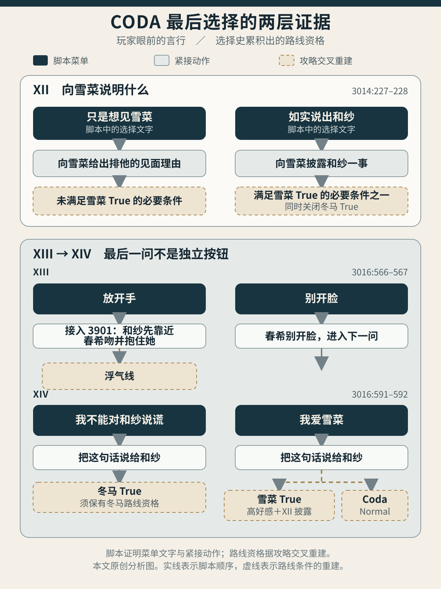
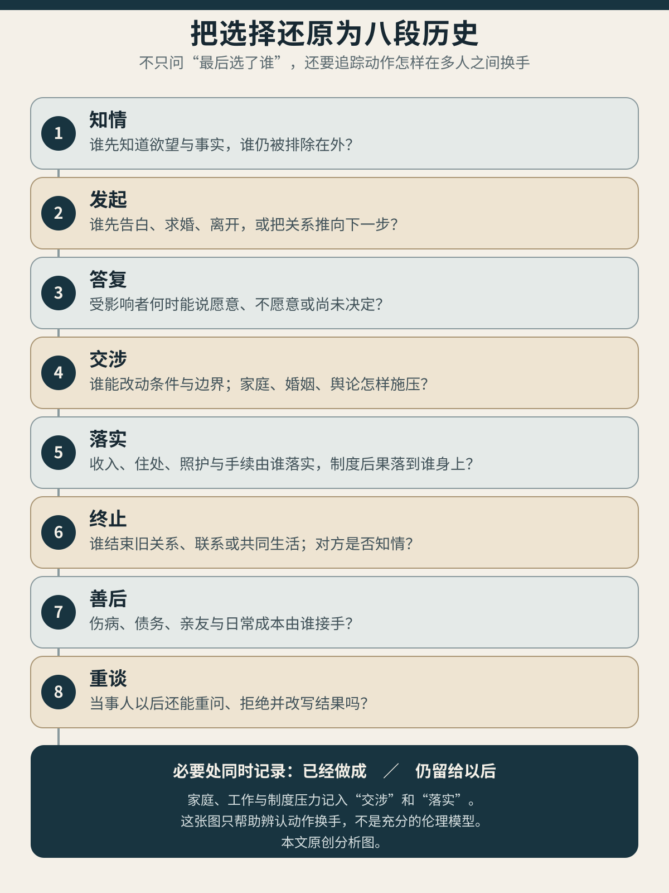

> **剧透说明**：本文涉及《白色相簿2》Coda 四个结局及三篇追加故事的关键情节，并讨论夏目漱石《心》（《こころ》）、《其后》（《それから》）、《门》（《門》）的结局。游戏选项文字与人物动作按日文脚本复核，路线条件另由两份攻略交叉核验。[^source]
>
> **封面说明**：封面为本站原创概念图。一封空白的信经过分支、门与住宅，最后停在尚未填写的回信处；它不是游戏画面、文学档案或具体场景复原。
>
> **配图说明**：正文两图均为本站原创分析图。第一张把脚本直接写出的菜单和动作，同攻略重建的路线条件分开；第二张只帮助追踪一项选择怎样在多人之间换手。正文承担全部判断，图像不替代原文证据。

大阪的餐桌前，春希要回答雪菜为什么追来。屏幕给出两句话：“只是想见你”与“把和纱的事如实说出来”。

两句话各有一部分真。春希确实想见雪菜，也确实从和纱的音乐会逃了出来。第一项把前半句话说成全部理由，接下来的动作十分顺利：两只手在桌上叠到一起，春希早已订好双人房，二人准备把这几周当作没有发生。第二项则从“我又在见冬马，每天都见”说起，把相邻的房间、连续两周的照料、隐瞒，以及同和纱相处时的快乐一件件交代出来。雪菜没有扑进他怀里。她先说自己已经知道，听完以后又说：“即便如此，我也不会原谅你。”[^xii]

她这一巴掌轻得几乎伤不到春希，随后却改变了当晚所有人的去向。雪菜要求春希回去面对和纱，拒绝让他拿自己作逃跑的地方，也规定自己暂时不会主动联络。两人离开时没有接吻，没有牵手，连指尖也不曾碰到。脚本把差别写得很具体：同一个人来到同一座城市，说出多少事实，决定了另一个人还能不能叫停拥抱、规定距离，并把他送回尚未处理完的关系。

最后两组菜单来得更晚。和纱提出只到冬末为止的“假爱”，屏幕先让玩家“放开手”或“别开脸”。春希原本扣着和纱的双腕；“放开手”首先恢复的是和纱双手的自由，她捧起春希的脸试探靠近，春希随后把试探变成真正的吻，并主动抱紧她，由此进入浮气线。别开脸才是当夜的身体拒绝，也只有这样，下一问才会出现：“我爱雪菜”或“不能对和纱说谎”。同一句“我爱雪菜”，又会因大阪那次披露及此前累积的路线条件不同，分别落向雪菜 True 或 Coda Normal。[^menus]

*最后一句不是独立四选一。实线只表示脚本中的菜单与紧接动作；虚线表示两份攻略交叉重建的路线资格。本站原创分析图。*

三组菜单还分给了三个不同现场。第十二问决定春希向雪菜说明多少；第十三问先处理他与和纱此刻的身体界线；第十四问虽然句中出现雪菜，真正听见的人仍是和纱。雪菜不在最后一句的现场，和纱也不在大阪听春希披露。游戏没有给三个人一张同时按下的终局表，只让玩家在三对关系之间接连行动；较早一处留下的事实，会使较晚一处的某些按钮失去资格。

“不能对和纱说谎”也没有让春希当场选择和纱。他接着说，自己此刻仍不能接受她，也还没有作出决定；真正的互相逼问要等五天以后，和纱从机场折返才完成。这个按钮通向冬马 True，是攻略重建出的路线走向，不等于第十四问已经替人物做完最后选择。[^menus]

这几项设计把“选择”从一个按钮拉成了一段历史。最后一句有多大分量，要看此前谁知道了什么，谁先开口，谁得到回答的工夫，谁又把一句话变成住房、工作和下一次见面。[上一篇《失格者的罪，旁人的日子》](/posts/white-album-2-guilt-and-the-days-after/)已经追过认罪以后由谁付钱、照病、停下伤害；这篇继续追问那笔账的时间次序：一个人作出选择以后，别人的日子还由谁作主？

夏目漱石的三部小说恰好把这个问题放在三个时刻。《心》写一项决定怎样赶在回答以前落定，又由一封长信封住所有追问；《其后》让迟到的真话在当事人活着时抵达，反驳与设限随即开始，收入和住处却还没有着落；《门》把关系往后推了六年，工资、家计和照护都已成形，第三个人的直接说法仍被留在门外。把三部小说同《白色相簿2》放在一起，可以看见日本文学中反复出现的一种关系：几个人的生活已经互相改写，决定、答复与过日子却落在不同人手里。[^comparison]

## 十五分钟订下的婚约

《心》里，K 拉开两间屋子之间的隔扇，向先生吐露自己对小姐的爱。先生后来写道，他几乎没有听进告白的细节；身体从僵硬中恢复以后，首先浮起的是一句：“被他抢先了。”

这句话没有把先生变成一名从头算计到尾的谋略家。K 刚开口时，他确实受惊，确实一句话也说不出来。到了当天午后，他又觉得时机已经错过，仿佛告白也有先手：K 先说完，他再说同样的话便显得“不自然”。起初的失语与后来的竞争心同时存在。先生并未先在心里写好骗局再照办；他在惊慌、羞耻与嫉妒中先一步动了起来，后来才越来越有意识地拿这一步压住 K。

几天后，K 主动请他评判自己该进还是该退。先生把 K 从前说过的“没有精神上的上进心，就是蠢人”原句掷了回去。这个词原本要求两人克制欲望、追求精神生活，此刻却成了逼 K 退却的工具。K 最后说，自己“也并非没有觉悟”。小说没有说明这份觉悟究竟指继续求爱、彻底退却，还是更阴暗的准备；先生多年后的叙述替它铺满了死亡的阴影，也不能倒过来把一句含混的话改成明确遗言。[^kokoro]

先生还问清一件要紧的事：K 没有把这份心意告诉别人。两个人的欲望、K 的迟疑、小姐与 K 日常相处的情形，都集中到先生一人手中。K 以为自己在向一位公平的朋友求取意见，先生却已经知道，这场关系里没有第二个人能校正他所掌握的版本。

隔扇把这种知情差做成了房屋本身。K 第一次拉开隔扇，跨过门槛向先生告白；先生错过回话时机以后，整日等着 K 再次从对面打开，自己却没有走过去。K 再也没有照他的期待重新开口。自杀当夜，先生醒来时看见隔扇留着一道口，K 已经倒在另一间屋里，血这才进入视野。先生总在等待对方先打开边界，等到关系无法挽回，又把“来不及”写成自己余生的中心。

先生又等了几天，始终找不到 K 与静同时出门的机会。一周后，他终于借口生病留在家中，等两人离开，才去找未亡人。他先试探 K 最近是否说过什么；未亡人反问 K 是否向他吐露过，他答“没有”，随即要求娶她的女儿。整场商议不到十五分钟。未亡人说，不必事先确认女儿本人是否愿意，因为自己不会把她交给一个不愿嫁的人。先生提醒顺序似乎应当由本人先答复，话仍由母亲代理完了。他回到房中，觉得“自己的未来命运就此定下”。

这桩婚姻后来并非只有欺骗。静爱先生，夫妻长期共同生活；先生照料岳母，祭奠 K，也真心想保护妻子。婚姻能过下去，却不能倒签十五分钟以前缺少的那句回答。母亲熟悉女儿，或许判断完全正确；她的确信依然不等于女儿已经听过两位男人之间的事，也不等于她亲口同意了形成婚约的全部条件。

《心》因而先给 Coda 一个严厉的检验：果断本身并不说明一项决定怎样成立。先生正因为比 K 和静知道得多，才能先去求婚，再把静可能怎样回答交给未亡人代说。

大阪那次谈话把这个问题翻到另一面。雪菜在春希开口前已经根据朋的目击，推知和纱曾在他家门前和演出现场出现。可“她知道”没有免除春希说明的责任。推知只让雪菜知道两人在来往；春希说出的则是自己如何接受专访、让和纱住到隔壁、每天为她做饭、替她挡开媒体，又如何一边愧对雪菜一边为相处而高兴。听到这里，雪菜手里才有了一段可以当面引用的事实，足以责问春希，也足以改动当晚的去向。

她于是能把春希的逃跑重新命名。春希说自己不想再背叛雪菜，雪菜反问：这也不能成为背叛和纱的理由。她承认自己有不愿说出的恶意，承认春希真可能一去不回，仍把他送回音乐会之后的和纱那里。雪菜没有因知情而自动变得无私；正因为嫉妒、欲望与原则都能说出来，她才从被选择的一方变成了会改变选择过程的人。

一个人早已猜中，与说话者把事实交到他面前，是两件事。前者仍让他独自承担猜测可能出错的风险；后者允许他引用同一组事实，责问、拒绝、另定边界。Coda 第十二组选项影响雪菜 True 的资格，恰好把这种差别写进了游戏形式：较早的披露，已经让雪菜能够参加后来的选择。

## 一封把妻子留在信外的长信

K 自杀后留下的信很短。他写自己意志薄弱、前途无望，向先生致谢，托付身后事，也请他代向未亡人致歉，唯独没有写小姐。先生读信时先确认其中没有会使自己失去体面的内容，随后才看到隔扇上的血。

小说没有把 K 的死归结为失恋。K 同养家决裂后的贫困、禁欲信念、长期自我逼迫和当时的精神状态都在此前出现，他的短信反而把具体原因写得极少。先生往后把自己的一生收进“我抢先，所以 K 死去”的罪史。这份自责有事实根基，也把 K 那些再也无法一一问明的缘由，全都纳进了先生自己的解释。

多年以后，先生把完整得多的版本写给青年。他从遗产被叔父侵吞写起，解释自己怎样不信任人，怎样把 K 接进未亡人家，又怎样在嫉妒中使用 K 的道德话语。信写得极长，几乎穷尽他能说的因果。静却被明确列为“唯一的例外”。先生说，不忍在妻子纯白的记忆上滴下一点黑色；他要让她以为自己猝死，哪怕被当作发狂也可以。信必须由青年保密，只要静还活着，便不得交给她。[^letter]

这封信把真诚与控制缝在同一个动作里。先生把隐瞒解释成保护：他自称并非为了在妻子面前保住道德形象，而是不忍让静承受真相。正因为他把保护说成一片真心，一项本该由静参与的决定便更容易变成必须由丈夫替她完成的照料：哪些往事属于她，丈夫为何长期阴郁，K 的墓在婚姻中意味着什么，她是否愿意在丈夫死后保存“纯白”的过去。

篇幅在这里也参与了行动。青年收到长信时，自己的父亲正在病榻上；他翻到末页，随即离家赶往东京。小说从此不再回到静身边，也不写青年父亲的结局。死者的过去占满作品最后三分之一，先生的话写满了余下篇幅，两个仍在世的人却连一句回话都没有留下。

先生把写信的十多天也预先封闭起来。他劝静去照看患病的姨母，妻子偶尔回家，便立即把稿子藏起；等信抵达青年手中，写信者已经死去。这里没有一处内容失真便足以拆穿全篇，控制发生在更深一层：谁能看到，何时看到，看完以后还能向谁核对。遗书把问答拆成两半，只让自己那一半完整留存。

因此，自白是否详尽，与受影响的人能否回答，必须分开衡量。一个人可以说尽自己的一生，同时选定听众、顺序、截止时刻和保密范围；他说得越完整，未被允许开口的人越容易被误认成已经得到照顾。

冬马 True 同《心》不能作人物对号。春希没有把决定只留在遗书里，他亲自撤回婚约，提交辞呈，完成校对和工作交接，也向小木曾家说明自己将迁居维也纳。这条线最强之处，正在于他真的走出去把这些事一件件办了。可他同曜子商议病情时仍筛选了雪菜能知道的部分，又根据她有家人、朋友和工作，估算她能承受多少。雪菜确实回答了分手和牺牲。春希已经撤婚、辞职，准备把此后的生活搬到维也纳；她作答时听见的，仍只是他选出的那一部分事实。[^kazusatrue]

这里没有一道“全盘托出”便可解决问题的处方。K 把欲望只说给竞争者，代价惨重；先生把一生写得近乎无遗，又以死亡堵住妻子；春希若把曜子的病情当作逼迫雪菜接受选择的筹码，同样会伤害相关者。判断披露的尺度，要回到它给听者留下了什么：他能否询问，能否暂缓，能否指定只由某人知道，能否说自己现在不愿听。

第十二组选项的力量正在于，披露发生在终局以前。雪菜听完以后，既没有立即宽恕，也没有被迫作最终裁决。她只处理当晚：不拥抱，不让春希躲在自己这里，暂时不主动联络，需要她时可以来找，但若为了逃跑，她不会听。真话并未解决三人关系，它先把一小段尚可改动的时间还给了雪菜。

## 迟到三年的真话，终于有人回嘴

《其后》的代助用了三年才说出爱。

告白那天，他先确认平冈正在报社，随后冒雨买来大捧白百合，把三千代召到自己家中。雨声把两人与门野、女佣和外面的社会隔开，百合的气味充满房间。代助在心里说，自己终于回到了“自然”的过去。可这个看似由自然涌出的时刻，从丈夫不在场、车马接送、花钱买来的百合到可供独处的住宅，都经他逐项布置。雨给屋内的男人造成隔绝与美感；三千代在小说另一处说得很直白，她穿着草履冒雨而来，并不觉得这是“好雨”。[^sorekara]

代助先说：“我的存在需要你。”三千代哭着回的第一件事，却是“为什么把我抛下了”。他承认三年前本该开口，又把自己一直未婚说成所受的惩罚。三千代立即追问：那不正是你自己的选择吗？

这句回答改变了告白的意义。代助想把三年独身作为忠贞与赎罪的凭据，三千代却把那三年的主语还给了他。她没有否定代助的痛苦，也没有让过去的沉默变得无害；代助从此不能再把“不结婚”说成三千代施加的复仇。

三千代随后说：“事已至此，我们下定决心吧。”她由此亲手把关系向前推了一步，却没有同代助订下一份现成的生活。她仍处在婚姻中，患有心脏病，家中欠债，也没有独立收入。代助被父亲断绝供给以后，很快明白，自己所谓“负责”尚且只是一个目的，绝不是已经负起责任的事实。他知道钱是两人过日子绕不开的一关，脑中却只有“职业”两个字，没有任何一项具体工作。

三千代没有让这场告白只停在她和代助之间。她病倒后，平冈停下工作，请医生、守着病妻；看护的第二晚，她要求丈夫去问代助，第三天又提了一次。于是三名当事人先后开了口，却没有一场三人同室的对质。平冈听代助说了一个多小时，追问他是否明知有错仍步步推进，也规定两人自此绝交，代助不得再进家门。谈到三千代，他使用“给你”这种把女人当作可转让之物的语言；与此同时，他拒绝在她病中把人交出去，因为自己仍负有丈夫的看护责任。

平冈因而不能简化成阻碍真爱的旧丈夫。他是受伤者，也曾使三千代在婚姻里受苦；他以男性之间的转让语法说话，又实际请医、停职照护并设下边界。平冈开口以后，局面并未就此变得公正，代助那套关于“自然”的长篇说明却第一次遭到另一名当事人的盘问。

小说最后，家族已把代助除名，三千代仍病着，离婚、住处和共同收入都没有落实。代助郑重叫了一声“门野先生”，说自己要去找工作，冲进盛夏街头。电车开动，邮筒、招牌、气球与旗帜的红色接连闯入他的视野，世界最后变成一片旋转的赤红。他刚刚起身去找工作，两人的生活还没开头。[^sorekara-life]

书名《其后》也把这一缺口留给读者。小说没有在告白后补一段成败交代，反而把“从此以后”放在封面上，再于人物刚要找工作时收笔。代助此前能够长篇解释文明、自然和自由，结尾却只剩赶路、电车和颜色。三千代的短句、平冈的质问、父亲的断供，以及街上的电车和扑面而来的红色，一层层夺走了他把世界留作审美对象的从容。

《其后》把《心》留下的死结打开了一半。真话在相关的人还活着时抵达，三千代可以责问，平冈可以设限，代助的自我说明也会被打断。另一半仍悬在书外：谁提供收入，三千代如何治疗，婚姻怎样终止，三个人此后还能否修改今天的话。

雪菜 True 走过相近却更长的一段路。大阪的披露让雪菜较早知道危机；春希后来请她“救和纱”，雪菜听出他把和纱置于自己之前，仍答应同他认真考虑并持续介入。她同和纱真正发生冲突，和纱也把春希的婚恋位置与自己在他生命中的位置分开说明。相较于《其后》的结尾，这条线又往前走了几步：三个人重新演奏，编辑与录音也接了上来，下一次共同工作已经开始。压力却没有消失。调停和恢复联系大半由雪菜安排；春希催她当场回答，雪菜为自己争取五分钟，把多年未寄出的邮件里藏着的嫉妒、怀疑与愤怒说完，随后才接受求婚。[^setsunatrue]

直接冲突值得珍惜，因为别人终于能反驳主人公心中的版本。它仍只是生活的入口。争吵之后谁安排下一次见面，这次答复又能否改变后续安排，决定了冲突打开的是新关系，还是一次更漂亮的结案。

## 六年以后，安井仍没有开口

《门》没有正面写宗助、御米和安井之间最关键的变故。叙述只说，事情在冬末到暮春之间发生，像一阵大风把两个人吹倒；他们起身时满身是沙，甚至不知道自己何时被吹倒。谁先表白，御米怎样回答，安井何时取得消息，小说一项也没有交代。读者只能确认宗助与御米后来结合，二人离开学校与亲友，至于御米同安井原有何种法律关系，也不能从结果反推。[^mon]

漱石把爱情高潮挖空，反而用整部长篇写选择以后。

六年间，宗助和御米几乎没有红过脸。他们买布做衣，取米做饭，靠一份官俸过日子。小说说两人像水面上的两滴油，被水排斥以后聚成一处，终于无法分开。这个比喻同时保留了两件事：他们的亲密真实而深厚，亲密的形状也由社会排斥逼成。他们主动抛下亲友，或者说，也被亲友和学校抛下；主动与被动在同一句话里互相改写。

御米没有留下当年选择宗助的台词，却不断决定六年后的生活。宗助为弟弟小六的学费发愁时，是她提出腾出摆着镜台的六叠间，提供食宿，再让两边分担其余费用。她还把宗助从父家取回、挡路又无用的抱一屏风拿去询价。旧货商先报六元，她鼓起勇气指出画家，夫妻后来等到三十五元才卖；屏风到了崖上坂井家，购入价已经是八十元。同一件东西换了房屋与所有者，身价便跟着改变。御米算钱、让房、议价的行动，把抽象的“为爱受苦”还原成可住的房间和穿得出去的衣服。

《门》的住宅正在一道崖下，坂井家在崖上。两家相距很近，来往却要绕路；阳光、孩子、藏书、佣人和可供鉴赏的屏风集中在上面，宗助御米则在下面核算鞋、米和月薪。屏风从低处卖出，再以高价进入崖上，不只嘲弄夫妇不识行情，也让关系能够维持的条件显形。宗助御米拥有深厚的二人生活，生活的宽窄仍由工资、房产和他人劳动划定。

她病倒时，照护也不是宗助一人的爱情证明。宗助替她按住疼痛的肩，小六去借电话、取药，清换水并做湿敷，医生看诊后留下处置。宗助确实在焦急中照料妻子，御米又常在难受时先向他微笑，免得丈夫担心。二人的爱没有因旧日越界便成为赝品；恰恰因为日常是真的，安井没有取得回答这件事才不能用“他们已经受苦六年”抵消。

安井后来从满洲返东京，差点同宗助一起被请到坂井家吃饭。宗助当晚回家，只说自己不舒服。御米问了两次，他躲进被中，本想叫她来共同承受；等她真的来到枕边，他说出口的却是：“给我一杯热水。”叙述紧接着明说，他失去把话说完的勇气，撒谎蒙混过去。

这个谎言保护御米免受当晚的惊吓，也把原本共同的旧事变成宗助一人掌管的危机。他想偷偷看安井一眼，从对方外表确认自己没有把他毁掉，又不愿让安井回望。后来他向坂井迂回探问，只得到安井已经离京的消息。宗助知道了行踪，安井仍没有亲口说自己的退学、疾病与远行怎样发生，更没有表示愿意见面、拒绝见面或由第三人转达。

宗助甚至独自去寺院求安心。他没有向御米说明触发这次出走的事情，寺院也没有替他打开那扇门。十日以后回家，危机因安井离开而暂退，夫妻生活重新安稳。结尾处御米看着春光说，总算到了春天；宗助低头剪指甲，答道，很快又会到冬天。春天就在眼前，宗助也确实得到了短暂安稳；他紧接着预告的冬天，则让那桩从未共同重谈的旧事，仍有可能随消息、人物和季节回来。[^mon-return]

《门》给 Coda 的压力同《其后》正相反。《其后》已有答复，尚无生活；《门》已经把生活过了六年，答复仍不完整。收入、家务、照病和长期相爱都不能替安井发言；安井的发言也不能反过来抹掉夫妻六年的劳动。两笔事实必须同时保留。

## 把选择还原成一段历史

从《心》《其后》《门》回到 Coda，四个结局便不能只按最后选了谁排列。一段关系走到结局，至少要问八遍：谁先掌握事实，谁先把事情向前推，受影响的人何时答复，家庭与职场怎样介入，决定由谁落实，旧关系如何终止，后果落到谁身上，结局以后还能不能重谈。八问不是八项美德，也不要求每个人都在同一房间把话说尽；拒绝见面、委托转达和由本人决定沉默，都可以是回答。

这八件事常常叠在一起。说出隐瞒，本身就可能把关系推向下一步；照护既在收拾后果，也可能开始下一次商量；结束一段秘密，又会开启一段公开生活。把它们拆开，是为了不让最响亮的动作吞掉其余动作：辞职不会替雪菜回答，直接争吵不会自动供应住房，一段婚姻过了六年，也不会使安井的行踪等于安井的说法。

*把选择拆成八问，是为了看清动作何时换手，并非给四条路线评分，也不是一套包办一切的关系模型。本站原创分析图。*

四条路线按这八问横排，动作怎样换手便清楚得多。下表只记本篇承重事实；必要处同时写已经发生的动作与文本没有写出的答复。[^normal][^affair][^kazusatrue][^setsunatrue]

| 阶段 | Coda Normal | 浮气线 | 冬马 True | 雪菜 True |
| --- | --- | --- | --- | --- |
| 知情 | 春希明白自己仍爱两个人；雪菜如何听到最终决定，文本没有写 | 春希与和纱清楚限到冬末的约定；雪菜没有参加定约 | 春希与曜子知道病情和出发时机；雪菜只听到筛过的信息 | 大阪谈话让雪菜较早听到两人来往的细节；此后三人共同面对曜子的病情 |
| 发起 | 春希拒绝当夜越界，在心里决定留在雪菜身边 | 和纱提出限期关系，春希以吻和拥抱接受 | 春希骗出一次会面并提出离日；和纱随后要求他亲口选自己 | 春希请雪菜救和纱；雪菜答应同他认真考虑，随后以旧友和唱片公司员工的身份持续介入 |
| 答复 | 和纱听见春希说爱雪菜；雪菜怎样回应最终选择，文本没有写 | 和纱先得到春希以吻和拥抱作出的回答；数日秘密生活结束后，春希才向早已察觉的雪菜明说，雪菜随即回应 | 春希要求和纱亲自决定；五天后，和纱要求他背叛雪菜、选择自己；雪菜明确反对分手，却不知道曜子的病情 | 和纱与雪菜直接反驳彼此；春希逼雪菜当场答复，雪菜先为自己争取五分钟宣泄，随后接受求婚 |
| 交涉 | 一年后的婚约、婚礼筹备与同小木曾家的往来已经可见；商量过程留在叙事跳时之外 | 这段秘密关系没有把雪菜、家庭与职场纳入共同商量 | 春希亲自面对公司、小木曾家和身边人 | 雪菜同曜子、和纱商量演奏与唱片方案；春希同编辑部协调增刊，小木曾家最后进入三人晚餐安排 |
| 落实 | 婚约、同小木曾家的往来和编辑工作已经组成公开日常 | 春希与和纱把限期关系过成数日同居、出走的秘密生活 | 春希逐项撤婚、辞职、交接并准备迁居 | 三人先完成作词、作曲、排练和录音；求婚获接受后，增刊与合录歌曲发售，雪菜又安排三人到小木曾家听碟、吃饭 |
| 终止 | 春希拒绝当夜越界；心里仍没有同和纱彻底告别 | 和纱在清晨决定结束并要求分开，春希随后向雪菜坦白 | 春希结束婚约和原有工作；离境也切断了继续当面交涉的条件 | 和纱把春希推回雪菜身边；两人终止成为恋人的可能，却约定保留三人友情 |
| 善后 | 春希与雪菜的公开生活已经稳定；和纱在日本媒体中消失，追加公演取消，离日后的个人生活没有展开 | 雪菜、医护与同事在随后一年接住春希的崩溃；这些照护来得再久，也迟于雪菜未曾参与的最初约定 | 雪菜及留在日本的人承受断裂；春希和和纱在海外另建生活 | 增刊与合录歌曲发售，和纱把事业据点迁回日本；雪菜安排春希与和纱到小木曾家听碟、吃饭 |
| 重谈 | 现有追加故事没有单独回到此线；往后如何改约，文本未写 | 冬雪通话重新商量善后；能改后来，不能补上雪菜在秘密开始前的回答 | 曜子重住并复原旧宅，春希与和纱重访学校并在那里补办婚礼；两人仍没有同雪菜共同重谈 | 夫妻双方都因突发工作失约，通话说明后改约为工作结束时会合；这只重谈了婚姻内部的一次约定 |

这样横看，Coda Normal 和雪菜 True 的差别便落在了同一句话的前后。同一句“我爱雪菜”都由春希说给和纱听；前者把这句话直接接到一年后的婚约与日常，雪菜怎样听见、怎样回答没有写出。后者因大阪较早的披露，让雪菜赶在终局以前参加了危机处理。她组织冬雪见面，也当面接受求婚；春希催她立刻回答，她则先为自己争取五分钟，把压住多年的话说完。Coda Normal 留下的是一段叙事空白，不能据此断言雪菜从未知道，或那一年全是虚假。

浮气线和冬马 True 同样承认春希爱和纱，事情却由不同的人向前推。和纱提出限到冬末的关系，春希以吻接受，婚约、家庭与职场于是被绕开；这段秘密生活实际只过了数日，和纱便在清晨决定结束，春希才向雪菜坦白。冬马 True 则由春希骗出谈话、提出离日，再亲自去撤婚、辞职、交接和准备迁居；和纱又从机场折返，要求他把最后一句放在自己名下。春希把决定办进了公开生活，递给雪菜的病情仍经过筛选。春希事后坦白，雪菜随后照护；两件事都发生在秘密生活以后，无法补上她在起点处的缺席。

三篇追加故事只各自改动了一小处。浮气线后的冬雪通话重新商量善后；冬马 True 后，曜子复原旧宅，春希与和纱返校并补办婚礼，重开的是返日生活，不是同雪菜的共同重谈；雪菜 True 后，夫妻双方说明因突发工作失约，改约后会合。[^after] 这些变化都是真的，却没有一篇把三个人带到同一张桌前重谈全部往事。Coda Normal 没有同样的独立文本，能说的也只到这里，不能拿篇幅替作者判定它的未来。

玩家的位置也要单独记一笔。玩家读过四线，知道每个人在别处说过什么；当前路线里的人物没有这种跨线记忆。按钮使一条可能的历史成为现实，却没有把玩家的全知分给雪菜、和纱或春希。读者因此可以比较各线，不能用自己掌握的全部文本替未获知情者回答。

《心》的婚约先于静的答复，《其后》的答复先于共同生活，《门》的共同生活又先于安井的说法。Coda 也把动作拆给三个人：春希拒绝、坦白、撤婚、辞职和求婚；和纱提出限期关系，又在清晨决定结束；雪菜叫停春希的逃跑，逼两个人互相开口，再把合奏和工作接起来。春希的决定总会遇到另外两人的靠近、拒绝或善后，四条路线没有一条只由最后按下按钮的人造成。

判断一个选择，不妨追到话说完以后：雪菜何时听见，和纱何时能说“不”，春希办完辞职以后还允许谁回来改口。最响亮的决断如果把这些时刻一并封住，往后的日子便只剩照办；那些迟疑、嫉妒甚至难看的回答，至少让明天还可以推翻今天的一部分。

本篇追到这里，已经看清一句选择怎样赶在别人开口以前落定，又怎样被别人的回答重新打开。[下一篇《雪国之外，仍是人间》](/posts/white-album-2-beyond-snow-country/)将进入旅馆、相邻房间、数字暗号和一场大雪，看这些房间、日程与劳动怎样让公开生活的追问暂时进不来。

[^source]: PS3 版资料见 [AQUAPLUS《WHITE ALBUM2 幸せの向こう側》产品页](https://aquaplus.jp/wa2/)；日文台词按本地保存脚本逐行复核，公开检索入口见 [MAO Translations Script Browser](https://mao-tls.github.io/white-album-2/script/)。夏目漱石三作固定采用青空文库新字新假名版：[《こころ》图书卡 773](https://www.aozora.gr.jp/cards/000148/card773.html)、[《それから》图书卡 56143](https://www.aozora.gr.jp/cards/000148/card56143.html)、[《門》图书卡 785](https://www.aozora.gr.jp/cards/000148/card785.html)；本文中文短引据日文重译。
[^xii]: Coda 第十二组选项、两项分支及雪菜答复：`wa2:coda:3014:227–524`。选择“只是想见你”以后，春希隐去和纱这一原因，二人牵手、订下双人房并准备共度一夜：`229–287`；如实说明以后，春希交代连续见面、相邻房间、隐瞒与照料，雪菜拒绝拥抱、规定距离并要求他面对和纱：`288–524`。
[^menus]: 第十三组选项与紧接拒绝：`wa2:coda:3016:555–590`；“放开手”后的完整动作次序见 `3901:1–20,41–53,68–70,90–95`，由和纱先以恢复自由的双手靠近，春希再完成吻与拥抱。第十四组选项及两项展开：`3016:591–646`；“不能对和纱说谎”后的当场拒绝与仍未决定：`3016:617–646,655`；五天后和纱从机场折返并作答：`3102:270–350`。具体路线资格由 [NMM 的 PS3／Vita 路线记录](https://nmm.blog.jp/archives/21904551.html)与 [Atwiki 四结局攻略](https://w.atwiki.jp/whitealbum2/pages/16.html)交叉重建；大阪披露是雪菜 True 的必要条件之一，不是充分条件。[AQUAPLUS 官方系统说明](https://aquaplus.jp/wa2/system03.html)只能证明暗色选项不可按下，不能证明各项精确解锁条件。
[^comparison]: 本文讨论作品之间可以互相检验的关系结构，不主张丸户史明直接受漱石三作影响。小说固定结尾与视觉小说分支的形式不同；死亡、婚姻法律、明治时期的阶级和殖民流动，也不能由 WA2 的现代职业与跨国迁居替换。
[^kokoro]: K 告白及先生感到被抢先：`aozora:000148:000773:p001200–p001204`；K 说明未向别人吐露：`p001224–p001225`；先生把“精神的上进心”用作竞争武器及 K 含混的“觉悟”：`p001229–p001245`；等待机会、借口生病、试探未亡人、撒谎、求婚与代理女儿答复：`p001257–p001266`。K 的“觉悟”和死亡均不作失恋单因解释。
[^letter]: 青年翻到长信末尾并从病父身边离开：`aozora:000148:000773:p000965–p000986`；K 短信及先生先注意体面风险：`p001283–p001288`；先生以保存静的纯白记忆为由隐瞒：`p001313`；安排静离家、写成长信并命青年终身保密：`p001342–p001345`。
[^sorekara]: 代助确认平冈不在、买白百合并在雨中布置告白：`aozora:000148:056143:p001399–p001416`；三千代追问被抛弃、拒收代助的三年独身自罚并说出决意：`p001450–p001486`；另一场雨中对话里，代助赞雨，三千代答自己穿草履而来，一点也不喜欢：`p000935–p000941`。`御勝手` 译作“你自己的选择”属解释性自译；`覚悟を極めましょう` 不写成已经完成同居协议。
[^sorekara-life]: 断供及代助承认“负责”仍只是目的：`aozora:000148:056143:p001553–p001559,p001583–p001618`；三千代病中一再要求说明、平冈照护并同代助交涉：`p001670–p001705,p001740–p001761`；代助说去找职业及赤色结尾：`p001822–p001827`。三人先后发言，并无三人同场对质。
[^setsunatrue]: 雪菜 True 的求援、共同思考与持续介入：`wa2:coda:3202:1–65`；春希承认把同和纱的解决丢给雪菜：`3210:720–727`；冬雪直接冲突：`3203:69–288`；电话合奏与不排除请求：`3207:152–250`；和纱区分关系位置：`3210:572–618`；求婚、未发送邮件、“五分钟”与接受：`3210:550–944`；共同工作：`3211:1–117`。
[^mon]: 宗助御米关系高潮的形式性省略：`aozora:000148:000785:p000917–p000920`；六年婚姻与“两滴油”：`p000851–p000854`；御米安排小六住房与家计：`p000353–p000360`；屏风议价及所有者变化：`p000453–p000479,p000660–p000672`；多人照护御米：`p000710–p000769`。文本不能确认御米与安井原有的法律关系，也不能指定早年越界由谁发起。
[^mon-return]: 安井返京、宗助临门改口为“一杯热水”及叙述明说撒谎：`aozora:000148:000785:p001010–p001036`；宗助想暗中观察安井：`p001060–p001068`；参禅无所得、回家后迂回取得安井行踪：`p001196–p001254`；春天与冬天的末句：`p001255–p001272`。安井已经物理返京，缺少的是他在关系中的直接说法。
[^kazusatrue]: 冬马 True 的假告别留言、离境提议与和纱折返：`wa2:coda:3101:1–65,3102:189–350`；对雪菜病情信息的筛选：`3103:303–315,383–411`；辞职、家庭说明、工作交接与迁移准备：`3105:21–45,3106:287–304,3107:114–325,3108:87–121`。
[^normal]: Coda Normal 上游的当夜拒绝与终局选项：`wa2:coda:3016:568–616`；雪中内部决定：`3023:328–363`；一年后的婚约、家庭与工作：`3024:1–78`。公开告知与雪菜答复没有展示，不得据此写成“从未告知”或“雪菜没有回答”。
[^affair]: 浮气线框架与入口：`wa2:coda:3016:555–567,3901:5–121`；秘密生活的实际时长与披露时点：`3908:248,462–471`；和纱形成终止意向、两手最终分离：`3908:204–242,723–797`；脚本没有交代最后手部动作的施事。春希披露与雪菜回答：`3908:463–610`；雪菜与职场承接善后：`3909:27–34,89–179`。
[^after]: 《不倶戴天》只取电话重开与雪菜恢复行动：`wa2mas:kazusa_normal_extra:4009:184–698,703–1029`；冬马 True 后的有限返回及社会中介：`wa2mas:kazusa_true:6004:44–55,89–119,159–195;6005:131–236`；雪菜 True 后夫妻说明失约、改约和会合：`wa2mas:setsuna_true:6102:1–35,131–224`。三项只证明不同的两人之间还能重开往来，不据此给路线排名。
